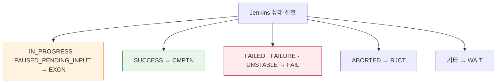
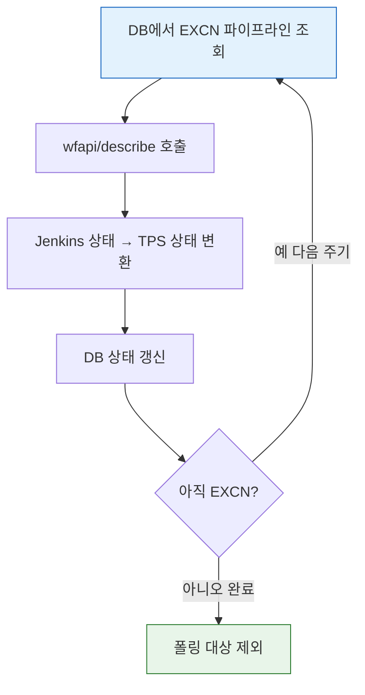

# 젠킨스 빌드 상태 추적 모델과 TPS 패턴 (2.222+)

> **본 문서는 spec(`06-01.md`)을 읽었다고 가정한 운영 해석과 TPS 매핑 패턴**입니다. 상태 조회 endpoint(`/api/json`, `wfapi/describe`, `/queue/api/json`)의 호출 형식은 spec에 있습니다. 이 문서는 그 위에서 TPS가 DB·매핑·폴링을 어떻게 설계하는지를 정리합니다.
>
> Blue Ocean/Workflow API 현대화 판단: `06-03.md`. 인증 모델 차이가 POST에 미치는 영향: `03-02.md`.

> 이 문서를 읽고 나면 Jenkins 경로·빌드번호를 TPS DB 레코드와 매칭하고, Jenkins의 여러 상태 신호(큐·코어·wfapi)를 TPS 상태 코드로 매핑하며, 실행 중 빌드만 대상으로 하는 폴링 잡(PipelineSyncJob)을 설계할 수 있습니다.


## 사전 지식

> 06-01에서 본 빌드 상태·wfapi 조회를 알고 있다면, 이 문서는 그 원시 상태를 "운영 시스템이 저장·매핑·폴링하기 좋은 도메인 상태"로 가공하는 TPS 패턴입니다. 상태 조회가 `GET /{object}/api/json`처럼 객체 URL 뒤에 `/api/`를 붙이는 일반 규칙을 따른다는 점(출처: jenkins.io/doc/book/using/remote-access-api)도 전제합니다.


## 진입 — 왜 Jenkins 상태를 그대로 쓰지 못하는가

> 외부 운영 시스템이 Jenkins 빌드를 추적하려면, Jenkins가 주는 여러 상태 신호를 자기 도메인 상태로 번역하고 그 변화를 능동적으로 따라가야 합니다.

Jenkins는 빌드 상태를 한 곳에 모아 푸시해 주지 않습니다. 큐에서는 큐 API가, 실행 중에는 코어 build API가, 스테이지 진행은 wfapi가 각각 다른 필드로 상태를 줍니다. 게다가 Jenkins는 상태가 바뀔 때마다 외부에 알려주지 않으므로, TPS 같은 운영 시스템은 (1) 어느 빌드가 어느 DB 레코드인지 매칭하고, (2) 흩어진 상태 신호를 소수의 도메인 상태로 좁히고, (3) 실행 중 빌드만 골라 주기적으로 다시 묻는 폴링을 직접 설계해야 합니다. 이 세 가지가 이 문서의 뼈대입니다.


## 1. DB와 Jenkins 파이프라인 매칭

> 이 매칭은 이미 아는 "외래 키로 두 시스템의 레코드를 잇는다"의 경로 기반 버전입니다. PK 대신 폴더 경로 문자열이 키 역할을 합니다.

TPS와 Jenkins 사이의 파이프라인 식별은 폴더 경로 기반입니다. TPS DB에 저장된 필드와 Jenkins 경로는 보통 이렇게 대응됩니다:

```text
TPS DB 레코드                   Jenkins URL 경로
taskCd  = ACME-001              /job/ACME-001
envrnCd = DEV                   /job/ACME-001/job/DEV
bizNm   = payment-build         /job/ACME-001/job/DEV/job/payment-build
# 각 폴더 레벨마다 /job/ 세그먼트가 한 번씩 끼는 이유:
# Jenkins는 폴더를 중첩 Job으로 보고, URL에 폴더 깊이만큼 /job/ 을 반복하기 때문입니다.
```

이 변환을 담당하는 것이 `PipelineStructVo`입니다. `taskCd`, `envrnCd`, `bizNm`으로 Jenkins 폴더 경로를 구성하고, `bizNm`이 비어 있으면 트리거 파이프라인으로 해석합니다.

경로를 폴더 트리에 비유하면, `taskCd`는 최상위 디렉토리, `envrnCd`는 그 아래 환경 디렉토리, `bizNm`은 실제 빌드 잡 파일에 해당합니다. 이 비유는 "경로가 곧 식별자"라는 점까지 유효하지만, 같은 경로에 빌드가 여러 번 실행되면 디렉토리만으로는 특정 실행을 가리킬 수 없어 깨집니다. 그래서 다음 절의 `buildNumber`가 필요합니다.

### 1-1. 빌드 번호 매칭

빌드 실행 시에는 경로뿐 아니라 `buildNumber`까지 맞춰야 합니다. 문제는 Jenkins 빌드 트리거가 비동기라는 점입니다. `build` / `buildWithParameters`는 POST 요청이고(출처: jenkins.io/doc/book/using/remote-access-api), 호출 즉시 빌드 번호를 돌려주지 않습니다. 대신 큐에 들어간 항목을 가리키는 `queueId`만 먼저 잡힙니다.

TPS는 보통 다음 순서를 씁니다:

1. 빌드 트리거
2. `queueId` 확보
3. `buildNumber` 확보
4. `struct + buildNumber`를 DB에 저장

이 정보가 있어야 이후 상태 조회와 로그 조회가 같은 빌드를 가리킬 수 있습니다. `queueId → buildNumber` 전환은 우편물 접수에 비유할 수 있습니다. 접수증(queueId)을 먼저 받고, 실제 배송이 시작되면 송장번호(buildNumber)가 붙는 식입니다. 이 비유는 "접수와 실행이 시간차로 분리된다"까지 유효하지만, 큐 항목이 취소되면 송장번호가 영영 생기지 않을 수 있다는 점에서 깨집니다. 그래서 폴링은 `buildNumber`가 확정된 빌드만 안전하게 추적합니다.

### 1-2. VO 구조 요약

TPS에서 상태 추적까지 포함해 자주 등장하는 VO는 다음과 같습니다:

| VO | 역할 | 주요 필드 |
|------|------|------|
| `JenkinsToolVo` | Jenkins 서버 접속 정보 | `url`, `id`, `password`, `basicAuth` |
| `PipelineStructVo` | 파이프라인 폴더 경로 | `taskCd`, `envrnCd`, `bizNm` |
| `JenkinsJobVo` | 파이프라인 전체 정의 | `pipelineStructVo`, `jenkinsFile`, `jenkinsJobParamVoList` |

`JenkinsToolVo`의 `password` 필드는 운영에서 점차 API 토큰으로 채우는 추세입니다. 토큰은 노출돼도 해당 토큰만 폐기하면 되고 비밀번호는 그대로 둘 수 있어 권장되기 때문입니다(출처: jenkins.io/doc/book/security/managing-security).


## 2. Jenkins 상태를 TPS 상태로 어떻게 바꾸는가

> 이것은 이미 아는 "Anti-Corruption Layer(외부 모델을 내 도메인 모델로 번역하는 경계)"의 상태 코드 버전입니다. Jenkins의 풍부한 상태를 TPS의 소수 코드로 좁히는 번역 경계입니다.

### 2-1. Jenkins는 상태를 한 값으로만 표현하지 않습니다

Jenkins는 "현재 상태"를 하나의 enum으로만 주지 않습니다. 조회하는 API와 시점에 따라 서로 다른 상태 신호를 줍니다. 어떤 객체든 그 URL 뒤에 `/api/json`을 붙여 조회할 수 있고(출처: jenkins.io/doc/book/using/remote-access-api), 객체마다 노출하는 상태 필드가 다릅니다.

대표적으로 나뉘는 축은 다음과 같습니다:

| 구분 | 어디서 보나 | 상태 예시 | 의미 |
|------|------|------|------|
| 큐 상태 | `/queue/api/json` | `WaitingItem`, `BlockedItem`, `BuildableItem` | 아직 빌드 번호가 생기기 전 대기 상태 |
| Job 메타 상태 | `/{pipelineStruct}/api/json` | `inQueue`, `buildable`, `color=blue_anime` | Job 레벨의 빠른 상태 |
| 코어 빌드 상태 | `/{pipelineStruct}/{buildNumber}/api/json` | `building=true`, `result=SUCCESS` | 빌드 전체의 실행/종료 상태 |
| Workflow 전체 상태 | `wfapi/describe` | `SUCCESS`, `FAILED`, `PAUSED_PENDING_INPUT` | 파이프라인 전체 관점의 상태 |
| 스테이지 상태 | `wfapi/describe.stages[]` | `IN_PROGRESS`, `NOT_EXECUTED`, `ABORTED` | 개별 stage 관점의 상태 |

즉 Jenkins 상태를 해석할 때는 "어느 API의 어떤 필드인가"를 먼저 구분해야 합니다. 폴링처럼 같은 객체를 반복 조회할 때는 코어 build API에 `?tree=building,result`를 붙여 응답을 줄이는 게 누적 효과가 큽니다. 응답 축소(`tree=`·`depth=`)의 동작 원리와 절감 수치는 [09-03. API 쿼리 최적화와 운영](09-03.API%20%EC%BF%BC%EB%A6%AC%20%EC%B5%9C%EC%A0%81%ED%99%94%EC%99%80%20%EC%9A%B4%EC%98%81.md)을 참조합니다.

### 2-2. 실제로 어떤 상황일 때 그런 상태가 되는가

자주 보는 상태를 상황별로 풀면 다음과 같습니다:

| 상태 신호 | 언제 그렇게 되는가 |
|------|------|
| `queue: WaitingItem` | Quiet Period를 기다리거나, 큐에 들어갔지만 아직 실행 준비 전일 때 |
| `queue: BlockedItem` | 이전 빌드, 동시 실행 제한, 자원 부족 등으로 시작이 막혔을 때 |
| `queue: BuildableItem` | 실행 조건은 충족했지만 executor나 agent를 아직 못 잡았을 때 |
| `building=true` | 빌드가 실제 시작되어 아직 끝나지 않았을 때 |
| `result=null` | 빌드가 아직 종료되지 않았을 때 |
| `result=SUCCESS` | 스크립트와 post 처리까지 정상 종료됐을 때 |
| `result=FAILURE` | `error`, shell exit code 비정상 종료, 예외 등으로 실패했을 때 |
| `result=UNSTABLE` | 테스트 실패나 품질 경고처럼 완전 실패는 아니지만 불안정 판정일 때 |
| `result=ABORTED` | 사용자가 stop을 누르거나 timeout, 강제 중단 정책이 적용됐을 때 |
| `wfapi status=IN_PROGRESS` | 파이프라인이 현재 실행 중일 때 |
| `wfapi status=PAUSED_PENDING_INPUT` | `input` 스텝에서 승인/입력 대기 중일 때 |
| `wfapi status=NOT_EXECUTED` | `when`, 이전 stage 실패, 분기 미진입 등으로 해당 stage가 실행되지 않았을 때 |
| `color=blue_anime`, `red_anime` | Job 레벨에서 최근 결과 색상 + 현재 실행 중 표시가 같이 붙을 때 |

중요한 점은 `result`와 `wfapi status`가 서로 다른 층위라는 것입니다.

- `result`는 빌드 전체 종료 결과입니다.
- `wfapi status`는 파이프라인 전체 진행 상태나 stage 상태를 더 잘게 보여줍니다.
- `color`는 대시보드용 빠른 신호에 가깝습니다.

그래서 TPS처럼 운영 시스템이 상태를 수집할 때는 보통 다음 순서로 해석하는 편이 낫습니다:

1. 큐 단계에서는 queue API를 봅니다.
2. 실행 여부와 최종 결과는 코어 build API를 봅니다.
3. 승인 대기나 stage 진행률은 `wfapi/describe`를 봅니다.

Jenkins의 여러 상태 신호가 TPS 상태로 좁혀지는 매핑을 그림으로 보면 다음과 같습니다:



대표적인 매핑은 다음과 같습니다:

| Jenkins 상태 | TPS 상태 | 의미 |
|------|------|------|
| `IN_PROGRESS` | `EXCN` | 실행 중 |
| `PAUSED_PENDING_INPUT` | `EXCN` | 승인 대기지만 아직 끝나지 않음 |
| `SUCCESS` | `CMPTN` | 완료 |
| `FAILED` | `FAIL` | 실패 |
| `FAILURE` | `FAIL` | 실패 |
| `UNSTABLE` | `FAIL` | 불안정 |
| `ABORTED` | `RJCT` | 사용자 중지 |
| 기타 | `WAIT` | 대기 또는 미분류 |

### 2-3. 왜 `PAUSED_PENDING_INPUT`도 `EXCN`인가

TPS 관점에서 승인 대기는 "종료되지 않은 실행"입니다. 그래서 사용자는 실행 중으로 보되, 승인 버튼 노출 여부는 별도 로직으로 분리하는 편이 상태 해석을 단순하게 만듭니다.

### 2-4. `sttsCdConverter()` 같은 매핑 함수의 의미

매핑 로직은 한 곳에 모으는 편이 맞습니다. 그래야 다음 세 흐름이 같은 상태 해석을 공유할 수 있습니다:

- 폴링 잡
- 승인 대기 체크
- 로그 수집 트리거

매핑을 Groovy 의사 코드로 보면 다음과 같습니다:

```groovy
// 한 곳에 모은 매핑 함수: 세 호출처가 동일한 해석을 공유하게 함
String sttsCdConverter(String jenkinsStatus) {
    switch (jenkinsStatus) {
        // 승인 대기를 IN_PROGRESS와 같은 EXCN으로 묶는 이유:
        // TPS는 "끝나지 않은 실행"을 한 코드로 다뤄 폴링 대상 판정을 단순화하기 때문
        case 'IN_PROGRESS':
        case 'PAUSED_PENDING_INPUT': return 'EXCN'
        case 'SUCCESS':              return 'CMPTN'
        // FAILED/FAILURE/UNSTABLE을 한 코드로 접는 이유:
        // 운영 화면에서 "실패"는 원인 세분화보다 재시도 가능 여부가 더 중요하기 때문
        case 'FAILED':
        case 'FAILURE':
        case 'UNSTABLE':             return 'FAIL'
        case 'ABORTED':              return 'RJCT'
        default:                     return 'WAIT'  // 미분류는 폴링 유지 쪽으로 안전하게
    }
}
```


## 3. PipelineSyncJob과 폴링 전략

> Jenkins는 중간 상태 변화를 외부 시스템에 세밀하게 푸시하지 않기 때문에, TPS는 폴링 잡을 둡니다. 이 구도는 이미 아는 "푸시 없는 시스템을 폴링으로 따라가기"의 빌드 추적 버전입니다.

`PipelineSyncJob`의 폴링 루프를 그림으로 보면 다음과 같습니다:



`PipelineSyncJob`은 보통 다음 역할을 합니다:

- DB에서 실행 중(`EXCN`) 파이프라인 조회
- `wfapi/describe` 호출
- Jenkins 상태를 TPS 상태로 변환
- DB 상태 갱신

이 폴링은 알람시계에 비유할 수 있습니다. 스스로 깨워주는 사람이 없으니 일정 주기마다 직접 일어나 확인하는 식입니다. 이 비유는 "주기적으로 능동 확인한다"까지 유효하지만, 알람과 달리 폴링은 대상이 "실행 중 빌드"로 동적으로 줄었다 늘었다 한다는 점에서 정밀합니다.

10초 같은 짧은 주기를 쓰는 이유는 실행 중인 빌드에만 제한적으로 적용하기 때문입니다. 동시 실행 빌드가 5건이면 한 주기에 5번만 호출하고, 빌드가 끝나면 즉시 대상에서 빠집니다. 만약 종료된 빌드까지 전부 폴링한다면 누적 빌드 수만큼 호출이 늘어 부하가 선형으로 커지지만, EXCN 한정이면 호출량이 "현재 실행 중 빌드 수"로 묶여 상한이 생깁니다. 여기에 각 호출을 `tree=`로 필요한 필드만 받게 하면 응답 크기도 함께 줄어듭니다.

### 3-1. 로그 적재와의 관계

로그 수집 작업은 상태 동기화에 의존할 수 있습니다.

- 예를 들어 상태가 여전히 `EXCN`이면, 실제 Jenkins에서는 끝났어도 로그 적재 작업이 아직 수집 대상으로 보지 않을 수 있습니다.
- 즉 상태 동기화는 로그 적재의 선행 조건이 될 수 있습니다.


## 4. 추천 상태 추적 순서

> 빌드 트리거 이후 queueId·buildNumber 확보부터 코어 API·Workflow API 조회까지의 권장 순서와, 코어는 빌드 전체 상태·wfapi는 스테이지 상태라는 역할 분리를 다룹니다.

빌드 트리거 이후 상태 추적은 보통 이렇게 봅니다:

1. `queueId` 확보
2. `buildNumber` 확보
3. `GET /{pipelineStruct}/{buildNumber}/api/json`으로 `building`, `result` 확인
4. `GET /{pipelineStruct}/{buildNumber}/wfapi/describe`로 스테이지 상태 확인
5. 완료 후 로그 적재나 후속 상태 전이 수행

즉 코어 API는 "빌드 전체 상태", Workflow API는 "파이프라인/스테이지 상태"라는 역할 분리가 핵심입니다. 3~4번 모두 객체 URL 뒤에 붙는 GET 조회이므로 토큰 인증은 CSRF crumb이 면제되어 추가 토큰 발급 없이 호출할 수 있습니다(출처: jenkins.io/doc/book/security/csrf-protection). 폴링이 반복 GET로 구성되는 점에서 이 면제가 호출 흐름을 단순하게 만듭니다.


## 면접 질문

> 답을 떠올린 뒤 §정답 절에서 같은 번호로 대조하세요.

1. Jenkins가 상태를 하나의 enum으로 주지 않는다는 말의 의미와, 그래서 상태 해석에서 먼저 구분해야 할 것은?
2. TPS는 왜 `PAUSED_PENDING_INPUT`(승인 대기)도 실행 중(`EXCN`)으로 매핑하나요?
3. `PipelineSyncJob`이 10초 같은 짧은 주기를 써도 부하가 제어되는 이유는?

### 빈칸 채우기 — 빌드 상태 추적 모델

다음 빈칸을 채워 보세요. 정답은 맨 아래 §빈칸 정답 절에 있습니다.

1. TPS가 Jenkins 파이프라인을 식별하는 키는 PK가 아니라 `taskCd`/`envrnCd`/`bizNm`으로 구성한 ( ) 경로이며, 이 변환을 담당하는 VO는 ( )입니다.
2. 빌드 트리거가 비동기라서, POST 직후에는 빌드 번호 대신 큐 항목을 가리키는 ( )만 먼저 확보되고, 그 뒤에 ( )를 확보해 DB에 저장합니다.
3. 폴링에서 응답을 수십 KB에서 수백 바이트로 줄이려면 코어 build API에 ( )= 파라미터로 `building,result`만 선택합니다.
4. 토큰 인증 요청은 CSRF 보호를 위한 ( )이 면제되므로, 반복 GET 폴링이 추가 발급 없이 단순해집니다.


## 정답

> 위 질문을 스스로 설명해 본 뒤에 펼치세요.

### 정답 1 — 상태 신호의 층위

Jenkins는 큐 상태(`/queue`), Job 메타 상태(`color`·`inQueue`), 코어 빌드 상태(`building`·`result`), wfapi 전체/stage 상태를 각각 다른 API·필드로 줍니다. 그래서 상태를 해석할 때는 "어느 API의 어떤 필드인가"를 먼저 구분해야 하며, `result`(빌드 전체 결과)와 `wfapi status`(진행/stage 상태)는 층위가 다릅니다.

### 정답 2 — 승인 대기를 EXCN으로 보는 이유

TPS 관점에서 승인 대기는 "아직 종료되지 않은 실행"입니다. 그래서 사용자에게는 실행 중으로 보이게 하고, 승인 버튼 노출 여부는 별도 로직으로 분리합니다. 이렇게 하면 상태 코드 집합이 단순해지고 해석이 일관됩니다.

### 정답 3 — 폴링 부하 제어

`PipelineSyncJob`은 DB에서 실행 중(`EXCN`)인 파이프라인만 폴링 대상으로 잡습니다. 빌드가 끝나면 더 이상 대상이 아니므로, 짧은 주기여도 폴링 건수가 "현재 실행 중인 빌드 수"로 제한되어 부하가 제어됩니다.


## 5. 문서 구분

> 빌드 실행·상태 조회·TPS 매핑·현대화·로그 적재로 이어지는 인접 문서들(05-01~07-01)이 각각 무엇을 다루는지 구분해 안내합니다.

이 영역 문서는 다음처럼 보면 됩니다:

- `05-01`: 빌드를 어떻게 실행하는가
- `06-01`: 실행된 빌드 상태를 어떤 API로 조회하는가
- `06-02`: 그 상태를 TPS에서 어떻게 저장하고 매핑하는가
- `06-03`: Blue Ocean과 Workflow API를 현재 Jenkins 관점에서 어떻게 해석하는가
- `07-01`: 완료된 빌드 로그를 어떻게 조회하고 적재하는가

### 빈칸 정답 — 빌드 상태 추적 모델

1. 폴더(경로) / `PipelineStructVo`
2. `queueId` / `buildNumber`
3. `tree`
4. crumb(크럼)


## 관련 문서

> 이 편은 06-01 스펙을 운영 모델로 옮긴 짝 문서입니다. 스펙·현대화 짝과 빌드 실행·로그 적재 인접 장을 함께 보면 추적 흐름이 끝까지 이어집니다.

- [06-01. 빌드 상태 추적 API 스펙](06-01.빌드%20상태%20추적%20API%20스펙.md) § "상태 조회 endpoint" — 이 문서가 전제하는 호출 형식의 원본 스펙
- [06-03. 상태 추적 API 현대화와 Blue Ocean 해석](06-03.상태%20추적%20API%20현대화와%20Blue%20Ocean%20해석.md) § "Blue Ocean 해석" — 같은 상태를 현대 Jenkins 관점으로 재해석
- [05-02. 빌드 실행·큐 모델과 TPS 패턴 (2.222+)](05-02.빌드%20실행·큐%20모델과%20TPS%20패턴%20%282.222%2B%29.md) § "queueId→buildNumber" — 이 문서의 매칭 직전 단계인 실행·큐 모델
- [07-01. API 로그 조회와 적재](07-01.API%20로그%20조회와%20적재.md) § "로그 적재" — 상태 동기화가 선행 조건이 되는 후속 작업
- [03-02. 인증 모델과 TPS 패턴 (2.222+)](03-02.인증%20모델과%20TPS%20패턴%20%282.222%2B%29.md) § "토큰과 crumb" — 폴링 GET이 crumb 면제를 받는 인증 배경
- [09-03. API 쿼리 최적화와 운영](09-03.API%20%EC%BF%BC%EB%A6%AC%20%EC%B5%9C%EC%A0%81%ED%99%94%EC%99%80%20%EC%9A%B4%EC%98%81.md) § "응답 축소" — 폴링이 쓰는 `tree=`·`depth=` 응답 축소의 원리와 절감 수치
