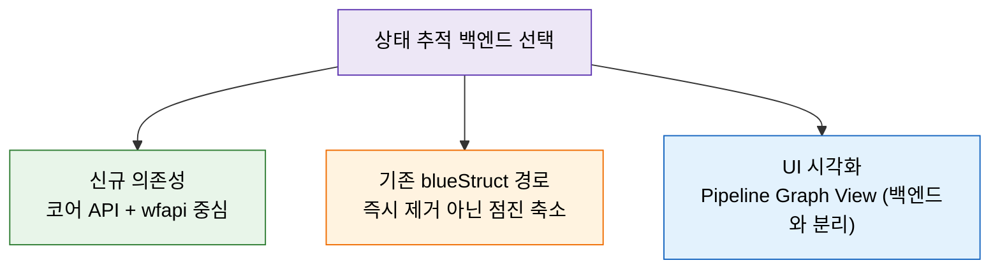
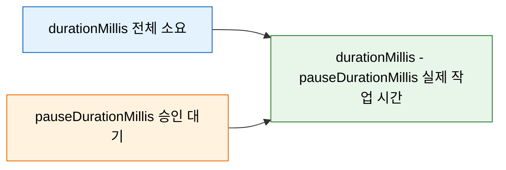

# 젠킨스 상태 추적 API 현대화와 Blue Ocean 해석
---
> 이 문서를 읽고 나면 "Blue Ocean UI 유지보수 모드"와 "Blue Ocean REST API 폐기"를 구분해 설명하고, 상태 추적 백엔드를 코어 API + `wfapi` 중심으로 가져갈지 예측·선택하며, `pauseDurationMillis`로 승인 대기 시간을 분리해 실제 작업 시간을 계산할 수 있습니다.
>
> - Blue Ocean UI 유지보수 모드, `wfapi` 중심 전환, Workflow API 개선 사항을 다룹니다.
> - TPS 상태 저장과 매핑 자체는 `06-02`, 순수 조회 API 스펙은 `06-01`에서 별도로 다룹니다.


## 사전 지식

> 06-01·06-02에서 본 `wfapi` 기반 상태 추적을 알고 있다면, 이 문서는 그 선택을 현대 Jenkins 플러그인 생태계(Blue Ocean 유지보수 모드 등) 위에서 정당화하는 판단 편입니다. 코어 build API의 `building`·`result` 필드와 `wfapi/describe`의 `stages[]`·`pauseDurationMillis`를 미리 떠올려 두면 비교가 수월합니다.


## 진입 — 왜 "현대화 해석" 편이 따로 필요한가

> 06-01·06-02가 "무엇을 어떻게 조회하느냐"를 다룬다면, 이 편은 "여러 후보 중 무엇에 의존할지"를 고르는 판단 편입니다.

상태 추적 API는 코어 build API, `wfapi`, Blue Ocean REST API처럼 여러 후보가 겹쳐 있습니다. 후보가 많다는 것은 잘못된 후보에 의존성을 묶으면 나중에 걷어내는 비용이 든다는 뜻이기도 합니다. Blue Ocean이 유지보수 모드로 들어가면서 "이 API를 지금 새로 채택해도 되는가"라는 질문이 실무에 등장했습니다. 이 편은 그 질문에 답하기 위해, UI 단종 신호와 API 가용성 신호를 분리해 읽는 법을 정리합니다.


## 1. Blue Ocean과 Workflow API 해석

> 이 개념은 이미 아는 "API 버저닝/폐기(deprecation)"의 *UI 계층과 API 계층 분리* 측면입니다. UI가 더는 개발되지 않아도 그 UI를 떠받치던 REST 엔드포인트는 별개의 수명을 갖습니다.

상태 추적에서 중요한 것은 Blue Ocean UI 자체보다 어떤 API를 안정적으로 쓸 수 있는가입니다.

Blue Ocean을 "폐점한 가게의 뒷문"에 비유하면 이해가 빠릅니다. 정문(UI)에 "신규 단장 중단" 안내가 붙어도, 납품용 뒷문(REST API)은 아직 열려 있어 다른 가게가 그 통로로 물건을 받을 수 있습니다. 이 비유는 "UI 단종이 API 즉시 차단을 뜻하지 않는다"까지 유효하고, 가게가 완전히 철거되는 시점(플러그인 자체 제거·호환성 단절)에서는 깨집니다. 그때는 뒷문도 함께 닫히므로, 장기적으로는 다른 통로를 확보해 두는 편이 안전합니다.

### 1-1. Blue Ocean UI 지원 중단

Jenkins 프로젝트는 2022년부터 Blue Ocean UI를 유지보수 모드로 두고 있습니다. 즉 신규 UI 투자 관점에서는 deprecated로 보는 편이 맞습니다.

여기서 한 발 더 나아간 공식 신호가 있습니다. Jenkins 공식 문서는 Blue Ocean이 2026년 7월 폐기(deprecated) 예정이며, 그 이후로는 보안 수정도 기능 업데이트도 받지 않는다고 안내합니다 (출처: jenkins.io/doc/book/blueocean). 폐기 전까지도 maintenance mode라 새 기능은 들어오지 않고 중대한 보안·결함만 선택적으로 손봅니다. 그래서 "언젠가 사라질지 모른다"가 아니라 "폐기 시점이 명시됐다"로 읽어야 하며, 신규 기능을 Blue Ocean에 새로 묶는 선택은 그만큼 회수 비용이 예약된 부채가 됩니다.

- 다만 **Blue Ocean REST API(`/blue/rest/...`)가 곧바로 무효라는 뜻은 아닙니다.**
- 폐기 시점까지는 후속 UI나 다른 시각화 플러그인에서도 여전히 활용될 수 있습니다.

### 1-2. 현재 TPS 관점의 판단

TPS 관점에서는 다음처럼 보는 편이 현실적입니다:

- 신규 의존성은 코어 API + `wfapi` 중심으로 두는 편이 낫습니다.
- 기존 `blueStruct` 경로 변환이 이미 있다면 바로 걷어낼 필요는 없습니다.
- 다만 장기적으로는 Blue Ocean 전용 경로보다 `wfapi/describe`와 코어 API 조합이 더 안정적입니다.

상태 추적 의존성을 어디에 둘지 판단하는 흐름을 그림으로 보면 다음과 같습니다:



### 1-3. UI 대안 — Pipeline Graph View / Pipeline: Stage View

Blue Ocean UI의 대안으로 공식 문서가 짚는 후보는 Pipeline Graph View Plugin과 Pipeline: Stage View Plugin 두 가지입니다 (출처: jenkins.io/doc/book/blueocean). 다만 공식 안내도 이 둘이 Blue Ocean의 완전한 대체는 아니라고 단서를 답니다. stage 흐름 시각화 같은 핵심 기능은 가져오지만, Blue Ocean이 제공하던 일부 경험까지 그대로 옮겨 오지는 못한다는 뜻입니다.

이 둘은 어디까지나 Jenkins 웹 UI 쪽 대안이지, TPS 백엔드 상태 조회 방식 자체를 당장 바꾸는 요소는 아닙니다. UI 대체 플러그인을 무엇으로 고르든, 백엔드 상태 추적을 코어 API + `wfapi`로 두는 판단은 그와 분리해서 내립니다.

### 1-4. 어떤 객체든 `/api/`로 조회할 수 있다는 전제

상태 추적 API 선택이 가능한 배경에는 Jenkins의 일관된 원격 접근 규약이 있습니다. 어떤 객체 URL에도 `/api/`를 붙이면 그 객체를 기계가 읽을 수 있는 형태로 받습니다. `/api/json`은 JSON, `/api/xml`은 XML, `/api/python`은 Python 리터럴을 반환합니다 (출처: jenkins.io/doc/book/using/remote-access-api). 코어 build API든 `wfapi`든 이 규약 위에 올라가 있으므로, 후보를 바꿔도 호출 형태는 크게 달라지지 않습니다.

응답에서 필요한 필드만 고르는 `tree=`, 중첩을 펼치는 `depth=`의 동작과 응답 크기 효과는 [09-03. API 쿼리 최적화와 운영](09-03.API%20%EC%BF%BC%EB%A6%AC%20%EC%B5%9C%EC%A0%81%ED%99%94%EC%99%80%20%EC%9A%B4%EC%98%81.md)을 참조합니다. 상태 추적 호출에서는 다음처럼 적용합니다:

```bash
# 빌드 객체 상태를 JSON 으로 — tree= 로 building/result/duration 만 추림
curl -s --user "USER:TOKEN" \
  "http://JENKINS/job/pipeline/42/api/json?tree=building,result,duration" \
  | head -c 400

# depth= 로 중첩 객체까지 펼쳐 받음
curl -s --user "USER:TOKEN" \
  "http://JENKINS/job/pipeline/api/json?depth=2"
```

`X-Jenkins` 응답 헤더로 인스턴스 버전을 확인할 수 있으므로, "이 개선이 적용된 버전인지"를 헤더 한 줄로 가늠할 수 있습니다 (출처: jenkins.io/doc/book/using/remote-access-api).


## 2. Workflow API 개선 사항

> 이 문서에서 말하는 "개선"은 새로운 endpoint가 대거 생겼다는 뜻보다, 기존 `wfapi` 응답을 운영 판단에 더 신뢰할 수 있게 됐다는 뜻에 가깝습니다.

특히 TPS 관점에서 중요했던 비교 포인트는 다음과 같습니다:

| 비교 축 | 예전 해석 | 지금 해석 | 실무 의미 |
|------|------|------|------|
| 승인 대기 시간 | `pauseDurationMillis`를 보더라도 값이 거칠 수 있어서 참고용에 가까웠습니다 | `pauseDurationMillis`를 예전보다 더 믿고 승인 대기 시간을 읽을 수 있습니다 | 승인 대기 시간 표시, SLA 계산, 장기 대기 탐지에 더 적합합니다 |
| `wfapi`의 역할 | 스테이지 구조를 보는 보조 API 성격이 강했습니다 | run 단위 상태 확인 API로 더 실용적입니다 | TPS 폴링 잡이나 상태 동기화에서 `wfapi` 비중을 높이기 쉬워졌습니다 |
| Blue Ocean 대비 위치 | Blue Ocean이 더 풍부한 구조/시각화 API처럼 느껴졌습니다 | 상태 추적 자체는 코어 API + `wfapi`로도 충분한 경우가 많습니다 | 신규 백엔드 구현은 Blue Ocean 의존 없이도 갈 수 있습니다 |
| 승인/중단 같은 중간 상태 해석 | 코어 build API만으로는 빈틈이 있었습니다 | `wfapi`가 `PAUSED_PENDING_INPUT`, stage 상태를 더 잘 드러냅니다 | 단순 성공/실패 외의 중간 상태를 더 자연스럽게 모델링할 수 있습니다 |

- 즉 개선의 본질은 "기능이 완전히 새로 생겼다"보다, `wfapi`를 운영 상태 추적에 써도 되는 근거가 더 강해졌다는 쪽입니다.

### 2-1. `pauseDurationMillis`가 왜 중요해졌는가

승인 대기나 `input` 스텝이 있는 파이프라인에서는 "실행 시간"과 "실제 작업 시간"을 구분해야 합니다. 예전에는 `pauseDurationMillis`를 보더라도 얼마나 믿어야 하는지가 애매했습니다.

`durationMillis`를 "택시 미터기 총 요금"에 비유하면, `pauseDurationMillis`는 "신호 대기로 멈춰 선 동안 올라간 요금"입니다. 둘을 빼야 "실제로 주행한 거리에 대한 요금", 곧 순수 작업 시간이 남습니다. 이 비유는 "대기를 분리하면 작업량을 더 정확히 본다"까지 유효하고, 한 빌드 안에서 승인 스텝이 여러 번 끼어 대기가 분절되는 경우에는 단순한 한 번의 뺄셈만으로는 구간별 분석이 깨집니다. 그때는 stage별 `pauseDurationMillis`를 따로 합산해야 합니다.

지금 문서에서 말하는 개선은 이 지점입니다:

- **예전**
  - 승인 대기 시간이 대략적으로만 보일 수 있었습니다.
  - 운영 화면에 노출해도 참고용 성격이 강했습니다.
- **지금**
  - `pauseDurationMillis`를 예전보다 더 신뢰할 수 있습니다.
  - 승인 대기 시간과 순수 실행 시간을 나눠 읽기가 쉬워졌습니다.

예를 들어 같은 build라도 다음처럼 해석할 수 있습니다:

| 필드 | 예전 해석 | 지금 해석 |
|------|------|------|
| `durationMillis` | 전체 걸린 시간 정도로만 봄 | 전체 소요 시간으로 계속 사용 |
| `pauseDurationMillis` | 값이 있어도 엄밀한 운영 지표로 쓰기 조심스러움 | 승인 대기 시간으로 적극 활용 가능 |
| `durationMillis - pauseDurationMillis` | 보조 계산 정도 | 실제 작업 시간 추정에 더 유용 |

수치로 보면 차이가 분명합니다. 예컨대 `durationMillis = 3,600,000`(1시간)인 빌드에서 `pauseDurationMillis = 3,000,000`(50분)이라면, 실제 작업 시간은 `3,600,000 - 3,000,000 = 600,000`(10분)입니다. 승인 대기를 빼지 않고 "1시간짜리 느린 빌드"로 SLA를 잡으면 6배 과대평가하게 됩니다.

- 즉 승인 프로세스가 끼어 있는 Jenkins 파이프라인에서는 `pauseDurationMillis` 개선이 생각보다 중요합니다.

승인 대기가 낀 빌드에서 전체 시간을 작업 시간과 대기 시간으로 분해하는 관계를 그림으로 보면 다음과 같습니다:



`wfapi` 응답에서 위 세 값을 골라 읽는 호출은 다음과 같습니다:

```bash
# 특정 빌드의 wfapi 상세 — buildNumber 를 붙여 run 단위로 조회
# (buildNumber 없이 호출하면 job-level 응답처럼 보여 상태 추적 기준이 흐려짐)
curl -s --user "USER:TOKEN" \
  "http://JENKINS/job/pipeline/42/wfapi/describe" \
  | python3 -c 'import sys,json; d=json.load(sys.stdin); \
      print(d["durationMillis"], d.get("pauseDurationMillis", 0))'
#         ↑ pauseDurationMillis 가 없을 수 있으므로 .get 기본값 0 으로 방어
```

### 2-2. 무엇이 안 바뀐 것인지도 같이 봐야 합니다

개선됐다고 해서 `wfapi`가 만능이 된 것은 아닙니다.

- `/{pipelineStruct}/wfapi/describe`는 현재 실습 Jenkins에서 job-level 응답처럼 보일 수 있습니다.
- 그래서 실제 상태 추적은 여전히 `/{pipelineStruct}/{buildNumber}/wfapi/describe`를 기준으로 보는 편이 안전합니다.
- 실행 중 여부 자체는 여전히 코어 build API의 `building=true`가 더 직관적입니다.

즉 비교를 정리하면 다음과 같습니다:

| 항목 | 지금도 코어 API가 더 나은 부분 | 지금 `wfapi`가 더 나은 부분 |
|------|------|------|
| 실행 중 여부 | `building` 필드 확인이 가장 직관적 | - |
| 최종 결과 | `result` 확인이 단순하고 안정적 | - |
| 승인 대기 상태 | - | `PAUSED_PENDING_INPUT` 표현이 더 좋다 |
| 스테이지 상태 | - | `stages[]` 구조로 한 번에 보기 쉽다 |
| 승인 대기 시간 | - | `pauseDurationMillis` 활용 가치가 커졌다 |

즉 최근 개선을 반영한 실무 판단은 다음처럼 요약할 수 있습니다:

- build 전체 생명주기는 코어 API가 중심입니다.
- 파이프라인 내부 진행 상태와 승인 대기 해석은 `wfapi`가 중심입니다.
- Blue Ocean은 선택적 보조 수단으로 남기고, 신규 의존성은 줄이는 편이 낫습니다.


## 3. 실무 판단 기준

> 신규 구현은 코어 build API + `wfapi`를 우선하고, Blue Ocean 의존성은 점진 축소하며, UI 대체와 백엔드 API 선택을 분리해 판단하는 기준을 다룹니다.

현대 Jenkins 관점에서 상태 추적 API를 고를 때는 다음 기준으로 보면 됩니다:

- 신규 구현은 코어 build API + `wfapi`를 우선합니다.
- 기존 Blue Ocean 의존성은 즉시 제거 대상이라기보다 점진적 축소 대상으로 봅니다.
- UI 대체 플러그인 도입 여부와 백엔드 상태 추적 API 선택은 분리해서 판단합니다.

즉 "Blue Ocean UI 유지보수 모드"와 "Blue Ocean API 즉시 폐기"를 같은 뜻으로 보면 안 됩니다.

### 3-1. 폴링 인증은 crumb보다 API token

상태 추적은 보통 TPS 폴링 잡이 주기적으로 호출하므로, 인증 방식 선택이 운영 안정성에 직접 영향을 줍니다. API token이 CSRF(crumb) 면제 대상이라는 점·crumb 발급 절차·API token이 비밀번호보다 권장되는 이유는 [03-01. 인증 API 스펙](03-01.%EC%9D%B8%EC%A6%9D%20API%20%EC%8A%A4%ED%8E%99%20%28ID-Password%20%2B%20Crumb%29.md) § crumb 발급에서 다룹니다. 폴링 잡 관점에서 중요한 결과는 두 가지입니다 — 매 호출마다 `/crumbIssuer/api`로 crumb을 먼저 받아오는 왕복을 생략할 수 있고, 자격 증명이 장기 상주하는 환경에서 토큰만 폐기하면 되는 점이 비밀번호 노출 대비 운영상 큰 차이를 만듭니다.

```bash
# HTTP BASIC 으로 API token 인증 — 이 경우 crumb 발급/동반이 불필요
curl -s --user "USER:11aabbccddeeff..." \
  "http://JENKINS/job/pipeline/42/wfapi/describe"
```


## 면접 질문

> 답을 떠올린 뒤 §정답 절에서 같은 번호로 대조하세요.

1. "Blue Ocean UI 유지보수 모드"와 "Blue Ocean API 즉시 폐기"를 같은 뜻으로 보면 안 되는 이유는?
2. 승인(`input`) 스텝이 있는 파이프라인에서 `pauseDurationMillis`가 왜 중요한가요?
3. 실행 중 여부와 최종 결과는 wfapi와 코어 API 중 어느 것이 더 직관적인가요?
4. 상태 추적 폴링 잡에서 crumb 대신 API token을 쓰면 어떤 단계가 줄어드나요?
5. Blue Ocean의 공식 폐기 시점은 언제이며, 그 이후 UI 시각화는 무엇으로 대체합니까?

### 빈칸 채우기 — 현대화 상태 추적

다음 빈칸을 채워 보세요. 정답은 문서 끝 "빈칸 정답" 절에 있습니다.

1. 어떤 객체 URL에도 `____`를 붙이면 기계가 읽을 수 있는 응답을 받고, JSON은 `____`, Python은 `____` 형식을 반환합니다.
2. 응답에서 필요한 필드만 고를 때는 `____=` 파라미터, 서브트리 깊이를 키울 때는 `____=` 파라미터를 씁니다.
3. 실제 작업 시간은 `durationMillis - ____`로 추정합니다.
4. `wfapi`가 승인 대기 상태로 드러내는 상태 문자열은 `____`입니다.
5. API token으로 인증하는 요청은 `____`(crumb) 검사가 면제됩니다.
6. 인스턴스 버전은 응답 헤더 `____`로 확인합니다.
7. Blue Ocean은 `____`년 `__`월 폐기 예정이며, UI 대안은 `____`·`____` 플러그인입니다.


## 정답

> 위 질문을 스스로 설명해 본 뒤에 펼치세요.

### 정답 1 — UI 모드 ≠ API 폐기

Blue Ocean UI는 2022년부터 유지보수 모드(신규 UI 투자 중단)이고, 공식 문서 기준 2026년 7월 폐기 예정입니다(이후 보안·기능 업데이트 없음). 그렇다고 Blue Ocean REST API(`/blue/rest/...`)가 곧바로 무효라는 뜻은 아닙니다. 폐기 시점까지는 후속 UI나 다른 시각화 플러그인에서 여전히 활용될 수 있습니다. 다만 신규 백엔드 의존성은 코어 API + wfapi 중심으로 두는 것이 더 안정적이고, UI 시각화가 필요하면 Pipeline Graph View나 Pipeline: Stage View로 분리해 고릅니다.

### 정답 2 — pauseDurationMillis의 중요성

승인 대기가 끼면 "전체 소요 시간(`durationMillis`)"과 "실제 작업 시간"이 달라집니다. `pauseDurationMillis`로 승인 대기 시간을 분리하면 `durationMillis - pauseDurationMillis`로 실제 작업 시간을 추정할 수 있어, SLA 계산이나 장기 대기 탐지에 유용합니다.

### 정답 3 — 실행 여부·결과는 코어 API

실행 중 여부는 코어 빌드 API의 `building` 필드가 가장 직관적이고, 최종 결과는 `result` 확인이 단순·안정적입니다. 반면 승인 대기 상태나 stage 진행은 wfapi가 더 잘 드러냅니다. 즉 빌드 전체 생명주기는 코어 API, 파이프라인 내부 진행은 wfapi로 역할을 나눕니다.

### 정답 4 — API token은 crumb 왕복을 생략

API token 인증 요청은 CSRF(crumb) 면제 대상이므로, 폴링 잡이 매 호출마다 `/crumbIssuer/api`로 crumb을 먼저 발급받아 POST에 동반하는 단계를 생략할 수 있습니다. 자격 증명이 노출돼도 토큰만 폐기하면 되는 점도 장기 상주 잡에 유리합니다.

### 정답 5 — 폐기 시점과 UI 대안

Jenkins 공식 문서 기준 Blue Ocean은 2026년 7월 폐기 예정이며, 그 이후로는 보안 수정도 기능 업데이트도 받지 않습니다 (출처: jenkins.io/doc/book/blueocean). UI 시각화 대안은 Pipeline Graph View와 Pipeline: Stage View 두 플러그인이지만, 공식 안내도 이 둘이 Blue Ocean의 완전한 대체는 아니라고 단서를 답니다. 그래서 UI 대체 플러그인 선택과 백엔드 상태 추적 API(코어 API + wfapi) 선택은 분리해서 판단합니다.

### 빈칸 정답 — 현대화 상태 추적

1. `/api/` / `/api/json` / `/api/python`
2. `tree` / `depth`
3. `pauseDurationMillis`
4. `PAUSED_PENDING_INPUT`
5. CSRF
6. `X-Jenkins`
7. 2026 / 7 / Pipeline Graph View / Pipeline: Stage View


## 관련 문서

> 같은 06 장의 스펙·TPS 모델 편과 함께 읽으면, "무엇을 조회하느냐(스펙) → 어떻게 저장하느냐(모델) → 무엇에 의존하느냐(현대화 해석)"의 흐름이 이어집니다. 승인 대기·로그 해석은 인접 07 장과 연결됩니다.

- [06-01. 빌드 상태 추적 API 스펙](06-01.빌드%20상태%20추적%20API%20스펙.md) § "wfapi/describe 조회" — 이 편이 현대화 판단의 대상으로 삼는 순수 조회 스펙
- [06-02. 빌드 상태 추적 모델과 TPS 패턴 (2.222+)](06-02.빌드%20상태%20추적%20모델과%20TPS%20패턴%20%282.222%2B%29.md) § "상태 매핑" — 코어 API + wfapi로 받은 상태를 TPS에 저장하는 모델
- [07-03. wfapi 상세 스펙과 활용](07-03.wfapi%20상세%20스펙과%20활용.md) § "stages 트리" — `pauseDurationMillis`·`stages[]` 구조의 상세 스펙
- [07-04. wfapi 로그 모델과 Blue Ocean 구현 판단](07-04.wfapi%20로그%20모델과%20Blue%20Ocean%20구현%20판단.md) § "Blue Ocean 구현 판단" — Blue Ocean 의존성 판단의 로그 관점 연장
- [05-06. 큐·실행기 조회 API 스펙](05-06.큐%C2%B7실행기%20조회%20API%20스펙.md) § "depth 조회" — depth= 로 중첩 객체를 펼쳐 받는 조회 패턴
