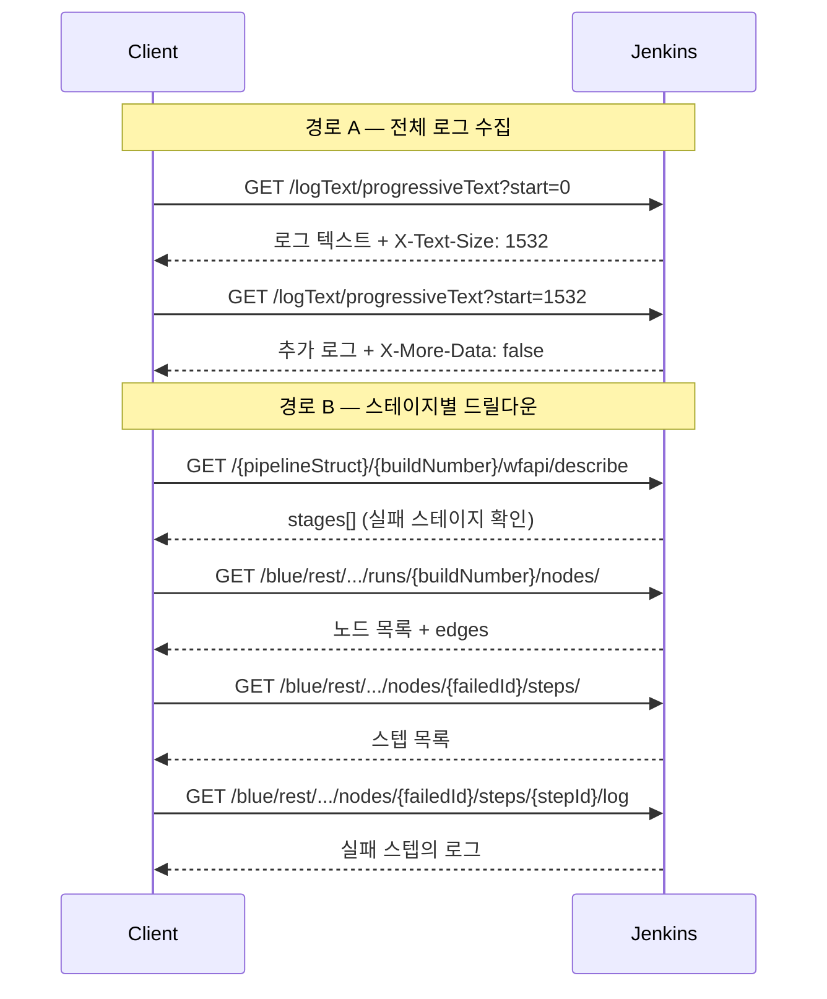
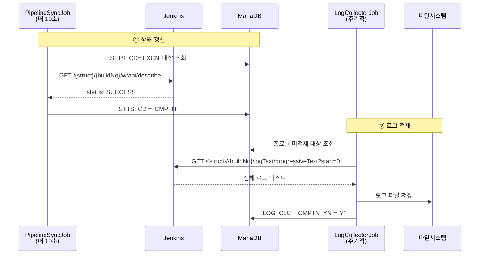

# 젠킨스 API 로그 조회와 적재
---
> 이 문서를 읽고 나면 `consoleText`와 `progressiveText`의 차이를 설명하고, `X-Text-Size`로 증분 로그 offset을 계산해 폴링을 구현하며, 완료 빌드의 로그를 TPS가 어떤 경로로 적재하는지 추적할 수 있습니다.
>
> - 전체 콘솔 로그, 증분 로그, stage/node 단위 로그, Blue Ocean 드릴다운, 완료 빌드의 전체 로그 조회 API를 다룹니다.
> - 로그 적재 구현 패턴, 파일 저장 구조, 모듈 역할 분리, 최근 버전 변화는 본 문서 §6~§8에서 이어서 다룹니다.

## 사전 지식

이 문서를 읽기 전에 빌드 번호(`buildNumber`)와 파이프라인 경로(`pipelineStruct`) 개념, Basic Auth로 GET 요청을 보내는 법, 그리고 `06-01`의 빌드 상태 추적(`wfapi/describe`로 종료 여부 판정)을 알고 있으면 좋습니다. crumb와 cookie 준비는 `03-01`에서 마쳤다고 전제합니다.

## 진입 — 왜 로그 조회 API가 갈래로 나뉘는가

> 빌드가 끝났다는 사실만 알아도 운영은 가능하지만, "왜 실패했는가"에 답하려면 로그를 읽어야 합니다. 그런데 로그를 가져오는 방법은 하나가 아닙니다.

빌드 로그를 가져오는 방식은 목적에 따라 갈립니다. 끝난 빌드의 전체 로그를 한 번에 받으면 되는 경우가 있고, 실행 중인 빌드를 실시간에 가깝게 따라가야 하는 경우가 있으며, 수 MB 로그 더미에서 실패한 stage 한 곳만 도려내야 하는 경우도 있습니다. `consoleText`는 첫째, `progressiveText`는 둘째, `wfapi/log`와 Blue Ocean 드릴다운은 셋째 상황을 위해 존재합니다. 어떤 API를 고르느냐가 곧 전송량과 실시간성의 트레이드오프를 정합니다. 이 문서는 그 선택 기준과, TPS가 이 중 무엇을 어떤 주기로 골라 로그를 적재하는지를 설명합니다.

## 1. 이 문서의 범위

> 이 개념은 이미 아는 "어떤 객체 URL에도 `/api/` 를 붙이면 메타데이터가 나온다"는 Remote Access API 규칙의 *로그 측면*입니다. 로그는 JSON 메타데이터가 아니라 plain text 본문이라 전용 엔드포인트(`consoleText`, `progressiveText`, `/log`)를 따로 둔다는 점만 다릅니다 (출처: jenkins.io/doc/book/using/remote-access-api).

> 이 문서는 로그 조회와 적재에 직접 사용하는 아래 API와 흐름만 설명합니다.

| 메서드 | 경로 | 목적 |
|------|------|------|
| GET | `/{pipelineStruct}/{buildNumber}/consoleText` | 특정 빌드의 전체 콘솔 로그 조회 |
| GET | `/{pipelineStruct}/{buildNumber}/logText/progressiveText?start={n}` | 증분 로그 조회 |
| GET | `/{pipelineStruct}/{buildNumber}/execution/node/{nodeId}/wfapi/log` | 특정 stage/node 로그 조회 |
| GET | `/blue/rest/.../runs/{buildNumber}/nodes/` | Blue Ocean 노드 목록 조회 |
| GET | `/blue/rest/.../runs/{buildNumber}/nodes/{nodeId}/steps/` | Blue Ocean 스텝 목록 조회 |
| GET | `/blue/rest/.../runs/{buildNumber}/nodes/{nodeId}/log` | Blue Ocean 노드 로그 조회 |
| GET | `/blue/rest/.../runs/{buildNumber}/nodes/{nodeId}/steps/{stepId}/log` | Blue Ocean 스텝 로그 조회 |

인증과 crumb/cookie 준비는 별도 문서에서 다룹니다:

- `03-01.인증 API 스펙 (ID-Password + Crumb).md`
- `03-02.인증 모델과 TPS 패턴 (2.222+).md`

빌드 실행과 상태 추적은 이 문서 범위가 아닙니다. 그 내용은 별도 문서에서 다룹니다:

- `05-01.빌드 실행·큐 API 스펙.md`
- `06-01.빌드 상태 추적 API 스펙.md`

### 1-1. 공통 경로 규칙

코어 Jenkins 로그 API는 `pipelineStruct + buildNumber` 조합을 기본으로 씁니다.

- 코어 Job 경로: `/job/{folder}/job/{name}`
- 특정 build 경로: `/{pipelineStruct}/{buildNumber}/...`
- 특정 stage/node 경로: `/{pipelineStruct}/{buildNumber}/execution/node/{nodeId}/...`

Blue Ocean 로그 API는 코어 Jenkins와 경로 구조가 다릅니다.

- 코어 Jenkins: `/job/{taskCd}/job/{envrnCd}/job/{bizNm}`
- Blue Ocean: `/blue/rest/organizations/jenkins/pipelines/{taskCd}/pipelines/{envrnCd}/pipelines/{bizNm}`

예시는 다음과 같습니다:

```text
/job/SBH/job/API-SLEEP10/12/consoleText
/job/SBH/job/API-SLEEP10/12/logText/progressiveText?start=0
/job/SBH/job/API-SLEEP10/12/execution/node/12/wfapi/log
/blue/rest/organizations/jenkins/pipelines/SBH/pipelines/API-SLEEP10/runs/12/nodes/
```

### 1-2. 공통 요청 규칙

모든 예시는 [01-01.API 실습 환경 설정.md](01-01.API 실습 환경 설정.md) 와 `05-01`, `06-01`까지의 준비가 끝났다는 전제입니다.

즉 이 문서에서는 아래 공통값을 다시 설명하지 않습니다:

- `JENKINS_URL`
- `JENKINS_USER`
- `JENKINS_PASS`
- `PIPELINE_NORMAL_STRUCT`
- `PIPELINE_PARAM_STRUCT`
- `PIPELINE_SLEEP10_STRUCT`
- `PIPELINE_FAIL_STRUCT`
- `PIPELINE_NORMAL_2_STRUCT`
- `BLUE_STRUCT_FAIL`

이 문서에서는 build 번호와 stage/node 식별자처럼 현재 실행마다 바뀌는 값만 추가로 준비합니다:

```bash
export BUILD_NUMBER_NORMAL=''
export BUILD_NUMBER_FAIL=''
export BUILD_NUMBER_SLEEP10=''
export BUILD_NUMBER_PARAM=''

export NODE_ID_FAILED='12'
export STEP_ID_FAILED='7'
```

이 문서에서 의미하는 값은 다음과 같습니다:

| 변수 | 의미 | 예시 |
|------|------|------|
| `BUILD_NUMBER_NORMAL` | `API-NORMAL`의 최근 빌드 번호 | `8` |
| `BUILD_NUMBER_FAIL` | `API-FAIL`의 최근 빌드 번호 | `3` |
| `BUILD_NUMBER_SLEEP10` | `API-SLEEP10`의 최근 빌드 번호 | `12` |
| `BUILD_NUMBER_PARAM` | `API-PARAM`의 최근 빌드 번호 | `5` |
| `NODE_ID_FAILED` | 실패 stage/node ID | `12` |
| `STEP_ID_FAILED` | 실패 스텝 ID | `7` |
| `BLUE_STRUCT_FAIL` | `API-FAIL`의 Blue Ocean 경로 | `pipelines/SBH/pipelines/API-FAIL` |

빠른 로그 실습용 build 번호는 먼저 이렇게 잡아두면 됩니다:

```bash
export BUILD_NUMBER_NORMAL=$(curl -k -sS -u "${JENKINS_USER}:${JENKINS_PASS}" \
  "${JENKINS_URL}${PIPELINE_NORMAL_STRUCT}/lastBuild/api/json" \
  | jq -r '.number')

export BUILD_NUMBER_SLEEP10=$(curl -k -sS -u "${JENKINS_USER}:${JENKINS_PASS}" \
  "${JENKINS_URL}${PIPELINE_SLEEP10_STRUCT}/lastBuild/api/json" \
  | jq -r '.number')

export BUILD_NUMBER_FAIL=$(curl -k -sS -u "${JENKINS_USER}:${JENKINS_PASS}" \
  "${JENKINS_URL}${PIPELINE_FAIL_STRUCT}/lastBuild/api/json" \
  | jq -r '.number')

echo "$BUILD_NUMBER_NORMAL"
echo "$BUILD_NUMBER_SLEEP10"
echo "$BUILD_NUMBER_FAIL"
```

GET 로그 API도 POST와 마찬가지로 HTTP 상태 코드, 헤더, 본문을 분리해서 확인할 수 있습니다. 기본 패턴은 다음과 같습니다:

```bash
curl -k -sS -D headers.txt -o body.txt -w 'HTTP_STATUS=%{http_code}\n' \
  -u "${JENKINS_USER}:${JENKINS_PASS}" \
  "<GET URL>"

cat headers.txt
head -n 20 body.txt
```

- plain text 로그 API는 본문이 그대로 텍스트 파일에 저장됩니다.
- JSON 로그 API는 `body.json`으로 저장한 뒤 `jq`로 확인하면 됩니다.
- 정상 조회라면 보통 `HTTP_STATUS=200`이 내려옵니다.

### 1-3. 권장 실행 순서

이 문서는 로그 API를 개별로 설명하지만, 실제 실습은 아래 순서로 보는 편이 자연스럽습니다.

| 순서 | 먼저 하는 일 | 이어서 보는 API | 목적 |
|------|------|------|------|
| 1 | build 번호를 확보한다 | `GET /{pipelineStruct}/{buildNumber}/consoleText` | 가장 단순한 전체 로그 확인 |
| 2 | 실행 중 로그를 본다 | `GET /logText/progressiveText?start={n}` | 증분 로그 추적 |
| 3 | 실패 지점을 좁힌다 | `GET /execution/node/{nodeId}/wfapi/log` | 특정 stage/node 로그 확인 |
| 4 | 더 세밀한 드릴다운이 필요하면 | `GET /blue/rest/...` | 노드/스텝 단위 로그 추적 |
| 5 | 빌드 완료 후 | `GET /logText/progressiveText?start=0` + 적재 흐름 | 전체 로그 저장 |


## 2. 전체 콘솔 로그

### 2-1. 상태 준비: `consoleText` 조회 전에 성공 build를 만듭니다

가장 단순한 `consoleText` 조회는 완료된 성공 build를 기준으로 보는 편이 읽기 쉽습니다.

먼저 성공한 build 하나를 만들어 두면 `consoleText` 확인이 쉽습니다:

```bash
curl -k -sS -D headers.txt -o /dev/null -w 'HTTP_STATUS=%{http_code}\n' \
  -X POST -b cookies.txt \
  -u "${JENKINS_USER}:${JENKINS_PASS}" \
  -H "${CRUMB_FIELD}: ${CRUMB}" \
  "${JENKINS_URL}${PIPELINE_NORMAL_STRUCT}/build"

export BUILD_NUMBER_NORMAL=$(curl -k -sS -u "${JENKINS_USER}:${JENKINS_PASS}" \
  "${JENKINS_URL}${PIPELINE_NORMAL_STRUCT}/lastBuild/api/json" \
  | jq -r '.number')

echo "$BUILD_NUMBER_NORMAL"
```

### 2-2. `GET /{pipelineStruct}/{buildNumber}/consoleText`

> 가장 단순한 방식입니다. 특정 빌드의 전체 콘솔 출력을 plain text로 반환합니다:

```bash
curl -k -sS -D headers.txt -o consoleText.txt -w 'HTTP_STATUS=%{http_code}\n' \
  -u "${JENKINS_USER}:${JENKINS_PASS}" \
  "${JENKINS_URL}${PIPELINE_NORMAL_STRUCT}/${BUILD_NUMBER_NORMAL}/consoleText"

cat headers.txt
head -n 300 consoleText.txt
```

- 장점은 단순함입니다. 한 번의 GET으로 빌드 전체 콘솔 출력을 받습니다.
- 단점은 로그가 수 MB에 달하는 빌드에서 매 요청마다 전체를 다시 내려받는다는 점입니다. 예를 들어 2MB 로그를 2초 간격으로 5분간 폴링하면 매 회차가 처음부터 전체를 받으므로 약 150회 × 2MB = 300MB를 전송합니다. 같은 시간을 `progressiveText`로 추적하면 직전 offset 이후의 증분(회차당 수 KB)만 받아 전송량이 수 MB 안쪽으로 줄어듭니다. 그래서 실행 중인 빌드의 실시간 추적에는 `consoleText`가 부적합하고 `progressiveText`를 씁니다.


## 3. 증분 로그 (Progressive Text)

### 3-1. 상태 준비: 실행 중 build를 먼저 만듭니다

증분 로그는 실행 중 상태에서 볼 때 의미가 가장 큽니다.

먼저 실행 중 상태를 만들려면 `API-SLEEP10`을 다시 실행한 뒤 build 번호를 잡아두면 됩니다:

```bash
curl -k -sS -D headers.txt -o /dev/null -w 'HTTP_STATUS=%{http_code}\n' \
  -X POST -b cookies.txt \
  -u "${JENKINS_USER}:${JENKINS_PASS}" \
  -H "${CRUMB_FIELD}: ${CRUMB}" \
  "${JENKINS_URL}${PIPELINE_SLEEP10_STRUCT}/build"

export BUILD_NUMBER_SLEEP10=$(curl -k -sS -u "${JENKINS_USER}:${JENKINS_PASS}" \
  "${JENKINS_URL}${PIPELINE_SLEEP10_STRUCT}/lastBuild/api/json" \
  | jq -r '.number')

echo "$BUILD_NUMBER_SLEEP10"
```

### 3-2. `GET /{pipelineStruct}/{buildNumber}/logText/progressiveText?start={n}`

> 실시간에 가까운 로그 추적이 필요하면 `progressiveText`를 사용합니다.
>
> 이미 읽은 바이트 수를 `start` 파라미터로 전달하면, Jenkins가 새로 추가된 로그만 내려줍니다:

`progressiveText`는 책갈피로 이어 읽기에 비유할 수 있습니다. 어제 100쪽까지 읽고 책갈피를 꽂아 뒀다면, 오늘은 1쪽이 아니라 101쪽부터 읽으면 됩니다. 여기서 `start`가 책갈피 위치(바이트 offset)이고, 응답 헤더 `X-Text-Size`가 "지금까지 새로 추가된 분량까지 합한 다음 책갈피 위치"입니다. 이 비유는 로그가 끝에만 *추가*되는 한 유효합니다. 만약 이미 출력된 로그가 중간에서 수정·삭제되면 책 페이지가 통째로 갈리는 셈이라 offset 기반 이어 읽기가 깨지는데, Jenkins 콘솔 로그는 append-only라 이 한계가 실제로 드러나지 않습니다.

```bash
curl -k -sS -D headers.txt -o progressiveText.txt -w 'HTTP_STATUS=%{http_code}\n' \
  -u "${JENKINS_USER}:${JENKINS_PASS}" \
  "${JENKINS_URL}${PIPELINE_SLEEP10_STRUCT}/${BUILD_NUMBER_SLEEP10}/logText/progressiveText?start=0"
  # start=0 → 처음부터 전부. 실행 중 빌드를 처음 따라잡을 때 한 번만 이렇게 쓰고,
  # 이후에는 직전 응답의 X-Text-Size 값을 start 로 넘겨 추가분만 받습니다.

cat headers.txt          # X-Text-Size / X-More-Data 가 본문이 아니라 헤더에 있어 헤더부터 확인
cat progressiveText.txt
```

응답 본문에는 로그 텍스트가 담기고, 핵심 정보는 응답 헤더에 있습니다:

| 헤더 | 설명 |
|------|------|
| `X-Text-Size` | 현재까지 출력된 총 바이트 수입니다. 다음 요청의 `start` 값으로 사용합니다 |
| `X-More-Data` | `true`면 아직 로그가 더 남아 있습니다. `false`이거나 헤더가 없으면 빌드가 종료된 상태입니다 |

### 3-3. 폴링 패턴

`start=0`으로 시작하여 응답의 `X-Text-Size`를 다음 `start`로 넘기고, `X-More-Data`가 `false`가 될 때까지 반복하는 bash 폴링 스크립트입니다:

```bash
START=0                       # 첫 호출은 0(처음부터). 이후 루프가 X-Text-Size 로 갱신
while true; do
  RESPONSE_HEADERS=$(mktemp)
  BODY=$(curl -k -sS -D "$RESPONSE_HEADERS" -u "${JENKINS_USER}:${JENKINS_PASS}" \
    "${JENKINS_URL}${PIPELINE_SLEEP10_STRUCT}/${BUILD_NUMBER_SLEEP10}/logText/progressiveText?start=${START}")

  printf "%s" "$BODY"        # 이번 회차의 추가분만 즉시 출력 — 누적 출력은 하지 않음

  # X-Text-Size 를 다음 start 로 넘겨야 같은 구간을 두 번 받지 않습니다.
  START=$(grep -i '^X-Text-Size:' "$RESPONSE_HEADERS" | awk '{print $2}' | tr -d '\r')
  MORE=$(grep -i '^X-More-Data:' "$RESPONSE_HEADERS" | awk '{print $2}' | tr -d '\r')
  # tr -d '\r' 은 HTTP 헤더 줄 끝 CR 제거 — 안 지우면 start 숫자에 \r 가 붙어 요청이 깨짐

  rm -f "$RESPONSE_HEADERS"
  [ "$MORE" != "true" ] && break   # X-More-Data 가 사라지거나 false 면 빌드 종료 → 폴링 중단
  sleep 2                          # 2초 간격 — Jenkins 부하와 실시간성의 절충
done
```


## 4. Pipeline Stage/Node 단위 로그

> **Pipeline: REST API 플러그인**(pipeline-rest-api)이 제공하는 API 그룹입니다.
>
> - 기존 Jenkins Remote Access API(/api/json)와 별도로, **Pipeline의 Stage·Step 구조**를 쉽게 조회할 수 있도록 설계되었습니다.
> - **Pipeline Stage View**와 **Blue Ocean**에서 내부적으로 많이 사용하는 API입니다.

### 4-1. 상태 준비: 실패 build와 stage ID를 먼저 확인합니다

전체 로그 대신 실패 stage만 보려면, 실패 build와 `nodeId`를 먼저 잡아두는 편이 좋습니다.

먼저 실패 build를 만들어 두면 `wfapi/log` 예시를 재현하기 쉽습니다. `nodeId`가 아직 없다면 같은 build의 `wfapi/describe`에서 stage ID를 같이 확인합니다:

```bash
curl -k -sS -D headers.txt -o /dev/null -w 'HTTP_STATUS=%{http_code}\n' \
  -X POST -b cookies.txt \
  -u "${JENKINS_USER}:${JENKINS_PASS}" \
  -H "${CRUMB_FIELD}: ${CRUMB}" \
  "${JENKINS_URL}${PIPELINE_FAIL_STRUCT}/build"

export BUILD_NUMBER_FAIL=$(curl -k -sS -u "${JENKINS_USER}:${JENKINS_PASS}" \
  "${JENKINS_URL}${PIPELINE_FAIL_STRUCT}/lastBuild/api/json" \
  | jq -r '.number')

curl -k -sS -u "${JENKINS_USER}:${JENKINS_PASS}" \
  "${JENKINS_URL}${PIPELINE_FAIL_STRUCT}/${BUILD_NUMBER_FAIL}/wfapi/describe" \
  | jq '{name, status, stages: [.stages[]? | {id, name, status}]}'
```

### 4-2. `GET /{pipelineStruct}/{buildNumber}/execution/node/{nodeId}/wfapi/log`

> 전체 로그가 아니라 특정 스테이지의 로그만 보고 싶다면, `Pipeline: REST API` 플러그인의 node별 로그 엔드포인트를 사용합니다:

```bash
curl -k -sS -D headers.txt -o body.json -w 'HTTP_STATUS=%{http_code}\n' \
  -u "${JENKINS_USER}:${JENKINS_PASS}" \
  "${JENKINS_URL}${PIPELINE_FAIL_STRUCT}/${BUILD_NUMBER_FAIL}/execution/node/${NODE_ID_FAILED}/wfapi/log"

cat headers.txt
jq '.' body.json
```

응답 예시:

```json
{
  "nodeId": "12",
  "nodeStatus": "FAILED",
  "length": 295,
  "hasMore": false,
  "text": "npm ci\nnpm test\nERROR: Test suite failed...",
  "consoleUrl": "/job/SBH/job/API-FAIL/3/execution/node/12/log"
}
```

### 4-3. 응답 필드

| 필드 | 타입 | 설명 |
|------|------|------|
| `nodeId` | string | 스테이지/스텝의 노드 ID |
| `nodeStatus` | string | 해당 노드의 실행 상태 |
| `length` | int | 로그 텍스트의 바이트 수 |
| `hasMore` | boolean | 아직 더 읽을 로그가 남아 있는지 여부 |
| `text` | string | 로그 내용 |
| `consoleUrl` | string | 웹 UI에서 해당 로그를 볼 수 있는 경로 |

중요한 점은 `wfapi/log`의 범위가 build 전체가 아니라 **특정 node 로그**라는 것입니다.

- build 전체 로그가 필요하면 `consoleText`, `progressiveText`
- 특정 stage 로그가 필요하면 `execution/node/{nodeId}/wfapi/log`
- stage보다 더 세부적으로 보려면 `execution/node/{nodeId}/wfapi/describe`의 `stageFlowNodes[]`에서 하위 node ID를 찾아 다시 `wfapi/log`

즉 `wfapi`도 `stages[]` 아래로 더 내려갈 수는 있지만, 공식 문서 기준 최소 단위는 보통 `stageFlowNodes[]` 쪽에 가깝습니다.


## 5. Blue Ocean API 드릴다운

> Blue Ocean API 드릴다운은 Jenkins Blue Ocean의 REST API를 사용해 파이프라인(Pipeline)의 상세 정보를 계층적으로 파고들어(Drill-down) 조회하는 기능을 의미합니다.

### 5-1. 상태 준비: 실패 build와 `nodeId`, `stepId`를 먼저 잡습니다

Blue Ocean 드릴다운은 실패 build를 하나 기준으로 두는 편이 자연스럽습니다.

`nodeId`, `stepId`를 아직 모르면 먼저 nodes와 steps를 조회해 잡습니다:

```bash
export BUILD_NUMBER_FAIL=$(curl -k -sS -u "${JENKINS_USER}:${JENKINS_PASS}" \
  "${JENKINS_URL}${PIPELINE_FAIL_STRUCT}/lastBuild/api/json" \
  | jq -r '.number')

curl -k -sS -u "${JENKINS_USER}:${JENKINS_PASS}" \
  "${JENKINS_URL}/blue/rest/organizations/jenkins/${BLUE_STRUCT_FAIL}/runs/${BUILD_NUMBER_FAIL}/nodes/?limit=10000" \
  | jq '[.[] | {id, displayName, result, state}]'

curl -k -sS -u "${JENKINS_USER}:${JENKINS_PASS}" \
  "${JENKINS_URL}/blue/rest/organizations/jenkins/${BLUE_STRUCT_FAIL}/runs/${BUILD_NUMBER_FAIL}/nodes/${NODE_ID_FAILED}/steps/" \
  | jq '[.[] | {id, displayName, result, state}]'
```

### 5-2. 주요 `GET /blue/rest/...` 경로

> Blue Ocean REST API는 `/blue/rest/` 경로 아래에 위치합니다. 주요 엔드포인트는 다음과 같습니다:

```bash
# 노드(스테이지) 목록 조회
curl -k -sS -D headers.txt -o nodes.json -w 'HTTP_STATUS=%{http_code}\n' \
  -u "${JENKINS_USER}:${JENKINS_PASS}" \
  "${JENKINS_URL}/blue/rest/organizations/jenkins/${BLUE_STRUCT_FAIL}/runs/${BUILD_NUMBER_FAIL}/nodes/?limit=10000"
cat headers.txt
jq '.' nodes.json

# 특정 노드의 스텝 목록 조회
curl -k -sS -D headers.txt -o steps.json -w 'HTTP_STATUS=%{http_code}\n' \
  -u "${JENKINS_USER}:${JENKINS_PASS}" \
  "${JENKINS_URL}/blue/rest/organizations/jenkins/${BLUE_STRUCT_FAIL}/runs/${BUILD_NUMBER_FAIL}/nodes/${NODE_ID_FAILED}/steps/"
cat headers.txt
jq '.' steps.json

# 특정 노드의 로그 조회
curl -k -sS -D headers.txt -o node-log.txt -w 'HTTP_STATUS=%{http_code}\n' \
  -u "${JENKINS_USER}:${JENKINS_PASS}" \
  "${JENKINS_URL}/blue/rest/organizations/jenkins/${BLUE_STRUCT_FAIL}/runs/${BUILD_NUMBER_FAIL}/nodes/${NODE_ID_FAILED}/log/?start=0"
cat headers.txt
head -n 20 node-log.txt

# 특정 스텝의 로그 조회
curl -k -sS -D headers.txt -o step-log.txt -w 'HTTP_STATUS=%{http_code}\n' \
  -u "${JENKINS_USER}:${JENKINS_PASS}" \
  "${JENKINS_URL}/blue/rest/organizations/jenkins/${BLUE_STRUCT_FAIL}/runs/${BUILD_NUMBER_FAIL}/nodes/${NODE_ID_FAILED}/steps/${STEP_ID_FAILED}/log"
cat headers.txt
head -n 20 step-log.txt
```

### 5-3. 노드 응답 필드

노드 목록 조회 응답은 각 스테이지의 상세 정보를 담고 있습니다:

```json
[
  {
    "id": "6",
    "displayName": "Checkout",
    "result": "SUCCESS",
    "state": "FINISHED",
    "type": "STAGE",
    "firstParent": null,
    "restartable": true,
    "edges": [{"id": "13", "type": "STAGE"}],
    "durationInMillis": 8500
  },
  {
    "id": "13",
    "displayName": "Build",
    "result": "FAILURE",
    "state": "FINISHED",
    "type": "STAGE",
    "firstParent": "6",
    "restartable": true,
    "edges": [],
    "durationInMillis": 45000
  }
]
```

| 필드 | 타입 | 설명 |
|------|------|------|
| `id` | string | 노드 고유 ID |
| `displayName` | string | 스테이지 이름 |
| `result` | string | `SUCCESS`, `FAILURE`, `UNKNOWN` |
| `state` | string | `FINISHED`, `RUNNING`, `PAUSED`, `QUEUED`, `NOT_BUILT` |
| `type` | string | `STAGE` 또는 `PARALLEL` |
| `edges` | array | 다음 노드 목록입니다. DAG 구조를 표현합니다 |
| `firstParent` | string | 부모 노드 ID. 최상위 노드는 `null` |
| `restartable` | boolean | 이 스테이지부터 재시작할 수 있는지 여부 |

### 5-4. 폴더 구조와 Blue Ocean 경로

Jenkins에서 폴더 안에 잡을 중첩하면, 코어 API와 Blue Ocean API의 경로 구조가 달라집니다. 이 차이를 모르면 404 에러를 만나게 됩니다.

| 구분 | 경로 구조 |
|------|----------|
| 코어 Jenkins | `/job/{taskCd}/job/{envrnCd}/job/{bizNm}` |
| Blue Ocean | `/pipelines/{taskCd}/pipelines/{envrnCd}/pipelines/{bizNm}` |

- 코어 API는 폴더마다 `/job/`을 반복하지만, Blue Ocean은 `/pipelines/`를 반복합니다. 

### 5-5. 로그 조회 전체 흐름

전체 로그를 수집하는 경로(A)와 스테이지별로 드릴다운하는 경로(B), 두 가지 접근이 가능합니다:



- 경로 A는 단순하지만 전체 로그에서 실패 원인을 직접 찾아야 합니다. 
- 경로 B는 API 호출이 많지만 실패 지점의 로그만 정확히 추출할 수 있습니다. 


## 6. 빌드 완료 후 로그 적재

> 로그 적재의 핵심은 단 하나의 Jenkins API 호출입니다

```
GET /{pipelineStruct}/{buildNumber}/logText/progressiveText?start=0
```

- `start=0`으로 호출하면 빌드의 전체 콘솔 로그를 한 번에 가져옵니다. 
- `### 3-2`에서 설명한 증분 로그 API와 동일한 엔드포인트이지만, 빌드가 이미 종료된 상태이므로 한 번의 호출로 전체 로그를 수집합니다.

이 API는 완료된 build가 있어야 의미가 있으므로, 실습용으로는 `API-FAIL`이나 `API-NORMAL` 같은 짧은 파이프라인이 편합니다. 예를 들어 실패 build를 하나 더 만들고 10초 정도 기다린 뒤 build 번호를 다시 잡아두면 됩니다:

```bash
curl -k -sS -D headers.txt -o /dev/null -w 'HTTP_STATUS=%{http_code}\n' \
  -X POST -b cookies.txt \
  -u "${JENKINS_USER}:${JENKINS_PASS}" \
  -H "${CRUMB_FIELD}: ${CRUMB}" \
  "${JENKINS_URL}${PIPELINE_FAIL_STRUCT}/build"

sleep 12

export BUILD_NUMBER_FAIL=$(curl -k -sS -u "${JENKINS_USER}:${JENKINS_PASS}" \
  "${JENKINS_URL}${PIPELINE_FAIL_STRUCT}/lastBuild/api/json" \
  | jq -r '.number')

echo "$BUILD_NUMBER_FAIL"
```

실습 예시는 다음과 같습니다:

```bash
curl -k -sS -D headers.txt -o full-log.txt -w 'HTTP_STATUS=%{http_code}\n' \
  -u "${JENKINS_USER}:${JENKINS_PASS}" \
  "${JENKINS_URL}${PIPELINE_FAIL_STRUCT}/${BUILD_NUMBER_FAIL}/logText/progressiveText?start=0"

cat headers.txt
head -n 200 full-log.txt
```

- GET 요청이므로 CSRF crumb은 불필요합니다. Basic Auth 헤더만으로 인증이 완료됩니다. crumb은 `build`/`buildWithParameters` 같은 상태 변경 POST에만 필요하고, 조회용 GET은 면제이기 때문입니다. 더 나아가 인증을 API token으로 하면 POST 요청조차 crumb이 면제됩니다 ("API token 인증 요청은 CSRF crumb 면제", 출처: jenkins.io/doc/book/security/csrf-protection). 그래서 공식 문서도 CSRF 보호 목적으로는 crumb보다 API token을 권장합니다 ("API tokens are preferred instead of crumbs for CSRF protection", 출처: jenkins.io/doc/book/using/remote-access-api). 노출 시 토큰만 폐기하면 되고 비밀번호는 그대로 둘 수 있어, 토큰은 비밀번호 대신 쓰는 편이 안전합니다 (출처: jenkins.io/doc/book/security/managing-security).


## 7. TPS 로그 적재 구현 패턴

> 앞 절이 "한 번 조회"라면, 이 절은 TPS가 그 조회를 어떤 주기로 어디에 쌓는지를 설명합니다.

TPS는 로그 수집을 빌드 실행 중에 잡지 않습니다. 상태 추적 계층이 빌드 종료를 먼저 확인하고, 그 뒤에 적재 계층이 완료된 빌드의 전체 로그를 한 번에 가져오는 구조입니다. 이렇게 "실시간 표시"와 "종료 후 적재"를 분리하면, 실행 중 로그 폴링이 적재 경로를 건드리지 않아 두 책임이 서로 간섭하지 않습니다.



두 Job은 주기와 책임이 다릅니다.

| Job | 주기 | Jenkins API | DB 갱신 |
|------|------|-------------|---------|
| `PipelineSyncJob` | 10초 | `wfapi/describe` | `STTS_CD` |
| `LogCollectorV2Job` | 설정값 | `logText/progressiveText?start=0` | `LOG_CLCT_CMPTN_YN` |

### 7-1. 적재 대상 선택

`LogCollectorV2Job`은 종료됐지만 아직 적재되지 않은 내부 파이프라인만 고릅니다. 실행 중(`EXCN`)이나 대기(`WAIT`) 상태를 제외하는 이유는, 끝나지 않은 빌드의 로그를 가져오면 부분 로그만 박제되기 때문입니다.

```sql
WHERE A.STTS_CD NOT IN ('WAIT', 'RTRCN', 'EXCN', 'SKIP')
  AND A.LOG_CLCT_CMPTN_YN = 'N'
  AND B.INOUT_SE = 'IN'
```

### 7-2. 파일 저장 구조와 읽기 전략

로그 파일은 파이프라인 식별 정보를 경로로 풀어 저장합니다.

```text
{pipeline.middleware.jenkins.logPath}/
  └── pipeline/
      └── {taskCd}/{envrnCd}/{bizNm}/
          └── {pplnNo}_{excnHstryNo}_0
```

`LogHandlerImpl`이 UTF-8로 기록하며, 확장자 없이 `{파이프라인번호}_{실행이력번호}_0` 형식입니다. 부모 디렉토리는 자동 생성하고 동일 파일은 덮어씁니다. 읽기 전략은 파일 크기에 따라 갈립니다.

| 크기 | 방식 | 이유 |
|------|------|------|
| 1MB 미만 | `Files.readString()` | 단순·빠름 |
| 1MB 이상 | `BufferedReader` 스트리밍 | 메모리 절감 |

### 7-3. 테스트 결과 파싱과 모듈 역할

테스트 파이프라인은 적재 시 추가 후처리가 있습니다. Jenkins 로그에 다음 마커가 있으면 파싱한 뒤 결과를 콜백합니다.

```text
##@#UNIT_TEST_RESULT##@#{total}#{success}#{failed}#{failedCheck}##@#
```

| 테스트 유형 | 콜백 | 전달 |
|-------------|------|------|
| 단위 테스트 | `endJunitTest()` | 전체/성공/실패 건수 |
| SonarQube | `endAnalysisTest()` | 분석 완료 상태 |
| 수동 분석 | `endManualAnalysisTest()` | 분석 완료 상태 |

수집·저장·콜백은 역할별로 모듈이 갈라져 있습니다.

| 클래스/모듈 | 역할 |
|------------|------|
| `LogCollectorV2Job` | Quartz 진입점 |
| `LogService` | 수집 오케스트레이션 |
| `LogWriterImpl` | Jenkins 수집 + 테스트 콜백 |
| `LogHandlerImpl` | 파일시스템 I/O |
| `RealTimeLogHandler` | 실시간 WebSocket 스트리밍 (영구 저장 X) |

`pipeline-api`의 `RealTimeLogHandler`는 실행 중 스트리밍만 맡고, 영구 저장은 `ppln-logging-api`가 책임집니다. 적재 후속의 테스트 결과 콜백은 `endJunitTest()` 같은 Feign POST 호출인데, ID/Password 환경에서는 crumb이 필요하고 API Token 환경에서는 면제될 수 있습니다. 인증 모델 차이는 `03-02`를 참조합니다.


## 8. 버전 변화

> 로그 API 자체는 오래 안정적이지만, 인코딩과 Blue Ocean 의존도에서 최근 변화가 있었습니다.

| 버전/시점 | 변경 | 로그 조회 영향 |
|-----------|------|---------------|
| 2.222 (2020) | API Token crumb 면제 | 로그 GET은 무관, 테스트 콜백 POST에서 crumb 부담 감소 |
| Blue Ocean Plugin (2022~) | UI deprecated | `/blue/rest/`는 남았으나 신규 핵심 의존성에서는 부담 |
| 2.462 (2024) | 로그 인코딩 UTF-8 표준화 | 한글 깨짐 위험 감소 |

2.462 이전에는 콘솔 로그 인코딩이 시스템 기본 인코딩에 의존해서, Linux는 대부분 UTF-8이지만 Windows·일부 컨테이너 환경에서는 한글이 깨질 수 있었습니다. 2.462부터는 `consoleText`, `progressiveText`, Blue Ocean `/log`까지 UTF-8로 표준화됩니다. TPS의 `LogHandlerImpl`은 `Files.newBufferedWriter()`로 UTF-8을 명시 저장하므로, 2.462 이후에는 입력·저장 양쪽이 UTF-8로 맞아 인코딩 변환 이슈를 따로 의심할 일이 줄었습니다.

Blue Ocean 의존도 판단은 `07-03`(wfapi 로그 모델과 Blue Ocean 구현 판단)에 정리해 두었습니다.


## 9. 참고 링크

- Jenkins Remote Access API: https://www.jenkins.io/doc/book/using/remote-access-api/
- Jenkins CSRF Protection: https://www.jenkins.io/doc/book/security/csrf-protection/
- Pipeline: REST API Plugin: https://plugins.jenkins.io/pipeline-rest-api
- Blue Ocean REST API: https://plugins.jenkins.io/blueocean-rest/


## 면접 질문

> 아래 질문은 본문 §2~§7의 로그 조회·적재 스펙에서 도출했습니다. 답을 보기 전에 먼저 스스로 설명해 보십시오.

1. `consoleText`와 `progressiveText`는 둘 다 plain text 로그를 반환하는데, 실행 중인 빌드를 실시간에 가깝게 따라가야 한다면 어느 쪽을 골라야 하며 그 이유는 무엇입니까?
2. `progressiveText`로 증분 폴링을 구현할 때, 같은 로그 구간을 두 번 받지 않으려면 응답의 어떤 헤더를 다음 요청의 어떤 파라미터로 넘겨야 합니까? 그리고 폴링을 언제 멈춰야 합니까?
3. 빌드가 끝난 뒤 전체 로그를 한 번에 적재할 때 `consoleText` 대신 `logText/progressiveText?start=0`을 써도 되는 이유는 무엇입니까?
4. TPS는 왜 로그 적재를 빌드 실행 중에 하지 않고, 상태 추적 Job과 로그 적재 Job을 분리해 종료 후에 적재합니까?

### 빈칸 채우기 — 증분 로그 폴링

다음 문장의 빈칸을 채워 보십시오 (정답은 문서 끝 §정답 뒤에 있습니다).

- 증분 로그 응답에서 현재까지 출력된 총 바이트 수는 `______` 헤더로 내려오고, 이 값을 다음 요청의 `______` 파라미터로 넘깁니다.
- 아직 로그가 더 남았는지는 `______` 헤더로 판단하며, 값이 `______`이거나 헤더가 없으면 빌드가 종료된 상태입니다.
- GET 로그 조회에는 CSRF `______`이 불필요하지만, 적재 후 테스트 결과를 콜백하는 `______` 요청에서는 ID/Password 환경일 때 필요합니다.


## 정답

### 정답 1 — consoleText vs progressiveText

실행 중인 빌드를 실시간에 가깝게 따라가야 한다면 `progressiveText`를 골라야 합니다. `consoleText`는 매 요청마다 빌드의 전체 콘솔 출력을 처음부터 다시 내려주기 때문에, 2MB 로그를 2초 간격으로 5분간 폴링하면 회차마다 전체를 받아 약 300MB를 전송합니다. 반면 `progressiveText`는 이미 읽은 바이트 수를 `start`로 전달하면 그 이후 추가된 분량(회차당 수 KB)만 내려줍니다. 전송량과 지연이 모두 작아 실시간 추적에 맞고, `consoleText`는 끝난 빌드를 한 번에 받는 단순 조회에 어울립니다.

### 정답 2 — 증분 폴링의 offset 관리

응답 헤더 `X-Text-Size`를 다음 요청의 `start` 파라미터로 넘기면 같은 구간을 두 번 받지 않습니다. `X-Text-Size`는 현재까지 출력된 총 바이트 수, 즉 다음에 읽기 시작할 책갈피 위치이기 때문입니다. 폴링은 `X-More-Data` 헤더가 `true`인 동안 반복하고, 이 헤더가 `false`이거나 응답에서 사라지면 빌드가 종료된 것이므로 중단합니다. 헤더 값을 파싱할 때는 줄 끝 CR(`\r`)을 제거해야 `start` 숫자가 깨지지 않습니다.

### 정답 3 — 적재에 progressiveText?start=0을 쓰는 이유

`logText/progressiveText?start=0`은 offset 0부터 요청하므로 빌드 전체 로그를 받습니다. §3의 증분 추적과 같은 엔드포인트이지만, 빌드가 이미 종료된 상태에서는 더 추가될 로그가 없어 단 한 번의 호출로 전체가 수집됩니다. 적재 코드를 하나의 엔드포인트로 통일할 수 있고, 실행 중이든 완료든 같은 호출 형태를 재사용한다는 이점이 있습니다.

### 정답 4 — 상태 추적과 로그 적재의 분리

TPS는 `PipelineSyncJob`(10초 주기)이 `wfapi/describe`로 빌드 종료를 먼저 확정한 뒤, `LogCollectorV2Job`(설정 주기)이 종료·미적재 대상만 골라 전체 로그를 한 번에 적재합니다. 끝나지 않은 빌드의 로그를 가져오면 부분 로그만 박제되기 때문입니다. "실시간 표시"와 "종료 후 영구 적재"를 분리하면 실행 중 로그 폴링이 적재 경로를 건드리지 않아 두 책임이 서로 간섭하지 않고, 각 Job의 주기와 실패 재시도를 독립적으로 조정할 수 있습니다.

### 빈칸 정답 — 증분 로그 폴링

- 현재까지 출력된 총 바이트 수는 `X-Text-Size` 헤더로 내려오고, 이 값을 다음 요청의 `start` 파라미터로 넘깁니다.
- 아직 로그가 더 남았는지는 `X-More-Data` 헤더로 판단하며, 값이 `false`이거나 헤더가 없으면 빌드가 종료된 것입니다.
- GET 로그 조회에는 CSRF `crumb`이 불필요하지만, 적재 후 테스트 결과를 콜백하는 `POST`(Feign) 요청에서는 ID/Password 환경일 때 필요합니다.


## 관련 문서

> 이 문서는 로그 조회·적재의 스펙과 TPS 구현 패턴을 다룹니다. 인증 준비, 같은 wfapi 계열의 상세 스펙, 그리고 빌드 상태 추적과 함께 보면 로그 흐름 전체가 이어집니다.

- [07-02. wfapi 상세 스펙과 활용](07-02.wfapi%20%EC%83%81%EC%84%B8%20%EC%8A%A4%ED%8E%99%EA%B3%BC%20%ED%99%9C%EC%9A%A9.md) § "wfapi endpoint 집합" — 본 문서가 요약한 `wfapi/log`·`wfapi/describe` 필드 스펙의 상세 출처
- [07-03. wfapi 로그 모델과 Blue Ocean 구현 판단](07-03.wfapi%20%EB%A1%9C%EA%B7%B8%20%EB%AA%A8%EB%8D%B8%EA%B3%BC%20Blue%20Ocean%20%EA%B5%AC%ED%98%84%20%ED%8C%90%EB%8B%A8.md) § "Blue Ocean 의존도 판단" — §5 드릴다운을 신규 의존성으로 채택할지 판단하는 기준
- [06-01. 빌드 상태 추적 API 스펙](06-01.%EB%B9%8C%EB%93%9C%20%EC%83%81%ED%83%9C%20%EC%B6%94%EC%A0%81%20API%20%EC%8A%A4%ED%8E%99.md) § "wfapi/describe" — 로그 적재의 선행 조건인 빌드 종료 판정 방법
- [03-01. 인증 API 스펙 (ID-Password + Crumb)](03-01.%EC%9D%B8%EC%A6%9D%20API%20%EC%8A%A4%ED%8E%99%20%28ID-Password%20%2B%20Crumb%29.md) § "Crumb 발급" — 적재 콜백 POST에 필요한 crumb·cookie 준비
- [05-01. 빌드 실행·큐 API 스펙](05-01.%EB%B9%8C%EB%93%9C%20%EC%8B%A4%ED%96%89%C2%B7%ED%81%90%20API%20%EC%8A%A4%ED%8E%99.md) § "build POST" — 로그가 생기는 출발점인 빌드 실행 트리거
