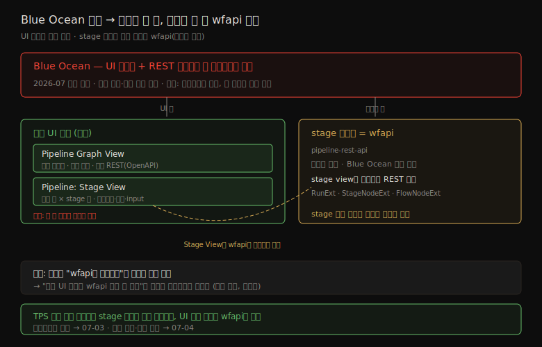

# 젠킨스 Blue Ocean 폐기 흐름과 wfapi 전환
---
> 이 문서를 읽고 나면 Blue Ocean이 왜·언제 폐기되는지를 설명하고, 공식 UI 대안 두 가지를 구분하며, "그러면 stage 단위 조회는 무엇으로 하는가"에 Pipeline: Stage View가 `wfapi`를 백엔드로 쓴다는 사실로 답하고, `wfapi`가 어떤 계층인지 한 문장으로 정리할 수 있습니다.
>
> - 이 편은 07 장의 *진입 개요*입니다. 폐기 흐름과 전환 방향을 먼저 잡습니다.
> - `wfapi` 엔드포인트 상세 스펙은 `07-03`, 로그 모델·구현 판단은 `07-04`에서 별도로 다룹니다.

## 사전 지식

> `06-01`·`06-03`에서 코어 빌드 API와 `wfapi`로 상태를 추적해 봤다면, 이 편은 그 선택의 배경 — Blue Ocean 폐기와 그 후 stage 조회를 무엇으로 가져갈지 — 을 먼저 정리하는 진입 편입니다. 코어 API의 `building`·`result`와 `wfapi/describe`의 `stages[]`를 떠올려 두면 비교가 수월합니다.

## 진입 — 왜 "폐기 흐름"을 먼저 보는가

> 07 장은 `wfapi`라는 한 API의 스펙으로 바로 들어가기 쉽습니다. 그런데 스펙을 외우기 전에 "왜 코어 API와 `wfapi`로 가고, Blue Ocean은 왜 뒤로 미루는가"를 모르면 엔드포인트 선택의 기준이 서지 않습니다.

Blue Ocean은 오랫동안 Jenkins 파이프라인을 보기 좋게 그려 준 플러그인이라, 처음 자동화를 설계하면 "stage를 보려면 Blue Ocean을 쓰면 되겠지"라고 출발하기 쉽습니다. 그러나 Blue Ocean에는 폐기 일정이 잡혀 있고, 그 사실이 신규 의존을 어디에 둘지를 바꿉니다. 이 편은 스펙으로 들어가기 전에 폐기 흐름(왜→언제→대안)과 `wfapi` 전환의 큰 그림을 먼저 세웁니다.

## 1. 폐기 흐름 — 왜, 언제, 무엇이 멈추는가

> Blue Ocean 폐기는 "기능이 부족해서"가 아니라 "더 이상 개발되지 않아서"입니다. 이 구분이 전환 판단의 출발점입니다.

폐기 이유를 한 줄로 옮기면 "더 현대적인 대안이 등장해서"입니다. Jenkins 공식 문서는 "시간이 지나면서 Blue Ocean을 대체할 더 현대적인 도구들이 생겨났다(more modern tools have cropped up to replace it)"고 직접 밝힙니다 (출처: jenkins.io/doc/book/blueocean). Blue Ocean이 처음 나오던 시절 Jenkins UI에 요구되던 디자인 기준을 채우려 만들어졌지만, 그 코드베이스가 동결(frozen)된 사이 비슷한 기능을 더 활발히 유지보수하는 플러그인들이 자리를 잡았다는 뜻입니다.

폐기 시점과 그 의미는 다음과 같습니다.

| 시점 | 상태 | 의미 |
|------|------|------|
| 2022~ | 유지보수 모드 | 신규 UI 투자 중단, 사실상 동결 시작 |
| 현재 | maintenance mode | 새 기능 없음, 중대한 보안·결함만 선택적 수정 |
| 2026년 7월 | 폐기(deprecated) 예정 | 이후 보안 수정도 기능 업데이트도 받지 않음 |

그래서 폐기는 "언젠가 사라질지 모른다"가 아니라 "시점이 명시됐다"로 읽어야 합니다. 신규 기능을 Blue Ocean에 새로 묶는 선택은 폐기 시점에 그 경로를 걷어내는 비용이 예약된 부채가 됩니다.

## 2. 공식 UI 대안 — Pipeline Graph View / Pipeline: Stage View

> Blue Ocean은 한 플러그인이 UI 시각화와 REST 데이터를 둘 다 제공했습니다. 그래서 대안도 그 두 축으로 갈립니다. 먼저 UI 축을 봅니다.

공식 문서가 UI 시각화 대안으로 직접 이름을 댄 플러그인은 두 가지입니다 (출처: jenkins.io/doc/book/blueocean).

- **Pipeline Graph View**: "actively maintained and provides the most crucial features of Blue Ocean"(활발히 유지보수되며 Blue Ocean의 가장 핵심 기능을 제공). 파이프라인을 중첩 그래프로 시각화하고 stage를 접이식 목록으로 탐색합니다.
- **Pipeline: Stage View**: 파이프라인 실행의 대체 시각화. 빌드 한 행에 stage별 열을 두고 소요시간·로그·input 버튼을 보여 줍니다.

다만 공식 안내도 이 둘이 Blue Ocean의 완전한 대체는 아니라고 단서를 답니다. stage 흐름 시각화 같은 핵심은 가져오지만, Blue Ocean이 제공하던 일부 경험까지 그대로 옮겨 오지는 못한다는 뜻입니다. 선호 이유가 기능 우위가 아니라 "활발히 유지보수됨"이라는 점이 폐기 맥락과 같은 결입니다.

## 3. 그러면 stage 단위 조회는 무엇으로 하는가

> 여기가 이 편의 핵심입니다. UI 대안은 공식이 짚었지만, "stage 단위 *데이터*를 어디서 받는가"는 한 단계 더 들어가야 보입니다.

Pipeline: Stage View가 stage를 그리려면 stage 데이터를 어딘가에서 받아야 합니다. 그 백엔드가 바로 `Pipeline: REST API` 플러그인, 즉 `wfapi`입니다. Stage View 플러그인 문서는 "stage view를 구동하는 REST API"를 설명하며 그 REST 속성(`RunExt`·`StageNodeExt`·`FlowNodeExt`)을 나열하고, 버전 히스토리로 `pipeline-rest-api`를 직접 가리킵니다 (출처: plugins.jenkins.io/pipeline-stage-view · github.com/jenkinsci/pipeline-stage-view-plugin). 즉 공식 UI 대안 자체가 `wfapi` 위에 서 있습니다.

이 관계를 그림으로 보면 다음과 같습니다.

여기서 한 가지를 정확히 구분해야 합니다. 

- 공식 문서는 UI 대안을 명시할 뿐, "백엔드 상태 추적을 `wfapi`로 갈아타라"고 *명령*하지는 않습니다. 
- 그렇지만 공식 UI 대안인 Stage View가 `wfapi`를 백엔드로 소비한다는 것은 *구조적 사실*입니다. 그래서 "stage 단위 데이터 조회의 사실상 표준은 `wfapi`"라는 결론은 추측이 아니라, 공식 대안이 서 있는 토대를 그대로 따라간 것입니다. 
- TPS처럼 외부 시스템이 stage 상태를 직접 조회한다면, UI 대신 그 토대인 `wfapi`를 직접 호출하면 됩니다.

## 4. `wfapi`는 어떤 계층인가

> `wfapi`는 코어 `/api/json`도 아니고 Blue Ocean API도 아닙니다. 둘 사이의 Pipeline 전용 보조 REST 계층입니다.

`wfapi`는 `Pipeline: REST API` 플러그인이 제공하는 엔드포인트 집합입니다. 세 계층을 한눈에 비교하면 다음과 같습니다.

| 구분 | 코어 Build API | `wfapi` | Blue Ocean REST |
|------|------|------|------|
| 대표 경로 | `/{build}/api/json` | `/{build}/wfapi/describe` | `/blue/rest/.../runs/{build}` |
| 강점 | `building`, `result` 기본 메타 | stage 구조, 승인 대기, node drill-down | step 단위 드릴다운 |
| 의존 플러그인 | Jenkins 코어 | `pipeline-rest-api` | `blueocean` (폐기 예정) |
| 유지보수 | 항상 유지 | 활발히 유지 | 2026-07 폐기 |

실무에서 중요한 점은 세 가지입니다.

- `wfapi`는 Blue Ocean이 없어도 별도로 동작합니다. Blue Ocean을 걷어내도 `wfapi`까지 사라지지 않습니다.
- stage 상태 추적과 node 로그 조회는 `wfapi`로 상당 부분 해결됩니다.
- 단, step 단위 드릴다운은 `wfapi`에 직접 대응이 없어, 그 한 가지는 Blue Ocean이 더 풍부합니다.

엔드포인트 경로와 응답 필드의 상세 스펙은 [07-03. wfapi 상세 스펙과 활용](07-03.wfapi%20상세%20스펙과%20활용.md)에서 다룹니다. 이 편에서는 "`wfapi`가 안전한 신규 의존처"라는 큰 그림까지만 잡습니다.

## 5. 다음 문서로 가는 갈래

> 이 진입 편 다음은 목적에 따라 두 갈래입니다.

- 엔드포인트 집합·응답 구조·진행률 계산이 궁금하면 → [07-03. wfapi 상세 스펙과 활용](07-03.wfapi%20상세%20스펙과%20활용.md)
- 로그 범위·`nodeId` 의미·Blue Ocean-like 화면 구현 판단이 궁금하면 → [07-04. wfapi 로그 모델과 Blue Ocean 구현 판단](07-04.wfapi%20로그%20모델과%20Blue%20Ocean%20구현%20판단.md)

상태 추적 백엔드 선택의 현대화 판단은 같은 묶음의 [06-03. 상태 추적 API 현대화와 Blue Ocean 해석](06-03.상태%20추적%20API%20현대화와%20Blue%20Ocean%20해석.md)과 이어집니다.

## 면접 질문

> 답을 떠올린 뒤 §정답 절에서 같은 번호로 대조하세요.

1. Blue Ocean의 폐기 이유를 "기능 부족"이 아니라 무엇으로 설명해야 합니까?
2. 공식이 짚은 Blue Ocean의 UI 대안 두 가지는 무엇이며, 어떤 단서가 붙습니까?
3. Pipeline: Stage View는 stage 데이터를 무엇으로 받습니까? 이것이 "stage 조회는 wfapi"라는 결론과 어떻게 연결됩니까?
4. "공식이 wfapi로 갈아타라고 명령했다"와 "공식 UI 대안이 wfapi 위에 서 있다"는 왜 구분해야 합니까?

### 빈칸 채우기 — 폐기 흐름과 전환

다음 빈칸을 채워 보세요. 정답은 문서 끝 "빈칸 정답" 절에 있습니다.

1. Blue Ocean은 `____`년 `__`월 폐기 예정이며, 이후 `____` 수정과 `____` 업데이트를 받지 않습니다.
2. 공식 UI 대안은 `____`와 `____` 두 플러그인이며, 둘 다 완전한 `____`는 아니라는 단서가 붙습니다.
3. Pipeline: Stage View의 stage 데이터를 구동하는 백엔드 플러그인은 `____`(=wfapi)입니다.
4. `wfapi`는 코어 API도 Blue Ocean도 아닌 Pipeline 전용 `____` REST 계층이며, Blue Ocean이 `____`도 별도로 동작합니다.

## 정답

> 위 질문을 스스로 설명해 본 뒤에 펼치세요.

### 정답 1 — 폐기 이유는 "개발 중단"

공식 문서는 "더 현대적인 도구들이 생겨나 Blue Ocean을 대체했다"고 밝힙니다. 즉 Blue Ocean이 기능적으로 모자라서가 아니라, 코드베이스가 동결돼 더 이상 개발되지 않는 사이 활발히 유지보수되는 대안들이 자리를 잡았기 때문입니다. 그래서 폐기는 기능 평가가 아니라 유지보수 지속성의 문제로 읽어야 합니다.

### 정답 2 — UI 대안 두 가지와 단서

Pipeline Graph View와 Pipeline: Stage View입니다. 공식은 Graph View를 "활발히 유지보수되며 Blue Ocean의 가장 핵심 기능을 제공"한다고 소개합니다. 다만 두 플러그인 모두 Blue Ocean의 완전한 대체는 아니라는 단서가 붙어, stage 시각화 같은 핵심은 가져오되 일부 경험은 그대로 옮기지 못합니다.

### 정답 3 — Stage View는 wfapi를 백엔드로 쓴다

Pipeline: Stage View는 stage 데이터를 `Pipeline: REST API` 플러그인, 곧 `wfapi`에서 받습니다. 플러그인 문서가 stage view를 구동하는 REST 속성(`RunExt`·`StageNodeExt`·`FlowNodeExt`)을 설명하고 `pipeline-rest-api`를 직접 가리킵니다. 따라서 공식 UI 대안 자체가 `wfapi` 위에 서 있으므로, stage 단위 데이터를 직접 조회하려면 그 토대인 `wfapi`를 호출하면 됩니다.

### 정답 4 — "명령"과 "구조"의 구분

공식 문서는 UI 대안만 명시하고, "백엔드를 wfapi로 바꿔라"라고 명령한 적은 없습니다. 그러나 그 UI 대안인 Stage View가 wfapi를 백엔드로 소비한다는 것은 검증 가능한 구조적 사실입니다. 이 둘을 섞으면, 공식이 직접 권하지 않은 것을 "공식 권고"로 과장하게 됩니다. 그래서 "공식 대안이 wfapi 위에 서 있다(구조)"까지만 말하고, "공식이 wfapi를 쓰라고 했다(명령)"로 넘어가지 않는 편이 정확합니다.

### 빈칸 정답 — 폐기 흐름과 전환

1. 2026 / 7 / 보안 / 기능
2. Pipeline Graph View / Pipeline: Stage View / 대체
3. `pipeline-rest-api`
4. 보조 / 없어도

## 관련 문서

> 이 진입 편은 같은 07 장의 스펙·로그 모델 편으로 이어지고, 06 장의 현대화 해석과 함께 읽으면 "왜 wfapi인가 → 어떻게 쓰는가 → 어디까지 되는가"의 흐름이 완성됩니다.

- [07-03. wfapi 상세 스펙과 활용](07-03.wfapi%20상세%20스펙과%20활용.md) § "endpoint 집합" — 이 편이 큰 그림으로 소개한 `wfapi`의 경로·필드 상세
- [07-04. wfapi 로그 모델과 Blue Ocean 구현 판단](07-04.wfapi%20로그%20모델과%20Blue%20Ocean%20구현%20판단.md) § "Blue Ocean 구현 판단" — `wfapi`로 stage 화면을 어디까지 구현할 수 있는지
- [06-03. 상태 추적 API 현대화와 Blue Ocean 해석](06-03.상태%20추적%20API%20현대화와%20Blue%20Ocean%20해석.md) § "Blue Ocean 해석" — 상태 추적 백엔드 선택의 현대화 판단
- [Blue Ocean (Jenkins Handbook)](https://www.jenkins.io/doc/book/blueocean/) — 폐기 안내와 UI 대안 공식 출처
- [Pipeline: Stage View Plugin](https://plugins.jenkins.io/pipeline-stage-view/) — stage view를 구동하는 REST API 설명
