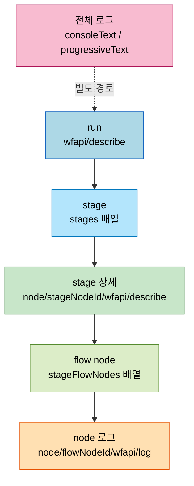
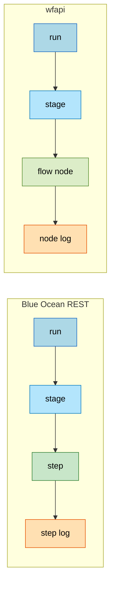

# 젠킨스 wfapi 로그 모델과 Blue Ocean 구현 판단
---
> 이 문서를 끝까지 읽으면 다음을 할 수 있습니다.
>
> - `wfapi`에 run 전체 로그 API가 없는 이유를 설명할 수 있습니다.
> - `wfapi/log`의 범위가 build 전체가 아니라 node 단위임을 비교할 수 있습니다.
> - `nodeId`가 Jenkins agent가 아니라 실행 그래프 노드임을 구분해 설명할 수 있습니다.
> - Blue Ocean-like 화면을 `wfapi`로 구현할 때 조회·저장 전략을 선택할 수 있습니다.

## 사전 지식

이 문서는 다음 문서를 전제로 읽으면 가장 자연스럽습니다.

- `07-01.API 로그 조회와 적재.md`
- `07-02.wfapi 상세 스펙과 활용.md`

위 두 문서에서 `consoleText`, `progressiveText`, `wfapi/describe`의 기본 의미를 먼저 잡고 오시면 이 문서의 판단 포인트가 더 잘 읽힙니다.

## 진입 — 왜 wfapi 로그 모델을 따로 판단해야 하는가

> `wfapi`를 처음 접하면 "여기에 로그 API가 있으니 build 전체 로그도 여기서 받겠지"라고 기대하기 쉽습니다. 그러나 실제 구현에 들어가면 그 기대가 어긋나면서 모델이 꼬입니다.

`wfapi`는 파이프라인 구조를 잘 보여주는 API이지만, 그 구조와 로그를 어떤 범위로 끊어 주는지를 오해하면 조회 설계와 저장 설계가 모두 틀어집니다. 특히 Blue Ocean 같은 stage 중심 화면을 자체 구현하려는 순간, "어디까지 `wfapi`로 되고 어디부터는 안 되는가"라는 경계 판단이 필요합니다. 이 문서는 그 경계를 endpoint 나열이 아니라 구현 판단 관점에서 정리합니다.

## 1. 이 문서의 범위

> 이 범위 정의는 이미 익숙한 "API 레퍼런스 읽기"의 *실무 판단* 측면입니다. endpoint를 외우는 것이 아니라, 그 endpoint들이 어떤 결정을 강제하는지를 봅니다.

이 문서는 `wfapi` 자체의 endpoint 나열보다, 실제 구현 시 부딪히는 판단 포인트를 설명합니다. 답하려는 질문은 다음과 같습니다.

1. `wfapi`에 파이프라인 1건 전체 로그를 한 번에 주는 API가 있는가
2. `wfapi/log`는 build 전체 로그인가, 특정 stage 로그인가
3. `nodeId`는 Jenkins agent 이름과 무엇이 다른가
4. `stages[]`보다 더 세부적인 실행 단위가 있는가
5. Blue Ocean과 비슷한 화면을 만들려면 처음부터 모든 stage를 다 조회해야 하는가
6. 로그를 파일로 적재할 때 `nodeId`별로 따로 저장해야 하는가


## 2. `wfapi`에 전체 로그 API는 없습니다

> `wfapi`는 파이프라인 구조와 node 로그를 잘 보여주지만, build 전체 로그를 구조화해서 한 번에 주는 run-level 로그 API는 제공하지 않습니다.

2026년 4월 24일 기준 Jenkins 공식 `Pipeline: REST API` 문서의 endpoint 목록은 다음 범위에 집중합니다.

- job 설명: `/{pipelineStruct}/wfapi`
- run 목록: `/{pipelineStruct}/wfapi/runs`
- run 전체 구조: `/{pipelineStruct}/{buildNumber}/wfapi/describe`
- 승인 대기: `/{pipelineStruct}/{buildNumber}/wfapi/pendingInputActions`
- artifacts: `/{pipelineStruct}/{buildNumber}/wfapi/artifacts`
- node 상세: `/{pipelineStruct}/{buildNumber}/execution/node/{nodeId}/wfapi/describe`
- node 로그: `/{pipelineStruct}/{buildNumber}/execution/node/{nodeId}/wfapi/log`

여기서 중요한 점은 run 단위에는 `describe`는 있지만 `log`가 없다는 것입니다.

즉 아래 endpoint는 공식 문서 기준으로 없습니다.

```text
# run 단위 log endpoint는 wfapi 표준에 정의돼 있지 않습니다.
# 따라서 build 전체 로그를 wfapi 안에서 찾으면 404 또는 미정의로 막힙니다.
/{pipelineStruct}/{buildNumber}/wfapi/log
```

그래서 판단은 단순합니다.

| 보고 싶은 것 | 써야 하는 API |
|------|------|
| build 전체 로그 | `consoleText`, `progressiveText` |
| stage 상태와 구조 | `wfapi/describe` |
| 특정 stage 또는 flow node 로그 | `execution/node/{nodeId}/wfapi/log` |

`wfapi`는 어떤 객체 URL에도 `/api/`를 붙여 `/api/json` 형태로 접근하는 일반 Remote Access API와는 별개의 plugin endpoint이지만, 같은 사상 위에 있습니다. 일반 Remote Access API도 객체별 표현을 주고 필요한 필드를 `tree=`로 골라 받게 하는 구조라서, "한 방에 전체"보다 "필요한 객체를 골라 조회"하는 모델이 기본입니다 (출처: jenkins.io/doc/book/using/remote-access-api). `wfapi` 역시 "전체 로그 1회 조회 API"보다 "구조 조회 + 필요한 node 로그 drill-down" 쪽에 가깝습니다.


## 3. `wfapi/log`는 build 로그가 아니라 node 로그입니다

> `wfapi/log`의 핵심은 범위입니다. 범위가 build 전체가 아니라 `execution/node/{nodeId}` 기준이라는 점을 먼저 잡아야 합니다.

공식 `Pipeline: REST API` 문서는 node 상세 응답 안에 `_links.log.href`를 제공하고, 그 링크가 `execution/node/{nodeId}/wfapi/log`를 가리킨다고 설명합니다 (출처: plugins.jenkins.io/pipeline-rest-api).

즉 `wfapi/log`는 다음 의미입니다.

- 특정 stage 자체의 로그
- 또는 특정 stage 안의 더 작은 flow node 로그

전체 로그 계열과 비교하면 다음과 같습니다.

| API | 범위 | 주 용도 |
|------|------|------|
| `consoleText` | build 전체 로그 | 전체 원문 저장 |
| `progressiveText` | build 전체 증분 로그 | 실행 중 tail |
| `wfapi/log` | 특정 node 로그 | 실패 지점 축소, stage 내부 추적 |

이 범위 차이를 일상 비유로 옮기면 `consoleText`는 책 한 권을 통째로 복사하는 것이고, `wfapi/log`는 "5장 3절만 뽑아 달라"는 부분 발췌 요청에 가깝습니다. 이 비유는 "범위를 좁혀 받는다"는 점까지는 유효하지만, 책의 절은 미리 고정된 목차로 존재하는 반면 flow node는 실행 시점에 동적으로 생성된다는 점에서 깨집니다. 즉 `nodeId`는 책 목차처럼 영구 번호가 아니라 그 build 안에서만 매겨진 좌표입니다.

실무에서 보통 이렇게 조합합니다.

1. 먼저 `progressiveText`나 `consoleText`로 전체 로그를 봅니다.
2. `wfapi/describe`로 어느 stage가 문제인지 봅니다.
3. 필요한 stage나 flow node만 `wfapi/log`로 추가 조회합니다.

즉 모든 stage 로그를 처음부터 전부 따로 긁는 것이 기본 패턴은 아닙니다.


## 4. `nodeId`는 Jenkins agent가 아니라 실행 그래프 노드입니다

> `nodeId`를 Jenkins agent 이름으로 이해하면 거의 반드시 모델이 꼬입니다. `nodeId`는 파이프라인 실행 그래프 안의 FlowNode 식별자입니다.

`nodeId`는 다음이 아닙니다.

- Jenkins agent 이름
- `/computer/{nodeName}`의 node
- executor 번호
- build 번호

`nodeId`는 다음입니다.

- 특정 run 안에서 생성된 stage 또는 하위 실행 단위의 ID

공식 `wfapi` 예시를 보면 다음과 같습니다 (출처: plugins.jenkins.io/pipeline-rest-api).

- run의 `stages[]`에서 `Build` stage가 `id=5`
- `execution/node/5/wfapi/describe` 안의 `stageFlowNodes[]`에서 `Git`이 `id=6`
- 같은 배열에서 `Shell Script`가 `id=7`

즉 의미는 다음처럼 읽으면 됩니다.

| 값 | 의미 |
|------|------|
| stage `id=5` | `Build` stage 자체 |
| flow node `id=6` | `Build` 안의 `Git` 실행 |
| flow node `id=7` | `Build` 안의 `Shell Script` 실행 |

`nodeId`를 비유로 잡으면 호텔 객실 번호와 비슷합니다. "203호"는 그 호텔(=이 build) 안에서만 방을 특정하고, 다른 호텔의 203호와는 아무 관계가 없습니다. 이 비유는 "지역 한정 식별자"라는 점까지는 유효하지만, 호텔 객실은 다음 손님에게도 같은 번호로 재사용되는 반면 `nodeId`는 매 build마다 실행 그래프가 새로 그려지며 번호가 다시 매겨질 수 있다는 점에서 깨집니다.

중요한 점은 이 값이 보통 **해당 build 안에서만 의미가 있다**는 것입니다.

그래서 저장 키나 조회 키는 다음처럼 잡는 편이 안전합니다.

```text
# build 컨텍스트(job + buildNumber)를 키 앞에 두어야
# nodeId가 다른 build와 충돌하지 않습니다.
{job}/{buildNumber}/{nodeId}
```

반대로 아래처럼 `nodeId`만 단독 키로 쓰면 위험합니다.

```text
# nodeId는 build를 가로질러 유일하지 않으므로
# 단독 키로 쓰면 서로 다른 build의 로그가 덮어쓰여집니다.
{nodeId}
```


## 5. `stages[]` 아래로 더 내려갈 수 있습니다

> `stages[]`가 끝이 아닙니다. `wfapi`는 stage 아래에 `stageFlowNodes[]`라는 더 세부적인 계층을 보여줍니다.

공식 node 상세 endpoint 설명은 "해당 node가 stage step이면, 그 stage 동안 활성화된 모든 pipeline node 목록을 반환한다"고 설명합니다 (출처: plugins.jenkins.io/pipeline-rest-api).

구조를 단순화하면 다음과 같습니다.

```text
# 위에서 아래로 내려갈수록 범위가 좁아집니다.
# 각 화살표는 "한 단계 drill-down"을 위한 별도 호출입니다.
run
  -> stages[]
    -> execution/node/{stageNodeId}/wfapi/describe
      -> stageFlowNodes[]
        -> execution/node/{flowNodeId}/wfapi/log
```

이 stage 트리는 일반 Remote Access API의 `depth=` 파라미터와 같은 발상입니다. `depth=`는 클수록 더 깊은 중첩을 한 응답에 담아 주는데, `wfapi`도 같은 깊이 계층(run → stage → flow node)을 가지되 깊은 층은 별도 endpoint로 호출하게 나눠 둔 것입니다 (출처: jenkins.io/doc/book/using/remote-access-api). 즉 `wfapi`에서 일반적으로 볼 수 있는 깊이는 다음과 같습니다.

| 레벨 | 데이터 위치 | 의미 |
|------|------|------|
| run | `/{build}/wfapi/describe` | 파이프라인 전체 |
| stage | `stages[]` | 상위 stage |
| flow node | `stageFlowNodes[]` | stage 내부 실행 단위 |

하지만 한계도 있습니다.

- Blue Ocean처럼 `steps/{stepId}`를 독립 자원으로 다루는 API는 `wfapi` 표준 endpoint에 없습니다.
- 즉 `wfapi`는 stage와 flow node 수준까지는 좋지만, Blue Ocean step 모델을 그대로 재현하는 데는 한계가 있습니다.

세 레벨의 drill-down 관계를 흐름으로 보면 다음과 같습니다.




## 6. Blue Ocean 같은 화면을 `wfapi`로 구현할 때 조회는 lazy loading이 맞습니다

> Blue Ocean-like 화면을 만든다고 해서 처음부터 각 stage 상세와 로그를 전부 한 번에 모아 올 필요는 없습니다. 오히려 그렇게 하면 비효율적입니다.

`wfapi`만으로 stage 중심 화면을 만든다고 가정하면 조회 흐름은 보통 다음이 가장 자연스럽습니다.

1. 초기 진입
   - `/{build}/wfapi/describe`
2. stage 클릭 또는 확장
   - `execution/node/{stageNodeId}/wfapi/describe`
3. 로그 탭 진입
   - `execution/node/{nodeId}/wfapi/log`

이 패턴이 맞는 이유는 `wfapi`가 애초에 요약 API와 drill-down API를 분리해 뒀기 때문입니다.

초기 화면에서 바로 그릴 수 있는 정보는 다음 정도입니다.

- run 상태
- stage 목록
- stage 이름
- stage 상태
- stage duration

초기 화면에서 바로 얻기 어려운 정보는 다음입니다.

- stage 내부 세부 실행 단위
- 선택 stage의 상세 에러
- 선택 stage 또는 flow node 로그

즉 Blue Ocean-like UI를 `wfapi`로 구현할 때의 기본 원칙은 다음처럼 정리할 수 있습니다.

- 첫 화면은 `wfapi/describe` 1회 호출
- 세부 내용은 사용자가 선택한 stage만 추가 조회
- 로그는 선택한 node만 추가 조회

수치로 보면 차이가 분명합니다. stage 12개에 각 stage가 평균 4개의 flow node를 가진 파이프라인을 가정하면, eager 방식은 첫 화면에서 run describe 1회 + stage describe 12회 + node 로그 48회로 약 61회를 호출합니다. lazy 방식은 첫 화면 1회로 끝나고, 사용자가 실제로 연 stage 1개와 그 안 로그 1건만 추가하면 3회 안팎에 머뭅니다. 이 방식이 아니면 stage 수가 많은 파이프라인에서 불필요한 호출이 60배 가까이 늘어납니다.


## 7. Blue Ocean를 `wfapi`로 완전히 복제할 수는 없습니다

> `wfapi`는 Blue Ocean-like 화면의 상위 70~80% 정도는 충분히 커버하지만, step 레벨 parity까지 기대하면 부족합니다.

`wfapi`로 비교적 자연스럽게 만들 수 있는 것은 다음과 같습니다.

- 파이프라인 상단 상태 바
- stage별 성공/실패/진행 중 표시
- stage 클릭 후 내부 flow node 목록
- 선택 stage 또는 flow node 로그

반대로 그대로 재현하기 어려운 것은 다음과 같습니다.

- Blue Ocean의 step 전용 REST 계층
- `steps/{stepId}/log` 같은 step 로그 drill-down
- Blue Ocean가 가진 step 중심 정보 모델의 세밀함

따라서 구현 목표를 이렇게 잡는 편이 맞습니다.

- "Blue Ocean와 완전히 동일한 화면"
  - `wfapi`만으로는 부족할 수 있습니다.
- "Blue Ocean 스타일의 stage 중심 운영 화면"
  - `wfapi`만으로 충분히 가능합니다.

즉 UI는 Blue Ocean처럼 보이게 만들 수 있어도, 내부 데이터 모델은 `step`보다 `flow node` 중심으로 설계하는 편이 더 정확합니다.

두 API의 응답 모델 차이를 그림으로 비교하면 다음과 같습니다.




## 8. 로그 적재는 전체 로그만으로도 가능하지만, Blue Ocean-like UX까지 원하면 node 단위 보존이 유리합니다

> 로그 적재 전략은 목적에 따라 달라집니다. 단순 보관이면 전체 로그 1개로 충분하지만, stage별 과거 로그 UX까지 원하면 `build + nodeId` 단위 보존이 실용적입니다.

선택지는 크게 세 가지입니다.

### 8-1. 전체 로그만 저장

가장 단순한 방식입니다.

```text
# consoleText 한 번으로 받은 build 전체 로그를 통째로 보관합니다.
{job}/{buildNumber}/full.log
```

장점은 다음과 같습니다.

- 저장 구조가 단순합니다.
- 수집도 `consoleText`나 `progressiveText` 한 번이면 됩니다.

단점은 다음과 같습니다.

- 나중에 특정 stage 로그만 빠르게 보여주기 어렵습니다.
- 전체 로그 안에서 stage 경계를 애플리케이션이 직접 해석해야 합니다.

### 8-2. 전체 로그는 저장하고, stage 로그는 Jenkins에 실시간 재조회

하이브리드 운영형 방식입니다.

```text
# 전체 로그와 구조 메타만 저장하고,
# stage 로그는 화면에서 필요할 때 Jenkins로 다시 받습니다.
{job}/{buildNumber}/full.log
{job}/{buildNumber}/wfapi-describe.json
```

장점은 다음과 같습니다.

- 저장량이 크지 않습니다.
- UI에서 stage 클릭 시 Jenkins에 `wfapi/log`만 추가 요청하면 됩니다.

단점은 다음과 같습니다.

- Jenkins가 계속 응답 가능해야 합니다.
- 과거 이력 화면 성능이 Jenkins 상태에 묶입니다.

### 8-3. 전체 로그 + node별 로그를 같이 보존

Blue Ocean-like UX를 오래 보존하려면 가장 현실적인 방식입니다.

```text
# node 로그까지 미리 떠 두어 Jenkins 재조회 없이도
# stage 클릭 즉시 과거 로그를 보여줄 수 있게 합니다.
{job}/{buildNumber}/full.log
{job}/{buildNumber}/wfapi-describe.json
{job}/{buildNumber}/nodes/{nodeId}.log
{job}/{buildNumber}/nodes/{nodeId}.json
```

장점은 다음과 같습니다.

- stage 클릭 시 저장된 node 로그를 바로 보여줄 수 있습니다.
- Jenkins 재조회 의존도가 낮습니다.
- 운영 화면 응답이 안정적입니다.

단점은 다음과 같습니다.

- 수집과 저장 구조가 복잡해집니다.
- node 개수가 많은 파이프라인에서는 파일 수도 늘어납니다.

### 8-4. 결론

판단 기준은 다음처럼 두면 됩니다.

| 목적 | 권장 저장 전략 |
|------|------|
| 단순 아카이브 | 전체 로그만 저장 |
| 운영 중 실시간 확인 | 전체 로그 + 필요 시 Jenkins 재조회 |
| Blue Ocean-like 과거 이력 UX | 전체 로그 + `build/nodeId` 단위 보존 |

즉 `nodeId`별 파일 저장은 **필수는 아니지만**, Blue Ocean 같은 UX를 자체적으로 오래 제공하려면 사실상 가장 실용적인 선택입니다.


## 9. 권장 구현안

> 지금까지의 질문을 실무 구현안으로 줄이면 "구조는 `wfapi`, 전체 로그는 콘솔 API, 세부 로그는 필요할 때만 node API"입니다.

가장 무난한 구성은 다음과 같습니다.

1. 전체 로그 적재
   - `consoleText` 또는 `progressiveText`
2. 파이프라인 구조 저장
   - `wfapi/describe`
3. 화면 진입 시
   - 저장된 `wfapi/describe` 또는 Jenkins `wfapi/describe` 조회
4. stage 클릭 시
   - `execution/node/{nodeId}/wfapi/describe`
5. 로그 클릭 시
   - 우선 저장된 `nodes/{nodeId}.log` 확인
   - 없으면 Jenkins `wfapi/log` 호출

즉 처음부터 "모든 stage 로그를 다 따로 조회해서 합친다"가 아니라 다음 구성입니다.

- 전체 로그는 한 번
- 구조는 한 번
- 세부 로그는 선택 시점에만

이 쪽이 `wfapi`의 구조와 운영 요구를 동시에 만족시키는 방식입니다.


## 면접 질문

다음 질문은 이 문서의 스펙에서 바로 도출됩니다. 답을 먼저 떠올린 뒤 아래 정답 절과 맞춰 보시기 바랍니다.

1. `wfapi`에는 build 전체 로그를 한 번에 주는 run-level 로그 endpoint가 없습니다. 그 이유와, 전체 로그가 필요할 때 무엇으로 대체하는지를 설명해 보십시오.
2. 같은 build의 stage 화면을 만들 때 Blue Ocean REST 응답과 `wfapi` 응답은 어떤 계층 차이가 있습니까. TPS에서 stage 중심 운영 화면을 자체 구현한다면 둘 중 무엇을 선택해야 하며 그 기준은 무엇입니까.
3. `nodeId`를 저장 키로 쓸 때 `{nodeId}` 단독이 아니라 `{job}/{buildNumber}/{nodeId}`로 잡아야 하는 이유를 실패 시나리오와 함께 설명해 보십시오.
4. Blue Ocean-like 화면을 `wfapi`로 구현할 때 첫 화면에서 모든 stage 상세와 로그를 eager loading하면 어떤 문제가 생기며, lazy loading이 맞는 근거는 무엇입니까.

### 빈칸 채우기 — wfapi 로그 모델

다음 빈칸을 채워 보십시오. 정답은 이 문서 맨 끝의 빈칸 정답 절에 있습니다.

1. `wfapi`는 run 단위에 `describe`는 제공하지만 ( ㄱ )은 제공하지 않으므로, build 전체 로그는 `consoleText`나 ( ㄴ )로 받습니다.
2. `nodeId`는 Jenkins agent 이름이 아니라 실행 그래프 안의 ( ㄷ ) 식별자이며, 보통 ( ㄹ ) 안에서만 의미를 가집니다.
3. `wfapi`는 stage 아래에 ( ㅁ ) 계층을 보여주지만, Blue Ocean처럼 ( ㅂ )를 독립 자원으로 다루는 endpoint는 없습니다.
4. 일반 Remote Access API에서 응답 필드를 골라 축소할 때는 ( ㅅ ) 파라미터를, 중첩 깊이를 제어할 때는 ( ㅇ ) 파라미터를 씁니다.


## 정답

### 정답 1 — run-level 로그 API 부재와 대체

2026년 4월 24일 기준 공식 `Pipeline: REST API` endpoint 목록에서 run 단위에는 `wfapi/describe`만 있고 `wfapi/log`는 node 단위(`execution/node/{nodeId}/wfapi/log`)에만 존재합니다. `wfapi`의 설계 의도가 "전체 로그 1회 조회"가 아니라 "구조 조회 후 필요한 node만 drill-down"이기 때문입니다. 따라서 build 전체 로그가 필요하면 `wfapi`가 아니라 `consoleText`(전체 원문)나 `progressiveText`(실행 중 증분 tail)로 받아야 합니다. 이는 일반 Remote Access API가 객체별 표현을 주고 `tree=`로 필요한 부분만 받게 하는 모델과 같은 사상입니다 (출처: jenkins.io/doc/book/using/remote-access-api).

### 정답 2 — Blue Ocean REST와 wfapi의 계층 차이, 선택 기준

Blue Ocean REST는 run → stage → step → step log까지 step을 독립 자원으로 노출합니다. `wfapi`는 run → stage → flow node → node log까지로, step 전용 REST 계층과 `steps/{stepId}/log` 같은 step 로그 drill-down이 없습니다. 따라서 `wfapi`로는 Blue Ocean-like 화면의 상위 70~80%(상태 바, stage 상태, flow node 목록, node 로그)는 만들 수 있지만 step 레벨 parity는 어렵습니다. TPS처럼 stage 중심 운영 화면을 자체 구현한다면 `wfapi`를 선택하는 편이 맞습니다. Blue Ocean REST 구현 플러그인 의존을 줄이고, 운영에 필요한 정보가 stage와 flow node 수준에서 대부분 충족되기 때문입니다. 다만 내부 데이터 모델은 `step`이 아니라 `flow node` 중심으로 설계해야 응답 구조와 어긋나지 않습니다.

### 정답 3 — nodeId 단독 키의 위험

`nodeId`는 Jenkins agent나 executor 번호가 아니라 특정 run의 실행 그래프 안에서 생성된 FlowNode 식별자이며, 보통 해당 build 안에서만 의미를 가집니다. 매 build마다 실행 그래프가 새로 그려지면서 `id=5`, `id=6` 같은 번호가 다시 매겨질 수 있습니다. 따라서 `{nodeId}`만 단독 키로 쓰면 서로 다른 build의 `id=5` 로그가 같은 키에 매핑되어 덮어쓰이거나 잘못 조회됩니다. `{job}/{buildNumber}/{nodeId}`로 build 컨텍스트를 키 앞에 두어야 충돌 없이 build를 가로질러 안전하게 저장·조회할 수 있습니다.

### 정답 4 — eager loading의 문제와 lazy loading 근거

`wfapi`는 요약 API(`wfapi/describe`)와 drill-down API(`execution/node/{nodeId}/wfapi/describe`, `wfapi/log`)를 의도적으로 분리해 두었습니다. 첫 화면에서 모든 stage 상세와 로그를 eager loading하면, stage 12개에 각 4개 flow node인 파이프라인 기준 run describe 1회 + stage describe 12회 + node 로그 48회로 약 61회의 호출이 발생합니다. lazy loading은 첫 화면을 `wfapi/describe` 1회로 끝내고, 사용자가 실제로 연 stage와 로그만 추가 조회해 3회 안팎에 머뭅니다. 초기 화면에 필요한 run 상태·stage 목록·상태·duration은 describe 1회로 모두 그릴 수 있으므로, 세부 실행 단위와 로그를 선택 시점까지 미루는 lazy loading이 `wfapi`의 구조와 정합합니다.


### 빈칸 정답 — wfapi 로그 모델

1. (ㄱ) run-level `wfapi/log` endpoint, (ㄴ) `progressiveText`
2. (ㄷ) FlowNode, (ㄹ) 해당 build(run)
3. (ㅁ) `stageFlowNodes[]`, (ㅂ) `steps/{stepId}`(step)
4. (ㅅ) `tree=`, (ㅇ) `depth=`


## 관련 문서

> wfapi 로그 모델은 같은 07 장의 로그·wfapi 스펙 문서, 그리고 상태 추적·현대화 문서와 함께 읽을 때 가장 잘 연결됩니다. 아래 문서로 인접 맥락을 채우시기 바랍니다.

- [07-01. API 로그 조회와 적재](07-01.API%20로그%20조회와%20적재.md) § "전체 로그와 wfapi/log" — 전체 로그 적재와 버전 변화(Blue Ocean 축소 포함)를 함께 설명합니다.
- [07-02. wfapi 상세 스펙과 활용](07-02.wfapi%20상세%20스펙과%20활용.md) § "endpoint 집합" — 이 문서의 판단이 전제로 하는 `wfapi` endpoint와 필드 스펙을 정리합니다.
- [06-03. 상태 추적 API 현대화와 Blue Ocean 해석](06-03.상태%20추적%20API%20현대화와%20Blue%20Ocean%20해석.md) § "Blue Ocean 해석" — Blue Ocean REST와 상태 추적 현대화 맥락을 짚어 구현 선택 판단을 보강합니다.
- [05-03. Queue 적재 이후 실행 흐름과 데이터 추적](05-03.Queue%20적재%20이후%20실행%20흐름과%20데이터%20추적.md) § "실행 흐름" — queue→buildNumber 전환 이후 실행 데이터를 추적하는 흐름과 이어집니다.
- [Pipeline: REST API Plugin](https://plugins.jenkins.io/pipeline-rest-api/) — `wfapi` 공식 endpoint와 sample response.
- [Blue Ocean REST Implementation](https://plugins.jenkins.io/blueocean-rest-impl/) — Blue Ocean REST 구현 플러그인 정보.
