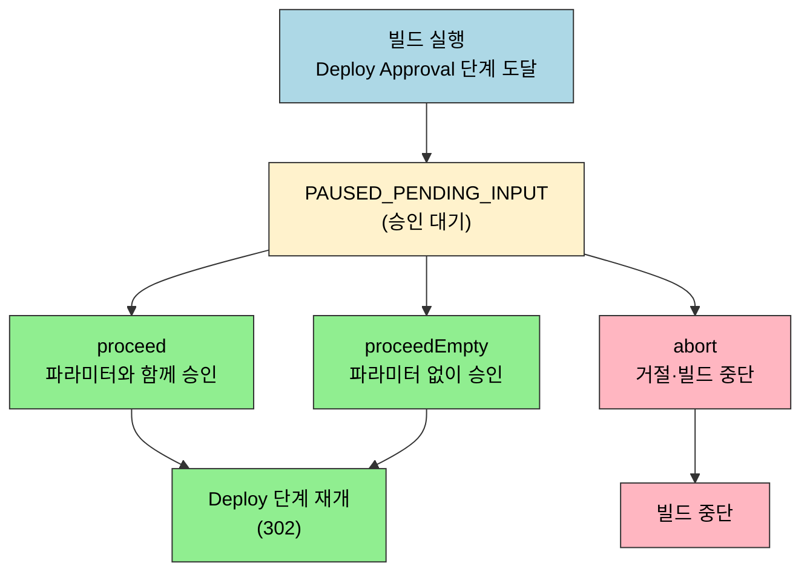
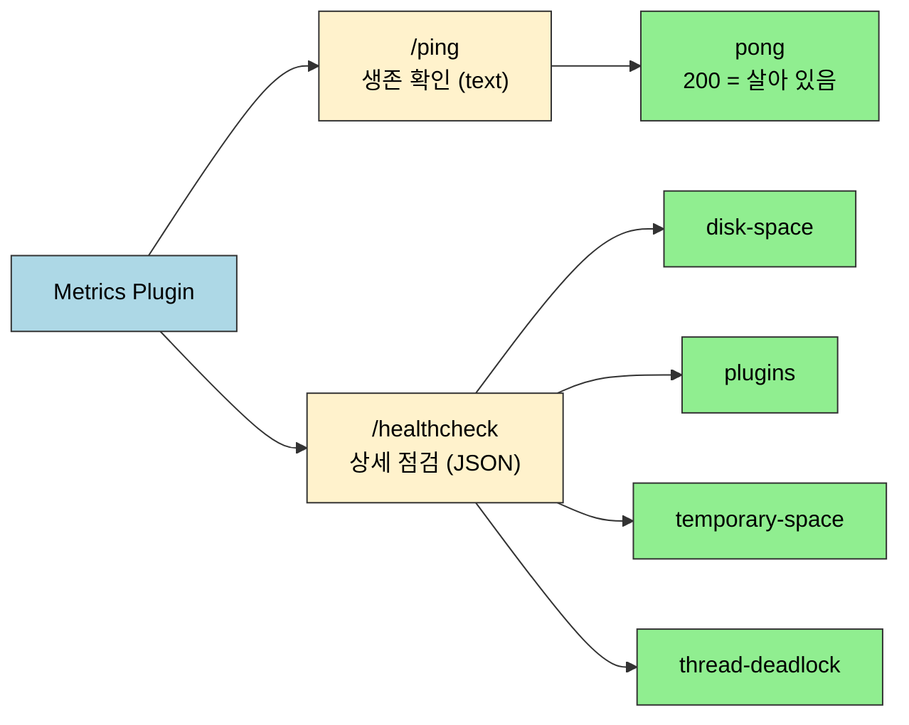

# 젠킨스 API 배포 승인과 운영 관리
---
> 이 문서는 Jenkins Pipeline의 `input` 승인 API와 Jenkins 운영 상태를 확인하는 조회 API 자체를 설명하는 스펙 문서입니다.
>
> - 승인 대기 조회, 승인, 거절, 시스템 정보 조회, 노드 조회, Metrics Plugin 기반 헬스체크 API를 다룹니다.
> - `PAUSED_PENDING_INPUT` 해석, 승인자 제어, readiness 정책, TPS 운영 패턴은 `09-02`에서 별도로 다룹니다.

## §학습 목표

> 이 문서를 읽고 나면 `input` 단계에서 멈춘 빌드를 `proceed`·`proceedEmpty`·`abort`로 제어하고, `wfapi/describe`의 `status`로 승인 대기 여부를 안정적으로 판별하며, `/api/json`·`/computer/api/json`과 Metrics Plugin의 `/ping`·`/healthcheck`로 운영 상태를 점검할 수 있습니다.

## §사전 지식

> `03-01`까지의 인증(Basic + crumb/cookie), `05-01`·`06-01`의 빌드 실행·상태 추적을 알고 있어야 합니다. 승인 API는 빌드가 실제로 `input`에서 멈춰 `PAUSED_PENDING_INPUT` 상태일 때만 의미가 있다는 전제도 함께 기억해 두세요.

## 1. 이 문서의 범위

> 이 문서는 배포 승인과 운영 상태 확인에 직접 사용하는 아래 API만 설명합니다.

| 메서드 | 경로 | 목적 |
|------|------|------|
| GET | `/{pipelineStruct}/{buildNumber}/input/{inputId}` | 승인 대기 상세 조회 |
| POST | `/{pipelineStruct}/{buildNumber}/input/{inputId}/proceed` | 파라미터와 함께 승인 |
| POST | `/{pipelineStruct}/{buildNumber}/input/{inputId}/proceedEmpty` | 파라미터 없이 승인 |
| POST | `/{pipelineStruct}/{buildNumber}/input/{inputId}/abort` | 승인 거절 및 빌드 중단 |
| GET | `/api/json` | Jenkins 시스템 기본 정보 조회 |
| GET | `/computer/api/json` | 전체 노드와 실행기 상태 조회 |
| GET | `/computer/{nodeName}/api/json` | 특정 노드 상세 상태 조회 |
| GET | `/metrics/currentUser/ping` | Metrics Plugin 기반 간단 헬스체크 |
| GET | `/metrics/currentUser/healthcheck` | Metrics Plugin 기반 상세 헬스체크 |

인증 헤더와 crumb/cookie 준비는 별도 문서에서 다룹니다:

- `03-01.인증 API 스펙 (ID-Password + Crumb).md`
- `03-02.인증 모델과 TPS 패턴 (2.222+).md`

승인 대기 상태를 만드는 빌드 실행과 상태 추적은 이 문서 범위가 아니다. 그 내용은 별도 문서에서 다룹니다:

- `05-01.빌드 실행·큐 API 스펙.md`
- `06-01.빌드 상태 추적 API 스펙.md`

### 1-1. 공통 경로 규칙

승인 API는 `pipelineStruct + buildNumber + inputId` 조합을 씁니다.

- 승인 대기 경로: `/{pipelineStruct}/{buildNumber}/input/{inputId}`
- 승인 경로: `/{pipelineStruct}/{buildNumber}/input/{inputId}/proceed`
- 파라미터 없는 승인 경로: `/{pipelineStruct}/{buildNumber}/input/{inputId}/proceedEmpty`
- 거절 경로: `/{pipelineStruct}/{buildNumber}/input/{inputId}/abort`

운영 조회 API는 Jenkins 루트 또는 `computer` 아래 경로를 씁니다.

예시는 다음과 같습니다:

```text
/job/SBH/job/API-APPROVAL/12/input/deploy-approval
/job/SBH/job/API-APPROVAL/12/input/deploy-approval/proceedEmpty
/job/SBH/job/API-APPROVAL/12/input/deploy-approval/abort
/computer/api/json
/computer/slave1/api/json
```

### 1-2. 공통 요청 규칙

모든 예시는 [01-01.API 실습 환경 설정.md](01-01.API 실습 환경 설정.md) 와 `03-01`까지의 준비가 끝났다는 전제입니다.

이 문서에서는 아래 공통값을 다시 설명하지 않습니다:

- `JENKINS_URL`
- `JENKINS_USER`
- `JENKINS_PASS`
- `cookies.txt`
- `crumb.json`
- `CRUMB`
- `CRUMB_FIELD`
- `PIPELINE_APPROVAL_STRUCT`
- `INPUT_ID_APPROVAL`
- `NODE_NAME`

이 문서에서는 현재 승인 대기 build 번호처럼 실행마다 달라지는 값만 추가로 준비합니다:

```bash
export BUILD_NUMBER_APPROVAL=''
```

이 문서에서 의미하는 값은 다음과 같습니다:

| 변수 | 의미 | 예시 |
|------|------|------|
| `PIPELINE_APPROVAL_STRUCT` | 승인 단계가 포함된 파이프라인 경로 | `/job/SBH/job/API-APPROVAL` |
| `BUILD_NUMBER_APPROVAL` | 승인 대기 중인 빌드 번호 | `12` |
| `INPUT_ID_APPROVAL` | Jenkinsfile에서 지정한 `input id` | `deploy-approval` |
| `NODE_NAME` | 상세 조회할 Jenkins 노드 이름 | `slave1` |

현재 환경처럼 비밀번호 인증을 쓴다면 POST 전에 crumb과 cookie도 같이 준비해야 합니다. 이 문서의 POST 예시는 `03-01`에서 발급한 crumb과 session cookie를 그대로 사용합니다.

응답 확인 원칙은 다음과 같습니다:

- 승인 API 같은 POST는 본문보다 `HTTP_STATUS`와 `headers.txt`를 먼저 봅니다.
- JSON 조회 API는 `jq`로 필요한 필드만 정리합니다.
- Metrics Plugin 경로는 플러그인 미설치 시 `404`가 날 수 있습니다.

### 1-3. 권장 실행 순서

이 문서는 API를 개별 스펙으로 설명하지만, 실제 실습은 아래 순서로 보는 편이 자연스럽습니다.

| 순서 | 먼저 하는 일 | 이어서 보는 API | 목적 |
|------|------|------|------|
| 1 | 승인 대기 중인 build를 확보한다 | `GET /{pipelineStruct}/{buildNumber}/input/{inputId}` | 승인 대상 확인 |
| 2 | 승인 또는 거절을 보낸다 | `POST /proceed`, `POST /proceedEmpty`, `POST /abort` | 배포 재개 또는 중단 |
| 3 | Jenkins 기본 상태를 본다 | `GET /api/json` | 시스템 접근성 확인 |
| 4 | 전체 노드 상태를 본다 | `GET /computer/api/json` | executor, idle, offline 확인 |
| 5 | 특정 노드를 더 본다 | `GET /computer/{nodeName}/api/json` | 개별 노드 상세 확인 |
| 6 | Metrics Plugin이 있으면 | `GET /metrics/currentUser/ping`, `GET /metrics/currentUser/healthcheck` | 보조 헬스체크 확인 |


## 2. 배포 승인 API

> 배포 승인 API는 build가 실제로 `input` 단계에서 멈춰 있어야 의미가 있습니다.
>
> - `inputId`는 Jenkinsfile의 `input id: '...'` 값을 그대로 사용합니다.
> - POST 계열은 crumb과 session cookie를 함께 전송해야 합니다.

승인 API의 전체 흐름은 다음과 같습니다. 빌드가 `input` 단계에서 멈춰야 비로소 승인·거절 호출이 의미를 가집니다.



`status`가 `PAUSED_PENDING_INPUT`이 아닐 때 승인 API를 호출하면 `404`나 의미 없는 응답이 돌아오므로, 호출 전에 상태를 먼저 확인합니다.

### 2-1. 사전 준비: 승인 대기 build와 `inputId`를 확보합니다

승인 대기 build 번호와 현재 상태를 확인하는 예시는 다음과 같습니다:

```bash
curl -k -sS -u "${JENKINS_USER}:${JENKINS_PASS}" \
  "${JENKINS_URL}${PIPELINE_APPROVAL_STRUCT}/${BUILD_NUMBER_APPROVAL}/wfapi/describe" \
  | jq '{
      name,
      status,
      stages: [.stages[]? | {id, name, status}]
    }'
```

정상 응답(`200`)은 다음과 같은 형태입니다:

```json
{
  "name": "#12",
  "status": "PAUSED_PENDING_INPUT",
  "stages": [
    { "id": "6", "name": "Build", "status": "SUCCESS" },
    { "id": "12", "name": "Deploy Approval", "status": "PAUSED_PENDING_INPUT" },
    { "id": "18", "name": "Deploy", "status": "NOT_EXECUTED" }
  ]
}
```

주요 응답 필드는 다음과 같습니다:

| 필드 | 타입 | 의미 |
|------|------|------|
| `name` | String | 빌드 표시 이름 (`#12` 등) |
| `status` | String | 파이프라인 전체 상태 |
| `stages[].id` | String | 스테이지 노드 ID |
| `stages[].name` | String | 스테이지 이름 |
| `stages[].status` | String | 개별 스테이지 상태 |

`status` 필드에 올 수 있는 주요 값은 다음과 같습니다:

| 값 | 의미 |
|----|------|
| `SUCCESS` | 해당 단계가 정상 완료됨 |
| `PAUSED_PENDING_INPUT` | `input` 스텝에서 외부 승인을 기다리는 중 |
| `IN_PROGRESS` | 현재 실행 중 |
| `FAILED` | 실패 |
| `NOT_EXECUTED` | 아직 실행되지 않음 |

`status`가 `PAUSED_PENDING_INPUT`이 아니면 승인 API를 호출해도 `404` 또는 의미 없는 응답이 돌아옵니다.

### 2-2. `GET /{pipelineStruct}/{buildNumber}/input/{inputId}`

> 승인 대기 상세를 조회합니다.

```bash
curl -k -sS -D headers.txt -o body.txt -w 'HTTP_STATUS=%{http_code}\n' \
  -u "${JENKINS_USER}:${JENKINS_PASS}" \
  "${JENKINS_URL}${PIPELINE_APPROVAL_STRUCT}/${BUILD_NUMBER_APPROVAL}/input/${INPUT_ID_APPROVAL}"

cat headers.txt
head -n 20 body.txt
```

이 경로는 Jenkins UI 성격이 강해서 JSON보다 HTML 또는 폼 응답으로 보이는 경우가 많습니다. 응답별 동작은 다음과 같습니다:

| 상태 코드 | 의미 | 대응 |
|-----------|------|------|
| `200` | 승인 대기 중 | HTML 폼 또는 승인 정보가 포함된 페이지를 반환한다 |
| `404` | 대상 없음 | `inputId`, `BUILD_NUMBER_APPROVAL` 확인. 이미 승인/거절 처리됐을 수 있다 |
| `401` | 인증 실패 | 인증 정보 확인 |
| `403` | 권한 없음 | `submitter` 제한 또는 Jenkins 권한 확인 |

`200`이 돌아왔더라도 본문은 JSON이 아닌 HTML일 수 있으므로, 승인 대기 여부를 프로그래밍 방식으로 판단하려면 `wfapi/describe`의 `status` 필드를 쓰는 편이 안정적입니다.

### 2-3. `POST /{pipelineStruct}/{buildNumber}/input/{inputId}/proceed`

> 파라미터와 함께 승인합니다.

```bash
curl -k -sS -D headers.txt -o /dev/null -w 'HTTP_STATUS=%{http_code}\n' \
  -X POST -b cookies.txt \
  -u "${JENKINS_USER}:${JENKINS_PASS}" \
  -H "${CRUMB_FIELD}: ${CRUMB}" \
  --data-urlencode 'json={"parameter":[{"name":"DEPLOY_ENV","value":"prod"}]}' \
  "${JENKINS_URL}${PIPELINE_APPROVAL_STRUCT}/${BUILD_NUMBER_APPROVAL}/input/${INPUT_ID_APPROVAL}/proceed"

cat headers.txt
```

응답별 동작은 다음과 같습니다:

에러 케이스는 다음과 같습니다:

| 상태 코드 | 의미 | 대응 |
|-----------|------|------|
| `302` | 승인 성공 | `Location` 헤더로 빌드 페이지 확인 |
| `400` | 파라미터 오류 | `json` 파라미터 형식 및 Jenkinsfile 요구 파라미터 일치 여부 확인 |
| `403` | 권한 없음 | crumb 값 재발급 또는 `submitter` 제한 확인 |
| `404` | 대상 없음 | `inputId`, `BUILD_NUMBER_APPROVAL` 확인. 이미 처리됐을 수 있다 |

`302` 응답 시 `-o /dev/null`로 본문을 버리고 있으므로, 성공 여부는 `HTTP_STATUS=302`와 `headers.txt`의 `Location` 헤더로 확인합니다. `headers.txt` 예시는 다음과 같습니다:

```text
HTTP/1.1 302 Found
Location: /job/SBH/job/API-APPROVAL/12/
Content-Length: 0
```

### 2-4. `POST /{pipelineStruct}/{buildNumber}/input/{inputId}/proceedEmpty`

> 파라미터 없이 승인합니다.

```bash
curl -k -sS -D headers.txt -o /dev/null -w 'HTTP_STATUS=%{http_code}\n' \
  -X POST -b cookies.txt \
  -u "${JENKINS_USER}:${JENKINS_PASS}" \
  -H "${CRUMB_FIELD}: ${CRUMB}" \
  "${JENKINS_URL}${PIPELINE_APPROVAL_STRUCT}/${BUILD_NUMBER_APPROVAL}/input/${INPUT_ID_APPROVAL}/proceedEmpty"

cat headers.txt
```

응답 패턴은 `proceed`와 동일합니다. 성공 시 `302`를 반환하며, `Location` 헤더가 빌드 페이지를 가리킵니다. `proceed`와 차이점은 전송할 파라미터가 없다는 것뿐이므로, 에러 응답도 파라미터 관련 `400`이 발생하지 않습니다.

에러 케이스는 다음과 같습니다:

| 상태 코드 | 의미 | 대응 |
|-----------|------|------|
| `302` | 승인 성공 | `Location` 헤더로 빌드 페이지 확인 |
| `403` | 권한 없음 | crumb 값 재발급 또는 `submitter` 제한 확인 |
| `404` | 대상 없음 | `inputId`, `BUILD_NUMBER_APPROVAL` 확인. 이미 처리됐을 수 있다 |

### 2-5. `POST /{pipelineStruct}/{buildNumber}/input/{inputId}/abort`

> 승인 거절과 함께 빌드를 중단합니다.

```bash
curl -k -sS -D headers.txt -o /dev/null -w 'HTTP_STATUS=%{http_code}\n' \
  -X POST -b cookies.txt \
  -u "${JENKINS_USER}:${JENKINS_PASS}" \
  -H "${CRUMB_FIELD}: ${CRUMB}" \
  "${JENKINS_URL}${PIPELINE_APPROVAL_STRUCT}/${BUILD_NUMBER_APPROVAL}/input/${INPUT_ID_APPROVAL}/abort"

cat headers.txt
```

응답 패턴은 `proceedEmpty`와 동일하게 성공 시 `302`다. 차이는 거절 후 파이프라인이 `ABORTED` 상태로 종료된다는 점입니다.

에러 케이스는 다음과 같습니다:

| 상태 코드 | 의미 | 대응 |
|-----------|------|------|
| `302` | 거절 성공 | 빌드가 `ABORTED`로 종료됩니다. `wfapi/describe`로 확인 |
| `403` | 권한 없음 | crumb 값 재발급 또는 `submitter` 제한 확인 |
| `404` | 대상 없음 | `inputId`, `BUILD_NUMBER_APPROVAL` 확인. 이미 처리됐을 수 있다 |

거절 후 `wfapi/describe`를 다시 호출하면 다음과 같이 확인할 수 있습니다:

```json
{
  "name": "#12",
  "status": "ABORTED",
  "stages": [
    { "id": "6", "name": "Build", "status": "SUCCESS" },
    { "id": "12", "name": "Deploy Approval", "status": "ABORTED" },
    { "id": "18", "name": "Deploy", "status": "NOT_EXECUTED" }
  ]
}
```


## 3. Jenkins 기본 상태 조회

> Jenkins 시스템 전체의 기본 정보를 가져오는 가장 간단한 API입니다.
>
> - 응답에는 `mode`, `nodeName`, `useCrumbs`, `jobs` 배열 등이 포함됩니다.
> - 인프라 레벨에서 Jenkins 자체가 살아 있는지 확인하는 용도로 자주 씁니다.

### 3-1. `GET /api/json`

> Jenkins 시스템 기본 정보를 조회합니다.

```bash
curl -k -sS -D headers.txt -o body.json -w 'HTTP_STATUS=%{http_code}\n' \
  -u "${JENKINS_USER}:${JENKINS_PASS}" \
  "${JENKINS_URL}/api/json"

cat headers.txt
jq '{
  mode,
  nodeName,
  useCrumbs,
  primaryView: .primaryView.name,
  numJobs: (.jobs | length)
}' body.json
```

정상 응답(`200`)은 다음과 같은 형태입니다:

```json
{
  "mode": "NORMAL",
  "nodeName": "",
  "useCrumbs": true,
  "primaryView": "all",
  "numJobs": 5
}
```

주요 응답 필드는 다음과 같습니다:

| 필드 | 타입 | 의미 |
|------|------|------|
| `mode` | String | `NORMAL`(정상 운영), `EXCLUSIVE`(라벨 매칭 빌드만 허용). `NORMAL`이 아니면 스케줄링 정책이 제한된 상태다 |
| `nodeName` | String | 컨트롤러 노드 이름. 빈 문자열이면 기본값(`""`=내장 노드)을 의미한다 |
| `useCrumbs` | Boolean | `true`면 POST 요청에 crumb이 필수입니다. `false`인 환경은 crumb 없이 POST가 가능하지만 보안상 권장하지 않는다 |
| `primaryView` | String | 기본 뷰 이름 |
| `numJobs` | Integer | 최상위 레벨의 job/folder 수 |

에러 케이스는 다음과 같습니다:

| 상태 코드 | 의미 | 대응 |
|-----------|------|------|
| `200` | 조회 성공 | `mode`, `useCrumbs` 확인 |
| `401` | 인증 실패 | 사용자/비밀번호 또는 API Token 확인 |
| `403` | 권한 부족 | Jenkins 전체 읽기 권한 확인 |


## 4. 노드와 실행기 상태 조회

> 전체 노드와 executor 현황을 확인하는 API입니다.
>
> - `busyExecutors`와 `totalExecutors`로 클러스터 전체 부하를 파악합니다.
> - 특정 노드가 `offline` 상태인지, 유휴(`idle`) 상태인지도 함께 확인할 수 있습니다.

### 4-1. `GET /computer/api/json`

> 전체 노드와 executor 상태를 조회합니다.

```bash
curl -k -sS -D headers.txt -o body.json -w 'HTTP_STATUS=%{http_code}\n' \
  -u "${JENKINS_USER}:${JENKINS_PASS}" \
  "${JENKINS_URL}/computer/api/json"

cat headers.txt
jq '{
  busyExecutors,
  totalExecutors,
  computers: [.computer[]? | {
    displayName,
    class: ._class,
    numExecutors,
    idle,
    offline,
    labels: [.assignedLabels[]?.name]
  }]
}' body.json
```

정상 응답(`200`)은 다음과 같은 형태입니다:

```json
{
  "busyExecutors": 1,
  "totalExecutors": 4,
  "computers": [
    {
      "displayName": "Built-In Node",
      "class": "hudson.model.Hudson$MasterComputer",
      "numExecutors": 2,
      "idle": false,
      "offline": false,
      "labels": ["built-in"]
    },
    {
      "displayName": "slave1",
      "class": "hudson.slaves.SlaveComputer",
      "numExecutors": 2,
      "idle": true,
      "offline": false,
      "labels": ["linux", "docker"]
    }
  ]
}
```

주요 응답 필드는 다음과 같습니다:

| 필드 | 타입 | 의미 |
|------|------|------|
| `busyExecutors` | Integer | 현재 사용 중인 executor 수. `totalExecutors`와 비교하여 클러스터 부하를 판단한다 |
| `totalExecutors` | Integer | 전체 사용 가능한 executor 슬롯 수 |
| `computers[].displayName` | String | 노드 표시 이름 |
| `computers[].class` | String | 노드 클래스. `MasterComputer`면 컨트롤러, `SlaveComputer`면 에이전트다 |
| `computers[].numExecutors` | Integer | 해당 노드의 executor 슬롯 수 |
| `computers[].idle` | Boolean | `true`면 현재 빌드가 돌고 있지 않은 상태다 |
| `computers[].offline` | Boolean | `true`면 스케줄링 대상에서 빠져 있으므로 빌드가 배정되지 않는다 |
| `computers[].labels` | Array | Jenkinsfile의 `agent { label '...' }` 매칭에 사용되는 라벨 목록 |

에러 케이스는 다음과 같습니다:

| 상태 코드 | 의미 | 대응 |
|-----------|------|------|
| `200` | 조회 성공 | `busyExecutors`, `totalExecutors`, 노드별 `offline` 확인 |
| `401` | 인증 실패 | 인증 정보 확인 |
| `403` | 권한 부족 | Jenkins 권한 확인 |

### 4-2. `GET /computer/{nodeName}/api/json`

> 특정 노드 한 대의 상세 상태를 조회합니다.

```bash
curl -k -sS -D headers.txt -o body.json -w 'HTTP_STATUS=%{http_code}\n' \
  -u "${JENKINS_USER}:${JENKINS_PASS}" \
  "${JENKINS_URL}/computer/${NODE_NAME}/api/json"

cat headers.txt
jq '{
  displayName,
  offline,
  idle,
  numExecutors,
  temporarilyOffline,
  executors: [.executors[]? | {
    number,
    idle,
    likelyStuck,
    progress
  }]
}' body.json
```

정상 응답(`200`)은 다음과 같은 형태입니다:

```json
{
  "displayName": "slave1",
  "offline": false,
  "idle": true,
  "numExecutors": 2,
  "temporarilyOffline": false,
  "executors": [
    {
      "number": 0,
      "idle": true,
      "likelyStuck": false,
      "progress": -1
    },
    {
      "number": 1,
      "idle": true,
      "likelyStuck": false,
      "progress": -1
    }
  ]
}
```

주요 응답 필드는 다음과 같습니다:

| 필드 | 타입 | 의미 |
|------|------|------|
| `displayName` | String | 노드 표시 이름 |
| `offline` | Boolean | `true`면 스케줄링 대상에서 빠진 상태다 |
| `idle` | Boolean | `true`면 현재 빌드가 돌고 있지 않은 상태다 |
| `numExecutors` | Integer | 해당 노드의 executor 슬롯 수 |
| `temporarilyOffline` | Boolean | 관리자가 수동으로 비활성화했는지 여부. `offline=true`이면서 이 값이 `false`이면 연결 자체가 끊긴 상태이므로 인프라 점검이 필요하다 |
| `executors[].number` | Integer | executor 슬롯 번호 (0부터 시작) |
| `executors[].idle` | Boolean | `true`면 해당 슬롯이 유휴 상태다 |
| `executors[].likelyStuck` | Boolean | Jenkins가 해당 빌드가 멈춘 것으로 의심하면 `true`다 |
| `executors[].progress` | Integer | 실행 중인 빌드의 진행률(0~100). `-1`은 유휴 상태를 의미한다 |

에러 케이스는 다음과 같습니다:

| 상태 코드 | 의미 | 대응 |
|-----------|------|------|
| `200` | 조회 성공 | `offline`, `temporarilyOffline`, `executors` 확인 |
| `401` | 인증 실패 | 인증 정보 확인 |
| `403` | 권한 부족 | Jenkins 권한 확인 |
| `404` | 노드 없음 | `NODE_NAME` 값 확인. `/computer/api/json`에서 `displayName` 목록을 먼저 조회한다 |


## 5. Metrics Plugin 기반 헬스체크

> Jenkins 코어가 기본 제공하지 않는 운영 친화적인 헬스체크 경로를 Metrics Plugin이 제공합니다.
>
> - 플러그인이 설치되지 않으면 두 경로 모두 `404`를 반환합니다.
> - `/ping`은 생존 확인용, `/healthcheck`는 항목별 상세 상태 확인용으로 용도가 다릅니다.

두 경로는 점검 깊이가 다릅니다. `/ping`은 "응답이 오는가"만, `/healthcheck`는 항목별 정상 여부까지 봅니다.



플러그인이 없으면 두 경로 모두 `404`이고, `/healthcheck`는 항목이 하나라도 `healthy: false`이면 `500`을 돌려줍니다.

### 5-1. `GET /metrics/currentUser/ping`

> Metrics Plugin이 설치되어 있으면 간단한 ping 체크를 할 수 있습니다.

```bash
curl -k -sS -D headers.txt -o ping.txt -w 'HTTP_STATUS=%{http_code}\n' \
  -u "${JENKINS_USER}:${JENKINS_PASS}" \
  "${JENKINS_URL}/metrics/currentUser/ping"

cat headers.txt
cat ping.txt
```

정상 응답(`200`)은 단순 텍스트 한 줄입니다:

```text
pong
```

`Content-Type`은 `text/plain`입니다. JSON이 아니므로 `jq`로 파싱하지 않습니다. 이 경로는 로드밸런서나 Kubernetes liveness probe처럼 "응답이 오는가"만 확인하는 용도로 설계됐기 때문에, 본문보다 HTTP 상태 코드가 중요합니다.

에러 케이스는 다음과 같습니다:

| 상태 코드 | 의미 | 대응 |
|-----------|------|------|
| `200` | 정상 | Metrics Plugin이 동작 중이다 |
| `401` | 인증 실패 | 인증 정보 확인 |
| `403` | 권한 없음 | Metrics 접근 권한 확인 |
| `404` | 플러그인 미설치 | Metrics Plugin 설치 여부 확인 |

### 5-2. `GET /metrics/currentUser/healthcheck`

> Metrics Plugin이 설치되어 있으면 상세 헬스체크 JSON을 조회할 수 있습니다.

```bash
curl -k -sS -D headers.txt -o body.json -w 'HTTP_STATUS=%{http_code}\n' \
  -u "${JENKINS_USER}:${JENKINS_PASS}" \
  "${JENKINS_URL}/metrics/currentUser/healthcheck"

cat headers.txt
jq '.' body.json
```

정상 응답(`200`)은 항목별 헬스체크 결과를 담은 JSON입니다:

```json
{
  "disk-space": {
    "healthy": true,
    "message": "Free disk space is above threshold"
  },
  "plugins": {
    "healthy": true,
    "message": "No failed plugins"
  },
  "temporary-space": {
    "healthy": true,
    "message": "Free temp space is above threshold"
  },
  "thread-deadlock": {
    "healthy": true,
    "message": "No deadlocks detected"
  }
}
```

주요 응답 필드는 다음과 같습니다:

| 필드 | 타입 | 의미 |
|------|------|------|
| `{항목}.healthy` | Boolean | 해당 항목의 정상 여부. 하나라도 `false`이면 운영에 문제가 있는 상태다 |
| `{항목}.message` | String | 상태 설명 메시지 |

기본 제공 항목은 다음과 같습니다:

| 항목 | 점검 대상 |
|------|----------|
| `disk-space` | Jenkins 홈 디렉토리의 디스크 여유 공간이 임계치 이상인지 확인한다 |
| `plugins` | 로드 실패한 플러그인이 있는지 확인한다 |
| `temporary-space` | 임시 디렉토리(`/tmp` 등)의 여유 공간을 확인한다 |
| `thread-deadlock` | JVM 스레드 데드락 발생 여부를 확인한다 |

에러 케이스는 다음과 같습니다:

| 상태 코드 | 의미 | 대응 |
|-----------|------|------|
| `200` | 전체 정상 | 모든 항목이 `healthy: true`다 |
| `401` | 인증 실패 | 인증 정보 확인 |
| `403` | 권한 없음 | Metrics 접근 권한 확인 |
| `404` | 플러그인 미설치 | Metrics Plugin 설치 여부 확인 |
| `500` | 비정상 항목 존재 | 헬스체크는 실행됐지만 하나 이상의 항목이 `healthy: false`다. 본문의 각 항목을 확인한다 |


## 면접 질문

> 답을 떠올린 뒤 §정답 절에서 같은 번호로 대조하세요.

1. 승인 대기 상세 조회(`GET .../input/{inputId}`)가 `200`을 돌려줘도, 승인 대기 여부를 프로그래밍으로 판단할 때는 왜 이 응답을 그대로 믿지 않고 `wfapi/describe`의 `status`를 쓰는 편이 나을까요?
2. `proceed`와 `proceedEmpty`는 어떻게 다르고, 언제 무엇을 쓰나요?
3. `/metrics/currentUser/ping`과 `/metrics/currentUser/healthcheck`는 둘 다 헬스체크인데 용도가 어떻게 갈리나요? `/healthcheck`가 `500`을 돌려주는 경우는 언제인가요?

## 정답

> 위 질문을 스스로 설명해 본 뒤에 펼치세요.

### 정답 1 — 상태 판별은 wfapi status로

`GET .../input/{inputId}`는 Jenkins UI 성격이 강해 `200`이어도 본문이 JSON이 아닌 HTML 폼으로 오는 경우가 많습니다. HTML을 파싱해 승인 대기 여부를 가리기는 불안정하므로, 구조화된 `wfapi/describe`의 `status` 필드(`PAUSED_PENDING_INPUT` 등)로 판별하는 편이 안정적입니다.

### 정답 2 — proceed vs proceedEmpty

`proceed`는 `input` 스텝이 요구하는 파라미터를 `json`으로 함께 넘겨 승인합니다. `proceedEmpty`는 파라미터 없이 승인만 합니다. Jenkinsfile의 `input`이 파라미터를 요구하면 `proceed`로 값을 넘겨야 하고(빠지면 `400`), 단순 게이트라 넘길 값이 없으면 `proceedEmpty`가 간결합니다.

### 정답 3 — ping vs healthcheck, 그리고 500

`/ping`은 "응답이 오는가"만 보는 생존 확인용으로, 본문은 `pong` 한 줄이고 로드밸런서·K8s liveness probe처럼 상태 코드만 보는 곳에 맞습니다. `/healthcheck`는 `disk-space`·`plugins`·`temporary-space`·`thread-deadlock` 같은 항목별 정상 여부를 JSON으로 돌려주는 상세 점검용입니다. 헬스체크가 실행은 됐지만 항목 중 하나라도 `healthy: false`이면 `500`을 돌려주므로, 이때는 본문의 각 항목을 열어 원인을 찾습니다.

## 6. 참고 링크

- `03-01.인증 API 스펙 (ID-Password + Crumb).md`
- `03-02.인증 모델과 TPS 패턴 (2.222+).md`
- `06-01.빌드 상태 추적 API 스펙.md`
- `09-02.API 배포 승인과 운영 관리 현대화.md`
- [Pipeline: Input Step Plugin](https://plugins.jenkins.io/pipeline-input-step/)
- [Metrics Plugin](https://plugins.jenkins.io/metrics/)
