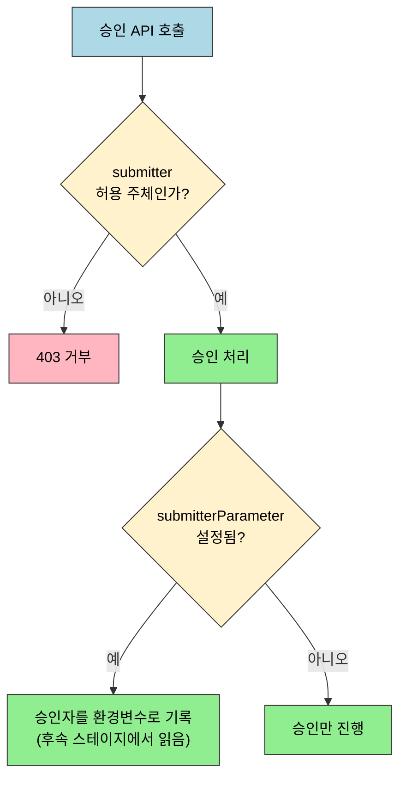
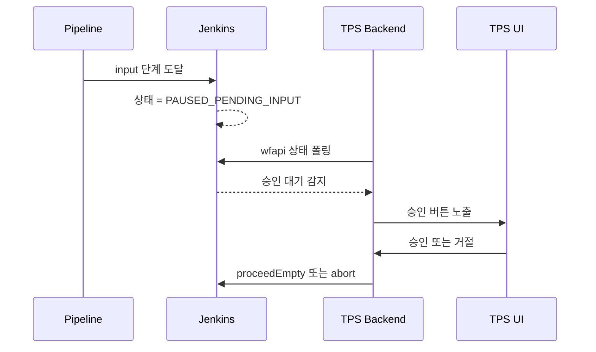

# 젠킨스 API 배포 승인과 운영 관리 현대화

> **본 문서는 spec(`09-01.md`)을 읽었다고 가정한 운영 해석과 TPS 패턴**입니다. 승인 API(`proceedEmpty`/`abort`)와 운영 조회 endpoint(`/api/json`, `/computer/api/json`)는 spec에 있습니다. 이 문서는 그 위에서 `input` 상태 해석, 승인자 제어, liveness/readiness 분리, 노드 상태 해석, Metrics Plugin 위치를 정리합니다.

---

> 이 문서를 다 읽으면 `PAUSED_PENDING_INPUT`을 실패·지연과 **구분해** 해석하고, `submitter`·`submitterParameter`의 역할 차이를 **비교**하며, Jenkins가 단일 `/health`를 주지 않는 환경에서 liveness와 readiness를 어떤 신호로 조합할지 **선택**할 수 있습니다.


## 사전 지식

> spec(`09-01`)의 승인 API(`proceed`/`proceedEmpty`/`abort`)와 운영 조회(`/api/json`, `/computer/api/json`, Metrics Plugin)를 먼저 알고 있어야 합니다. `wfapi/describe`의 `status`로 승인 대기를 감지한다는 점(`06-01`)도 전제입니다.


## 진입 — 왜 "API를 치는 법"만으로는 배포 승인을 운영할 수 없는가

> 승인 API 엔드포인트를 외운다고 배포 승인이 굴러가지는 않습니다. 진짜 어려움은 "지금 이 빌드가 승인을 기다리는 중인지" 외부 시스템이 정확히 판별하고, "누가 승인할 수 있고 누가 승인했는지"를 감사 가능하게 남기고, "Jenkins가 빌드를 받을 수 있는 상태인지"를 단일 신호 없이 조합하는 운영 해석에 있습니다.

`09-01`이 "어떤 API를 치는가"를 다룬다면, 이 문서는 그 API가 돌려주는 상태값을 운영에서 어떤 의미로 읽을지를 다룹니다. 같은 `proceedEmpty` 호출도, 그 앞에서 `PAUSED_PENDING_INPUT`을 별도 업무 상태로 취급하느냐 아니냐에 따라 UI 동작과 감사 품질이 완전히 달라집니다. 승인은 "API 호출 1회"가 아니라 "상태 감지 → 권한 게이트 → 승인 기록 → 헬스 판정"으로 이어지는 운영 흐름입니다.


## 1. `PAUSED_PENDING_INPUT` 상태 해석

> 이 개념은 이미 아는 `wfapi/describe`의 `status` 필드(`06-01`)를, "성공/실패" 축이 아니라 "승인 대기"라는 제3의 업무 축으로 해석하는 측면입니다.

Jenkins Pipeline의 `input` 스텝은 단순한 sleep이 아닙니다. 외부 승인 이벤트를 기다리는 명시적 정지 상태이며, 운영상 "대기 중"이 아니라 "승인 대기 중"으로 별도 해석해야 합니다.

이 상태는 보통 `wfapi/describe`에서 `PAUSED_PENDING_INPUT` 으로 읽습니다. 운영상 핵심은 다음과 같습니다:

- 빌드가 실패한 것이 아닙니다.
- executor를 계속 점유하는지 여부는 파이프라인 구조와 단계 위치에 따라 달라질 수 있습니다.
- 외부 시스템은 이 상태를 별도 업무 상태로 취급해야 합니다.

이 상태를 **공항 게이트에서 탑승 안내를 기다리는 비행기**에 비유할 수 있습니다. 비행기는 고장 난 것도(실패) 아니고 그냥 멈춰 있는 것도 아니며, 외부 신호(탑승 시작)를 기다리는 명시적 대기입니다. 이 비유는 "외부 이벤트로만 풀린다"는 점까지 유효하지만, 비행기는 시간이 지나면 결국 출발하는 반면 `input`은 타임아웃을 걸지 않으면 무한정 멈춰 있을 수 있다는 점에서 깨집니다. 그래서 운영에서는 승인 대기 시간 자체도 모니터링 대상이 됩니다.

즉 승인 API 자체보다 먼저 중요한 것은, 이 상태를 별도 업무 상태로 취급하는 운영 해석입니다.


## 2. 승인자 제어 강화

> 최근 Input Step Plugin에서는 승인 가능 주체와 승인자 기록을 Jenkinsfile 레벨에서 더 분명히 제어할 수 있습니다.

`submitter`와 `submitterParameter`는 역할이 다릅니다. 하나는 "누가 승인할 수 있는가"를 막고, 다른 하나는 "누가 승인했는가"를 남깁니다.



`submitter`는 승인 권한을 좁히는 게이트이고, `submitterParameter`는 통과한 뒤 승인자 신원을 파이프라인 안에 남기는 감사 장치입니다.

### 2-1. `submitter`

```groovy
input id: 'deploy-approval',
      message: '배포를 승인하시겠습니까?',
      // submitter는 승인 자체를 허용할 주체를 화이트리스트로 좁힙니다.
      // UI 권한과 별개로 Jenkins 레벨에서 한 겹 더 막기 위함입니다.
      submitter: 'admin,deploy-team'
```

의미는 다음과 같습니다:

- 지정된 사용자나 그룹만 승인 가능
- 허용되지 않은 사용자가 승인 API를 치면 `403` 가능
- TPS UI 권한 체크와 별개로 Jenkins 자체에서도 방어 가능

### 2-2. `submitterParameter`

```groovy
input id: 'deploy-approval',
      message: '배포를 승인하시겠습니까?',
      submitter: 'admin,deploy-team',
      // submitterParameter는 "통과한 뒤" 누가 승인했는지를 환경변수로 남깁니다.
      // 게이트(submitter)와 달리 권한이 아니라 감사 기록이 목적입니다.
      submitterParameter: 'APPROVER'
```

이 옵션을 쓰면 승인한 사용자를 후속 스테이지에서 환경 변수로 읽을 수 있습니다. 즉 "승인됐는가"만이 아니라 "누가 승인했는가"까지 Jenkins 파이프라인 안에 남길 수 있습니다.

이 기능은 API 경로를 바꾸지 않지만, 운영 감사와 승인 이력 설계에는 큰 차이를 만듭니다.


## 3. 승인 감지와 프로젝트 패턴

> TPS 같은 외부 시스템은 `input` 단계에 도달했는지 먼저 감지해야 UI에 승인 버튼을 노출할 수 있습니다. 핵심은 승인 API를 먼저 치는 것이 아니라, 상태 추적 계층이 `PAUSED_PENDING_INPUT` 을 읽는 것입니다.

승인/거절 POST 요청 자체는 API Token으로 인증하면 crumb 없이 단순화됩니다. backend가 `proceedEmpty`/`abort`를 호출할 때는 `--user USER:TOKEN` BASIC 인증만으로 충분하고 crumb 발급 단계를 건너뛸 수 있습니다. crumb·CSRF 보호의 발급 절차와 API token 면제의 원리는 [03-01. 인증 API 스펙](03-01.%EC%9D%B8%EC%A6%9D%20API%20%EC%8A%A4%ED%8E%99%20%28ID-Password%20%2B%20Crumb%29.md) § crumb 발급에서 다룹니다.

흐름을 단순화하면 다음과 같습니다:



프로젝트 구현에서 중요한 것은 아래 세 가지를 분리하는 것입니다:

- 승인 API 호출기
- 승인 대기 상태 감지기
- UI 노출 조건


## 4. liveness와 readiness를 분리해서 보기

> Jenkins 코어는 Spring Boot Actuator처럼 단일 `/health` 엔드포인트를 기본 제공하지 않습니다. 운영에서는 "살아 있는가"와 "빌드를 받을 준비가 됐는가"를 별도 질문으로 분리해야 합니다.

liveness와 readiness를 **병원 응급실**에 비유하면 이해가 쉽습니다. liveness는 "병원 건물에 불이 켜져 있고 문이 열려 있는가"(프로세스 생존)이고, readiness는 "지금 새 환자를 받을 빈 침대와 의료진이 있는가"(빌드 수용 능력)입니다. 둘은 별개의 질문이라서, 건물은 멀쩡한데 병상이 다 찬 상태가 가능합니다. 이 비유는 "생존과 수용 능력은 다른 축"이라는 점까지 유효하지만, 병원은 단일 접수창구로 두 정보를 다 알려주는 반면 Jenkins는 readiness를 단일 엔드포인트로 주지 않아 운영자가 여러 신호를 직접 조합해야 한다는 점에서 깨집니다.

### 4-1. Liveness

"프로세스가 살아 있는가?"에 가까운 질문입니다. 후보는 다음과 같습니다:

- `/login` — 인증 없이도 접근 가능한 경우가 많아 인프라 레벨 probe에 유리합니다.
- `/api/json` — Jenkins 본체가 실제로 JSON 응답을 줄 수 있는지 더 직접 확인합니다.
- `X-Jenkins` 응답 헤더 존재 여부 — 이 헤더 값이 곧 Jenkins 버전입니다(출처: jenkins.io/doc/book/using/remote-access-api).

### 4-2. Readiness

"지금 빌드를 받을 준비가 되었는가?"에 가까운 질문입니다. 이 판단에는 보통 다음 요소가 들어갑니다:

- `/api/json` 이 정상 응답하는가
- `totalExecutors > 0` 인가
- offline 노드 비율이 너무 높지 않은가
- 특정 핵심 에이전트가 살아 있는가

즉 readiness는 Jenkins가 단일 값으로 주는 것이 아니라, 운영 정책이 만드는 조합 값에 가깝습니다.

readiness probe는 매 초 폴링되므로 응답 크기도 함께 줄여야 합니다. `/computer/api/json?tree=busyExecutors,totalExecutors` 처럼 `tree=`로 필요한 필드만 뽑으면 부담이 작습니다. 응답 축소(`tree=`·`depth=`)로 수십 KB를 수백 바이트로 줄이는 상세는 [09-03. API 쿼리 최적화와 운영](09-03.API%20%EC%BF%BC%EB%A6%AC%20%EC%B5%9C%EC%A0%81%ED%99%94%EC%99%80%20%EC%9A%B4%EC%98%81.md)을 참조합니다.

```bash
# tree= 로 필드를 좁혀 응답을 수십 KB → 수백 B 로 축소합니다.
# readiness probe는 자주 호출되므로 전체 JSON을 받지 않습니다.
curl -s --user "$JENKINS_USER:$JENKINS_TOKEN" \
  "https://jenkins.example.com/computer/api/json?tree=busyExecutors,totalExecutors,computer[displayName,offline,idle]"
```


## 5. 노드 상태 조회를 어떻게 읽어야 하는가

> `/computer/api/json` 결과는 단순한 "현재 실행 중 빌드 수"가 아닙니다. `busyExecutors` 와 `totalExecutors` 는 자주 헷갈리는 필드이므로 해석 기준을 명확히 잡아야 합니다.

핵심 해석은 다음과 같습니다:

- `busyExecutors`: 지금 사용 중인 executor 수
- `totalExecutors`: Jenkins 전체에서 사용할 수 있는 executor 슬롯 수
- `idle`: 해당 노드가 현재 유휴 상태인지
- `offline`: 해당 노드가 스케줄 대상에서 빠졌는지

따라서 `busyExecutors=0`, `totalExecutors=10` 은 이상한 상태가 아니라, "지금은 아무 것도 돌지 않지만 10개 슬롯이 준비돼 있다"는 뜻입니다.

`/computer/api/json` 응답을 더 깊이 들여다봐야 할 때는 `depth=`로 각 `computer` 항목의 중첩 객체까지 펼쳐 노드별 상세를 한 번에 가져올 수 있습니다. 다만 depth를 키울수록 응답이 커지므로, 운영 폴링에서는 `tree=`로 필드를 좁히는 쪽을 우선합니다. `depth=`의 동작 상세는 [09-03. API 쿼리 최적화와 운영](09-03.API%20%EC%BF%BC%EB%A6%AC%20%EC%B5%9C%EC%A0%81%ED%99%94%EC%99%80%20%EC%9A%B4%EC%98%81.md)을 참조합니다.


## 6. Metrics Plugin의 위치

> Metrics Plugin은 Jenkins 코어가 기본 제공하지 않는 운영 친화적인 상태 확인 경로를 제공합니다. 운영 대시보드나 고급 헬스체크가 필요하면 유용하지만, 가장 기본 기준은 여전히 코어 API입니다.

비교하면 다음과 같습니다:

| 방식 | 장점 | 주의점 |
|------|------|------|
| `/api/json` | 기본 제공, 범용적 | readiness를 직접 판정해 주진 않음 |
| `/computer/api/json` | executor와 노드 상태까지 확인 가능 | 해석 로직을 직접 작성해야 함 |
| `/metrics/currentUser/ping` | 응답 50바이트 이하 | 플러그인 설치 필요 |
| `/metrics/currentUser/healthcheck` | 상세 항목별 상태 제공 | 플러그인 의존, 권한 영향 가능 |


## 7. TPS 운영 패턴

> TPS 관점에서 이 문서와 연결되는 운영 패턴은 승인 대기 감지와 노드 모니터링 두 갈래입니다. `09-01`이 "무슨 API를 치는가"라면, `09-02`는 "그 API를 운영에서 어떤 의미로 읽는가"에 가깝습니다.

첫째는 승인 대기 감지입니다:

- 상태 추적 계층이 `PAUSED_PENDING_INPUT` 감지
- UI가 승인 버튼 노출
- 승인/거절 API를 backend가 대신 호출

둘째는 노드 모니터링입니다:

- `/computer/api/json` 으로 전체 노드 상태 수집
- 가용 executor 수 확인
- 빌드 전 사용 가능 자원 판단


## 8. 버전별 변경 요약

| 버전/시점 | 변경 | 운영 영향 |
|------|------|------|
| Jenkins 2.222 (2020) | API Token crumb 면제 | 승인/거절 POST 호출 단순화 |
| Input Step Plugin 477.v+ (2023) | `submitter`, `submitterParameter` 강화 | 승인 권한과 승인자 추적 강화 |
| Jenkins 2.462 (2024) | Java 17 최소 요구 | 승인/운영 API 자체보다 런타임 환경 영향 |
| Jenkins 2.504 (2025) | SameSite=Lax 쿠키 | 브라우저 세션 영향은 있으나 API Token 흐름 영향은 제한적 |

API Token이 crumb보다 권장되는 이유는 두 가지입니다. 첫째, API token 인증 요청은 CSRF 면제라 승인/거절 POST 흐름이 단순해집니다(면제 원리는 [03-01. 인증 API 스펙](03-01.%EC%9D%B8%EC%A6%9D%20API%20%EC%8A%A4%ED%8E%99%20%28ID-Password%20%2B%20Crumb%29.md) 참조). 둘째, 토큰이 노출되면 그 토큰만 폐기하면 되고 비밀번호는 그대로 유지되므로 운영 위험이 낮습니다(출처: jenkins.io/doc/book/security/managing-security).


## 면접 질문

> 답을 떠올린 뒤 §정답 절에서 같은 번호로 대조하세요.

1. `PAUSED_PENDING_INPUT`을 단순 "대기 중"이 아니라 별도 업무 상태로 취급해야 하는 이유는 무엇인가요?
2. `submitter`와 `submitterParameter`는 각각 무엇을 제어하나요? TPS UI가 이미 권한을 검사하는데도 Jenkins `submitter`를 함께 두면 무엇이 좋아지나요?
3. Jenkins는 단일 `/health` 엔드포인트를 주지 않습니다. liveness와 readiness를 어떻게 분리해서 판단하나요? `busyExecutors=0, totalExecutors=10`은 비정상인가요?

### 빈칸 채우기 — 승인과 헬스 판정

다음 빈칸을 채워 보세요. 정답은 맨 끝 "빈칸 정답" 절에 있습니다.

1. backend가 `proceedEmpty`/`abort`를 호출할 때 ( ) 인증을 쓰면 CSRF crumb 발급 단계를 건너뛸 수 있습니다. crumb는 ( ) 방지 토큰이고, ( ) 인증 요청은 거기서 면제되기 때문입니다.
2. readiness probe의 응답을 줄이려면 ( ) 파라미터로 필요한 필드만 선택해 응답을 수십 KB에서 수백 ( ) 수준으로 축소합니다. 서브트리 중첩을 더 깊게 펼치려면 ( ) 파라미터를 키웁니다.
3. `submitter`는 ( )을(를) 제한하는 게이트이고, `submitterParameter`는 ( )을(를) 환경변수로 남기는 감사 장치입니다.
4. Jenkins 버전은 ( ) 응답 헤더로 확인할 수 있습니다.


## 정답

> 위 질문을 스스로 설명해 본 뒤에 펼치세요.

### 정답 1 — PAUSED_PENDING_INPUT을 업무 상태로 보는 이유

이 상태는 빌드가 실패한 것도, 단순히 멈춘 것도 아니라 외부 승인 이벤트를 기다리는 명시적 정지입니다. "대기 중"으로 뭉뚱그리면 실패·지연과 구분이 안 되므로, 외부 시스템은 이를 "승인 대기 중"이라는 별도 업무 상태로 취급해야 UI에 승인 버튼을 노출하고 후속 흐름을 설계할 수 있습니다.

### 정답 2 — submitter와 submitterParameter

`submitter`는 승인 가능한 사용자·그룹을 제한하는 게이트로, 허용되지 않은 주체가 승인 API를 치면 `403`이 날 수 있습니다. `submitterParameter`는 승인한 사용자를 환경 변수로 남겨 후속 스테이지에서 "누가 승인했는가"를 읽게 합니다. TPS UI 권한 검사와 별개로 Jenkins 자체에서도 한 겹 더 방어하면, UI를 우회한 직접 API 호출까지 막혀 다층 방어가 됩니다.

### 정답 3 — liveness/readiness 분리와 executor 해석

Jenkins 코어는 Actuator 같은 단일 `/health`를 주지 않으므로 두 질문을 분리합니다. liveness는 "프로세스가 살아 있는가"로 `/login`·`/api/json`·`X-Jenkins` 헤더로 보고, readiness는 "빌드를 받을 준비가 됐는가"로 `/api/json` 정상 + `totalExecutors > 0` + offline 비율 + 핵심 에이전트 생존을 조합한 운영 정책 값입니다. `busyExecutors=0, totalExecutors=10`은 "지금 노는 중이지만 10개 슬롯이 준비됨"이라는 정상 상태입니다.

### 빈칸 정답 — 승인과 헬스 판정

1. ( API Token ) 인증 / crumb는 ( CSRF ) 방지 토큰 / ( API token ) 인증 요청은 면제.
2. ( tree= ) 파라미터 / 수백 ( 바이트(B) ) / ( depth= ) 파라미터.
3. `submitter`는 ( 승인 가능한 주체 )를 제한 / `submitterParameter`는 ( 승인자 신원 )을 환경변수로 남김.
4. ( X-Jenkins ) 응답 헤더.


## 관련 문서

> 이 문서가 다루는 승인·헬스 운영 해석은 spec 문서와 인증·상태 추적 문서를 함께 봐야 전체 그림이 완성됩니다. 같은 09 장의 스펙·최적화 편과, 승인 감지의 토대가 되는 상태 추적·인증 편을 연결합니다.

- [09-01. API 배포 승인과 운영 관리](09-01.API%20%EB%B0%B0%ED%8F%AC%20%EC%8A%B9%EC%9D%B8%EA%B3%BC%20%EC%9A%B4%EC%98%81%20%EA%B4%80%EB%A6%AC.md) § "승인 API" — 이 문서가 해석하는 `proceedEmpty`/`abort`·운영 조회의 원본 스펙
- [09-03. API 쿼리 최적화와 운영](09-03.API%20%EC%BF%BC%EB%A6%AC%20%EC%B5%9C%EC%A0%81%ED%99%94%EC%99%80%20%EC%9A%B4%EC%98%81.md) § "tree·depth 최적화" — readiness probe 응답 축소에 쓰는 `tree=`·`depth=`의 심화
- [06-01. 빌드 상태 추적 API 스펙](06-01.%EB%B9%8C%EB%93%9C%20%EC%83%81%ED%83%9C%20%EC%B6%94%EC%A0%81%20API%20%EC%8A%A4%ED%8E%99.md) § "wfapi status" — `PAUSED_PENDING_INPUT`을 읽어 오는 상태 추적 계층의 토대
- [03-02. 인증 모델과 TPS 패턴 (2.222+)](03-02.%EC%9D%B8%EC%A6%9D%20%EB%AA%A8%EB%8D%B8%EA%B3%BC%20TPS%20%ED%8C%A8%ED%84%B4%20%282.222%2B%29.md) § "API Token / crumb 면제" — 승인 POST를 단순화하는 인증 흐름의 근거
- [06-02. 빌드 상태 추적 모델과 TPS 패턴 (2.222+)](06-02.%EB%B9%8C%EB%93%9C%20%EC%83%81%ED%83%9C%20%EC%B6%94%EC%A0%81%20%EB%AA%A8%EB%8D%B8%EA%B3%BC%20TPS%20%ED%8C%A8%ED%84%B4%20%282.222%2B%29.md) § "상태 폴링" — 승인 대기 감지와 같은 폴링 계층에서 다루는 모델 패턴
