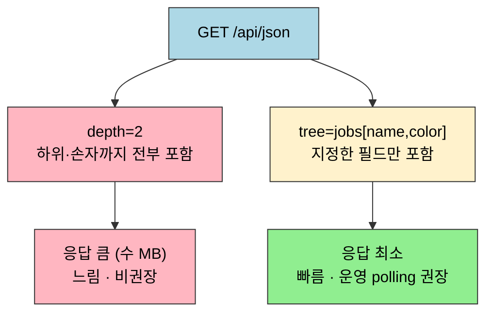

# 젠킨스 API 쿼리 최적화와 운영

---

> Jenkins API 응답을 효율적으로 다루고, 아티팩트와 시스템 상태를 관리하는 방법을 다룹니다.
> 실습 환경 설정은 01-01 참조


## 학습 목표

> 이 문서를 읽고 나면 `depth`와 `tree`의 차이를 설명하고, polling 스크립트에 어느 쪽을 쓸지 선택하며, `lastSuccessfulBuild` 같은 심볼릭 참조로 아티팩트 다운로드 URL을 구성하고, `quietDown → 빌드 완료 대기 → safeRestart → cancelQuietDown` 운영 순서를 재현하고 `safeRestart` 단독 호출이 깨지는 이유를 예측할 수 있습니다.


## 사전 지식

> `01-01`의 실습 환경, `04-01`~`06-01`의 잡·빌드 조회 API, crumb 준비(`03-01`)를 알고 있으면 좋습니다. Jenkins API가 기본적으로 하위 객체를 모두 포함해 응답이 커진다는 점을 전제로 최적화를 다룹니다.


## 진입 — 왜 응답 크기를 제어해야 하는가

> 같은 조회 API라도 그대로 부르면 수십 KB에서 수 MB가 돌아오고, 운영 polling은 이 요청을 초 단위로 반복합니다. 응답 크기가 곧 누적 네트워크 비용이 되는 지점이 바로 여기입니다.

조회 API를 한 번 부르는 비용은 작아 보입니다. 그러나 운영 환경의 polling 스크립트는 빌드가 끝났는지 확인하려고 같은 요청을 5초·10초 간격으로 끝없이 반복합니다. 응답 한 건이 1 MB라면 10초마다 도는 polling은 시간당 360 MB를 흘려보냅니다. Jenkins가 제공하는 `tree`·`depth`·`exclude` 같은 쿼리 파라미터는 이 응답을 클라이언트가 *필요한 부분만* 골라 받게 해, 같은 정보를 수백 바이트로 줄이는 수단입니다. 이 편은 그 쿼리 최적화와, 운영 중 재시작·아티팩트 회수까지 운영자가 매일 부딪히는 API를 묶어 다룹니다.


## 1. depth와 tree 파라미터

> Jenkins API는 기본적으로 요청한 리소스에 연결된 모든 하위 객체를 포함하여 응답합니다.
>
> - `depth`는 하위 객체를 몇 단계까지 포함할지 결정합니다. `depth=0`이면 최상위 객체만, `depth=2`면 손자 객체까지 포함합니다.
> - `tree`는 응답에 포함할 필드를 직접 지정합니다. `tree=jobs[name,color]` 형태로 쓰면 name과 color 두 필드만 가져옵니다.

> 이 개념은 이미 아는 SQL `SELECT *` 대 `SELECT col1, col2`의 응답 폭 제어 측면입니다. `depth`는 JOIN을 몇 단계까지 펼칠지, `tree`는 어떤 컬럼만 투영할지에 대응합니다.

`tree`는 식당 주문서에 필요한 항목만 적어 내는 것에 비유할 수 있습니다. "오늘의 메뉴 전체를 다 주세요"(`depth=2`) 대신 "된장찌개와 공깃밥만"(`tree=jobs[name,color]`)이라고 적으면 주방은 그것만 준비하고, 받는 쪽도 필요한 그릇만 받습니다. 이 비유는 *내가 무엇을 받을지 미리 안다*는 점까지 유효합니다. 다만 주문서 비유는 필드명을 정확히 알아야 적을 수 있다는 점에서 깨집니다. 응답에 어떤 필드가 있는지 모르면 먼저 `depth=1`로 한 번 받아 필드명을 확인한 뒤 `tree`로 좁혀야 합니다. 메뉴를 모르면 주문서를 채울 수 없는 것과 같습니다.

단순한 잡 목록 조회 하나가 수십 KB에서 수 MB에 달하는 JSON을 반환할 수 있습니다. `depth`와 `tree` 파라미터는 이 응답 크기를 제어하는 두 가지 핵심 도구입니다. Jenkins 공식 문서는 어떤 객체 URL에도 `/api/`를 붙여 접근할 수 있고(`/api/json`, `/api/xml`, `/api/python`), `depth=` 파라미터는 서브트리 깊이를 제어해 값이 클수록 더 깊은 중첩을 반환하며, `tree=`는 반환 필드를 골라 응답을 축소한다고 명시합니다 (출처: jenkins.io/doc/book/using/remote-access-api).

| 파라미터 | 용도 | 응답 크기 | 성능 | 권장 사용 |
| --- | --- | --- | --- | --- |
| `depth=0` | 최상위만 | 작음 | 빠름 | 존재 확인 |
| `depth=1` | 1단계 하위 | 중간 | 보통 | 목록 조회 |
| `depth=2+` | 전체 트리 | 큼 (수 MB) | 느림 | 비권장 |
| `tree=...` | 필요 필드만 | 최소 | 빠름 | 운영 polling |

`tree` 문법은 중첩 구조, 범위 지정, 다중 필드 선택을 조합할 수 있습니다:

- `jobs[name,color]` — 중첩 필드 선택
- `builds[number,result]{0,5}` — 처음 5개 항목만
- `name,color,builds[number]` — 여러 필드를 함께 선택

`depth`는 트리를 아래로 더 깊이 펼쳐 응답을 키우고, `tree`는 필요한 가지만 골라 응답을 줄입니다.



같은 엔드포인트라도 `depth`는 크기를 키우는 축, `tree`는 크기를 줄이는 축입니다. polling에서는 `tree`로 최소 필드만 받는 것이 원칙입니다.

depth와 tree를 비교하는 예시입니다:

```bash
# depth=2 — 전체 트리. 잡마다 모든 빌드·파라미터·changeSet까지 펼쳐
# 잡 수십 개 규모에서 응답이 수 MB로 불어나므로 운영 polling에는 비권장
curl -sSf ${JENKINS_OPTS} -u "${JENKINS_USER}:${JENKINS_PASS}" \
  "${JENKINS_URL}/api/json?depth=2"

# tree — 필요한 필드만 정확히 지정. 잡 이름·색·마지막 빌드 번호·결과만 받아
# 같은 정보를 수백 바이트로 축소하므로 운영 polling에 권장
curl -sSf ${JENKINS_OPTS} -u "${JENKINS_USER}:${JENKINS_PASS}" \
  "${JENKINS_URL}/api/json?tree=jobs[name,color,lastBuild[number,result]]"
```

수치로 보면 차이가 분명합니다. 잡 50개 규모의 인스턴스에서 `/api/json?depth=2`는 각 잡의 빌드 이력·changeSet·파라미터를 모두 끌고 와 응답이 쉽게 수 MB에 이릅니다. 반면 `tree=jobs[name,color,lastBuild[number,result]]`는 잡당 네 개 필드만 담아 같은 인스턴스에서 응답이 수백 바이트에서 수 KB로 떨어집니다. 10초 간격 polling이라면 전자는 시간당 수백 MB를, 후자는 시간당 수 MB만 흘려보내는 차이로 누적됩니다.

XML 형식을 쓸 때는 노드 단위로도 응답을 다듬을 수 있습니다. `/api/xml?xpath=...`로 특정 노드만 선택하고, `exclude=` 파라미터로 특정 노드를 제거할 수 있으며 `exclude`는 반복 지정이 가능합니다 (출처: jenkins.io/doc/book/using/remote-access-api). 응답 헤더의 `X-Jenkins`는 인스턴스 버전을 알려 주므로, 버전별 분기가 필요한 스크립트는 이 헤더를 먼저 확인합니다.

polling 스크립트에서 빌드 결과만 확인할 때는 `tree`로 최소 필드만 요청하는 것이 원칙입니다. 전체 빌드 객체를 받아서 클라이언트에서 필터링하는 방식은 불필요한 데이터를 네트워크로 전송하기 때문에 피해야 합니다.


## 2. Artifact 조회와 다운로드

> 배포 자동화 스크립트에서 "가장 최근에 성공한 빌드의 JAR을 가져와서 배포한다"는 시나리오가 아티팩트 API의 대표적인 활용 사례입니다.
>
> - `lastSuccessfulBuild`는 결과가 SUCCESS인 가장 최근 빌드를 가리킵니다.
> - `lastCompletedBuild`는 성공/실패 여부와 관계없이 완료된 가장 최근 빌드를 가리킵니다. 배포 스크립트에서는 반드시 `lastSuccessfulBuild`를 사용해야 합니다.

아티팩트 목록을 조회하는 방법은 다음과 같습니다:

```bash
# 최근 성공 빌드의 아티팩트 목록 조회
curl -sSf ${JENKINS_OPTS} -u "${JENKINS_USER}:${JENKINS_PASS}" \
  "${JENKINS_URL}/job/my-pipeline/lastSuccessfulBuild/api/json?tree=artifacts[fileName,relativePath]" \
  | jq '.artifacts[]'

# 특정 빌드 번호의 아티팩트 목록
curl -sSf ${JENKINS_OPTS} -u "${JENKINS_USER}:${JENKINS_PASS}" \
  "${JENKINS_URL}/job/my-pipeline/42/api/json?tree=artifacts[fileName,relativePath]" \
  | jq '.artifacts[] | .relativePath'
```

아티팩트를 실제로 다운로드할 때는 `artifact/{relativePath}` 경로를 사용합니다:

```bash
# lastSuccessfulBuild 심볼릭 참조로 다운로드. 빌드 번호를 박지 않아
# 다음 성공 빌드가 생겨도 스크립트 수정 없이 항상 최신 산출물을 받음
curl -sSf ${JENKINS_OPTS} -u "${JENKINS_USER}:${JENKINS_PASS}" \
  -O "${JENKINS_URL}/job/my-pipeline/lastSuccessfulBuild/artifact/target/app.jar"

# 다운로드한 파일명에 빌드 번호를 남겨야 할 때는 번호를 먼저 조회.
# tree=number로 number 한 필드만 받아 응답을 최소화
BUILD_NUMBER=$(curl -sSf ${JENKINS_OPTS} -u "${JENKINS_USER}:${JENKINS_PASS}" \
  "${JENKINS_URL}/job/my-pipeline/lastSuccessfulBuild/api/json?tree=number" \
  | jq -r '.number')

# 조회한 번호로 파일명을 구성해 어느 빌드 산출물인지 추적 가능하게 저장
curl -sSf ${JENKINS_OPTS} -u "${JENKINS_USER}:${JENKINS_PASS}" \
  -o "app-${BUILD_NUMBER}.jar" \
  "${JENKINS_URL}/job/my-pipeline/${BUILD_NUMBER}/artifact/target/app.jar"
```

아티팩트 보존 정책은 빌드 설정에서 "오래된 빌드 삭제" 옵션으로 제어합니다. 보존 기간이 지난 빌드의 아티팩트는 API로 접근해도 `404` 오류가 반환됩니다. 배포 스크립트에서 특정 빌드 번호를 하드코딩하면 아티팩트가 만료되었을 때 배포가 실패하므로, 항상 `lastSuccessfulBuild` 같은 심볼릭 참조를 사용하는 것이 안전합니다.


## 3. System Restart와 운영 API

> Jenkins 운영 중에는 플러그인 업데이트, 설정 변경, 메모리 정리 등의 이유로 재시작이 필요합니다. 실행 중인 빌드를 보호하면서 안전하게 재시작하려면 올바른 순서가 중요합니다.
>
> - `quietDown` → 빌드 완료 대기 → `safeRestart` 순서로 진행해야 합니다.
> - `safeRestart`만 단독으로 호출하면 그 사이에 새 빌드가 계속 유입될 수 있습니다.

운영 API의 핵심 3가지는 다음과 같습니다:

- `safeRestart`: 현재 실행 중인 빌드가 모두 완료될 때까지 기다린 뒤 재시작합니다. 진행 중인 빌드를 강제 중단하지 않습니다.
- `quietDown`: 새 빌드 수락을 중지하고 유지보수 모드로 진입합니다. 이미 실행 중인 빌드는 계속 진행됩니다.
- `cancelQuietDown`: 유지보수 모드를 해제하고 정상 운영으로 복귀합니다. 취소하지 않으면 Jenkins가 영구적으로 새 빌드를 받지 않습니다.

`quietDown`은 식당 영업 종료 30분 전 "주문 마감" 안내에 비유할 수 있습니다. 새 손님은 더 받지 않지만(`quietDown`), 이미 식사 중인 손님은 끝까지 먹게 두고(실행 중 빌드 완료 대기), 모두 나간 뒤에 청소·정비를 합니다(`safeRestart`). 이 비유는 *신규 유입을 막고 기존 작업을 보호한다*는 핵심까지 유효합니다. 다만 식당은 청소가 끝나면 다음 날 자동으로 문을 열지만 Jenkins는 그렇지 않다는 점에서 깨집니다. `cancelQuietDown`을 명시적으로 호출하지 않으면 재시작 후에도 유지보수 모드가 풀리지 않아 새 빌드를 영구히 거부합니다. "주문 마감 안내판을 내리는" 동작을 사람이 직접 해야 하는 셈입니다.

이 운영 API들은 모두 POST 메서드이고 상태를 바꾸므로 CSRF 보호 대상입니다. 그래서 아래 예시는 `-H "${CRUMB_HEADER}:${CRUMB}"`로 crumb를 동반합니다. crumb는 username·웹 세션 ID·인스턴스 고유 salt를 인코딩한 CSRF 방지 토큰으로 `/crumbIssuer/api`로 발급받으며, 클라이언트는 crumb와 세션 쿠키를 이후 POST에 함께 보냅니다 (출처: jenkins.io/doc/book/security/csrf-protection). 다만 API token 인증 요청은 CSRF(crumb) 면제 대상이라, 토큰 인증을 쓰면 crumb 헤더 없이도 POST가 통과합니다. 공식 문서가 crumb보다 API token을 권장하는 이유도 여기에 있습니다 — "API tokens are preferred instead of crumbs for CSRF protection."(출처: jenkins.io/doc/book/using/remote-access-api).

플러그인 업데이트처럼 "더 이상 새 빌드가 들어오지 않는 깨끗한 상태에서 재시작"이 필요하다면, 아래 흐름을 따릅니다.


`safeRestart` 단독 호출:

```bash
# 실행 중인 빌드 완료 후 재시작
curl -sSf ${JENKINS_OPTS} -X POST \
  -u "${JENKINS_USER}:${JENKINS_PASS}" \
  -H "${CRUMB_HEADER}:${CRUMB}" \
  "${JENKINS_URL}/safeRestart"
```

유지보수 모드 진입 및 해제:

```bash
# 유지보수 모드 진입 (새 빌드 수락 중지)
curl -sSf ${JENKINS_OPTS} -X POST \
  -u "${JENKINS_USER}:${JENKINS_PASS}" \
  -H "${CRUMB_HEADER}:${CRUMB}" \
  "${JENKINS_URL}/quietDown"

# 유지보수 모드 해제
curl -sSf ${JENKINS_OPTS} -X POST \
  -u "${JENKINS_USER}:${JENKINS_PASS}" \
  -H "${CRUMB_HEADER}:${CRUMB}" \
  "${JENKINS_URL}/cancelQuietDown"
```

플러그인 업데이트 시 권장하는 전체 운영 시나리오:

```bash
# 1. 유지보수 모드 진입
curl -sSf ${JENKINS_OPTS} -X POST \
  -u "${JENKINS_USER}:${JENKINS_PASS}" \
  -H "${CRUMB_HEADER}:${CRUMB}" \
  "${JENKINS_URL}/quietDown"

echo "유지보수 모드 진입 완료. 실행 중인 빌드 완료를 기다린다."

# 2. 실행 중인 빌드가 0개가 될 때까지 대기
while true; do
  RUNNING=$(curl -sSf ${JENKINS_OPTS} -u "${JENKINS_USER}:${JENKINS_PASS}" \
    "${JENKINS_URL}/computer/api/json?tree=computer[executors[idle]]" \
    | jq '[.computer[].executors[] | select(.idle == false)] | length')

  if [ "$RUNNING" -eq 0 ]; then
    echo "모든 빌드 완료. 재시작한다."
    break
  fi

  echo "실행 중인 빌드: ${RUNNING}개. 10초 후 재확인."
  sleep 10
done

# 3. safeRestart (실질적으로 즉시 재시작)
curl -sSf ${JENKINS_OPTS} -X POST \
  -u "${JENKINS_USER}:${JENKINS_PASS}" \
  -H "${CRUMB_HEADER}:${CRUMB}" \
  "${JENKINS_URL}/safeRestart"

echo "재시작 요청 완료. Jenkins가 재기동될 때까지 대기한다."
```

이 시나리오가 중요한 이유는 Jenkins를 운영 환경에서 갑자기 재시작하면 실행 중이던 배포 파이프라인이 중단되어 애플리케이션이 불완전한 상태로 남을 수 있기 때문입니다. `quietDown`으로 새 빌드 유입을 막고, 기존 빌드가 모두 끝난 뒤 재시작하면 이런 위험을 피할 수 있습니다.


## 면접 질문

> 답을 떠올린 뒤 §정답 절에서 같은 번호로 대조하세요.

1. `depth`와 `tree`는 둘 다 응답을 제어하는데 방향이 반대입니다. polling 스크립트에서 어느 쪽을 기본으로 써야 하고, 그 이유는 무엇인가요?
2. 배포 스크립트에서 특정 빌드 번호를 하드코딩하지 말고 `lastSuccessfulBuild`를 써야 하는 이유는 무엇인가요? `lastCompletedBuild`와는 어떻게 다른가요?
3. Jenkins를 운영 중 재시작할 때 `safeRestart` 단독 호출로는 왜 부족한가요? 올바른 순서는 무엇인가요?

### 빈칸 채우기 — 쿼리 최적화와 운영 API

빈칸을 채운 뒤 문서 끝 "빈칸 정답" 절과 대조하세요.

1. 어떤 객체 URL에도 `______`를 붙이면 API로 접근할 수 있고, 포맷은 `/api/json`·`/api/xml`·`/api/python`을 지원합니다.
2. 서브트리 깊이를 키워 응답을 늘리는 파라미터는 `______=`이고, 반환 필드를 골라 응답을 줄이는 파라미터는 `______=`입니다.
3. XML 응답에서 특정 노드를 제거하며 반복 지정이 가능한 파라미터는 `______=`입니다.
4. 결과가 SUCCESS인 가장 최근 빌드를 가리키는 심볼릭 참조는 `______`이고, 성공·실패를 가리지 않고 완료된 최근 빌드는 `______`입니다.
5. 운영 중 깨끗한 재시작 순서는 `quietDown` → 빌드 완료 대기 → `______` → `______`입니다.
6. API token 인증 요청은 `______`(crumb) 면제 대상이라 crumb 헤더 없이도 POST가 통과합니다.


## 정답

> 위 질문을 스스로 설명해 본 뒤에 펼치세요.

### 정답 1 — polling에는 tree

`depth`는 하위·손자 객체까지 펼쳐 응답을 키우는 축이고, `tree`는 필요한 필드만 골라 응답을 줄이는 축입니다. polling은 같은 요청을 반복하므로 응답 크기가 곧 누적 비용입니다. 그래서 `tree`로 최소 필드만 요청하는 것이 원칙이고, 전체를 받아 클라이언트에서 거르는 방식은 불필요한 데이터를 네트워크로 실어 나르므로 피합니다.

### 정답 2 — lastSuccessfulBuild를 쓰는 이유

특정 빌드 번호를 하드코딩하면, 그 빌드의 아티팩트가 보존 정책으로 만료됐을 때 `404`가 나 배포가 실패합니다. `lastSuccessfulBuild`는 결과가 SUCCESS인 가장 최근 빌드를 가리키는 심볼릭 참조라, 번호가 바뀌어도 항상 유효한 산출물을 가리킵니다. `lastCompletedBuild`는 성공·실패를 가리지 않고 완료된 최근 빌드라, 배포에는 실패본을 집을 위험이 있어 `lastSuccessfulBuild`를 써야 합니다.

### 정답 3 — safeRestart 단독의 한계와 올바른 순서

`safeRestart`는 실행 중인 빌드가 끝날 때까지 기다린 뒤 재시작하지만, 기다리는 그 사이에도 새 빌드가 계속 유입될 수 있어 "깨끗한 상태"가 보장되지 않습니다. 올바른 순서는 `quietDown`으로 새 빌드 수락을 먼저 막고, 실행 중인 빌드가 0이 될 때까지 대기한 뒤 `safeRestart`로 재시작하고, 기동 후 `cancelQuietDown`으로 정상 운영에 복귀하는 것입니다.

### 빈칸 정답 — 쿼리 최적화와 운영 API

1. `/api/` — 어떤 객체 URL에도 붙여 접근하며 `/api/json`·`/api/xml`·`/api/python`을 지원합니다.
2. `depth=` (응답을 늘림) / `tree=` (응답을 줄임).
3. `exclude=` — XML 응답에서 노드를 제거하며 반복 지정이 가능합니다.
4. `lastSuccessfulBuild` (SUCCESS인 최근 빌드) / `lastCompletedBuild` (성공·실패 무관 완료된 최근 빌드).
5. `safeRestart` → `cancelQuietDown`.
6. `CSRF` — API token 인증 요청은 CSRF(crumb) 면제 대상입니다.


## 관련 문서

> 같은 장(09)의 운영·승인 짝과, 이 편이 다루는 조회·인증·로그 API의 원편을 함께 보면 쿼리 최적화가 어디에 쓰이는지 맥락이 잡힙니다.

- [09-01. API 배포 승인과 운영 관리](09-01.API%20%EB%B0%B0%ED%8F%AC%20%EC%8A%B9%EC%9D%B8%EA%B3%BC%20%EC%9A%B4%EC%98%81%20%EA%B4%80%EB%A6%AC.md) § "운영 관리" — 같은 09장의 승인·운영 흐름. 이 편의 재시작 API와 짝
- [09-02. API 배포 승인과 운영 관리 현대화](09-02.API%20%EB%B0%B0%ED%8F%AC%20%EC%8A%B9%EC%9D%B8%EA%B3%BC%20%EC%9A%B4%EC%98%81%20%EA%B4%80%EB%A6%AC%20%ED%98%84%EB%8C%80%ED%99%94.md) § "현대화" — 승인·운영 API의 2.222+ 대안
- [06-01. 빌드 상태 추적 API 스펙](06-01.%EB%B9%8C%EB%93%9C%20%EC%83%81%ED%83%9C%20%EC%B6%94%EC%A0%81%20API%20%EC%8A%A4%ED%8E%99.md) § "polling" — `tree`로 최소 필드만 받는 polling의 1차 사용처
- [03-01. 인증 API 스펙 (ID-Password + Crumb)](03-01.%EC%9D%B8%EC%A6%9D%20API%20%EC%8A%A4%ED%8E%99%20%28ID-Password%20%2B%20Crumb%29.md) § "Crumb" — 운영 API POST에 동반하는 crumb 발급
- [07-02. wfapi 상세 스펙과 활용](07-02.wfapi%20%EC%83%81%EC%84%B8%20%EC%8A%A4%ED%8E%99%EA%B3%BC%20%ED%99%9C%EC%9A%A9.md) § "wfapi" — 응답 축소가 필요한 또 다른 무거운 조회 API
