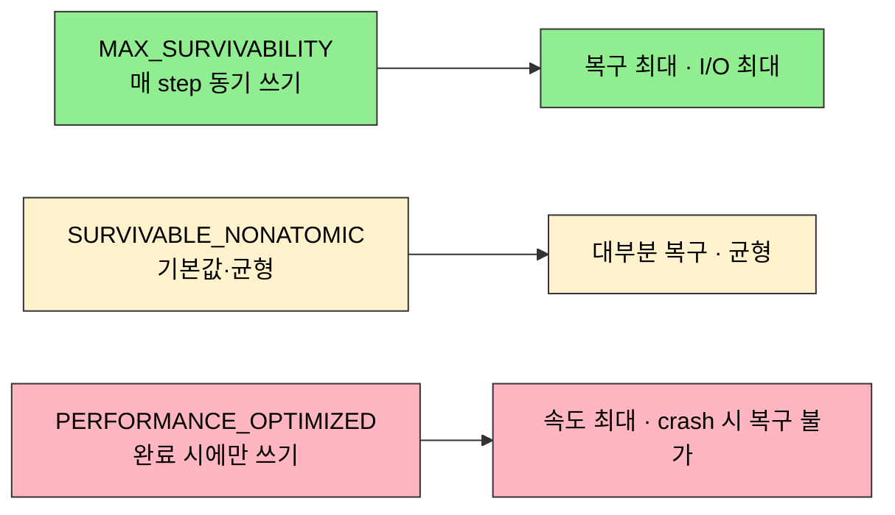
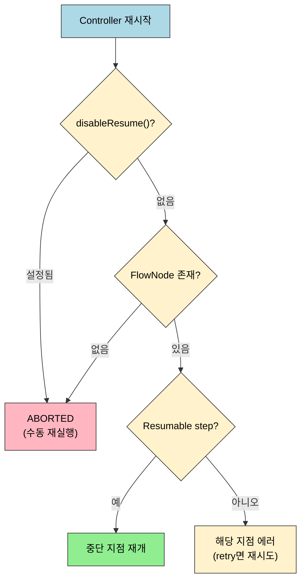

# 점검 — Pipeline 내구성과 가용성 핵심 질문

---

> 이 점검 문서는 01장(내구성·가용성)을 다 읽은 뒤 스스로를 시험하기 위한 자가 점검입니다. 먼저 §면접 질문만 보고 답을 떠올린 뒤, §정답 절에서 같은 번호로 대조하세요.
> 다루는 문서: 01-01.Pipeline 내구성과 재기동, 01-02.가용성 테스트 시나리오

> 이 점검을 마치면 CPS와 resume의 관계를 설명하고, Resumable/Nonresumable step을 구분하며, `disableResume()`과 durability 세 레벨의 트레이드오프를 비교하고, Controller 장애 시 빌드 운명을 예측하며, Restart from Stage와 자동 resume의 차이를 선택 기준으로 정리하고, stash/unstash의 쓰임과 한계를 디버깅 관점에서 짚어낼 수 있는지 스스로 검증합니다.

## 진입 — 왜 내구성 점검이 필요한가

> 내구성은 "장애가 났을 때 어디까지 살아남는가"를 결정하므로, 개념을 따로따로 외우면 실제 장애 상황에서 판단이 어긋납니다.

내구성 관련 개념(CPS·durability·resume·disableResume)은 하나하나 보면 그럴듯하지만, Controller가 실제로 죽었을 때 어느 빌드가 살고 어느 빌드가 죽는지는 이 개념들이 *맞물려* 결정합니다. 점검 문서는 흩어진 개념을 한 장애 시나리오 위에 다시 세워, 빈틈을 드러내는 것이 목적입니다.

## 사전 지식

> `01-01`(CPS·durability·resume 메커니즘)과 `01-02`(장애 주입 실습)를 먼저 읽었다고 가정합니다. 막히는 질문이 있으면 해당 문서의 같은 주제 절로 돌아가 확인합니다.

durability 세 레벨의 트레이드오프와 Controller 재시작 후 resume 판정은 이 점검의 두 축입니다. 먼저 그림으로 큰 그림을 잡습니다.





## 면접 질문

> 답을 떠올린 뒤 §정답 절에서 같은 번호로 대조하세요. 각 질문 뒤의 *심화*까지 답할 수 있으면 충분합니다.

1. CPS(Continuation-Passing Style)란 무엇이며, Pipeline resume에서 어떤 역할을 합니까? *(심화: `@NonCPS`를 붙인 메서드에서 `sh` step을 호출하면 어떻게 됩니까?)*
2. Resumable step과 Nonresumable step의 차이는 무엇입니까? *(심화: `sh` step이 Resumable임에도 Agent가 오프라인이 된 경우에는 어떻게 됩니까?)*
3. `disableResume()`은 언제 사용하며, 사용하지 않으면 어떤 위험이 있습니까? *(심화: `disableResume()`과 `disableRestartFromStage()`의 차이는?)*
4. Durability 세 레벨의 트레이드오프를 설명해 보세요. *(심화: 파이프라인별로 Durability를 다르게 설정하려면 어떻게 합니까?)*
5. Controller 장애 시 실행 중인 빌드는 어떻게 됩니까? *(심화: `log` 파일이 존재하는데 빌드가 ABORTED로 남은 경우, 정상 완료로 표시하려면?)*
6. "Restart from Stage"와 자동 resume의 차이는 무엇입니까? *(심화: Scripted Pipeline에서 "Restart from Stage"와 동등한 기능을 구현하려면?)*
7. stash/unstash 패턴은 언제 사용하며 한계는 무엇입니까? *(심화: `stash` 데이터는 빌드가 삭제되면 함께 사라집니까?)*

## 정답

> 위 질문을 스스로 설명해 본 뒤에 펼치세요.

### 정답 1 — CPS와 resume

CPS는 함수가 반환값을 직접 돌려주는 대신 "다음에 실행할 함수(continuation)"를 인자로 받아 호출하는 방식입니다.

- **일반 Groovy**: JVM 스택에 실행 상태가 존재 → 재시작 시 스택이 사라지면 resume 불가
- **CPS 변환된 코드**: 실행 중간 상태를 FlowNode 단위로 직렬화 → 디스크에 저장 → 역직렬화 후 이전 지점부터 재개

Jenkins Pipeline이 CPS를 사용하는 이유가 여기에 있습니다. Controller가 재시작되어도 각 FlowNode의 상태를 복원해 이전 실행 지점부터 재개할 수 있습니다. *심화*: `@NonCPS` 메서드는 CPS 변환을 거치지 않고 네이티브 Groovy로 실행되어 성능 이점이 있습니다. 다만 그 *내부에서는* `node`·`sh` 같은 Pipeline step을 호출할 수 없으며, 호출하면 "expected to call WorkflowScript.X" 경고가 발생합니다 (출처: jenkins.io/doc/book/pipeline/cps-method-mismatches).

### 정답 2 — Resumable vs Nonresumable

| 구분 | 대표 step | 동작 |
|------|-----------|------|
| Resumable | `sh`, `input` | Controller 재시작 후 Agent 프로세스가 살아있으면 재연결해 이어간다 |
| Nonresumable | `checkout`, `junit` | 재시작 중 실행 중이었다면 해당 step을 처음부터 다시 실행한다 |

- `sh`: durable-task 플러그인이 Agent의 실제 프로세스를 추적 파일로 관리합니다.
- `input`: 사람이 승인을 기다리는 단계이므로 재시작과 무관하게 대기 상태를 유지합니다.
- `checkout`, `junit`: 빠르게 완료되거나 원자적으로 재실행하는 것이 더 안전하다고 설계됐습니다.

*심화*: `sh`가 Resumable이어도 Agent 자체가 오프라인이 되면 추적하던 프로세스에 재연결할 수 없으므로 해당 step은 복구되지 않고 실패합니다. resume의 전제는 Agent 생존입니다.

### 정답 3 — disableResume()

배포, 결제 API 호출, 외부 시스템 상태 변경처럼 **멱등성을 보장할 수 없는** 파이프라인에서 사용합니다.

```groovy
pipeline {
    options { disableResume() }
    // ...
}
```

- **위험**: Controller 재시작 후 resume이 발생하면 이미 실행된 배포가 다시 실행될 수 있습니다.
- **효과**: `disableResume()` 선언 시 Controller 재시작 후 해당 파이프라인은 resume을 시도하지 않고 실패 상태로 종료됩니다. 재실행은 사람이 직접 판단합니다.

*심화*: `disableResume()`은 재시작 후 자동 resume 자체를 막고, `disableRestartFromStage()`는 사람이 UI에서 특정 stage부터 다시 실행하는 기능을 막습니다. 전자는 자동 복구, 후자는 수동 부분 재실행을 대상으로 합니다.

### 정답 4 — Durability 세 레벨

| 레벨 | 동작 | 트레이드오프 |
|------|------|-------------|
| `MAX_SURVIVABILITY` | 모든 FlowNode를 즉시 동기 쓰기 | 최대 복구 가능, I/O 부하 최대 |
| `SURVIVABLE_NONATOMIC` | 기본값. 대부분 복구 가능 | 성능과 내구성의 균형. 극히 드문 타이밍에 일부 상태 유실 가능 |
| `PERFORMANCE_OPTIMIZED` | 디스크 쓰기 최소화 | 빌드 속도 최대, Controller crash 후 해당 파이프라인 복구 불가 |

`PERFORMANCE_OPTIMIZED`는 디스크 I/O를 최소화해 빌드 속도가 가장 빠르지만, dirty shutdown(SIGKILL·컨테이너 강제 종료) 후에는 실행 중이던 파이프라인이 Freestyle처럼 재개에 실패합니다. 그래서 재실행이 가능한 CI 빌드에 적합합니다. 실행 상태는 `program.dat`에 직렬화되어 저장됩니다 (출처: jenkins.io/doc/book/pipeline/scaling-pipeline). *심화*: durability는 Manage Jenkins › System의 전역 설정, job별 설정, multibranch의 branch별 설정 세 층위에서 지정할 수 있습니다. 파이프라인별로는 `options { durabilityHint('...') }` 블록으로 지정하며, 전역 기본값은 `MAX_SURVIVABILITY`로 두고 개별 파이프라인에서만 낮추는 것이 안전합니다.

### 정답 5 — Controller 장애 시 빌드 운명

| 상태 | 결과 |
|------|------|
| Agent에서 실행 중인 빌드 | 즉시 죽지 않지만, 결과를 Controller에 보고할 수 없어 로그와 아티팩트가 유실된다 |
| 빌드 큐의 대기 빌드 | Controller 메모리에 존재하므로 대기 중인 빌드 전부 소실된다 |

resume 가능 여부는 종료 방식과 durability가 함께 결정합니다. graceful shutdown(`/exit` 엔드포인트나 정상 서비스 종료)이거나 durability가 `MAX_SURVIVABILITY`/`SURVIVABLE_NONATOMIC`일 때만 재개할 수 있고, dirty shutdown과 `PERFORMANCE_OPTIMIZED`가 겹치면 재개가 불가능합니다 (출처: jenkins.io/doc/book/pipeline/scaling-pipeline). 복구 절차는 다음과 같습니다:

1. `JENKINS_HOME` 상태 확인
2. 정상이면 재시작 → Durability 설정에 따라 미완료 빌드 resume 시도
3. 손상이면 백업 복원
4. 미완료 빌드는 수동 재트리거

*심화*: 빌드가 ABORTED로 남았지만 정상으로 표시하려면 `build.xml`의 `result` 필드를 직접 수정한 뒤 Controller를 재시작하거나 reload해야 합니다. 다만 상태를 손으로 고치는 것은 데이터 정합성을 깨뜨릴 수 있어 신중해야 합니다.

### 정답 6 — Restart from Stage vs 자동 resume

| 구분 | 자동 resume | Restart from Stage |
|------|-------------|-------------------|
| 트리거 | Controller 재시작 후 자동 | 사람이 UI에서 수동 선택 |
| 빌드 번호 | 동일 유지 | 새 빌드 번호 생성 |
| 시작 지점 | 중단된 지점 | 선택한 stage부터 |
| 이전 데이터 | 복원 | 이전 빌드의 환경 변수와 stash 재사용 |
| 사용 범위 | 모든 파이프라인 | Declarative Pipeline 전용 |

자동 resume은 **장애 복구**, Restart from Stage는 **부분 재실행**입니다. *심화*: Scripted Pipeline에는 Restart from Stage가 없으므로, stage를 함수로 쪼개고 파라미터로 시작 지점을 받아 조건 분기하는 식으로 부분 재실행을 직접 구현해야 합니다.

### 정답 7 — stash/unstash

K8s 환경에서 stage 간 agent Pod가 교체될 수 있으므로 workspace가 보존되지 않습니다. `stash`/`unstash`는 이 문제를 해결합니다.

- `stash`: 지정한 파일을 Controller에 저장합니다.
- `unstash`: 새 Pod에서 Controller로부터 파일을 복원합니다.
- 한계: Controller에 저장되므로 대용량 파일(수백 MB 이상)에는 부적합합니다. 대안으로 Nexus, S3 같은 외부 아티팩트 저장소를 사용합니다.

*심화*: `stash` 데이터는 해당 빌드에 종속되므로, 빌드가 보존 정책으로 삭제되면 함께 사라집니다. 즉 stash 수명은 빌드 수명과 같고, 빌드를 넘어 데이터를 보관하려면 외부 저장소가 필요합니다.

## 관련 문서

> 이 점검에서 막힌 질문이 있다면, 같은 01장의 본문 문서로 돌아가 해당 메커니즘을 다시 확인합니다. CPS와 durability의 동작 원리는 02장 커스텀 편의 Groovy 내부 동작과도 이어집니다.

- [01-01. Pipeline 내구성과 재기동](01-01.Pipeline%20내구성과%20재기동.md) § "CPS·durability·resume 메커니즘" — 면접 질문 1~6의 개념 출처
- [01-02. 가용성 테스트 시나리오](01-02.가용성%20테스트%20시나리오.md) § "Docker Compose 장애 주입 실습" — Controller 장애 시 빌드 운명을 실제로 재현
- [02-03. groovy 커스텀터마이징 한계](02-03.groovy%20커스텀터마이징%20한계.md) § "CPS 제약" — `@NonCPS`와 step 호출 제약의 상세 근거
- [02-00. 점검 — 핵심 질문과 답 (커스텀·Hook)](02-00.점검.핵심%20질문과%20답%20%28커스텀%C2%B7Hook%29.md) § "면접 질문" — 같은 형식의 다음 점검 문서
