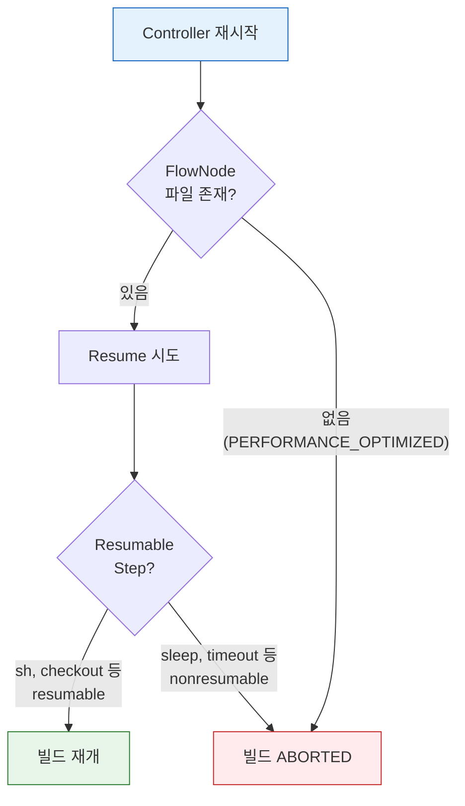

# Pipeline 내구성과 재기동

---

> Jenkins Controller가 재시작되면 실행 중인 Pipeline은 어떻게 될까요?

## §학습 목표

> 이 문서를 읽고 나면 CPS 변환이 어떻게 Pipeline을 재시작 이후에도 살아남게 하는지 설명하고, Resumable과 Nonresumable step을 구분하며, durability 세 레벨의 트레이드오프를 근거로 파이프라인별 설정을 선택할 수 있습니다.

## §사전 지식

> Jenkins Pipeline(Declarative/Scripted)의 기본 구조와 `agent`·`stages`·`steps` 개념을 알고 있으면 좋습니다. `$JENKINS_HOME` 디렉토리 구조와 controller·agent의 역할 분리(`../03_agent/`)를 떠올릴 수 있으면 내구성 메커니즘이 더 쉽게 읽힙니다.

## 1. Pipeline이 "살아남는다"는 것의 의미

> CPS 변환이 실행 상태를 디스크에 직렬화하기 때문에 Pipeline은 Controller 재시작 이후에도 이어서 실행될 수 있습니다.

Jenkins Pipeline은 Controller가 재시작되어도 실행 중이던 빌드를 중단 지점에서 이어갈 수 있습니다. 이전 세대인 Freestyle job에서는 불가능했던 능력입니다. 이것이 가능한 이유는 **CPS(Continuation-Passing Style)** 변환 때문입니다.

CPS 변환의 핵심 아이디어는 다음 세 가지입니다.

1. Groovy 스크립트의 실행 흐름을 "다음에 무엇을 할 것인가"라는 **continuation 객체의 연쇄**로 바꿉니다.
2. 변환된 코드는 실행 상태를 객체로 표현할 수 있어, 그 객체를 디스크에 저장했다가 복원하는 것이 가능합니다.
3. Pipeline 플러그인은 각 step마다 FlowNode 객체를 생성하고, `$JENKINS_HOME/jobs/<job>/builds/<build>/workflow/` 디렉토리에 XML 파일로 직렬화합니다.


Freestyle job과 Pipeline의 내구성 차이를 정리하면 다음과 같습니다:

| 구분 | 실행 위치 | Controller 재시작 시 |
|------|----------|---------------------|
| Freestyle job | Controller JVM 스레드 내 순차 실행 | 빌드 상태 소멸, 복구 불가 |
| Pipeline | FlowNode를 디스크에 직렬화 | 마지막 체크포인트에서 재개 가능 |

- CI/CD 파이프라인은 수 분에서 수 시간까지 실행될 수 있습니다.
- 그 사이에 Controller를 업그레이드하거나 예기치 않은 OOM이 발생할 수 있습니다. Pipeline의 resume 능력은 이런 상황에서 이미 완료한 단계를 처음부터 반복하지 않도록 해줍니다.

## 2. Resumable vs Nonresumable Step

> step이 agent 프로세스에서 독립적으로 실행되는지 여부가 resume 가능 여부를 가릅니다.

Pipeline이 resume될 수 있다는 것은 모든 step이 동일하게 resume를 지원한다는 뜻이 아닙니다. step은 resumable과 nonresumable 두 종류로 나뉩니다.

| 구분 | 대표 step | 재시작 후 동작 |
|------|----------|---------------|
| Resumable | `sh`, `bat`, `input`, `sleep` | Controller 복귀 후 재개 가능 |
| Nonresumable | `checkout`, `junit`, `archiveArtifacts`, `stash` | 재시작 시 해당 지점에서 에러 발생 |

Resumable step이 가능한 이유는 durable-task 플러그인 설계에 있습니다. `sh` step을 실행하면 Controller는 agent 노드에 셸 프로세스를 시작시키고, PID와 로그 파일 경로를 기록한 뒤 주기적으로 폴링합니다. 셸 프로세스는 Controller와 독립적으로 agent에서 실행되므로, Controller가 죽어도 프로세스는 계속 돌아갑니다. Controller가 복귀하면 기록해둔 PID를 기반으로 agent에 재연결하여 결과를 수집합니다.

Nonresumable step은 Controller JVM 안에서 실행되고 끝나는 step입니다. 실행 시간이 짧아서 resume 지원이 불필요하다고 설계되었지만, 대규모 저장소의 `checkout`은 수 분이 걸릴 수 있어 그 사이에 Controller가 죽으면 복구할 수 없습니다. Nonresumable step이 실행되는 구간이 파이프라인의 "사각지대"이므로, `retry` 블록으로 감싸는 것이 방어 전략입니다:

```groovy
steps {
    retry(3) { checkout scm }
}
```

## 3. Durability 설정과 트레이드오프

> FlowNode를 얼마나 자주 fsync하느냐가 성능과 복구 가능성 사이의 트레이드오프를 결정합니다.

FlowNode를 디스크에 얼마나 자주 저장하느냐가 durability 설정입니다. Jenkins는 세 가지 레벨을 제공합니다:

| 레벨 | 저장 시점 | 안전성 | 성능 | 권장 용도 |
|------|----------|--------|------|----------|
| `MAX_SURVIVABILITY` | 매 step마다 동기 저장 | 최고 | 낮음 | 프로덕션 배포, 승인 대기 파이프라인 |
| `SURVIVABLE_NONATOMIC` | fsync 없이 저장 | 중간 | 중간 | 일반 CI 파이프라인 |
| `PERFORMANCE_OPTIMIZED` | 완료 시에만 저장 | 낮음 | 최고 | 짧고 재실행 가능한 단위 테스트 |

`PERFORMANCE_OPTIMIZED`는 메모리에만 FlowNode를 유지하다 파이프라인 완료 시 디스크에 기록합니다. Controller가 비정상 종료되면 실행 중이던 파이프라인은 복구할 수 없습니다. Jenkins 공식 문서도 "dirty shutdown에서 running pipeline을 잃어도 괜찮은 경우에만 사용하라"고 명시합니다.

durability 힌트는 `options` 블록에서 파이프라인 단위로 지정할 수 있습니다:

```groovy
pipeline {
    agent any

    options {
        durabilityHint('PERFORMANCE_OPTIMIZED')
    }

    stages {
        stage('Test') {
            steps {
                sh 'mvn verify'
            }
        }
    }
}
```

`disableResume()` 옵션을 함께 쓰면 해당 파이프라인이 재시작 후 자동 resume를 시도하지 않도록 명시할 수 있습니다. 결제나 인프라 프로비저닝처럼 멱등성을 보장하기 어려운 파이프라인에서 유용합니다:

```groovy
pipeline {
    agent any
    options {
        disableResume()  // 이 파이프라인은 resume하지 않는다
    }
    stages { ... }
}
```

전역 기본값은 `MAX_SURVIVABILITY`로 유지하고, 성능이 중요한 개별 파이프라인의 `options` 블록에서만 낮추는 것이 권장 방식입니다. 전역을 `PERFORMANCE_OPTIMIZED`로 바꾸면 프로덕션 배포 파이프라인까지 영향을 받습니다.

## 4. Controller 재기동 시 빌드 복구

> 정상 재시작은 실행 상태와 직렬화 상태가 일치하지만, 비정상 종료는 마지막 fsync 시점 이후의 진행이 유실됩니다.

Controller 재기동 방식에 따라 복구 결과가 달라집니다. **정상 재시작(Safe Restart)** 은 현재 실행 중인 step이 끝날 때까지 기다린 뒤 Controller를 종료합니다. 직렬화된 상태와 실제 실행 상태가 정확히 일치하므로 resume 가능성이 가장 높습니다. **비정상 종료**(OOM kill, 서버 다운)는 마지막으로 디스크에 기록된 시점의 상태로 복원하므로, 기록 이후의 진행 상황은 유실될 수 있습니다.

Controller 복귀 후 빌드 복구 결과는 세 가지 조건의 조합으로 결정됩니다:

- `disableResume()` 옵션이 설정된 파이프라인은 복귀 후 resume를 시도하지 않고 ABORTED로 처리됩니다.
- 실행 중이던 step이 Nonresumable이면 해당 지점에서 에러가 발생합니다. `retry` 블록이 있으면 자동 재시도되고, 없으면 실패 처리됩니다.
- `PERFORMANCE_OPTIMIZED` 설정에서 비정상 종료가 발생하면 복구 자체가 불가능합니다.



Controller 재기동 시나리오별 동작을 요약하면 다음과 같습니다:

| 시나리오 | 기본 동작 | 비고 |
|---------|----------|------|
| resumable step 실행 중 + 정상 재시작 | 중단 지점에서 재개 | agent 생존이 전제 조건 |
| nonresumable step 실행 중 + 재시작 | 해당 지점에서 에러 | `retry`로 감싸면 자동 재시도 |
| `disableResume()` 설정 + 재시작 | ABORTED 처리 | 수동 재실행 필요 |
| `PERFORMANCE_OPTIMIZED` + 비정상 종료 | 복구 불가 | 짧고 멱등한 파이프라인에만 적용 |
| `input` 대기 중 + 재시작 | 승인 대기 상태 복원 | resumable step |
| K8s pod agent 사망 | 해당 stage 실패 | workspace도 함께 소멸 |

K8s 환경에서는 Controller가 살아 있어도 agent Pod가 eviction되면 해당 stage가 실패합니다. agent Pod는 workspace를 포함하므로, Pod가 교체되면 이전 workspace가 사라집니다. 이 때문에 각 stage를 짧게 유지하고, stage 간 데이터는 `stash`/`unstash`로 명시적으로 전달하는 설계가 필수입니다:

```groovy
pipeline {
    agent { kubernetes { ... } }

    stages {
        stage('Build') {
            steps {
                sh 'mvn package -DskipTests'
                stash name: 'app-jar', includes: 'target/*.jar'
            }
        }
        stage('Test') {
            steps {
                // 새 Pod에서 실행되므로 workspace가 없다
                unstash 'app-jar'
                sh 'mvn verify'
            }
        }
    }
}
```

실무 권장 패턴은 다음과 같습니다. 프로덕션 배포나 승인 대기가 포함된 파이프라인은 `MAX_SURVIVABILITY`를 유지합니다. 개발 브랜치의 단위 테스트처럼 실패해도 다시 돌리면 그만인 파이프라인은 `PERFORMANCE_OPTIMIZED`로 설정하여 Controller 부하를 줄입니다. 어느 설정을 쓰든 Nonresumable step은 `retry`로 감싸는 습관을 들이면, 예기치 않은 Controller 재시작에서 파이프라인의 생존 가능성이 높아집니다.

## 면접 질문

> 답을 떠올린 뒤 §정답 절에서 같은 번호로 대조하세요.

1. Freestyle job은 Controller 재시작 후 복구가 불가능한데 Pipeline은 가능합니다. 이 차이를 만드는 메커니즘은 무엇인가요?
2. `sh` step은 Resumable이고 `checkout`은 Nonresumable입니다. 무엇이 이 차이를 가르나요? Nonresumable step의 방어 패턴은 무엇인가요?
3. durability 세 레벨 중 `PERFORMANCE_OPTIMIZED`는 언제 쓰고, 전역 기본값으로 두면 안 되는 이유는 무엇인가요?

## 정답

> 위 질문을 스스로 설명해 본 뒤에 펼치세요.

### 정답 1 — CPS 직렬화

Freestyle job은 Controller JVM 스레드 안에서 순차 실행되므로 재시작과 함께 실행 상태가 사라집니다. Pipeline은 CPS 변환으로 실행 흐름을 continuation 객체의 연쇄로 바꾸고, 각 step의 상태를 FlowNode로 `$JENKINS_HOME/.../workflow/`에 XML로 직렬화합니다. 그래서 Controller가 재시작돼도 디스크의 FlowNode를 복원해 마지막 체크포인트부터 재개할 수 있습니다.

### 정답 2 — 실행 위치가 가르는 resume 가능 여부

차이는 step이 agent에서 독립적으로 실행되느냐에 있습니다. `sh`는 durable-task 플러그인이 agent에 셸 프로세스를 띄우고 PID·로그 경로를 기록하므로, Controller가 죽어도 프로세스는 agent에서 계속 돌고 복귀 후 재연결됩니다. `checkout`·`junit` 같은 Nonresumable step은 Controller JVM 안에서 실행되고 끝나므로 재시작 중이면 그 지점에서 에러가 납니다. 방어 패턴은 `retry` 블록으로 감싸 자동 재시도되게 하는 것입니다.

### 정답 3 — PERFORMANCE_OPTIMIZED의 자리

`PERFORMANCE_OPTIMIZED`는 FlowNode를 완료 시에만 디스크에 써서 빌드 속도가 가장 빠르지만, 비정상 종료 시 실행 중이던 파이프라인을 복구할 수 없습니다. 그래서 짧고 멱등해 다시 돌리면 그만인 단위 테스트에 맞습니다. 전역 기본값으로 두면 프로덕션 배포·승인 대기 파이프라인까지 복구 불가가 되므로, 전역은 `MAX_SURVIVABILITY`로 유지하고 성능이 중요한 개별 파이프라인의 `options`에서만 낮춥니다.

## 5. 관련 문서

- `01-00.점검.핵심 질문과 답 (내구성).md` — 내구성 자가 점검 Q&A
- `01-02.가용성 테스트 시나리오.md` — Docker Compose 장애 주입 실습
