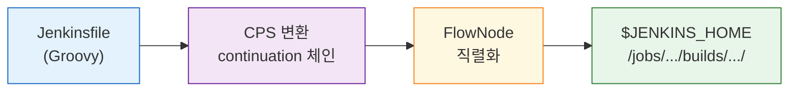
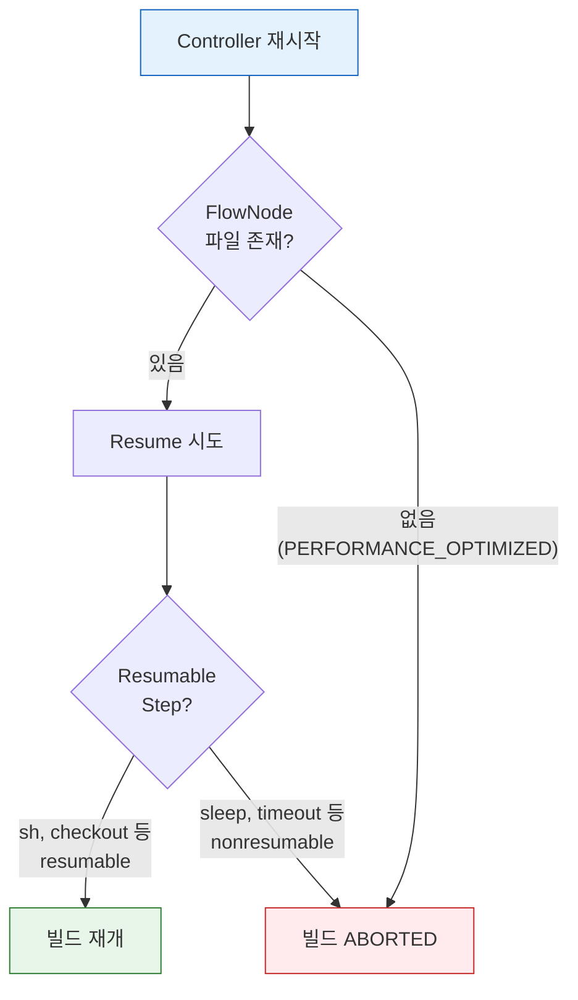

# Pipeline 내구성과 재기동

---

> 이 문서를 읽고 나면 CPS 변환이 어떻게 Pipeline을 재시작 이후에도 살아남게 하는지 **설명하고**, Resumable과 Nonresumable step을 **구분하며**, durability 세 모드의 트레이드오프를 근거로 파이프라인별 설정을 **선택**할 수 있습니다. graceful shutdown과 dirty shutdown이 재개 가부를 어떻게 가르는지 **예측**하고, 복구 실패 시나리오를 durability 모드로 **디버깅**할 수 있습니다.


## 사전 지식

Jenkins Pipeline(Declarative/Scripted)의 기본 구조와 `agent`·`stages`·`steps` 개념을 알고 있으면 좋습니다. `$JENKINS_HOME` 디렉토리 구조와 controller·agent의 역할 분리(`../03_agent/`)를 떠올릴 수 있으면 내구성 메커니즘이 더 쉽게 읽힙니다.


## 진입 — 왜 Pipeline 내구성을 알아야 하는가

> 장시간 도는 빌드 도중 Controller가 죽었을 때, 처음부터 다시 돌릴지 중단 지점에서 이어갈지는 내구성 설정 하나에 달려 있습니다.

CI/CD 파이프라인은 수 분에서 수 시간까지 실행됩니다. 그 사이 Controller 업그레이드, OOM, 컨테이너 재배치 같은 중단이 언제든 끼어들 수 있습니다. 이때 이미 통과한 빌드·테스트를 처음부터 반복할지, 중단 지점에서 이어갈지를 결정하는 것이 Pipeline의 내구성(durability)과 재기동 메커니즘입니다. 설정을 잘못 고르면 빠른 빌드를 얻는 대신 재시작 한 번에 한 시간짜리 배포를 통째로 잃을 수 있어, 트레이드오프를 정확히 이해하고 선택해야 합니다.


## 1. Pipeline이 "살아남는다"는 것의 의미

> 이미 아는 "프로그램을 종료해도 작업 파일이 남는다"의, **실행 중인 빌드 상태까지 디스크에 남는다**는 측면입니다.

> CPS 변환이 실행 상태를 디스크에 직렬화하기 때문에 Pipeline은 Controller 재시작 이후에도 이어서 실행될 수 있습니다.

Jenkins Pipeline은 Controller가 재시작되어도 실행 중이던 빌드를 중단 지점에서 이어갈 수 있습니다. 이전 세대인 Freestyle job에서는 불가능했던 능력입니다. 이것이 가능한 이유는 **CPS(Continuation-Passing Style)** 변환 때문입니다.

이 동작을 게임의 저장 시스템에 빗댈 수 있습니다. 게임을 끄기 전에 세이브 파일을 만들어 두면 다음에 켰을 때 그 지점에서 이어서 플레이할 수 있습니다. Pipeline도 실행 상태를 디스크에 직렬화해 두므로 Controller가 죽었다 살아나도 마지막 저장 지점에서 이어갑니다. 다만 이 비유는 "끄기 직전에 저장한다"까지만 맞고, 갑작스러운 정전(dirty shutdown)에서 깨집니다. 게임이라면 마지막 세이브로 복귀하지만, Pipeline은 durability 모드에 따라 마지막 저장 이후 진행이 유실되거나, `PERFORMANCE_OPTIMIZED`에서는 복구 자체가 불가능합니다.

CPS 변환의 핵심 아이디어는 다음 세 가지입니다.

1. Groovy 스크립트의 실행 흐름을 "다음에 무엇을 할 것인가"라는 **continuation 객체의 연쇄**로 바꿉니다.
2. 변환된 코드는 실행 상태를 객체로 표현할 수 있어, 그 객체를 디스크에 저장했다가 복원하는 것이 가능합니다.
3. Pipeline 플러그인은 각 step마다 FlowNode 객체를 생성하고, `$JENKINS_HOME/jobs/<job>/builds/<build>/workflow/` 디렉토리에 XML 파일로 직렬화합니다. CPS 프로그램의 전체 실행 상태는 같은 빌드 디렉토리의 `program.dat`에 직렬화되어, 재기동 시 이 파일로부터 복원됩니다 (출처: jenkins.io/doc/book/pipeline/scaling-pipeline).



Freestyle job과 Pipeline의 내구성 차이를 정리하면 다음과 같습니다:

| 구분 | 실행 위치 | Controller 재시작 시 |
|------|----------|---------------------|
| Freestyle job | Controller JVM 스레드 내 순차 실행 | 빌드 상태 소멸, 복구 불가 |
| Pipeline | FlowNode를 디스크에 직렬화 | 마지막 체크포인트에서 재개 가능 |

- CI/CD 파이프라인은 수 분에서 수 시간까지 실행될 수 있습니다.
- 그 사이에 Controller를 업그레이드하거나 예기치 않은 OOM이 발생할 수 있습니다. Pipeline의 resume 능력은 이런 상황에서 이미 완료한 단계를 처음부터 반복하지 않도록 해줍니다.


## 2. Resumable vs Nonresumable Step

> step이 agent 프로세스에서 독립적으로 실행되는지 여부가 resume 가능 여부를 가릅니다.

Pipeline이 resume될 수 있다는 것은 모든 step이 동일하게 resume를 지원한다는 뜻이 아닙니다. step은 resumable과 nonresumable 두 종류로 나뉩니다.

| 구분 | 대표 step | 재시작 후 동작 |
|------|----------|---------------|
| Resumable | `sh`, `bat`, `input`, `sleep` | Controller 복귀 후 재개 가능 |
| Nonresumable | `checkout`, `junit`, `archiveArtifacts`, `stash` | 재시작 시 해당 지점에서 에러 발생 |

Resumable step이 가능한 이유는 durable-task 플러그인 설계에 있습니다. `sh` step을 실행하면 Controller는 agent 노드에 셸 프로세스를 시작시키고, PID와 로그 파일 경로를 기록한 뒤 주기적으로 폴링합니다. 셸 프로세스는 Controller와 독립적으로 agent에서 실행되므로, Controller가 죽어도 프로세스는 계속 돌아갑니다. Controller가 복귀하면 기록해둔 PID를 기반으로 agent에 재연결하여 결과를 수집합니다.

Nonresumable step은 Controller JVM 안에서 실행되고 끝나는 step입니다. 실행 시간이 짧아서 resume 지원이 불필요하다고 설계되었지만, 대규모 저장소의 `checkout`은 수 분이 걸릴 수 있어 그 사이에 Controller가 죽으면 복구할 수 없습니다. Nonresumable step이 실행되는 구간이 파이프라인의 "사각지대"이므로, `retry` 블록으로 감싸는 것이 방어 전략입니다:

```groovy
steps {
    // checkout은 Nonresumable이라 재시작 중이면 그 지점에서 깨진다
    // retry로 감싸 재시작 직후 자동으로 다시 받아오게 한다
    retry(3) { checkout scm }
}
```


## 3. Durability 설정과 트레이드오프

> 상태를 얼마나 자주, 얼마나 안전하게 디스크에 기록하느냐가 성능과 복구 가능성 사이의 트레이드오프를 결정합니다.

상태를 디스크에 얼마나 자주, 어떤 방식으로 기록하느냐가 durability 설정입니다. Jenkins는 세 가지 모드를 제공합니다 (출처: jenkins.io/doc/book/pipeline/scaling-pipeline):

| 모드 | 기록 방식 | 안전성 | 성능 | 권장 용도 |
|------|----------|--------|------|----------|
| `MAX_SURVIVABILITY` | 원본 동작, transient data까지 자주 기록 | 최고 | 가장 느림 | 프로덕션 배포, 승인 대기 파이프라인 |
| `SURVIVABLE_NONATOMIC` | step마다 기록하되 atomic write 생략 | 중간 | 중간 (네트워크 스토리지서 빠름) | 일반 CI, NFS 등 네트워크 `$JENKINS_HOME` |
| `PERFORMANCE_OPTIMIZED` | 디스크 I/O 최소화, 자주 기록하지 않음 | 낮음 | 가장 빠름 | 짧고 재실행 가능한 단위 테스트 |

`MAX_SURVIVABILITY`는 원본 동작 그대로 transient data까지 자주 기록하므로 복구 안전성은 최고지만 디스크 I/O가 가장 많아 느립니다. `SURVIVABLE_NONATOMIC`은 step마다 상태를 기록하되 atomic write를 생략하므로, atomic write 비용이 큰 네트워크 스토리지(`$JENKINS_HOME`이 NFS인 환경)에서 더 빠릅니다. `PERFORMANCE_OPTIMIZED`는 디스크 I/O를 최소화해 가장 빠른 대신, dirty shutdown이 발생하면 실행 중이던 파이프라인의 재개에 실패하고 Freestyle job처럼 처음부터 다시 돌려야 합니다. Jenkins 공식 문서도 "dirty shutdown에서 running pipeline을 잃어도 괜찮은 경우에만 사용하라"고 명시합니다 (출처: jenkins.io/doc/book/pipeline/scaling-pipeline).

핵심 갈림길은 종료 방식입니다. **graceful shutdown**(정상 서비스 종료 또는 `/exit` 엔드포인트로 안전 종료)이면 어느 모드든 실행 중 파이프라인을 재개할 수 있습니다. **dirty shutdown**(SIGKILL, 컨테이너 강제 종료)이면 durability가 `MAX_SURVIVABILITY`나 `SURVIVABLE_NONATOMIC`일 때만 재개할 수 있고, `PERFORMANCE_OPTIMIZED`이면 재개가 불가능합니다 (출처: jenkins.io/doc/book/pipeline/scaling-pipeline).

durability는 전역(Manage Jenkins > System), job별, multibranch의 branch별로 설정할 수 있고, 파이프라인 안에서는 `options` 블록으로 지정합니다 (출처: jenkins.io/doc/book/pipeline/scaling-pipeline):

```groovy
pipeline {
    agent any

    options {
        // 이 파이프라인만 가장 빠른 모드로 낮춘다 (전역 기본은 건드리지 않는다)
        // 단위 테스트라 dirty shutdown으로 잃어도 다시 돌리면 그만이라는 판단
        durabilityHint('PERFORMANCE_OPTIMIZED')
    }

    stages {
        stage('Test') {
            steps {
                sh 'mvn verify'
            }
        }
    }
}
```

`disableResume()` 옵션을 함께 쓰면 해당 파이프라인이 재시작 후 자동 resume를 시도하지 않도록 명시할 수 있습니다. 결제나 인프라 프로비저닝처럼 멱등성을 보장하기 어려운 파이프라인에서 유용합니다:

```groovy
pipeline {
    agent any
    options {
        disableResume()  // 이 파이프라인은 resume하지 않는다
    }
    stages { ... }
}
```

전역 기본값은 `MAX_SURVIVABILITY`로 유지하고, 성능이 중요한 개별 파이프라인의 `options` 블록에서만 낮추는 것이 권장 방식입니다. 전역을 `PERFORMANCE_OPTIMIZED`로 바꾸면 프로덕션 배포 파이프라인까지 영향을 받습니다.


## 4. Controller 재기동 시 빌드 복구

> 정상 재시작은 실행 상태와 직렬화 상태가 일치하지만, 비정상 종료는 마지막 fsync 시점 이후의 진행이 유실됩니다.

Controller 재기동 방식에 따라 복구 결과가 달라집니다. **정상 재시작(Safe Restart)** 은 현재 실행 중인 step이 끝날 때까지 기다린 뒤 Controller를 종료합니다. 직렬화된 상태와 실제 실행 상태가 정확히 일치하므로 resume 가능성이 가장 높습니다. **비정상 종료**(OOM kill, 서버 다운)는 마지막으로 디스크에 기록된 시점의 상태로 복원하므로, 기록 이후의 진행 상황은 유실될 수 있습니다.

Controller 복귀 후 빌드 복구 결과는 세 가지 조건의 조합으로 결정됩니다:

- `disableResume()` 옵션이 설정된 파이프라인은 복귀 후 resume를 시도하지 않고 ABORTED로 처리됩니다.
- 실행 중이던 step이 Nonresumable이면 해당 지점에서 에러가 발생합니다. `retry` 블록이 있으면 자동 재시도되고, 없으면 실패 처리됩니다.
- `PERFORMANCE_OPTIMIZED` 설정에서 비정상 종료가 발생하면 복구 자체가 불가능합니다.



Controller 재기동 시나리오별 동작을 요약하면 다음과 같습니다:

| 시나리오 | 기본 동작 | 비고 |
|---------|----------|------|
| resumable step 실행 중 + 정상 재시작 | 중단 지점에서 재개 | agent 생존이 전제 조건 |
| nonresumable step 실행 중 + 재시작 | 해당 지점에서 에러 | `retry`로 감싸면 자동 재시도 |
| `disableResume()` 설정 + 재시작 | ABORTED 처리 | 수동 재실행 필요 |
| `PERFORMANCE_OPTIMIZED` + 비정상 종료 | 복구 불가 | 짧고 멱등한 파이프라인에만 적용 |
| `input` 대기 중 + 재시작 | 승인 대기 상태 복원 | resumable step |
| K8s pod agent 사망 | 해당 stage 실패 | workspace도 함께 소멸 |

K8s 환경에서는 Controller가 살아 있어도 agent Pod가 eviction되면 해당 stage가 실패합니다. agent Pod는 workspace를 포함하므로, Pod가 교체되면 이전 workspace가 사라집니다. 이 때문에 각 stage를 짧게 유지하고, stage 간 데이터는 `stash`/`unstash`로 명시적으로 전달하는 설계가 필수입니다:

```groovy
pipeline {
    agent { kubernetes { ... } }

    stages {
        stage('Build') {
            steps {
                sh 'mvn package -DskipTests'
                stash name: 'app-jar', includes: 'target/*.jar'
            }
        }
        stage('Test') {
            steps {
                // 새 Pod에서 실행되므로 이전 Pod의 workspace가 없다
                // 앞 stage에서 stash한 산출물을 명시적으로 끌어와야 한다
                unstash 'app-jar'
                sh 'mvn verify'
            }
        }
    }
}
```

구체적인 시나리오로 트레이드오프를 가늠해 봅니다. 40분짜리 배포 파이프라인이 30분 지점(승인 대기 직후)에서 OOM kill로 dirty shutdown을 맞았다고 합시다. `MAX_SURVIVABILITY`였다면 마지막으로 기록된 step부터 재개해 남은 약 10분만 다시 진행합니다. 같은 파이프라인이 `PERFORMANCE_OPTIMIZED`였다면 30분치 진행이 통째로 사라져 처음부터 40분을 다시 돌려야 하고, 승인까지 사람을 한 번 더 기다리게 합니다. 반대로 2분짜리 단위 테스트라면 재시작 후 처음부터 돌려도 2분이라, `PERFORMANCE_OPTIMIZED`로 디스크 I/O를 줄이는 편이 합리적입니다.

실무 권장 패턴은 다음과 같습니다. 프로덕션 배포나 승인 대기가 포함된 파이프라인은 `MAX_SURVIVABILITY`를 유지합니다. 개발 브랜치의 단위 테스트처럼 실패해도 다시 돌리면 그만인 파이프라인은 `PERFORMANCE_OPTIMIZED`로 설정하여 Controller 부하를 줄입니다. 어느 설정을 쓰든 Nonresumable step은 `retry`로 감싸는 습관을 들이면, 예기치 않은 Controller 재시작에서 파이프라인의 생존 가능성이 높아집니다.


## 5. 업그레이드·백업·System Message 운영

> 재기동을 안전하게 다루는 능력은 계획된 업그레이드와 백업 절차로 이어지며, 그 과정을 사용자에게 알리는 공지까지가 한 묶음입니다.

Controller 재기동의 가장 흔한 원인은 계획된 업그레이드입니다. Jenkins 는 보안 패치·버그 수정·기능 개선을 매달 제공하므로, 책(Learning Continuous Integration with Jenkins 3e)은 최소 월 1회 업그레이드 계획을 권장합니다. 업그레이드 주기는 새 업데이트(특히 보안) 감시 → 사용자 공지 → 업그레이드 실행 → 이슈 모니터링 네 단계로 구성됩니다. 새 릴리스는 Jenkins LTS Changelog(jenkins.io/changelog-stable)에서 추적합니다.

업그레이드 실행 방식은 설치 형태에 따라 갈립니다. Helm chart 면 `values.yaml` 의 이미지 태그를 올리고 `helm upgrade -f values.yaml` 을 실행합니다. VM 이면 Jenkins 서비스를 멈추고 현재 `jenkins.war` 를 백업한 뒤 새 버전을 내려받아 교체합니다:

```bash
sudo systemctl stop jenkins.service
# 왜 백업: 새 war 가 문제를 일으키면 .old 로 즉시 롤백하기 위함
mv /usr/share/jenkins/jenkins.war /usr/share/jenkins/jenkins.war.old
sudo wget https://get.jenkins.io/war-stable/<버전>/jenkins.war -P /usr/share/jenkins/
sudo systemctl start jenkins.service
```

플러그인은 대시보드에서 직접 올리기보다 Configuration as Code 로 버전을 고정해 관리하는 편이 안전합니다. 플러그인 업데이트가 문제를 일으켰을 때 이전 버전으로 되돌리기 쉽기 때문이며, Jenkins 본체와 함께 업그레이드하는 것이 호환성 측면에서 권장됩니다.

백업 대상은 생각보다 좁습니다. 인프라(IaC)·설정(JCasC)·파이프라인(Jenkinsfile)이 모두 코드로 버전 관리되면, 남는 것은 빌드 로그뿐입니다. 빌드 로그는 디버깅이 끝나면 가치가 빠르게 떨어지므로, 릴리스 빈도가 높은 팀은 며칠~몇 주만 보관합니다. Jenkins 데이터를 영속 볼륨(PVC)이나 managed disk 에 두면 클라우드의 백업 기능으로 정기 백업할 수 있습니다.

업그레이드는 사용자에게 미리 알려야 합니다. Manage Jenkins > System 의 System Message 로 대시보드에 공지를 띄우며, 배경색 같은 HTML 스타일을 쓰려면 Markup Formatter 를 Safe HTML 로 설정합니다. Safe HTML 은 위험한 태그를 걸러내고 스타일 관련 태그만 허용하므로, 악성 스크립트 주입 없이 안전하게 강조할 수 있습니다. 이 공지 설정 역시 JCasC 로 코드화할 수 있어, `markupFormatter: rawHtml` 한 줄로 선언합니다.

업그레이드 직후에는 전용 스모크 테스트 파이프라인을 한 번 돌려 즉각적인 회귀를 조기에 잡는 것이 좋습니다. 포괄적 테스트는 아니지만, Jenkins·플러그인 업그레이드가 깨뜨린 기본 동작을 빠르게 드러냅니다.


## 면접 질문

> 답을 떠올린 뒤 §정답 절에서 같은 번호로 대조하세요.

1. Freestyle job은 Controller 재시작 후 복구가 불가능한데 Pipeline은 가능합니다. 이 차이를 만드는 메커니즘은 무엇인가요?
2. `sh` step은 Resumable이고 `checkout`은 Nonresumable입니다. 무엇이 이 차이를 가르나요? Nonresumable step의 방어 패턴은 무엇인가요?
3. durability 세 모드 중 `PERFORMANCE_OPTIMIZED`는 언제 쓰고, 전역 기본값으로 두면 안 되는 이유는 무엇인가요?
4. 코드화(IaC·JCasC·Pipeline)가 끝난 Jenkins 에서 정작 백업해야 할 대상은 무엇이며, 그 이유는 무엇인가요?

### 빈칸 채우기 — 내구성과 재기동

다음 문장의 빈칸을 채워 보세요.

1. Pipeline의 CPS 프로그램 전체 실행 상태는 빌드 디렉토리의 `______` 파일에 직렬화되어 재기동 시 복원됩니다.
2. durability가 `PERFORMANCE_OPTIMIZED`일 때 실행 중 파이프라인을 재개하려면 종료 방식이 `______` shutdown이어야 하고, `______` shutdown이면 재개에 실패합니다.
3. `SURVIVABLE_NONATOMIC` 모드는 step마다 기록하되 `______` write를 생략하므로 `______` 스토리지 환경에서 더 빠릅니다.
4. durability는 전역, job별, 그리고 multibranch의 `______`별로 설정할 수 있습니다.
5. VM 업그레이드 시 현재 `jenkins.war` 를 `______` 확장자로 백업한 뒤 새 버전으로 교체하면, 문제가 생겨도 즉시 롤백할 수 있습니다.


## 정답

> 위 질문을 스스로 설명해 본 뒤에 펼치세요.

### 정답 1 — CPS 직렬화

Freestyle job은 Controller JVM 스레드 안에서 순차 실행되므로 재시작과 함께 실행 상태가 사라집니다. Pipeline은 CPS 변환으로 실행 흐름을 continuation 객체의 연쇄로 바꾸고, 각 step의 상태를 FlowNode로 `$JENKINS_HOME/.../workflow/`에 XML로 직렬화합니다. 그래서 Controller가 재시작돼도 디스크의 FlowNode를 복원해 마지막 체크포인트부터 재개할 수 있습니다.

### 정답 2 — 실행 위치가 가르는 resume 가능 여부

차이는 step이 agent에서 독립적으로 실행되느냐에 있습니다. `sh`는 durable-task 플러그인이 agent에 셸 프로세스를 띄우고 PID·로그 경로를 기록하므로, Controller가 죽어도 프로세스는 agent에서 계속 돌고 복귀 후 재연결됩니다. `checkout`·`junit` 같은 Nonresumable step은 Controller JVM 안에서 실행되고 끝나므로 재시작 중이면 그 지점에서 에러가 납니다. 방어 패턴은 `retry` 블록으로 감싸 자동 재시도되게 하는 것입니다.

### 정답 3 — PERFORMANCE_OPTIMIZED의 자리

`PERFORMANCE_OPTIMIZED`는 디스크 I/O를 최소화해 빌드 속도가 가장 빠르지만, dirty shutdown 시 실행 중이던 파이프라인을 재개할 수 없습니다. 그래서 짧고 멱등해 다시 돌리면 그만인 단위 테스트에 맞습니다. 전역 기본값으로 두면 프로덕션 배포·승인 대기 파이프라인까지 복구 불가가 되므로, 전역은 `MAX_SURVIVABILITY`로 유지하고 성능이 중요한 개별 파이프라인의 `options`에서만 낮춥니다.

### 정답 4 — 코드화 이후 백업 대상

인프라(IaC)·설정(JCasC)·파이프라인(Jenkinsfile)이 모두 코드로 버전 관리되면, 이들은 Git 에서 언제든 동일하게 재현됩니다. 그래서 정작 백업해야 할 대상은 코드로 표현되지 않는 빌드 로그뿐입니다. 빌드 로그는 빌드 실패를 디버깅할 때만 가치가 있고, 문제 원인을 찾고 나면 빠르게 관련성이 떨어지므로, 릴리스 빈도가 높은 팀은 며칠~몇 주만 보관합니다. Jenkins 데이터를 영속 볼륨이나 managed disk 에 두면 클라우드 백업 기능으로 정기 백업할 수 있습니다.

### 빈칸 정답 — 내구성과 재기동

1. `program.dat` — CPS 프로그램의 전체 실행 상태가 이 파일에 직렬화됩니다.
2. `graceful` shutdown / `dirty` shutdown — graceful이면 어느 모드든 재개 가능, dirty면 `PERFORMANCE_OPTIMIZED`는 재개 실패합니다.
3. `atomic` write / `네트워크`(NFS 등) 스토리지 — atomic write를 생략해 네트워크 스토리지에서 비용을 줄입니다.
4. `branch` — multibranch 파이프라인은 branch별로 durability를 설정할 수 있습니다.
5. `.old` — `jenkins.war` 를 `jenkins.war.old` 로 백업해 두면 새 버전에 문제가 생겨도 즉시 되돌릴 수 있습니다.


## 관련 문서

> 같은 05_operations 장의 내구성·가용성 편과, 재기동에 얽힌 agent·hook 메커니즘을 함께 보면 이해가 단단해집니다.

- [01-00. 점검.핵심 질문과 답 (내구성)](01-00.%EC%A0%90%EA%B2%80.%ED%95%B5%EC%8B%AC%20%EC%A7%88%EB%AC%B8%EA%B3%BC%20%EB%8B%B5%20%28%EB%82%B4%EA%B5%AC%EC%84%B1%29.md) § "핵심 질문" — 내구성 개념을 Q&A로 자가 점검
- [01-02. 가용성 테스트 시나리오](01-02.%EA%B0%80%EC%9A%A9%EC%84%B1%20%ED%85%8C%EC%8A%A4%ED%8A%B8%20%EC%8B%9C%EB%82%98%EB%A6%AC%EC%98%A4.md) § "장애 주입" — Docker Compose로 Controller 다운을 실제 재현
- [02-05a. RunListener와 FlowExecutionListener](02-05a.RunListener%EC%99%80%20FlowExecutionListener.md) § "flow 실행 수명" — 재기동되는 flow 실행의 시작·종료 이벤트 훅
- [02-06. GCP K8s Jenkins 실전](02-06.GCP%20K8s%20Jenkins%20%EC%8B%A4%EC%A0%84.md) § "agent Pod" — Pod eviction과 workspace 소멸이 재기동에 미치는 영향
- [../03_agent/README](../03_agent/README.md) — durable-task가 의존하는 controller·agent 역할 분리
