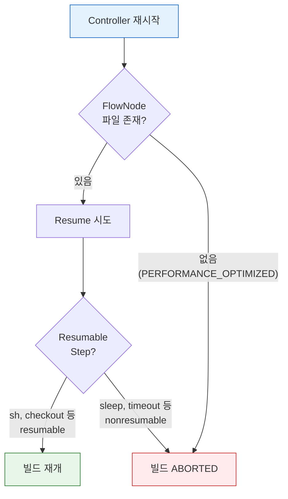

# Pipeline 내구성과 재기동

---

> Jenkins Controller가 재시작되면 실행 중인 Pipeline은 어떻게 되는가?


## 1. Pipeline이 "살아남는다"는 것의 의미

> CPS 변환이 실행 상태를 디스크에 직렬화하기 때문에 Pipeline은 Controller 재시작 이후에도 이어서 실행될 수 있다.

Jenkins Pipeline은 Controller가 재시작되어도 실행 중이던 빌드를 중단 지점에서 이어갈 수 있다. 이전 세대인 Freestyle job에서는 불가능했던 능력이다. 이것이 가능한 이유는 **CPS(Continuation-Passing Style)** 변환 때문이다.

CPS 변환의 핵심 아이디어는 다음 세 가지다.

1. Groovy 스크립트의 실행 흐름을 "다음에 무엇을 할 것인가"라는 **continuation 객체의 연쇄**로 바꾼다.
2. 변환된 코드는 실행 상태를 객체로 표현할 수 있어, 그 객체를 디스크에 저장했다가 복원하는 것이 가능하다.
3. Pipeline 플러그인은 각 step마다 FlowNode 객체를 생성하고, `$JENKINS_HOME/jobs/<job>/builds/<build>/workflow/` 디렉토리에 XML 파일로 직렬화한다.


Freestyle job과 Pipeline의 내구성 차이를 정리하면 다음과 같다:

| 구분 | 실행 위치 | Controller 재시작 시 |
|------|----------|---------------------|
| Freestyle job | Controller JVM 스레드 내 순차 실행 | 빌드 상태 소멸, 복구 불가 |
| Pipeline | FlowNode를 디스크에 직렬화 | 마지막 체크포인트에서 재개 가능 |

- CI/CD 파이프라인은 수 분에서 수 시간까지 실행될 수 있다. 
- 그 사이에 Controller를 업그레이드하거나 예기치 않은 OOM이 발생할 수 있다. Pipeline의 resume 능력은 이런 상황에서 이미 완료한 단계를 처음부터 반복하지 않도록 해준다.

 

## 2. Resumable vs Nonresumable Step

> step이 agent 프로세스에서 독립적으로 실행되는지 여부가 resume 가능 여부를 가른다.

Pipeline이 resume될 수 있다는 것은 모든 step이 동일하게 resume를 지원한다는 뜻이 아니다. step은 resumable과 nonresumable 두 종류로 나뉜다.

| 구분 | 대표 step | 재시작 후 동작 |
|------|----------|---------------|
| Resumable | `sh`, `bat`, `input`, `sleep` | Controller 복귀 후 재개 가능 |
| Nonresumable | `checkout`, `junit`, `archiveArtifacts`, `stash` | 재시작 시 해당 지점에서 에러 발생 |

Resumable step이 가능한 이유는 durable-task 플러그인 설계에 있다. `sh` step을 실행하면 Controller는 agent 노드에 셸 프로세스를 시작시키고, PID와 로그 파일 경로를 기록한 뒤 주기적으로 폴링한다. 셸 프로세스는 Controller와 독립적으로 agent에서 실행되므로, Controller가 죽어도 프로세스는 계속 돌아간다. Controller가 복귀하면 기록해둔 PID를 기반으로 agent에 재연결하여 결과를 수집한다.

Nonresumable step은 Controller JVM 안에서 실행되고 끝나는 step이다. 실행 시간이 짧아서 resume 지원이 불필요하다고 설계되었지만, 대규모 저장소의 `checkout`은 수 분이 걸릴 수 있어 그 사이에 Controller가 죽으면 복구할 수 없다. Nonresumable step이 실행되는 구간이 파이프라인의 "사각지대"이므로, `retry` 블록으로 감싸는 것이 방어 전략이다:

```groovy
steps {
    retry(3) { checkout scm }
}
```


## 3. Durability 설정과 트레이드오프

> FlowNode를 얼마나 자주 fsync하느냐가 성능과 복구 가능성 사이의 트레이드오프를 결정한다.

FlowNode를 디스크에 얼마나 자주 저장하느냐가 durability 설정이다. Jenkins는 세 가지 레벨을 제공한다:

| 레벨 | 저장 시점 | 안전성 | 성능 | 권장 용도 |
|------|----------|--------|------|----------|
| `MAX_SURVIVABILITY` | 매 step마다 동기 저장 | 최고 | 낮음 | 프로덕션 배포, 승인 대기 파이프라인 |
| `SURVIVABLE_NONATOMIC` | fsync 없이 저장 | 중간 | 중간 | 일반 CI 파이프라인 |
| `PERFORMANCE_OPTIMIZED` | 완료 시에만 저장 | 낮음 | 최고 | 짧고 재실행 가능한 단위 테스트 |

`PERFORMANCE_OPTIMIZED`는 메모리에만 FlowNode를 유지하다 파이프라인 완료 시 디스크에 기록한다. Controller가 비정상 종료되면 실행 중이던 파이프라인은 복구할 수 없다. Jenkins 공식 문서도 "dirty shutdown에서 running pipeline을 잃어도 괜찮은 경우에만 사용하라"고 명시한다.

durability 힌트는 `options` 블록에서 파이프라인 단위로 지정할 수 있다:

```groovy
pipeline {
    agent any

    options {
        durabilityHint('PERFORMANCE_OPTIMIZED')
    }

    stages {
        stage('Test') {
            steps {
                sh 'mvn verify'
            }
        }
    }
}
```

`disableResume()` 옵션을 함께 쓰면 해당 파이프라인이 재시작 후 자동 resume를 시도하지 않도록 명시할 수 있다. 결제나 인프라 프로비저닝처럼 멱등성을 보장하기 어려운 파이프라인에서 유용하다:

```groovy
pipeline {
    agent any
    options {
        disableResume()  // 이 파이프라인은 resume하지 않는다
    }
    stages { ... }
}
```

전역 기본값은 `MAX_SURVIVABILITY`로 유지하고, 성능이 중요한 개별 파이프라인의 `options` 블록에서만 낮추는 것이 권장 방식이다. 전역을 `PERFORMANCE_OPTIMIZED`로 바꾸면 프로덕션 배포 파이프라인까지 영향을 받는다.


## 4. Controller 재기동 시 빌드 복구

> 정상 재시작은 실행 상태와 직렬화 상태가 일치하지만, 비정상 종료는 마지막 fsync 시점 이후의 진행이 유실된다.

Controller 재기동 방식에 따라 복구 결과가 달라진다. **정상 재시작(Safe Restart)** 은 현재 실행 중인 step이 끝날 때까지 기다린 뒤 Controller를 종료한다. 직렬화된 상태와 실제 실행 상태가 정확히 일치하므로 resume 가능성이 가장 높다. **비정상 종료**(OOM kill, 서버 다운)는 마지막으로 디스크에 기록된 시점의 상태로 복원하므로, 기록 이후의 진행 상황은 유실될 수 있다.

Controller 복귀 후 빌드 복구 결과는 세 가지 조건의 조합으로 결정된다:

- `disableResume()` 옵션이 설정된 파이프라인은 복귀 후 resume를 시도하지 않고 ABORTED로 처리된다.
- 실행 중이던 step이 Nonresumable이면 해당 지점에서 에러가 발생한다. `retry` 블록이 있으면 자동 재시도되고, 없으면 실패 처리된다.
- `PERFORMANCE_OPTIMIZED` 설정에서 비정상 종료가 발생하면 복구 자체가 불가능하다.



Controller 재기동 시나리오별 동작을 요약하면 다음과 같다:

| 시나리오 | 기본 동작 | 비고 |
|---------|----------|------|
| resumable step 실행 중 + 정상 재시작 | 중단 지점에서 재개 | agent 생존이 전제 조건 |
| nonresumable step 실행 중 + 재시작 | 해당 지점에서 에러 | `retry`로 감싸면 자동 재시도 |
| `disableResume()` 설정 + 재시작 | ABORTED 처리 | 수동 재실행 필요 |
| `PERFORMANCE_OPTIMIZED` + 비정상 종료 | 복구 불가 | 짧고 멱등한 파이프라인에만 적용 |
| `input` 대기 중 + 재시작 | 승인 대기 상태 복원 | resumable step |
| K8s pod agent 사망 | 해당 stage 실패 | workspace도 함께 소멸 |

K8s 환경에서는 Controller가 살아 있어도 agent Pod가 eviction되면 해당 stage가 실패한다. agent Pod는 workspace를 포함하므로, Pod가 교체되면 이전 workspace가 사라진다. 이 때문에 각 stage를 짧게 유지하고, stage 간 데이터는 `stash`/`unstash`로 명시적으로 전달하는 설계가 필수다:

```groovy
pipeline {
    agent { kubernetes { ... } }

    stages {
        stage('Build') {
            steps {
                sh 'mvn package -DskipTests'
                stash name: 'app-jar', includes: 'target/*.jar'
            }
        }
        stage('Test') {
            steps {
                // 새 Pod에서 실행되므로 workspace가 없다
                unstash 'app-jar'
                sh 'mvn verify'
            }
        }
    }
}
```

실무 권장 패턴은 다음과 같다. 프로덕션 배포나 승인 대기가 포함된 파이프라인은 `MAX_SURVIVABILITY`를 유지한다. 개발 브랜치의 단위 테스트처럼 실패해도 다시 돌리면 그만인 파이프라인은 `PERFORMANCE_OPTIMIZED`로 설정하여 Controller 부하를 줄인다. 어느 설정을 쓰든 Nonresumable step은 `retry`로 감싸는 습관을 들이면, 예기치 않은 Controller 재시작에서 파이프라인의 생존 가능성이 높아진다.
