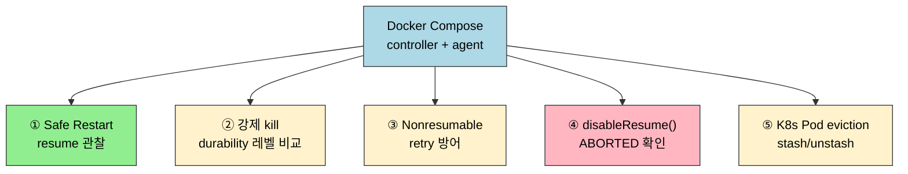
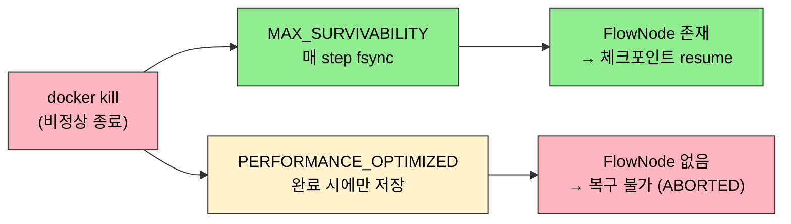

# 가용성 테스트 시나리오

---

> Pipeline 내구성은 이론만으로 확인할 수 없습니다. Docker Compose 환경에서 다섯 가지 장애 시나리오를 재현하고 복구 동작을 직접 관찰합니다.

## §학습 목표

> 이 문서를 읽고 나면 Docker Compose로 controller·agent 환경을 띄우고, Safe Restart·강제 종료·Nonresumable 실패·`disableResume()`·K8s Pod eviction 다섯 가지 장애를 주입해 durability와 resume 동작을 직접 검증하며, FlowNode 파일·`build.xml`로 복구 결과의 원인을 추적할 수 있습니다.

## §사전 지식

> `01-01`에서 본 CPS 직렬화·Resumable/Nonresumable step·durability 세 레벨을 알고 있어야 합니다. Docker와 docker compose 사용 경험, Jenkins UI에서 agent 노드를 등록해 본 경험이 있으면 실습을 따라오기 쉽습니다.

다섯 시나리오는 같은 환경에서 서로 다른 장애를 주입해 복구 동작을 가른다는 공통 구조를 가집니다:



## 1. 실습 환경 준비

> Docker Compose로 Jenkins Controller와 Agent를 구성합니다. 모든 시나리오는 이 환경에서 재현할 수 있습니다.

실습은 Jenkins Controller 1대와 inbound-agent 1대로 구성한 Docker Compose 환경에서 진행합니다. 사전 요건은 Docker와 docker compose입니다. 환경을 시작한 후 Jenkins UI에서 agent 노드를 구성하고 Secret을 발급받아야 합니다.

아래는 기본 `docker-compose.yml`입니다:

```yaml
version: "3.8"
services:
  jenkins:
    image: jenkins/jenkins:2.440.3-lts-jdk17
    container_name: jenkins-controller
    ports:
      - "8080:8080"
      - "50000:50000"
    volumes:
      - jenkins_home:/var/jenkins_home
    environment:
      JAVA_OPTS: "-Djenkins.install.runSetupWizard=false"

  agent:
    image: jenkins/inbound-agent:latest
    container_name: jenkins-agent
    environment:
      JENKINS_URL: http://jenkins:8080
      JENKINS_AGENT_NAME: test-agent
      JENKINS_SECRET: "${AGENT_SECRET}"
    depends_on:
      - jenkins

volumes:
  jenkins_home:
```

환경이 기동되면 Jenkins UI에서 agent 노드를 등록하고 Secret을 확인한 뒤, `.env` 파일에 `AGENT_SECRET=<발급된 값>` 형식으로 저장합니다. 이후 각 시나리오에서 사용할 테스트 파이프라인을 생성합니다.

## 2. 시나리오 1: Safe Restart 중 Pipeline resume

> 긴 `sh` step 실행 중 Safe Restart를 트리거하면 Pipeline이 중단 지점에서 재개되는 과정을 관찰합니다.

Controller가 재시작되어도 agent에서 독립적으로 실행 중인 `sh` step은 살아있습니다. Controller가 복귀하면 기록해둔 프로세스 정보를 기반으로 agent에 재연결하여 결과를 수집합니다. 이 동작을 직접 확인하는 것이 시나리오 1의 목표입니다.

아래 파이프라인을 생성합니다:

```groovy
pipeline {
    agent { label 'test-agent' }

    stages {
        stage('Long Task') {
            steps {
                sh '''
                    echo "Step started at $(date)"
                    for i in $(seq 1 60); do
                        echo "Working... $i/60"
                        sleep 5
                    done
                    echo "Step completed at $(date)"
                '''
            }
        }
        stage('After Restart') {
            steps {
                echo 'This stage should run after resume'
            }
        }
    }
}
```

절차는 다음 순서로 진행합니다:

1. 파이프라인 빌드를 시작합니다.
2. 로그에 "Working... 10/60"이 출력될 때까지 기다립니다.
3. Safe Restart를 트리거합니다. Jenkins UI에서 Manage Jenkins → Prepare for Shutdown → Restart를 선택하거나, API를 직접 호출합니다:
   ```bash
   curl -X POST -u admin:TOKEN "http://localhost:8080/safeRestart"
   ```
4. Jenkins가 재기동될 때까지 기다립니다.

재기동 완료 후 다음 항목을 확인합니다:

- 빌드 번호가 동일하게 유지되는지 확인합니다 (새 빌드가 아닙니다).
- agent 컨테이너 로그에서 `sh` step이 계속 실행 중임을 확인합니다.
- Controller가 복귀한 뒤 agent에 재연결하여 콘솔 로그가 이어지는지 확인합니다.

FlowNode 파일이 생성되어 있는지도 함께 확인합니다. 파일 하나가 직렬화된 체크포인트 하나에 해당합니다:

```bash
docker exec jenkins-controller ls /var/jenkins_home/jobs/<job>/builds/<n>/workflow/
```

## 3. 시나리오 2: Durability 레벨별 비정상 종료

> `MAX_SURVIVABILITY`와 `PERFORMANCE_OPTIMIZED` 파이프라인을 동시에 실행한 뒤 Controller를 강제 종료하면 어떤 파이프라인이 복구되는지 확인합니다.

Durability 레벨의 차이는 비정상 종료 상황에서 가장 명확하게 드러납니다. FlowNode를 매 step마다 fsync하는 `MAX_SURVIVABILITY`와 완료 시에만 저장하는 `PERFORMANCE_OPTIMIZED`가 서로 다른 결과를 냅니다.



Pipeline A (`MAX_SURVIVABILITY`):

```groovy
pipeline {
    agent { label 'test-agent' }
    options { durabilityHint('MAX_SURVIVABILITY') }

    stages {
        stage('Durable Task') {
            steps {
                sh 'for i in $(seq 1 120); do echo "durable $i"; sleep 2; done'
            }
        }
    }
}
```

Pipeline B (`PERFORMANCE_OPTIMIZED`):

```groovy
pipeline {
    agent { label 'test-agent' }
    options { durabilityHint('PERFORMANCE_OPTIMIZED') }

    stages {
        stage('Fast Task') {
            steps {
                sh 'for i in $(seq 1 120); do echo "fast $i"; sleep 2; done'
            }
        }
    }
}
```

절차는 다음 순서로 진행합니다:

1. 두 파이프라인을 동시에 시작합니다.
2. 30초 대기하여 두 빌드가 모두 실행 중임을 확인합니다.
3. Controller를 강제 종료합니다: `docker kill jenkins-controller`
4. Controller를 재시작합니다: `docker start jenkins-controller`

재시작 후 예상 결과는 다음과 같습니다:

| 파이프라인 | Durability | 비정상 종료 후 | FlowNode 파일 |
|-----------|-----------|--------------|--------------|
| Pipeline A | MAX_SURVIVABILITY | 마지막 체크포인트에서 resume | 존재 |
| Pipeline B | PERFORMANCE_OPTIMIZED | 복구 불가 (ABORTED 또는 소실) | 없음 또는 불완전 |

FlowNode 파일 생성 여부를 직접 비교하여 차이를 확인합니다:

```bash
# FlowNode 파일 비교
docker exec jenkins-controller ls -la /var/jenkins_home/jobs/pipeline-a/builds/1/workflow/
docker exec jenkins-controller ls -la /var/jenkins_home/jobs/pipeline-b/builds/1/workflow/
```

## 4. 시나리오 3: Nonresumable step과 retry 방어

> `checkout` 같은 Nonresumable step 실행 중 Controller가 재시작되면 해당 지점에서 에러가 발생합니다. `retry` 블록이 이 에러를 자동으로 복구하는지 확인합니다.

Nonresumable step은 Controller JVM 안에서 실행되기 때문에 resume 지원이 없습니다. Controller가 재시작되면 해당 지점에서 에러가 발생하고, `retry` 블록 없이는 파이프라인 전체가 실패합니다.

`retry` 없는 파이프라인:

```groovy
pipeline {
    agent { label 'test-agent' }

    stages {
        stage('Checkout') {
            steps {
                checkout scm
                sh 'echo "Build started"'
            }
        }
    }
}
```

`retry`를 적용한 파이프라인:

```groovy
pipeline {
    agent { label 'test-agent' }

    stages {
        stage('Checkout') {
            steps {
                retry(3) { checkout scm }
                sh 'echo "Build started"'
            }
        }
    }
}
```

`checkout`은 실행 속도가 빠르므로 정확한 타이밍을 맞추기가 어렵습니다. 대용량 저장소를 복제하는 방식으로 대체하면 재현이 쉬워집니다:

```groovy
stage('Slow Checkout') {
    steps {
        retry(3) {
            sh 'git clone --depth 1 https://github.com/torvalds/linux.git /tmp/linux-test'
        }
    }
}
```

예상 결과는 다음과 같습니다:

- `retry` 없는 경우: Controller 재시작 중 `checkout`이 실패하면 파이프라인 전체가 실패합니다.
- `retry` 적용 시: step 실패를 `retry`가 포착하고 `checkout`을 재실행하여 파이프라인이 복구됩니다.

핵심은 모든 Nonresumable step을 `retry`로 감싸는 것이 방어 패턴이라는 점입니다. 이를 습관화하면 예기치 않은 Controller 재시작에서 파이프라인 생존 가능성이 높아집니다.

## 5. 시나리오 4: disableResume() 동작 확인

> 멱등성을 보장할 수 없는 파이프라인에 `disableResume()`을 적용하면 Controller 재시작 후 자동 resume 대신 ABORTED로 처리됩니다.

`disableResume()`은 파이프라인이 재시작 후 자동으로 resume을 시도하지 않도록 명시하는 옵션입니다. 결제 API 호출이나 인프라 프로비저닝처럼 중간부터 재실행하면 부작용이 생기는 파이프라인에 사용합니다.

멱등하지 않은 배포를 시뮬레이션하는 파이프라인을 작성합니다:

```groovy
pipeline {
    agent { label 'test-agent' }
    options { disableResume() }

    stages {
        stage('Deploy') {
            steps {
                echo 'Deploying to production...'
                sh 'sleep 300'
                echo 'Deploy complete'
            }
        }
    }
}
```

절차는 다음 순서로 진행합니다:

1. 파이프라인을 시작합니다.
2. `sh sleep`이 실행되는 동안 Safe Restart를 트리거합니다.
3. 재시작 완료 후 빌드 상태를 확인합니다.

예상 결과는 빌드 상태가 resume이 아닌 ABORTED입니다. `disableResume()`을 제거한 동일 파이프라인과 비교하면 차이가 명확합니다. `disableResume()` 없이는 재시작 후 resume이 시도됩니다.

`disableResume()`을 적용해야 하는 대표적인 경우는 다음과 같습니다:

- 결제 API 호출이 포함된 파이프라인
- 인프라 프로비저닝 (Terraform apply)
- 외부 시스템 상태 변경이 있는 배포
- 멱등하지 않은 DB 마이그레이션

## 6. 시나리오 5: K8s Pod eviction과 stash/unstash

> Kubernetes 환경에서 agent Pod가 삭제되면 workspace가 함께 사라집니다. `stash`/`unstash`로 stage 간 데이터를 전달하는 패턴의 효과를 확인합니다.

K8s 환경에서는 Controller가 정상이더라도 agent Pod가 eviction되면 해당 stage가 실패합니다. Pod의 workspace는 Pod와 함께 소멸하므로, 다음 stage에서 이전 stage의 빌드 결과물에 접근할 수 없습니다.

`stash` 없는 파이프라인 (실패 케이스):

```groovy
pipeline {
    agent { kubernetes { yaml '''...''' } }

    stages {
        stage('Build') {
            steps {
                sh 'mvn package -DskipTests'
            }
        }
        stage('Test') {
            steps {
                # Pod가 교체되면 target/ 디렉토리가 없다
                sh 'mvn verify'
            }
        }
    }
}
```

`stash`를 적용한 파이프라인 (복원 가능):

```groovy
pipeline {
    agent { kubernetes { yaml '''...''' } }

    stages {
        stage('Build') {
            steps {
                sh 'mvn package -DskipTests'
                stash name: 'build-output', includes: 'target/*.jar'
            }
        }
        stage('Test') {
            steps {
                unstash 'build-output'
                sh 'java -jar target/*.jar --version'
            }
        }
    }
}
```

K8s 환경에서 재현하는 절차는 다음과 같습니다:

1. 파이프라인을 시작합니다.
2. Build stage가 완료된 직후 agent Pod를 삭제합니다: `kubectl delete pod <agent-pod>`
3. Test stage를 위한 새 Pod가 생성됩니다.
4. `stash` 없는 파이프라인: workspace가 없으므로 Test stage가 실패합니다.
5. `stash` 적용 파이프라인: Controller에서 데이터를 복원하므로 Test stage가 성공합니다.

`stash`는 데이터를 Controller에 저장하므로 대용량 파일에는 적합하지 않습니다. 빌드 결과물이 수백 MB를 초과하면 Nexus나 S3 같은 외부 아티팩트 저장소를 활용하는 것이 올바른 대안입니다.

## 7. 관찰 포인트 정리

> 모든 시나리오에서 공통으로 확인해야 하는 디렉토리와 파일을 정리합니다.

시나리오를 수행하면서 아래 경로와 명령어를 반복적으로 사용하게 됩니다. 각 항목이 무엇을 보여주는지 파악하면 복구 동작의 원인을 추적하기 쉬워집니다.

| 경로/명령어 | 확인 내용 | 용도 |
|------------|---------|------|
| `$JENKINS_HOME/jobs/<job>/builds/<n>/workflow/` | FlowNode XML 파일 | resume 가능 여부 판단 |
| `$JENKINS_HOME/jobs/<job>/builds/<n>/build.xml` | `result` 필드 (SUCCESS, FAILURE, ABORTED) | 빌드 최종 상태 |
| `$JENKINS_HOME/jobs/<job>/builds/<n>/log` | 콘솔 출력 | 로그 연속성 확인 |
| `docker logs jenkins-controller` | Controller 시작/종료 로그 | 재시작 타이밍 확인 |
| `docker logs jenkins-agent` | Agent 프로세스 상태 | `sh` step 생존 여부 |

`workflow/` 디렉토리에는 `1.xml`, `2.xml` 형식의 파일들이 생성됩니다. 파일 하나가 FlowNode 하나에 해당하며, `MAX_SURVIVABILITY` 설정에서는 step마다 파일이 늘어나는 것을 실시간으로 확인할 수 있습니다. `PERFORMANCE_OPTIMIZED` 설정에서는 파이프라인이 완료되기 전까지 이 디렉토리가 비어있거나 파일 수가 적습니다.

`build.xml`에서 `result` 필드를 확인하는 명령어는 다음과 같습니다:

```bash
docker exec jenkins-controller cat /var/jenkins_home/jobs/<job>/builds/<n>/build.xml | grep '<result>'
```

## 면접 질문

> 답을 떠올린 뒤 §정답 절에서 같은 번호로 대조하세요.

1. Safe Restart 중에도 `sh` step이 살아남아 빌드 번호가 그대로 이어지는 이유는 무엇인가요?
2. 같은 강제 종료(`docker kill`)인데 `MAX_SURVIVABILITY`는 resume되고 `PERFORMANCE_OPTIMIZED`는 복구 불가입니다. FlowNode 디렉토리에서 무엇을 보고 이 차이를 확인하나요?
3. K8s에서 Build stage 결과물을 Test stage가 못 읽는 문제가 왜 생기고, `stash`/`unstash`는 이를 어떻게 해결하나요? 이 방식의 한계는 무엇인가요?

## 정답

> 위 질문을 스스로 설명해 본 뒤에 펼치세요.

### 정답 1 — agent 독립 실행 + 재연결

`sh` step은 durable-task 플러그인이 agent 노드에 실제 셸 프로세스를 띄우고 PID·로그 경로를 기록합니다. 이 프로세스는 Controller와 독립적으로 agent에서 돌기 때문에 Safe Restart로 Controller가 잠시 내려가도 계속 실행됩니다. Controller가 복귀하면 기록해둔 프로세스 정보로 agent에 재연결해 결과를 수집하므로, 빌드는 새로 시작하지 않고 같은 빌드 번호로 이어집니다.

### 정답 2 — workflow/ 디렉토리의 FlowNode 파일

`$JENKINS_HOME/jobs/<job>/builds/<n>/workflow/`의 FlowNode XML 파일 유무로 확인합니다. `MAX_SURVIVABILITY`는 매 step마다 fsync하므로 강제 종료 시점까지의 체크포인트가 파일로 남아 있어 마지막 지점부터 resume됩니다. `PERFORMANCE_OPTIMIZED`는 완료 시에만 디스크에 쓰므로 비정상 종료 시 디렉토리가 비어 있거나 불완전해 복구할 수 없고 ABORTED로 남습니다.

### 정답 3 — workspace 소멸과 stash 복원

K8s agent의 workspace는 Pod에 종속되어 있어, Pod가 eviction·교체되면 이전 stage가 만든 `target/` 같은 산출물이 함께 사라집니다. 그래서 다음 Pod에서 도는 Test stage가 결과물을 못 찾습니다. `stash`는 지정한 파일을 Controller에 저장하고 `unstash`가 새 Pod에서 복원하므로 stage 간 데이터가 전달됩니다. 다만 Controller에 저장하는 방식이라 수백 MB를 넘는 대용량에는 부적합하고, 그럴 때는 Nexus·S3 같은 외부 저장소를 씁니다.

## 8. 관련 문서

- `01-00.점검.핵심 질문과 답 (내구성).md` — 내구성 자가 점검 Q&A
- `01-01.Pipeline 내구성과 재기동.md` — CPS·durability·resume 메커니즘
