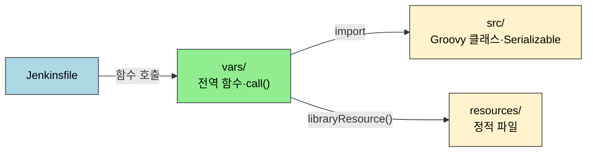
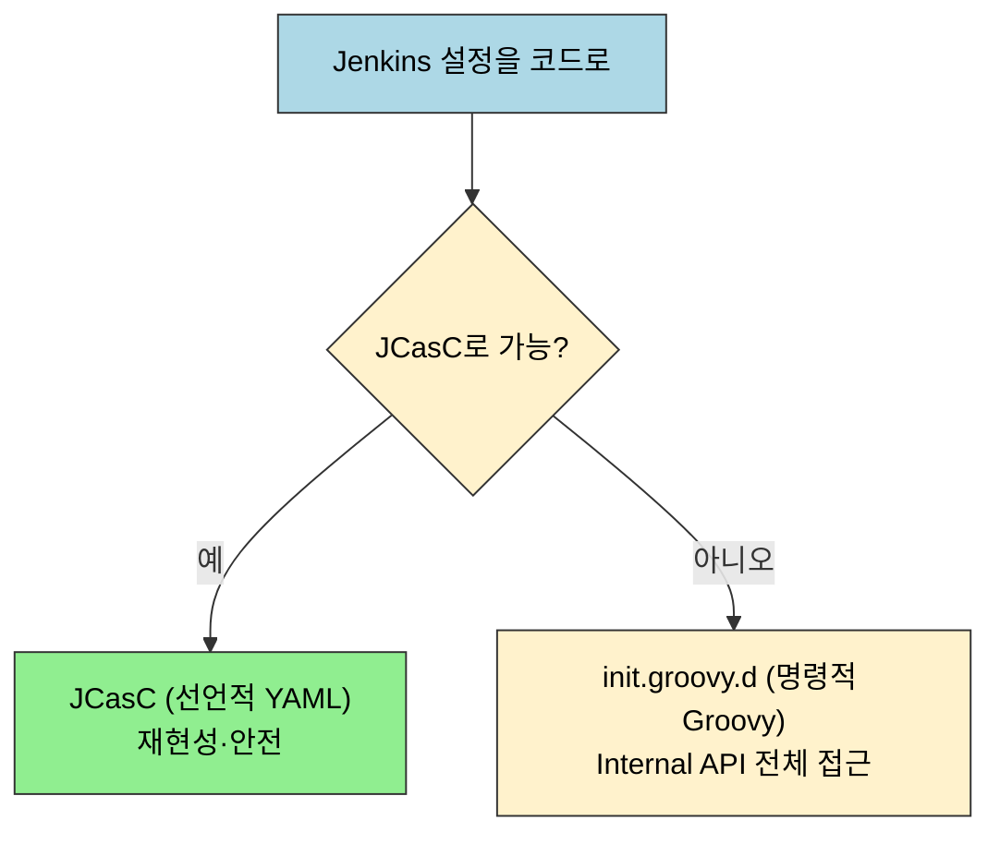

# 점검 — Shared Library와 Groovy 핵심 질문

---

> 이 점검을 마치면 다음을 스스로 설명할 수 있습니다. `vars/`와 `src/`의 경계를 구분하고, `@Library` 버전 고정의 효과를 예측하며, `call()` 진입점의 디스패치를 설명하고, CPS와 `@NonCPS`의 차이로 직렬화 실패를 디버깅하며, Implicit/Explicit 로딩과 JCasC/`init.groovy.d`를 상황별로 선택합니다.
> 이 점검 문서는 02장(커스텀·Hook)을 다 읽은 뒤 스스로를 시험하기 위한 자가 점검입니다. 먼저 면접 질문만 보고 답을 떠올린 뒤, 정답 절에서 같은 번호로 대조하세요.
> 다루는 문서: 02-01.공유 라이브러리, 02-01a.공유 라이브러리 실전 패턴, 02-02.Jenkins 커스텀이란?, 02-03.groovy 커스터마이징 한계, 02-04.Groovy 기본 문법, 02-05.전역 파이프라인 Hook, 02-05a.RunListener와 FlowExecutionListener

## 사전 지식

`02-01`·`02-01a`(Shared Library), `02-03`(CPS 한계), `02-04`(Groovy 문법)을 먼저 읽었다고 가정합니다. 막히는 질문이 있으면 위 다루는 문서의 해당 절로 돌아가 확인합니다.

핵심 두 축인 Shared Library 디렉토리 역할과 코드 기반 설정(JCasC vs init.groovy.d)을 먼저 그림으로 잡습니다.

## 면접 질문

> 답을 떠올린 뒤 §정답 절에서 같은 번호로 대조하세요. 각 질문 뒤의 *심화*까지 답할 수 있으면 충분합니다.

1. `vars/`와 `src/`의 차이는 무엇이며, 어떤 코드를 어디에 넣습니까? *(심화: `src/` 클래스가 `Serializable`을 구현하지 않으면 어떤 에러가 발생합니까?)*
2. `@Library` 버전 고정이 왜 중요하며, 고정하지 않으면 어떤 일이 발생합니까? *(심화: 버전 고정 후 보안 패치가 나왔을 때 전체 Pipeline을 일괄 업데이트하는 전략은?)*
3. Shared Library의 `call()` 메서드는 어떤 역할을 합니까? *(심화: `call()`을 오버로딩해 인자 없는 호출과 Map 호출을 동시에 지원하려면?)*
4. CPS 변환과 Shared Library의 호환성 문제는 무엇이며, `@NonCPS`는 언제 사용합니까? *(심화: `@NonCPS`가 반환한 값을 CPS 메서드에서 받아 쓸 때 주의점은?)*
5. Implicit Loading과 Explicit Loading은 어떤 상황에 어느 것을 선택합니까? *(심화: Implicit 라이브러리가 특정 Pipeline에서 충돌할 때 그 Pipeline만 제외하는 방법은?)*
6. `init.groovy.d`와 JCasC의 차이는 무엇이며, 선택 기준은? *(심화: `init.groovy.d` 스크립트가 재시작마다 실행될 때 멱등성을 보장하는 방법은?)*
7. Script Console의 보안 위험은 무엇이고, 어떻게 제한해야 합니까? *(심화: Groovy 커스터마이징의 대표 안티패턴은?)*

## 정답

> 위 질문을 스스로 설명해 본 뒤에 펼치세요.

### 정답 1 — vars/ vs src/

| 디렉토리 | 역할 | 특징 |
|----------|------|------|
| `vars/` | Pipeline에서 함수처럼 직접 호출되는 전역 변수 | 파일 basename이 전역 변수 이름(camelCase), 각 `.groovy`의 `call()`이 step처럼 호출됨. Pipeline DSL(`sh`, `stage`, `docker`) 자유롭게 사용 가능 |
| `src/` | 표준 Java 소스 디렉토리 | classpath에 추가됨. `org/foo/Bar.groovy` → `org.foo.Bar` 패키지 규약. Pipeline DSL 직접 접근 불가, `this`를 넘겨받아야 함. `Serializable` 구현 필요 |
| `resources/` | 비-Groovy 정적 파일 | `libraryResource` step으로 접근 |

(출처: jenkins.io/doc/book/pipeline/shared-libraries — `vars/`는 파일 basename=전역 변수 이름, `src/`는 classpath에 추가되는 표준 Java 소스 디렉토리, `resources/`는 `libraryResource` step으로 읽는 비-Groovy 파일)

실용 가이드:

- `vars/`: Stage 정의, sh 호출, 알림 같은 Pipeline 흐름
- `src/`: 설정 객체, 조건 판단, 문자열 변환 같은 순수 비즈니스 로직. Jenkins 없이도 단위 테스트가 가능합니다.

*심화*: `src/` 클래스가 `Serializable`을 구현하지 않으면, CPS 변환이 실행 중간 상태를 직렬화하려는 순간 `NotSerializableException`이 발생합니다.

### 정답 2 — @Library 버전 고정

버전을 고정하지 않으면 전역 설정의 기본 브랜치 최신 코드를 항상 사용합니다.

- **위험**: 라이브러리에 breaking change가 머지되는 순간, 이 라이브러리를 사용하는 모든 Pipeline이 동시에 깨집니다.
- **해결**: `@Library('my-lib@v1.2.0')`처럼 태그를 고정하면 라이브러리가 아무리 변경되어도 해당 Pipeline은 동일한 코드를 사용합니다.

| 환경 | 권장 방식 |
|------|----------|
| 프로덕션 | 태그 또는 커밋 해시로 고정 |
| 스테이징/개발 | `@main`으로 최신 변경을 빠르게 검증 |

`@Library('name@version')`의 version에는 branch, tag, commit hash를 모두 쓸 수 있고, 복수 라이브러리는 `@Library(['a', 'b@tag'])`로 함께 선언합니다. (출처: jenkins.io/doc/book/pipeline/shared-libraries)

*심화*: 보안 패치 일괄 적용은, 패치된 새 태그를 만든 뒤 각 Pipeline이 참조하는 버전을 그 태그로 올리는 방식으로 합니다. 와일드카드(`@v1`) 대신 명시 태그를 쓰면 의도치 않은 동시 변경을 막으면서도, 태그 갱신은 일괄 스크립트로 처리할 수 있습니다.

### 정답 3 — call() 메서드

`vars/buildDocker.groovy`에서 `call()` 메서드는 Jenkinsfile에서 `buildDocker()`로 직접 호출될 때 실행되는 진입점입니다.

- **Map config 패턴** 권장: `buildDocker(imageName: 'app', tag: 'v1')` 형태로 이름 기반 파라미터 호출
  - 가독성이 높고, 새 파라미터를 추가해도 기존 호출부가 깨지지 않습니다.
  - 필수 파라미터 즉시 검증: `config.imageName ?: error("imageName is required")`

*심화*: 인자 없는 호출과 Map 호출을 동시에 지원하려면 `call()`을 오버로딩합니다. `def call()`과 `def call(Map config)`을 각각 정의하면 Groovy가 인자 형태에 맞는 메서드를 디스패치합니다.

### 정답 4 — CPS와 @NonCPS

CPS 변환은 직렬화할 수 없는 객체를 다룰 때 문제를 일으킵니다:

- 대표 케이스: `java.util.regex.Matcher`, 클로저 내 람다, `Closure` 직접 저장
- 증상: `NotSerializableException`

| 구분 | CPS 메서드 | `@NonCPS` 메서드 |
|------|-----------|----------------|
| 직렬화 | 가능 | 불가 |
| Pipeline DSL(`sh`, `stage`) 호출 | 가능 | 불가 |
| 직렬화 불가 객체 사용 | 불가 | 가능 |

- 직렬화 불가능한 객체를 다루는 헬퍼 로직은 `@NonCPS`로 분리하고, Pipeline step 호출은 CPS 메서드에서 수행하는 패턴이 일반적입니다.

CPS 변환의 목적은 Pipeline 실행 상태를 `program.dat`에 직렬화해 재기동에 대비하는 것이고, `@NonCPS`는 네이티브 Groovy 실행으로 성능을 얻는 대신 그 내부에서 `node`·`sh` 같은 Pipeline step을 호출할 수 없습니다(호출 시 "expected to call WorkflowScript.X" 경고). 생성자도 CPS 변환 대상이 아닙니다. (출처: jenkins.io/doc/book/pipeline/cps-method-mismatches)

*심화*: `@NonCPS` 메서드는 직렬화 가능한 값(문자열·숫자·기본 컬렉션)만 반환해야 합니다. `Matcher` 같은 직렬화 불가 객체를 반환해 CPS 메서드 변수에 담으면, 그 변수가 살아 있는 동안 다시 `NotSerializableException`이 날 수 있습니다.

### 정답 5 — Implicit vs Explicit Loading

| 방식 | 동작 | 특징 |
|------|------|------|
| Explicit | Jenkinsfile에 `@Library('my-lib@v1.2.0') _` 명시 | 추적성 높음. 버전 고정을 Jenkinsfile에서 직접 제어 |
| Implicit | Jenkins 관리 화면에서 "Load implicitly" 활성화 | 모든 Pipeline에 자동 로딩. Jenkinsfile만 봐서는 어떤 라이브러리가 로딩되는지 알 수 없어 디버깅 어려움 |

- 권장 조합(계층화): 보안 스캔, 표준 알림처럼 모든 빌드에 강제해야 하는 거버넌스 라이브러리는 Implicit, 팀별 도메인 라이브러리는 Explicit으로 선언합니다.

*심화*: Implicit 라이브러리가 특정 Pipeline에서 충돌하면, 전역 설정에서 그 라이브러리의 "Load implicitly"를 끄고 필요한 Pipeline만 Explicit으로 선언하거나, 충돌 Pipeline에서 해당 버전을 override하는 방식으로 분리합니다.

### 정답 6 — init.groovy.d vs JCasC

| 구분 | JCasC | `init.groovy.d` |
|------|-------|----------------|
| 패러다임 | 선언적 YAML | 명령적 Groovy 코드 |
| 재현성 | 동일 YAML → 동일 결과 보장 | 코드 실행 순서에 따라 결과 달라질 수 있음 |
| Git 추적 | YAML diff 명확 | Groovy 코드 diff |
| 접근 가능 범위 | JCasC가 지원하는 설정만 | Jenkins 전체 Internal API |
| 업그레이드 위험 | 낮음 | Internal API 변경으로 스크립트가 깨질 수 있음 |

- 선택 원칙: "JCasC로 할 수 있으면 JCasC, 안 되면 `init.groovy.d`"

*심화*: `init.groovy.d`는 재시작마다 실행되므로 멱등성이 중요합니다. "이미 존재하면 건너뛴다"는 조건 검사(예: 사용자·라이브러리가 이미 등록됐는지 확인 후 생성)를 넣어, 반복 실행해도 같은 상태로 수렴하게 만듭니다.

### 정답 7 — Script Console 보안

Script Console은 Sandbox 없이 Jenkins 프로세스 내부에서 Groovy 코드를 직접 실행합니다.

가능한 위험 행위:

- **크레덴셜 평문 노출**: Jenkins는 크레덴셜을 암호화 저장하지만 복호화 키가 프로세스 메모리에 있어 Script Console에서 모든 시크릿을 읽을 수 있습니다.
- 모든 Job 삭제, 보안 설정 변경, 파일 시스템 접근

이것은 설계 결함이 아닙니다. Jenkins가 빌드 중 크레덴셜을 사용해야 하므로 프로세스가 복호화 능력을 가져야 하고, 그 능력이 Script Console을 통해 노출되는 구조적 특성입니다.

완화 방법:

- Matrix-based Security에서 "Administer" 권한과 "Run Scripts" 권한을 분리
- Script Console 접근을 극소수 관리자에게만 부여
- 감사 로그 활성화

*심화*: Groovy 커스터마이징의 대표 안티패턴은, JCasC로 충분한 설정을 굳이 `init.groovy.d`나 Script Console의 명령적 스크립트로 처리해 재현성·추적성을 떨어뜨리는 것입니다. 선언적으로 풀 수 있으면 선언적으로 푸는 것이 원칙입니다.

## 관련 문서

이 점검에서 막힌 문항이 있으면 해당 본문 절로 돌아가 확인합니다. 02장(커스텀·Hook)의 본문 편들이 각 질문의 SSOT입니다.

- [02-01. 공유 라이브러리](02-01.%EA%B3%B5%EC%9C%A0%20%EB%9D%BC%EC%9D%B4%EB%B8%8C%EB%9F%AC%EB%A6%AC.md) § "디렉토리 구조" — 1·2·3·5번 문항(vars/src/resources, 버전 고정, call(), 로딩)의 원본 설명
- [02-01a. 공유 라이브러리 실전 패턴](02-01a.%EA%B3%B5%EC%9C%A0%20%EB%9D%BC%EC%9D%B4%EB%B8%8C%EB%9F%AC%EB%A6%AC%20%EC%8B%A4%EC%A0%84%20%ED%8C%A8%ED%84%B4.md) § "vars/src 패턴" — call() 오버로딩·테스트·버전 관리 심화
- [02-03. groovy 커스텀터마이징 한계](02-03.groovy%20%EC%BB%A4%EC%8A%A4%ED%85%80%ED%84%B0%EB%A7%88%EC%9D%B4%EC%A7%95%20%ED%95%9C%EA%B3%84.md) § "CPS와 @NonCPS" — 4번 문항(직렬화·CPS 변환)의 원본 설명
- [02-05. 전역 파이프라인 Hook](02-05.%EC%A0%84%EC%97%AD%20%ED%8C%8C%EC%9D%B4%ED%94%84%EB%9D%BC%EC%9D%B8%20Hook.md) § "init.groovy.d vs JCasC" — 6·7번 문항(코드 기반 설정·Script Console 보안)의 원본 설명
- [02-05a. RunListener와 FlowExecutionListener](02-05a.RunListener%EC%99%80%20FlowExecutionListener.md) § "리스너 차이" — Hook 확장점의 빌드 수명 vs flow 실행 수명 구분
