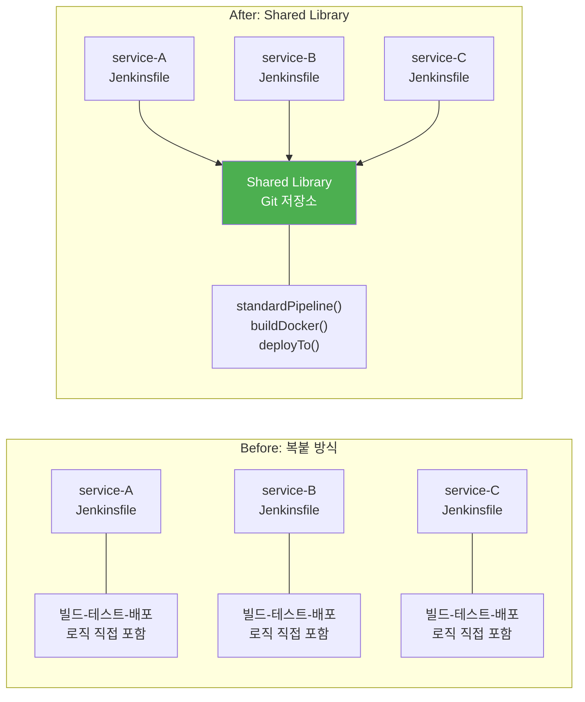
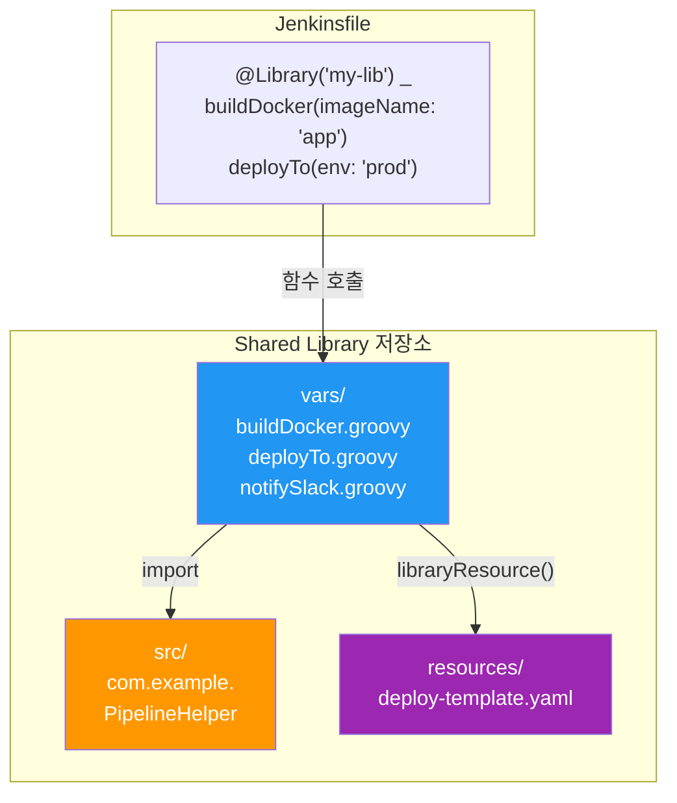
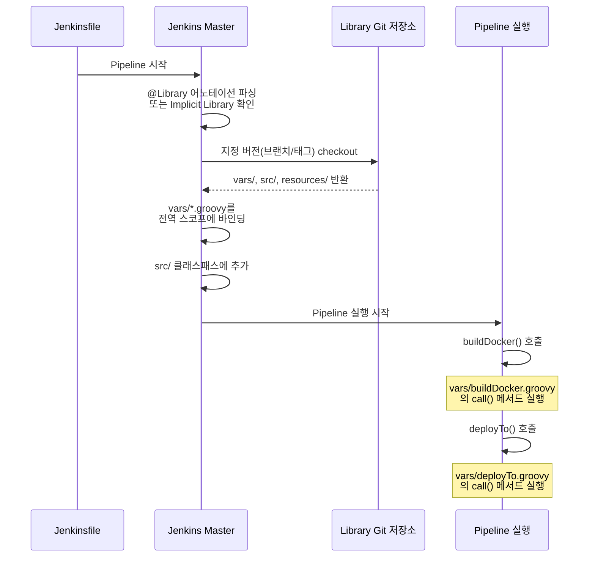

# Shared Libraries

---

> - 100개 마이크로서비스의 Jenkinsfile 중복을 어떻게 제거하는가?
> - Shared Library의 vars/, src/, resources/ 디렉토리는 각각 어떤 역할을 하는가?
> - Pipeline에서 Shared Library를 로딩하는 4가지 방식과 각각의 장단점은?

## 1. 왜 Shared Library가 필요한가

> **한 문장 정의**: Jenkins Shared Library는 **여러 Pipeline에서 공유하는 Groovy 코드를 별도 Git 저장소로 분리**하여, CI/CD 로직의 중복을 제거하고 조직 표준을 강제하는 메커니즘이다.

### 문제: Jenkinsfile 복붙의 악순환

마이크로서비스 아키텍처를 채택한 조직에서는 수십~수백 개의 서비스가 존재한다.

- 각 서비스의 빌드-테스트-배포 파이프라인은 대부분 동일한 패턴을 따른다.
- 문제는 이 동일한 패턴이 **각 저장소의 Jenkinsfile에 복사-붙여넣기**로 존재한다는 점이다.
- 보안 스캔 도구를 Trivy에서 Grype로 교체하려면, **100개 저장소의 Jenkinsfile을 모두 수정**해야 한다.
- 하나라도 누락하면 일부 서비스만 새 도구를 사용하는 불일치가 발생한다.

### 복붙 방식의 구체적 문제

| 문제                | 설명                                                         | 실제 영향                                          |
| ------------------- | ------------------------------------------------------------ | -------------------------------------------------- |
| **변경 증폭**       | 하나의 로직 변경이 N번의 수정을 요구                         | 100개 서비스 = 100개 PR                            |
| **드리프트(Drift)** | 시간이 지나면 서비스마다 Jenkinsfile이 미묘하게 달라짐       | "왜 service-B만 보안 스캔이 없지?"                 |
| **거버넌스 부재**   | CI/CD 표준을 강제할 수 없음                                  | 신규 서비스가 보안 스캔 단계를 빼먹어도 알 수 없음 |
| **온보딩 비용**     | 새 개발자가 "올바른" Jenkinsfile을 어디서 복사해야 하는지 모름 | 오래된 템플릿을 복사하여 안티패턴 전파             |

### 해결: DRY 원칙과 중앙화

Shared Library는 이 문제를 **공통 로직을 별도 Git 저장소로 추출**하여 해결한다. 각 Jenkinsfile은 라이브러리의 함수를 호출하기만 하므로, 변경이 필요하면 **라이브러리 저장소 한 곳만 수정**하면 된다.

```groovy
// service-A/Jenkinsfile — Shared Library 적용 후
@Library('my-pipeline-lib') _

standardPipeline(
    serviceName: 'service-a',
    deployTarget: 'production'
)
```

- 100줄이던 Jenkinsfile이 5줄로 줄었다.
- 보안 스캔 도구를 교체하려면 라이브러리의 `standardPipeline.groovy` 한 파일만 수정하면 100개 서비스에 동시에 반영된다.

### 거버넌스 관점

```groovy
// service-A/Jenkinsfile — 100개 서비스 모두 거의 동일
pipeline {
    agent any
    stages {
        stage('Build') {
            steps { sh 'docker build -t service-a .' }
        }
        stage('Test') {
            steps { sh './gradlew test' }
        }
        stage('Security Scan') {
            steps { sh 'trivy image service-a' }
        }
        stage('Deploy') {
            steps { sh 'kubectl apply -f k8s/' }
        }
    }
}
```

- Shared Library는 단순한 코드 재사용을 넘어 **조직의 CI/CD 정책을 코드로 강제**하는 도구다.
- 라이브러리에 보안 스캔 단계를 포함시키면, 이 라이브러리를 사용하는 모든 Pipeline이 자동으로 보안 스캔을 수행한다.
- 개별 팀이 "빌드 속도를 위해 보안 스캔을 생략"하는 것을 구조적으로 방지할 수 있기 때문에, 플랫폼 엔지니어링 팀이 조직 전체의 CI/CD 품질을 관리하는 핵심 수단이 된다.



- 위 다이어그램은 Shared Library 도입 전후를 비교한다.
- **Before**에서는 각 서비스가 동일한 로직을 각자 갖고 있어서 변경 시 N번 수정해야 하지만, **After**에서는 공통 로직이 라이브러리 한 곳에 집중되어 변경이 1번만 필요하다.


## 2. Jenkins 디렉토리 구조와 Shared Library

> Shared Library를 이해하려면 Jenkins 서버 자체의 디렉토리 구조를 먼저 알아야 한다. 라이브러리가 어디에 등록되고, 어디에 캐싱되며, Pipeline이 이를 어떻게 찾는지가 모두 `JENKINS_HOME` 구조에 달려 있기 때문이다.

Jenkins의 모든 설정, 빌드 기록, 플러그인, 시크릿은 `JENKINS_HOME`이라는 단일 디렉토리 아래에 저장된다. 리눅스 패키지 설치 기준 기본 경로는 `/var/lib/jenkins/`이고, Docker 공식 이미지에서는 `/var/jenkins_home/`이다.

```
$JENKINS_HOME/                          # /var/lib/jenkins/ 또는 /var/jenkins_home/
├── config.xml                          # ★ 전역 설정 — Global Pipeline Libraries 등록 정보 포함
├── init.groovy.d/                      # ★ 기동 시 자동 실행 Groovy 스크립트
│   ├── 01-security.groovy
│   ├── 02-shared-library.groovy
│   └── 03-credentials.groovy
├── jobs/                               # ★ Job 정의 + 빌드 히스토리
│   ├── my-service/
│   │   ├── config.xml                  #   Job 설정 (Jenkinsfile 경로, 파라미터 등)
│   │   └── builds/
│   │       ├── 1/                      #   빌드 번호별 기록
│   │       │   ├── build.xml
│   │       │   ├── log                 #   콘솔 출력
│   │       │   └── changelog.xml
│   │       └── lastSuccessfulBuild -> 1
│   └── my-folder/                      #   Folder Plugin 사용 시
│       ├── config.xml                  #   폴더 레벨 Library 설정 가능
│       └── jobs/                       #   하위 Job들이 중첩
│           └── nested-service/
│               └── config.xml
├── workflow-libs/                       # ★ Shared Library 캐시 (Pipeline 실행 시 Git clone)
│   └── {library-name}_{hash}/
│       ├── vars/
│       ├── src/
│       └── resources/
├── plugins/                            # 설치된 플러그인 (.jpi/.hpi)
│   ├── workflow-cps.jpi                #   Pipeline 엔진
│   ├── pipeline-groovy-lib.jpi         #   Shared Library 지원
│   └── git.jpi                         #   Git SCM
├── nodes/                              # 에이전트(슬레이브) 노드 설정
│   └── build-agent-01/
│       └── config.xml
├── users/                              # 사용자별 설정
├── secrets/                            # 암호화된 시크릿, 마스터 키
│   ├── master.key
│   └── hudson.util.Secret
├── credentials.xml                     # 크리덴셜 저장소
└── logs/                               # 시스템 로그
```

`★` 표시한 네 디렉토리가 Shared Library와 직접 관련된다.

`config.xml`에 라이브러리가 등록되고, `init.groovy.d/`에서 코드로 등록할 수 있으며, Pipeline이 실행되면 `workflow-libs/`에 캐싱되고, `jobs/`의 각 Jenkinsfile이 이를 호출한다.

### 2-2. init.groovy.d/ — 기동 시 자동 실행 스크립트

> `$JENKINS_HOME/init.groovy.d/` 디렉토리에 `.groovy` 파일을 넣으면, Jenkins가 기동(startup)될 때 **파일명 알파벳 순**으로 자동 실행한다. 파일명 앞에 숫자를 붙여 실행 순서를 제어하는 것이 관례다.

이 메커니즘은 Jenkins 관리 화면(UI)을 거치지 않고 **코드로 Jenkins를 설정**하는 수단이다. Docker 이미지를 빌드할 때 init.groovy.d에 스크립트를 넣어두면, 컨테이너가 올라올 때 자동으로 설정이 완료된다. 수동으로 UI를 클릭할 필요가 없으므로 재현 가능한 환경 구성이 가능해진다.

주요 용도는 다음과 같다.

- 보안 설정 — CSRF 보호 활성화, 에이전트-마스터 접근 제어
- 사용자/크리덴셜 생성 — 초기 admin 계정, Git/Docker 크리덴셜
- Shared Library 등록 — UI 대신 코드로 라이브러리를 전역 등록
- 플러그인 설정 — 설치된 플러그인의 초기 설정값 지정

다음은 init.groovy.d에서 Shared Library를 전역 등록하는 예제다.

```groovy
// $JENKINS_HOME/init.groovy.d/02-shared-library.groovy
import jenkins.plugins.git.GitSCMSource
import org.jenkinsci.plugins.workflow.libs.GlobalLibraries
import org.jenkinsci.plugins.workflow.libs.LibraryConfiguration
import org.jenkinsci.plugins.workflow.libs.SCMSourceRetriever

def libraryConfig = new LibraryConfiguration(
    'my-pipeline-lib',                                    // 라이브러리 이름
    new SCMSourceRetriever(
        new GitSCMSource(
            null,
            'https://gitlab.example.com/devops/pipeline-lib.git',
            'git-credential-id',
            '*',
            '',
            false
        )
    )
)
libraryConfig.defaultVersion = 'main'
libraryConfig.implicit = true          // 모든 Pipeline에 자동 로딩
libraryConfig.allowVersionOverride = true

GlobalLibraries.get().libraries = [libraryConfig]
```

- 이 스크립트가 `init.groovy.d/`에 있으면, Jenkins가 기동될 때마다 `my-pipeline-lib`이 전역 라이브러리로 등록된다.
- UI에서 Manage Jenkins > System > Global Pipeline Libraries에 들어가 수동으로 설정하는 것과 동일한 결과다.

#### JCasC와의 비교

Jenkins Configuration as Code(JCasC) 플러그인도 같은 역할을 한다. 두 방식의 차이는 다음과 같다.

| 비교 항목 | init.groovy.d | JCasC (YAML) |
|-----------|---------------|--------------|
| **형식** | Groovy 코드 | YAML 선언 |
| **유연성** | Jenkins API 전체 접근 가능 | 플러그인이 지원하는 범위만 |
| **학습 곡선** | Jenkins 내부 API 이해 필요 | YAML 문법만 알면 됨 |
| **디버깅** | 스택트레이스로 추적 | 로드 실패 시 원인 파악 어려움 |
| **권장 상황** | 복잡한 조건부 설정, 레거시 환경 | 신규 환경, 선언적 관리 선호 시 |

최신 Jenkins 환경에서는 JCasC가 권장되지만, init.groovy.d는 JCasC가 지원하지 않는 플러그인 설정이나 복잡한 조건 분기가 필요한 경우에 여전히 유용하다.

### 2-3. workflow-libs/ — Shared Library 캐시

> Pipeline이 실행되면 Jenkins는 라이브러리 Git 저장소를 `$JENKINS_HOME/workflow-libs/`에 clone한다. 이 디렉토리는 라이브러리의 **로컬 캐시** 역할을 한다.

캐시 동작 방식은 다음과 같다.

1. Pipeline이 시작되면 Jenkins가 `@Library` 어노테이션 또는 전역 설정에서 라이브러리 정보를 읽는다.
2. 지정된 Git 저장소에서 해당 버전(브랜치/태그/커밋)을 checkout한 뒤, `workflow-libs/` 아래에 저장한다.
3. 이후 vars/ 파일들을 전역 스코프에 바인딩하고, src/를 클래스패스에 추가한다.

```
$JENKINS_HOME/workflow-libs/
├── my-pipeline-lib_abc123/       # {라이브러리명}_{해시}
│   ├── vars/
│   │   ├── buildDocker.groovy
│   │   └── standardPipeline.groovy
│   ├── src/
│   │   └── com/example/...
│   └── resources/
│       └── deploy-template.yaml
└── another-lib_def456/
    └── ...
```

- 캐시가 오래되었거나 문제가 생기면 이 디렉토리를 삭제해도 된다. 다음 Pipeline 실행 시 Git에서 다시 clone한다.

### 2-4. jobs/ 디렉토리와 Folder Plugin

> `$JENKINS_HOME/jobs/`는 모든 Job의 설정과 빌드 기록을 저장한다. 각 Job은 `jobs/{job-name}/` 디렉토리를 갖고, 그 안의 `config.xml`에 Job 설정(Jenkinsfile 경로, SCM 정보, 파라미터 등)이 들어간다.

**Folder Plugin**을 사용하면 Job을 폴더 단위로 그룹화할 수 있다. 폴더도 `jobs/` 아래에 디렉토리로 존재하며, 폴더의 `config.xml` 안에 **폴더 레벨 Shared Library**를 설정할 수 있다. 이 설정은 해당 폴더와 하위 Job에만 적용된다.

```
$JENKINS_HOME/jobs/
├── team-alpha/                      # Folder Plugin으로 만든 폴더
│   ├── config.xml                   # ← 폴더 레벨 Library 설정 가능
│   └── jobs/
│       ├── service-a/
│       │   ├── config.xml
│       │   └── builds/...
│       └── service-b/
│           ├── config.xml
│           └── builds/...
└── standalone-job/
    ├── config.xml
    └── builds/...
```

- 이 구조를 활용하면 팀별로 다른 Shared Library 버전을 사용하거나, 팀 전용 라이브러리를 별도로 등록하는 것이 가능하다.
- 전역 라이브러리는 모든 Pipeline에 적용되고, 폴더 라이브러리는 해당 폴더 범위에만 적용되므로 **전역 표준 + 팀별 확장**이라는 2계층 구조를 만들 수 있다.

### 2-5. Shared Library 저장소 구조

Shared Library 자체는 특정 디렉토리 구조를 따르는 **별도의 Git 저장소**다. 이 구조를 지켜야 Jenkins가 라이브러리를 올바르게 로딩하고, Pipeline에서 호출할 수 있다.

```
my-pipeline-lib/          # Git 저장소 루트
├── vars/                  # 전역 변수/함수 — Pipeline에서 직접 호출
│   ├── buildDocker.groovy       # buildDocker() 로 호출
│   ├── deployTo.groovy          # deployTo() 로 호출
│   ├── notifySlack.groovy       # notifySlack() 로 호출
│   └── standardPipeline.groovy  # standardPipeline() 로 호출
├── src/                   # Groovy 클래스 — import로 사용
│   └── com/
│       └── example/
│           ├── PipelineHelper.groovy
│           └── DockerConfig.groovy
└── resources/             # 설정 파일, 템플릿
    ├── deploy-template.yaml
    └── sonar-config.properties
```

#### 디렉토리별 역할

| 디렉토리       | 역할                                         | 접근 방식                                                  | 사용 시점                                                    |
| -------------- | -------------------------------------------- | ---------------------------------------------------------- | ------------------------------------------------------------ |
| **vars/**      | Pipeline에서 **함수처럼** 호출되는 전역 변수 | 파일명이 곧 함수명: `buildDocker.groovy` → `buildDocker()` | 단순한 빌드 단계, 알림, 배포 등 **Pipeline DSL 수준의 동작** |
| **src/**       | 일반 Groovy 클래스 (OOP 패턴)                | `import com.example.PipelineHelper`                        | 복잡한 비즈니스 로직, 설정 객체, 유틸리티 클래스             |
| **resources/** | 정적 파일 (YAML, JSON, 템플릿 등)            | `libraryResource('deploy-template.yaml')`                  | 배포 매니페스트 템플릿, 설정 파일                            |

#### vars/ 디렉토리 상세

vars/의 핵심 규칙은 **파일명 = 함수명**이라는 점이다.

- `buildDocker.groovy` 파일을 만들면 Pipeline에서 `buildDocker()`로 호출할 수 있다.
- 이것이 가능한 이유는 Jenkins가 vars/ 디렉토리의 각 `.groovy` 파일을 **전역 스코프에 바인딩**하기 때문이다.

각 파일은 `call()` 메서드를 정의해야 한다.

- Pipeline에서 `buildDocker(imageName: 'my-app')`을 호출하면 실제로는 `buildDocker.groovy`의 `call(imageName: 'my-app')`이 실행된다.

#### src/ 디렉토리 상세

src/는 일반 Groovy 소스 코드를 담는다.

- Java와 동일한 패키지 구조를 따르며, 클래스를 정의하고 import하여 사용한다.
- `vars/`의 함수들이 복잡해질 때 로직을 분리하는 용도로 사용한다.
- 단, src/ 클래스에서는 Pipeline DSL(`sh`, `stage` 등)을 직접 사용할 수 없다. Pipeline 컨텍스트가 필요하면 vars/에서 컨텍스트를 전달받아야 한다.

#### resources/ 디렉토리 상세

resources/는 `libraryResource()` 함수로 로드할 수 있는 정적 파일을 담는다. 배포 매니페스트 템플릿, SonarQube 설정 파일 등을 여기에 두면 라이브러리와 함께 버전 관리된다.

```groovy
// vars/deployTo.groovy 에서 resources/ 파일 로드
def template = libraryResource('deploy-template.yaml')
def rendered = template.replace('{{SERVICE_NAME}}', config.serviceName)
writeFile file: 'deploy.yaml', text: rendered
```



- 위 다이어그램은 Jenkinsfile에서 Shared Library의 각 디렉토리가 어떻게 연결되는지를 보여준다.
- Pipeline은 **vars/ 함수를 직접 호출**하고, vars/ 함수는 필요에 따라 **src/ 클래스를 import**하거나 **resources/ 파일을 로드**한다.
- Pipeline이 src/나 resources/에 직접 접근하는 것이 아니라, 항상 vars/를 통해 간접적으로 사용한다는 점이 핵심이다.


## 3. 로딩 메커니즘

> Shared Library를 Pipeline에서 사용하려면 먼저 **로딩**해야 한다. Jenkins는 4가지 로딩 방식을 제공하며, 각각의 적합한 상황이 다르다.

### 3-1. Explicit Loading (@Library 어노테이션)

```groovy
@Library('my-pipeline-lib') _

// 또는
@Library('my-pipeline-lib@main') _

pipeline {
    agent any
    stages {
        stage('Build') {
            steps { buildDocker(imageName: 'my-app') }
        }
    }
}
```

- `@Library` 어노테이션을 Jenkinsfile 최상단에 선언한다.
- 뒤의 `_`(언더스코어)는 Groovy 문법상 어노테이션이 적용될 대상이 필요하기 때문에 사용하는 더미 심볼이다.
- 어떤 라이브러리를 사용하는지 Jenkinsfile에 명시적으로 드러나므로 가독성이 좋다.

### 3-2. Implicit Loading (전역 설정)

Jenkins 관리 화면(Manage Jenkins > System > Global Pipeline Libraries)에서 라이브러리를 등록하고 "Load implicitly" 옵션을 활성화하면, **모든 Pipeline에 자동으로 로딩**된다. Jenkinsfile에 `@Library` 선언 없이도 vars/ 함수를 바로 사용할 수 있다.

- 이 방식은 조직 전체에 CI/CD 표준 라이브러리를 강제할 때 유용하다.
- 다만 Jenkinsfile만 보면 어떤 라이브러리가 로딩되는지 알 수 없어서 **디버깅이 어려워질 수 있다**.

### 3-3. Version Pinning (버전 고정)

```groovy
// 특정 브랜치
@Library('my-pipeline-lib@main') _

// 특정 태그
@Library('my-pipeline-lib@v1.2.0') _

// 특정 커밋
@Library('my-pipeline-lib@a1b2c3d') _
```

- `@` 뒤에 Git 브랜치, 태그, 또는 커밋 해시를 지정하여 **특정 버전의 라이브러리를 고정**한다.
- 버전을 고정하지 않으면 Jenkins 전역 설정에서 지정한 기본 브랜치(보통 main)를 사용한다.

버전 고정이 중요한 이유는, 라이브러리에 breaking change가 발생했을 때 **모든 Pipeline이 동시에 깨지는 것을 방지**하기 때문이다. 프로덕션 Pipeline은 안정적인 태그 버전을 사용하고, 개발 Pipeline은 최신 브랜치를 사용하는 식으로 분리할 수 있다.

### 3-4. Dynamic Loading (런타임 로딩)

```groovy
// Pipeline 실행 중에 동적으로 라이브러리 로딩
def lib = library('my-pipeline-lib@feature-branch')

pipeline {
    agent any
    stages {
        stage('Build') {
            steps {
                script {
                    lib.com.example.PipelineHelper.build()
                }
            }
        }
    }
}
```

- `library()` 함수를 사용하면 Pipeline 실행 중에 동적으로 라이브러리를 로딩할 수 있다.
- 조건에 따라 다른 버전의 라이브러리를 로딩하거나, 특정 단계에서만 라이브러리가 필요한 경우에 사용한다. 단, vars/ 함수는 전역 스코프에 바인딩되지 않으므로 접근 방식이 달라진다는 점에 주의해야 한다.

### 로딩 방식 비교

| 방식                | 선언 위치              | 적합한 상황               | 주의사항                                   |
| ------------------- | ---------------------- | ------------------------- | ------------------------------------------ |
| **Explicit**        | Jenkinsfile            | 대부분의 경우 (권장)      | 명시적이라 추적 용이                       |
| **Implicit**        | Jenkins 전역 설정      | 조직 표준 라이브러리 강제 | Jenkinsfile에 안 보여서 디버깅 어려움      |
| **Version Pinning** | Jenkinsfile            | 프로덕션 안정성 확보      | 라이브러리 업데이트를 수동으로 반영해야 함 |
| **Dynamic**         | Pipeline 스크립트 내부 | 조건부 로딩, 실험         | vars/ 전역 바인딩 안 됨                    |



> 위 시퀀스 다이어그램은 Pipeline이 시작되었을 때 Shared Library가 로딩되는 과정을 보여준다. Jenkins Master가 라이브러리 Git 저장소에서 코드를 가져온 뒤, vars/ 파일들을 전역 스코프에 바인딩하여 Pipeline에서 함수처럼 호출할 수 있게 한다. 이 과정은 Pipeline의 실제 단계(stage)가 실행되기 **전에** 완료된다.

> 고급 패턴, 테스트, 버전 관리 전략은 **08-01a.공유 라이브러리 실전 패턴.md** 에서 이어진다.
