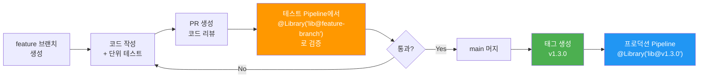

# Shared Libraries — 실전 패턴

---

> 이 문서는 08-01의 후속이다.

## 4. 실전 패턴: vars/ 함수 구현

### 4-1. 기본 패턴: call() 메서드와 Map config

```groovy
// vars/buildDocker.groovy
def call(Map config = [:]) {
    def imageName = config.imageName ?: error("imageName is required")
    def tag = config.tag ?: env.BUILD_NUMBER
    def dockerfile = config.dockerfile ?: 'Dockerfile'

    stage('Docker Build') {
        sh "docker build -t ${imageName}:${tag} -f ${dockerfile} ."
    }
    stage('Docker Push') {
        docker.withRegistry('https://registry.example.com', 'registry-cred') {
            sh "docker push ${imageName}:${tag}"
            sh "docker push ${imageName}:latest"
        }
    }

    return "${imageName}:${tag}"
}
```

**왜 Map config 패턴을 사용하는가?** 일반적인 위치 기반 파라미터(`def call(String imageName, String tag)`)는 파라미터가 늘어날수록 호출부가 읽기 어려워진다. Map을 사용하면 `buildDocker(imageName: 'my-app', tag: 'v1.0')`처럼 **이름 기반으로 호출**할 수 있어 가독성이 높아진다. 또한 기본값을 `?:` 연산자로 쉽게 지정할 수 있고, 새 파라미터를 추가해도 기존 호출부가 깨지지 않는다.

**필수 파라미터 검증**: `config.imageName ?: error("imageName is required")`는 imageName이 null이면 Pipeline을 즉시 실패시킨다. 파라미터 누락을 빌드 실행 초기에 잡아내어, 30분 뒤에 배포 단계에서 실패하는 것보다 빠른 피드백을 준다.

### 4-2. 표준 Pipeline 패턴

```groovy
// vars/standardPipeline.groovy
def call(Map config = [:]) {
    def serviceName = config.serviceName ?: error("serviceName is required")
    def deployTarget = config.deployTarget ?: 'staging'
    def skipTests = config.skipTests ?: false

    pipeline {
        agent any

        stages {
            stage('Checkout') {
                steps { checkout scm }
            }
            stage('Build') {
                steps { buildDocker(imageName: serviceName) }
            }
            stage('Test') {
                when { expression { !skipTests } }
                steps { sh './gradlew test' }
            }
            stage('Security Scan') {
                steps { sh "trivy image ${serviceName}:${env.BUILD_NUMBER}" }
            }
            stage('Deploy') {
                steps { deployTo(service: serviceName, env: deployTarget) }
            }
        }

        post {
            success { notifySlack(channel: '#deploys', status: 'SUCCESS') }
            failure { notifySlack(channel: '#deploys', status: 'FAILURE') }
        }
    }
}
```

이 패턴에서 `standardPipeline`은 **전체 Pipeline을 캡슐화**한다. 개별 서비스의 Jenkinsfile은 단 몇 줄만으로 조직의 전체 CI/CD 표준을 따르게 된다. 보안 스캔 단계가 라이브러리에 포함되어 있으므로, 개별 팀이 이 단계를 생략할 수 없다.

### 4-3. src/ 클래스 활용

```groovy
// src/com/example/DockerConfig.groovy
package com.example

class DockerConfig implements Serializable {
    String registry = 'registry.example.com'
    String credentialsId = 'registry-cred'

    String fullImageName(String name, String tag) {
        return "${registry}/${name}:${tag}"
    }

    boolean shouldPush(String branch) {
        return branch in ['main', 'release']
    }
}
```

```groovy
// vars/buildDocker.groovy 에서 src/ 클래스 사용
import com.example.DockerConfig

def call(Map config = [:]) {
    def dockerConfig = new DockerConfig()
    def imageName = config.imageName ?: error("imageName required")
    def tag = config.tag ?: env.BUILD_NUMBER
    def fullName = dockerConfig.fullImageName(imageName, tag)

    stage('Docker Build') {
        sh "docker build -t ${fullName} ."
    }

    if (dockerConfig.shouldPush(env.BRANCH_NAME)) {
        stage('Docker Push') {
            docker.withRegistry("https://${dockerConfig.registry}", dockerConfig.credentialsId) {
                sh "docker push ${fullName}"
            }
        }
    }
}
```

**왜 src/ 클래스를 분리하는가?** vars/ 함수가 복잡해지면 로직을 테스트하기 어려워진다. 순수 로직(이미지 이름 생성, 조건 판단 등)을 src/ 클래스로 분리하면 Jenkins 환경 없이도 **단위 테스트가 가능**하다. `Serializable`을 구현하는 이유는 Jenkins Pipeline이 실행 중간에 직렬화/역직렬화를 수행하기 때문이다(Pipeline CPS 변환).


## 5. 테스트 전략

> Shared Library는 조직 전체의 CI/CD를 담당하므로, 라이브러리의 버그가 모든 서비스의 배포를 중단시킬 수 있다. 따라서 **라이브러리 자체의 테스트**가 필수다.

### 5-1. Jenkins Pipeline Unit 프레임워크

[Jenkins Pipeline Unit](https://github.com/jenkinsci/JenkinsPipelineUnit)은 Jenkins 없이 Pipeline 코드를 테스트할 수 있는 프레임워크다.

- Pipeline DSL(`sh`, `stage`, `docker` 등)을 모킹하여 vars/ 함수의 로직을 검증한다.
- Jenkins 서버 없이도 로컬에서 단위 테스트를 실행할 수 있어 피드백 루프가 빠르다.
- 라이브러리 변경 시 CI에서 자동으로 테스트를 실행하여 회귀를 방지한다.

```groovy
// test/BuildDockerTest.groovy
import com.lesfurets.jenkins.unit.BasePipelineTest
import org.junit.Before
import org.junit.Test

class BuildDockerTest extends BasePipelineTest {

    @Before
    void setUp() {
        super.setUp()
        binding.setVariable('env', [BUILD_NUMBER: '42'])
    }

    @Test
    void 'imageName_필수_파라미터_누락시_에러'() {
        def script = loadScript('vars/buildDocker.groovy')
        try {
            script.call([:])
            fail('에러가 발생해야 함')
        } catch (Exception e) {
            assert e.message.contains('imageName is required')
        }
    }

    @Test
    void '기본_태그는_BUILD_NUMBER를_사용'() {
        def script = loadScript('vars/buildDocker.groovy')
        script.call(imageName: 'my-app')

        // docker build 명령어에 BUILD_NUMBER가 포함되었는지 검증
        assertJobStatusSuccess()
    }
}
```

### 5-2. src/ 클래스 단위 테스트

src/ 클래스는 Jenkins 의존성이 없으므로 일반 Groovy/Spock 테스트로 검증한다.

```groovy
// test/DockerConfigTest.groovy
import com.example.DockerConfig
import spock.lang.Specification

class DockerConfigTest extends Specification {

    def 'fullImageName이_레지스트리를_포함해야_함'() {
        given:
        def config = new DockerConfig()

        when:
        def result = config.fullImageName('my-app', 'v1.0')

        then:
        result == 'registry.example.com/my-app:v1.0'
    }

    def 'main과_release_브랜치만_push_허용'() {
        given:
        def config = new DockerConfig()

        expect:
        config.shouldPush('main') == true
        config.shouldPush('release') == true
        config.shouldPush('feature-x') == false
    }
}
```

### 5-3. 라이브러리 개발 워크플로우



> 위 다이어그램은 Shared Library의 개발부터 프로덕션 적용까지의 워크플로우를 보여준다. 핵심은 **테스트 Pipeline에서 feature 브랜치를 직접 로딩하여 검증**하는 단계(주황색)다. 이 단계에서 실제 Jenkins 환경에서 라이브러리가 제대로 동작하는지 확인한 후에야 main에 머지한다. 프로덕션 Pipeline은 **태그 버전을 고정**하여 안정성을 보장한다.

### 5-4. 버전 관리 전략

| 브랜치/태그   | 용도               | 사용 대상          |
| ------------- | ------------------ | ------------------ |
| `main`        | 최신 안정 버전     | 스테이징 Pipeline  |
| `develop`     | 실험적 기능        | 개발자 로컬 테스트 |
| `v1.x.x` 태그 | 프로덕션 고정 버전 | 프로덕션 Pipeline  |
| `feature/*`   | 신규 기능 개발     | 테스트 Pipeline    |

Semantic Versioning을 따르되, **breaking change가 있으면 반드시 메이저 버전을 올려야** 한다. 그렇지 않으면 `@Library('lib@v1')` 형태의 와일드카드 버전을 사용하는 Pipeline이 예상치 못하게 깨질 수 있다.


## 핵심 정리

| 개념                 | 핵심                                     | 왜 중요한가                         |
| -------------------- | ---------------------------------------- | ----------------------------------- |
| **JENKINS_HOME**     | 모든 설정/빌드/플러그인의 단일 루트      | Jenkins 동작의 물리적 기반          |
| **init.groovy.d/**   | 기동 시 자동 실행 Groovy 스크립트        | 코드 기반 Jenkins 설정 (IaC)        |
| **workflow-libs/**   | Shared Library의 로컬 캐시 디렉토리      | Pipeline 실행 시 Git clone 결과 저장 |
| **Folder Plugin**    | jobs/ 중첩 + 폴더 레벨 Library 설정      | 전역 표준 + 팀별 확장 2계층 구조    |
| **Shared Library**   | 공통 CI/CD 로직을 별도 Git 저장소로 분리 | 중복 제거 + 거버넌스 강제           |
| **vars/**            | 파일명 = 함수명, call() 메서드           | Pipeline에서 직접 호출하는 진입점   |
| **src/**             | 일반 Groovy 클래스                       | 복잡한 로직 분리 + 단위 테스트 가능 |
| **resources/**       | 정적 파일                                | 설정/템플릿의 버전 관리             |
| **Version Pinning**  | @Library('lib@v1.2.0')                   | 프로덕션 안정성 보장                |
| **Implicit Loading** | 전역 자동 로딩                           | 조직 표준 강제                      |
| **테스트**           | Jenkins Pipeline Unit + Spock            | 라이브러리 버그 = 전사 장애 방지    |
