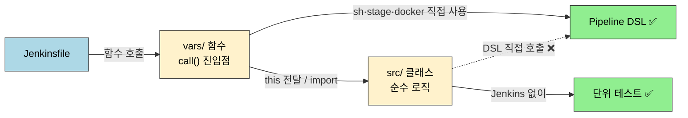
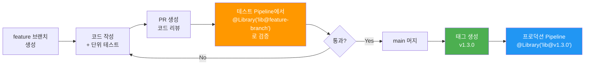

# Shared Libraries — 실전 패턴

---

> 이 문서를 읽고 나면 `call(Map config)` 패턴으로 vars/ 함수를 **작성**하고, 순수 로직을 src/ 클래스로 **분리**해 Jenkins 없이 단위 테스트하는 이유를 **설명**하며, vars/와 src/ 중 어디에 코드를 둘지 **선택**하고, 버전을 branch·tag·SHA 중 무엇으로 고정해야 프로덕션이 안전한지 **비교**할 수 있습니다.

이 문서는 `02-01.공유 라이브러리`의 후속입니다. vars/ 함수 구현, src/ 클래스 분리, 테스트 전략, 버전 관리까지 실전 패턴을 다룹니다.

## 사전 지식

> `02-01`에서 본 Shared Library의 디렉토리 구조(vars/·src/·resources/)와 로딩 방식, CPS 변환과 `Serializable`의 관계를 알고 있어야 합니다. Groovy 클로저·Map 문법과 단위 테스트 경험이 있으면 코드 예제를 따라오기 쉽습니다.

## 진입 — 왜 라이브러리에도 버전 고정과 테스트가 필요한가

> Shared Library는 한 번 작성하면 조직의 모든 Pipeline이 공유합니다. 그래서 라이브러리의 버그 한 줄이 전사 배포를 멈추게 할 수 있습니다.

애플리케이션 코드라면 잘못 배포해도 그 서비스 하나만 영향을 받습니다. 하지만 Shared Library는 다릅니다. `@Library('lib@main')`처럼 변하는 브랜치를 가리키면, 누군가 main에 푸시한 순간 그 라이브러리를 쓰는 수십 개 Pipeline이 동시에 새 코드로 바뀝니다. 그래서 라이브러리에는 일반 애플리케이션보다 더 엄격한 두 가지 장치가 필요합니다. 첫째는 **버전 고정**(어느 시점의 코드를 쓸지 못 박기)이고, 둘째는 **라이브러리 자체의 테스트**(Jenkins 없이 로직을 검증하기)입니다. 이 문서는 이 둘을 실전 코드로 풀어냅니다.

## 1. 실전 패턴: vars/ 함수 구현

> 이미 익숙한 "함수에 인자를 넘긴다"를, Jenkins Pipeline의 step 호출 관점에서 다시 보는 것입니다.

### 1-1. 기본 패턴: call() 메서드와 Map config

vars/ 디렉토리의 각 `.groovy` 파일은 그 파일명이 Pipeline 전역 변수의 이름이 되고, 내부의 `call()` 구현은 step처럼 호출됩니다. 즉 `vars/buildDocker.groovy`를 두면 Pipeline에서 `buildDocker(...)`로 부를 수 있습니다. (출처: jenkins.io/doc/book/pipeline/shared-libraries)

```groovy
// vars/buildDocker.groovy — 파일명 buildDocker 가 그대로 step 이름이 됩니다
def call(Map config = [:]) {
    // ?: 로 필수값을 검증: 누락이면 빌드 초기에 즉시 실패 (늦은 실패 방지)
    def imageName = config.imageName ?: error("imageName is required")
    def tag = config.tag ?: env.BUILD_NUMBER  // 기본 태그는 빌드 번호
    def dockerfile = config.dockerfile ?: 'Dockerfile'

    stage('Docker Build') {
        sh "docker build -t ${imageName}:${tag} -f ${dockerfile} ."
    }
    stage('Docker Push') {
        docker.withRegistry('https://registry.example.com', 'registry-cred') {
            sh "docker push ${imageName}:${tag}"
            sh "docker push ${imageName}:latest"  // latest 도 함께 갱신
        }
    }

    return "${imageName}:${tag}"  // 호출부가 빌드 결과 태그를 받아 쓸 수 있게 반환
}
```

**왜 Map config 패턴을 사용하는가?** 일반적인 위치 기반 파라미터(`def call(String imageName, String tag)`)는 파라미터가 늘어날수록 호출부가 읽기 어려워집니다. Map을 사용하면 `buildDocker(imageName: 'my-app', tag: 'v1.0')`처럼 **이름 기반으로 호출**할 수 있어 가독성이 높아집니다. 또한 기본값을 `?:` 연산자로 쉽게 지정할 수 있고, 새 파라미터를 추가해도 기존 호출부가 깨지지 않습니다.

**필수 파라미터 검증**: `config.imageName ?: error("imageName is required")`는 imageName이 null이면 Pipeline을 즉시 실패시킵니다. 파라미터 누락을 빌드 실행 초기에 잡아내어, 30분 뒤에 배포 단계에서 실패하는 것보다 빠른 피드백을 줍니다.

### 1-2. 표준 Pipeline 패턴

```groovy
// vars/standardPipeline.groovy — 조직 전체 CI/CD 표준을 한 함수로 캡슐화
def call(Map config = [:]) {
    def serviceName = config.serviceName ?: error("serviceName is required")
    def deployTarget = config.deployTarget ?: 'staging'  // 미지정 시 staging
    def skipTests = config.skipTests ?: false

    pipeline {
        agent any

        stages {
            stage('Checkout') {
                steps { checkout scm }
            }
            stage('Build') {
                steps { buildDocker(imageName: serviceName) }
            }
            stage('Test') {
                when { expression { !skipTests } }
                steps { sh './gradlew test' }
            }
            stage('Security Scan') {
                steps { sh "trivy image ${serviceName}:${env.BUILD_NUMBER}" }
            }
            stage('Deploy') {
                steps { deployTo(service: serviceName, env: deployTarget) }
            }
        }

        post {
            success { notifySlack(channel: '#deploys', status: 'SUCCESS') }
            failure { notifySlack(channel: '#deploys', status: 'FAILURE') }
        }
    }
}
```

이 패턴에서 `standardPipeline`은 **전체 Pipeline을 캡슐화**합니다. 개별 서비스의 Jenkinsfile은 단 몇 줄만으로 조직의 전체 CI/CD 표준을 따르게 됩니다. 보안 스캔 단계가 라이브러리에 포함되어 있으므로, 개별 팀이 이 단계를 생략할 수 없습니다.

### 1-3. src/ 클래스 활용

vars/ 함수와 src/ 클래스는 Pipeline DSL 접근 권한이 다릅니다. src/ 는 표준 Java 소스 디렉토리 규약을 따르며 `org/foo/Bar.groovy`는 `org.foo.Bar` 클래스로 classpath 에 추가됩니다. 이 경계를 알면 어떤 코드를 어디에 둘지 판단할 수 있습니다. (출처: jenkins.io/doc/book/pipeline/shared-libraries)

이 경계는 **주방과 식자재 창고**에 비유할 수 있습니다. vars/ 는 불·물·가스(Pipeline DSL인 `sh`·`stage`·`docker`)가 연결된 주방이라 직접 요리할 수 있고, src/ 는 재료를 손질·계량하는 창고라 불은 못 쓰지만 작업대(Jenkins) 없이도 검수(단위 테스트)할 수 있습니다. 다만 이 비유는 "어디서 무엇을 쓸 수 있는가"까지만 맞고, **CPS 직렬화 제약에서 깨집니다** — 창고의 재료(src/ 객체)도 결국 주방을 거쳐 나가므로 직렬화 불가능한 상태를 들고 있으면 그 순간 실패합니다. 단순 분리만으로는 이 제약이 사라지지 않습니다.



`vars/`는 Pipeline DSL을 자유롭게 쓰는 진입점이고, `src/`는 DSL을 직접 못 쓰는 대신 Jenkins 없이 단위 테스트가 되는 순수 로직 자리입니다.

```groovy
// src/com/example/DockerConfig.groovy
package com.example

// Serializable 구현: CPS 가 실행 중간 상태를 program.dat 에 직렬화하므로 필수
class DockerConfig implements Serializable {
    String registry = 'registry.example.com'
    String credentialsId = 'registry-cred'

    // 순수 로직: sh·stage 같은 DSL 을 쓰지 않아 Jenkins 없이 테스트 가능
    String fullImageName(String name, String tag) {
        return "${registry}/${name}:${tag}"
    }

    boolean shouldPush(String branch) {
        return branch in ['main', 'release']  // push 허용 브랜치를 한 곳에서 관리
    }
}
```

```groovy
// vars/buildDocker.groovy 에서 src/ 클래스 사용
import com.example.DockerConfig

def call(Map config = [:]) {
    def dockerConfig = new DockerConfig()
    def imageName = config.imageName ?: error("imageName required")
    def tag = config.tag ?: env.BUILD_NUMBER
    def fullName = dockerConfig.fullImageName(imageName, tag)

    stage('Docker Build') {
        sh "docker build -t ${fullName} ."
    }

    if (dockerConfig.shouldPush(env.BRANCH_NAME)) {
        stage('Docker Push') {
            docker.withRegistry("https://${dockerConfig.registry}", dockerConfig.credentialsId) {
                sh "docker push ${fullName}"
            }
        }
    }
}
```

**왜 src/ 클래스를 분리하는가?** vars/ 함수가 복잡해지면 로직을 테스트하기 어려워집니다. 순수 로직(이미지 이름 생성, 조건 판단 등)을 src/ 클래스로 분리하면 Jenkins 환경 없이도 **단위 테스트가 가능**합니다. `Serializable`을 구현하는 이유는 Jenkins Pipeline이 실행 중간에 직렬화/역직렬화를 수행하기 때문입니다(Pipeline CPS 변환).

## 2. 테스트 전략

> Shared Library는 조직 전체의 CI/CD를 담당하므로, 라이브러리의 버그가 모든 서비스의 배포를 중단시킬 수 있습니다. 따라서 **라이브러리 자체의 테스트**가 필수입니다.

### 2-1. Jenkins Pipeline Unit 프레임워크

[Jenkins Pipeline Unit](https://github.com/jenkinsci/JenkinsPipelineUnit)은 Jenkins 없이 Pipeline 코드를 테스트할 수 있는 프레임워크입니다.

- Pipeline DSL(`sh`, `stage`, `docker` 등)을 모킹하여 vars/ 함수의 로직을 검증합니다.
- Jenkins 서버 없이도 로컬에서 단위 테스트를 실행할 수 있어 피드백 루프가 빠릅니다.
- 라이브러리 변경 시 CI에서 자동으로 테스트를 실행하여 회귀를 방지합니다.

```groovy
// test/BuildDockerTest.groovy
import com.lesfurets.jenkins.unit.BasePipelineTest
import org.junit.Before
import org.junit.Test

class BuildDockerTest extends BasePipelineTest {

    @Before
    void setUp() {
        super.setUp()
        // env.BUILD_NUMBER 를 모킹: 실제 Jenkins 없이 빌드 환경을 흉내
        binding.setVariable('env', [BUILD_NUMBER: '42'])
    }

    @Test
    void 'imageName_필수_파라미터_누락시_에러'() {
        def script = loadScript('vars/buildDocker.groovy')
        try {
            script.call([:])
            fail('에러가 발생해야 함')
        } catch (Exception e) {
            assert e.message.contains('imageName is required')
        }
    }

    @Test
    void '기본_태그는_BUILD_NUMBER를_사용'() {
        def script = loadScript('vars/buildDocker.groovy')
        script.call(imageName: 'my-app')

        // docker build 명령어에 BUILD_NUMBER가 포함되었는지 검증
        assertJobStatusSuccess()
    }
}
```

### 2-2. src/ 클래스 단위 테스트

src/ 클래스는 Jenkins 의존성이 없으므로 일반 Groovy/Spock 테스트로 검증합니다.

```groovy
// test/DockerConfigTest.groovy
import com.example.DockerConfig
import spock.lang.Specification

class DockerConfigTest extends Specification {

    def 'fullImageName이_레지스트리를_포함해야_함'() {
        given:
        def config = new DockerConfig()

        when:
        def result = config.fullImageName('my-app', 'v1.0')

        then:
        result == 'registry.example.com/my-app:v1.0'
    }

    def 'main과_release_브랜치만_push_허용'() {
        given:
        def config = new DockerConfig()

        expect:
        config.shouldPush('main') == true
        config.shouldPush('release') == true
        config.shouldPush('feature-x') == false
    }
}
```

### 2-3. 라이브러리 개발 워크플로우



> 위 다이어그램은 Shared Library의 개발부터 프로덕션 적용까지의 워크플로우를 보여줍니다. 핵심은 **테스트 Pipeline에서 feature 브랜치를 직접 로딩하여 검증**하는 단계(주황색)입니다. 이 단계에서 실제 Jenkins 환경에서 라이브러리가 제대로 동작하는지 확인한 후에야 main에 머지합니다. 프로덕션 Pipeline은 **태그 버전을 고정**하여 안정성을 보장합니다.

### 2-4. 버전 관리 전략

`@Library('name@version')`의 version에는 branch·tag·commit hash(SHA)를 쓸 수 있고, 복수 로딩은 `@Library(['a', 'b@tag'])`로 묶습니다. (출처: jenkins.io/doc/book/pipeline/shared-libraries)

| 브랜치/태그   | 용도               | 사용 대상          |
| ------------- | ------------------ | ------------------ |
| `main`        | 최신 안정 버전     | 스테이징 Pipeline  |
| `develop`     | 실험적 기능        | 개발자 로컬 테스트 |
| `v1.x.x` 태그 | 프로덕션 고정 버전 | 프로덕션 Pipeline  |
| `feature/*`   | 신규 기능 개발     | 테스트 Pipeline    |

버전 고정은 **`package.json`의 의존성 lock과 같은 발상**입니다. `npm install`이 `^1.2.0`처럼 범위를 허용하면 다른 시점에 설치한 두 머신이 서로 다른 버전을 받아 "내 PC에선 됐는데"가 생기듯, `@Library('lib@main')`은 main에 푸시가 들어올 때마다 라이브러리가 바뀝니다. 반대로 `@Library('lib@v1.3.0')`이나 SHA 고정은 lock 파일을 박은 것처럼 누가 무엇을 푸시하든 같은 코드를 보장합니다.

수치로 보면 차이가 분명합니다. 이 라이브러리를 50개 서비스 Pipeline이 `@Library('lib@main')`로 공유한다고 가정하면, 누군가 main에 버그를 한 줄 푸시한 순간 다음 빌드부터 50개 Pipeline이 모두 깨집니다. 반면 각 서비스가 `lib@v1.3.0`으로 고정돼 있으면, 새로 태그 `v1.4.0`을 올려도 기존 50개는 영향을 받지 않고, 팀이 준비됐을 때 한 곳씩 버전 번호만 올려 점진 적용할 수 있습니다. 브랜치는 "지금 그 브랜치의 최신", 태그·SHA는 "그 시점에 못 박힌 불변"이라는 차이가 핵심입니다.

Semantic Versioning을 따르되, **breaking change가 있으면 반드시 메이저 버전을 올려야** 합니다. 그렇지 않으면 `@Library('lib@v1')` 형태의 와일드카드 버전을 사용하는 Pipeline이 예상치 못하게 깨질 수 있습니다.

## 면접 질문

> 답을 떠올린 뒤 §정답 절에서 같은 번호로 대조하세요.

1. vars/ 함수에서 위치 기반 파라미터 대신 `call(Map config)` 패턴을 쓰면 무엇이 좋아지나요? 필수 파라미터는 어떻게 검증하나요?
2. 같은 로직을 vars/에 두는 것과 src/ 클래스로 분리하는 것의 차이는 무엇인가요? src/ 클래스가 `Serializable`을 구현해야 하는 이유는?
3. Shared Library를 feature 브랜치에서 검증하고 프로덕션에 적용하기까지의 안전한 워크플로우는 어떻게 되나요? Semantic Versioning에서 breaking change를 어떻게 다뤄야 하나요?

### 빈칸 채우기 — 버전 고정과 vars/src 경계

다음 빈칸을 채워 보세요. 정답은 문서 끝의 §빈칸 정답 절에 있습니다.

1. vars/ 디렉토리의 `buildDocker.groovy` 파일은 Pipeline에서 `______(...)` 라는 이름의 전역 변수(step)로 호출되며, 내부의 `______()` 메서드가 실제 구현입니다.
2. `@Library('name@version')`의 version 자리에는 branch, ______, commit ______(SHA) 세 가지를 쓸 수 있습니다.
3. 프로덕션 Pipeline은 변하는 브랜치 대신 ______ 또는 SHA로 버전을 고정해야, 라이브러리에 새 푸시가 들어와도 같은 코드를 보장받습니다.
4. src/ 클래스가 `______`을 구현해야 하는 이유는, Pipeline이 CPS 변환으로 실행 중간 상태를 ______에 직렬화하기 때문입니다.

## 정답

> 위 질문을 스스로 설명해 본 뒤에 펼치세요.

### 정답 1 — Map config 패턴

위치 기반(`call(String imageName, String tag)`)은 파라미터가 늘수록 호출부가 무슨 값인지 알기 어렵고, 순서가 바뀌면 깨집니다. `call(Map config)`는 `buildDocker(imageName: 'app', tag: 'v1')`처럼 이름 기반 호출이라 가독성이 높고, `?:`로 기본값을 주기 쉬우며, 새 파라미터를 추가해도 기존 호출부가 깨지지 않습니다. 필수 파라미터는 `config.imageName ?: error("imageName is required")`로 null이면 빌드를 즉시 실패시켜, 30분 뒤 배포 단계가 아니라 실행 초기에 누락을 잡습니다.

### 정답 2 — vars vs src, 그리고 Serializable

`vars/`는 Pipeline DSL(`sh`·`stage`·`docker`)을 직접 쓰는 진입점이고, `src/`는 DSL을 직접 못 쓰는 대신 Jenkins 없이 단위 테스트가 되는 순수 로직 자리입니다. vars/ 함수가 복잡해지면 이미지 이름 생성·조건 판단 같은 로직을 src/ 클래스로 빼 테스트 가능성을 높입니다. src/ 클래스가 `Serializable`을 구현해야 하는 이유는, Pipeline이 CPS 변환으로 실행 중간 상태를 직렬화/역직렬화하기 때문입니다. 직렬화 불가 객체를 필드로 들고 있으면 그 지점에서 실패합니다.

### 정답 3 — 개발→프로덕션 워크플로우와 SemVer

feature 브랜치에서 코드와 단위 테스트를 작성하고, PR 리뷰 후 **테스트 Pipeline에서 `@Library('lib@feature-branch')`로 실제 Jenkins 환경 검증**을 거친 뒤에야 main에 머지합니다. 그다음 `v1.3.0` 같은 태그를 만들고, 프로덕션 Pipeline은 그 태그를 고정해 씁니다. Semantic Versioning에서는 breaking change가 있으면 반드시 메이저를 올려야 합니다. 안 그러면 `@Library('lib@v1')` 같은 와일드카드 버전을 쓰는 Pipeline이 예고 없이 깨집니다.

### 빈칸 정답 — 버전 고정과 vars/src 경계

1. `buildDocker(...)` / `call()` — 파일명이 step 이름, `call()`이 구현입니다.
2. tag / hash — branch·tag·commit hash(SHA) 세 가지입니다.
3. tag(태그) — 태그 또는 SHA로 고정합니다.
4. `Serializable` / `program.dat` — CPS가 실행 상태를 program.dat에 직렬화합니다.

## 핵심 정리

| 개념                 | 핵심                                     | 왜 중요한가                         |
| -------------------- | ---------------------------------------- | ----------------------------------- |
| **JENKINS_HOME**     | 모든 설정/빌드/플러그인의 단일 루트      | Jenkins 동작의 물리적 기반          |
| **init.groovy.d/**   | 기동 시 자동 실행 Groovy 스크립트        | 코드 기반 Jenkins 설정 (IaC)        |
| **workflow-libs/**   | Shared Library의 로컬 캐시 디렉토리      | Pipeline 실행 시 Git clone 결과 저장 |
| **Folder Plugin**    | jobs/ 중첩 + 폴더 레벨 Library 설정      | 전역 표준 + 팀별 확장 2계층 구조    |
| **Shared Library**   | 공통 CI/CD 로직을 별도 Git 저장소로 분리 | 중복 제거 + 거버넌스 강제           |
| **vars/**            | 파일명 = 함수명, call() 메서드           | Pipeline에서 직접 호출하는 진입점   |
| **src/**             | 일반 Groovy 클래스                       | 복잡한 로직 분리 + 단위 테스트 가능 |
| **resources/**       | 정적 파일                                | 설정/템플릿의 버전 관리             |
| **Version Pinning**  | @Library('lib@v1.2.0')                   | 프로덕션 안정성 보장                |
| **Implicit Loading** | 전역 자동 로딩                           | 조직 표준 강제                      |
| **테스트**           | Jenkins Pipeline Unit + Spock            | 라이브러리 버그 = 전사 장애 방지    |

## 관련 문서

> 이 문서는 `02-01`의 디렉토리 구조·로딩 위에 실전 구현을 쌓았습니다. CPS 직렬화 제약과 Groovy 문법, 외부 트리거 연동은 아래에서 이어집니다.

- [02-01. 공유 라이브러리](02-01.%EA%B3%B5%EC%9C%A0%20%EB%9D%BC%EC%9D%B4%EB%B8%8C%EB%9F%AC%EB%A6%AC.md) § "디렉토리 구조" — vars/·src/·resources/ 구조와 로딩 방식의 선행 개념
- [02-03. groovy 커스텀터마이징 한계](02-03.groovy%20%EC%BB%A4%EC%8A%A4%ED%85%80%ED%84%B0%EB%A7%88%EC%9D%B4%EC%A7%95%20%ED%95%9C%EA%B3%84.md) § "CPS 변환" — src/ 클래스가 Serializable 을 요구하는 직렬화 제약의 근거
- [02-04. Groovy 기본 문법](02-04.Groovy%20%EA%B8%B0%EB%B3%B8%20%EB%AC%B8%EB%B2%95.md) § "클로저·Map" — call(Map config) 패턴이 의존하는 Groovy 문법
- [02-05. 전역 파이프라인 Hook](02-05.%EC%A0%84%EC%97%AD%20%ED%8C%8C%EC%9D%B4%ED%94%84%EB%9D%BC%EC%9D%B8%20Hook.md) § "Hook" — 라이브러리와 함께 조직 표준을 강제하는 또 다른 장치
- [02-06a. Webhook과 외부 연동](02-06a.Webhook%EA%B3%BC%20%EC%99%B8%EB%B6%80%20%EC%97%B0%EB%8F%99.md) § "Generic Webhook Trigger" — 라이브러리로 표준화한 Pipeline 을 외부 이벤트로 트리거하기
