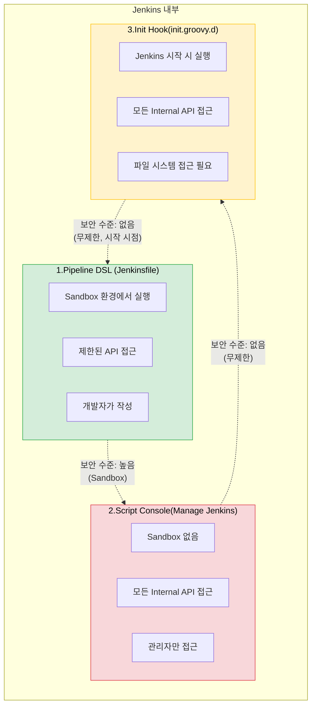
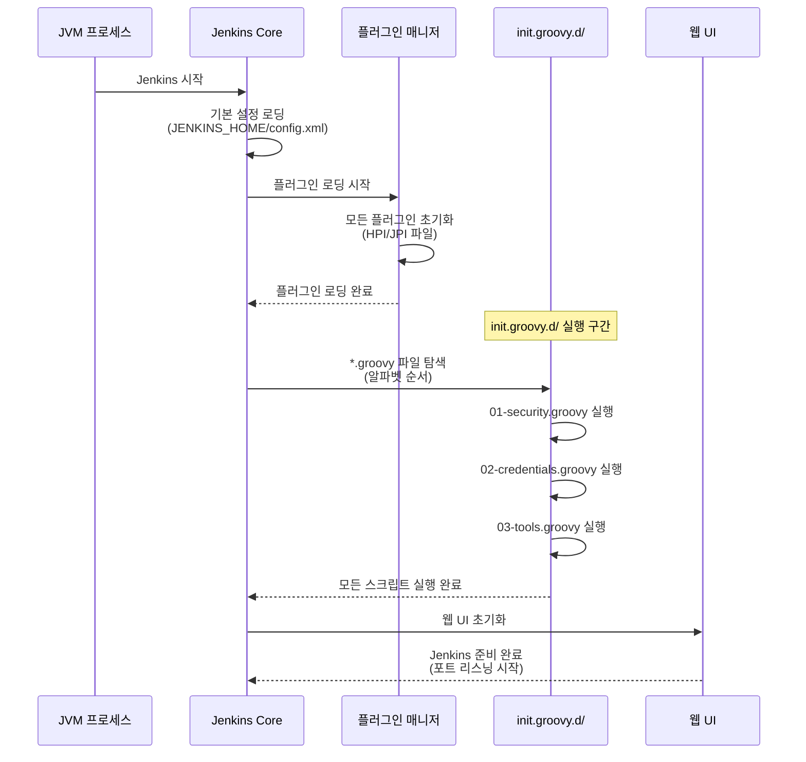
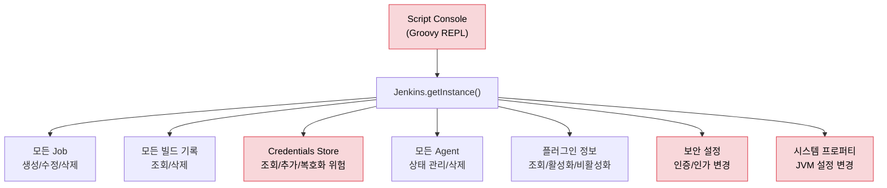

# Groovy 커스터마이징이란?

---

> **핵심 질문**: "Jenkins를 Groovy로 커스터마이징하는 것은 어디까지 가능하고, 어디부터 위험한가?"
>
> 이 문서를 읽고 나면 Jenkins에서 Groovy가 쓰이는 세 영역(Pipeline DSL·Script Console·init.groovy.d)을 보안 경계와 실행 컨텍스트로 **구분**하고, init.groovy.d의 실행 타이밍과 멱등성을 **설명**하며, Script Console의 크레덴셜 평문 노출이 왜 발생하는지 **디버깅** 관점에서 추적하고, "JCasC로 되면 JCasC"라는 우선순위로 커스터마이징 수단을 **선택**할 수 있습니다.


## 사전 지식

Jenkins의 `JENKINS_HOME` 구조와 크레덴셜 저장 개념(`04_api/01-07`), Groovy 기본 문법(`02-04`)을 알고 있으면 좋습니다. Jenkins가 JVM 위에서 도는 Java 애플리케이션이라는 점을 떠올릴 수 있으면 Groovy가 왜 확장 언어인지 자연스럽게 이어집니다.


## 진입 — 왜 커스터마이징 경계를 알아야 하는가

> "Groovy 한 줄이면 다 된다"는 말은 사실이지만, 그 한 줄이 어느 영역에서 실행되느냐에 따라 안전한 자동화가 되기도 하고 운영 사고가 되기도 합니다.

같은 `Jenkins.getInstance()` 호출이라도 Pipeline 안에서는 Sandbox에 막히고, Script Console에서는 크레덴셜을 평문으로 뽑아냅니다. 그래서 Jenkins 커스터마이징을 배울 때 가장 먼저 잡아야 할 감각은 "이 코드가 어떤 보안 경계 안에서 도느냐"입니다. 이 경계를 모르면 "되는 줄 알았는데 안 되거나", 반대로 "막힌 줄 알았는데 다 뚫리는" 상황을 만납니다.


## 1. Jenkins와 Groovy의 관계

> 이미 아는 "스크립트 언어로 애플리케이션을 확장한다"의 *JVM 내장 측면*입니다. Python으로 앱을 확장하듯, Jenkins는 자기 JVM 안에서 Groovy를 실행해 자기 Java 객체를 그대로 만집니다.

> Jenkins는 Java로 작성된 애플리케이션이지만, 설정과 확장의 핵심 언어로 Groovy를 사용합니다.
>
> 이 선택은 우연이 아닙니다. Groovy는 JVM 위에서 동작하므로 Jenkins의 모든 Java 클래스에 직접 접근할 수 있고, Java와 거의 동일한 문법을 가지면서도 스크립팅에 적합한 동적 타이핑을 지원합니다.

구체적으로 Groovy가 Jenkins에 적합한 이유는 세 가지입니다.

1. **JVM 호환성입니다**. Groovy 코드는 JVM 바이트코드로 컴파일되므로 Jenkins의 Java 클래스를 `import`하여 직접 호출할 수 있습니다. 별도의 브릿지나 FFI(Foreign Function Interface)가 필요 없습니다.
2. **문법적 간결함입니다**. Java에서 10줄이 필요한 코드를 Groovy에서는 3줄로 작성할 수 있습니다. 세미콜론 생략, 클로저, GString 같은 편의 기능이 관리 스크립트 작성에 생산성을 높여줍니다.
3. **동적 타이핑입니다**. 런타임에 타입을 결정하므로 탐색적 스크립팅, 즉 "이 API가 무엇을 반환하는지 실행해보면서 확인하는" 작업에 유리합니다.

비유하자면 Groovy는 Jenkins라는 건물의 **마스터 키**입니다. 어느 방이든 열 수 있어 편리하지만, 누구 손에 쥐어주느냐에 따라 관리자가 되기도 하고 침입자가 되기도 합니다. 다만 이 비유는 "키 하나로 통일"까지만 맞고, **Pipeline DSL 영역에서 깨집니다** — Pipeline의 Groovy는 마스터 키가 아니라 Sandbox가 허용한 문만 여는 제한된 키이기 때문입니다. 즉 같은 언어라도 영역마다 키의 권한이 다릅니다.

### Groovy가 사용되는 3가지 영역

Jenkins에서 Groovy는 명확히 구분되는 세 가지 영역에서 사용되며, 각 영역의 보안 수준과 실행 컨텍스트가 다릅니다.



**영역 1: Pipeline DSL (Jenkinsfile)**은 가장 일상적인 Groovy 사용처입니다.

- 개발자가 `Jenkinsfile`에 `pipeline { ... }` 블록을 작성하면, Jenkins는 이것을 Groovy 코드로 해석하고 실행합니다.
- 이 영역에서는 **Script Security Plugin**이 Sandbox를 적용하여 위험한 API 호출을 차단합니다.
- 개발자가 `System.exit(0)`을 Pipeline에 넣어도 실행되지 않고 관리자 승인을 요구합니다.

**영역 2: Script Console (Manage Jenkins > Script Console)**은 Jenkins 관리자가 Groovy 코드를 직접 입력하여 실행하는 인터페이스입니다.

- 이 콘솔은 Sandbox가 적용되지 않으므로 Jenkins의 모든 Internal API에 무제한으로 접근할 수 있습니다.
- 크레덴셜을 평문으로 읽을 수도 있고, 모든 Job을 삭제할 수도 있습니다. 강력하지만 그만큼 위험한 영역입니다.

**영역 3: Init Hook (JENKINS_HOME/init.groovy.d/)**은 Jenkins가 시작될 때 자동으로 실행되는 Groovy 스크립트입니다.

- Script Console과 동일한 권한을 가지지만, 사용자가 직접 실행하는 것이 아니라 Jenkins 프로세스가 시작 시점에 자동으로 실행합니다.
- 주로 초기 설정 자동화에 사용됩니다.

이 세 영역의 핵심적인 차이는 **누가 실행하느냐**와 **어떤 보안 경계 안에서 실행되느냐**입니다. Pipeline DSL은 개발자가 작성하고 Sandbox에서 실행되며, Script Console은 관리자가 직접 실행하고 보안 경계가 없으며, Init Hook은 시스템이 자동 실행하고 보안 경계가 없습니다.

### 커스텀의 무게 3계층 — 플러그인 vs 공유 라이브러리 vs Groovy 스크립트

Groovy 스크립트는 커스터마이징의 한 수단일 뿐입니다. 확장의 무게를 기준으로 세 계층이 있고, 무거울수록 재사용·신뢰 범위가 넓지만 변경 비용도 커집니다.

| 계층 | 수단 | 무게 | 신뢰(권한) 범위 | 변경 비용 |
| ---- | ---- | ---- | --------------- | --------- |
| 가벼움 | Pipeline DSL / Script 단계 | 빌드 1회 | Sandbox 제한(untrusted) | 즉시, 영향 국소 |
| 중간 | Shared Library (`vars/`, `src/`) | 여러 Job 공유 | Global=trusted(무제한) / Folder=항상 untrusted | 라이브러리 버전 핀 단위 |
| 무거움 | 플러그인(HPI/JPI) | Jenkins 전역 | Jenkins API 전체 | 빌드·배포·재기동 필요 |

> Global Trusted Pipeline Libraries는 무제한 Java/Groovy/Jenkins API를 쓰고, folder-level 라이브러리는 항상 untrusted(sandbox)로 실행됩니다. (출처: jenkins.io/doc/book/pipeline/shared-libraries)

"한 번 쓰고 버릴 조회"는 Script Console로, "여러 파이프라인이 공유할 헬퍼"는 Shared Library로, "Jenkins 자체 기능 확장"은 플러그인으로 올라갑니다. 무게를 잘못 고르면, 한 줄짜리 조회를 위해 플러그인을 만들거나 전사 공통 로직을 Jenkinsfile마다 복붙하는 사고가 납니다.

#### Shared Library의 세 디렉토리

중간 무게 수단인 Shared Library는 `vars/`(전역변수)·`src/`(Java 소스)·`resources/`(비-Groovy 파일) 세 디렉토리로 구성됩니다. 이 편에서는 3계층 비교의 한 칸으로만 다루므로, 각 디렉토리 구조·basename 규약·`libraryResource` 사용법의 상세는 [02-01. 공유 라이브러리](02-01.%EA%B3%B5%EC%9C%A0%20%EB%9D%BC%EC%9D%B4%EB%B8%8C%EB%9F%AC%EB%A6%AC.md) § "vars/src/resources"를 참고하세요. 아래 코드는 "변경 비용" 칸의 핵심인 버전 핀만 짚습니다.

```groovy
// Jenkinsfile 최상단 — 라이브러리를 버전과 함께 로드
// @Library의 version은 branch/tag/commit hash 어느 것이든 가능
// 왜 version을 고정하나: 라이브러리 변경이 모든 Job에 즉시 전파되는 사고를 막기 위해
@Library('my-shared-lib@v1.4.0') _

// vars/deployToK8s.groovy 의 call()이 step처럼 호출됨
deployToK8s(cluster: 'prod', image: 'app:1.2.3')
```

```groovy
// 런타임 동적 로드 — library step (version 필수)
// 왜 library step을 쓰나: 조건에 따라 다른 버전/라이브러리를 골라 로드해야 할 때
//   @Library 어노테이션은 파싱 시점에 고정되어 분기를 줄 수 없기 때문
def lib = library('my-shared-lib@experimental')
```


## 2. Init Groovy Hook (전역 초기화 스크립트)

> `JENKINS_HOME/init.groovy.d/` 디렉토리는 Jenkins의 "부팅 스크립트" 폴더입니다.
>
> Jenkins 프로세스가 시작되면 이 디렉토리 안의 모든 `.groovy` 파일을 알파벳 순서로 실행합니다. 실행 시점은 플러그인 로딩 이후, 웹 UI가 준비되기 전입니다. 이 타이밍이 중요한데, 플러그인이 로딩된 상태이므로 플러그인 API를 호출할 수 있지만, 아직 사용자 요청을 받기 전이므로 초기 설정을 안전하게 적용할 수 있기 때문입니다.



- init.groovy.d가 플러그인 로딩 전에 실행된다면, 특정 플러그인의 API를 호출하는 스크립트가 `ClassNotFoundException`으로 실패합니다.
- 반대로 UI가 준비된 후에 실행된다면, 보안 설정이 적용되기 전에 사용자가 접근할 수 있는 시간 창이 열립니다.
- 플러그인 로딩 직후, UI 준비 직전이라는 타이밍은 이 두 가지 문제를 모두 피하는 최적의 시점입니다.

init.groovy.d 스크립트는 **재시작할 때마다 매번** 실행되므로 멱등성이 필수입니다. 예를 들어 K8s 환경에서 Pod이 하루에 수십 번 재시작될 수 있는데, 매 재시작마다 "admin" 계정을 다시 만들거나 같은 크레덴셜을 중복 등록하면 안 됩니다. 그래서 "이미 있으면 건너뛴다"는 조건 검사를 코드에 넣습니다(사례 3의 `env.containsKey` 분기가 그 예입니다).

### 파일 네이밍 컨벤션

init.groovy.d 안의 스크립트는 알파벳 순서로 실행되므로, 숫자 접두사를 붙여 실행 순서를 명시적으로 제어하는 것이 관례입니다.

```
JENKINS_HOME/init.groovy.d/
├── 01-security-realm.groovy      # 보안 설정 (가장 먼저)
├── 02-authorization.groovy       # 인가 전략
├── 03-csrf-protection.groovy     # CSRF 보호
├── 04-credentials.groovy         # 크레덴셜 등록
├── 05-global-tools.groovy        # 전역 도구 설정 (JDK, Maven)
└── 99-final-save.groovy          # 최종 저장
```

### 활용 사례와 코드 예시

**사례 1: 관리자 계정 자동 생성**

Docker 기반 Jenkins를 처음 시작할 때 관리자 계정을 자동으로 설정하는 가장 일반적인 사례입니다. 초기 설정 마법사를 건너뛰고 바로 사용 가능한 상태로 만들 수 있습니다.

```groovy
import jenkins.model.*
import hudson.security.*

def instance = Jenkins.getInstance()

// HudsonPrivateSecurityRealm: Jenkins 내장 사용자 DB를 사용하는 인증 방식
// false 파라미터는 "사용자 자가 등록 비허용"을 의미
def hudsonRealm = new HudsonPrivateSecurityRealm(false)
hudsonRealm.createAccount("admin", "admin-password")
instance.setSecurityRealm(hudsonRealm)

// FullControlOnceLoggedInAuthorizationStrategy:
// 로그인한 사용자에게 전체 권한, 비인증 사용자는 접근 불가
def strategy = new FullControlOnceLoggedInAuthorizationStrategy()
strategy.setAllowAnonymousRead(false)
instance.setAuthorizationStrategy(strategy)

// save()로 config.xml에 영속화 — 호출하지 않으면 메모리에만 반영되고
// 재기동 시 설정이 사라짐
instance.save()
println "[init] Admin account created and security configured."
```

- Jenkins Docker 이미지를 CI/CD 파이프라인으로 자동 배포할 때, 초기 설정 마법사를 수동으로 진행할 수 없기 때문입니다.
- 특히 Kubernetes 환경에서 Pod이 재시작될 때마다 일관된 초기 상태를 보장해야 합니다.

**사례 2: CSRF 보호 및 Agent 프로토콜 설정**

```groovy
import jenkins.model.*
import hudson.security.csrf.DefaultCrumbIssuer
import jenkins.security.s2m.AdminWhitelistRule

def instance = Jenkins.getInstance()

// CSRF Protection 활성화 — 웹 UI에서의 CSRF 공격 방지
instance.setCrumbIssuer(new DefaultCrumbIssuer(true))

// Agent → Master 접근 제한 — Agent가 Master의 파일시스템에 접근하는 것을 차단
// 왜 중요한가: 악의적인 Agent가 Master의 크레덴셜이나 설정을 읽을 수 있기 때문
instance.getInjector().getInstance(AdminWhitelistRule.class)
    .setMasterKillSwitch(false)

instance.save()
println "[init] CSRF protection enabled, Agent protocol secured."
```

**사례 3: 크레덴셜 자동 등록 (환경변수 기반)**

```groovy
import jenkins.model.*
import com.cloudbees.plugins.credentials.*
import com.cloudbees.plugins.credentials.domains.*
import com.cloudbees.plugins.credentials.impl.*
import org.jenkinsci.plugins.plaincredentials.impl.*
import hudson.util.Secret

def env = System.getenv()

// 환경변수에서 크레덴셜 값을 읽어 Jenkins Credentials Store에 등록
// 왜 환경변수인가: Docker/K8s에서 Secret을 환경변수로 주입하는 것이 표준 패턴
def store = Jenkins.getInstance()
    .getExtensionList('com.cloudbees.plugins.credentials.SystemCredentialsProvider')[0]
    .getStore()

def domain = Domain.global()

// Git 접근용 Username/Password
// containsKey 분기가 멱등성의 핵심 — 환경변수가 없으면 등록을 건너뛰어
// 매 재기동마다 중복 등록되는 것을 막음
if (env.containsKey('GIT_USER') && env.containsKey('GIT_TOKEN')) {
    def gitCred = new UsernamePasswordCredentialsImpl(
        CredentialsScope.GLOBAL,
        "git-credentials",           // credentials ID
        "Git Access Token",          // description
        env['GIT_USER'],             // username
        env['GIT_TOKEN']             // password
    )
    store.addCredentials(domain, gitCred)
    println "[init] Git credentials registered."
}

// Docker Registry 접근용 Secret Text
if (env.containsKey('DOCKER_REGISTRY_TOKEN')) {
    def dockerCred = new StringCredentialsImpl(
        CredentialsScope.GLOBAL,
        "docker-registry-token",
        "Docker Registry Token",
        // Secret.fromString으로 감싸야 평문이 config.xml에 그대로 박히지 않음
        Secret.fromString(env['DOCKER_REGISTRY_TOKEN'])
    )
    store.addCredentials(domain, dockerCred)
    println "[init] Docker registry credentials registered."
}
```

- JCasC(Configuration as Code)가 크레덴셜 등록을 지원하지만, 복잡한 조건부 로직(환경변수 존재 여부에 따른 분기)이 필요할 때는 init.groovy.d가 더 유연합니다.
- 다만 환경변수에 비밀값을 넣는 것 자체의 보안 고려가 필요합니다. Kubernetes라면 Secret 리소스를, Docker라면 Docker Secret을 사용해야 합니다.


## 3. Script Console로 할 수 있는 것들

> Jenkins Script Console (Manage Jenkins > Script Console)은 **Jenkins 프로세스 내부에서 Groovy 코드를 직접 실행하는 REPL(Read-Eval-Print Loop)입니다.**
>
> Jenkins의 모든 Java 객체에 접근할 수 있다는 것이 핵심입니다. Jenkins 인스턴스, 모든 Job, 모든 빌드, 모든 크레덴셜, 모든 에이전트, 플러그인 설정까지 읽고 수정할 수 있습니다.



### 실용적 스크립트 예시

**빌드 기록 정리**: 디스크 공간이 부족할 때 오래된 빌드 기록을 대량 삭제합니다.

```groovy
import jenkins.model.*

def daysToKeep = 30

Jenkins.getInstance().getAllItems(hudson.model.Job.class).each { job ->
    job.getBuilds().each { build ->
        def buildDate = new Date(build.getTimeInMillis())
        // cutoff = 오늘 - 30일. 이보다 오래된 빌드만 삭제 대상
        def cutoffDate = new Date() - daysToKeep

        if (buildDate.before(cutoffDate)) {
            // 삭제 전 무엇을 지우는지 로그로 남겨야 사후 추적이 가능
            println "Deleting: ${job.fullName} #${build.number} (${buildDate})"
            build.delete()
        }
    }
}
println "Cleanup complete."
```

**Agent 상태 조회**: 모든 Agent의 온/오프라인 상태와 실행 중인 빌드를 확인합니다.

```groovy
import jenkins.model.*
import hudson.model.*

Jenkins.getInstance().getNodes().each { node ->
    def computer = node.toComputer()
    // ?. 안전 호출 — Agent가 분리된 직후엔 computer가 null일 수 있음
    def status = computer?.isOnline() ? "ONLINE" : "OFFLINE"
    def executors = computer?.countBusy() ?: 0
    def total = computer?.countExecutors() ?: 0

    println "${node.displayName}: ${status} (${executors}/${total} executors busy)"

    if (!computer?.isOnline()) {
        println "  Offline cause: ${computer?.getOfflineCause()}"
    }
}
```

**플러그인 정보 조회**: 설치된 모든 플러그인의 버전과 업데이트 가능 여부를 확인합니다.

```groovy
import jenkins.model.*

Jenkins.getInstance().getPluginManager().getPlugins().sort { it.getShortName() }.each { plugin ->
    def update = plugin.hasUpdate() ? " [UPDATE AVAILABLE]" : ""
    println "${plugin.getShortName()} (${plugin.getVersion()})${update}"
}
```

### Script Console의 보안 위험

Script Console의 가장 심각한 보안 문제는 **크레덴셜 평문 노출**입니다. 다음 코드는 Jenkins에 저장된 모든 크레덴셜의 비밀값을 평문으로 출력할 수 있습니다.

```groovy
// 위험: 크레덴셜을 평문으로 노출하는 스크립트
// 이것이 가능하다는 사실 자체가 Script Console 접근 제한의 이유
import com.cloudbees.plugins.credentials.*
import com.cloudbees.plugins.credentials.impl.*

def creds = CredentialsProvider.lookupCredentials(
    com.cloudbees.plugins.credentials.common.StandardCredentials.class,
    Jenkins.getInstance(), null, null
)

creds.each { c ->
    println "ID: ${c.id}"
    if (c instanceof UsernamePasswordCredentialsImpl) {
        println "  Username: ${c.username}"
        // plainText 호출 한 번이면 암호화 저장이 무력화됨 — 이 줄이 위험의 핵심
        println "  Password: ${c.password.plainText}"
    }
}
```

- Jenkins는 크레덴셜을 암호화하여 저장하지만, 복호화 키가 Jenkins 프로세스 메모리에 있습니다.
- Script Console은 그 프로세스 안에서 실행되므로 복호화 API를 직접 호출할 수 있습니다.
- 이것은 설계 결함이 아니라, Jenkins가 빌드 중에 크레덴셜을 사용해야 하므로 프로세스가 복호화 능력을 갖추어야 하기 때문입니다.
- 문제는 그 능력이 Script Console을 통해 관리자에게 노출된다는 것입니다.

따라서 Script Console 접근 권한은 **Jenkins 시스템 관리자 중에서도 극소수**에게만 부여해야 합니다. Matrix-based Security에서 "Administer" 권한과 "Run Scripts" 권한을 분리하여 관리하는 것이 권장됩니다.


## 4. CPS 변환과 @NonCPS — 커스텀의 숨은 제약

Pipeline의 Groovy는 일반 Groovy와 다르게 동작합니다. Jenkins는 재기동을 대비해 Pipeline 실행 상태를 **CPS(Continuation Passing Style) 변환**으로 직렬화해 `program.dat`에 저장하고, 이 변환이 `@NonCPS` 안 step 호출 불가·생성자 미변환·CPS closure를 non-CPS 메서드에 넘길 때의 오작동 같은 제약을 만듭니다. 변환 메커니즘과 제약 목록의 상세는 [02-03. groovy 커스텀터마이징 한계](02-03.groovy%20%EC%BB%A4%EC%8A%A4%ED%85%80%ED%84%B0%EB%A7%88%EC%9D%B4%EC%A7%95%20%ED%95%9C%EA%B3%84.md) § "CPS·@NonCPS"에서 추적합니다.

이 편에서 짚을 것은 그 제약이 **커스텀 수단 선택의 경계**에 어떻게 닿는가입니다. Shared Library의 `vars/` 헬퍼를 짤 때 "무거운 순수 계산은 `@NonCPS`로, step 호출이 섞이면 일반 메서드로"라는 경계를 의식해야 하고, 이 경계를 모르고 `@NonCPS` 안에서 `sh`를 부르면 런타임에 깨집니다. 즉 CPS는 "Groovy로 할 수 있다"와 "어떤 수단에 둬야 안전하다"를 가르는 또 하나의 축입니다.


## 면접 질문

> 답을 떠올린 뒤 §정답 절에서 같은 번호로 대조하세요.

1. Jenkins에서 Groovy가 쓰이는 세 영역(Pipeline DSL·Script Console·init.groovy.d)은 보안 경계와 실행 주체가 어떻게 다른가요?
2. init.groovy.d는 왜 "플러그인 로딩 직후, UI 준비 직전"에 실행될까요? 더 이르거나 늦으면 각각 무슨 문제가 생기나요?
3. Script Console에서 크레덴셜이 평문으로 읽히는 것은 버그인가요? 아니라면 왜 그렇고, 어떻게 완화하나요?
4. Shared Library에서 Global Trusted와 folder-level의 권한 차이는 무엇이고, 왜 그렇게 나뉘나요?

### 빈칸 채우기 — 커스텀 3계층과 CPS

다음 빈칸을 채워 보세요. 정답은 문서 끝 §빈칸 정답 절에 있습니다.

1. Shared Library에서 `vars/` 안의 파일 basename은 곧 Pipeline ____ 이름이 되고, `src/`는 표준 ____ 소스 디렉토리로 classpath에 추가됩니다.
2. Pipeline Groovy는 재기동을 대비해 실행 상태를 ____ 변환으로 직렬화해 ____ 파일에 저장합니다.
3. `@NonCPS` 메서드 내부에서는 `node`/`sh` 같은 ____ 을(를) 호출할 수 없습니다.
4. Global Trusted Pipeline Libraries는 ____(trusted) 권한으로 실행되고, folder-level 라이브러리는 항상 ____ 로 실행됩니다.


## 정답

> 위 질문을 스스로 설명해 본 뒤에 펼치세요.

### 정답 1 — 세 영역의 보안 경계

Pipeline DSL은 개발자가 Jenkinsfile에 작성하고 **Sandbox 안에서** 실행되어 위험한 API는 관리자 승인을 거쳐야 합니다. Script Console은 관리자가 직접 입력해 **Sandbox 없이** 모든 Internal API에 접근합니다. init.groovy.d는 시스템이 시작 시점에 자동 실행하며 역시 보안 경계가 없습니다. 핵심 축은 "누가 실행하느냐"와 "어떤 보안 경계 안이냐"이고, 그래서 같은 Groovy라도 영역마다 위험도가 전혀 다릅니다.

### 정답 2 — init.groovy.d 실행 타이밍

플러그인 로딩 **전**에 실행되면 플러그인 API를 호출하는 스크립트가 `ClassNotFoundException`으로 실패합니다. UI 준비 **후**에 실행되면 보안 설정이 적용되기 전에 사용자가 접근할 수 있는 시간 창이 열립니다. "플러그인 로딩 직후, UI 준비 직전"은 이 두 문제를 모두 피하는 시점이라, 플러그인 API를 쓰면서도 보안 설정을 안전하게 먼저 적용할 수 있습니다.

### 정답 3 — 크레덴셜 평문 노출은 구조적 특성

버그가 아니라 구조적 특성입니다. Jenkins는 빌드 중 크레덴셜을 실제로 써야 하므로 프로세스가 복호화 키를 메모리에 들고 있어야 합니다. Script Console은 바로 그 프로세스 안에서 돌기 때문에 복호화 API를 직접 호출해 평문을 읽을 수 있습니다. 완화는 권한 분리(Matrix-based Security에서 "Administer"와 "Run Scripts"를 나눔), Script Console 접근을 극소수 관리자에게만 부여, 감사 로그 활성화로 합니다.

### 정답 4 — Shared Library의 trusted/untrusted

Global Trusted Pipeline Libraries는 Manage Jenkins > System에서 등록하며 무제한 Java/Groovy/Jenkins API를 호출할 수 있습니다(trusted). 반면 folder-level 라이브러리는 폴더 관리자가 등록하므로 항상 untrusted로, Sandbox 제약 안에서만 돕니다. 이렇게 나누는 이유는 신뢰 범위와 등록 주체가 다르기 때문입니다. 전역 라이브러리는 Jenkins 관리자가 통제하므로 신뢰하지만, 폴더 라이브러리는 권한이 낮은 사용자도 바꿀 수 있어 sandbox로 가둡니다. (출처: jenkins.io/doc/book/pipeline/shared-libraries)


## 핵심 요약

| 영역           | 보안 수준      | 주요 용도                   | 권장 대안                        |
| -------------- | -------------- | --------------------------- | -------------------------------- |
| Pipeline DSL   | Sandbox (높음) | 빌드/배포 파이프라인        | - (표준 사용법)                  |
| Script Console | 없음 (위험)    | 일회성 관리 작업, 디버깅    | 가능하면 JCasC/CLI               |
| init.groovy.d  | 없음 (위험)    | 초기 설정 자동화, 전역 Hook | JCasC 우선, Hook은 init.groovy.d |

Jenkins Groovy 커스터마이징의 핵심 판단 기준은 **"이것을 JCasC로 할 수 있는가?"**입니다. 할 수 있으면 JCasC를 사용하고, 할 수 없으면 init.groovy.d를 사용하되 가능한 한 간결하게 작성합니다. Script Console은 운영 중 긴급 상황이나 일회성 조사에만 사용하고, 실행 내용은 반드시 기록으로 남깁니다.

전역 파이프라인 Hook은 JCasC로 구현할 수 없는 대표적인 영역입니다. Shared Library Wrapper(opt-in)를 기본으로 하되, Jenkinsfile 수정이 불가능한 환경에서는 `RunListener`(init.groovy.d)로 모든 빌드에 강제 적용할 수 있습니다. "Groovy로 할 수 있다"와 "Groovy로 해야 한다"는 전혀 다른 질문이며, 이 구분을 아는 것이 Jenkins 운영 성숙도의 지표입니다.

### 빈칸 정답 — 커스텀 3계층과 CPS

1. **전역변수(global variable)** / **Java**. `vars/`의 파일명이 step처럼 부르는 전역변수 이름이 되고, `src/`는 `org/foo/Bar.groovy` → `org.foo.Bar` 규약으로 매핑됩니다.
2. **CPS(Continuation Passing Style)** / **program.dat**. 이 직렬화 덕분에 마스터 재기동 후에도 Pipeline이 이어집니다.
3. **Pipeline step**. `@NonCPS`는 네이티브 실행이라 step 호출이 불가하며 "expected to call WorkflowScript.X" 경고가 뜹니다.
4. **무제한(trusted)** / **untrusted(sandbox)**. 등록 주체와 신뢰 범위 차이 때문입니다.


## 관련 문서

> 커스텀의 한 축을 더 깊게 보려면 같은 폴더의 공유 라이브러리·Hook·Groovy 문법 편으로 이어집니다. 이 편은 "경계"를 잡고, 아래 편들이 각 수단의 실전을 채웁니다.

- [02-00. 점검·핵심 질문과 답 (커스텀·Hook)](02-00.%EC%A0%90%EA%B2%80.%ED%95%B5%EC%8B%AC%20%EC%A7%88%EB%AC%B8%EA%B3%BC%20%EB%8B%B5%20%28%EC%BB%A4%EC%8A%A4%ED%85%80%C2%B7Hook%29.md) — 이 장 전체의 핵심 질문을 묶어 자기 점검
- [02-01. 공유 라이브러리](02-01.%EA%B3%B5%EC%9C%A0%20%EB%9D%BC%EC%9D%B4%EB%B8%8C%EB%9F%AC%EB%A6%AC.md) § "vars/src/resources" — 커스텀 3계층 중 "중간 무게" 수단의 본격 설명
- [02-03. groovy 커스텀터마이징 한계](02-03.groovy%20%EC%BB%A4%EC%8A%A4%ED%85%80%ED%84%B0%EB%A7%88%EC%9D%B4%EC%A7%95%20%ED%95%9C%EA%B3%84.md) § "CPS·@NonCPS" — 본문 4절 제약을 더 깊이 추적
- [02-04. Groovy 기본 문법](02-04.Groovy%20%EA%B8%B0%EB%B3%B8%20%EB%AC%B8%EB%B2%95.md) — Init Hook·Script Console 예시 코드의 클로저·GString 문법 기초
- [02-05. 전역 파이프라인 Hook](02-05.%EC%A0%84%EC%97%AD%20%ED%8C%8C%EC%9D%B4%ED%94%84%EB%9D%BC%EC%9D%B8%20Hook.md) — init.groovy.d로 모든 빌드에 Hook을 강제하는 RunListener 패턴
