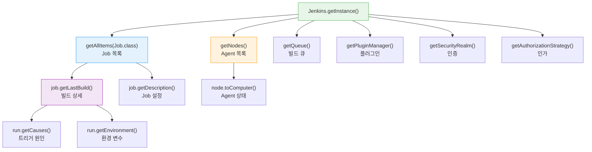
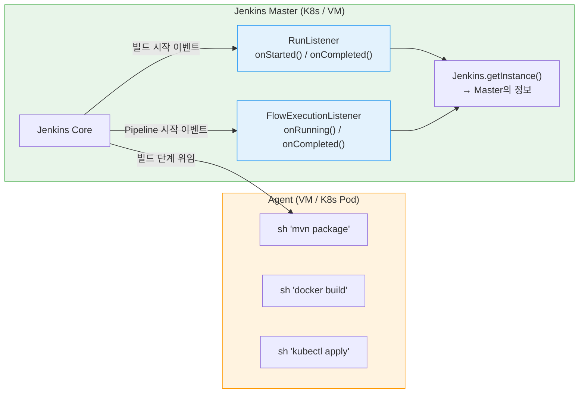

# Jenkins Internal API 가이드

---

> 이 문서를 읽고 나면 `Jenkins.getInstance()`를 진입점으로 인스턴스·Job·빌드·노드·크레덴셜·큐·플러그인·보안 정보를 **조회**하고, 실행 컨텍스트(Console·init·Pipeline)별 접근 가능 여부를 **구분**하며, 클러스터 환경에서 모든 Groovy 코드가 Master JVM에서 실행된다는 원칙으로 Listener가 보는 정보의 기준점을 **예측**할 수 있습니다. K8s Pod Agent의 정보가 `onFinalized()`에서 사라지는 현상도 **디버깅**할 수 있습니다.

> 이 문서는 `02-04.Groovy 기본 문법`의 후속입니다.

## 사전 지식

`02-02`의 Groovy 세 실행 영역과 Sandbox, `02-04`의 Groovy 기본 문법을 알고 있어야 합니다. Jenkins의 Master-Agent 구조(`03_agent/`)를 떠올릴 수 있으면 "Groovy는 Master에서, sh는 Agent에서"라는 원칙이 분명해집니다.

## 진입 — 왜 Jenkins 내부 조회가 필요한가

> 운영자는 "지금 빌드 큐에 몇 개가 밀려 있나", "어느 Agent가 오프라인인가", "이 Job의 마지막 실패 원인은 무엇인가"를 UI 클릭으로 일일이 뒤지는 대신 한 번의 Groovy 스크립트로 답하고 싶습니다.

Jenkins UI가 보여주는 모든 화면은 사실 내부 Java 객체 트리를 렌더링한 결과입니다. 그 객체 트리에 Groovy로 직접 접근하면 UI가 제공하지 않는 조합(예: "최근 7일간 30분 이상 큐에서 대기한 빌드")까지 한 번에 뽑아낼 수 있습니다. 이 문서는 그 진입점인 `Jenkins.getInstance()`에서 시작해 어떤 정보가 어떤 실행 컨텍스트에서 조회 가능한지를 정리합니다.

## 1. Jenkins Internal API 스펙 — Groovy로 조회 가능한 정보

> 이미 익숙한 Jenkins UI 화면들의 "데이터 출처" 측면을 코드로 들여다보는 일입니다.

> Jenkins의 모든 정보는 `Jenkins.getInstance()`를 진입점으로 Groovy에서 접근할 수 있습니다.
>
> - 카테고리별로 조회 가능한 정보와 API 호출 방법을 정리합니다.
> - 실행 컨텍스트(Script Console, init.groovy.d, Pipeline)에 따라 접근 가능 여부가 다르므로 함께 표기합니다.

### 1-1. Jenkins 인스턴스 정보

| 정보 | API 호출 | 반환 타입 | Console | init | Pipeline |
|------|---------|----------|:-------:|:----:|:--------:|
| Jenkins 버전 | `Jenkins.VERSION` | `String` | O | O | △ |
| Jenkins URL | `JenkinsLocationConfiguration.get().getUrl()` | `String` | O | O | X |
| JENKINS_HOME 경로 | `Jenkins.getInstance().getRootDir()` | `File` | O | O | X |
| 시스템 시간 | `new Date()` | `Date` | O | O | O |
| JVM 버전 | `System.getProperty('java.version')` | `String` | O | O | X |
| Heap 메모리 | `Runtime.getRuntime().maxMemory()` | `long` | O | O | X |
| 노드 수 | `Jenkins.getInstance().getNodes().size()` | `int` | O | O | X |
| Job 수 | `Jenkins.getInstance().getAllItems(Job.class).size()` | `int` | O | O | X |

- Pipeline 열의 △는 Sandbox 승인이 필요하다는 의미이고, X는 Sandbox에서 차단된다는 의미입니다.
- `Jenkins.getInstance()`는 Pipeline Sandbox에서 기본 차단되므로, Pipeline에서 시스템 정보를 조회하려면 Shared Library의 `@NonCPS` 메서드나 관리자의 Script Approval이 필요합니다.
- `@NonCPS`를 쓸 때는 그 메서드 안에서 `node`·`sh` 같은 Pipeline step을 호출하면 안 됩니다. `@NonCPS`는 네이티브 Groovy로 실행돼 성능은 좋지만, 내부에서 Pipeline step을 부르면 "expected to call WorkflowScript.X" 경고가 나며 동작하지 않습니다. 따라서 `@NonCPS` 메서드는 순수 조회(`Jenkins.getInstance().getNodes()` 등)에만 한정합니다. (출처: jenkins.io/doc/book/pipeline/cps-method-mismatches)

### 1-2. Job/Pipeline 정보

| 정보 | API 호출 | 반환 타입 | 설명 |
|------|---------|----------|------|
| 전체 Job 목록 | `jenkins.getAllItems(Job.class)` | `List<Job>` | Folder 포함 전체 재귀 탐색 |
| 특정 Job 조회 | `jenkins.getItemByFullName("folder/job")` | `Item` | 경로로 직접 접근 |
| Job 타입 | `job.getClass().simpleName` | `String` | FreeStyleProject, WorkflowJob 등 |
| 마지막 빌드 | `job.getLastBuild()` | `Run` | 가장 최근 빌드 |
| 마지막 성공 빌드 | `job.getLastSuccessfulBuild()` | `Run` | 성공한 최근 빌드 |
| 마지막 실패 빌드 | `job.getLastFailedBuild()` | `Run` | 실패한 최근 빌드 |
| 빌드 기록 전체 | `job.getBuilds()` | `RunList` | 모든 빌드 이력 |
| Job 활성 상태 | `job.isDisabled()` | `boolean` | 비활성화 여부 |
| Job 빌드 중 여부 | `job.isBuilding()` | `boolean` | 현재 빌드 실행 중인지 |
| Job 설명 | `job.getDescription()` | `String` | Job 설명 텍스트 |
| 빌드 보관 정책 | `job.getBuildDiscarder()` | `BuildDiscarder` | LogRotator 등 |

### 1-3. 빌드(Run) 상세 정보

| 정보 | API 호출 | 반환 타입 | 설명 |
|------|---------|----------|------|
| 빌드 번호 | `run.getNumber()` | `int` | `#42` |
| 빌드 결과 | `run.getResult()` | `Result` | SUCCESS, FAILURE, UNSTABLE 등 |
| 빌드 시간 | `run.getTimestamp()` | `Calendar` | 빌드 시작 시각 |
| 빌드 소요 시간 | `run.getDuration()` | `long` | 밀리초 단위 |
| 빌드 트리거 원인 | `run.getCauses()` | `List<Cause>` | UserIdCause, SCMTrigger 등 |
| 빌드 파라미터 | `run.getAction(ParametersAction)` | `ParametersAction` | 빌드 시 전달된 파라미터 |
| 환경 변수 | `run.getEnvironment(listener)` | `EnvVars` | 빌드 환경 변수 전체 |
| 부모 Job | `run.getParent()` | `Job` | 이 빌드가 속한 Job |
| 콘솔 로그 | `run.getLog(100)` | `List<String>` | 마지막 N줄의 콘솔 출력 |
| 아티팩트 | `run.getArtifacts()` | `List<Artifact>` | 빌드 산출물 목록 |

### 1-4. Node/Agent 정보

| 정보 | API 호출 | 반환 타입 | 설명 |
|------|---------|----------|------|
| 전체 노드 목록 | `jenkins.getNodes()` | `List<Node>` | Master 제외 |
| Master 포함 전체 | `jenkins.getComputers()` | `Computer[]` | Master(`built-in`) 포함 |
| 노드 이름 | `node.getDisplayName()` | `String` | 표시명 |
| 라벨 | `node.getLabelString()` | `String` | 할당된 라벨 |
| Executor 수 | `node.getNumExecutors()` | `int` | 총 executor 수 |
| 사용 중 Executor | `computer.countBusy()` | `int` | 현재 빌드 실행 중인 executor |
| 온라인 상태 | `computer.isOnline()` | `boolean` | 연결 상태 |
| 오프라인 원인 | `computer.getOfflineCause()` | `OfflineCause` | 오프라인 사유 |
| OS 정보 | `computer.getSystemProperties()` | `Map` | Agent의 JVM 시스템 프로퍼티 |
| 호스트명 | `computer.getHostName()` | `String` | Agent 호스트 주소 |
| 연결 시각 | `computer.getConnectTime()` | `long` | 마지막 연결 타임스탬프 |

### 1-5. Credentials 정보

| 정보 | API 호출 | 반환 타입 | 설명 |
|------|---------|----------|------|
| 전체 크레덴셜 목록 | `CredentialsProvider.lookupCredentials(StandardCredentials.class, jenkins, null, null)` | `List<StandardCredentials>` | 모든 크레덴셜 |
| 크레덴셜 ID | `credential.getId()` | `String` | 고유 식별자 |
| 크레덴셜 설명 | `credential.getDescription()` | `String` | 설명 텍스트 |
| Username/Password | `credential.username`, `credential.password.plainText` | `String` | ⚠️ 평문 노출 주의 |
| Secret Text | `credential.getSecret().plainText` | `String` | ⚠️ 평문 노출 주의 |
| Credential Store | `SystemCredentialsProvider` → `getStore()` | `CredentialsStore` | 등록/삭제용 |

- 크레덴셜 평문 접근은 Script Console과 init.groovy.d에서만 가능합니다.
- 이것은 설계상의 한계이며, Script Console 접근 권한을 극소수에게만 부여해야 하는 이유입니다.

Script Console은 동작하는 서버에 붙는 **관리자 디버거**에 비유할 수 있습니다. 디버거에 연결하면 실행 중인 프로세스의 메모리를 그대로 들여다보고 변수 값을 평문으로 읽을 수 있듯이, Script Console은 Master JVM 내부 객체에 제약 없이 접근해 크레덴셜 평문까지 읽습니다. 다만 이 비유는 *읽기·실행 권한의 무제한성*까지만 유효하고, 디버거가 보통 코드 흐름을 멈추고 단계 실행하는 부분에서 깨집니다. Script Console은 흐름을 멈추는 게 아니라 입력한 Groovy를 Master JVM에서 즉시 한 번 실행할 뿐입니다.

### 1-6. 빌드 큐 및 실행 정보

| 정보 | API 호출 | 반환 타입 | 설명 |
|------|---------|----------|------|
| 대기 중 빌드 | `jenkins.getQueue().getItems()` | `Queue.Item[]` | 큐에서 대기 중인 항목 |
| 대기 사유 | `queueItem.getWhy()` | `String` | 왜 대기 중인지 (executor 부족 등) |
| 대기 시작 시각 | `queueItem.getInQueueSince()` | `long` | 큐 진입 타임스탬프 |
| 실행 중 빌드 | `computer.getExecutors()` → `getCurrentExecutable()` | `Executable` | 현재 실행 중인 빌드 |
| 빌드 중인 Job | `job.isBuilding()` | `boolean` | 해당 Job이 현재 빌드 중인지 |

### 1-7. 플러그인 정보

| 정보 | API 호출 | 반환 타입 | 설명 |
|------|---------|----------|------|
| 설치된 플러그인 목록 | `jenkins.getPluginManager().getPlugins()` | `List<PluginWrapper>` | 전체 플러그인 |
| 플러그인 이름 | `plugin.getShortName()` | `String` | 플러그인 ID |
| 플러그인 버전 | `plugin.getVersion()` | `String` | 현재 버전 |
| 업데이트 가능 여부 | `plugin.hasUpdate()` | `boolean` | 업데이트 존재 여부 |
| 활성 상태 | `plugin.isActive()` | `boolean` | 활성화 여부 |
| 의존성 | `plugin.getDependencies()` | `List<Dependency>` | 이 플러그인이 의존하는 다른 플러그인 |

### 1-8. 보안 및 환경 설정

| 정보 | API 호출 | 반환 타입 | 설명 |
|------|---------|----------|------|
| 인증 방식 | `jenkins.getSecurityRealm()` | `SecurityRealm` | LDAP, Local DB 등 |
| 인가 전략 | `jenkins.getAuthorizationStrategy()` | `AuthorizationStrategy` | Matrix, 로그인 사용자 전체 권한 등 |
| CSRF 보호 | `jenkins.getCrumbIssuer()` | `CrumbIssuer` | null이면 비활성 |
| 전역 환경변수 | `jenkins.getGlobalNodeProperties()` → `EnvironmentVariablesNodeProperty` | `EnvVars` | 전역 환경변수 |
| JVM 시스템 프로퍼티 | `System.getProperties()` | `Properties` | JVM 레벨 설정 |

### 진입점 패턴

모든 조회의 시작은 `Jenkins.getInstance()`이며, 여기서 트리 형태로 하위 객체에 접근하는 구조입니다:



## 2. Listener와 Jenkins 정보 — 클러스터 환경에서의 기준점

> Jenkins가 클러스터로 구축되어 있을 때, Master가 K8s Pod이고 Agent(Slave)가 VM인 혼합 환경도 흔합니다.
>
> - RunListener나 FlowExecutionListener가 참조하는 Jenkins 정보는 어디를 기준으로 할까요?
> - 모든 Groovy 코드는 항상 Master JVM에서 실행된다는 원칙이 핵심입니다.

### 핵심 원칙: Groovy 코드는 항상 Master JVM에서 실행됩니다

이 원칙은 Listener에만 국한되지 않습니다. **Jenkins에서 실행되는 모든 Groovy 코드는 Master JVM에서 동작합니다.**

- Script Console, init.groovy.d, Shared Library의 vars/ 함수, src/ 클래스, Pipeline DSL의 오케스트레이션 로직까지 전부 Master에서 실행됩니다.
- Agent에서 실행되는 것은 `sh`, `bat`, `powershell` 같은 셸 명령어뿐입니다.

| 실행 컨텍스트 | 실행 위치 | 설명 |
|---|---|---|
| Script Console | **Master** | 관리자가 입력한 Groovy를 Master JVM에서 실행 |
| init.groovy.d | **Master** | Jenkins 시작 시 Master JVM에서 실행 |
| RunListener / FlowExecutionListener | **Master** | 이벤트 리스너로서 Master 프로세스 내부에서 동작 |
| vars/ 함수 (Shared Library) | **Master** | Pipeline 오케스트레이션의 일부로 Master에서 실행 |
| src/ 클래스 | **Master** | vars/ 함수가 import하여 Master에서 실행 |
| Pipeline DSL (`stage`, `node`, `parallel`) | **Master** | 빌드 흐름 제어는 Master가 담당 |
| `sh`, `bat`, `powershell` | **Agent** | 셸 명령어만 Agent 머신에서 실행 |

- `Jenkins.getInstance()`, `System.getProperties()`, `Runtime.getRuntime()` 등 모든 Jenkins/JVM API를 호출하면 반환되는 정보는 항상 Master의 것입니다.
- vars/ 함수에서 `Jenkins.getInstance().getNodes()`를 호출해도, Shared Library의 src/ 클래스에서 `System.getProperty('os.name')`을 호출해도, 결과는 Master JVM 기준입니다.



### Listener에서 접근하는 정보의 기준

| 정보 | 기준 | 설명 |
|------|------|------|
| `Jenkins.getInstance()` | **Master** | Master의 JVM 인스턴스 |
| `Jenkins.VERSION` | **Master** | Master에 설치된 Jenkins 버전 |
| `System.getProperties()` | **Master** | Master JVM의 시스템 프로퍼티 |
| `Runtime.getRuntime()` | **Master** | Master JVM의 메모리 정보 |
| `run.getParent()` | **Master** | Job 설정은 Master에 저장됨 |
| `run.getResult()` | **Master** | 빌드 결과는 Master가 수집 |
| `run.getCauses()` | **Master** | 트리거 정보는 Master에 기록 |
| `run.getEnvironment()` | **혼합** | Master 환경변수 + Agent의 `NODE_NAME` 등 |
| `computer.getHostName()` | **Agent** | Agent 머신의 호스트명 |
| `computer.getSystemProperties()` | **Agent** | Agent JVM의 시스템 프로퍼티 |

- `run.getEnvironment()`가 "혼합"인 이유는, 빌드 환경 변수 중 `JENKINS_URL`, `JOB_NAME`은 Master가 설정하고, `NODE_NAME`, `WORKSPACE`는 빌드가 실행되는 Agent의 정보이기 때문입니다.

### Agent 정보를 Listener에서 조회하는 방법

Listener의 `onStarted(Run run, TaskListener listener)` 시점에는 아직 빌드가 어떤 Agent에서 실행될지 확정되지 않았을 수 있습니다. Agent 정보가 필요하면 `onCompleted()` 시점에서 조회하는 것이 안전합니다.

```groovy
@Override
void onCompleted(Run run, TaskListener listener) {
    // onStarted가 아니라 onCompleted에서 조회한다 — 시작 시점엔 Agent가 미확정일 수 있다
    def executor = run.getExecutor()
    // null 체크: 빌드가 어떤 executor도 점유하지 못하고 끝나는 경우(취소 등) 방어
    if (executor != null) {
        def computer = executor.getOwner()
        def nodeName = computer.getName()          // Agent 이름
        def hostName = computer.getHostName()      // Agent 호스트
        def isOnline = computer.isOnline()         // Agent 상태

        // listener.getLogger()로 출력하면 해당 빌드의 콘솔 로그에 직접 남는다
        listener.getLogger().println(
            "[Hook] Built on: ${nodeName} (${hostName}), online: ${isOnline}"
        )
    }

    // Pipeline의 경우 여러 Agent(node 블록)에서 실행될 수 있으므로
    // getExecutor()는 마지막 executor만 돌려준다는 점에 주의
}
```

### K8s Pod Agent의 특수성

K8s Pod Agent 환경에서는 빌드가 완료되면 Pod이 삭제됩니다. Jenkins Run의 콜백 순서는 `onStarted()` → `onCompleted()` → `onFinalized()` 세 단계인데(출처: jenkins.io javadoc — RunListener.onStarted/onCompleted/onFinalized), Pod 정리는 보통 `onCompleted()`와 `onFinalized()` 사이의 짧은 구간에 일어납니다. `onCompleted()` 시점에는 아직 Pod이 살아 있으므로 Agent 정보를 조회할 수 있지만, `onFinalized()` 시점에는 이미 Pod이 삭제되어 `computer`가 null일 수 있습니다. 구체적 시나리오로, idleMinutes를 0으로 둔 Pod 템플릿이라면 빌드 종료 직후 Pod이 Terminating으로 들어가, `onFinalized()`가 호출될 때 `executor.getOwner()`가 이미 사라진 노드를 가리켜 null을 반환합니다.

```groovy
@Override
void onFinalized(Run run) {
    // K8s Pod Agent: 이 시점에 Pod이 이미 삭제되었을 수 있다
    def executor = run.getExecutor()
    // executor가 null일 가능성이 높다 — onCompleted()에서 미리 수집해야 한다
}
```

이 문제를 해결하는 패턴은 `onStarted()`나 `onCompleted()`에서 필요한 Agent 정보를 빌드의 Action으로 저장해두는 것입니다:

```groovy
import hudson.model.InvisibleAction

// InvisibleAction: UI에 노출되지 않고 빌드 메타데이터로만 저장된다
// Serializable: 빌드 기록(build.xml)에 직렬화 저장돼 재기동 후에도 살아남는다
class AgentInfoAction extends InvisibleAction implements Serializable {
    String nodeName
    String hostName
}

@Override
void onCompleted(Run run, TaskListener listener) {
    // 핵심: Pod이 살아 있는 onCompleted 시점에 미리 정보를 떠 둔다
    def executor = run.getExecutor()
    if (executor != null) {
        def action = new AgentInfoAction(
            nodeName: executor.getOwner().getName(),
            hostName: executor.getOwner().getHostName()
        )
        run.addAction(action)
        run.save()   // save()를 호출해야 build.xml에 영속화돼 onFinalized에서 읽을 수 있다
    }
}

@Override
void onFinalized(Run run) {
    // Pod이 삭제된 후에도 Action에서 Agent 정보를 꺼낼 수 있다
    def agentInfo = run.getAction(AgentInfoAction.class)
    if (agentInfo != null) {
        println "Built on: ${agentInfo.nodeName} (${agentInfo.hostName})"
    }
}
```

### 다중 Master(HA) 환경

- Jenkins를 고가용성(HA)으로 구성한 경우(예: CloudBees CI의 Controller-Agent 아키텍처), 각 Controller는 독립된 JVM입니다.
- Listener는 **해당 빌드를 관리하는 Controller**에서만 실행됩니다. Controller A의 빌드에 대한 Listener가 Controller B에서 실행되는 일은 없습니다.

오픈소스 Jenkins는 단일 Master 아키텍처이므로, HA 구성은 CloudBees CI나 별도의 로드밸런서 + 공유 스토리지 구성에서만 가능합니다. 이 경우에도 Listener의 기준점은 "이 빌드를 처리하는 Master JVM"이라는 원칙은 동일합니다.

## 면접 질문

> 답을 떠올린 뒤 정답 절에서 같은 번호로 대조하세요.

### 빈칸 채우기 — Jenkins 내부 조회

다음 문장의 빈칸을 채워 보세요. 정답은 문서 끝의 "빈칸 정답" 절에 있습니다.

1. 모든 조회의 진입점은 `Jenkins.____()`이며, 여기서 트리 형태로 하위 객체에 접근합니다.
2. Jenkins에서 실행되는 모든 Groovy 코드는 ____ JVM에서 동작하고, Agent에서 실행되는 것은 `sh`·`bat`·`powershell` 같은 ____ 명령어뿐입니다.
3. `@NonCPS` 메서드 안에서는 `node`·`sh` 같은 Pipeline ____을(를) 호출하면 안 됩니다.
4. K8s Pod Agent의 정보를 `onFinalized()`에서도 읽으려면, `onCompleted()`에서 `____Action`(Serializable)으로 빌드에 저장한 뒤 `run.____()`을 호출해 영속화해야 합니다.
5. `computer.getHostName()`이 반환하는 호스트명은 Master가 아니라 ____ 머신의 것입니다.

### 서술형 — 실행 컨텍스트와 기준점

1. 같은 `Jenkins.getInstance()` 호출이 Script Console·init.groovy.d에서는 되고 Pipeline에서는 기본 차단되는 이유는 무엇이며, Pipeline에서 굳이 써야 하면 어떻게 하나요?
2. Master가 K8s Pod이고 Agent가 VM인 혼합 환경에서, RunListener의 `Jenkins.getInstance()`나 `System.getProperties()`는 누구의 정보를 돌려주나요? 그 근거 원칙은?
3. K8s Pod Agent에서 빌드한 Agent 정보를 `onFinalized()`에서 읽으려 하면 왜 null이 나오고, 어떻게 해결하나요?

## 정답

> 위 질문을 스스로 설명해 본 뒤에 펼치세요.

### 정답 1 — Sandbox 차단과 우회

`Jenkins.getInstance()`는 시스템 레벨 API라 Pipeline Sandbox에서 기본 차단됩니다. 개발자가 작성하는 Pipeline은 신뢰 경계 밖이라, 임의 코드가 Master 전체에 접근하면 위험하기 때문입니다. Script Console·init.groovy.d는 관리자·시스템이 실행하는 신뢰 영역이라 차단이 없습니다. Pipeline에서 꼭 써야 하면 Shared Library의 `@NonCPS` 메서드로 감싸거나, 관리자가 In-process Script Approval로 해당 메서드를 승인하는 경로를 씁니다.

### 정답 2 — 모든 Groovy는 Master JVM에서

Master의 정보를 돌려줍니다. 핵심 원칙은 "Jenkins에서 실행되는 모든 Groovy 코드는 Master JVM에서 동작한다"이고, Agent에서 실행되는 것은 `sh`·`bat`·`powershell` 같은 셸 명령어뿐입니다. RunListener·init.groovy.d·vars/·src/·Pipeline 오케스트레이션이 전부 Master에서 돌기 때문에, `Jenkins.getInstance()`나 `System.getProperties()`·`Runtime.getRuntime()`은 Agent가 어디에 있든 Master JVM 기준 값을 반환합니다. 단 `computer.getHostName()`·`computer.getSystemProperties()`는 Agent 기준입니다.

### 정답 3 — Pod 삭제와 Action 저장 패턴

K8s Pod Agent는 빌드가 끝나면 Pod이 삭제됩니다. `onCompleted()` 시점엔 아직 Pod이 살아 있어 Agent 정보를 읽을 수 있지만, `onFinalized()` 시점엔 이미 삭제돼 `executor`/`computer`가 null이 되기 쉽습니다. 해결책은 `onCompleted()`에서 nodeName·hostName 같은 필요한 정보를 `InvisibleAction`(Serializable)으로 빌드에 `addAction` 후 `save`해 두는 것입니다. 그러면 Pod이 사라진 뒤 `onFinalized()`에서도 `run.getAction(...)`으로 그 정보를 꺼낼 수 있습니다.

## 핵심 정리

| 개념 | 핵심 | 왜 중요한가 |
|------|------|------------|
| **Jenkins.getInstance()** | 모든 Jenkins 정보의 진입점 | Groovy 커스터마이징의 출발점 |
| **Listener 기준점** | 항상 Master JVM에서 실행 | Agent 위치와 무관하게 Master 정보 기준 |
| **K8s Pod Agent** | Pod 삭제 후 Agent 정보 사라짐 | `onCompleted()`에서 미리 수집 필요 |

### 빈칸 정답 — Jenkins 내부 조회

1. `Jenkins.getInstance()`
2. **Master** JVM / **셸**(shell) 명령어
3. Pipeline **step**
4. `InvisibleAction`(또는 `AgentInfoAction`) / `run.save()`
5. **Agent**

## 관련 문서

> Groovy 내부 조회는 커스터마이징 시리즈의 한 갈래입니다. 문법 기초와 Listener·Hook 구현, 그리고 그 정보를 가져다 쓰는 실전 연동 편을 함께 보면 전체 그림이 잡힙니다.

- [02-04. Groovy 기본 문법](02-04.Groovy%20%EA%B8%B0%EB%B3%B8%20%EB%AC%B8%EB%B2%95.md) § "클로저" — 이 문서가 전제하는 Groovy 문법 기초
- [02-05a. RunListener와 FlowExecutionListener](02-05a.RunListener%EC%99%80%20FlowExecutionListener.md) § "onCompleted" — 여기서 조회한 정보를 실제 Listener에서 활용하는 구현
- [02-05. 전역 파이프라인 Hook](02-05.%EC%A0%84%EC%97%AD%20%ED%8C%8C%EC%9D%B4%ED%94%84%EB%9D%BC%EC%9D%B8%20Hook.md) § "전역 Hook" — Master JVM 실행 원칙이 적용되는 또 다른 사례
- [02-03. groovy 커스텀터마이징 한계](02-03.groovy%20%EC%BB%A4%EC%8A%A4%ED%85%80%ED%84%B0%EB%A7%88%EC%9D%B4%EC%A7%95%20%ED%95%9C%EA%B3%84.md) § "Sandbox" — Pipeline에서 내부 API가 차단되는 경계
- [02-06. GCP K8s Jenkins 실전](02-06.GCP%20K8s%20Jenkins%20%EC%8B%A4%EC%A0%84.md) § "Pod Agent" — K8s Pod Agent의 생명주기와 실전 운영
