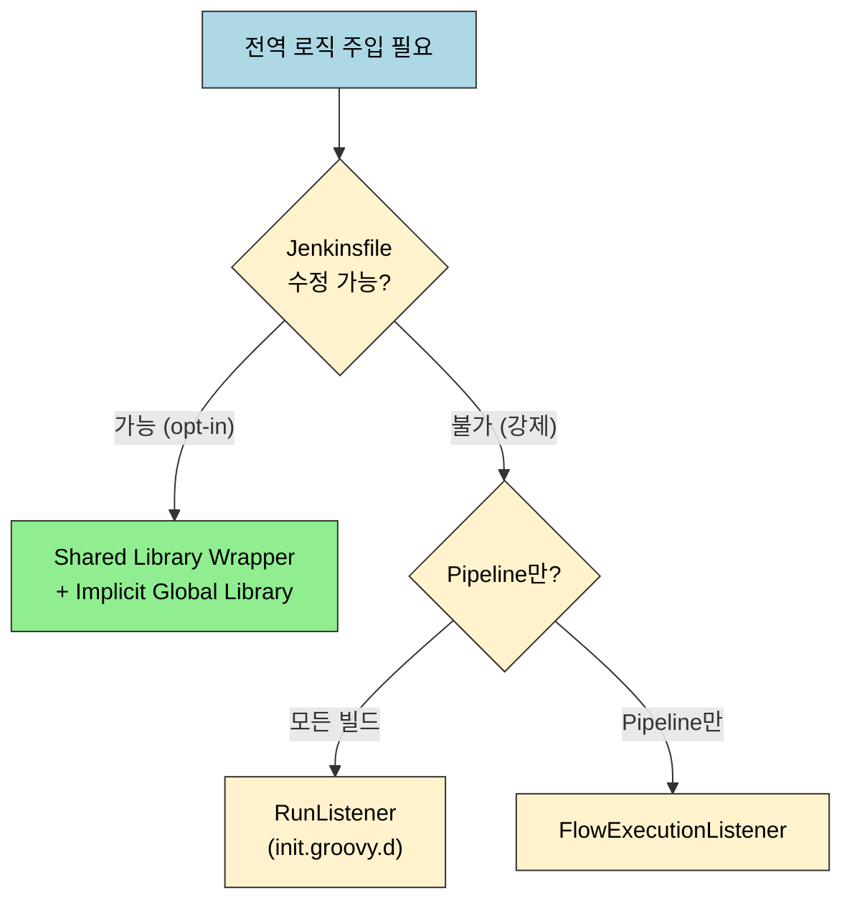
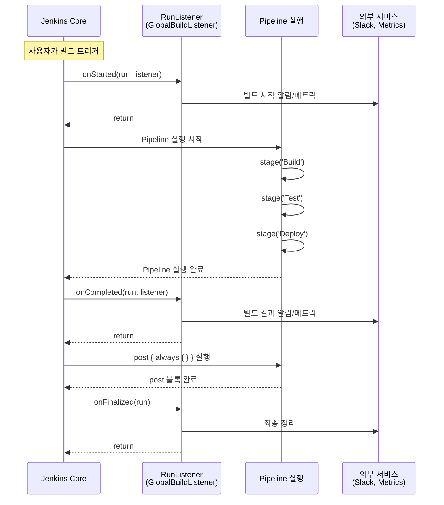

# 전역 파이프라인 Hook: 모든 빌드에 로직 주입하기

---

> "모든 파이프라인의 빌드 시작 시 Slack 알림을 보내고, 완료 시 결과를 기록하고 싶다"는 요구사항이 있을 때, 각 Jenkinsfile을 수정하는 것은 비현실적입니다.
>
> 프로젝트가 100개가 넘으면 더더욱 그렇습니다. Jenkins는 이런 전역 Hook을 구현하는 여러 메커니즘을 제공하며, 각각 적용 범위와 강제성이 다릅니다.

## §학습 목표

> 이 문서를 읽고 나면 전역 Hook 다섯 접근법(Shared Library Wrapper·Implicit Global Library·RunListener·FlowExecutionListener·Organization Default Jenkinsfile)을 강제성과 Jenkinsfile 수정 여부로 구분하고, Jenkinsfile을 건드리지 않고 모든 빌드에 강제 적용하려면 왜 RunListener(init.groovy.d)가 필요한지 설명할 수 있습니다.

## §사전 지식

> `02-01`의 Shared Library 구조와 `@Library` 로딩, `02-02`의 init.groovy.d 실행 컨텍스트를 알고 있어야 합니다. Pipeline의 `post` 블록과 빌드 수명주기(시작·완료) 개념을 떠올릴 수 있으면 좋습니다.

### 전역 Hook 접근법 비교

다섯 접근법은 "강제성"과 "Jenkinsfile 수정 필요 여부"라는 두 축으로 갈립니다.



| 접근법                           | 강제성 | 적용 대상   | Jenkinsfile 수정   | 권장도      |
| -------------------------------- | ------ | ----------- | ------------------ | ----------- |
| Shared Library Wrapper           | Opt-in | Pipeline    | 필요 (`@Library`)  | 가장 권장   |
| Implicit Global Library          | Opt-in | Pipeline    | 불필요 (자동 로드) | 권장        |
| RunListener (init.groovy.d)      | 강제   | 모든 빌드   | 불필요             | 조건부 권장 |
| FlowExecutionListener            | 강제   | Pipeline만  | 불필요             | 조건부 권장 |
| Organization Default Jenkinsfile | 강제   | Multibranch | 불필요             | 특수 상황   |

## 1. Shared Library Wrapper (가장 권장)

> 각 팀이 자발적으로 사용하는 방식입니다. Shared Library에 래퍼 함수를 만들고, 각 Jenkinsfile에서 호출합니다. 팀별로 opt-in이므로 부작용 제어가 쉽습니다.

```groovy
// vars/standardPipeline.groovy (Shared Library)
def call(Map config = [:], Closure body) {
    // --- 전역 Pre-Hook ---
    slackSend(channel: '#ci-notifications',
              message: "Build started: ${env.JOB_NAME} #${env.BUILD_NUMBER}")

    def startTime = System.currentTimeMillis()

    try {
        // 실제 Pipeline 로직 실행
        body()

        // --- 전역 Post-Hook (성공) ---
        def duration = (System.currentTimeMillis() - startTime) / 1000
        slackSend(channel: '#ci-notifications', color: 'good',
                  message: "Build SUCCESS: ${env.JOB_NAME} #${env.BUILD_NUMBER} (${duration}s)")
    } catch (Exception e) {
        // --- 전역 Post-Hook (실패) ---
        slackSend(channel: '#ci-notifications', color: 'danger',
                  message: "Build FAILED: ${env.JOB_NAME} #${env.BUILD_NUMBER}\n${e.message}")
        throw e
    }
}
```

```groovy
// Jenkinsfile (사용 측) — @Library로 명시적 로드
@Library('my-shared-lib') _

standardPipeline {
    pipeline {
        agent any
        stages {
            stage('Build') {
                steps {
                    sh 'mvn clean package'
                }
            }
        }
    }
}
```

- 이 방식의 장점은 **버전 관리**가 된다는 것입니다.
- `@Library('my-shared-lib@v2.1.0') _`처럼 특정 버전을 고정할 수 있고, 라이브러리 변경이 모든 프로젝트에 즉시 영향을 주지 않습니다.
- 단점은 각 Jenkinsfile이 래퍼를 호출해야 한다는 것입니다.

## 2. Implicitly Loaded Global Library

> Jenkins 관리 > Configure System > Global Pipeline Libraries에서 **"Load implicitly"**를 체크하면, 모든 Pipeline에서 `@Library` 선언 없이 Shared Library의 `vars/` 함수를 사용할 수 있습니다.

```yaml
# CasC로 Implicit Global Library 설정
unclassified:
  globalLibraries:
    libraries:
      - name: "global-hooks"
        defaultVersion: "main"
        implicit: true              # 핵심: 모든 Pipeline에 자동 로드
        allowVersionOverride: false  # 버전 오버라이드 금지 (일관성 보장)
        retriever:
          modernSCM:
            scm:
              git:
                remote: "https://github.com/company/jenkins-global-hooks.git"
                credentialsId: "git-credentials"
```

```groovy
// vars/globalHooks.groovy (Implicit Global Library)
// 모든 Pipeline에서 globalHooks.xxx()로 호출 가능

class globalHooks implements Serializable {

    static void notifyBuildStart(script) {
        script.echo "[Global Hook] Build started: ${script.env.JOB_NAME}"
        // Slack, Teams, 메트릭 수집 등
    }

    static void notifyBuildEnd(script, String result) {
        script.echo "[Global Hook] Build ${result}: ${script.env.JOB_NAME}"
    }

    static void enforceBuildTimeout(script, int minutes = 60) {
        // 전역 타임아웃 정책 강제
        script.timeout(time: minutes, unit: 'MINUTES') {
            script.echo "Build timeout set to ${minutes} minutes"
        }
    }
}
```

- Implicit Loading은 함수를 "사용 가능"하게 만들 뿐이지, 자동으로 실행하지는 않습니다.
- 각 Jenkinsfile이 `globalHooks.notifyBuildStart(this)`를 호출해야 합니다.
- 진짜 "Jenkinsfile 수정 없이 모든 빌드에 강제 적용"하려면 다음 접근법이 필요합니다.

## 3. RunListener — 진짜 전역 Hook (init.groovy.d)

> `RunListener`는 Jenkins의 내부 이벤트 리스너로, **모든 빌드의 시작/완료/삭제** 이벤트에 반응합니다.
>
> - Jenkinsfile을 전혀 수정하지 않아도 모든 빌드에 강제 적용됩니다.
> - 이것이 "전역 로직을 넣는" 방법의 핵심입니다.

```groovy
// init.groovy.d/10-global-build-listener.groovy
import hudson.model.listeners.RunListener
import hudson.model.Run
import hudson.model.TaskListener

// RunListener를 상속한 커스텀 리스너 정의
class GlobalBuildListener extends RunListener<Run> {

    // --- 빌드 시작 시 호출 ---
    @Override
    void onStarted(Run run, TaskListener listener) {
        def jobName = run.getParent().getFullName()
        def buildNumber = run.getNumber()
        def startedBy = run.getCause(hudson.model.Cause.UserIdCause)?.getUserId() ?: 'system'

        listener.getLogger().println("[Global Hook] Build #${buildNumber} started by ${startedBy}")

        // 예시: 빌드 시작 메트릭 수집
        // pushMetric("jenkins.build.started", jobName, buildNumber)

        // 예시: 특정 시간대 빌드 차단 (배포 동결 기간)
        // def hour = new Date().getHours()
        // if (hour >= 22 || hour < 6) {
        //     listener.getLogger().println("WARNING: Building during maintenance window")
        // }
    }

    // --- 빌드 완료 시 호출 ---
    @Override
    void onCompleted(Run run, TaskListener listener) {
        def jobName = run.getParent().getFullName()
        def buildNumber = run.getNumber()
        def result = run.getResult()?.toString() ?: 'UNKNOWN'
        def duration = run.getDuration()

        listener.getLogger().println("[Global Hook] Build #${buildNumber} completed: ${result} (${duration}ms)")

        // 예시: 빌드 실패 시 Slack 알림
        if (result == 'FAILURE') {
            // sendSlackNotification("#alerts", "FAILED: ${jobName} #${buildNumber}")
        }

        // 예시: 빌드 시간 메트릭 기록
        // pushMetric("jenkins.build.duration", jobName, duration)

        // 예시: 빌드 결과를 외부 대시보드에 전송
        // postToApi("https://metrics.company.com/builds", [
        //     job: jobName, build: buildNumber, result: result, duration: duration
        // ])
    }

    // --- 빌드 삭제 시 호출 ---
    @Override
    void onDeleted(Run run) {
        def jobName = run.getParent().getFullName()
        println "[Global Hook] Build #${run.getNumber()} deleted from ${jobName}"
    }

    // --- 빌드 최종 완료 시 호출 (모든 post 액션 이후) ---
    @Override
    void onFinalized(Run run) {
        // onCompleted 이후, post { always { } } 블록까지 모두 실행된 후 호출
        // 최종 정리 작업에 적합
    }
}

// 리스너 등록
RunListener.all().add(new GlobalBuildListener())
println "[init] Global build listener registered."
```



**RunListener의 4가지 이벤트**:

| 이벤트        | 호출 시점                  | 용도                                   |
| ------------- | -------------------------- | -------------------------------------- |
| `onStarted`   | 빌드 시작 직후             | 시작 알림, 메트릭 기록, 배포 동결 검사 |
| `onCompleted` | 빌드 결과 확정 직후        | 결과 알림, 실패 분석, 성공/실패 메트릭 |
| `onFinalized` | post 블록까지 모두 실행 후 | 최종 정리, 리소스 해제                 |
| `onDeleted`   | 빌드 기록 삭제 시          | 외부 시스템의 빌드 기록 정리           |

**주의사항**: RunListener는 Jenkins의 모든 빌드(Freestyle, Pipeline, Multibranch 등)에 적용됩니다. 특정 Job만 대상으로 하려면 `onStarted` 내부에서 Job 이름이나 타입으로 필터링해야 합니다.

```groovy
// 특정 폴더의 Job만 Hook 적용
@Override
void onStarted(Run run, TaskListener listener) {
    def jobName = run.getParent().getFullName()

    // "production/" 폴더 하위의 Job만 대상
    if (!jobName.startsWith("production/")) {
        return
    }

    // Hook 로직 실행
    listener.getLogger().println("[Prod Hook] Production build started: ${jobName}")
}
```

## 면접 질문

> 답을 떠올린 뒤 §정답 절에서 같은 번호로 대조하세요.

1. "모든 빌드 시작 시 Slack 알림"을 100개 프로젝트에 적용해야 합니다. Shared Library Wrapper와 RunListener 중 무엇을 언제 고르나요?
2. Implicit Global Library로 라이브러리를 자동 로드하면 "Jenkinsfile 수정 없이 모든 빌드에 강제 적용"이 되나요? 안 된다면 무엇이 진짜 강제 적용 수단인가요?
3. RunListener는 모든 빌드에 적용됩니다. 특정 폴더의 Job만 대상으로 하려면 어떻게 하나요? `onStarted`·`onCompleted`·`onFinalized`는 각각 언제 호출되나요?

## 정답

> 위 질문을 스스로 설명해 본 뒤에 펼치세요.

### 정답 1 — Wrapper vs RunListener

Jenkinsfile을 수정할 수 있고 팀이 자발적으로 따를 수 있으면 **Shared Library Wrapper**가 가장 권장됩니다. 버전 고정(`@Library('lib@v2.1.0')`)이 되어 라이브러리 변경이 모든 프로젝트에 즉시 번지지 않기 때문입니다. 반면 Jenkinsfile을 건드릴 수 없는 레거시·외부팀 잡까지 **강제로** 적용해야 하면, init.groovy.d에 등록한 **RunListener**가 답입니다. Jenkinsfile 수정 없이 모든 빌드의 시작/완료를 잡습니다.

### 정답 2 — Implicit Loading은 강제 적용이 아니다

안 됩니다. Implicit Global Library는 함수를 "사용 가능"하게 만들 뿐, 자동으로 실행하지는 않습니다. 각 Jenkinsfile이 여전히 `globalHooks.notifyBuildStart(this)`처럼 호출해야 합니다. 진짜 "Jenkinsfile 수정 없이 모든 빌드에 강제 적용"하는 수단은 RunListener(모든 빌드) 또는 FlowExecutionListener(Pipeline만)입니다.

### 정답 3 — 필터링과 이벤트 시점

특정 폴더만 대상으로 하려면 `onStarted` 안에서 `run.getParent().getFullName()`이 `"production/"`으로 시작하는지 검사하고 아니면 `return`합니다. 이벤트 시점은 `onStarted`가 빌드 시작 직후, `onCompleted`가 빌드 결과 확정 직후, `onFinalized`가 `post { always { } }` 블록까지 모두 실행된 후입니다. 최종 정리·리소스 해제는 `onFinalized`에 둡니다.
