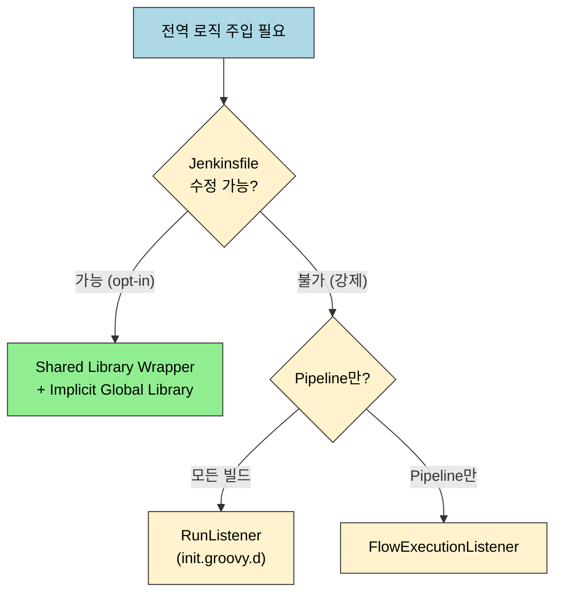
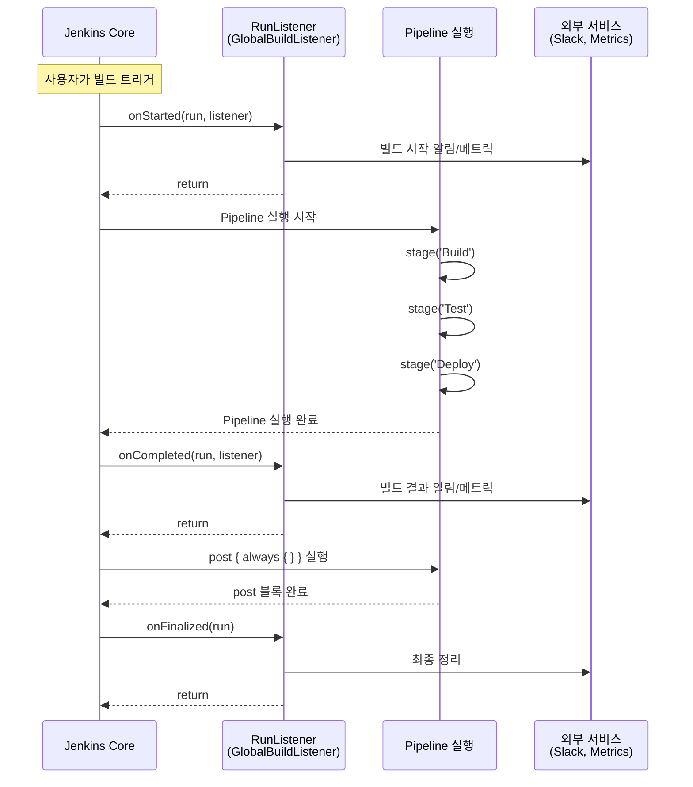

# 전역 파이프라인 Hook: 모든 빌드에 로직 주입하기

---

> 이 문서를 읽고 나면 전역 Hook 다섯 접근법(Shared Library Wrapper·Implicit Global Library·RunListener·FlowExecutionListener·Organization Default Jenkinsfile)을 강제성과 Jenkinsfile 수정 여부 두 축으로 **비교**하고, Jenkinsfile을 건드리지 않고 모든 빌드에 강제 적용하려면 왜 RunListener(init.groovy.d)를 골라야 하는지 **설명**하며, RunListener와 FlowExecutionListener의 적용 대상 차이를 보고 어느 쪽을 쓸지 **선택**하고, 특정 폴더만 대상으로 거를 때 필터 위치를 잘못 두면 어떤 빌드까지 새는지 **예측**할 수 있습니다.


## 사전 지식

> `02-01`의 Shared Library 구조와 `@Library` 로딩, `02-02`의 init.groovy.d 실행 컨텍스트를 알고 있어야 합니다. Pipeline의 `post` 블록과 빌드 수명주기(시작·완료) 개념을 떠올릴 수 있으면 좋습니다.


## 진입 — 왜 전역 Hook이 필요한가

> "모든 파이프라인의 빌드 시작 시 Slack 알림을 보내고, 완료 시 결과를 기록하고 싶다"는 요구사항이 있을 때, 각 Jenkinsfile을 일일이 수정하는 것은 비현실적입니다. 프로젝트가 100개가 넘으면 더더욱 그렇고, 외부팀이 소유한 레거시 잡은 손댈 권한조차 없을 수 있습니다. Jenkins는 이런 횡단 관심사(cross-cutting concern)를 한 곳에 모아 주입하는 여러 메커니즘을 제공하며, 각각 적용 범위와 강제성이 다릅니다. 어느 것을 고르느냐는 "Jenkinsfile을 고칠 수 있는가"와 "팀의 자발적 협조를 기대할 수 있는가"로 갈립니다.


## 1. 전역 Hook 접근법 비교

> 이것은 이미 익숙한 **공통 미들웨어**의 Jenkins 빌드 측면입니다. 웹 프레임워크에서 모든 요청 앞뒤로 인증·로깅을 끼우는 미들웨어처럼, 전역 Hook은 모든 빌드 앞뒤로 알림·메트릭·정책 검사를 끼웁니다.

전역 Hook을 **공통 미들웨어**에 비유하면 이해가 빠릅니다. Express의 `app.use()`나 Spring의 `Filter`처럼, 개별 핸들러(=Jenkinsfile)를 건드리지 않고 파이프라인 바깥에서 로직을 감쌉니다. 다만 이 비유는 "한 프로세스 안의 요청 체인"까지는 들어맞지만, **미들웨어는 코드로 등록 순서를 100% 통제하는 반면 Jenkins의 RunListener는 여러 플러그인이 등록한 리스너들의 호출 순서를 보장하지 않는다**는 점에서 깨집니다. 순서 의존 로직을 RunListener에 두면 안 됩니다.

다섯 접근법은 "강제성"과 "Jenkinsfile 수정 필요 여부"라는 두 축으로 갈립니다.

다섯 접근법은 "강제성"과 "Jenkinsfile 수정 필요 여부"라는 두 축으로 갈립니다.



| 접근법                           | 강제성 | 적용 대상   | Jenkinsfile 수정   | 권장도      |
| -------------------------------- | ------ | ----------- | ------------------ | ----------- |
| Shared Library Wrapper           | Opt-in | Pipeline    | 필요 (`@Library`)  | 가장 권장   |
| Implicit Global Library          | Opt-in | Pipeline    | 불필요 (자동 로드) | 권장        |
| RunListener (init.groovy.d)      | 강제   | 모든 빌드   | 불필요             | 조건부 권장 |
| FlowExecutionListener            | 강제   | Pipeline만  | 불필요             | 조건부 권장 |
| Organization Default Jenkinsfile | 강제   | Multibranch | 불필요             | 특수 상황   |


## 2. Shared Library Wrapper (가장 권장)

> 각 팀이 자발적으로 사용하는 방식입니다. Shared Library에 래퍼 함수를 만들고, 각 Jenkinsfile에서 호출합니다. 팀별로 opt-in이므로 부작용 제어가 쉽습니다.

`vars/` 디렉토리의 파일 이름(basename)이 곧 Pipeline 전역 변수 이름이 되고, 각 `.groovy`의 `call()` 구현이 step처럼 호출됩니다(출처: jenkins.io/doc/book/pipeline/shared-libraries). 그래서 아래 `standardPipeline.groovy`는 Jenkinsfile에서 `standardPipeline { ... }`으로 쓰입니다.

```groovy
// vars/standardPipeline.groovy (Shared Library)
def call(Map config = [:], Closure body) {
    // --- 전역 Pre-Hook --- (모든 빌드 앞에 똑같이 끼우는 횡단 로직)
    slackSend(channel: '#ci-notifications',
              message: "Build started: ${env.JOB_NAME} #${env.BUILD_NUMBER}")

    // 시작 시각을 잡아 두는 이유: post-hook에서 소요 시간을 계산하려고
    def startTime = System.currentTimeMillis()

    try {
        // body()가 사용 측 Jenkinsfile이 넘긴 실제 Pipeline 클로저
        body()

        // --- 전역 Post-Hook (성공) --- try 블록 끝까지 왔다면 본문이 예외 없이 끝난 것
        def duration = (System.currentTimeMillis() - startTime) / 1000
        slackSend(channel: '#ci-notifications', color: 'good',
                  message: "Build SUCCESS: ${env.JOB_NAME} #${env.BUILD_NUMBER} (${duration}s)")
    } catch (Exception e) {
        // --- 전역 Post-Hook (실패) --- 알림만 보내고 throw로 다시 던져야 빌드가 실제 FAILURE로 표시됨
        slackSend(channel: '#ci-notifications', color: 'danger',
                  message: "Build FAILED: ${env.JOB_NAME} #${env.BUILD_NUMBER}\n${e.message}")
        throw e  // 삼키면 실패가 성공으로 둔갑하므로 반드시 재전파
    }
}
```

```groovy
// Jenkinsfile (사용 측) — @Library로 명시적 로드
@Library('my-shared-lib') _

standardPipeline {
    pipeline {
        agent any
        stages {
            stage('Build') {
                steps {
                    sh 'mvn clean package'
                }
            }
        }
    }
}
```

- 이 방식의 장점은 **버전 관리**가 된다는 것입니다.
- `@Library('my-shared-lib@v2.1.0') _`처럼 특정 버전을 고정할 수 있고, 라이브러리 변경이 모든 프로젝트에 즉시 영향을 주지 않습니다.
- 단점은 각 Jenkinsfile이 래퍼를 호출해야 한다는 것입니다.


## 3. Implicitly Loaded Global Library

> Manage Jenkins > System > Global Trusted Pipeline Libraries에서 **"Load implicitly"**를 체크하면, 모든 Pipeline에서 `@Library` 선언 없이 Shared Library의 `vars/` 함수를 사용할 수 있습니다.

전역 Trusted 라이브러리는 sandbox 제약 없이 Java/Groovy/Jenkins API 전체에 접근하므로(출처: jenkins.io/doc/book/pipeline/shared-libraries), 관리자만 등록할 수 있고 신뢰 코드로만 채워야 합니다. 반대로 folder-level 라이브러리는 항상 untrusted(sandbox)로 동작합니다.

```yaml
# CasC로 Implicit Global Library 설정
unclassified:
  globalLibraries:
    libraries:
      - name: "global-hooks"
        defaultVersion: "main"        # 버전 미지정 호출 시 사용할 기본 ref
        implicit: true                # 핵심: @Library 없이 모든 Pipeline에 자동 로드
        allowVersionOverride: false   # @Library('global-hooks@x')로 버전 갈아끼우기 차단 → 전사 일관성 강제
        retriever:
          modernSCM:
            scm:
              git:
                remote: "https://github.com/company/jenkins-global-hooks.git"
                credentialsId: "git-credentials"  # private repo 접근용 — 토큰 하드코딩 대신 자격증명 ID 참조
```

```groovy
// vars/globalHooks.groovy (Implicit Global Library)
// 모든 Pipeline에서 globalHooks.xxx()로 호출 가능

class globalHooks implements Serializable {

    static void notifyBuildStart(script) {
        script.echo "[Global Hook] Build started: ${script.env.JOB_NAME}"
        // Slack, Teams, 메트릭 수집 등
    }

    static void notifyBuildEnd(script, String result) {
        script.echo "[Global Hook] Build ${result}: ${script.env.JOB_NAME}"
    }

    static void enforceBuildTimeout(script, int minutes = 60) {
        // 전역 타임아웃 정책 강제
        script.timeout(time: minutes, unit: 'MINUTES') {
            script.echo "Build timeout set to ${minutes} minutes"
        }
    }
}
```

- Implicit Loading은 함수를 "사용 가능"하게 만들 뿐이지, 자동으로 실행하지는 않습니다.
- 각 Jenkinsfile이 `globalHooks.notifyBuildStart(this)`를 호출해야 합니다.
- 진짜 "Jenkinsfile 수정 없이 모든 빌드에 강제 적용"하려면 다음 접근법이 필요합니다.


## 4. RunListener — 진짜 전역 Hook (init.groovy.d)

> `RunListener`는 Jenkins의 내부 이벤트 리스너로, **모든 빌드의 시작/완료/삭제** 이벤트에 반응합니다.
>
> - Jenkinsfile을 전혀 수정하지 않아도 모든 빌드에 강제 적용됩니다.
> - 이것이 "전역 로직을 넣는" 방법의 핵심입니다.

```groovy
// init.groovy.d/10-global-build-listener.groovy
import hudson.model.listeners.RunListener
import hudson.model.Run
import hudson.model.TaskListener

// RunListener<Run>를 상속하면 Run(=한 번의 빌드)의 모든 수명 이벤트를 가로챔
class GlobalBuildListener extends RunListener<Run> {

    // --- 빌드 시작 시 호출 ---
    @Override
    void onStarted(Run run, TaskListener listener) {
        def jobName = run.getParent().getFullName()      // 폴더 경로 포함 풀네임 (예: production/web-api)
        def buildNumber = run.getNumber()
        // 트리거한 사용자를 캐스팅으로 추출, 없으면(스케줄·webhook 등) 'system'으로 폴백
        def startedBy = run.getCause(hudson.model.Cause.UserIdCause)?.getUserId() ?: 'system'

        // listener.getLogger()는 빌드 콘솔 로그로 직결 → println 대신 이걸 써야 빌드 로그에 남음
        listener.getLogger().println("[Global Hook] Build #${buildNumber} started by ${startedBy}")

        // 예시: 빌드 시작 메트릭 수집
        // pushMetric("jenkins.build.started", jobName, buildNumber)

        // 예시: 특정 시간대 빌드 차단 (배포 동결 기간)
        // def hour = new Date().getHours()
        // if (hour >= 22 || hour < 6) {
        //     listener.getLogger().println("WARNING: Building during maintenance window")
        // }
    }

    // --- 빌드 완료 시 호출 ---
    @Override
    void onCompleted(Run run, TaskListener listener) {
        def jobName = run.getParent().getFullName()
        def buildNumber = run.getNumber()
        def result = run.getResult()?.toString() ?: 'UNKNOWN'
        def duration = run.getDuration()

        listener.getLogger().println("[Global Hook] Build #${buildNumber} completed: ${result} (${duration}ms)")

        // 예시: 빌드 실패 시 Slack 알림
        if (result == 'FAILURE') {
            // sendSlackNotification("#alerts", "FAILED: ${jobName} #${buildNumber}")
        }

        // 예시: 빌드 시간 메트릭 기록
        // pushMetric("jenkins.build.duration", jobName, duration)

        // 예시: 빌드 결과를 외부 대시보드에 전송
        // postToApi("https://metrics.company.com/builds", [
        //     job: jobName, build: buildNumber, result: result, duration: duration
        // ])
    }

    // --- 빌드 삭제 시 호출 ---
    @Override
    void onDeleted(Run run) {
        def jobName = run.getParent().getFullName()
        println "[Global Hook] Build #${run.getNumber()} deleted from ${jobName}"
    }

    // --- 빌드 최종 완료 시 호출 (모든 post 액션 이후) ---
    @Override
    void onFinalized(Run run) {
        // onCompleted 이후, post { always { } } 블록까지 모두 실행된 후 호출
        // 최종 정리 작업에 적합
    }
}

// init.groovy.d 스크립트는 Jenkins 부팅 시 1회 실행됨 → 여기서 리스너를 전역 레지스트리에 등록
RunListener.all().add(new GlobalBuildListener())
println "[init] Global build listener registered."  // 이 println은 부팅 로그(콘솔)에 남음
```



**RunListener의 4가지 이벤트**:

| 이벤트        | 호출 시점                  | 용도                                   |
| ------------- | -------------------------- | -------------------------------------- |
| `onStarted`   | 빌드 시작 직후             | 시작 알림, 메트릭 기록, 배포 동결 검사 |
| `onCompleted` | 빌드 결과 확정 직후        | 결과 알림, 실패 분석, 성공/실패 메트릭 |
| `onFinalized` | post 블록까지 모두 실행 후 | 최종 정리, 리소스 해제                 |
| `onDeleted`   | 빌드 기록 삭제 시          | 외부 시스템의 빌드 기록 정리           |

**주의사항**: RunListener는 Jenkins의 모든 빌드(Freestyle, Pipeline, Multibranch 등)에 적용됩니다. 특정 Job만 대상으로 하려면 `onStarted` 내부에서 Job 이름이나 타입으로 필터링해야 합니다.

**RunListener와 FlowExecutionListener의 차이**: 둘 다 init.groovy.d로 등록하는 강제 Hook이지만 잡는 수명이 다릅니다. `RunListener`는 **빌드(Run)의 수명** — 시작·완료·삭제·최종화(`onStarted`/`onCompleted`/`onDeleted`/`onFinalized`)를 잡으므로 Freestyle까지 포함한 *모든* 빌드에 걸립니다. `FlowExecutionListener`는 **Pipeline flow 실행의 수명** — flow가 돌기 시작할 때(`onRunning`)와 끝날 때(`onCompleted`)만 잡으므로 Pipeline 빌드에만 반응하고 Freestyle은 통과시킵니다(출처: Jenkins javadoc — `hudson.model.listeners.RunListener` / `org.jenkinsci.plugins.workflow.flow.FlowExecutionListener`). 따라서 "Freestyle을 포함한 전사 빌드 정책"이면 RunListener를, "Pipeline의 CPS flow 단계에만 개입"하려면 FlowExecutionListener를 고릅니다. 둘의 onStarted/onRunning 콜백 대비는 인접 문서 `02-05a`에서 코드로 비교합니다.

**규모 감각**: 프로젝트 100개에 "빌드 시작 Slack 알림"을 거는 상황을 수치로 보면, Shared Library Wrapper는 100개 Jenkinsfile에 `standardPipeline { }` 한 줄씩, 즉 *100건의 PR*이 필요합니다. RunListener는 init.groovy.d에 *파일 1개*를 두고 Jenkins를 한 번 재기동하면 끝나며, 이후 추가되는 101번째 잡도 자동으로 걸립니다. 반대 비용은 폭발 반경입니다 — Wrapper의 버그는 그 잡만 깨뜨리지만, RunListener `onStarted`에서 던진 예외 하나는 *모든* 빌드의 시작을 막을 수 있으므로 try/catch로 감싸 자기 격리해야 합니다.

```groovy
// 특정 폴더의 Job만 Hook 적용
@Override
void onStarted(Run run, TaskListener listener) {
    def jobName = run.getParent().getFullName()

    // 가드 절(early return): 대상이 아니면 즉시 빠져나와 무관한 빌드에 부작용을 주지 않음
    // ⚠️ 이 return을 Hook 로직 *뒤*에 두면 모든 빌드에 로직이 새므로 필터는 반드시 맨 앞
    if (!jobName.startsWith("production/")) {
        return
    }

    // 여기까지 왔다는 건 production/ 하위 잡이라는 뜻 → 실제 Hook 로직 실행
    listener.getLogger().println("[Prod Hook] Production build started: ${jobName}")
}
```


## 면접 질문

> 답을 떠올린 뒤 §정답 절에서 같은 번호로 대조하세요.

1. "모든 빌드 시작 시 Slack 알림"을 100개 프로젝트에 적용해야 합니다. Shared Library Wrapper와 RunListener 중 무엇을 언제 고르나요?
2. Implicit Global Library로 라이브러리를 자동 로드하면 "Jenkinsfile 수정 없이 모든 빌드에 강제 적용"이 되나요? 안 된다면 무엇이 진짜 강제 적용 수단인가요?
3. RunListener는 모든 빌드에 적용됩니다. 특정 폴더의 Job만 대상으로 하려면 어떻게 하나요? `onStarted`·`onCompleted`·`onFinalized`는 각각 언제 호출되나요?
4. RunListener와 FlowExecutionListener는 둘 다 강제 Hook입니다. Freestyle 빌드에도 걸리는 쪽은 무엇이고, 그 이유는 무엇인가요?

### 빈칸 채우기 — 전역 Hook 메커니즘

다음 빈칸을 채워 보세요.

- Shared Library의 `vars/standardPipeline.groovy`는 파일 basename이 곧 Pipeline ______ 변수 이름이 되고, 그 안의 ______() 구현이 step처럼 호출됩니다.
- Implicit Global Library는 함수를 "______"하게 만들 뿐, 자동으로 ______하지는 않으므로 진짜 강제 수단이 아닙니다.
- RunListener는 빌드(Run)의 수명을, FlowExecutionListener는 ______ 실행의 수명을 잡습니다. 따라서 Freestyle까지 거는 쪽은 ______입니다.
- RunListener를 특정 폴더만 대상으로 거를 때, 가드 절(early return)은 Hook 로직보다 ______에 두어야 무관한 빌드로 로직이 새지 않습니다.
- `onFinalized`는 `post { always { } }` 블록까지 ______ 실행된 후 호출되므로, 최종 정리·리소스 해제에 적합합니다.


## 정답

> 위 질문을 스스로 설명해 본 뒤에 펼치세요.

### 정답 1 — Wrapper vs RunListener

Jenkinsfile을 수정할 수 있고 팀이 자발적으로 따를 수 있으면 **Shared Library Wrapper**가 가장 권장됩니다. 버전 고정(`@Library('lib@v2.1.0')`)이 되어 라이브러리 변경이 모든 프로젝트에 즉시 번지지 않기 때문입니다. 반면 Jenkinsfile을 건드릴 수 없는 레거시·외부팀 잡까지 **강제로** 적용해야 하면, init.groovy.d에 등록한 **RunListener**가 답입니다. Jenkinsfile 수정 없이 모든 빌드의 시작/완료를 잡습니다.

### 정답 2 — Implicit Loading은 강제 적용이 아니다

안 됩니다. Implicit Global Library는 함수를 "사용 가능"하게 만들 뿐, 자동으로 실행하지는 않습니다. 각 Jenkinsfile이 여전히 `globalHooks.notifyBuildStart(this)`처럼 호출해야 합니다. 진짜 "Jenkinsfile 수정 없이 모든 빌드에 강제 적용"하는 수단은 RunListener(모든 빌드) 또는 FlowExecutionListener(Pipeline만)입니다.

### 정답 3 — 필터링과 이벤트 시점

특정 폴더만 대상으로 하려면 `onStarted` 안에서 `run.getParent().getFullName()`이 `"production/"`으로 시작하는지 검사하고 아니면 `return`합니다. 가드 절은 반드시 Hook 로직보다 앞에 두어야 무관한 빌드에 부작용이 새지 않습니다. 이벤트 시점은 `onStarted`가 빌드 시작 직후, `onCompleted`가 빌드 결과 확정 직후, `onFinalized`가 `post { always { } }` 블록까지 모두 실행된 후입니다. 최종 정리·리소스 해제는 `onFinalized`에 둡니다.

### 정답 4 — RunListener는 Freestyle까지 건다

`RunListener`입니다. RunListener는 빌드(Run) 자체의 수명에 반응하므로 Freestyle·Pipeline·Multibranch 등 모든 빌드 타입에 걸립니다. 반면 `FlowExecutionListener`는 Pipeline의 CPS flow 실행 수명(`onRunning`/`onCompleted`)에만 반응하므로 flow가 없는 Freestyle 빌드는 통과시킵니다. "전사 모든 빌드 정책"이면 RunListener, "Pipeline flow 단계에만 개입"이면 FlowExecutionListener를 고릅니다.

### 빈칸 정답 — 전역 Hook 메커니즘

- Shared Library의 `vars/standardPipeline.groovy`는 파일 basename이 곧 Pipeline **전역** 변수 이름이 되고, 그 안의 **call**() 구현이 step처럼 호출됩니다.
- Implicit Global Library는 함수를 "**사용 가능**"하게 만들 뿐, 자동으로 **실행**하지는 않으므로 진짜 강제 수단이 아닙니다.
- RunListener는 빌드(Run)의 수명을, FlowExecutionListener는 **Pipeline flow** 실행의 수명을 잡습니다. 따라서 Freestyle까지 거는 쪽은 **RunListener**입니다.
- RunListener를 특정 폴더만 대상으로 거를 때, 가드 절(early return)은 Hook 로직보다 **맨 앞**에 두어야 무관한 빌드로 로직이 새지 않습니다.
- `onFinalized`는 `post { always { } }` 블록까지 **모두** 실행된 후 호출되므로, 최종 정리·리소스 해제에 적합합니다.


## 관련 문서

> 전역 Hook의 토대가 되는 Shared Library 로딩과, 강제 Hook의 두 리스너 비교, 그리고 외부 트리거 연동을 함께 보면 전역 자동화 그림이 완성됩니다.

- [02-01. 공유 라이브러리](02-01.%EA%B3%B5%EC%9C%A0%20%EB%9D%BC%EC%9D%B4%EB%B8%8C%EB%9F%AC%EB%A6%AC.md) § "vars/ 전역 변수" — Wrapper·Implicit Hook이 올라타는 `vars/`·`@Library` 로딩 토대
- [02-05a. RunListener와 FlowExecutionListener](02-05a.RunListener%EC%99%80%20FlowExecutionListener.md) § "두 리스너 비교" — 본문에서 다룬 두 강제 Hook의 콜백·적용 대상을 코드로 대비
- [02-02. Jenkins 커스텀이란?](02-02.Jenkins%20%EC%BB%A4%EC%8A%A4%ED%85%80%EC%9D%B4%EB%9E%80%3F.md) § "init.groovy.d" — RunListener를 등록하는 부팅 시점 스크립트 실행 컨텍스트
- [02-06a. Webhook과 외부 연동](02-06a.Webhook%EA%B3%BC%20%EC%99%B8%EB%B6%80%20%EC%97%B0%EB%8F%99.md) § "Generic Webhook Trigger" — 전역 Hook이 보내는 알림과 짝을 이루는 외부에서 들어오는 트리거
- [01-01. Pipeline 내구성과 재기동](01-01.Pipeline%20%EB%82%B4%EA%B5%AC%EC%84%B1%EA%B3%BC%20%EC%9E%AC%EA%B8%B0%EB%8F%99.md) § "durability 모드" — RunListener 콜백이 의존하는 빌드 상태 직렬화·재개 메커니즘
