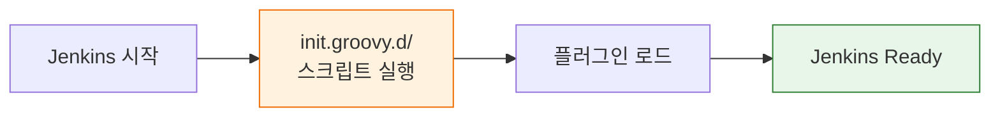

# GCP K8s에 배포된 redpanda-playground Jenkins

---

> GCP에 올라가 있는 `redpanda-playground`의 Jenkins는 Dockerfile 복사 방식보다, Helm `values.yaml`의 `initScripts` 블록으로 init hook을 주입하는 구성이 기준이다.
>
> - 실제 배포 기준 설명은 "이미지에 파일을 복사한다"보다 "차트 values에 inline Groovy를 넣어 `/usr/share/jenkins/ref/init.groovy.d/`에 마운트한다"가 더 정확하다.
> - Jenkins 완료 결과를 HTTP webhook으로 외부에 직접 보내지 않고, `rpk` CLI로 Kafka 토픽에 직접 produce한다.

```yaml
containerEnv:
  - name: RPK_BROKERS
    value: "redpanda-0.redpanda.rp-oss.svc.cluster.local:9092"
  - name: WEBHOOK_TOPIC
    value: "playground.webhook.inbound"

initScripts:
  disable-csrf: |
    import jenkins.model.Jenkins
    def instance = Jenkins.instance
    instance.setCrumbIssuer(null)
    instance.save()

  webhook-listener: |
    import hudson.model.Run
    import hudson.model.TaskListener
    import hudson.model.ParametersAction
    import hudson.model.listeners.RunListener
    ...
```

- 같은 클러스터 안의 Redpanda 브로커에 바로 붙을 수 있기 때문에, 외부 콜백 URL이나 터널링보다 단순하고 안정적이다.

## init.groovy.d/webhook-listener.groovy

```groovy
import hudson.model.Run
import hudson.model.TaskListener
import hudson.model.ParametersAction
import hudson.model.listeners.RunListener

/**
 * 전역 웹훅 리스너 -- 모든 파이프라인 완료 시 Redpanda Connect로 결과 전송.
 *
 * EXECUTION_ID 파라미터가 있는 빌드만 웹훅을 발송한다.
 * 사용자 Jenkinsfile에 웹훅 코드를 넣을 필요 없음.
 */

// 환경변수 CONNECT_WEBHOOK_URL이 설정되어 있으면 사용, 없으면 기본값
def WEBHOOK_URL = System.getenv('CONNECT_WEBHOOK_URL') ?: 'http://connect:4195/jenkins-webhook/webhook/jenkins'

RunListener.all().add(new RunListener<Run>() {

    @Override
    void onCompleted(Run run, TaskListener listener) {

        // --- 1. 파라미터 추출 (EXECUTION_ID 없으면 skip) ---

        def paramsAction = run.getAction(ParametersAction)
        def executionId  = paramsAction?.getParameter('EXECUTION_ID')?.value
        if (!executionId) return

        def stepOrder  = paramsAction?.getParameter('STEP_ORDER')?.value ?: '0'

        // --- 2. 빌드 메타데이터 수집 ---

        def result      = run.result?.toString() ?: 'UNKNOWN'
        def buildNumber = run.number
        def jobName     = run.parent.fullName
        def duration    = run.duration
        def url         = run.absoluteUrl ?: ''

        // --- 3. JSON 페이로드 구성 ---

        def payload = """\
            {
              "executionId": "${executionId}",
              "stepOrder":   ${stepOrder},
              "result":      "${result}",
              "buildNumber": ${buildNumber},
              "jobName":     "${jobName}",
              "duration":    ${duration},
              "url":         "${url}"
            }""".stripIndent()

        // --- 4. 웹훅 전송 ---
        try {
            def conn = new URL(WEBHOOK_URL).openConnection() as HttpURLConnection
            conn.requestMethod  = 'POST'
            conn.connectTimeout = 5000
            conn.readTimeout    = 5000
            conn.doOutput       = true
            conn.setRequestProperty('Content-Type', 'application/json')

            conn.outputStream.withWriter('UTF-8') { it.write(payload) }

            def responseCode = conn.responseCode
            listener.logger.println(
                "[WEBHOOK] Sent to Connect (HTTP ${responseCode}): ${result}"
            )
        } catch (Exception e) {
            listener.logger.println(
                "[WEBHOOK] delivery failed (Connect may be down): ${e.message}"
            )
        }
    }
})

```

이 구현을 K8s 관점에서 읽으면 중요한 포인트는 다섯 가지다.

1. **이벤트 수신은 여전히 하나다.** 실제로 등록하는 Jenkins 리스너는 `RunListener` 하나뿐이고, 콜백도 `onCompleted()`만 구현한다. 즉 시작/대기열/취소/노드 이벤트는 구독하지 않는다.
2. **전역 등록 방식은 파일 복사가 아니라 Helm 주입이다.** 차트의 `initScripts`가 Jenkins ref 디렉토리에 마운트되므로, 클러스터 배포 상태는 `values.yaml`이 곧 기준 설정이다.
3. **전송 경로가 K8s 내부망 기준이다.** `RPK_BROKERS=redpanda-0.redpanda.rp-oss.svc.cluster.local:9092`처럼 클러스터 DNS를 사용하므로, Jenkins가 Redpanda에 직접 메시지를 넣는다.
4. **외부 webhook URL이 필요 없다.** Docker/GCP 혼합 시나리오에서 필요했던 `CONNECT_WEBHOOK_URL`이나 cloudflared 터널이 아니라, Kafka 토픽이 콜백 채널 역할을 대신한다.
5. **모든 빌드를 보내지 않는다.** `EXECUTION_ID`가 없는 일반 Jenkins 잡은 skip하며, 파이프라인 엔진이 추적 중인 실행만 이벤트로 전환한다.

## init.groovy.d를 기준으로 보면 무엇을 커스텀할 수 있는가

> 이 문서는 `Jenkinsfile post`나 Shared Library보다, **컨트롤러 부팅 시점에 전역 로직을 심는 `init.groovy.d`**를 기준점으로 본다.
>
> - Jenkins 공식 문서 기준으로 `init.groovy.d` 스크립트는 **Jenkins 초기화의 끝 시점**에 실행되며, Jenkins core와 플러그인 클래스에 접근할 수 있다.
> - Docker 이미지 기준 경로는 `/usr/share/jenkins/ref/init.groovy.d/`다.



`init.groovy.d`로 할 수 있는 커스텀은 "초기 설정 몇 개" 수준에 그치지 않는다. 크게 보면 네 가지 축으로 나눌 수 있다.

| 축 | 대표 대상 | 실무 용도 |
|----|----------|----------|
| 시스템 전역 설정 | URL, 시스템 메시지, QuietDown, CSRF, 보안 설정 | Jenkins 부팅 직후 공통 정책 강제 |
| 자격증명/플러그인 초기화 | Secret Text, Git credential, 플러그인 옵션 | 인프라 배포와 함께 초기 상태 자동화 |
| Job CRUD 후킹 | 생성, 수정, 삭제, 이름 변경 | 새 Job 기본값 주입, 금지 정책, 감시 로그 |
| Build/Pipeline 이벤트 후킹 | 시작, 완료, 최종화, Pipeline 재개 | 전역 알림, 메트릭, webhook, 감사 추적 |

### 커스텀 1: 전역 시스템 설정

가장 단순하면서도 흔한 패턴은 Jenkins 전체 설정을 부팅 시 강제로 맞추는 것이다. URL, 시스템 메시지, 초기 조용한 상태 같은 값은 `init.groovy.d`와 잘 맞는다.

```groovy
// init.groovy.d/01-system-baseline.groovy
import jenkins.model.Jenkins
import jenkins.model.JenkinsLocationConfiguration

def j = Jenkins.instance
def location = JenkinsLocationConfiguration.get()

location.url = "https://jenkins.example.com/"
location.adminAddress = "platform@example.com"
j.setSystemMessage("This Jenkins is managed by init.groovy.d")

// 첫 부팅 직후 작업을 막고 싶다면 사용 가능
// j.doQuietDown()

location.save()
j.save()
println "[init] system baseline applied"
```

이런 커스텀은 선언적 설정으로도 많이 대체 가능하지만, 환경변수 분기나 "특정 조건이면 QuietDown" 같은 명령형 로직이 필요하면 init hook이 더 직접적이다.

### 커스텀 2: 자격증명 자동 등록

> Helm 값이나 K8s Secret을 환경변수로 주입해 Jenkins 내부 credential store로 옮길 때 자주 사용하는 패턴이다.
>
> - 같은 ID를 중복 생성하지 않도록 방어 코드가 필요하다.
> - 운영에서는 "없을 때만 생성" 또는 "기존 값 비교 후 갱신" 로직을 넣는 편이 안전하다.

```groovy
// init.groovy.d/04-bootstrap-credentials.groovy
import com.cloudbees.plugins.credentials.SystemCredentialsProvider
import com.cloudbees.plugins.credentials.domains.Domain
import org.jenkinsci.plugins.plaincredentials.impl.StringCredentialsImpl
import hudson.util.Secret
import com.cloudbees.plugins.credentials.CredentialsScope

def token = System.getenv("GITHUB_TOKEN")
if (!token) {
    println "[init] GITHUB_TOKEN is empty, skip credential bootstrap"
    return
}

def store = SystemCredentialsProvider.getInstance().getStore()
def creds = new StringCredentialsImpl(
    CredentialsScope.GLOBAL,
    "github-token",
    "Bootstrapped by init.groovy.d",
    Secret.fromString(token)
)

store.addCredentials(Domain.global(), creds)
println "[init] github-token credential added"
```

### 커스텀 3: Job 생성/수정 이벤트 후킹

> 빌드 완료 이벤트만 전역 후킹할 수 있는 것이 아니다.
>
> - Job 생성, 수정, 이름 변경 같은 CRUD 계열은 `ItemListener`가 담당한다.
> - Jenkins core 리스너 패키지 기준으로 **일반적인 의미의 전역 `JobListener`라는 이름의 extension point는 없다.** Job 수준 이벤트를 듣고 싶다면 보통 `ItemListener`를 쓴다.

```groovy
// init.groovy.d/10-item-listener.groovy
import hudson.model.Item
import hudson.model.listeners.ItemListener

class GlobalItemListener extends ItemListener {

    @Override
    void onCreated(Item item) {
        println "[item] created: ${item.fullName}"
    }

    @Override
    void onUpdated(Item item) {
        println "[item] updated: ${item.fullName}"
    }

    @Override
    void onLocationChanged(Item item, String oldFullName, String newFullName) {
        println "[item] moved/renamed: ${oldFullName} -> ${newFullName}"
    }
}

ItemListener.all().add(new GlobalItemListener())
println "[init] item listener registered"
```

이 패턴은 신규 Job의 기본 설명을 넣거나, 특정 폴더 바깥으로 Job이 이동하는 것을 감시하거나, 외부 CMDB에 Job 메타데이터를 동기화할 때 쓸 수 있다.

### 커스텀 4: Build/Pipeline 이벤트 후킹

이 문서의 webhook 예시는 `RunListener`를 사용한다. 이것은 "모든 빌드의 시작/완료를 강제로 잡는다"는 점에서 가장 실전적인 전역 커스텀이다. Jenkinsfile을 수정하지 않아도 된다는 점이 가장 크다.

Pipeline만 별도로 후킹하고 싶다면 `FlowExecutionListener`도 가능하다. 특히 Jenkins 재시작 후 Pipeline 재개(`onResumed`) 같은 이벤트는 일반적인 `Jenkinsfile post`로는 잡을 수 없고, 이 계열 리스너가 더 적합하다.

정리하면 init hook 안에서 가능한 전역 커스텀은 다음과 같이 해석할 수 있다.

- **설정 주입**: 시스템 설정, URL, 보안, 자격증명
- **객체 수명주기 감시**: Job 생성/수정/이동/삭제
- **실행 수명주기 감시**: 빌드 시작/완료/최종화, Pipeline 재개
- **외부 시스템 연동**: webhook, Kafka produce, 감사 로그, 메트릭 발행

즉 `init.groovy.d`는 "초기 설정 파일"이 아니라, **전역 Jenkins 확장 코드를 배포하는 엔트리 포인트**에 가깝다.
