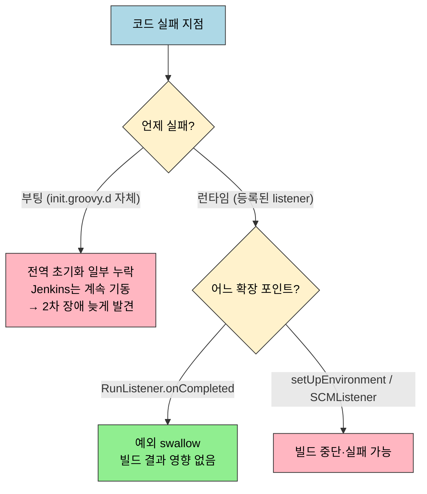
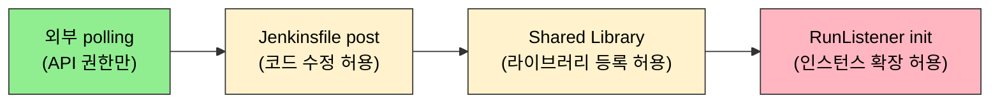
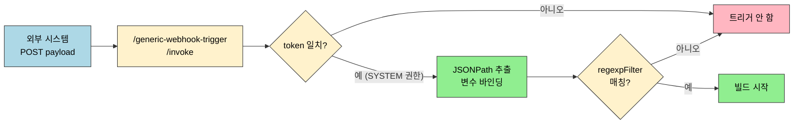

# Webhook과 외부 연동

---

> 이 문서를 읽고 나면 init.groovy.d 부팅 스크립트 실패와 RunListener 런타임 실패의 영향 범위를 구분해 설명하고, 확장 포인트(RunListener·ItemListener·SCMListener)별로 예외가 빌드에 미치는 영향을 비교하며, 외부 회사 Jenkins 연동에서 통제권 구조에 따라 polling·Jenkinsfile post·Shared Library 중 무엇을 기본안으로 선택할지 예측할 수 있습니다. 또한 Generic Webhook Trigger의 token·JSONPath 추출·regexpFilter 동작을 설명할 수 있습니다.

> 이 문서는 `02-06.GCP K8s Jenkins 실전`의 후속입니다.

## 사전 지식

> `02-05`·`02-05a`의 RunListener·FlowExecutionListener·ItemListener와 init.groovy.d 등록 방식, `02-06`의 webhook→Kafka 전송 흐름을 알고 있어야 합니다. HTTP 클라이언트 timeout과 멱등성(중복 등록 방지) 개념을 떠올릴 수 있으면 안전 템플릿이 자연스럽게 읽힙니다.

## 진입 — 빌드가 끝났다는 사실을 외부에 어떻게 흘려보낼 것인가

> Jenkins 안에서 빌드가 끝나는 순간, 그 결과를 사내 대시보드나 외부 회사 시스템으로 흘려보내야 하는 상황이 생깁니다. 우리가 직접 운영하는 Jenkins라면 init.groovy.d로 전역 listener를 심어 모든 빌드에 자동으로 콜백을 붙일 수 있지만, 외부 회사의 Jenkins라면 인스턴스를 건드릴 권한 자체가 협의 대상이 됩니다. 그래서 "어떤 통제권을 우리가 이미 쥐고 있는가"가 연동 수단을 먼저 결정하고, "콜백 코드가 실패하면 본 빌드가 깨지는가"가 안전성을 결정합니다. 이 두 축이 이 문서 전체를 관통합니다.

## 1. 코드가 실패하면 Jenkins와 파이프라인에 어떤 영향을 주는가

> 이것은 이미 아는 try-catch 예외 격리를, "빌드 수명주기의 어느 시점에 콜백이 실행되는가"라는 시간 축에서 다시 보는 것입니다.

> "부팅 시 한 번 실행되는 init script"와 "그 script가 등록한 listener가 런타임에 호출될 때"를 분리해서 보는 것이 가장 중요한 구분입니다.

실패 지점은 부팅 시점과 런타임 시점으로 갈리고, 영향 범위가 서로 다릅니다. 이 구조는 건물의 자동문에 비유할 수 있습니다. 부팅 스크립트는 개점 전 "문을 자동 모드로 세팅하는 작업"이고, listener는 "사람이 지나갈 때마다 작동하는 센서"입니다. 세팅 작업이 실패하면 문은 일단 열린 채로 운영을 시작하지만 자동 모드는 빠진 상태이고, 센서 회로 하나가 죽어도 다른 문은 그대로 작동합니다. 다만 이 비유는 영향 범위까지만 맞습니다. 센서(`setUpEnvironment` 같은 입장 게이트)가 "사람을 막는 게 본업"인 경우에는 실패가 곧 통행 차단이 정상 동작일 수 있다는 점에서 비유가 깨집니다.



### 1. init.groovy.d 자체가 실패하는 경우

Jenkins 공식 문서 기준으로 `init.groovy.d`는 Jenkins 초기화 마지막에 실행되고, 출력은 Jenkins 로그에 남습니다. 실무적으로는 **스크립트 문법 오류나 런타임 예외가 나면 그 스크립트의 목적만 적용되지 않고, Jenkins는 보통 계속 올라옵니다.**

예를 들어 다음 상황을 생각하면 됩니다.

- `04-bootstrap-credentials.groovy`에서 `MissingPropertyException` 발생
- 결과: 해당 credential 등록 실패
- 영향: Jenkins 부팅은 계속되지만, 이후 Git clone이나 webhook 호출에서 credential 없음으로 2차 장애 발생 가능

즉 init hook 오류는 "당장 모든 빌드가 즉시 죽는다"기보다, **전역 초기화가 일부 누락된 상태로 Jenkins가 기동될 수 있다**는 쪽이 더 위험합니다. 겉보기에는 Jenkins가 살아 있으니 문제를 늦게 발견하기 쉽습니다.

### 2. RunListener가 실패하는 경우

이 부분은 Jenkins 공식 Javadoc이 꽤 분명합니다. `RunListener.onStarted`, `onCompleted`, `onFinalized`, `onDeleted`는 **예외가 발생해도 삼켜서(swallow) broken listener가 모든 빌드를 망치지 않도록** 설계돼 있습니다. 특히 `onCompleted`는 이미 빌드가 완료된 뒤 호출되므로, 그 시점에는 **빌드 상태를 더 이상 바꿀 수 없습니다.**

따라서 "RunListener에서 코드 실패할 때 파이프라인에 영향을 주는가?"의 답은 다음과 같습니다.

- `RunListener.onCompleted()` 같은 완료 후 리스너라면, **파이프라인 결과에는 직접 영향이 없습니다.**
- 그 리스너 안의 webhook 전송 코드가 실패해도, Jenkins는 로그만 남기고 원래 빌드 결과는 유지합니다.
- 그래서 이 문서의 webhook 예시처럼 `try-catch`로 감싸고 console log만 남기는 패턴이 안전합니다.

이 점은 전역 webhook의 안전 장치입니다. 외부 callback 서버가 잠깐 죽어도 고객 빌드 자체를 실패로 바꾸면 안 되기 때문입니다.

### 3. 하지만 모든 listener가 안전한 것은 아니다

여기서 오해하면 안 됩니다. Jenkins의 모든 리스너가 "실패해도 괜찮다"로 설계된 것은 아닙니다. 어떤 extension point를 쓰느냐에 따라 영향 범위가 다릅니다.

| 확장 포인트 | 대표 메서드 | 예외 시 영향 |
|------------|-----------|-------------|
| `RunListener` | `onStarted`, `onCompleted`, `onFinalized`, `onDeleted` | 공식 Javadoc 기준 예외가 swallow됩니다. 보통 빌드 결과를 깨지 않습니다. |
| `RunListener` | `setUpEnvironment` | `IOException`, `InterruptedException`, `RunnerAbortedException`은 빌드를 비정상 종료하거나 abort할 수 있습니다. |
| `ItemListener` | `onCreated`, `onUpdated`, `onLocationChanged` | Job 메타데이터 후킹입니다. 일반적으로 빌드 실행 자체보다 Job CRUD 흐름에 영향이 있습니다. |
| `ItemListener` | `onCheckCopy`, `onCheckDelete` | `Failure`를 던져 복사/삭제를 veto할 수 있습니다. |
| `SCMListener` | `onChangeLogParsed` | 공식 Javadoc 기준 예외가 기록되고 빌드를 실패시킬 수 있습니다. |

즉 "listener 안에서 코드가 실패하면 파이프라인에 영향이 있는가?"의 정답은 **리스너 종류와 호출 시점에 따라 다르다**입니다.

### 4. 이 문서의 webhook 예시는 왜 비교적 안전한가

현재 문서의 구현은 `RunListener.onCompleted()`를 사용합니다. 이 선택이 중요한 이유는 세 가지입니다.

1. **빌드 결과가 이미 확정된 뒤** 호출됩니다.
2. Jenkins core 문서상 **예외가 swallow**됩니다.
3. 외부 네트워크 장애를 빌드 실패로 전염시키지 않습니다.

따라서 webhook, Kafka produce, Slack 알림, 메트릭 전송처럼 **"실패해도 본 빌드를 망치면 안 되는 후행 작업"**은 `onCompleted`나 `onFinalized`에 두는 것이 맞습니다.

반대로 아래 같은 로직은 주의가 필요합니다.

- 빌드 환경 변수 주입
- checkout 이전 정책 검사
- SCM changelog 파싱 후 강제 검증
- 빌드 시작 자체를 막는 가드 로직

이런 코드는 더 이른 단계에서 호출되고, 경우에 따라 빌드를 중단시키는 것이 의도일 수도 있습니다. 그러면 `RunListener.setUpEnvironment`나 다른 확장 포인트를 선택해야 하고, 영향 범위를 명시적으로 받아들여야 합니다.

## 2. 실무 결론: JobListener라는 이름보다 확장 포인트를 먼저 보라

> 실무 대화에서는 "JobListener"라고 부르지만, Jenkins core 관점에서는 이것만으로 의미가 충분하지 않습니다. 실제로는 어떤 확장 포인트를 붙였는지가 중요합니다.

- Job CRUD를 듣고 싶으면 `ItemListener`
- Build 시작/완료를 듣고 싶으면 `RunListener`
- Pipeline 재개까지 보고 싶으면 `FlowExecutionListener`
- SCM 변경 파싱 결과에 개입하고 싶으면 `SCMListener`

그리고 실패 영향은 다음처럼 기억하면 됩니다.

- **후행 알림 리스너**는 `RunListener.onCompleted/onFinalized`에 두고 실패를 삼키게 합니다.
- **빌드를 멈출 수도 있는 정책 로직**은 더 이른 확장 포인트를 쓰되, 정말 빌드를 깨도 되는지 먼저 결정합니다.
- **init.groovy.d 부팅 스크립트 실패**는 Jenkins 전체 중단보다 "전역 설정 누락 상태로 기동" 위험이 더 크므로, Jenkins 로그와 부팅 헬스체크를 같이 봐야 합니다.

## 3. 바로 쓰는 안전 템플릿

> 실무에서는 `init.groovy.d`에 바로 비즈니스 로직을 길게 넣기보다, 아래 템플릿처럼 **실패 격리, 중복 등록 방지, 짧은 타임아웃, 명확한 로그 prefix**를 먼저 깔고 시작하는 편이 안전합니다.

### 템플릿 1: 안전한 부팅 스크립트 기본형

이 템플릿은 "부팅 시 한 번 실행되는 초기화 코드"용입니다. 핵심은 스크립트 전체를 `try-catch`로 감싸고, 환경변수가 없으면 조용히 skip하며, 성공/실패 로그를 prefix로 남기는 것입니다.

```groovy
// init.groovy.d/00-safe-bootstrap-template.groovy
import jenkins.model.Jenkins

def LOG_PREFIX = "[init/bootstrap]"

def log = { String msg ->
    println "${LOG_PREFIX} ${msg}"
}

// 스크립트 전체를 try-catch로 감싸 한 줄 실패가 Jenkins 기동을 막지 않게 한다
try {
    def j = Jenkins.instance
    if (j == null) {
        // 초기화 순서에 따라 instance가 아직 null일 수 있어 NPE 대신 skip
        log("Jenkins.instance is null, skip")
        return
    }

    def endpoint = System.getenv("MY_API_ENDPOINT")
    if (!endpoint) {
        // 환경변수 미설정은 오류가 아니라 "이 환경에는 적용 안 함" 신호로 처리
        log("MY_API_ENDPOINT is empty, skip")
        return
    }

    // 실제 초기화 로직
    j.setSystemMessage("Managed by init.groovy.d")
    j.save()

    log("bootstrap completed")
} catch (Throwable t) {
    // Error까지 잡는 Throwable: 부팅 스크립트 실패를 로그로 드러내되 전파는 막는다
    log("bootstrap failed: ${t.class.name}: ${t.message}")
    t.printStackTrace()
}
```

이 템플릿은 "부팅 실패를 숨긴다"는 뜻이 아닙니다. Jenkins 전체 기동을 막기보다, **로그를 남기고 실패 지점을 분리해 관찰 가능하게 만든다**는 뜻입니다.

### 템플릿 2: 안전한 RunListener 등록 기본형

이 템플릿은 전역 빌드 완료 후 webhook, Kafka produce, Slack 알림 같은 후행 작업에 맞습니다. 포인트는 세 가지입니다.

- 리스너 등록 중복을 막습니다.
- 외부 호출은 짧은 timeout을 둡니다.
- 리스너 내부 예외를 다시 한 번 자체적으로 잡아 로그를 남깁니다.

```groovy
// init.groovy.d/10-safe-run-listener.groovy
import hudson.ExtensionList
import hudson.model.Run
import hudson.model.TaskListener
import hudson.model.listeners.RunListener

def LOG_PREFIX = "[init/run-listener]"

class SafeWebhookRunListener extends RunListener<Run> {

    private static final String ENDPOINT =
        System.getenv("CONNECT_WEBHOOK_URL") ?: "http://connect:4195/jenkins-webhook/webhook/jenkins"

    @Override
    void onCompleted(Run run, TaskListener listener) {
        // onCompleted는 빌드 확정 후 호출 — 여기서 무엇을 해도 결과는 못 바꾼다
        try {
            def result = run.getResult()?.toString() ?: "UNKNOWN"
            def jobName = run.getParent().getFullName()
            def buildNumber = run.getNumber()

            def payload = """{
              "jobName":"${jobName}",
              "buildNumber":${buildNumber},
              "result":"${result}"
            }"""

            def conn = new URL(ENDPOINT).openConnection() as HttpURLConnection
            conn.requestMethod = "POST"
            // 외부 endpoint가 느리거나 죽어도 listener 스레드가 무한 대기하지 않도록 3초 상한
            conn.connectTimeout = 3000
            conn.readTimeout = 3000
            conn.doOutput = true
            conn.setRequestProperty("Content-Type", "application/json")

            conn.outputStream.withWriter("UTF-8") { it.write(payload) }

            listener.getLogger().println("${LOG_PREFIX} delivered: HTTP ${conn.responseCode}")
        } catch (Throwable t) {
            // 콜백 실패를 빌드 실패로 전염시키지 않도록 자체적으로 한 번 더 삼킨다
            listener.getLogger().println("${LOG_PREFIX} failed: ${t.class.name}: ${t.message}")
        }
    }
}

def listeners = ExtensionList.lookup(RunListener.class)
// 클래스 이름으로 중복 체크 — 재기동·재실행 시 같은 listener가 누적 등록되는 것을 막는다
def exists = listeners.any { it.class.name == SafeWebhookRunListener.name }

if (!exists) {
    listeners.add(new SafeWebhookRunListener())
    println "${LOG_PREFIX} registered"
} else {
    println "${LOG_PREFIX} already registered, skip"
}
```

여기서 중요한 것은 `onCompleted()`가 **빌드 결과를 바꾸는 위치가 아니라는 점**입니다. 이 템플릿은 "빌드 성공/실패"보다 "완료 후 부가 작업"에만 써야 합니다.

### 템플릿 3: Job CRUD 감시용 ItemListener 기본형

Job 생성/수정/이동을 기록하고 싶으면 아래처럼 `ItemListener`를 따로 두는 편이 맞습니다. 빌드 완료 알림과 같은 파일에 섞지 않는 것이 유지보수에 유리합니다.

```groovy
// init.groovy.d/11-safe-item-listener.groovy
import hudson.ExtensionList
import hudson.model.Item
import hudson.model.listeners.ItemListener

def LOG_PREFIX = "[init/item-listener]"

class SafeItemListener extends ItemListener {

    @Override
    void onCreated(Item item) {
        try {
            println "${LOG_PREFIX} created: ${item.fullName}"
        } catch (Throwable t) {
            println "${LOG_PREFIX} onCreated failed: ${t.message}"
        }
    }

    @Override
    void onUpdated(Item item) {
        try {
            println "${LOG_PREFIX} updated: ${item.fullName}"
        } catch (Throwable t) {
            println "${LOG_PREFIX} onUpdated failed: ${t.message}"
        }
    }
}

def listeners = ExtensionList.lookup(ItemListener.class)
def exists = listeners.any { it.class.name == SafeItemListener.name }

if (!exists) {
    listeners.add(new SafeItemListener())
    println "${LOG_PREFIX} registered"
} else {
    println "${LOG_PREFIX} already registered, skip"
}
```

### 템플릿 적용 체크리스트

`init.groovy.d` 템플릿을 실제 운영에 넣을 때는 아래 항목을 같이 보는 것이 좋습니다.

- 외부 네트워크 호출은 `connectTimeout`, `readTimeout`을 짧게 둡니다.
- listener 내부에서 예외를 직접 잡고 Jenkins 로그에 prefix와 함께 남깁니다.
- 동일 listener가 재등록되지 않도록 중복 체크를 둡니다.
- 환경변수가 없으면 실패보다 skip을 기본값으로 둡니다.
- "빌드를 깨도 되는 정책"과 "깨면 안 되는 후행 알림"을 같은 listener에 섞지 않습니다.
- 가능하면 파일을 역할별로 나눕니다. 예: `01-system`, `04-credentials`, `10-run-listener`, `11-item-listener`

## 4. 실무 판단 1: 외부 회사의 Jenkins를 쓰는 경우, 외부 접속이 정말 필요한가

> 이 질문의 핵심은 "Jenkins를 어떻게 노출하느냐"가 아니라, **우리가 통제하지 않는 외부 Jenkins와 연동할 때 어떤 네트워크 경로가 필요한가**입니다.
>
> 이 경우도 접속 필요성은 "명령을 넣는 방향"과 "결과를 받는 방향"을 분리해서 봐야 합니다.

- **우리 시스템 → 외부 Jenkins 트리거**: 거의 항상 외부 접속이 필요합니다. 외부 Jenkins의 REST API나 빌드 URL을 호출해야 하기 때문입니다.
- **사람이 외부 Jenkins UI를 봐야 한다면**: 역시 외부 접속이 필요합니다. 다만 이것은 운영 편의 경로이지, 자동화 플로우의 필수 경로와는 별개입니다.
- **외부 Jenkins → 우리 시스템 결과 반환**: 방식에 따라 다릅니다. init script나 Jenkinsfile에서 HTTP webhook을 보내면 외부 Jenkins가 우리 endpoint에 도달할 수 있어야 하고, Kafka produce 방식이면 외부 Jenkins가 우리 브로커나 중계 계층에 도달할 수 있어야 합니다.

따라서 외부 Jenkins 연동에서 진짜 질문은 "Jenkins를 외부에 노출할까?"보다 "양방향 중 어느 방향을 누가 책임질까?"에 가깝습니다.

- **명령 경로**: 보통 우리 시스템이 외부 Jenkins로 나가는 outbound 호출
- **결과 경로**: 외부 Jenkins가 우리 쪽으로 돌아오는 outbound 호출 또는 메시지 발행

만약 상대 회사가 외부 outbound를 엄격히 막는다면, webhook 방식은 바로 막힐 수 있습니다. 이런 경우는 결과 반환을 push가 아니라 polling으로 바꾸는 편이 현실적입니다. 반대로 상대가 webhook outbound는 허용하지만 Jenkins 내부 확장은 싫어한다면, Jenkinsfile `post`나 플러그인 기반 HTTP 호출은 가능할 수 있습니다.

- 참고로 `redpanda-playground`의 GCP K8s Jenkins는 `NodePort`와 `jenkinsUrl`로 외부 UI/REST 경로를 따로 노출하고 있지만, 이것은 **우리 관리 환경의 한 예시**일 뿐 외부 회사 Jenkins 일반론의 기준은 아닙니다.

## 5. 실무 판단 2: 외부 회사가 init script 추가를 싫어하면 대안은 무엇인가

> 전역 init script(`RunListener`, `FlowExecutionListener`)는 가장 강력하지만, Jenkins 인스턴스 자체에 손을 대는 방식이라 외부 조직이 거부감을 느끼기 쉽습니다.
>
> - 특히 **외부 Jenkins 계정/보안정보를 우리 서버에 등록하고, 우리는 Jenkins API를 자유롭게 사용할 수 있지만 초기 스크립트 설정은 합의에 따라 될 수도 있고 안 될 수도 있는** 경우에는, 기본 전략을 init script에 두면 안 됩니다.
> - 이때는 "우리가 이미 보장받은 것(API 접근)"을 기준점으로 잡고, 그 위에 상대 조직의 추가 협조 수준에 따라 선택지를 올리는 편이 맞습니다.

| 대안                      | Jenkins 수정 범위                        | 기본 채택 적합도 | 장점                                                         | 한계                                            |
| ------------------------- | ---------------------------------------- | ---------------- | ------------------------------------------------------------ | ----------------------------------------------- |
| 외부 Polling              | Jenkins 설정 거의 불필요                 | 가장 높음        | 이미 가진 API 권한만으로 구현 가능, 상대 조직 추가 협조 최소화 | 실시간성 낮고 상태 추적 책임이 우리 쪽에 집중   |
| `Jenkinsfile post`        | 각 파이프라인 코드                       | 중간             | 단순하고 결과를 push로 즉시 전달 가능                        | 고객이 삭제/변경하면 누락 가능                  |
| Shared Library Wrapper    | Shared Library + Jenkinsfile 호출        | 중간             | 재사용성 좋고 버전 관리 가능                                 | 라이브러리 등록/호출 자체가 또 다른 협의 포인트 |
| Implicit Global Library   | Jenkins 전역 라이브러리 설정 + 함수 호출 | 낮음             | 전역 배포는 가능, init script보다 거부감이 적음              | 자동 실행이 아니라 호출 누락 가능               |
| `RunListener` init script | Jenkins 전역 init hook                   | 조건부 최고      | Jenkinsfile 수정 없이 모든 빌드 강제 적용                    | 상대 조직이 가장 거부할 가능성 높음             |

대안을 고를 때 기준은 다음과 같습니다.

1. **기본 보장 능력이 Jenkins API 접근뿐이라면** `외부 polling`을 기본안으로 삼는 것이 맞습니다. 이것은 상대 조직의 추가 협조 없이도 성립하는 최소 연동선입니다.
2. **상대가 Jenkins 인스턴스 수정은 싫지만 Jenkinsfile 수정은 허용**하면 `Jenkinsfile post`를 추가하여 push 기반 결과 반환으로 개선할 수 있습니다.
3. **여러 파이프라인에 공통 적용이 필요하고, 공통 라이브러리 등록까지는 허용**하면 Shared Library가 `Jenkinsfile post`보다 운영성이 좋습니다.
4. **상대가 webhook outbound는 허용하지만 Jenkins 자체 확장은 싫어한다**면, HTTP Request Plugin이나 Jenkinsfile `post`가 타협안이 됩니다.
5. **우리가 플랫폼 통제권을 갖고 있고 webhook 누락을 절대 허용할 수 없으며, init script도 합의 가능**하다면 `RunListener`가 가장 안정적입니다.

여기서 중요한 판단은 "Groovy로 할 수 있느냐"가 아니라 "우리가 이미 확보한 권한으로 어디까지 확실하게 제공할 수 있느냐"와 "상대 운영 조직이 허용할 거버넌스 범위 안에서 무엇이 가장 덜 깨지느냐"입니다. 기술적으로는 init script가 가장 깔끔할 수 있어도, API 접근은 보장되고 init script는 불확실하다면 외부 polling이 기본 전략이 되고, Shared Library나 init script는 협조 수준이 올라갈 때 붙는 상위 옵션이 됩니다.

## 6. 외부 Jenkins 연동에서 현실적인 3가지 대안

> 외부 회사의 Jenkins를 연동할 때는 `init.groovy.d` 같은 전역 hook보다 아래 세 가지가 훨씬 현실적입니다.
>
> - 특히 **우리가 Jenkins API 자격증명을 이미 보관하고 있고, 초기 스크립트 설정은 선택 사항**인 프로젝트라면 우선순위는 `외부 polling -> Jenkinsfile post -> Shared Library` 순서로 보는 편이 자연스럽습니다.
> - 공통점은 "상대 Jenkins 인스턴스 자체를 깊게 커스터마이징하지 않아도 된다"는 점이고, 차이는 어디까지를 상대 조직에 요청하느냐에 있습니다.

통제권이 올라갈수록 더 강한 수단을 쓸 수 있고, 그에 따라 실시간성과 누락 위험이 달라집니다.



기본안은 가장 왼쪽(polling)이고, 상대 조직의 협조 수준이 올라갈수록 오른쪽 옵션을 덧붙입니다.

### 1. 외부 Polling

이 프로젝트의 기본안으로 가장 현실적인 방법은 상대 Jenkins에 callback 코드를 넣지 않고, 우리 시스템이 Jenkins REST API를 주기적으로 조회하는 것입니다. 이미 계정/API token/보안정보를 우리 서버에 등록해 두는 모델이라면, 이 방식은 추가 합의 없이도 구현 가능한 최소 연동선입니다.

```text
1. 우리 시스템이 Jenkins build trigger
2. queue item id / build number 저장
3. 주기적으로 /queue/item/{id}, /job/{name}/{build}/api/json 조회
4. 결과가 SUCCESS / FAILURE / ABORTED로 바뀌면 우리 상태 갱신
5. 필요하면 consoleText, artifacts, build metadata 추가 조회
```

이 방식의 핵심은 "push를 못 받아도 pull로 서비스는 완성할 수 있다"는 점입니다. 상대 Jenkins에 webhook, plugin, init script를 못 넣어도 최소 기능은 제공 가능합니다. 다만 polling 주기는 부하와 지연의 절충점을 정량으로 잡아야 합니다. 예를 들어 평균 빌드 시간이 5분인 잡 200개를 5초 간격으로 조회하면 분당 12회 × 200잡 = 2400 req/min이 Jenkins로 쏟아져 마스터가 흔들립니다. 빌드 시간 대비 1/30 수준(5분 빌드면 10초 간격)에서 시작해, 결과가 바뀐 잡만 좁혀 추적하고 완료된 잡은 폴링 대상에서 즉시 제거하는 식으로 호출량을 줄입니다.

- 장점: 상대 Jenkins 변경이 거의 필요 없고, 이미 확보한 API 권한만으로 연동 가능합니다.
- 장점: queue item 추적, build 번호 매핑, 결과/로그/아티팩트 조회까지 우리 서버가 통합적으로 통제할 수 있습니다.
- 단점: 실시간성은 push보다 떨어지고, 타임아웃/재시도/중복 처리 책임이 우리 쪽에 집중됩니다.
- 적합한 상황: 기본 연동선, 상대 조직 협조 수준이 낮은 초기 도입 단계, webhook/outbound 정책이 불명확한 경우

### 2. Jenkinsfile `post`

가장 단순한 방법은 각 파이프라인의 `post` 블록에서 우리 시스템으로 결과를 보내는 것입니다.

```groovy
pipeline {
    stages { ... }
    post {
        always {
            script {
                def payload = """{"result":"${currentBuild.currentResult}"}"""
                def conn = new URL("https://callback.example.com/jenkins").openConnection()
                conn.requestMethod = "POST"
                conn.setRequestProperty("Content-Type", "application/json")
                conn.doOutput = true
                conn.outputStream.write(payload.bytes)
                conn.responseCode
            }
        }
    }
}
```

이 방식은 상대 회사가 Jenkinsfile 수정 권한을 우리에게 주거나, 최소한 webhook 블록 추가를 허용할 때 적합합니다.

- 장점: 플러그인 없이도 가능하고, 현재 빌드 결과/파라미터/환경변수에 쉽게 접근할 수 있습니다.
- 단점: 고객이 Jenkinsfile을 바꾸면 누락될 수 있고, 모든 파이프라인에 반복 삽입해야 합니다.
- 적합한 상황: polling 기본 연동은 이미 있고, 상대 회사가 파이프라인 코드 수정은 허용하며 결과 반환 지연을 줄이고 싶은 경우

### 3. Shared Library

조금 더 구조화된 방식은 Shared Library로 공통 wrapper나 helper를 제공하고, 각 Jenkinsfile이 이를 호출하도록 만드는 것입니다.

```groovy
// vars/notifyResult.groovy
def call(script, String result) {
    script.echo "Send callback: ${result}"
    // HTTP 호출 또는 메시지 발행
}
```

```groovy
@Library('company-shared-lib') _

pipeline {
    stages { ... }
    post {
        always {
            notifyResult(this, currentBuild.currentResult)
        }
    }
}
```

이 방식은 `Jenkinsfile post`보다 재사용성과 버전 관리가 좋습니다. 공통 로직 수정도 라이브러리 쪽 한 곳에서 처리할 수 있습니다.

- 장점: 콜백 로직을 중앙화할 수 있고, 버전 관리와 재사용이 쉽습니다.
- 단점: 라이브러리 등록과 호출 규약 자체가 협의 대상이며, 결국 Jenkinsfile이 라이브러리를 호출해야 하므로 opt-in 성격이 남습니다.
- 적합한 상황: 외부 회사가 공통 라이브러리 사용은 허용하고, 여러 파이프라인에 같은 callback 규약을 안정적으로 적용하고 싶은 경우

세 방법 중 무엇을 고를지는 기술 선호보다 통제권 구조가 결정합니다.

- **기본 제공선**: `외부 polling`
- **Jenkinsfile 수정 가능**: `Jenkinsfile post`
- **공통화 필요 + Shared Library 등록 가능**: `Shared Library`

## 7. 들어오는 방향: Generic Webhook Trigger

> 지금까지는 빌드 결과를 밖으로 *내보내는* 콜백을 다뤘습니다. 반대로 외부 이벤트를 받아 Jenkins 빌드를 *시작시키는* 입구가 필요할 때가 있습니다. 이것은 이미 아는 SCM webhook(Git push가 빌드를 깨우는 흐름)을, "Git에 한정하지 않고 임의의 HTTP 페이로드로 일반화한" 측면에서 보는 것입니다.

Generic Webhook Trigger 플러그인은 SCM 전용 webhook과 달리 어떤 HTTP webhook으로도 job을 트리거합니다. 엔드포인트는 `JENKINS_URL/generic-webhook-trigger/invoke`이고, POST 본문·쿼리 파라미터·헤더에서 JSONPath/XPath로 값을 추출해 빌드 변수로 넘깁니다 (출처: plugins.jenkins.io/generic-webhook-trigger).

이 플러그인은 일반 가정의 "범용 수신 콜백"에 비유할 수 있습니다. 집 초인종(SCM webhook)은 누가 눌렀는지만 알려주지만, 범용 인터폰은 택배·방문·배달 어떤 신호든 받아 "누가, 무슨 용건으로" 왔는지를 화면에 파싱해 보여줍니다. 다만 이 비유는 수신 능력까지만 맞습니다. 인터폰은 아무 신호나 받아도 되지만, Generic Webhook Trigger는 token과 regexpFilter로 받을 신호를 좁히지 않으면 누구나 빌드를 깨울 수 있다는 점에서 비유가 깨집니다.

세 가지 핵심 메커니즘을 수치·조건으로 정리하면 다음과 같습니다 (출처: plugins.jenkins.io/generic-webhook-trigger).

- **token**: 쿼리(`?token=abc`)·헤더·`Authorization: Bearer abc` 중 하나로 전달합니다. 해당 token을 가진 job만 트리거되고, token 인증으로 들어온 요청은 `SYSTEM` 권한으로 실행됩니다. 즉 token이 노출되면 인증 우회로 임의 빌드를 SYSTEM 권한에 실행시킬 수 있어, token은 시크릿으로 다뤄야 합니다.
- **JSONPath 추출**: `$.ref`, `$.pull_request.head.sha` 같은 표현식으로 페이로드의 특정 필드를 뽑아 빌드 변수로 바인딩합니다. 100여 개 필드가 든 GitHub push 페이로드에서 필요한 두세 개만 골라 쓰는 식입니다.
- **regexpFilter**: 추출한 값이 정규식에 매칭될 때만 빌드를 트리거합니다. 예를 들어 `$.ref`를 추출한 뒤 필터를 `^refs/heads/develop$`로 두면 develop 브랜치 push에만 빌드가 돌고, 나머지 30개 feature 브랜치 push는 엔드포인트에 도달해도 빌드를 시작하지 않습니다.



이 입구는 외부 polling과 정반대 방향입니다. polling이 "우리가 상대 Jenkins를 주기적으로 들여다보는" pull이라면, Generic Webhook Trigger는 "외부가 우리 Jenkins를 깨우는" push 입구입니다. 외부 회사가 우리 쪽으로 outbound 호출을 허용하는 경우에만 성립하므로, 앞의 통제권 구조 판단(섹션 5)과 동일한 잣대로 채택 여부를 정해야 합니다.

## 면접 질문

> 답을 떠올린 뒤 §정답 절에서 같은 번호로 대조하세요.

1. init.groovy.d 스크립트가 실패하는 것과 그 스크립트가 등록한 RunListener가 런타임에 실패하는 것은 영향이 어떻게 다른가요? init 실패가 "겉보기엔 멀쩡한데 더 위험한" 이유는?
2. "listener에서 예외가 나면 빌드가 깨지나요?"에 한마디로 답할 수 없는 이유는 무엇인가요? RunListener의 `onCompleted`와 `setUpEnvironment`, SCMListener는 각각 어떤가요?
3. 외부 회사 Jenkins와 연동할 때, 기술적으로는 RunListener init script가 가장 깔끔한데도 외부 polling을 기본안으로 삼는 게 맞는 이유는 무엇인가요?
4. Generic Webhook Trigger에서 token·JSONPath·regexpFilter는 각각 무슨 역할을 하나요? token 인증 요청이 SYSTEM 권한으로 실행된다는 점이 보안상 무엇을 의미하나요?

### 빈칸 채우기 — Webhook과 외부 연동

다음 빈칸을 채워 보세요. 정답은 맨 끝 "빈칸 정답" 절에 있습니다.

1. `RunListener.onCompleted`는 빌드 결과가 이미 ______된 뒤 호출되고 공식 Javadoc 기준 예외가 ______되므로, 콜백 실패가 빌드 결과에 직접 영향을 주지 않습니다.
2. `RunListener.______`는 `IOException`·`RunnerAbortedException` 등으로 빌드를 비정상 종료·abort할 수 있어, 후행 알림이 아니라 정책 가드 로직에 쓰입니다.
3. Generic Webhook Trigger의 엔드포인트는 `JENKINS_URL/______/invoke`이고, token 인증으로 들어온 요청은 ______ 권한으로 실행됩니다.
4. Generic Webhook Trigger에서 페이로드 특정 필드를 빌드 변수로 추출할 때는 ______ 표현식을, 추출한 값이 특정 패턴일 때만 트리거하려면 ______를 씁니다.

## 정답

> 위 질문을 스스로 설명해 본 뒤에 펼치세요.

### 정답 1 — 부팅 실패 vs 런타임 실패

init.groovy.d 자체가 실패하면 그 스크립트의 목적(예: credential 등록)만 누락된 채 Jenkins는 대개 계속 기동합니다. 반면 그 스크립트가 등록한 `RunListener.onCompleted`는 빌드가 끝난 뒤 호출되고 예외가 swallow되므로 빌드 결과에 직접 영향이 없습니다. init 실패가 더 위험한 이유는, Jenkins가 살아 있으니 정상으로 보이지만 전역 초기화가 일부 빠진 상태라 이후 Git clone·webhook에서 2차 장애가 늦게 터지기 때문입니다. 그래서 부팅 헬스체크와 로그를 함께 봐야 합니다.

### 정답 2 — 확장 포인트와 시점에 달린 문제

리스너 종류와 호출 시점이 영향을 가르기 때문입니다. `RunListener.onStarted/onCompleted/onFinalized/onDeleted`는 공식 Javadoc 기준 예외가 swallow돼 보통 빌드를 깨지 않습니다. 그러나 `RunListener.setUpEnvironment`는 `IOException`·`RunnerAbortedException` 등으로 빌드를 비정상 종료·abort할 수 있고, `SCMListener.onChangeLogParsed`는 예외가 빌드를 실패시킬 수 있습니다. 그래서 "후행 알림"은 onCompleted/onFinalized에 두고, "빌드를 멈출 수도 있는 정책"은 더 이른 확장 포인트에 두되 깨도 되는지 먼저 정합니다.

### 정답 3 — 통제권이 수단을 결정

판단 기준이 "Groovy로 할 수 있느냐"가 아니라 "우리가 이미 확보한 권한으로 어디까지 확실히 제공하느냐 + 상대 조직이 허용하는 거버넌스 범위"이기 때문입니다. 외부 Jenkins는 우리 통제 밖이라 init script 추가는 합의에 따라 될 수도 안 될 수도 있습니다. 반면 API 접근은 이미 보장돼 있으므로, 추가 협조 없이 성립하는 외부 polling이 기본안입니다. 그 위에 상대가 Jenkinsfile 수정을 허용하면 `post`, 라이브러리 등록까지 허용하면 Shared Library, 인스턴스 확장까지 합의되면 RunListener를 덧붙이는 식으로 올립니다.

### 정답 4 — Generic Webhook Trigger의 세 메커니즘

token은 인증·라우팅을 겸합니다. 쿼리·헤더·`Authorization: Bearer`로 전달하면 그 token을 가진 job만 트리거되고, 이 요청은 SYSTEM 권한으로 실행됩니다 (출처: plugins.jenkins.io/generic-webhook-trigger). JSONPath는 POST 페이로드·쿼리·헤더에서 특정 값을 뽑아 빌드 변수로 바인딩하는 추출기이고, regexpFilter는 추출한 값이 정규식에 매칭될 때만 실제로 빌드를 시작시키는 게이트입니다(예 `$.ref`를 `^refs/heads/develop$`로 거름). 보안상 의미는, token 인증이 SYSTEM 권한으로 실행되므로 token이 노출되면 인증 우회로 임의 빌드를 최고 권한에 돌릴 수 있다는 점입니다. 따라서 token은 시크릿으로 취급하고, regexpFilter로 트리거 조건까지 좁혀 오작동·악용 표면을 줄여야 합니다.

### 빈칸 정답 — Webhook과 외부 연동

1. 확정 / swallow(삼킴)
2. `setUpEnvironment`
3. `generic-webhook-trigger` / SYSTEM
4. JSONPath(또는 XPath) / regexpFilter

## 관련 문서

> 이 문서는 외부 연동의 수단 선택과 콜백 안전성을 다룹니다. 콜백을 거는 listener의 구현 차이, 콜백 코드가 도는 init.groovy.d 환경, 그리고 같은 절의 점검 문서를 함께 보면 연동 설계가 한눈에 정리됩니다.

- [02-05a. RunListener와 FlowExecutionListener](02-05a.RunListener%EC%99%80%20FlowExecutionListener.md) § "예외 처리 차이" — 이 문서의 콜백이 어느 listener에 실리느냐에 따라 빌드 영향이 갈리는 근거
- [02-05. 전역 파이프라인 Hook](02-05.%EC%A0%84%EC%97%AD%20%ED%8C%8C%EC%9D%B4%ED%94%84%EB%9D%BC%EC%9D%B8%20Hook.md) § "init.groovy.d" — 콜백 listener가 등록·실행되는 전역 hook 환경
- [02-06. GCP K8s Jenkins 실전](02-06.GCP%20K8s%20Jenkins%20%EC%8B%A4%EC%A0%84.md) § "webhook→Kafka" — 우리 관리 환경에서 webhook 결과를 받는 실제 경로의 선행 예시
- [02-01a. 공유 라이브러리 실전 패턴](02-01a.%EA%B3%B5%EC%9C%A0%20%EB%9D%BC%EC%9D%B4%EB%B8%8C%EB%9F%AC%EB%A6%AC%20%EC%8B%A4%EC%A0%84%20%ED%8C%A8%ED%84%B4.md) § "vars 패턴" — 대안 표의 Shared Library Wrapper가 실제로 어떻게 구현되는지
- [02-00. 점검·핵심 질문과 답 (커스텀·Hook)](02-00.%EC%A0%90%EA%B2%80.%ED%95%B5%EC%8B%AC%20%EC%A7%88%EB%AC%B8%EA%B3%BC%20%EB%8B%B5%20%28%EC%BB%A4%EC%8A%A4%ED%85%80%C2%B7Hook%29.md) — 이 절(02-xx) 전체를 묶어 자가 점검하는 질문 모음
