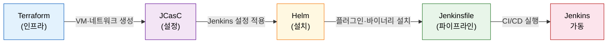
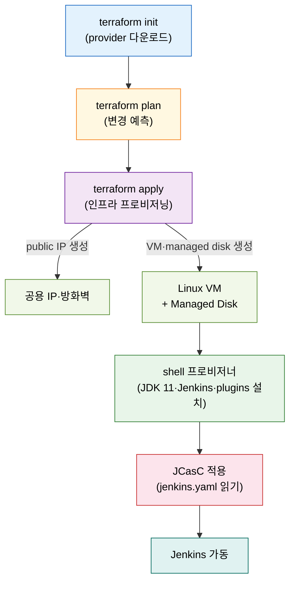

# IaC로 Jenkins 배포 — Terraform·JCasC·Helm

---

> 이 문서를 읽고 나면 왜 Jenkins를 코드로 배포하는지 **설명하고**, JCasC 코드 3종(jenkins.yaml·plugins.txt·override.conf)의 역할과 순서 의존성을 **구분하며**, Terraform azurerm 배포 흐름을 **예측**하고, K8s와 VM 배포 방식 중 무엇을 고를지 **선택**할 수 있습니다.


## 사전 지식

Jenkins 기본 설정 화면(Manage Jenkins)과 플러그인 개념을 알고 있으면 좋습니다. Kubernetes Pod·Helm의 기본 개념(`../03_agent/`)과 JCasC의 상세 동작(`../02_security/`)을 미리 읽어 두면 이 편의 "배포 시점 묶음" 관점이 더 빠르게 읽힙니다.


## 진입 — 왜 IaC로 Jenkins를 배포해야 하는가

> 손으로 클릭해 만든 Jenkins는 다음 번에 똑같이 재현할 수 없습니다.

Jenkins를 GUI로 설치하고 플러그인을 클릭해 구성하면, 그 순간 작동하는 서버를 얻을 수 있습니다. 그러나 그 서버가 어떤 설정으로 되어 있는지를 문서화하지 않으면, 서버가 교체되거나 신규 환경이 필요할 때 처음부터 다시 기억을 더듬어야 합니다. IaC(Infrastructure as Code)는 인프라 생성부터 설정 적용까지 전 과정을 코드 파일로 선언해, 같은 코드를 실행하면 언제 어디서든 동일한 Jenkins를 얻을 수 있도록 합니다. 이 재현성이 IaC 도입의 핵심 이유입니다.


## 1. 왜 코드로 배포하나 — 재현성

> IaC·JCasC·Helm·Pipeline-as-Code 네 층이 각각 인프라·설정·설치·파이프라인을 코드화해 환경 간 동일 재현을 보장합니다.

> 이미 아는 "레시피 카드"의 **인프라판**입니다. 같은 재료와 순서를 적어 두면 누가 만들어도 같은 요리가 나옵니다.

Jenkins를 코드로 배포하는 작업은 책(Learning Continuous Integration with Jenkins 3e, Figure 2.19)이 제시하는 네 층의 코드화로 나뉩니다.

| 층 | 도구 | 코드화 대상 |
|----|------|------------|
| 인프라 | Terraform | VM·네트워크·디스크 프로비저닝 |
| 설정 | JCasC (jenkins.yaml) | Jenkins 시스템 설정·보안 영역 |
| 설치 | Helm 또는 shell 스크립트 | Jenkins 바이너리·플러그인 설치 |
| 파이프라인 | Jenkinsfile | CI/CD 파이프라인 로직 |

네 층이 모두 버전 관리되면 Git 히스토리 하나로 "언제 어떤 Jenkins가 어떤 파이프라인을 실행했는지"를 추적할 수 있습니다.

레시피 카드 비유는 강력하지만 한계가 있습니다. 레시피가 클라우드 quota·네트워크 상태·외부 서비스 가용성까지 보장하지는 않기 때문입니다. 실제 환경에서는 코드와 실제 인프라가 시간이 지나며 벌어지는 **drift**가 발생하고, 수동 개입이 완전히 사라지지 않습니다. 이 사실을 인지하고 정기적으로 `terraform plan`으로 drift를 감지하는 습관이 필요합니다.




## 2. JCasC 코드 3종

> jenkins.yaml·plugins.txt·override.conf 세 파일이 각각 설정·플러그인 목록·JVM 환경을 담당하며, 반드시 plugins.txt → override.conf → jenkins.yaml 순서로 의존합니다.

JCasC 배포는 세 파일로 구성됩니다. 각 파일의 역할과 예시는 책의 Azure VM 배포 예시를 그대로 따릅니다.

### jenkins.yaml — Jenkins 설정을 YAML로

`jenkins.yaml`은 Jenkins 시스템 설정 전체를 YAML로 선언합니다. Manage Jenkins 화면에서 클릭하던 항목들이 이 파일 하나에 담깁니다.

```yaml
jenkins:
  systemMessage: "Jenkins configured automatically by JCasC"
  # 로컬 사용자 데이터베이스를 보안 영역으로 사용한다
  # 운영 환경에서는 LDAP·OIDC로 교체한다
  securityRealm:
    local:
      allowsSignup: false
      users:
        - id: "admin"
          # 비밀번호는 환경변수로 주입한다 — 파일에 평문 기재 금지
          password: "${JENKINS_ADMIN_PASSWORD}"
  authorizationStrategy:
    loggedInUsersCanDoAnything:
      allowAnonymousRead: false
```

이 파일은 JCasC 플러그인(`configuration-as-code`)이 설치되어 있어야 읽힙니다. JCasC 플러그인 없이 Jenkins를 시작하면 jenkins.yaml은 무시됩니다.

### plugins.txt — 설치할 플러그인 목록

`plugins.txt`는 설치할 플러그인을 한 줄에 하나씩 선언합니다. `plugin-installation-manager-tool`이 이 파일을 읽어 플러그인을 일괄 설치합니다.

```text
# JCasC 플러그인 — jenkins.yaml을 읽는 데 반드시 필요하다
configuration-as-code:1775.v810dc950b_514
git:5.2.2
pipeline-model-definition:2.2214.vb_b_34b_2ea_9b_83
workflow-aggregator:596.v8c21c963d92d
kubernetes:4248.vfa_9517757b_b_a_
```

버전을 `<short-name>:<version>` 형식으로 고정하면 재현성이 높아집니다. 버전을 생략(`<short-name>` 만)하면 설치 시점의 최신 버전을 받으므로 환경마다 버전이 달라질 수 있습니다.

### override.conf — systemd 환경변수

`override.conf`는 Jenkins systemd 서비스의 환경변수를 재정의합니다. 가장 중요한 역할은 JCasC 플러그인에게 `jenkins.yaml` 파일의 위치를 알려주는 것입니다.

```ini
[Service]
# JCasC 플러그인이 이 경로에서 jenkins.yaml을 읽는다
# 경로가 틀리면 설정이 통째로 무시된다
Environment="CASC_JENKINS_CONFIG=/etc/jenkins/jenkins.yaml"
# JVM 힙과 GC를 명시한다 — 기본값이며 서버 메모리에 맞게 조정한다
Environment="JAVA_OPTS=-Xmx2g -XX:+UseG1GC"
```

### 순서 의존성

세 파일 사이에는 분명한 인과 관계가 있습니다. `jenkins.yaml`은 JCasC 플러그인이 있어야 읽힙니다. JCasC 플러그인은 `plugins.txt`를 처리해야 설치됩니다. `override.conf`는 `CASC_JENKINS_CONFIG` 변수로 `jenkins.yaml` 위치를 JCasC 플러그인에게 알립니다. 따라서 실행 순서는 반드시 **plugins.txt 처리 → override.conf 적용 → Jenkins 재시작으로 jenkins.yaml 읽기** 순이어야 합니다. 이 순서를 어기면 JCasC 설정이 조용히 무시됩니다.

JCasC의 상세 동작과 GitOps 연동은 [../02_security/02-01.설정을 코드로 — JCasC](../02_security/02-01.%EC%84%A4%EC%A0%95%EC%9D%84%20%EC%BD%94%EB%93%9C%EB%A1%9C%20%E2%80%94%20JCasC.md)에서 다룹니다. 이 편은 "배포 시점에 어떤 파일이 묶이는가"에 집중합니다.


## 3. Terraform azurerm 배포 흐름

> terraform init → plan → apply 세 명령이 인프라 프로비저닝부터 Jenkins 가동까지 한 번에 처리합니다.

예시는 책의 Azure VM(azurerm provider) 기준입니다. GCP는 `google` provider, AWS는 `aws` provider로 대응 리소스가 있습니다.

### 파일 구성

| 파일 | 역할 |
|------|------|
| `providers.tf` | azurerm provider 버전과 인증 선언 |
| `main.tf` | resource_group·public_ip·linux_vm·managed_disk·vm_extension |
| `variables.tf` | 리전·VM 크기·관리자 계정 등 변수 선언 |
| `outputs.tf` | 프로비저닝 후 출력할 공용 IP 등 |

`main.tf`의 핵심 블록 두 개를 보면 구조를 파악할 수 있습니다.

```hcl
# Azure Linux VM 리소스 — 기본값이며 vm_size는 환경에 맞게 조정한다
resource "azurerm_linux_virtual_machine" "jenkins" {
  name                = "jenkins-vm"
  resource_group_name = azurerm_resource_group.jenkins.name
  location            = var.location
  size                = "Standard_B2s"   # 기본값, 변경 가능
  admin_username      = var.admin_username

  os_disk {
    caching              = "ReadWrite"
    storage_account_type = "Standard_LRS"
  }

  source_image_reference {
    publisher = "Canonical"
    offer     = "UbuntuServer"
    sku       = "20.04-LTS"
    version   = "latest"
  }
}

# VM Extension — shell 스크립트로 JDK·Jenkins·플러그인을 설치한다
resource "azurerm_virtual_machine_extension" "jenkins_install" {
  name                 = "jenkins-install"
  virtual_machine_id   = azurerm_linux_virtual_machine.jenkins.id
  publisher            = "Microsoft.Azure.Extensions"
  type                 = "CustomScript"

  settings = jsonencode({
    # jenkins-installation.sh가 JDK 11, Jenkins, plugin-installation-manager-tool을 설치한다
    commandToExecute = "bash jenkins-installation.sh"
  })
}
```

`plugin-installation-manager-tool`은 Jenkins 공식 CLI 도구로, `plugins.txt`를 읽어 플러그인과 의존성을 한 번에 설치합니다. Jenkins를 시작하기 전에 플러그인을 미리 배치하므로 첫 기동 시 플러그인 불일치 문제를 방지합니다.

### 실행 명령

```bash
# provider 다운로드 및 초기화
terraform init

# 변경 사항 미리 보기 — 실제 변경 없음
terraform plan -out=tfplan

# 미리 만들어 둔 plan을 그대로 적용
terraform apply tfplan

# 인프라 전체 제거 (비용 절감·테스트 환경 정리 용도)
terraform destroy
```

`-out=tfplan`으로 plan 결과를 파일로 저장하면 `plan`과 `apply` 사이에 인프라 상태가 변경되어 의도와 다른 변경이 적용되는 상황을 방지할 수 있습니다.




## 4. K8s vs VM — 무엇을 고르나

> 확장성과 컨테이너 친숙도가 있으면 K8s Helm, 기존 Jenkins 이전이나 persistent storage 접근이 중요하면 VM Terraform을 선택합니다.

### K8s — Helm chart로 배포

Helm은 Kubernetes 애플리케이션 패키지 매니저입니다. Jenkins 공식 Helm chart는 `values.yaml` 하나로 Jenkins URL, JCasC 설정, 플러그인 목록, Ingress 구성을 모두 선언할 수 있습니다.

```bash
# Jenkins Helm 레포 추가
helm repo add jenkins https://charts.jenkins.io
helm repo update

# values.yaml로 커스터마이즈하여 설치
helm install jenkins jenkins/jenkins \
  --namespace jenkins \
  --create-namespace \
  -f values.yaml
```

`values.yaml` 예시에서 JCasC 설정은 `controller.JCasC.configScripts` 키 아래에 인라인으로 선언할 수 있습니다. Nginx Ingress Controller를 통해 외부에 노출합니다.

```yaml
controller:
  jenkinsUrl: "https://jenkins.example.com"
  installPlugins:
    - configuration-as-code:1775.v810dc950b_514
    - git:5.2.2
  JCasC:
    configScripts:
      welcome-message: |
        jenkins:
          systemMessage: "Helm으로 배포된 Jenkins"
ingress:
  enabled: true
  ingressClassName: nginx
  hostName: jenkins.example.com
```

### VM — Terraform으로 배포

Terraform VM 방식은 전통적인 Linux 서버에 Jenkins를 직접 설치합니다. managed disk로 `/var/lib/jenkins`를 마운트하므로 VM을 교체해도 데이터가 유지됩니다. 컨테이너 환경에 익숙하지 않은 팀이나, 기존 베어메탈·VM 기반 Jenkins를 그대로 IaC로 옮겨야 할 때 적합합니다.

### 선택 기준

| 기준 | K8s (Helm) | VM (Terraform) |
|------|-----------|----------------|
| 확장성 | 우수 — agent Pod 자동 확장 | 수동 증설 필요 |
| 관리 부담 | K8s 클러스터 지식 필요 | Linux 서버 관리로 충분 |
| 이전 난이도 | 기존 VM Jenkins 이전 시 컨테이너화 작업 필요 | 기존 구성 그대로 이전 가능 |
| Persistent storage | PVC 설정 필요 | managed disk 직접 마운트, 단순 |
| 비용 효율 | agent 미사용 시 자원 반납 | VM은 대기 중에도 과금 |

06-02 배포 평가 편의 결론과 연결하면, 컨테이너 K8s가 확장성·비용 면에서 종합 최적이지만 팀의 컨테이너 숙련도와 전환 비용을 고려해 VM에서 시작하고 단계적으로 이전하는 선택도 합리적입니다.


## 면접 질문

> 답을 떠올린 뒤 §정답 절에서 같은 번호로 대조하세요.

1. `jenkins.yaml`·`plugins.txt`·`override.conf` 세 파일의 역할은 각각 무엇이며, 왜 plugins.txt를 가장 먼저 처리해야 하나요?
2. `terraform init`·`terraform plan`·`terraform apply`는 각각 어떤 일을 하나요? plan 결과를 파일로 저장하는 이유는 무엇인가요?
3. K8s Helm 배포와 Terraform VM 배포 중 어느 쪽을 선택할지 결정하는 핵심 기준 두 가지는 무엇인가요?

### 빈칸 채우기 — IaC Jenkins 배포

다음 문장의 빈칸을 채워 보세요.

1. JCasC 플러그인에게 `jenkins.yaml` 파일 위치를 알려주는 환경변수는 `______`입니다.
2. `plugin-installation-manager-tool`이 읽는 플러그인 목록 파일은 `______`입니다.
3. Terraform이 인프라 변경 사항을 실제 적용하기 전에 미리 보여주는 명령은 `terraform ______`입니다.
4. Helm chart로 Kubernetes에 Jenkins를 배포하는 도구는 `______` chart입니다.


## 정답

> 위 질문을 스스로 설명해 본 뒤에 펼치세요.

### 정답 1 — JCasC 3종의 역할과 순서 의존성

`plugins.txt`는 설치할 플러그인 목록이고, `override.conf`는 systemd 서비스의 환경변수(특히 `CASC_JENKINS_CONFIG`)를 설정하며, `jenkins.yaml`은 Jenkins 시스템 설정 전체를 YAML로 선언합니다. `plugins.txt`를 먼저 처리해야 하는 이유는 `jenkins.yaml`을 읽는 JCasC 플러그인(`configuration-as-code`)이 이 단계에서 설치되기 때문입니다. JCasC 플러그인이 없으면 Jenkins는 `jenkins.yaml` 파일을 무시하고 기본 상태로 기동됩니다.

### 정답 2 — terraform 세 명령의 역할

`terraform init`은 provider 플러그인을 다운로드하고 작업 디렉토리를 초기화합니다. `terraform plan`은 현재 인프라 상태와 코드를 비교해 어떤 리소스가 생성·변경·삭제될지 미리 보여줍니다. 실제 변경은 일어나지 않습니다. `terraform apply`는 plan에서 확인한 변경을 실제로 클라우드에 적용합니다. `-out=tfplan`으로 plan 결과를 파일로 저장하는 이유는, plan과 apply 사이에 인프라 상태가 바뀌었을 때 의도하지 않은 변경이 적용되는 것을 막기 위해서입니다.

### 정답 3 — K8s vs VM 선택 기준

가장 중요한 두 기준은 **팀의 컨테이너 숙련도**와 **기존 Jenkins 이전 난이도**입니다. 컨테이너와 Kubernetes에 익숙하고 agent 자동 확장이 필요하면 Helm이 적합합니다. 반대로 기존 VM 기반 Jenkins를 그대로 이전해야 하거나 팀이 Linux 서버 관리에 더 익숙하다면 Terraform VM이 전환 비용이 낮습니다. persistent storage 접근이 단순해야 한다면(managed disk 직접 마운트) VM이 유리합니다.

### 빈칸 정답 — IaC Jenkins 배포

1. `CASC_JENKINS_CONFIG` — JCasC 플러그인이 이 환경변수에서 jenkins.yaml 경로를 읽습니다.
2. `plugins.txt` — plugin-installation-manager-tool이 이 파일을 읽어 플러그인을 일괄 설치합니다.
3. `plan` — `terraform plan`은 변경 사항을 미리 보여주며 실제 적용하지 않습니다.
4. `jenkins/jenkins` — `helm install jenkins jenkins/jenkins` 형식으로 사용합니다.


## 관련 문서

> 이 편의 배포 구성 요소들이 각자의 영역에서 어떻게 동작하는지는 아래 문서에서 상세히 다룹니다.

- [06-00. 점검 — 핵심 질문과 답 (계획·배포)](01-00.점검.핵심%20질문과%20답%20%28계획%C2%B7배포%29.md) § "핵심 질문" — 이 장 전체를 Q&A로 자가 점검
- [06-02. 배포 시나리오와 Well-Architected 평가](01-02.배포%20시나리오와%20Well-Architected%20평가.md) § "코드화 3계층" — K8s/VM 선택과 6 pillars 평가의 연결
- [../02_security/02-01.설정을 코드로 — JCasC](../02_security/02-01.%EC%84%A4%EC%A0%95%EC%9D%84%20%EC%BD%94%EB%93%9C%EB%A1%9C%20%E2%80%94%20JCasC.md) § "JCasC 동작 원리" — jenkins.yaml 파싱과 GitOps 연동 상세
- [../02_security/02-02.JCasC 운영과 GitOps](../02_security/02-02.JCasC%20%EC%9A%B4%EC%98%81%EA%B3%BC%20GitOps.md) § "GitOps 연동" — jenkins.yaml 변경을 Git 커밋으로 반영하는 운영 패턴
- [../03_agent/02-01.Kubernetes Jenkins 구축](../03_agent/02-01.Kubernetes%20Jenkins%20%EA%B5%AC%EC%B6%95.md) § "Helm 설치" — K8s 클러스터에 Helm chart로 Jenkins를 구축하는 단계별 절차
- [../03_agent/02-02.Kubernetes Jenkins 운영](../03_agent/02-02.Kubernetes%20Jenkins%20%EC%9A%B4%EC%98%81.md) § "agent Pod" — K8s 배포 이후 agent Pod 관리와 persistent volume 운영
