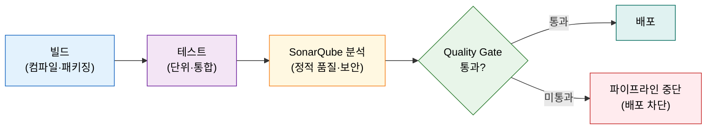
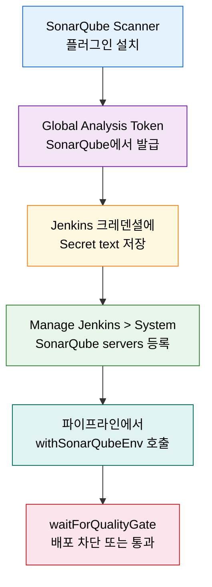

# SonarQube 연동 — 정적분석 게이트

---

> 이 문서를 읽고 나면 정적 분석이 CI 파이프라인에 들어오는 자리를 **설명하고**, SonarQube를 Helm으로 배포하는 흐름을 **예측**하며, Scanner 플러그인·analysis token 설정을 **구분**하고, Quality Gate로 배포를 막는 패턴을 **선택**할 수 있습니다.


## 사전 지식

Jenkins Pipeline의 `stage` 구조와 Helm 기본 개념을 알고 있으면 좋습니다. Helm으로 Jenkins를 배포하는 흐름은 [`06-03.IaC로 Jenkins 배포 — Terraform·JCasC·Helm`](01-03.IaC%EB%A1%9C%20Jenkins%20%EB%B0%B0%ED%8F%AC%20%E2%80%94%20Terraform%C2%B7JCasC%C2%B7Helm.md)에서 다루고 있으며, 이 편은 동일 클러스터에 SonarQube를 추가로 올리는 시나리오를 따릅니다.


## 진입 — 왜 SonarQube를 CI에 연동하는가

> 빌드와 테스트를 통과한 코드가 배포 직전 품질 검문소를 통과하지 못하면 자동으로 차단됩니다.

빌드가 성공하고 테스트가 통과한다고 해서 코드 품질까지 보장되지는 않습니다. 중복 코드, 잠재적 보안 취약점, 테스트 커버리지 미달은 빌드 결과에 드러나지 않습니다. SonarQube는 이런 항목을 정적으로 측정하고, Quality Gate 기준을 충족하지 못한 코드가 배포로 넘어가지 않도록 파이프라인을 중단합니다. 연동을 올바르게 구성해 두면, 배포 승인 전에 품질 기준 미달을 자동으로 잡을 수 있습니다.


## 1. 정적 분석이 CI에 들어오는 자리

> 빌드와 테스트 사이에 SonarQube 분석 단계가 끼어들고, Quality Gate가 통과·차단을 결정합니다.

> 이미 아는 "테스트가 빌드 후 도는" CI에, **코드 품질·보안 검사를 한 단계 더 끼우는** 것입니다.

SonarQube는 소스 코드를 정적으로 분석해 코드 품질, 보안 취약점, 신뢰성, 유지보수성을 측정하고 코딩 표준 준수 여부를 확인합니다. 런타임에 코드를 실행하지 않으므로, 동적 테스트와 달리 빌드 산출물 없이도 소스만으로 분석할 수 있습니다.

이 과정을 **품질 검문소**에 빗댈 수 있습니다. 빌드 산출물이 배포로 이동하려면 검문소(Quality Gate)를 통과해야 합니다. 검문소는 사전에 정해진 품질 기준(커버리지 %, 신규 버그 수, 심각도 취약점 수 등)을 확인하고, 기준 미달이면 배포를 차단합니다. 다만 이 비유에는 한계가 있습니다. 검문소는 정적 규칙만 보기 때문에, 런타임 결함이나 서비스 간 통합 버그는 별도의 동적 테스트가 담당해야 합니다.




## 2. SonarQube Helm 배포 + Nginx Ingress

> SonarQube를 jenkins와 같은 클러스터·다른 네임스페이스에 Helm으로 올리고, Nginx Ingress로 외부에 노출합니다.

예시는 책(Learning Continuous Integration with Jenkins 3e)의 Azure AKS 기준입니다. GCP GKE·AWS EKS도 동일 Helm chart를 사용하며 provider별 Ingress 어노테이션만 다릅니다.

### Nginx Ingress Controller 배포

SonarQube 전용 Nginx Ingress Controller를 `sonarqube` 네임스페이스에 올립니다. Jenkins용 Ingress와 분리해 라우팅 충돌을 막기 위한 구성입니다.

```bash
# sonarqube 네임스페이스에 Nginx Ingress Controller를 분리 배포한다
# ingressClassResource.name을 sonarqube-nginx로 지정해 Jenkins용 nginx와 구분한다
helm upgrade --install ingress-nginx ingress-nginx/ingress-nginx \
  --namespace sonarqube \
  --create-namespace \
  --set controller.ingressClassResource.name=sonarqube-nginx
```

### SonarQube Helm 배포

```bash
# SonarQube 공식 Helm chart 레포를 추가한다
helm repo add sonarqube https://SonarSource.github.io/helm-chart-sonarqube
helm repo update

# chart 버전 ~8 = SonarQube 9.9 LTS 계열
# StatefulSet으로 배포되므로 PVC 바인딩까지 기동에 수 분이 걸린다
helm upgrade --install sonarqube sonarqube/sonarqube \
  --namespace sonarqube \
  --version ~8
```

### Ingress 리소스로 외부 노출

```yaml
apiVersion: networking.k8s.io/v1
kind: Ingress
metadata:
  name: sonarqube-ingress
  namespace: sonarqube
spec:
  # Jenkins용 nginx 클래스와 구분하기 위해 sonarqube-nginx를 지정한다
  ingressClassName: sonarqube-nginx
  rules:
    - host: sonarqube.example.com
      http:
        paths:
          - path: /
            pathType: Prefix
            backend:
              service:
                name: sonarqube-sonarqube
                port:
                  number: 9000   # SonarQube 기본 포트
```

배포가 완료되면 `sonarqube.example.com`으로 접근할 수 있습니다. 최초 로그인은 `admin / admin`이며, 접속 즉시 비밀번호를 변경해야 합니다.


## 3. Scanner 플러그인 · analysis token · 크레덴셜

> Jenkins에 SonarQube Scanner 플러그인을 설치하고, SonarQube에서 발급한 analysis token을 Jenkins 크레덴셜에 저장합니다.

### SonarQube Scanner 플러그인 설치

Jenkins 대시보드에서 **Manage Jenkins > Plugins > Available plugins**으로 이동해 `SonarQube Scanner`를 검색하고 설치합니다. UI 경로는 책 기준이며 Jenkins 버전에 따라 메뉴 위치가 달라질 수 있습니다.

### Global Analysis Token 생성

SonarQube UI에서 **My Account > Security** 탭으로 이동합니다. Token 생성 화면에서 Type을 **Global Analysis Token**으로 선택합니다. Global Analysis Token은 코드 분석 요청 전용으로 설계된 최소 권한 토큰으로, 프로젝트 관리나 사용자 설정 변경 권한이 없습니다.

이 토큰은 **생성 시 한 번만 표시**됩니다. 화면을 닫으면 다시 볼 수 없으므로 즉시 복사해 두어야 합니다.

이 토큰을 **검문소 통행증**에 빗댈 수 있습니다. 분석 요청이라는 한 가지 목적으로만 사용 가능한 제한 토큰이어서, 유출되어도 프로젝트 설정 변경이나 사용자 계정에 영향을 주지 않습니다.

### Jenkins 크레덴셜 등록

발급받은 토큰을 Jenkins 크레덴셜에 Secret text 타입으로 저장합니다.

```
Manage Jenkins > Credentials > System > Global credentials > Add Credentials
  Kind: Secret text
  Secret: <복사한 analysis token>
  ID: sonarqube-token
```


## 4. 파이프라인 연동 — withSonarQubeEnv · waitForQualityGate

> `withSonarQubeEnv`로 분석을 실행하고, `waitForQualityGate`로 결과를 기다려 미통과 시 파이프라인을 중단합니다.

### SonarQube 서버 등록

Jenkins에 SonarQube 서버 정보를 등록합니다.

```
Manage Jenkins > System > SonarQube servers > Add SonarQube
  Name: SonarQube          ← 파이프라인에서 이 이름으로 참조한다
  Server URL: http://sonarqube.example.com
                           ← trailing / 를 붙이면 URL 조합 오류가 발생한다 (책 주의사항)
  Server authentication token: sonarqube-token (secret text 선택)
```

### 파이프라인 예시

```groovy
pipeline {
    agent any

    stages {
        stage('Build') {
            steps {
                sh 'mvn clean package -DskipTests'
            }
        }

        stage('SonarQube 분석') {
            steps {
                // withSonarQubeEnv: 블록 안 명령에 서버 URL·토큰을 환경변수로 자동 주입한다
                // 괄호 안 문자열은 Manage Jenkins > System에 등록한 서버 이름과 일치해야 한다
                withSonarQubeEnv('SonarQube') {
                    sh 'mvn sonar:sonar'
                }
            }
        }

        stage('Quality Gate') {
            steps {
                // 분석은 비동기로 처리되어 SonarQube webhook으로 결과를 받는다
                // abortPipeline: true → Quality Gate 미통과 시 파이프라인을 중단해 배포를 차단한다
                waitForQualityGate abortPipeline: true
            }
        }

        stage('배포') {
            steps {
                sh './deploy.sh'
            }
        }
    }
}
```

`waitForQualityGate`는 분석 결과를 SonarQube webhook으로 수신합니다. 따라서 SonarQube 서버에서 Jenkins URL로 webhook을 설정해 두어야 합니다. webhook이 없으면 `waitForQualityGate`가 타임아웃될 수 있습니다.

### 설정 순서 요약




## 5. 실무 변형 — gradle에서 sonar를 직접 호출

> 위 정석은 Scanner 플러그인 + `withSonarQubeEnv`로 서버 설정을 Jenkins에 등록해 두는 방식입니다. 현장에서는 빌드 도구(gradle)에서 `sonar` 태스크를 직접 부르며 설정을 `-D`로 넘기기도 합니다.

§4는 Scanner 플러그인을 설치하고 SonarQube 서버를 Manage Jenkins에 등록한 뒤 `withSonarQubeEnv('SonarQube')`로 감싸는 책 정석입니다. 그런데 Java 프로젝트는 SonarQube의 gradle 플러그인이 있어, `./gradlew sonar` 한 줄로 분석을 돌릴 수 있습니다. 이때는 서버 URL·토큰·프로젝트 키를 Jenkins 서버 설정 대신 `-D` 시스템 프로퍼티로 직접 넘깁니다.

```groovy
docker.image(env.BUILD_BASE_IMG).inside('--network=host') {
    sh '''set -eu
        ./gradlew clean classes testClasses sonar \
          -Dsonar.host.url="$SONAR_URL" \
          -Dsonar.token="$SONAR_TOKEN" \
          -Dsonar.projectKey="$SONAR_PROJECT_KEY" \
          -Dsonar.branch.name="$SONAR_BRANCH_NAME" \
          -Dsonar.analysis.jobExcnId="$JOB_EXCN_ID"
    '''
}
```

두 가지가 §4와 다릅니다. 첫째, **서버 설정이 코드 쪽으로** 옵니다. 플러그인 등록 없이 `-Dsonar.host.url`·`-Dsonar.projectKey`로 어디에 어떤 프로젝트로 보낼지 매번 지정합니다. 파라미터화([`06-20`](06-04.인라인%20Pipeline%20Script형%20Job%20%E2%80%94%20config.xml%20형상%C2%B7CpsFlowDefinition%C2%B7파라미터화.md))와 결합하면 같은 Job으로 프로젝트만 바꿔 분석할 수 있습니다. 둘째, `-Dsonar.analysis.jobExcnId` 같은 **커스텀 분석 프로퍼티**를 실어 보냅니다. 이 값은 SonarQube가 분석 완료 webhook을 쏠 때 그대로 되돌아오므로, 외부 시스템이 "어느 Job 실행의 결과인지" 매칭하는 키로 씁니다. `waitForQualityGate`로 빌드 안에서 동기로 기다리는 대신, webhook으로 비동기 결과를 외부에서 받는 설계입니다.

다만 `-Dsonar.token`에 토큰을 직접 쓰면 **빌드 로그·config에 평문 노출** 위험이 있습니다. 토큰은 `-D` 인자에 박지 말고 `withCredentials`로 환경변수에 주입한 값(`$SONAR_TOKEN`)을 참조해야 합니다. 토큰 하드코딩 안티패턴은 [`../02_security/01-02.시크릿 관리와 최소 권한 원칙.md`](../02_security/01-02.시크릿%20관리와%20최소%20권한%20원칙.md) §3에서 다룹니다.


## 면접 질문

> 답을 떠올린 뒤 §정답 절에서 같은 번호로 대조하세요.

1. `waitForQualityGate abortPipeline: true`는 파이프라인 안에서 구체적으로 어떤 일을 합니까?
2. Global Analysis Token을 최소 권한으로 만드는 이유는 무엇입니까?
3. SonarQube Server URL에 trailing `/`를 넣으면 안 되는 이유는 무엇입니까?

### 빈칸 채우기 — SonarQube 연동

다음 문장의 빈칸을 채워 보세요.

1. SonarQube Ingress가 외부에 노출하는 기본 포트는 `______`입니다.
2. 분석 결과가 비동기로 도착할 때까지 기다리는 파이프라인 스텝은 `______`입니다.
3. Helm chart `~8`이 설치하는 SonarQube 버전은 `______` LTS입니다.
4. 분석 전용 최소 권한 토큰의 타입은 Global `______` Token입니다.


## 정답

> 위 질문을 스스로 설명해 본 뒤에 펼치세요.

### 정답 1 — waitForQualityGate의 동작

`waitForQualityGate`는 SonarQube 서버에서 분석이 완료됐다는 webhook 알림을 기다립니다. 알림이 도착하면 Quality Gate 결과를 확인하고, `abortPipeline: true`가 설정된 상태에서 미통과이면 파이프라인을 즉시 중단합니다. 이 단계가 배포 stage 앞에 있으면, Quality Gate를 통과하지 못한 코드는 배포 stage에 도달하지 못합니다.

### 정답 2 — 최소 권한 토큰을 만드는 이유

Global Analysis Token은 코드 분석 요청만 가능하고 프로젝트 설정 변경, 사용자 관리, 결과 삭제 같은 권한은 없습니다. 토큰이 유출되더라도 공격자가 할 수 있는 행동이 분석 요청 제출로 한정되기 때문에 피해 범위를 최소화할 수 있습니다. 최소 권한 원칙(Principle of Least Privilege)을 적용한 것입니다.

### 정답 3 — trailing / 금지 이유

Jenkins의 SonarQube 플러그인은 등록된 Server URL에 API 경로를 이어 붙여 최종 URL을 조합합니다. URL 끝에 `/`가 이미 있으면 `http://sonarqube.example.com//api/...`처럼 슬래시가 이중으로 붙어 요청이 실패합니다. 책에서도 trailing `/`를 명시적으로 금지하는 이유입니다.

### 빈칸 정답 — SonarQube 연동

1. `9000` — SonarQube가 기본으로 사용하는 포트입니다.
2. `waitForQualityGate` — webhook으로 분석 완료 신호를 받을 때까지 파이프라인을 블로킹합니다.
3. `9.9` — chart 버전 ~8은 SonarQube 9.9 LTS 계열을 설치합니다.
4. `Analysis` — Global Analysis Token은 분석 전용 최소 권한 토큰입니다.


## 관련 문서

> 같은 06_infra 장의 배포·연동 편과, 도구 비교편을 함께 보면 SonarQube의 위치가 더 명확해집니다.

- [06-00. 점검 — 핵심 질문과 답 (계획·배포)](01-00.%EC%A0%90%EA%B2%80.%ED%95%B5%EC%8B%AC%20%EC%A7%88%EB%AC%B8%EA%B3%BC%20%EB%8B%B5%20%28%EA%B3%84%ED%9A%8D%C2%B7%EB%B0%B0%ED%8F%AC%29.md) § "핵심 질문" — 이 장 전체를 Q&A로 자가 점검
- [06-03. IaC로 Jenkins 배포 — Terraform·JCasC·Helm](01-03.IaC%EB%A1%9C%20Jenkins%20%EB%B0%B0%ED%8F%AC%20%E2%80%94%20Terraform%C2%B7JCasC%C2%B7Helm.md) § "K8s — Helm chart로 배포" — 동일 클러스터에 Jenkins를 올리는 Helm 배포 흐름
- [../02_security/README.md](../02_security/README.md) — 크레덴셜 최소 권한 원칙과 시크릿 관리 전략
