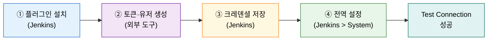
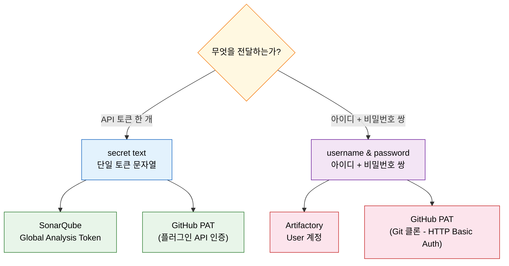
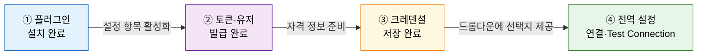

# 외부 도구 통합 4단계 비교

---

> 이 문서를 읽고 나면 모든 외부 도구 통합의 공통 4단계를 **설명하고**, 도구별 토큰 생성 경로 차이를 **구분하며**, 크레덴셜 타입을 상황에 맞게 **선택**하고, 전역 설정이 왜 항상 마지막인지 **설명**할 수 있습니다.

## 사전 지식

Jenkins 플러그인 설치(Manage Jenkins > Plugins)와 크레덴셜 저장(Manage Jenkins > Credentials)의 기본 화면을 본 적 있으면 충분합니다. GitHub·SonarQube·Artifactory를 각각 개별 도구로 먼저 접한 뒤 이 편을 읽으면 "따로 배운 것이 실은 같은 골격이었다"는 통찰이 더 선명하게 드러납니다.

## 진입 — 왜 통합 4단계를 정리해야 하는가

> 도구마다 따로 배운 통합 절차가 사실 하나의 골격 위에 도구별 어댑터를 얹은 것임을 보면, 새 도구를 처음 접해도 어디서 무엇을 해야 하는지 즉시 파악할 수 있습니다.

Jenkins에 GitHub·SonarQube·Artifactory를 연결하는 과정은 문서마다 따로 설명됩니다. 각 도구의 UI 경로·토큰 이름·플러그인 이름이 달라 마치 완전히 다른 작업처럼 느껴집니다. 그러나 실행 순서와 각 단계의 역할은 세 도구 모두 동일합니다. 이 공통 골격을 먼저 잡아 두면 새 도구를 접할 때 "플러그인은 어디서 설치하고, 토큰은 어느 쪽에서 만들고, 크레덴셜 타입은 무엇을 쓰고, 전역 설정은 어디서 연결하는가"를 빠르게 채울 수 있습니다.

## 1. 모든 통합의 공통 4단계

> 플러그인 설치 → 토큰 생성 → 크레덴셜 저장 → 전역 설정 순서는 GitHub·SonarQube·Artifactory 세 도구 모두 동일합니다.

> 이미 아는 "콘센트와 어댑터"의 **Jenkins 통합판**입니다. 전원 공급(통합 흐름)은 항상 같고, 플러그 모양(토큰 경로·크레덴셜 타입)만 도구마다 다릅니다.

외부 도구를 Jenkins에 연결하는 작업은 언제나 네 단계를 이 순서대로 거칩니다. 책(Learning Continuous Integration with Jenkins 3e)은 GitHub·SonarQube·Artifactory 세 도구의 통합 절차를 각각 설명하는데, 세 절차를 나란히 놓으면 공통 뼈대가 드러납니다.

| 단계 | 수행 위치 | 하는 일 |
|------|----------|---------|
| ① 플러그인 설치 | Jenkins | Manage Jenkins > Plugins에서 해당 도구 플러그인 설치 |
| ② 토큰·유저 생성 | 외부 도구 | 도구 측 관리 화면에서 인증 자격 발급 |
| ③ 크레덴셜 저장 | Jenkins | Manage Jenkins > Credentials에 발급된 자격 등록 |
| ④ 전역 설정 | Jenkins | Manage Jenkins > System에서 도구와 크레덴셜을 연결 후 Test Connection |

콘센트 비유는 네 단계의 순서를 직관적으로 설명합니다. 전원 공급(통합 흐름)은 세 도구 모두 동일하지만, 플러그 모양(토큰 생성 경로·크레덴셜 타입)은 도구마다 다릅니다. 다만 이 비유는 "규격이 같으면 꽂으면 된다"까지만 맞습니다. 실제로는 규격(4단계)이 같아도 각 도구의 권한 모델(스코프·역할·그룹 설정)은 직접 확인해야 합니다.

## 2. 도구별 토큰·유저 생성 경로 차이

> GitHub·SonarQube·Artifactory는 4단계 골격을 공유하지만, ②번 단계에서 토큰을 발급하는 UI 경로와 산출물 형태가 각각 다릅니다.

세 도구 모두 "토큰 생성"이라는 같은 이름의 단계를 거치지만, 도구마다 경로와 산출물이 다릅니다. GitHub는 사용자 계정의 Developer settings에서 PAT(Personal Access Token)를 발급하고, SonarQube는 My Account의 Security 탭에서 분석 전용 토큰을 발급하며, Artifactory는 관리자 화면에서 유저를 생성하고 권한을 별도로 부여합니다. 아래 표의 UI 경로는 책(Learning Continuous Integration with Jenkins 3e) 기준이며, 각 도구의 UI는 버전에 따라 변동될 수 있습니다.

| 도구 | 플러그인 이름 | 토큰·유저 생성 위치 (책 기준, UI 변동 가능) | 크레덴셜 타입 | 전역 설정 위치 |
|------|-------------|------------------------------------------|-------------|--------------|
| GitHub | GitHub | Settings > Developer settings > Personal access tokens (Classic) — 스코프: `admin:repo_hook`, `repo` | secret text (플러그인 인증) + username & password (클론) | Manage Jenkins > System > GitHub |
| SonarQube | SonarQube Scanner | My Account > Security > Generate Tokens — 유형: Global Analysis Token | secret text | Manage Jenkins > System > SonarQube servers |
| Artifactory (JFrog) | Artifactory (JFrog) | Administration > User Management > Users — 유저 생성 후 Permissions에서 권한 부여 | username & password | Manage Jenkins > System > JFrog |

"토큰 생성"이라는 표현이 세 도구에서 공통으로 등장하지만 산출물은 서로 다릅니다. GitHub PAT는 `ghp_`로 시작하는 단일 문자열이고, SonarQube Global Analysis Token도 단일 문자열이지만 분석 전용으로 발급됩니다. Artifactory는 토큰 문자열이 아니라 아이디와 비밀번호 쌍을 가진 유저 계정이 산출물입니다. 이 차이가 다음 절에서 설명할 크레덴셜 타입 선택을 결정합니다.

## 3. 크레덴셜 타입 선택 — secret text vs username & password

> API·플러그인 인증에는 secret text, 클론·로그인처럼 아이디와 비밀번호 쌍이 필요한 곳에는 username & password를 사용합니다.

Jenkins Credentials에는 여러 타입이 있지만, 외부 도구 통합에서 가장 자주 쓰는 것은 **secret text**와 **username & password** 두 가지입니다. 선택 기준은 상대방이 무엇을 기대하는가에 달려 있습니다.

**secret text**는 하나의 불투명한 문자열(토큰)을 저장합니다. 플러그인이 API를 호출할 때 Authorization 헤더나 쿼리 파라미터로 그 문자열 하나를 전달하면 충분한 경우에 사용합니다. SonarQube의 Global Analysis Token과 GitHub PAT를 Jenkins GitHub 플러그인 인증에 쓸 때가 이에 해당합니다.

**username & password**는 아이디와 비밀번호 쌍을 저장합니다. Git 클론처럼 HTTP Basic Auth 형식을 기대하는 경우, 또는 Artifactory처럼 유저 계정으로 로그인하는 구조일 때 사용합니다.

| 상황 | 타입 | 대표 예시 |
|------|------|----------|
| 플러그인이 API 호출 시 단일 토큰 전달 | secret text | SonarQube analysis token, GitHub PAT (플러그인 인증) |
| Git 클론·HTTP Basic Auth·유저 로그인 | username & password | GitHub PAT (클론용), Artifactory user |

GitHub가 두 타입을 모두 사용하는 이유는 역할이 다르기 때문입니다. Jenkins GitHub 플러그인이 Webhook을 등록하고 빌드 상태를 GitHub API로 전송할 때는 secret text PAT를 씁니다. 반면 Pipeline 안의 `checkout scm`이 저장소를 클론할 때는 HTTP Basic Auth 형식(아이디: GitHub 계정명, 비밀번호: PAT)을 사용하므로 username & password 크레덴셜이 필요합니다.

## 4. 전역 설정이 왜 항상 마지막인가

> 플러그인·토큰·크레덴셜이 모두 준비되어야 전역 설정에서 그것들을 연결할 수 있으므로, 전역 설정은 항상 4단계 중 마지막입니다.

책의 Q&A가 세 도구 모두에서 공통으로 묻는 질문이 있습니다. "통합에서 가장 마지막 단계는 무엇인가?" 답은 항상 같습니다. Manage Jenkins > System에서 수행하는 **전역 설정**입니다.

이유는 의존성 순서에 있습니다. 전역 설정 화면에서 해야 하는 일은 "Jenkins가 어느 서버(URL)에 어느 크레덴셜로 연결하는가"를 선언하는 것입니다. 이 선언을 완성하려면 플러그인이 설치되어 설정 항목이 화면에 나타나야 하고, 크레덴셜이 이미 저장되어 드롭다운에서 선택할 수 있어야 합니다. 반대로 말하면, 크레덴셜이 없는 상태에서 전역 설정 화면을 열어도 연결에 쓸 크레덴셜을 지정할 수 없어 설정 자체가 불완전합니다.

순서를 어기면 어떻게 되는지를 생각해 보면 이해가 명확해집니다. 전역 설정을 먼저 열면 플러그인이 없어 해당 섹션 자체가 보이지 않을 수 있고, 크레덴셜이 없으면 드롭다운이 비어 있어 연결 대상을 지정할 수 없습니다. Test Connection 버튼을 눌러도 인증 정보가 없어 실패합니다. 앞 단계의 산출물이 뒤 단계의 입력으로 흘러들어가는 구조이기 때문에 순서를 앞당길 수 없습니다.

세 도구의 전역 설정 위치를 다시 확인하면 다음과 같습니다.

| 도구 | 전역 설정 위치 | 확인 방법 |
|------|--------------|---------|
| GitHub | Manage Jenkins > System > GitHub | Add GitHub Server 후 Test Connection |
| SonarQube | Manage Jenkins > System > SonarQube servers | Add SonarQube 후 URL·크레덴셜 입력 |
| Artifactory | Manage Jenkins > System > JFrog | Add JFrog Platform Instance 후 URL·크레덴셜 입력 |

전역 설정이 마지막인 이유는 단순히 관례가 아니라 의존성 관계 때문입니다. 이 순서를 이해하면 새로운 외부 도구를 처음 연결할 때도 어디서 무엇을 먼저 해야 하는지 막히지 않습니다.

## 면접 질문

> 답을 떠올린 뒤 §정답 절에서 같은 번호로 대조하세요.

1. GitHub 통합에서 가장 마지막 단계는 무엇이며, 그 단계에서 구체적으로 무엇을 하나요?
2. SonarQube 통합에서 가장 마지막 단계는 무엇인가요? 그 전에 Jenkins Credentials에 저장하는 크레덴셜 타입은 무엇인가요?
3. Artifactory 통합에서 가장 마지막 단계는 무엇인가요? Artifactory의 ②번 단계가 GitHub·SonarQube와 다른 점은 무엇인가요?
4. GitHub PAT에 `admin:repo_hook` 스코프가 필요한 이유는 무엇인가요?

### 빈칸 채우기 — 외부 도구 통합 4단계

다음 문장의 빈칸을 채워 보세요.

1. 모든 외부 도구 통합의 마지막 단계는 Manage Jenkins > System에서 수행하는 `______` 설정입니다.
2. SonarQube Global Analysis Token은 Jenkins Credentials에 `______` text 타입으로 저장합니다.
3. Artifactory user 계정은 Jenkins Credentials에 `______` & password 타입으로 저장합니다.

## 정답

> 위 질문을 스스로 설명해 본 뒤에 펼치세요.

### 정답 1 — GitHub 통합의 마지막 단계

마지막 단계는 Manage Jenkins > System > GitHub에서 수행하는 전역 설정입니다. 이 단계에서 GitHub Server URL을 입력하고, 앞서 저장해 둔 PAT 크레덴셜(secret text)을 선택한 뒤 Test Connection으로 연결을 확인합니다. 플러그인 설치(①)·PAT 발급(②)·크레덴셜 저장(③)이 모두 완료된 뒤에야 이 화면에서 선택할 크레덴셜이 드롭다운에 나타납니다.

### 정답 2 — SonarQube 통합의 마지막 단계와 크레덴셜 타입

마지막 단계는 Manage Jenkins > System > SonarQube servers에서 수행하는 전역 설정입니다. SonarQube My Account > Security에서 발급한 Global Analysis Token은 단일 문자열이므로 Jenkins Credentials에 **secret text** 타입으로 저장합니다. 전역 설정에서 SonarQube 서버 URL과 함께 이 크레덴셜을 지정하면 통합이 완성됩니다.

### 정답 3 — Artifactory 통합의 마지막 단계와 차이점

마지막 단계는 Manage Jenkins > System > JFrog에서 수행하는 전역 설정입니다. Artifactory의 ②번 단계가 GitHub·SonarQube와 다른 점은, 단일 토큰 문자열이 아니라 **유저 계정(아이디 + 비밀번호 쌍)**을 생성하고 권한을 별도로 부여한다는 점입니다. 이 때문에 Jenkins Credentials 저장 시 secret text가 아니라 username & password 타입을 사용합니다.

### 정답 4 — admin:repo_hook 스코프가 필요한 이유

`admin:repo_hook` 스코프는 저장소 Webhook을 읽고 쓰는 권한을 부여합니다(출처: docs.github.com/en/developers/apps/building-oauth-apps/scopes-for-oauth-apps). Jenkins GitHub 플러그인은 GitHub 저장소에 Webhook을 자동으로 등록해 push 이벤트를 수신합니다. 이 Webhook 등록 작업에 `admin:repo_hook` 스코프가 필요합니다. `repo` 스코프는 저장소 코드 읽기·쓰기와 커밋 상태 API 전송에 필요합니다. 두 스코프 모두 없으면 플러그인이 Webhook 등록에 실패하거나 빌드 결과를 GitHub에 전달하지 못합니다.

### 빈칸 정답 — 외부 도구 통합 4단계

1. `전역` 설정 — Manage Jenkins > System에서 플러그인·크레덴셜을 외부 도구 URL과 연결하는 단계입니다.
2. `secret` text — SonarQube Global Analysis Token은 단일 문자열이므로 secret text 타입에 저장합니다.
3. `username` & password — Artifactory는 유저 계정(아이디 + 비밀번호 쌍)으로 인증하므로 username & password 타입에 저장합니다.

## 관련 문서

> 이 편이 비교표로 종합한 내용의 원본 맥락과 크레덴셜 상세는 아래 문서에서 확인할 수 있습니다.

- [06-00.점검.핵심%20질문과%20답%20%28계획%C2%B7배포%29.md](01-00.점검.핵심%20질문과%20답%20%28계획%C2%B7배포%29.md) § "핵심 질문" — 06 장 전체를 Q&A로 자가 점검하는 출발점
- [06-03.IaC로%20Jenkins%20배포%20%E2%80%94%20Terraform%C2%B7JCasC%C2%B7Helm.md](01-03.IaC%EB%A1%9C%20Jenkins%20%EB%B0%B0%ED%8F%AC%20%E2%80%94%20Terraform%C2%B7JCasC%C2%B7Helm.md) § "코드 3종" — Jenkins 배포 시점에 플러그인 목록(plugins.txt)이 함께 처리되는 맥락
- [../02_security/01-02.시크릿%20관리와%20최소%20권한%20원칙.md](../02_security/01-02.%EC%8B%9C%ED%81%AC%EB%A6%BF%20%EA%B4%80%EB%A6%AC%EC%99%80%20%EC%B5%9C%EC%86%8C%20%EA%B6%8C%ED%95%9C%20%EC%9B%90%EC%B9%99.md) § "크레덴셜 타입" — secret text·username & password 외 SSH·Certificate 타입 상세와 최소 권한 원칙
- [../05_operations/02-06a.Webhook과%20외부%20연동.md](../05_operations/02-06a.Webhook%EA%B3%BC%20%EC%99%B8%EB%B6%80%20%EC%97%B0%EB%8F%99.md) § "Webhook 등록" — GitHub Webhook 자동 등록 흐름과 admin:repo_hook 스코프가 실제로 쓰이는 지점
