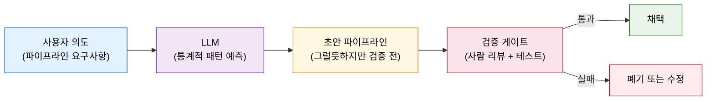
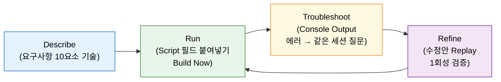

# AI로 파이프라인 초안 짜기 — Describe·Run·Troubleshoot·Refine

---

> 이 문서를 읽고 나면 LLM과 파이프라인을 짜는 4단계 반복 루프를 **설명하고**, 요구사항을 LLM이 이해하게 기술하는 법을 **적용하며**, LLM이 환경을 추측해 내놓는 틀린 step을 **진단**하고, AI 생성 코드를 언제 신뢰하면 안 되는지 **판단**할 수 있습니다.


## 사전 지식

Declarative Pipeline의 `pipeline { stages { stage { steps { } } } }` 골격을 알고 있으면 좋습니다. Groovy 문법을 깊이 몰라도 이 편을 읽는 데 지장은 없지만, Jenkins 파이프라인 기본 구조는 [`../01_core/02-01.코드로 파이프라인 정의하기`](../01_core/02-01.%EC%BD%94%EB%93%9C%EB%A1%9C%20%ED%8C%8C%EC%9D%B4%ED%94%84%EB%9D%BC%EC%9D%B8%20%EC%A0%95%EC%9D%98%ED%95%98%EA%B8%B0.md)에서 다루고 있습니다.


## 진입 — LLM을 파이프라인 작성 도구로 쓸 때의 출발점

> LLM은 초안을 빠르게 내놓는 도구입니다. 그러나 우리 Jenkins 환경을 모르므로, 생성된 코드는 반드시 검증해야 합니다.

LLM(ChatGPT 등)이 Groovy Declarative 구문을 흉내 낼 수 있다는 사실은 이미 알려져 있습니다. 이 편은 그것을 Jenkins 파이프라인 작성에 구체적으로 활용하는 방법과, 그 과정에서 반드시 지켜야 할 검증 의무를 다룹니다. 도구를 쓰는 방법과 도구의 한계를 동등한 무게로 다루는 것이 목표입니다.


## 1. LLM은 파이프라인을 어떻게 돕는가 — 그리고 못 돕는가

> LLM은 통계적 패턴 모방입니다. Declarative 구문 초안은 잘 내놓지만, 우리 환경을 알 방법이 없습니다.

LLM은 transformer 기반 신경망으로 **다음 토큰을 통계적으로 예측**합니다. 인간 뇌처럼 의미를 이해하는 것이 아니라, 학습 데이터에서 반복된 패턴을 모방합니다(책 Q&A: "LLM이 인간처럼 이해한다" — False). 이 점이 LLM 한계의 뿌리입니다.

그렇더라도 파이프라인 작성에서 LLM이 실질적으로 돕는 영역이 있습니다.

| 도울 수 있는 것 | 못 하는 것 |
|---------------|-----------|
| Declarative 구문 초안 빠르게 생성 | 우리 Jenkins에 어떤 플러그인이 설치됐는지 파악 |
| 에러 메시지 해석 힌트 제공 | 우리 크레덴셜 ID·agent 레이블 알기 |
| 반복적인 보일러플레이트 작성 | 최신 플러그인 step API 보장 |
| 일반적인 패턴 예시(stash·withEnv 등) | best practice·보안 미보장 |

비유로 이해하면 LLM은 "능숙한 신입 개발자의 초안"과 같습니다. 빠르게 그럴듯한 코드를 내놓지만, 우리 팀 컨벤션과 인프라를 모르므로 반드시 리뷰가 필요합니다. 신입과 다른 점이 하나 있습니다. 신입은 피드백을 받으면 학습하지만, LLM은 세션이 끝나면 우리가 나눈 맥락을 기억하지 못합니다. 다음 대화는 처음부터 다시 설명해야 합니다.

이 편의 예시는 ChatGPT를 기준으로 합니다. 그러나 어느 LLM이든 원리는 같습니다. 특정 벤더에 의존하지 않고, 방법론 자체가 이식 가능합니다.




## 2. Describe → Run → Troubleshoot → Refine 반복 루프

> 4단계 루프의 출발점은 Describe입니다. 나머지 세 단계는 첫 기술의 정확성에 의존합니다.

책(Learning Continuous Integration with Jenkins 3e)은 LLM과 파이프라인을 함께 만드는 협업 방법론을 4단계로 제시합니다.

**Describe**: 요구사항을 LLM이 이해할 수 있게 기술합니다. 책이 제시하는 10개 요소를 담을수록 초안의 정확도가 높아집니다.

| 요소 | 기술 내용 |
|------|----------|
| 개요 | 파이프라인이 하는 일 한 줄 |
| 목표 | 기대하는 결과(빌드·테스트·배포 등) |
| Stage와 Step | 단계별 수행 작업 |
| 통합 지점 | 연동하는 외부 도구(SonarQube·Artifactory 등) |
| 환경별 설정 | dev·staging·prod 분기 방식 |
| 에러 처리 | 실패 시 알림·롤백 등 |
| 테스트 | 단위·통합 테스트 포함 여부 |
| 트리거 | 커밋·스케줄·수동 등 |
| CI/CD 범위 | CI까지인지 CD(배포)까지인지 |
| 도구와 기술 | 설치된 플러그인·사용할 기술 스택 명시 |

특히 "도구와 기술" 요소가 중요합니다. 환경을 명시하지 않으면 LLM이 일반 CLI를 가정해 플러그인 step 대신 `sh curl`이나 `sh sonar-scanner`를 쓰는 초안을 냅니다. 이 문제는 §3에서 자세히 다룹니다.

**Run**: New Item → Pipeline → Script 필드에 초안을 붙여 넣고 Build Now로 즉시 실행합니다(UI 경로는 책 기준, 버전에 따라 다를 수 있습니다). VCS에서 Jenkinsfile을 가져오는 방식이 아니라 Script 필드에 직접 넣는 이유는 린트 오류와 동작을 즉시 확인하기 위해서입니다. 커밋·푸시 없이 빠르게 초안을 검증할 수 있습니다.

**Troubleshoot**: 빌드가 실패하면 Console Output의 에러 메시지를 복사합니다. *같은 채팅 세션*을 유지한 채 에러와 맥락을 함께 붙여넣어 질문합니다. 세션을 새로 열면 앞서 공유한 요구사항 맥락이 사라지므로 같은 세션 안에서 이어가는 것이 효율적입니다.

**Refine**: LLM이 제시한 수정안을 받으면 Jenkins의 **Replay** 기능으로 시험합니다. Replay는 저장된 파이프라인 스크립트를 변경하지 않고 Main Script 필드에서 수정 후 1회성으로 재실행하는 기능입니다. 일반 재빌드가 저장된 스크립트 그대로 다시 실행하는 것과 달리, Replay는 편집한 내용으로 한 번만 실행하므로 원본 job 설정에 영향을 주지 않습니다. 수정안이 검증되면 그때 Script 필드를 업데이트합니다.

요청 순서도 중요합니다. 전체 구조(섹션 배치) → 디렉티브(`agent`·`options`·`environment`) → 각 stage의 step 순서로 나눠 요청하면, 한 번에 모든 것을 요청하는 것보다 정확한 답변을 받을 수 있습니다.




## 3. 실전 — LLM이 환경을 추측해 틀리는 자리

> LLM은 우리 Jenkins에 어떤 플러그인이 설치됐는지 모릅니다. 환경을 명시하지 않으면 일반 CLI로 추측합니다.

책의 예제로 실제 흐름을 따라가 봅니다. Maven 프로젝트를 빌드·테스트하고, 정적 분석을 돌린 뒤, 아티팩트를 저장소에 올리는 파이프라인을 요청했을 때 LLM이 1차로 내놓은 초안의 주요 문제점은 다음과 같습니다.

| LLM 1차 생성 | 무엇이 문제인가 | 정제 후 |
|-------------|--------------|--------|
| `archiveArtifacts` 로 jar 보관 | controller에 파일을 쌓아 stage 간 전달 의도와 어긋남 | `stash`/`unstash` (stage 간 명시 전달) |
| `sh 'sonar-scanner ...'` 로 CLI 직접 호출 | agent에 sonar-scanner CLI가 설치돼 있다고 가정 | `withSonarQubeEnv()` (SonarQube 플러그인 step) |
| `sh 'curl -u ... -T ...'` 로 Artifactory 업로드 | Artifactory 플러그인이 없다고 가정 | `rtUpload()` (Artifactory 플러그인 step) |
| `checkout scm` 단계 포함 | Jenkinsfile이 VCS에 함께 있으면 불필요 | 생략 |

1차 초안의 일부를 보면 패턴이 보입니다.

```groovy
stage('Analysis') {
    steps {
        // LLM이 플러그인 없다고 가정해 sonar-scanner CLI를 직접 호출
        // → agent에 CLI가 없으면 "command not found" 실패
        sh 'sonar-scanner -Dsonar.projectKey=my-app ...'
    }
}
stage('Publish') {
    steps {
        // LLM이 Artifactory 플러그인 없다고 가정해 curl로 직접 업로드
        // → 크레덴셜 관리·플러그인 기능을 모두 포기하는 방식
        sh 'curl -u ${ARTIFACTORY_USER}:${ARTIFACTORY_PASS} -T target/*.jar ...'
    }
}
```

"우리 Jenkins에 SonarQube 플러그인과 Artifactory 플러그인이 설치돼 있고, stage 간 파일은 stash/unstash로 전달하라"는 조건을 명시하면 LLM은 플러그인 전용 step으로 정제합니다.

```groovy
stage('Analysis') {
    steps {
        // withSonarQubeEnv: SonarQube Scanner 플러그인 step
        // → SONAR_HOST_URL, SONAR_AUTH_TOKEN을 자동 주입하고
        //    분석이 끝나면 Quality Gate 결과를 waitForQualityGate로 확인
        withSonarQubeEnv('SonarQube') {
            sh 'mvn sonar:sonar'
        }
    }
}
stage('Publish') {
    steps {
        // rtUpload: Artifactory 플러그인 step
        // → JFrog 서버 설정과 크레덴셜을 Jenkins 관리 화면에서 재사용
        rtUpload(
            serverId: 'artifactory-server'
            , spec: '{"files":[{"pattern":"target/*.jar","target":"libs-release/"}]}'
        )
    }
}
```

`withSonarQubeEnv` 상세 설정은 [06-05.SonarQube 연동 — 정적분석 게이트](02-02.SonarQube%20%EC%97%B0%EB%8F%99%20%E2%80%94%20%EC%A0%95%EC%A0%81%EB%B6%84%EC%84%9D%20%EA%B2%8C%EC%9D%B4%ED%8A%B8.md)에서, `rtUpload` 상세는 [06-06.Artifactory 연동 — 아티팩트 저장소](02-03.Artifactory%20%EC%97%B0%EB%8F%99%20%E2%80%94%20%EC%95%84%ED%8B%B0%ED%8C%A9%ED%8A%B8%20%EC%A0%80%EC%9E%A5%EC%86%8C.md)에서, `stash`/`unstash`의 stage 간 파일 전달 메커니즘은 [../05_operations/01-01.Pipeline%20%EB%82%B4%EA%B5%AC%EC%84%B1%EA%B3%BC%20%EC%9E%AC%EA%B8%B0%EB%8F%99.md](../05_operations/01-01.Pipeline%20%EB%82%B4%EA%B5%AC%EC%84%B1%EA%B3%BC%20%EC%9E%AC%EA%B8%B0%EB%8F%99.md) §4에서 다룹니다.

핵심 교훈은 하나입니다. LLM은 환경을 모르므로 CLI와 curl로 추측합니다. Describe 단계에서 설치된 플러그인을 명시하면 LLM이 플러그인 전용 step으로 답합니다. 추측을 줄이는 것은 LLM이 아니라 우리의 질문 방식에 달려 있습니다.


## 4. AI 생성 코드를 언제 믿으면 안 되는가

> "계산기 답도 자릿수는 확인한다." 도구가 빠르다고 검산을 생략하지 않습니다.

LLM이 내놓는 코드는 그럴듯해 보여도 그 자체로 신뢰 근거가 되지 않습니다. 한계를 구체적으로 알아야 검증 포인트를 정확히 잡을 수 있습니다.

**LLM 한계 5가지**

1. **그럴듯하지만 사실 틀림(plausible but wrong)**: 문법은 맞고 구조는 깔끔한데 실제로 실행하면 실패합니다. 특히 플러그인 step 이름이나 파라미터가 비슷하지만 틀린 경우입니다.
2. **질문 표현에 민감**: 같은 의도를 다른 표현으로 물으면 다른 답이 나옵니다. 한 번 받은 답이 "옳은 답"이라는 보장이 없습니다.
3. **학습 데이터 편향**: 인터넷에 많이 노출된 패턴을 선호합니다. 우리 환경에 맞는 패턴이 학습 데이터에 드물면 엉뚱한 답이 나옵니다.
4. **플러그인 step 노후화**: LLM의 학습 데이터에는 오래된 플러그인 API가 섞여 있습니다. Jenkins 플러그인은 자주 바뀌므로, 이미 deprecated된 step을 자신 있게 쓰는 경우가 있습니다.
5. **best practice·보안 미보장**: 크레덴셜을 environment 블록에 하드코딩하거나, 불필요한 권한을 가진 agent를 쓰는 초안을 내놓을 수 있습니다.

**검증 3원칙**

| 원칙 | 내용 |
|------|------|
| 코드를 이해한 뒤 사용 | 이해하지 못한 코드는 사용하지 않습니다. 모르는 step이 있으면 공식 문서에서 먼저 확인합니다 |
| controlled 환경에서 테스트 | 프로덕션에 바로 쓰지 않습니다. 테스트 job이나 별도 브랜치에서 먼저 실행합니다 |
| 공식 문서 교차 확인 | LLM의 답과 Jenkins 공식 문서(jenkins.io/doc)·플러그인 문서를 대조합니다 |

**프로젝트 규칙과의 정합**을 짚어 둡니다. 이 저장소의 `dev-standards` 규칙은 "에이전트(AI) = 신뢰할 수 없는 운영자"로 취급하고, 에이전트 생성 입력도 경로 순회·제어 문자 삽입 같은 위험 요소로부터 검증 대상으로 명시합니다. `git-workflow` 규칙은 "에이전트가 생성한 코드는 반드시 본인이 리뷰 후 커밋"을 요구합니다. LLM이 생성한 Jenkinsfile도 같은 기준으로 다룹니다. 코드의 출처가 LLM이라는 사실이 리뷰를 면제해 주지 않습니다.

| 한계 | 대응 방법 |
|------|----------|
| 그럴듯하지만 틀린 step | controlled 환경에서 직접 실행해 에러 확인 |
| 질문 표현에 민감 | 같은 의도로 다르게 질문해 답이 일관적인지 확인 |
| 학습 데이터 편향 | 공식 문서로 교차 확인 |
| 플러그인 step 노후화 | 플러그인 changelog에서 deprecated 여부 확인 |
| 보안 미보장 | 크레덴셜 하드코딩·권한 과다 여부 반드시 검토 |


## 면접 질문

> 답을 떠올린 뒤 §정답 절에서 같은 번호로 대조하세요.

1. Describe·Run·Troubleshoot·Refine 중 가장 중요한 단계는 무엇이며, 그 이유는 무엇인가요?
2. Replay 기능은 무엇을 하며, 일반 재빌드와 어떻게 다른가요?
3. LLM이 `withSonarQubeEnv` 대신 `sh 'sonar-scanner ...'`를 쓴 이유는 무엇이며, 이로부터 얻는 교훈은 무엇인가요?

### 빈칸 채우기 — AI로 파이프라인 초안 짜기

다음 문장의 빈칸을 채워 보세요.

1. 4단계 반복 루프 중 첫 단계는 \_\_\_\_ 입니다.
2. 저장된 파이프라인 스크립트를 바꾸지 않고 수정·재실행하는 Jenkins 기능은 \_\_\_\_ 입니다.
3. stage 간 파일을 전달하는 step은 \_\_\_\_ /unstash 입니다.
4. AI 생성 코드는 \_\_\_\_ 환경에서 테스트한 뒤 사용합니다.


## 정답

> 위 질문을 스스로 설명해 본 뒤에 대조하세요.

### 정답 1 — 가장 중요한 단계

**Describe**입니다. Run·Troubleshoot·Refine은 모두 첫 기술의 정확성에 의존하기 때문입니다. 요구사항에 설치된 플러그인을 명시하지 않으면 LLM은 CLI를 가정한 초안을 냅니다. 이후 단계에서 수정하는 비용은 Describe를 정밀하게 작성하는 비용보다 큽니다.

### 정답 2 — Replay와 일반 재빌드의 차이

Replay는 저장된 파이프라인 스크립트를 변경하지 않고, Main Script 필드에서 수정한 내용을 1회성으로 실행합니다. 원본 job 설정에 영향을 주지 않으므로 수정안을 안전하게 시험할 수 있습니다. 일반 재빌드는 저장된 스크립트를 그대로 다시 실행합니다. 검증 전에 job 설정을 바꿔야 하는 일반 재빌드와 달리, Replay는 검증 후 job을 업데이트하는 순서를 지킬 수 있습니다.

### 정답 3 — sonar-scanner CLI 추측의 교훈

LLM은 우리 Jenkins에 SonarQube 플러그인이 설치돼 있는지 알 방법이 없습니다. 플러그인이 없다고 가정하면 일반적인 CLI(`sonar-scanner`) 호출이 "그럴듯한 답"입니다. 교훈은 Describe 단계에서 설치된 플러그인을 명시해야 한다는 점입니다. "SonarQube Scanner 플러그인이 있고, `withSonarQubeEnv`를 써라"를 요구사항에 포함하면 LLM은 플러그인 step으로 답합니다. 환경 추측을 줄이는 것은 질문하는 우리의 역할입니다.

### 빈칸 정답 — AI로 파이프라인 초안 짜기

1. **Describe** — 요구사항을 LLM이 이해하게 기술하는 첫 단계입니다.
2. **Replay** — 저장된 스크립트를 건드리지 않고 수정 후 1회 재실행하는 기능입니다.
3. **stash** — `stash`/`unstash`로 stage 간 파일을 명시적으로 전달합니다.
4. **controlled(테스트)** — 프로덕션에 바로 쓰지 않고 테스트 job 등 격리된 환경에서 먼저 검증합니다.


## 관련 문서

> 이 편의 방법론(초안 생성)과, 생성된 코드가 실제로 쓰는 플러그인 step의 상세 설정을 함께 보면 전체 흐름이 이어집니다.

- [06-00. 점검 — 핵심 질문과 답 (계획·배포)](01-00.%EC%A0%90%EA%B2%80.%ED%95%B5%EC%8B%AC%20%EC%A7%88%EB%AC%B8%EA%B3%BC%20%EB%8B%B5%20%28%EA%B3%84%ED%9A%8D%C2%B7%EB%B0%B0%ED%8F%AC%29.md) § "핵심 질문" — 이 장 전체를 Q&A로 자가 점검
- [06-05. SonarQube 연동 — 정적분석 게이트](02-02.SonarQube%20%EC%97%B0%EB%8F%99%20%E2%80%94%20%EC%A0%95%EC%A0%81%EB%B6%84%EC%84%9D%20%EA%B2%8C%EC%9D%B4%ED%8A%B8.md) § `withSonarQubeEnv` — SonarQube 플러그인 step 설정 상세
- [06-06. Artifactory 연동 — 아티팩트 저장소](02-03.Artifactory%20%EC%97%B0%EB%8F%99%20%E2%80%94%20%EC%95%84%ED%8B%B0%ED%8C%A9%ED%8A%B8%20%EC%A0%80%EC%9E%A5%EC%86%8C.md) § `rtUpload` — Artifactory 플러그인 step 설정 상세
- [../05_operations/01-01. Pipeline 내구성과 재기동](../05_operations/01-01.Pipeline%20%EB%82%B4%EA%B5%AC%EC%84%B1%EA%B3%BC%20%EC%9E%AC%EA%B8%B0%EB%8F%99.md) § 4 "K8s agent Pod" — stash/unstash로 stage 간 파일 전달
- [../01_core/02-01. 코드로 파이프라인 정의하기](../01_core/02-01.%EC%BD%94%EB%93%9C%EB%A1%9C%20%ED%8C%8C%EC%9D%B4%ED%94%84%EB%9D%BC%EC%9D%B8%20%EC%A0%95%EC%9D%98%ED%95%98%EA%B8%B0.md) § "Declarative 구문" — Describe 단계에서 기술하는 파이프라인 구조의 전제
