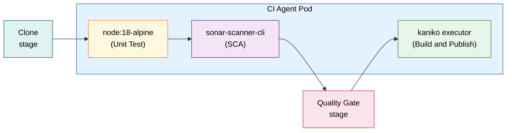
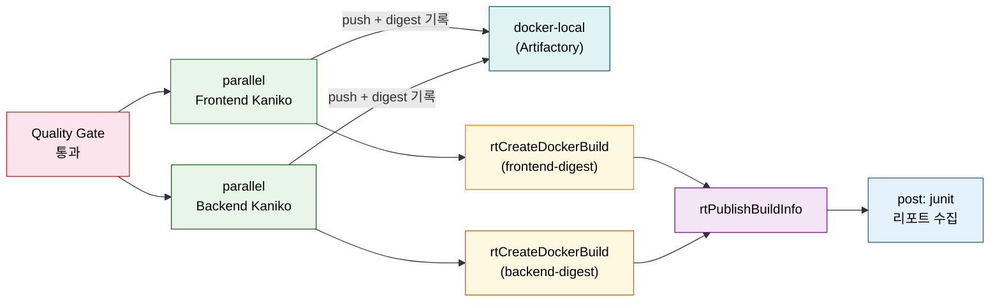

# 첫 CI Jenkinsfile 구현 — 완성 코드·Multibranch·Blue Ocean

---

> 이 문서를 읽고 나면 06-10의 CI 설계를 동작하는 Jenkinsfile로 **구현하고**, 한 Pod 3컨테이너를 stage별 container()로 **전환하며**, 책 예제의 보안 안티패턴을 **진단**하고, Multibranch·Blue Ocean으로 실행·시각화를 **설명**할 수 있습니다.


## 사전 지식

[06-10. CI 파이프라인 전체 설계](05-01.CI%20%ED%8C%8C%EC%9D%B4%ED%94%84%EB%9D%BC%EC%9D%B8%20%EC%A0%84%EC%B2%B4%20%EC%84%A4%EA%B3%84%20%E2%80%94%20%EC%8A%A4%ED%85%8C%EC%9D%B4%EC%A7%80%20%EC%88%9C%EC%84%9C%C2%B7Docker%20%EB%A0%88%EC%A7%80%EC%8A%A4%ED%8A%B8%EB%A6%AC%C2%B7%EC%9D%B8%EC%A6%9D.md)의 7스테이지 순서(Clone→Test→SCA→Quality Gate→Build→Publish→Build Info)와 Kaniko가 레지스트리에 인증하는 docker-registry Secret 구조를 먼저 이해하고 있으면 좋습니다. Declarative Pipeline 문법 기초는 `../01_core/02-03.Pipeline 패턴` 편을 참조하세요.


## 진입 — 설계 그림을 실제로 돌리려면

> 설계 순서도를 그린 것과 그것을 Jenkinsfile 한 파일로 조립하는 것은 다른 단계입니다.

06-10에서 7스테이지 순서를 그렸습니다. 그런데 "어느 컨테이너에서 어느 step을 실행하는가", "parallel 블록에서 Kaniko를 어떻게 두 번 호출하는가", "rtCreateDockerBuild는 무엇을 수집하는가"처럼 실제 코드를 짤 때 생기는 질문들이 남아 있습니다. 이 편은 그 질문에 코드로 답합니다. 개별 step의 기술 상세(withSonarQubeEnv·waitForQualityGate·Kaniko executor 플래그)는 각 전용 편에 위임하고, 여기서는 전체 Jenkinsfile을 한 흐름으로 읽는 데 집중합니다.


## 1. 설계를 코드로 — agent Pod와 stage 골격

> 한 Pod 안에 세 컨테이너를 두고, stage마다 맞는 컨테이너로 전환하는 것이 이 Jenkinsfile의 구조적 핵심입니다.

06-10이 그린 7스테이지를 실제 Jenkinsfile로 옮기면 agent 블록과 stage 선언이 뼈대가 됩니다. K8s 동적 agent는 Pod 하나 안에 여러 컨테이너를 담을 수 있습니다. 이 Jenkinsfile은 node·sonar-scanner-cli·kaniko 세 컨테이너를 한 Pod에 두고, 각 stage에서 `container('이름')` step으로 전환합니다.

**sleep 99d 패턴**의 이유가 있습니다. Kaniko 이미지는 shell이 `/busybox/sh`에만 있어 기본 entrypoint로 실행하면 즉시 종료됩니다. `command: 'cat'`이나 `sleep 99d`로 컨테이너를 살려 두어야 여러 stage에서 같은 컨테이너를 재사용할 수 있습니다. container() step이 그 컨테이너 안에서 명령을 exec 방식으로 실행하기 때문입니다. 멀티컨테이너 Pod의 상세 동작은 [../03_agent/01-01.실행환경으로서의%20Agent.md](../03_agent/01-01.%EC%8B%A4%ED%96%89%ED%99%98%EA%B2%BD%EC%9C%BC%EB%A1%9C%EC%84%9C%EC%9D%98%20Agent.md)에서 다룹니다.

```groovy
pipeline {
    agent {
        kubernetes {
            label 'ci-agent'
            // Pod 안에 세 컨테이너를 선언합니다
            // 컨테이너마다 용도가 다르므로 각기 다른 이미지를 씁니다
            yaml """
apiVersion: v1
kind: Pod
spec:
  containers:
  - name: node
    image: node:18-alpine
    command: [cat]
    tty: true
  - name: sonar-scanner-cli
    image: sonarsource/sonar-scanner-cli:latest
    command: [cat]
    tty: true
  - name: kaniko
    image: gcr.io/kaniko-project/executor:latest
    # sleep: Kaniko 이미지는 기본 실행 즉시 종료되므로
    # 살려 두어 stage에서 exec로 재사용합니다
    command: [/busybox/sh, -c, 'sleep 99d']
    tty: true
    volumeMounts:
    - name: kaniko-secret
      mountPath: /kaniko/.docker
  volumes:
  - name: kaniko-secret
    # Artifactory 크레덴셜을 담은 docker-registry Secret을 마운트합니다
    # Kaniko가 /kaniko/.docker/config.json을 읽어 레지스트리 인증에 씁니다
    # Secret 이름과 namespace는 06-10 §4 참조
    secret:
      secretName: artifactory-credentials
      items:
      - key: .dockerconfigjson
        path: config.json
"""
        }
    }

    environment {
        // 레지스트리 URL은 환경변수로 — 코드에 IP·호스트명을 박지 않습니다
        REGISTRY_URL = credentials('artifactory-registry-url')
        VERSION      = '1.0.0'
    }

    stages {
        stage('Clone') {
            steps {
                checkout scm
            }
        }

        stage('Unit Test') {
            steps {
                // node 컨테이너로 전환해 테스트를 실행합니다
                container('node') {
                    sh 'cd backend && npm install && npm run test'
                }
            }
        }

        stage('SCA') {
            steps {
                container('sonar-scanner-cli') {
                    withSonarQubeEnv('sonarqube-server') {
                        sh '''
                            sonar-scanner \
                              -Dsonar.projectKey=my-ci-project \
                              -Dsonar.sources=backend/src \
                              -Dsonar.tests=backend/test \
                              -Dsonar.host.url=${SONAR_HOST_URL} \
                              -Dsonar.login=${SONAR_AUTH_TOKEN} \
                              -Dsonar.javascript.lcov.reportPaths=backend/coverage/lcov.info
                        '''
                    }
                }
            }
        }

        stage('Quality Gate') {
            steps {
                // SCA 분석 완료를 기다린 뒤 통과 여부를 판정합니다
                // 1시간 안에 결과가 오지 않으면 타임아웃으로 실패 처리합니다
                timeout(time: 1, unit: 'HOURS') {
                    waitForQualityGate abortPipeline: true
                }
            }
        }

        stage('Build & Publish') {
            // frontend·backend 이미지를 병렬로 빌드해 시간을 단축합니다
            parallel {
                stage('Frontend') {
                    steps {
                        container(name: 'kaniko', shell: '/busybox/sh') {
                            sh """
                                /kaniko/executor \
                                  --context=dir://frontend \
                                  --dockerfile=frontend/Dockerfile \
                                  --destination=${REGISTRY_URL}/docker-local/frontend:${VERSION}-${BUILD_NUMBER} \
                                  --image-name-with-digest-file=/tmp/frontend-digest.txt
                            """
                        }
                    }
                }
                stage('Backend') {
                    steps {
                        container(name: 'kaniko', shell: '/busybox/sh') {
                            sh """
                                /kaniko/executor \
                                  --context=dir://backend \
                                  --dockerfile=backend/Dockerfile \
                                  --destination=${REGISTRY_URL}/docker-local/backend:${VERSION}-${BUILD_NUMBER} \
                                  --image-name-with-digest-file=/tmp/backend-digest.txt
                            """
                        }
                    }
                }
            }
        }

        stage('Build Info') {
            steps {
                // Artifactory에 빌드 메타데이터를 기록합니다
                // 이미지명·digest·빌드번호가 연결되어 감사·롤백 추적이 가능해집니다
                rtCreateDockerBuild(
                    serverId: 'artifactory-server'
                    , sourceRepo: 'docker-local'
                    , kanikoImageFile: '/tmp/frontend-digest.txt'
                )
                rtCreateDockerBuild(
                    serverId: 'artifactory-server'
                    , sourceRepo: 'docker-local'
                    , kanikoImageFile: '/tmp/backend-digest.txt'
                )
                rtPublishBuildInfo(
                    serverId: 'artifactory-server'
                )
            }
        }
    }

    post {
        always {
            // 테스트 성공·실패 여부와 무관하게 항상 JUnit 결과를 수집합니다
            junit '**/test-output/**/junit-test-results.xml'
        }
    }
}
```

**비유로 이해하는 멀티컨테이너 Pod.** 공방 하나에 작업대 셋이 있다고 생각하면 쉽습니다. 노드(node) 작업대에서 테스트를 돌리고, 소나(sonar-scanner-cli) 작업대에서 코드를 분석하고, 카니코(kaniko) 작업대에서 이미지를 만듭니다. 같은 공방이라 파일시스템을 공유하지만, 각 작업대가 다른 도구를 가지고 있습니다. 한계도 있습니다. 같은 Pod 안이므로 리소스(CPU·메모리)를 공유합니다. Kaniko 빌드가 CPU를 과점하면 옆 컨테이너 성능이 떨어질 수 있어, 완전 격리가 필요한 경우라면 stage별로 별도 Pod를 쓰는 설계가 낫습니다.




## 2. stage별 구현 — test·SonarQube·Quality Gate

> 각 stage가 어느 컨테이너에서 무엇을 실행하는지, 그 자리에 있는 이유와 함께 읽으면 순서가 외워집니다.

**Unit Test stage**는 `container('node')` 블록 안에서 실행됩니다. `npm install`로 의존성을 받고 `npm run test`로 테스트를 돌립니다. 테스트 커버리지 결과(`lcov.info`)는 SCA stage에서 SonarQube에 전달하므로, Test가 SCA 앞에 있어야 합니다.

```groovy
stage('Unit Test') {
    steps {
        container('node') {
            // npm install: 의존성 설치
            // npm run test: 테스트 실행 + coverage 리포트 생성
            // coverage 결과는 SCA stage의 sonar.javascript.lcov.reportPaths로 전달됩니다
            sh 'cd backend && npm install && npm run test'
        }
    }
}
```

**SCA stage**는 `container('sonar-scanner-cli')` 안에서 `withSonarQubeEnv`로 감쌉니다. `withSonarQubeEnv('서버명')`은 Jenkins에 등록된 SonarQube 서버 설정(URL·토큰)을 환경변수로 주입합니다. project key는 SonarQube 서버에 만들어 둔 프로젝트와 정확히 일치해야 합니다. 대소문자를 구분하므로 주의합니다. `withSonarQubeEnv`·`sonar-scanner` 플래그 상세는 [06-05. SonarQube 연동](02-02.SonarQube%20%EC%97%B0%EB%8F%99%20%E2%80%94%20%EC%A0%95%EC%A0%81%EB%B6%84%EC%84%9D%20%EA%B2%8C%EC%9D%B4%ED%8A%B8.md)에서 다룹니다.

```groovy
stage('SCA') {
    steps {
        container('sonar-scanner-cli') {
            // withSonarQubeEnv: Jenkins 크레덴셜에서 SONAR_HOST_URL·SONAR_AUTH_TOKEN을 주입합니다
            // 토큰을 코드에 직접 쓰지 않아도 됩니다
            withSonarQubeEnv('sonarqube-server') {
                sh '''
                    sonar-scanner \
                      -Dsonar.projectKey=my-ci-project \
                      -Dsonar.sources=backend/src \
                      -Dsonar.tests=backend/test \
                      -Dsonar.host.url=${SONAR_HOST_URL} \
                      -Dsonar.login=${SONAR_AUTH_TOKEN} \
                      -Dsonar.javascript.lcov.reportPaths=backend/coverage/lcov.info
                '''
            }
        }
    }
}
```

**Quality Gate stage**는 SonarQube 서버의 분석 완료 콜백을 기다립니다. `waitForQualityGate abortPipeline: true`가 핵심입니다. 게이트가 미통과이면 `abortPipeline: true` 옵션이 파이프라인을 즉시 중단합니다. `timeout` 블록으로 감싸는 이유는 SonarQube 서버가 응답하지 않을 때 파이프라인이 무한 대기하는 상황을 막기 위해서입니다.

```groovy
stage('Quality Gate') {
    steps {
        timeout(time: 1, unit: 'HOURS') {
            // SonarQube 분석 결과를 기다립니다
            // abortPipeline: true — 게이트 미통과 시 이 자리에서 파이프라인을 멈춥니다
            // Build·Publish가 Quality Gate 뒤에 있으므로
            // 품질 미달 코드는 이미지로 만들어지지 않습니다
            waitForQualityGate abortPipeline: true
        }
    }
}
```

Quality Gate가 Build·Publish 앞에 있는 것이 설계의 핵심입니다. 게이트를 통과하지 못한 코드는 이미지로 빌드되거나 레지스트리에 올라가지 않습니다. 이 순서 논리는 [06-10 §1](05-01.CI%20%ED%8C%8C%EC%9D%B4%ED%94%84%EB%9D%BC%EC%9D%B8%20%EC%A0%84%EC%B2%B4%20%EC%84%A4%EA%B3%84%20%E2%80%94%20%EC%8A%A4%ED%85%8C%EC%9D%B4%EC%A7%80%20%EC%88%9C%EC%84%9C%C2%B7Docker%20%EB%A0%88%EC%A7%80%EC%8A%A4%ED%8A%B8%EB%A6%AC%C2%B7%EC%9D%B8%EC%A6%9D.md)에서 상세히 설명합니다.


## 3. Build·Publish·post — Kaniko parallel과 정리한 코드

> parallel 블록으로 frontend·backend 빌드를 동시에 돌리고, rtCreateDockerBuild로 빌드 이력을 남기는 것이 이 절의 두 축입니다.

**parallel 블록**은 두 Kaniko 빌드를 동시에 실행해 전체 파이프라인 시간을 단축합니다. 각 stage는 `container(name: 'kaniko', shell: '/busybox/sh')`로 시작합니다. `shell` 파라미터를 `/busybox/sh`로 지정하는 이유는 Kaniko 이미지에 기본 bash·sh가 없고 BusyBox shell만 포함되어 있기 때문입니다.

```groovy
stage('Build & Publish') {
    parallel {
        stage('Frontend') {
            steps {
                container(name: 'kaniko', shell: '/busybox/sh') {
                    sh """
                        /kaniko/executor \
                          --context=dir://frontend \
                          --dockerfile=frontend/Dockerfile \
                          --destination=${REGISTRY_URL}/docker-local/frontend:${VERSION}-${BUILD_NUMBER} \
                          --image-name-with-digest-file=/tmp/frontend-digest.txt
                    """
                    // --image-name-with-digest-file: 이미지명+digest를 파일에 기록합니다
                    // 다음 stage의 rtCreateDockerBuild가 이 파일을 읽어 빌드 정보를 Artifactory에 연결합니다
                }
            }
        }
        stage('Backend') {
            steps {
                container(name: 'kaniko', shell: '/busybox/sh') {
                    sh """
                        /kaniko/executor \
                          --context=dir://backend \
                          --dockerfile=backend/Dockerfile \
                          --destination=${REGISTRY_URL}/docker-local/backend:${VERSION}-${BUILD_NUMBER} \
                          --image-name-with-digest-file=/tmp/backend-digest.txt
                    """
                }
            }
        }
    }
}
```

**책 예제의 보안 안티패턴을 정리합니다.** 책 Jenkinsfile에는 두 가지 안티패턴이 있습니다. 첫째, `--destination` 인수에 raw IP 주소를 직접 씁니다. 둘째, `--insecure`·`--skip-tls-verify`·`--skip-tls-verify-registry` 플래그로 TLS 검증을 끕니다. 책은 "단순화를 위해 TLS 검증을 끈 것"이라고 명시하며, 실무에서는 Artifactory를 HTTPS와 유효한 인증서로 구성해 이 플래그를 생략하는 것이 올바른 방식임을 밝힙니다. 이 저장소 dev-standards도 "시크릿·IP·비밀번호 하드코딩 금지 → 환경변수 사용"을 원칙으로 명시합니다. 위 코드에서 `${REGISTRY_URL}`은 Jenkins 크레덴셜에서 주입되는 환경변수로, 코드 어디에도 실제 주소나 인증 정보가 박혀 있지 않습니다. Kaniko 빌드 메커니즘 상세는 [../03_agent/01-03.컨테이너%20이미지%20빌드.md](../03_agent/01-03.%EC%BB%A8%ED%85%8C%EC%9D%B4%EB%84%88%20%EC%9D%B4%EB%AF%B8%EC%A7%80%20%EB%B9%8C%EB%93%9C.md)에서 다룹니다.

**rtCreateDockerBuild와 rtPublishBuildInfo**는 Artifactory JFrog 플러그인 step입니다. `--image-name-with-digest-file`이 기록한 파일을 읽어 이미지명·digest·Jenkins 빌드번호를 Artifactory의 빌드 레코드에 연결합니다. 이 레코드를 남기는 이유는 세 가지입니다. 빌드 이력 추적(어느 커밋이 어느 이미지를 만들었는지), 감사(audit trail), 특정 빌드로 롤백할 때 정확한 이미지를 찾기 위해서입니다. 책 Q&A에서 "True/False: rtPublishBuildInfo는 빌드 정보를 Artifactory에 게시한다"에 대한 정답이 True인 이유가 여기에 있습니다. Artifactory 연동 상세는 [06-06. Artifactory 연동](02-03.Artifactory%20%EC%97%B0%EB%8F%99%20%E2%80%94%20%EC%95%84%ED%8B%B0%ED%8C%A9%ED%8A%B8%20%EC%A0%80%EC%9E%A5%EC%86%8C.md)에서 다룹니다.

```groovy
stage('Build Info') {
    steps {
        // frontend·backend 각각의 digest 파일을 읽어 Artifactory 빌드 레코드에 연결합니다
        rtCreateDockerBuild(
            serverId: 'artifactory-server'
            , sourceRepo: 'docker-local'
            , kanikoImageFile: '/tmp/frontend-digest.txt'
        )
        rtCreateDockerBuild(
            serverId: 'artifactory-server'
            , sourceRepo: 'docker-local'
            , kanikoImageFile: '/tmp/backend-digest.txt'
        )
        // 빌드 메타데이터(빌드번호·아티팩트 목록·환경변수)를 Artifactory에 게시합니다
        rtPublishBuildInfo(
            serverId: 'artifactory-server'
        )
    }
}

post {
    always {
        // 파이프라인 성공·실패와 무관하게 항상 JUnit 결과를 수집합니다
        // Jenkins UI에서 테스트 트렌드 그래프를 보려면 이 수집이 필요합니다
        junit '**/test-output/**/junit-test-results.xml'
    }
}
```




## 4. 실행과 시각화 — Multibranch와 Blue Ocean

> Multibranch가 브랜치마다 파이프라인을 자동으로 만들고, Blue Ocean이 그 실행 상태를 시각화합니다.

**Multibranch Pipeline 설정.** Jenkins 대시보드에서 New Item → Multibranch Pipeline을 선택하고, Branch Sources에 GitHub 저장소 URL을 입력합니다(책 기준, UI 경로는 플러그인 버전에 따라 다를 수 있습니다). 설정을 저장하면 Jenkins가 저장소를 스캔해 Jenkinsfile이 있는 브랜치마다 독립적인 파이프라인을 자동으로 만듭니다. 브랜치가 삭제되면 해당 파이프라인도 자동으로 정리합니다.

트리거는 webhook이 담당합니다. 개발자가 push하면 GitHub가 즉시 Jenkins에 HTTP POST를 보내 해당 브랜치 파이프라인이 시작됩니다. 주기적 저장소 스캔(기본 1분)은 webhook이 실패했을 때의 보조 수단입니다. Multibranch 상세 동작은 [../01_core/02-03.Pipeline%20%ED%8C%A8%ED%84%B4.md](../01_core/02-03.Pipeline%20%ED%8C%A8%ED%84%B4.md)에서 다룹니다.

책 Q&A에서 자주 등장하는 함정이 있습니다. Multibranch Pipeline의 주 기능은 **브랜치별 파이프라인 자동 생성·빌드·테스트**입니다. "병렬 실행 최적화", "코드 자동 머지", "조건 분기 처리"는 Multibranch의 기능이 아닙니다. 병렬 실행은 `parallel` 블록, 조건 분기는 `when` 블록이 각각 담당합니다.

| 기능 | 담당 |
|------|------|
| 브랜치별 파이프라인 자동 생성 | Multibranch Pipeline (O) |
| stage 병렬 실행 | `parallel` 블록 (Multibranch 아님) |
| 코드 자동 머지 | Git 병합 전략 (Multibranch 아님) |
| 브랜치 조건 분기 | `when { branch '...' }` (Multibranch 아님) |

**Blue Ocean 시각화 UI.** Blue Ocean은 Jenkins의 REST API(데이터·자동화 인터페이스)와 구별되는 **사용자 친화 시각화 UI**입니다. REST API는 [04_api/02-02]에서 다루며, 이 편은 UI 기능에 집중합니다.

Blue Ocean을 열면 Activity·Branches·Pull Requests 세 탭이 있습니다. Activity 탭은 모든 브랜치의 최근 실행 목록을 보여 줍니다. Branches 탭은 브랜치별 마지막 빌드 결과를 한눈에 나열합니다. Pull Requests 탭은 PR마다 빌드 상태를 표시해 코드 리뷰와 CI 결과를 한 화면에서 확인하게 합니다.

파이프라인 실행 화면에서는 stage를 좌→우 방향의 DAG(방향 비순환 그래프)로 그려 줍니다. 각 stage는 통과(녹색)·실패(빨간색)·실행 중(파란색)으로 색상 표시됩니다. stage를 클릭하면 해당 로그가 펼쳐집니다. 빌드가 성공적으로 완료된 "green build"에서는 test result(JUnit 결과), SonarQube Quality Gate 통과 여부, Artifactory에 push된 이미지 정보를 탭별로 확인할 수 있습니다. 모바일 브라우저에서도 접근할 수 있어 이동 중 빌드 상태를 확인하는 데 유용합니다.

**비유로 정리하면** Blue Ocean은 자동차 계기판과 같습니다. 속도(빌드 진행 속도), 엔진 상태(stage 성공 여부), 경고등(실패 stage)을 한눈에 보여 줍니다. 계기판이 경고를 표시한다고 해서 자동으로 수리가 되지는 않듯이, Blue Ocean도 문제를 보여 줄 뿐 빌드 실패 원인은 로그를 직접 열어봐야 알 수 있습니다.

책 Q&A에서 Blue Ocean에 대한 함정도 있습니다. Blue Ocean의 핵심 기능은 **사용자 친화적 시각화 UI**입니다. "머신러닝으로 빌드 예측", "보안 스캔 자동화", "빌드 속도 최적화"는 Blue Ocean의 기능이 아닙니다.


## 5. 실무 변형 — checkout ref 분기와 docker DSL 빌드

> 책 예제는 Multibranch + `checkout scm` + Kaniko로 깔끔하지만 현장에서는 ref 타입을 파라미터로 받아 분기하고 K8s가 아닌 곳에서 docker DSL로 빌드하는 변형이 흔합니다.

위 본편은 Multibranch가 `checkout scm`으로 브랜치를 자동 해석하고 K8s Pod에서 Kaniko로 빌드하는, 책 기준의 정석입니다. 실무의 인라인 Pipeline Job([`06-20`](06-04.인라인%20Pipeline%20Script형%20Job%20%E2%80%94%20config.xml%20형상%C2%B7CpsFlowDefinition%C2%B7파라미터화.md))에서는 두 가지가 자주 달라집니다.

첫째, **checkout이 ref 타입에 따라 분기**합니다. Multibranch가 아니면 어느 브랜치·태그·커밋을 받을지 직접 정해야 합니다. 파라미터(`GIT_REF_TYPE`)로 타입을 받아 GitSCM의 branch spec을 다르게 만듭니다.

```groovy
def refType = (params.GIT_REF_TYPE ?: '').trim().toUpperCase()
def refVal  = (params.GIT_REF_VALUE ?: '').trim()
if (!refVal) { error('GIT_REF_VALUE is required') }
def branchSpecs =
      refType == 'TAG'         ? [[name: "refs/tags/${refVal}"]]   // 태그
    : refType == 'COMMIT_HASH' ? [[name: "${refVal}"]]            // 커밋 SHA
    :                            [[name: "*/${refVal}"]]           // 브랜치(기본)
checkout([$class: 'GitSCM', branches: branchSpecs,
          userRemoteConfigs: [[url: env.GIT_URL, credentialsId: env.GIT_CRED]]])
```

태그는 `refs/tags/`, 커밋은 raw SHA, 브랜치는 `*/이름`으로 spec이 갈립니다. 빈 입력은 `error()`로 막아 엉뚱한 ref를 받지 않게 합니다. (저장소 URL·크레덴셜은 반드시 `credentialsId`로 빼야 합니다 — 평문 URL에 자격증명을 넣는 안티패턴은 [`../02_security/01-02.시크릿 관리와 최소 권한 원칙.md`](../02_security/01-02.시크릿%20관리와%20최소%20권한%20원칙.md)에서 다룹니다.)

둘째, **K8s가 아니면 docker DSL로 빌드**합니다. Kaniko는 데몬 없는 K8s 환경의 선택지였고, Docker 데몬이 있는 노드에서는 Pipeline의 `docker` DSL을 씁니다.

```groovy
docker.withRegistry(env.HARBOR_AUTH_REGISTRY_URL, env.HARBOR_CREDENTIAL) {
    docker.image(env.BUILD_BASE_IMG).inside('--network=host') {   // 빌드 도구가 든 이미지 안에서
        sh './build.sh'                                            // 빌드 실행
    }
    sh 'docker build -f Dockerfile -t "$IMAGE" .'                  // 이미지 빌드
    sh 'docker push "$IMAGE"'                                      // push
}
```

`docker.withRegistry(url, credId)`가 인증을 감싸고, `docker.image(img).inside()`는 그 이미지를 빌드 환경으로 띄워 그 안에서 명령을 실행합니다(빌드 도구를 노드에 깔지 않아도 됩니다). 빌드는 같은 목표(이미지를 만들어 레지스트리에 push)를 두고 **Kaniko(K8s 데몬리스) vs docker build(데몬 있는 노드)**라는 두 경로가 환경에 따라 갈립니다. CI 설계에서 둘을 어떻게 고르는지는 [`06-10`](05-01.CI%20파이프라인%20전체%20설계%20%E2%80%94%20스테이지%20순서%C2%B7Docker%20레지스트리%C2%B7인증.md)에서 이어 봅니다.


## 면접 질문

> 답을 떠올린 뒤 §정답 절에서 같은 번호로 대조하세요.

1. Multibranch Pipeline의 주 기능은 무엇이며, 흔한 오해인 "병렬 실행 최적화"와 "코드 자동 머지"는 왜 틀린가요?
2. Blue Ocean의 핵심 기능은 무엇입니까? Blue Ocean이 "시각화 UI"라고 불리는 이유를 REST API와 대비해 설명하세요.
3. SonarQube가 측정하는 measure가 아닌 것은 무엇이며, 왜 측정하지 않나요?

### 빈칸 채우기 — 첫 CI Jenkinsfile 구현

다음 문장의 빈칸을 채워 보세요.

1. 한 Pod 안에서 stage별로 컨테이너를 고르는 step은 ____('name') 입니다.
2. Kaniko가 레지스트리 인증 정보를 읽는 Secret의 키 이름은 ____ 입니다.
3. Quality Gate 미통과 시 파이프라인을 중단하는 옵션은 abortPipeline: ____ 입니다.
4. 브랜치마다 자동으로 파이프라인을 만드는 job 유형은 ____ Pipeline 입니다.


## 정답

> 위 질문을 스스로 설명해 본 뒤에 대조하세요.

### 정답 1 — Multibranch Pipeline 주 기능

Multibranch Pipeline의 주 기능은 저장소를 스캔해 Jenkinsfile이 있는 브랜치마다 독립적인 파이프라인을 자동으로 생성·빌드·테스트하는 것입니다. "병렬 실행 최적화"는 `parallel` 블록이 담당하고, "코드 자동 머지"는 Git 병합 전략이 담당하며, Multibranch는 이 두 기능을 포함하지 않습니다. Multibranch는 "브랜치 추적·파이프라인 자동 생성·정리"에만 책임이 있습니다.

### 정답 2 — Blue Ocean의 핵심 기능

Blue Ocean은 Jenkins 파이프라인 실행 상태를 시각적으로 보여 주는 UI입니다. stage를 좌→우 DAG로 그리고, 각 stage를 색상으로 구분하며, 클릭하면 해당 로그를 보여 줍니다. REST API는 데이터·자동화 인터페이스로 프로그램이 빌드를 시작·조회하는 데 쓰이고, Blue Ocean은 사람이 눈으로 상태를 확인하는 UI 계층입니다. 둘은 목적이 다릅니다.

### 정답 3 — SonarQube가 측정하지 않는 것

SonarQube가 측정하지 않는 대표적인 항목은 **메모리 사용량** 같은 런타임 metric입니다. SonarQube는 정적 분석 도구로, 코드를 실행하지 않고 소스만 분석합니다. 메모리 사용량은 애플리케이션이 실제로 실행되어야 측정할 수 있는 런타임 지표이므로, 정적 분석 범위 밖입니다. SonarQube가 측정하는 것은 코드 품질, 보안 취약점, 테스트 커버리지, 코드 중복, 유지보수성처럼 소스 수준에서 파악 가능한 항목입니다.

### 빈칸 정답 — 첫 CI Jenkinsfile 구현

1. `container` — `container('sonar-scanner-cli')` 처럼 실행할 컨테이너 이름을 인수로 전달합니다.
2. `.dockerconfigjson` — docker-registry Secret의 이 키에 레지스트리 인증 JSON이 들어 있고, Kaniko는 이를 `/kaniko/.docker/config.json`으로 마운트해 읽습니다.
3. `true` — `abortPipeline: true`로 설정해야 Quality Gate 미통과 시 파이프라인이 중단됩니다.
4. `Multibranch` — Multibranch Pipeline이 브랜치마다 자동으로 파이프라인을 생성합니다.


## 관련 문서

> 이 편이 구현한 Jenkinsfile의 각 단계를 깊이 이해하려면 아래 편들을 함께 읽으세요.

- [06-00. 점검 — 핵심 질문과 답 (계획·배포)](01-00.%EC%A0%90%EA%B2%80.%ED%95%B5%EC%8B%AC%20%EC%A7%88%EB%AC%B8%EA%B3%BC%20%EB%8B%B5%20%28%EA%B3%84%ED%9A%8D%C2%B7%EB%B0%B0%ED%8F%AC%29.md) § "핵심 질문" — 이 장 전체를 Q&A로 자가 점검
- [06-05. SonarQube 연동 — 정적분석 게이트](02-02.SonarQube%20%EC%97%B0%EB%8F%99%20%E2%80%94%20%EC%A0%95%EC%A0%81%EB%B6%84%EC%84%9D%20%EA%B2%8C%EC%9D%B4%ED%8A%B8.md) § "withSonarQubeEnv·waitForQualityGate" — SCA·Quality Gate step 상세
- [06-06. Artifactory 연동 — 아티팩트 저장소](02-03.Artifactory%20%EC%97%B0%EB%8F%99%20%E2%80%94%20%EC%95%84%ED%8B%B0%ED%8C%A9%ED%8A%B8%20%EC%A0%80%EC%9E%A5%EC%86%8C.md) § "rtCreateDockerBuild·rtPublishBuildInfo" — 빌드 정보 게시 상세
- [06-10. CI 파이프라인 전체 설계 — 스테이지 순서·Docker 레지스트리·인증](05-01.CI%20%ED%8C%8C%EC%9D%B4%ED%94%84%EB%9D%BC%EC%9D%B8%20%EC%A0%84%EC%B2%B4%20%EC%84%A4%EA%B3%84%20%E2%80%94%20%EC%8A%A4%ED%85%8C%EC%9D%B4%EC%A7%80%20%EC%88%9C%EC%84%9C%C2%B7Docker%20%EB%A0%88%EC%A7%80%EC%8A%A4%ED%8A%B8%EB%A6%AC%C2%B7%EC%9D%B8%EC%A6%9D.md) § "스테이지 순서·Kaniko Secret" — 이 편이 구현한 설계의 원본
- [../03_agent/01-03.컨테이너 이미지 빌드](../03_agent/01-03.%EC%BB%A8%ED%85%8C%EC%9D%B4%EB%84%88%20%EC%9D%B4%EB%AF%B8%EC%A7%80%20%EB%B9%8C%EB%93%9C.md) § "Kaniko" — daemon-free 빌드 메커니즘과 Pod template 상세
- [../01_core/02-03.Pipeline 패턴](../01_core/02-03.Pipeline%20%ED%8C%A8%ED%84%B4.md) § "Multibranch Pipeline" — 브랜치 자동 스캔·Job 생성 상세
