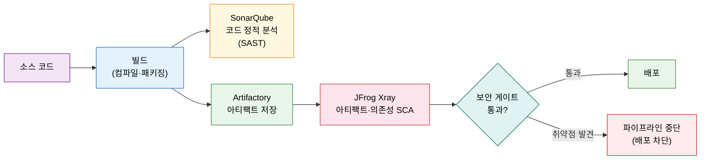
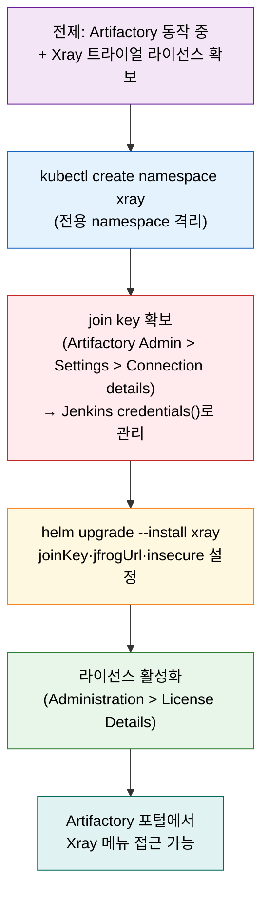

# JFrog Xray로 CI 보안 게이트 — 취약점 스캔·xrayScan·SonarQube와 역할 구분

---

> 이 문서를 읽고 나면 SonarQube와 Xray의 검사 대상 차이를 **구분하고**, Xray를 Helm으로 설치하는 흐름을 **설치하며**, xrayScan 스테이지를 파이프라인에 **연동하고**, Scans List 등록과 취약점 리포트를 **해석할 수 있습니다**.


## 사전 지식

Artifactory를 Helm으로 배포하는 흐름은 [`06-06.Artifactory 연동 — 아티팩트 저장소`](02-03.Artifactory%20연동%20%E2%80%94%20아티팩트%20저장소.md)에서 다룹니다. Xray는 Artifactory 인스턴스에 붙어 동작하므로 Artifactory가 먼저 실행 중이어야 합니다. Jenkins Pipeline의 `stage` 구조와 Helm 기본 명령에 익숙하면 §2의 설치 흐름이 더 빠르게 읽힙니다.


## 진입 — 아티팩트가 저장소에 들어가기 전 무엇이 일어나는가

> 빌드가 성공하고 아티팩트가 Artifactory에 올라가기 직전, 알려진 취약점과 라이선스 위반을 자동으로 차단하는 관문이 필요합니다.

빌드가 통과하고 코드 품질 검사도 넘겼다고 해서 배포할 이미지가 안전하다는 뜻은 아닙니다. 의존성 패키지에 공개된 CVE(Common Vulnerabilities and Exposures)가 섞여 있거나, 오픈소스 라이선스 조건이 제품 배포를 금지할 수 있습니다. 이 문제는 소스 코드를 보는 정적 분석 도구가 잡지 못하는 영역입니다. JFrog Xray는 Artifactory에 붙어서 빌드 아티팩트, Docker 이미지, 의존성 패키지를 대상으로 알려진 취약점과 라이선스를 스캔합니다. 취약점이 발견되면 파이프라인을 중단해 결함 있는 이미지가 배포로 흘러가지 않도록 막습니다.


## 1. Xray가 채우는 자리 — Artifactory에 붙는 아티팩트 SCA

> SCA(소프트웨어 구성 분석)는 "이 소프트웨어를 구성하는 서드파티 패키지와 이미지 레이어에 알려진 결함이 있는가"를 묻는 분석입니다.

> 이미 아는 "SonarQube가 소스 코드를 본다"의 **짝 개념**입니다. Xray는 소스가 아닌 패키지·이미지 레이어를 봅니다.

SonarQube와 Xray는 둘 다 보안 분야에서 자주 언급되지만 검사 대상이 다릅니다. SonarQube는 소스 코드 자체를 정적으로 분석해 코드 안의 보안 취약점 패턴, 버그, 코드 냄새를 측정합니다. Xray는 소스 코드를 보지 않습니다. 빌드가 완료된 아티팩트, Docker 이미지 레이어, 의존성 패키지(Maven, npm, PyPI 등)가 포함하는 서드파티 컴포넌트를 스캔하고 NVD(National Vulnerability Database)나 JFrog 자체 취약점 데이터베이스와 대조합니다.

아래 표는 두 도구의 핵심 차이를 정리합니다.

| 항목 | SonarQube | JFrog Xray |
|------|-----------|-----------|
| 검사 대상 | 소스 코드 | 빌드 아티팩트·Docker 이미지·의존성 패키지 |
| 분석 유형 | 정적 코드 분석 (SAST) | 소프트웨어 구성 분석 (SCA) |
| 탐지 내용 | 코드 패턴 취약점, 버그, 코드 냄새 | 알려진 CVE, 라이선스 컴플라이언스 위반 |
| 파이프라인 위치 | 빌드 후, 아티팩트 저장 전 | 아티팩트 발행(publish) 후, 배포 전 |
| 관련 편 | [06-05](02-02.SonarQube%20연동%20%E2%80%94%20정적분석%20게이트.md) | 이 편 |

두 도구는 서로 다른 층의 위험을 커버하므로 대체 관계가 아닌 보완 관계입니다. 소스 코드에서 직접 작성한 SQL 인젝션 패턴은 SonarQube가 잡고, `log4j-core` 같은 서드파티 라이브러리의 CVE는 Xray가 잡습니다.



Xray는 Artifactory 플랫폼 안에 내장된 분석 엔진으로, Artifactory와 별개의 K8s 서비스로 올리지만 JFrog Platform 대시보드를 공유합니다. Xray 전용 웹 UI는 따로 없으며, Artifactory에 로그인한 뒤 JFrog Platform 메뉴에서 Xray 분석 결과를 봅니다.


## 2. Xray 설치 — Helm·join key·namespace 격리

> Artifactory가 동작하는 클러스터에 Xray를 전용 namespace로 격리해 Helm으로 올리고, join key로 두 서비스를 연결합니다.

예시는 책(Learning Continuous Integration with Jenkins 3e)의 Azure AKS 기준입니다. 동일한 Helm chart가 GCP GKE·AWS EKS에서도 작동하며 클라우드 프로바이더 설정만 다릅니다. Xray 설치에는 동작 중인 Artifactory 인스턴스와 Xray 트라이얼 라이선스가 필요합니다.

**join key**는 JFrog 서비스 간 안전한 통신을 위한 공유 시크릿입니다. Xray가 Artifactory와 연결될 때 이 키로 서로를 인증합니다. 클러스터 안 다른 JFrog 제품(Distribution, Pipelines 등)을 붙일 때도 같은 키를 사용합니다. join key는 시크릿이므로 Helm 명령에 평문으로 박아두지 않고 Jenkins `credentials()`나 Kubernetes Secret으로 관리해야 합니다.

### 사전 조건 확인 및 namespace 생성

```bash
# Azure 클러스터에 로그인하고 기본 리소스 그룹을 설정한다
az login
az configure --defaults group=<resource group>

# Xray를 Artifactory와 분리된 전용 namespace에 올린다
# Artifactory는 artifactory namespace, Xray는 xray namespace — 네트워크 격리 목적
kubectl create namespace xray
```

### join key 확보

join key는 Artifactory 관리 콘솔에서 가져옵니다. UI 경로는 책 기준입니다(JFrog UI는 버전마다 달라질 수 있습니다).

```
Administration > User Management > Settings > Connection details
  → admin 비밀번호 입력 후 unlock
  → Join Key 복사
```

복사한 join key는 Jenkins Credentials에 Secret text 타입으로 저장하고, 파이프라인이나 Helm 배포 스크립트에서 `credentials()` 함수로 참조합니다. 평문으로 스크립트나 소스코드에 기록하지 않습니다.

### Helm으로 Xray 설치

```bash
# JFrog 공식 Helm 레포를 추가한다 (Artifactory 설치 시 이미 추가했으면 생략 가능)
helm repo add jfrog https://charts.jfrog.io
helm repo update

# Xray를 xray namespace에 설치한다
# --set xray.joinKey: Artifactory와 Xray를 연결하는 시크릿 — 반드시 credentials()로 주입, 평문 금지
# --set xray.jfrogUrl: Artifactory 서버 주소 — 실제 주소는 환경 변수나 자리표시로 분리
# --set router.serviceRegistry.insecure=true: 책 예제가 Artifactory를 SSL 없이 HTTP로
#   운영하기 때문에 필요한 설정입니다. 실무에서 Artifactory가 SSL 인증서로 보호되면
#   이 옵션을 생략하고 인증서를 올바르게 구성해야 합니다
helm upgrade --install xray \
  --set xray.joinKey=<Your Join Key> \
  --set xray.jfrogUrl=<Artifactory Server IP> \
  --set router.serviceRegistry.insecure=true \
  --namespace xray \
  jfrog/xray
```

### 라이선스 활성화

Helm 설치가 완료되면 Artifactory 관리 콘솔에서 Xray 트라이얼 라이선스를 활성화합니다.

```
Administration > License Details > Activate Xray Trail License
  → 라이선스 키(<JFrog Xray license key>)를 입력 필드에 붙여넣기
  → 활성화 후 JFrog Platform에 재로그인
```

라이선스 키도 시크릿으로 취급해 관리 콘솔에서만 입력하고 소스코드나 스크립트에 기록하지 않습니다.

활성화 후 Artifactory에 다시 로그인하면 왼쪽 메뉴에 **Xray** 항목이 나타납니다. Xray는 별도 URL이 없으며 JFrog Platform(Artifactory 포털)에서 접근합니다.




## 3. xrayScan 스테이지와 failBuild 게이트

> JFrog Artifactory 플러그인이 제공하는 `xrayScan` 스텝을 파이프라인에 추가해 빌드 결과를 자동 스캔하고, `failBuild` 플래그로 취약점 발견 시 파이프라인을 중단합니다.

JFrog Jenkins 플러그인은 아티팩트를 Artifactory에 발행(Publish build info)하는 스텝과 함께 `xrayScan` 스텝을 제공합니다. `xrayScan`은 Publish가 완료된 빌드를 Xray에 스캔 요청해 결과를 수신하며, `failBuild` 파라미터가 보안 게이트 역할을 합니다.

```groovy
pipeline {
    agent any

    stages {
        stage('Build') {
            steps {
                // Maven 빌드 — 산출물을 생성한다
                sh 'mvn clean package -DskipTests'
            }
        }

        stage('Publish Build Info') {
            steps {
                // Artifactory에 빌드 정보를 발행한다
                // serverId는 Manage Jenkins > System에 등록한 Artifactory 인스턴스 ID
                rtPublishBuildInfo(
                    serverId: 'Default Artifactory Server'
                )
            }
        }

        stage('Scan Build with Xray') {
            steps {
                // xrayScan: 발행된 빌드를 Xray로 스캔한다
                // serverId: Xray가 연결된 Artifactory 서버 ID (Jenkins에 사전 등록)
                // failBuild: true면 취약점 발견 시 파이프라인을 즉시 실패 처리한다 (보안 게이트 스위치)
                //            false면 취약점이 있어도 계속 진행한다 (스캔 결과만 기록)
                // 운영 환경으로 배포하기 전에는 failBuild: true로 설정해 게이트를 활성화하는 것을 권장한다
                xrayScan(
                    serverId: 'Default Artifactory Server'
                    , failBuild: false
                )
            }
        }

        stage('Deploy') {
            steps {
                sh './deploy.sh'
            }
        }
    }
}
```

`failBuild: true`로 설정하면, Xray가 심각도 기준을 초과하는 CVE를 발견했을 때 파이프라인이 실패 상태로 중단되어 배포 스테이지에 도달하지 못합니다. `failBuild: false`는 스캔 결과를 Artifactory 대시보드에 기록하되 파이프라인은 계속 진행합니다. 책 Q&A에서는 Artifactory 플러그인으로 스캔 실패 시 파이프라인 실패 처리를 설정할 수 있는지를 묻고, 정답은 True입니다(챕터 12, Q5 기준).

`serverId`는 `Manage Jenkins > System > JFrog` 섹션에서 등록한 Artifactory 인스턴스 ID와 일치해야 합니다. Xray는 Artifactory와 통합되어 있으므로 별도 서버 ID를 추가하지 않고 Artifactory 서버 ID를 그대로 사용합니다.


## 4. Scans List 등록과 취약점 리포트 읽기

> 처음 xrayScan을 실행하면 "아직 인덱싱 대상이 아니다"는 메시지가 나타납니다. Scans List에 빌드를 등록해야 자동 스캔이 시작됩니다.

### 인덱싱 등록 — Scans List

`xrayScan`을 처음 실행하면 파이프라인 로그에 다음과 같은 메시지가 출력됩니다.

```
Build ... is not selected for indexing
```

이 메시지는 해당 빌드가 아직 Xray 인덱싱 대상으로 등록되지 않았다는 뜻입니다. 등록 경로는 책 기준 UI를 따릅니다.

```
JFrog Platform > Application > Xray > Scans List
  → Add/Remove to Xray > Build 탭 선택
  → 왼쪽(미등록) 목록에서 빌드 이름을 오른쪽(등록)으로 드래그
  → Save by Name
```

저장 후 파이프라인을 재실행하면 Xray가 자동으로 빌드를 인덱싱하고 스캔을 시작합니다.

### 취약점 리포트 읽기

스캔이 완료되면 Artifactory 포털에서 결과를 확인합니다.

```
Artifactory > Builds > 빌드 이름 선택 > 파이프라인 run 선택
  → Xray 상태 컬럼 확인 (예: Scanned - No Issues)
```

빌드 ID를 클릭하면 상세 탭이 나타납니다.

| 탭 | 내용 |
|----|------|
| Modules | 빌드에 포함된 모듈 목록 |
| Artifacts | 생성된 아티팩트 파일 목록 |
| Dependencies | 의존성 패키지 목록 (POM·Gradle 선언 추적 가능) |
| Environment | 빌드 시점 환경변수 (재현성·감사 목적) |
| Issues | 취약점 요약 — 심각도, 영향을 받는 아티팩트, remediation 단계 |

Issues 탭에서 취약점이 발견되면 CVE ID, 심각도(Critical·High·Medium·Low), 영향을 받는 컴포넌트, 수정 버전이 함께 표시됩니다. 의존성 탭에서는 POM이나 Gradle 파일의 선언까지 역추적할 수 있어 어느 모듈이 문제가 되는 라이브러리를 끌어오는지 파악할 수 있습니다. 이 추적성이 Xray를 단순 취약점 알림 도구가 아닌 감사 도구로 쓸 수 있게 하는 이유입니다.

화면 상단에는 promote(다음 저장소로 승격), distribute(배포 저장소로 발행), discard(빌드 폐기) 액션 버튼이 있어 스캔 결과에 따라 즉시 이어지는 작업을 수행할 수 있습니다.


## 면접 질문

> 답을 떠올린 뒤 정답 절에서 같은 번호로 대조하세요.

1. SonarQube와 JFrog Xray는 둘 다 보안 검사 도구로 소개되는데, 검사 대상이 어떻게 다른가요?
2. Xray Helm 설치 시 `--set router.serviceRegistry.insecure=true`는 어떤 상황에서 사용하며, 실무에서는 어떻게 처리해야 하나요?
3. `xrayScan(failBuild: true)`로 설정하면 파이프라인에서 구체적으로 어떤 일이 일어나나요?

### 빈칸 채우기 — JFrog Xray

다음 문장의 빈칸을 채워 보세요.

1. Xray 설치 시 Artifactory와 Xray를 인증하는 공유 시크릿을 `______` 라고 합니다.
2. xrayScan 처음 실행 시 "is not selected for `______`" 메시지가 나타나면, Scans List에 빌드를 등록해야 합니다.
3. Xray는 별도 대시보드가 없으며 `______` 포털에서 분석 결과를 확인합니다.
4. `failBuild: ______`로 설정하면 취약점 발견 시 파이프라인을 즉시 실패 처리합니다.


## 정답

> 위 질문을 스스로 설명해 본 뒤에 대조하세요.

### 정답 1 — SonarQube vs Xray 검사 대상

SonarQube는 개발자가 직접 작성한 소스 코드를 정적으로 분석합니다. 코드 안의 SQL 인젝션 패턴, 하드코딩된 시크릿, 코드 중복 같은 항목이 대상입니다. JFrog Xray는 소스 코드를 보지 않습니다. 빌드가 완료된 이후의 아티팩트, Docker 이미지 레이어, 의존성 패키지가 포함하는 서드파티 컴포넌트를 NVD 등 취약점 데이터베이스와 대조합니다. 둘 다 SCA라는 범주로 묶이지만, SonarQube는 코드 자체 품질과 보안 패턴을 보고 Xray는 패키지와 이미지에 숨어 있는 알려진 CVE와 라이선스 위반을 봅니다(챕터 12, Q4 기준: B — 아티팩트와 의존성이 대상).

### 정답 2 — insecure=true의 의미와 실무 처리

`--set router.serviceRegistry.insecure=true`는 책 예제가 Artifactory를 SSL 없이 HTTP로 운영하기 때문에 필요한 단순화 설정입니다. Xray가 Artifactory와 통신할 때 인증서 검증을 건너뜁니다. 실무에서 Artifactory가 SSL 인증서로 보호되면 이 옵션을 생략하고 Xray가 올바른 인증서를 신뢰하도록 구성해야 합니다. 이 옵션을 운영 환경에 그대로 두면 중간자 공격에 노출될 수 있습니다.

### 정답 3 — failBuild: true 동작

`failBuild: true`가 설정된 상태에서 Xray가 심각도 기준을 초과하는 취약점을 발견하면 `xrayScan` 스텝이 예외를 발생시켜 파이프라인을 실패 상태로 중단합니다. 이후 스테이지(예: Deploy)는 실행되지 않습니다. 취약점이 없거나 기준 미만이면 스텝이 정상 완료되어 파이프라인이 계속 진행됩니다. `failBuild: false`는 취약점이 있어도 파이프라인을 계속 실행하고 결과만 Artifactory에 기록합니다(챕터 12, Q5 기준: True).

### 빈칸 정답 — JFrog Xray

1. `join key` — JFrog 서비스 간 안전 통신을 위한 공유 시크릿으로, 평문 노출 없이 Jenkins credentials() 또는 K8s Secret으로 관리합니다.
2. `indexing` — "is not selected for indexing" 메시지는 해당 빌드가 Xray 인덱싱 목록에 없다는 뜻입니다. Scans List에 드래그로 추가하면 해결됩니다.
3. `Artifactory` — Xray는 별도 포털 없이 JFrog Platform(Artifactory) 포털 안에 통합되어 있습니다.
4. `true` — `failBuild: true`가 보안 게이트 스위치입니다.


## 관련 문서

> Xray는 Artifactory 위에 올라가는 보안 레이어이므로, 저장소 연동 편과 소스 코드 SCA 짝을 함께 보면 두 도구의 위치가 더 명확해집니다.

- [06-06. Artifactory 연동 — 아티팩트 저장소](02-03.Artifactory%20연동%20%E2%80%94%20아티팩트%20저장소.md) — Xray가 붙는 아티팩트 저장소
- [06-05. SonarQube 연동 — 정적분석 게이트](02-02.SonarQube%20연동%20%E2%80%94%20정적분석%20게이트.md) — 소스 코드 SCA 짝(대상 구분)
- [06-10. CI 파이프라인 전체 설계 — 스테이지 순서·Docker 레지스트리·인증](05-01.CI%20파이프라인%20전체%20설계%20%E2%80%94%20스테이지%20순서%C2%B7Docker%20레지스트리%C2%B7인증.md) — SCA→Gate 스테이지 순서
- [06-00. 점검 — 핵심 질문과 답 (계획·배포)](01-00.%EC%A0%90%EA%B2%80.%ED%95%B5%EC%8B%AC%20%EC%A7%88%EB%AC%B8%EA%B3%BC%20%EB%8B%B5%20%28%EA%B3%84%ED%9A%8D%C2%B7%EB%B0%B0%ED%8F%AC%29.md) — 계획·배포 면접 점검
