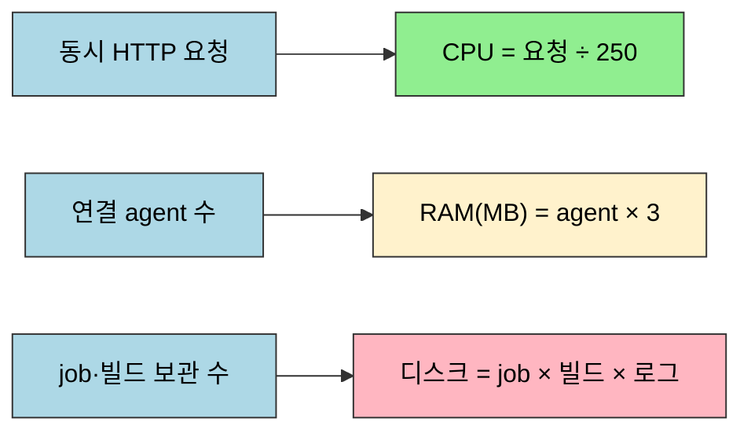
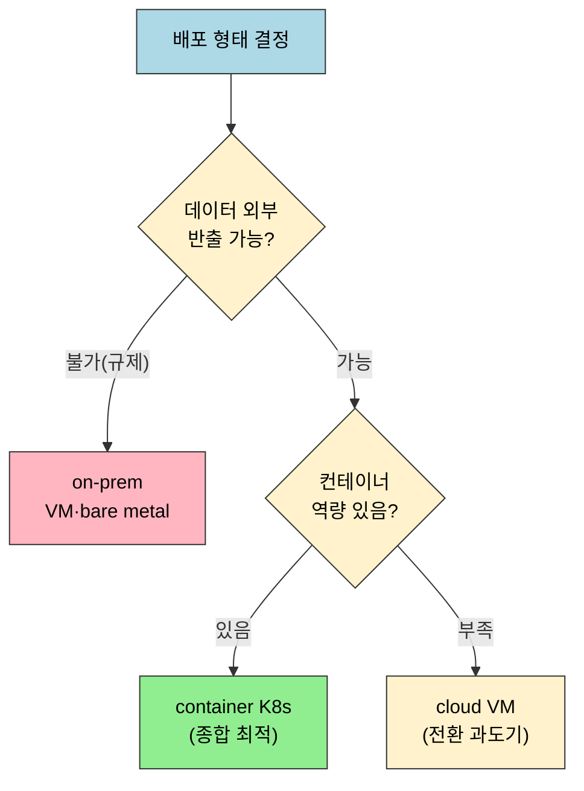

# 점검 — 계획·배포 핵심 질문

---

> 이 점검 문서는 06장(계획·배포)을 다 읽은 뒤 스스로를 시험하기 위한 자가 점검입니다. 먼저 §면접 질문만 보고 답을 떠올린 뒤, §정답 절에서 같은 번호로 대조하세요.
> 다루는 문서: 06-01.용량 산정과 시스템 요구사항, 06-02.배포 시나리오와 Well-Architected 평가, 06-03.IaC로 Jenkins 배포, 06-04.GitHub 연동, 06-05.SonarQube 연동, 06-06.Artifactory 연동, 06-07.외부 도구 통합 4단계 비교, 06-08.클라우드 VM 동적 Agent

> 이 점검을 마치면 controller의 자원 소비 지점을 설명하고, 책 추정식의 한계를 짚으며, 5가지 배포 형태를 6 pillars로 평가하고, JCasC 3종 파일의 순서 의존성을 구분하며, Terraform 실행 흐름을 예측하고, GitHub·SonarQube·Artifactory 통합의 공통 4단계와 도구별 차이를 설명하며, VM 동적 Agent와 K8s on-demand의 갈림길을 선택할 수 있는지 스스로 검증합니다.

## 진입 — 왜 계획·배포 점검이 필요한가

> 용량·배포 형태·IaC는 한 번 굳으면 바꾸기 어려우므로, 개념을 따로 외우면 실제 설계 결정에서 판단이 어긋납니다.

계획·배포 개념(용량 추정식·6 pillars·JCasC·Terraform)은 하나씩 보면 그럴듯하지만, 실제 인프라를 설계할 때는 이 개념들이 *맞물려* 결정을 만듭니다. controller 사양을 어떻게 잡을지, K8s로 갈지 VM으로 갈지, 설정을 어디까지 코드화할지가 한 흐름으로 이어집니다. 점검 문서는 흩어진 개념을 한 설계 시나리오 위에 다시 세워, 빈틈을 드러내는 것이 목적입니다.

## 사전 지식

> `06-01`(용량·포트·JVM), `06-02`(배포 형태·6 pillars), `06-03`(IaC·JCasC·Terraform)을 먼저 읽었다고 가정합니다. 막히는 질문이 있으면 해당 문서의 같은 주제 절로 돌아가 확인합니다.

용량 추정과 배포 형태 평가는 이 점검의 두 축입니다. 먼저 그림으로 큰 그림을 잡습니다.

## 면접 질문

> 답을 떠올린 뒤 §정답 절에서 같은 번호로 대조하세요. 각 질문 뒤의 *심화*까지 답할 수 있으면 충분합니다.

1. controller는 빌드를 직접 수행하지 않는데도 개발팀이 커질수록 controller CPU가 중요해집니다. 왜 그렇습니까? *(심화: agent를 늘려도 전체 처리량이 막히는 지점은 어디입니까?)*
2. 책의 용량 추정식(CPU=요청÷250, RAM=agent×3)을 그대로 신뢰하면 안 되는 이유는 무엇입니까? *(심화: 메모리 식이 누락한 변수는?)*
3. controller가 사용하는 네 포트(8080·443·50000·22)는 각각 무엇이며, 50000이 막히면 어떤 증상이 납니까? *(심화: 내부망 운영 시 어떤 포트를 외부에 열어 둡니까?)*
4. 책 평가에서 container on K8s가 종합 최적인 근거와 그 한계는 무엇입니까? *(심화: K8s 점수가 실제로 안 나오는 팀은?)*
5. 보안·성능이 최고인 bare metal을 선택하는 조직이 포기하는 것은 무엇입니까? *(심화: 비용 점수가 3점인 근본 이유는?)*
6. JCasC 배포 3종 파일(jenkins.yaml·plugins.txt·override.conf)의 역할과 처리 순서는 무엇입니까? *(심화: 순서를 어기면 어떤 증상이 납니까?)*
7. `terraform init`·`plan`·`apply`는 각각 무엇을 하며, plan을 파일로 저장하는 이유는 무엇입니까? *(심화: K8s Helm 배포와 VM Terraform 배포를 가르는 기준은?)*
8. GitHub 연동에서 PAT 스코프 `admin:repo_hook`과 `repo`는 각각 무엇을 허용하며, 같은 PAT를 왜 secret text와 username&password 두 크레덴셜로 등록합니까? *(심화: 클론에 secret text를 쓰면 왜 안 됩니까?)*
9. SonarQube 연동에서 `waitForQualityGate abortPipeline: true`는 무엇을 하며, 분석이 비동기라는 점이 왜 중요합니까? *(심화: webhook을 설정하지 않으면 어떤 증상이 납니까?)*
10. Artifactory 연동에서 user를 그룹·롤 없이 만들고 Read·Annotate·Deploy 권한만 주는 이유는 무엇입니까? *(심화: Helm 배포 시 `artifactory.nginx.enabled=false`로 끄는 이유는?)*
11. GitHub·SonarQube·Artifactory 통합의 공통 4단계는 무엇이며, 왜 "전역 설정"이 항상 마지막입니까? *(심화: 도구별로 크레덴셜 타입이 갈리는 기준은?)*
12. VM 동적 Agent(Azure VM Agents)와 K8s on-demand는 어떤 워크로드에서 각각 유리하며, VM은 왜 retention 설계가 더 중요합니까? *(심화: Once Retention에서 single executor를 권장하는 이유는?)*

## 정답

> 위 질문을 스스로 설명해 본 뒤에 펼치세요.

### 정답 1 — controller CPU가 중요한 이유

controller는 빌드 연산을 수행하지 않지만, 개발팀이 커질수록 동시 HTTP 요청(UI 접근·webhook)과 스케줄링 연산이 늘어납니다. 각 개발자가 UI를 열거나 커밋 webhook이 동시에 들어오면 controller 스레드가 이를 처리합니다. *심화*: agent를 아무리 붙여도 controller 스레드가 포화되면 빌드 큐를 소화하지 못하고 전체 처리량이 막힙니다. 빌드 실행 능력(agent)과 빌드 조정 능력(controller CPU) 두 축을 분리해 관리해야 합니다.

### 정답 2 — 추정식을 그대로 믿으면 안 되는 이유

추정식은 *Learning Continuous Integration with Jenkins 3e*가 제시하는 휴리스틱일 뿐 Jenkins 공식 보장이 아닙니다. 사용 패턴에 따라 결과가 크게 달라지므로, 용량 설계의 출발점으로만 삼고 운영 중 모니터링 데이터로 보정하는 것이 정석입니다. *심화*: 메모리 식(agent 수 × 3)은 agent 수만 변수로 삼아, 동시 실행 파이프라인 수·FlowNode 직렬화 빈도·플러그인 개수·빌드 히스토리 크기 같은 실제 heap 소비 요인을 반영하지 못합니다.

### 정답 3 — 네 포트와 50000

| 포트 | 용도 |
|------|------|
| 8080 | 웹 UI·API (HTTP) |
| 443 | TLS 암호화 웹 접근 (HTTPS) |
| 50000 | inbound agent의 JNLP 연결 채널 (TCP) |
| 22 | 서버 관리 (SSH) |

포트 50000은 inbound agent가 controller에 연결하는 전용 채널입니다. 이 포트가 방화벽에서 막히면 agent가 controller에 등록되지 못해, 빌드 큐에 job이 쌓이기만 하고 실행되지 않습니다. agent 상태가 "오프라인"으로 표시됩니다. *심화*: 내부망 운영 시 8080·50000·22는 내부 CIDR로 제한하고 443만 외부에 열어 두는 방식이 일반적입니다.

### 정답 4 — container K8s의 우위와 한계

책 점수 기준으로 세 근거가 있습니다. agent Pod를 수요에 따라 동적 스케일해 성능 효율(9점)이 높고, Pod 재스케줄링·롤링 업데이트로 신뢰성(9점)이 높으며, 유휴 agent를 0으로 줄여 비용 최적화(8점)가 좋습니다. *심화*: 한계는 K8s 운영 역량이 없는 팀에서는 이 점수가 실제로 나오지 않는다는 점입니다. 무리하게 도입하면 운영 우수성 점수가 오히려 떨어집니다. 또한 이 점수는 책의 휴리스틱 추정이며 Jenkins나 Azure 공식 벤치마크가 아닙니다.

### 정답 5 — bare metal이 포기하는 것

bare metal on-prem은 보안(9점)·성능 효율(9점)에서 최고이지만 비용 최적화(3점)가 가장 낮습니다. 하드웨어 구매·감가상각·냉각·네트워크 비용을 전액 자체 부담하고, 트래픽이 적을 때도 동일한 하드웨어를 유지해야 하므로 탄력적 비용 조정이 불가능합니다. *심화*: 비용 점수가 3점인 근본 이유는 클라우드처럼 사용량에 따라 자원을 늘리고 줄일 수 없어, 유휴 상태에서도 고정비가 그대로 발생하기 때문입니다. 패치·하드웨어 교체·장애 대응도 모두 자체 인력 몫입니다.

### 정답 6 — JCasC 3종의 순서 의존성

`plugins.txt`는 설치할 플러그인 목록, `override.conf`는 systemd 환경변수(특히 `CASC_JENKINS_CONFIG`), `jenkins.yaml`은 Jenkins 시스템 설정 전체를 YAML로 선언합니다. 처리 순서는 plugins.txt → override.conf → jenkins.yaml입니다. *심화*: `jenkins.yaml`을 읽는 JCasC 플러그인(`configuration-as-code`)이 plugins.txt 단계에서 설치되므로, 순서를 어기면 JCasC 플러그인이 없는 상태로 기동되어 jenkins.yaml이 조용히 무시됩니다.

### 정답 7 — terraform 세 명령과 배포 선택

`terraform init`은 provider를 다운로드하고 작업 디렉토리를 초기화합니다. `terraform plan`은 현재 상태와 코드를 비교해 생성·변경·삭제될 리소스를 미리 보여주며 실제 변경은 없습니다. `terraform apply`는 plan에서 확인한 변경을 실제 적용합니다. `-out=tfplan`으로 plan을 저장하는 이유는 plan과 apply 사이 상태 변화로 의도치 않은 변경이 적용되는 것을 막기 위해서입니다. *심화*: K8s Helm과 VM Terraform을 가르는 핵심 기준은 팀의 컨테이너 숙련도와 기존 Jenkins 이전 난이도입니다. 컨테이너에 익숙하고 agent 자동 확장이 필요하면 Helm, 기존 VM 구성을 그대로 옮기거나 persistent storage 접근이 단순해야 하면 Terraform VM이 유리합니다.

### 정답 8 — GitHub PAT 스코프와 크레덴셜 2종

`admin:repo_hook`은 저장소 webhook을 생성·수정·삭제하는 권한으로, Jenkins가 Manage hooks로 webhook을 자동 관리하려면 필수입니다. `repo`는 저장소 전체 read/write 권한으로 클론·fetch·브랜치·PR 관리에 필요합니다. 같은 PAT를 두 크레덴셜로 등록하는 이유는 쓰임이 다르기 때문입니다. GitHub 플러그인이 API로 webhook을 관리할 때는 단일 토큰만 전달하면 되므로 secret text를, 파이프라인의 `checkout scm`이 Git HTTPS로 클론할 때는 아이디·비밀번호 쌍을 기대하므로 username&password를 씁니다. *심화*: Git HTTPS 인증은 Basic Auth 형식(아이디+비밀번호)을 요구하므로, 단일 문자열인 secret text로는 클론 인증 형식을 충족할 수 없습니다.

### 정답 9 — waitForQualityGate와 비동기 분석

`waitForQualityGate abortPipeline: true`는 SonarQube 분석 완료 신호를 기다렸다가 Quality Gate 결과를 확인하고, 미통과이면 파이프라인을 중단해 배포 stage 도달을 막습니다. SonarQube 분석은 비동기로 처리되어 결과가 즉시 나오지 않으므로, SonarQube 서버가 분석을 마친 뒤 Jenkins로 webhook을 보내야 이 스텝이 결과를 받습니다. *심화*: webhook을 설정하지 않으면 `waitForQualityGate`가 결과 신호를 영영 받지 못해 타임아웃될 수 있습니다.

### 정답 10 — Artifactory 최소 권한 user

Artifactory user를 그룹·롤 없이 만들고 Read·Annotate·Deploy 권한만 부여하는 것은 최소 권한 원칙입니다. Jenkins는 아티팩트를 조회(Read)하고 메타데이터를 달고(Annotate) 산출물을 입고(Deploy)하면 충분하므로, 그 이상의 권한(삭제·관리)을 주지 않아 유출 시 피해 범위를 좁힙니다. *심화*: Helm 배포에서 `artifactory.nginx.enabled=false`로 내장 nginx를 끄는 이유는, 우리가 별도로 배포한 Nginx Ingress Controller로 외부 노출을 일원화하기 위해서입니다. 내장 nginx와 별도 Ingress가 겹치면 라우팅이 충돌합니다.

### 정답 11 — 통합 공통 4단계와 전역 설정이 마지막인 이유

공통 4단계는 ① 플러그인 설치(Jenkins) → ② 토큰·유저 생성(도구 측) → ③ 크레덴셜 저장(Jenkins) → ④ 전역 설정(Manage Jenkins > System)입니다. 전역 설정이 항상 마지막인 이유는, 전역 설정에서 앞 세 단계의 산출물(플러그인·토큰·크레덴셜)을 한데 엮기 때문입니다. 참조할 크레덴셜이 없는 상태로 전역 설정을 먼저 하면 연결을 완성할 수 없습니다. *심화*: 크레덴셜 타입은 상대 도구가 무엇을 기대하는가로 갈립니다. 단일 토큰을 받는 API/플러그인 인증은 secret text, 아이디·비밀번호 쌍을 받는 클론·로그인은 username&password를 씁니다.

### 정답 12 — VM 동적 Agent vs K8s on-demand

VM 동적 Agent는 컨테이너화가 어려운 Windows·레거시 앱이나 완전한 OS 격리(하이퍼바이저 경계)가 필요한 워크로드에서 유리합니다. K8s on-demand는 경량·빠른 기동(초 단위)·cloud-native 워크로드에서 유리합니다. VM은 부팅·agent 설치 때문에 기동이 수십 초~수 분 걸리므로, 빌드가 끝난 VM을 언제 버릴지를 정하는 retention 설계가 비용과 대기 시간 모두에 직접 영향을 줍니다. K8s Pod는 초 단위로 뜨므로 retention 부담이 상대적으로 작습니다. *심화*: Once Retention은 job 완료 시 agent를 offline으로 전환하는데, executor가 여럿이면 첫 job이 끝날 때 VM 전체가 offline이 되어 나머지 job이 중단됩니다. single executor로 제한하면 VM당 job이 하나만 돌아 이 문제가 사라집니다.

### 빈칸 정답 — 계획·배포

1. `250` — CPU 코어 수 = 동시 HTTP 요청 수 ÷ 250 (책 휴리스틱)
2. `Azure` — 책은 Azure Well-Architected Framework로 배포 형태를 평가합니다
3. `CASC_JENKINS_CONFIG` — JCasC 플러그인이 이 환경변수에서 jenkins.yaml 경로를 읽습니다
4. `plan` — `terraform plan`은 변경을 미리 보여주며 실제 적용하지 않습니다

## 관련 문서

> 이 점검에서 막힌 질문이 있다면, 같은 06장의 본문 문서로 돌아가 해당 개념을 다시 확인합니다.

- [06-01. Jenkins 서버 용량 산정과 시스템 요구사항](06-01.Jenkins%20서버%20용량%20산정과%20시스템%20요구사항.md) § "추정 휴리스틱·포트·JVM" — 면접 질문 1~3의 개념 출처
- [06-02. 배포 시나리오와 Well-Architected 평가](06-02.배포%20시나리오와%20Well-Architected%20평가.md) § "6 pillars 평가" — 면접 질문 4~5의 개념 출처
- [06-03. IaC로 Jenkins 배포](06-03.IaC로%20Jenkins%20배포%20%E2%80%94%20Terraform%C2%B7JCasC%C2%B7Helm.md) § "JCasC 3종·Terraform 흐름" — 면접 질문 6~7의 개념 출처
- [06-04. GitHub 연동 — 플러그인·PAT·웹훅](06-04.GitHub%20연동%20%E2%80%94%20플러그인%C2%B7PAT%C2%B7웹훅.md) § "PAT 스코프·크레덴셜 2종" — 면접 질문 8의 개념 출처
- [06-05. SonarQube 연동 — 정적분석 게이트](06-05.SonarQube%20연동%20%E2%80%94%20정적분석%20게이트.md) § "Quality Gate" — 면접 질문 9의 개념 출처
- [06-06. Artifactory 연동 — 아티팩트 저장소](06-06.Artifactory%20연동%20%E2%80%94%20아티팩트%20저장소.md) § "user·permission" — 면접 질문 10의 개념 출처
- [06-07. 외부 도구 통합 4단계 비교](06-07.외부%20도구%20통합%204단계%20비교.md) § "공통 4단계" — 면접 질문 11의 개념 출처
- [06-08. 클라우드 VM 동적 Agent — Azure VM Agents 플러그인](06-08.클라우드%20VM%20동적%20Agent%20%E2%80%94%20Azure%20VM%20Agents%20플러그인.md) § "Retention 3전략" — 면접 질문 12의 개념 출처
- [../05_operations/01-00.점검.핵심 질문과 답 (내구성)](../05_operations/01-00.%EC%A0%90%EA%B2%80.%ED%95%B5%EC%8B%AC%20%EC%A7%88%EB%AC%B8%EA%B3%BC%20%EB%8B%B5%20%28%EB%82%B4%EA%B5%AC%EC%84%B1%29.md) § "면접 질문" — 같은 형식의 운영 점검 문서
