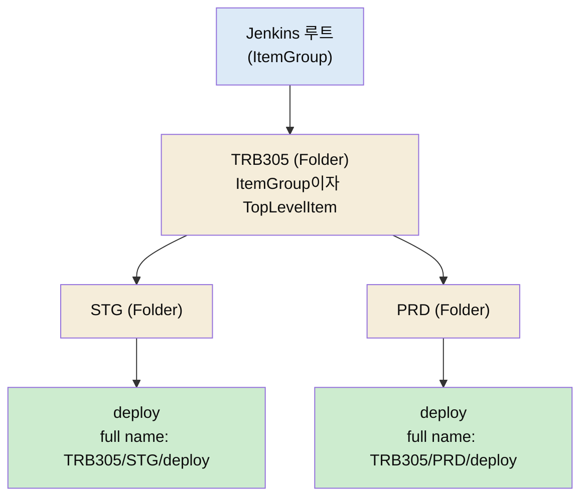

# Folder 플러그인 — namespace 격리·full name 식별·폴더 스코핑

---

> 이 문서를 읽고 나면 평면 Job 목록이 왜 이름 충돌을 일으키는지 **설명하고**, Folder가 full name으로 그 충돌을 푸는 원리를 **이해하며**, 폴더가 따라오는 credential·권한·라이브러리 스코핑이 각각 어느 플러그인의 책임인지 **구분**하고, Multibranch Pipeline이 이 플러그인 위에 올라간다는 사실을 상속 체인으로 **확인**할 수 있습니다.


## 사전 지식

Jenkins의 Job(Item)과 빌드 개념, Manage Jenkins 화면 구조를 알고 있으면 좋습니다. 크레덴셜의 기본 동작은 [`../02_security/README.md`](../02_security/README.md)에서, API 경로가 폴더 때문에 깊어지는 현상은 [`../04_api/02-01.API 개요와 활용 판단.md`](../04_api/02-01.API%20개요와%20활용%20판단.md)에서 먼저 보면 이 편이 더 잘 붙습니다.


## 진입 — 왜 폴더가 따로 플러그인인가

> 폴더는 Jenkins 코어 기능이 아니라 플러그인이 더하는 기능입니다. 그 이유를 알면 폴더가 단순 "보기 좋게 묶기"가 아니라는 게 보입니다.

Jenkins를 처음 깔면 모든 Job이 첫 화면에 한 줄씩 평평하게 나열됩니다. Job이 다섯 개일 때는 문제가 없습니다. 그런데 팀이 늘고 환경(stage·production)이 갈리면서 Job이 수십 개가 되면, 이 평면 목록은 빠르게 무너집니다. A팀 Job과 B팀 Job이 한 화면에 뒤섞이고, 더 곤란한 건 **이름을 마음대로 못 짓는다**는 점입니다.

기본 Jenkins에서 Job 이름은 전역에서 유일해야 합니다. A팀도 `deploy`라는 Job을 만들고 싶고 B팀도 `deploy`를 만들고 싶은데, 평면 구조에서는 둘 중 하나가 양보해 `a-deploy`, `b-deploy`처럼 접두사를 붙여야 합니다. 이 접두사 노가다가 폴더 플러그인이 푸는 진짜 문제입니다. 폴더는 화면 정리 도구가 아니라 **이름공간(namespace)을 나누는 도구**입니다.

이 플러그인의 정식 이름은 Folders이고, 플러그인 ID는 `cloudbees-folder`입니다. CloudBees가 만들어 오픈소스로 공개했고, 지금은 전체 Jenkins 컨트롤러의 96% 이상에 설치되어 있는 사실상 표준 플러그인입니다.


## 1. 평면 namespace의 문제

> 평면 구조에서 Job 이름이 전역 유일해야 하는 제약이 모든 불편의 뿌리입니다.

평면 구조를 옷장에 비유하면, 칸막이 없는 큰 서랍 하나에 모든 옷을 던져 넣은 상태입니다. 옷이 적을 때는 빠르게 꺼내지만 늘어나면 같은 종류끼리 섞여 찾기 어렵습니다. 게다가 Jenkins는 "같은 이름의 옷을 두 벌 넣을 수 없다"는 규칙까지 강제합니다.

```
(평면 구조)
deploy            ← A팀이 먼저 차지
deploy            ← B팀은 못 만듦 (이름 충돌)
a-deploy          ← 어쩔 수 없이 접두사
b-deploy
a-build
b-build
stg-web-deploy    ← 환경까지 이름에 욱여넣음
prd-web-deploy
```

이름에 팀·환경·역할을 전부 욱여넣다 보면 `prd-web-deploy-v2-final` 같은 이름이 생깁니다. 이름이 곧 분류 체계 역할을 떠맡는 셈인데, 문자열 하나가 그 일을 감당하기에는 너무 약합니다.


## 2. Folder가 푸는 법 — full name 식별

> Folder는 각 폴더를 독립된 이름공간으로 만들어, 짧은 이름이 같아도 전체 경로(full name)가 다르면 충돌하지 않게 합니다.

Folder 플러그인의 핵심은 Job의 진짜 식별자를 짧은 이름이 아니라 **full name**으로 바꾸는 데 있습니다. full name은 폴더 경로를 포함한 전체 이름입니다.

```
(폴더 구조)
TRB305/
  ├─ STG/
  │    ├─ deploy        → full name: TRB305/STG/deploy
  │    └─ build         → full name: TRB305/STG/build
  └─ PRD/
       ├─ deploy        → full name: TRB305/PRD/deploy   ← 짧은 이름 같아도 OK
       └─ build         → full name: TRB305/PRD/build
```

`TRB305/STG/deploy`와 `TRB305/PRD/deploy`는 짧은 이름이 `deploy`로 같지만 full name이 다르므로 충돌하지 않습니다. 접두사 노가다가 사라지고, 환경마다 **같은 이름 그대로** Job을 둘 수 있습니다.

이게 가능한 이유는 폴더가 단순 디렉토리가 아니라 Jenkins의 컨테이너 타입이기 때문입니다. 플러그인의 `AbstractFolder` 클래스를 보면 선언이 이렇습니다.

```java
public abstract class AbstractFolder<I extends TopLevelItem>
        extends AbstractItem
        implements TopLevelItem, ItemGroup<I>, ModifiableViewGroup, ... {
```

두 인터페이스가 핵심입니다. 폴더는 `TopLevelItem`(스스로도 하나의 항목)이면서 동시에 `ItemGroup`(자식 항목을 담는 컨테이너)입니다. 자식을 담을 수 있는 항목이 또 항목이라는 구조라서, 폴더 안에 폴더를 넣는 재귀 중첩이 자연스럽게 됩니다. 컨테이너인 동시에 내용물이라는 이중 정체성이 full name 계층을 만들어 냅니다.

자식 조회는 `getItem(String name)`이 맡고, 전체 경로 이름은 `AbstractItem`이 제공하는 `getFullName()`으로 얻습니다. "폴더 안에서 이름으로 자식을 찾고, 그 자식의 정체는 폴더 경로까지 포함한 full name"이라는 두 동작이 충돌 해소의 메커니즘입니다.




## 3. 파생 효과 — 폴더 경계로 스코핑되는 것들

> full name 계층이 생기면 credential·권한·라이브러리도 폴더 경계로 나눌 수 있습니다. 다만 어느 것이 Folder 플러그인 자체 기능이고 어느 것이 다른 플러그인의 결합인지 구분해야 합니다.

폴더가 단순 서랍과 결정적으로 다른 점은 **하위 Job에 속성을 물려준다**는 것입니다. 옷장 서랍은 옷에 아무 성질도 주지 않지만 Jenkins 폴더는 하위 Job의 보안·설정 컨텍스트를 결정합니다. 세 가지가 대표적인데, 책임 주체가 서로 다릅니다.

### 3.1 폴더 스코프 크레덴셜 (Folder 플러그인 자체)

폴더 레벨에 등록한 크레덴셜은 그 폴더와 하위 Job만 접근할 수 있습니다. A팀 폴더에 둔 GitLab 토큰을 B팀 Job이 못 보게 격리됩니다. 이건 Folder 플러그인이 직접 제공하는 folder-scoped credential store 기능입니다. 다만 크레덴셜 자체의 저장·조회는 Credentials 플러그인이 맡으므로, 정확히는 "Folder가 Credentials 플러그인의 저장소를 폴더 단위로 연다"는 결합입니다.

### 3.2 폴더 레벨 권한 — RBAC (별도 플러그인)

"이 팀은 자기 폴더만 보고 빌드한다"는 권한 분리는 폴더 구조 위에서 자연스럽지만 실제 권한 판정은 Role-based Authorization Strategy 같은 **별도 플러그인**이 합니다. Folder는 권한이 걸릴 경계(full name 경로)를 제공할 뿐, 권한 규칙 엔진을 갖고 있지는 않습니다. 이 둘을 뭉뚱그리면 "폴더만 깔면 RBAC가 된다"는 오해가 생깁니다.

### 3.3 폴더 레벨 Shared Library (별도 플러그인)

폴더 `config.xml`에 폴더 전용 Shared Library를 설정해, 전역 표준 라이브러리 위에 팀별 확장을 얹는 2계층 구조를 만들 수 있습니다. 이 폴더 프로퍼티는 Pipeline(Groovy) 플러그인이 정의하며 Folder는 그 프로퍼티가 붙을 자리를 제공합니다. 자세한 구조는 [`../05_operations/02-01.공유 라이브러리.md`](../05_operations/02-01.공유%20라이브러리.md) §2-4에서 다룹니다.


## 4. 현대 Jenkins의 기반 레이어

> Multibranch Pipeline과 Organization Folder는 별개 기능이 아니라 Folder 플러그인을 상속해 만든 "내용이 자동 계산되는 폴더"입니다.

Folder를 "Job 묶기 편의 기능" 정도로 보면 그 위상을 놓칩니다. Multibranch Pipeline의 클래스 상속 체인을 따라가 보면 이렇습니다.

```
AbstractItem
  └─ AbstractFolder            (cloudbees-folder)
       └─ ComputedFolder       (cloudbees-folder, 자식을 자동 계산)
            └─ MultiBranchProject
                 └─ WorkflowMultiBranchProject
```

`ComputedFolder`는 "자식을 사람이 직접 추가·삭제하지 못하고 시스템이 계산하는 폴더"입니다. Multibranch Pipeline은 바로 이 ComputedFolder를 상속해, 브랜치 하나당 하위 Job 하나를 자동으로 만들어 채웁니다. 우리가 Multibranch에서 보는 "브랜치별 파이프라인"은 사실 **폴더 안에 브랜치마다 생긴 자식 Job**입니다. Organization Folder도 같은 계보입니다.

그래서 [`06-11.첫 CI Jenkinsfile 구현`](05-02.첫%20CI%20Jenkinsfile%20구현%20%E2%80%94%20완성%20코드%C2%B7Multibranch%C2%B7Blue%20Ocean.md)에서 다룬 Multibranch도 결국 이 편의 폴더 모델 위에서 동작합니다. Folder는 부가 기능이 아니라 현대 Jenkins Job 모델의 토대입니다.


## 5. 대가 — API 경로가 깊어진다

> 폴더 중첩으로 얻은 full name 계층은 REST API 경로를 폴더 깊이만큼 길게 만듭니다. 이 규칙을 모르면 404를 만납니다.

좋은 것만 있지는 않습니다. full name이 길어진 만큼 API 경로도 폴더 깊이만큼 `/job/` 세그먼트를 반복합니다.

```
TRB305/STG/deploy 의 API 경로
→ /job/TRB305/job/STG/job/deploy/api/json
```

폴더 사이마다 `/job/`이 끼는 이 규칙을 모르면 경로를 잘못 짜 404를 받습니다. 왜 하필 `/job/`이 반복되는지는 Stapler 라우팅이 객체 그래프를 한 칸씩 걸어 내려가기 때문인데, 그 원리는 [`../07_engine/02-01.Stapler URL 라우팅 스펙.md`](../07_engine/02-01.Stapler%20URL%20라우팅%20스펙.md)에서 다룹니다. API 호출자 관점의 경로 구성 규칙과 `autoCreateFolder`(없는 상위 폴더 먼저 만들기)는 [`../04_api/02-01.API 개요와 활용 판단.md`](../04_api/02-01.API%20개요와%20활용%20판단.md)과 [`../04_api/04-02.파이프라인 CRUD 모델과 TPS 패턴 (2.222+).md`](../04_api/04-02.파이프라인%20CRUD%20모델과%20TPS%20패턴%20%282.222%2B%29.md)에서 이어 봅니다.


## 6. 실무에서 폴더를 다룬 코드

> Groovy로 폴더를 식별하고 통째로 복제한 운영 스크립트가 이 편의 개념을 그대로 보여줍니다.

운영 중인 Jenkins에서 폴더 단위로 Job을 복제하는 스크립트를 보면, 이 편의 개념이 코드로 어떻게 나타나는지 한눈에 들어옵니다. 핵심만 추리면 이렇습니다.

```groovy
import com.cloudbees.hudson.plugins.folder.*

// 1. full name으로 상위 폴더를 찾는다 (namespace 식별)
def parentFolder = instance.getItemByFullName("TRB305")

// 2. 폴더 안에서 짧은 이름으로 자식 폴더를 찾는다 (ItemGroup.getItem)
def sourceFolder = parentFolder.getItem("STG")

// 3. 대상 폴더가 없으면 Folder 타입으로 새로 만든다
def targetFolder = parentFolder.createProject(Folder.class, "STG-1")

// 4. 원본 폴더의 자식 Job을 대상 폴더로 통째 복제
sourceFolder.getItems().each { item ->
    targetFolder.copy(item, item.name)
}
```

`getItemByFullName("TRB305")`이 §2의 full name 식별 그 자체이고, `parentFolder.getItem("STG")`은 폴더가 `ItemGroup`이라서 가능한 자식 조회입니다. `createProject(Folder.class, ...)`로 폴더를 새로 만든 뒤, 같은 짧은 이름(`item.name`)을 그대로 써서 복제해도 부모 폴더가 다르니 full name이 갈려 충돌하지 않습니다. §2에서 설명한 "짧은 이름이 같아도 경로가 다르면 OK"가 복제 코드에서 그대로 작동합니다.

폴더 플러그인 자체는 컨트롤러 이미지에 `cloudbees-folder`로 명시 설치해 둡니다. 폴더는 코어 기능이 아니므로 IaC로 Jenkins를 세울 때 플러그인 목록(plugins 파일)에 빠뜨리면 안 됩니다.


## 7. 점검 — 면접 대비

> 이 편을 다 읽었으면 다음 질문에 답할 수 있어야 합니다.

1. **기본 Jenkins에서 두 팀이 똑같이 `deploy`라는 Job을 만들 수 없는 이유는? Folder는 이걸 어떻게 푸는가?**
   평면 구조에서 Job 이름은 전역 유일해야 하기 때문입니다. Folder는 각 폴더를 독립 이름공간으로 만들어, 식별자를 짧은 이름이 아니라 폴더 경로를 포함한 full name(`TRB305/STG/deploy`)으로 바꿉니다. 짧은 이름이 같아도 full name이 다르면 충돌하지 않습니다.

2. **폴더가 단순 디렉토리와 다른 점을 클래스 구조로 설명하면?**
   `AbstractFolder`는 `TopLevelItem`(스스로도 하나의 항목)이면서 `ItemGroup`(자식을 담는 컨테이너)을 동시에 구현합니다. 컨테이너인 동시에 내용물이라 폴더 안에 폴더를 넣는 재귀 중첩이 되고, 이 구조가 full name 계층을 만듭니다.

3. **폴더만 설치하면 팀별 권한 분리(RBAC)가 되는가?**
   안 됩니다. Folder는 권한이 걸릴 경계(full name 경로)만 제공할 뿐 실제 권한 판정은 Role-based Authorization Strategy 같은 별도 플러그인이 합니다. 반면 folder-scoped credential은 Folder 플러그인이 직접 여는 기능입니다 — 이 경계 구분이 핵심입니다.

4. **Multibranch Pipeline과 Folder 플러그인의 관계는?**
   Multibranch Pipeline은 `AbstractFolder → ComputedFolder → MultiBranchProject` 상속 체인 위에 있습니다. 브랜치별 파이프라인은 사실 폴더 안에 브랜치마다 자동 생성된 자식 Job입니다. Folder는 부가 기능이 아니라 현대 Job 모델의 토대입니다.

5. **폴더를 쓰면 치르는 대가는?**
   API 경로가 폴더 깊이만큼 `/job/`을 반복합니다(`/job/TRB305/job/STG/job/deploy`). 이 규칙을 모르면 경로를 잘못 짜 404를 받습니다.
