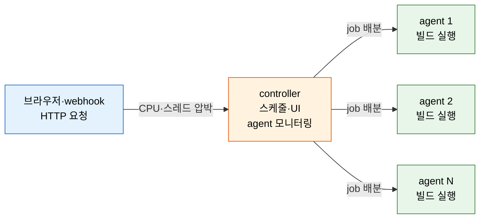
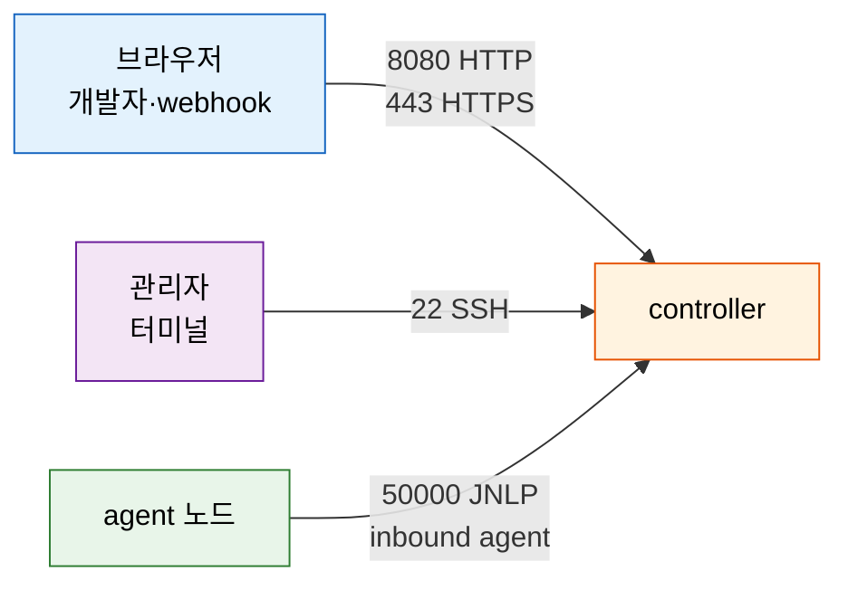

# Jenkins 서버 용량 산정과 시스템 요구사항

---

> 이 문서를 읽고 나면 controller가 자원을 소비하는 지점을 **설명하고**, CPU·RAM·디스크 추정식으로 VM 크기를 **산정하며**, 필요한 네트워크 포트를 **구분하고**, JVM 튜닝 플래그가 어떤 증상을 막는지 **예측**할 수 있습니다.


## 사전 지식

controller와 agent의 역할 분리를 알고 있으면 좋습니다. controller가 빌드를 "직접 돌리지 않는다"는 사실이 용량 직관의 출발점이 됩니다. `../03_agent/README.md`에서 역할 분리 구조를 먼저 확인하세요.


## 진입 — 왜 용량 산정을 알아야 하는가

> controller 자원이 부족하면 agent가 아무리 많아도 전체 빌드 처리량이 막힙니다.

Jenkins를 처음 설치할 때 "일단 돌아가면 된다"는 생각으로 작은 VM에 올리면, 개발팀이 커지고 파이프라인이 늘어날수록 controller가 먼저 병목이 됩니다. UI가 느려지고, agent 연결이 끊기며, 빌드가 큐에 쌓입니다. 이 현상은 대부분 초기 용량 설계 단계에서 controller의 자원 소비 지점을 제대로 파악하지 않아서 발생합니다. 어느 지점에서 어떤 자원이 얼마나 필요한지 추정하는 방법을 알면, 클라우드 VM 크기를 고르거나 온프레미스 서버 사양을 결정할 때 근거 있는 선택을 할 수 있습니다.


## 1. controller는 무엇에 자원을 쓰는가

> controller는 빌드를 직접 수행하지 않고 스케줄링·UI·agent 모니터링·빌드 분배를 담당하며, 이 조정 작업이 CPU와 메모리를 소비합니다.

> 이미 아는 "웹 서버가 동시 접속에 CPU를 쓴다"의, **Jenkins controller판**입니다. 요청을 처리하는 대신 빌드 작업을 조정한다는 점이 다릅니다.

Jenkins controller의 역할은 실제 빌드가 아닙니다. 파이프라인의 실행은 agent가 수행합니다. controller는 다음 네 가지를 합니다.

1. **스케줄링** — 큐에 쌓인 job을 적절한 agent에 배분합니다.
2. **UI 서빙** — 개발자가 브라우저로 보내는 HTTP 요청을 처리합니다.
3. **agent 모니터링** — 연결된 agent의 상태를 주기적으로 폴링합니다.
4. **빌드 분배 조정** — 실행 중인 파이프라인의 FlowNode 상태를 추적합니다.

공사 현장 감독에 빗댈 수 있습니다. 감독(controller)은 벽돌을 직접 쌓지 않고, 작업자(agent)가 어디서 무엇을 할지 배치하고 진행 상황을 확인합니다. 한계는 여기에도 있습니다. 감독의 사무실(JVM heap)이 비좁거나 전화선(HTTP 연결)이 포화되면, 작업자가 아무리 많아도 현장 전체가 멈춥니다. controller도 마찬가지로, 힙이 부족하거나 스레드가 포화되면 agent를 아무리 늘려도 전체 처리량이 막힙니다.



controller가 실제 빌드를 수행하지 않는다는 사실은 용량 직관을 바꿉니다. 빌드 처리량을 늘리려면 agent를 추가하면 됩니다. 하지만 동시 HTTP 요청이나 연결된 agent 수가 늘어나면 controller 자원이 병목이 됩니다. 이 두 축을 분리해서 생각해야 합니다.


## 2. CPU·RAM·디스크를 추정하는 휴리스틱

> 책이 제시하는 추정식 세 가지를 출발점으로 삼아, 실제 모니터링 데이터로 보정합니다.

아래 추정식은 *Learning Continuous Integration with Jenkins 3e*가 제시하는 휴리스틱입니다. Jenkins 공식 보장이 아니며, 사용 패턴에 따라 결과가 크게 달라집니다. 용량 설계의 출발점으로 삼고, 실제 운영 중 모니터링 데이터로 보정하는 것이 정석입니다.

| 자원 | 추정식 | 예시 |
|------|--------|------|
| CPU 코어 수 | 동시 HTTP/HTTPS 요청 수 ÷ 250 | 개발자 100명·빌드 트리거 100회 동시 발생 → 순간 CPU 약 20% (쿼드코어 기준) |
| 메모리(MB) | 연결된 agent 노드 수 × 3 | agent 100개 → controller 추가 메모리 약 300MB |
| 추가 디스크(MB) | 파이프라인 job 수 × 보관 빌드 수 × 평균 빌드 로그 크기(MB) | job 50개 × 보관 30개 × 로그 2MB → 3,000MB |

이 식에서 CPU는 빌드 연산이 아니라 HTTP 요청 처리와 스케줄링 스레드에 의해 소비된다는 점이 핵심입니다. 메모리는 agent 수에 비례하는데, controller가 각 agent 연결 상태를 JVM 힙 안에서 관리하기 때문입니다. 디스크는 controller가 빌드 로그를 저장하는 책임을 지기 때문에 job과 빌드 보관 수에 따라 선형으로 늘어납니다.

최소 사양 기준은 다음과 같습니다.

| 항목 | 최솟값 | 비고 |
|------|--------|------|
| CPU | 멀티코어 2GHz 이상 | 단일 코어는 스케줄러와 HTTP 처리가 경쟁 |
| RAM | 2GB 이상 | JVM 기본 힙 포함 |
| 디스크 | 10GB 이상 | `$JENKINS_HOME` 및 빌드 로그 저장 공간 |

책은 "이 식은 출발점일 뿐이며 실제 자원 소비는 사용 패턴마다 다르다"고 명시합니다. 운영 중 controller 리소스를 모니터링해 스케일업하는 것이 실제 답입니다. 클라우드 환경이라면 general-purpose VM(범용 인스턴스)을 시작점으로 권장합니다. 예시는 Azure 기준이며 GCP·AWS에도 대응하는 범용 VM 시리즈가 있습니다.


## 3. 네트워크 포트와 방화벽

> controller를 중심으로 브라우저·agent·관리자가 각각 다른 포트를 통해 접근하며, 방화벽 인바운드 정책에 모두 반영해야 합니다.

Jenkins controller가 사용하는 기본 포트는 아래와 같습니다. 이 값은 기본값이며, 설치 및 설정에서 변경할 수 있습니다(출처: *Learning Continuous Integration with Jenkins 3e*, Table 2.2).

| 포트 | 프로토콜 | 통신 대상 | 용도 |
|------|----------|----------|------|
| 8080 | HTTP | 브라우저·webhook | Jenkins 웹 UI 및 API |
| 443 | HTTPS | 브라우저·webhook | TLS 암호화 웹 접근 |
| 50000 | TCP (JNLP) | inbound agent | controller↔agent 빌드 채널 |
| 22 | SSH | 관리자 터미널 | 서버 관리 |

포트 50000은 inbound agent(JNLP agent)가 controller에 연결하는 전용 채널입니다. 이 포트가 방화벽에서 막히면 agent가 controller에 등록되지 않아 빌드 큐가 쌓이기만 하고 실행되지 않습니다. agent 연결 메커니즘의 세부 내용은 `../03_agent/README.md`에서 확인할 수 있습니다.



방화벽 또는 보안 그룹 설정에서 위 네 포트의 인바운드를 허용해야 합니다. 내부망에서만 운영한다면 8080·50000·22는 내부 CIDR로 제한하고 443만 외부에 열어 두는 방식이 일반적입니다. 포트 번호는 Jenkins 관리자 설정(Manage Jenkins > Security > Agent)에서 변경할 수 있으므로, 실제 운영 환경의 설정값을 방화벽 정책과 함께 문서화해 두는 것이 좋습니다.


## 4. JVM 튜닝 — 느려질 때 무엇을 만지나

> Jenkins는 Java 위에서 실행되므로 heap 크기와 GC 알고리즘이 UI 응답성과 OOM 빈도를 직접 결정합니다.

> 이미 아는 "Java 앱이 heap 부족하면 OOM이 난다"의, **Jenkins controller판**입니다. 파이프라인 활동이 없어도 느리다는 호소가 흔한데, 그 원인이 대부분 heap 설정과 GC 튜닝에 있습니다.

Jenkins는 JRE/JDK가 필요한 Java 애플리케이션입니다. 책 기준으로 Java 11이 흔히 사용됩니다. 파이프라인이 돌지 않아도 UI가 느리고 응답이 늦다는 호소가 자주 등장하는데, 이는 JVM 힙이 부족하거나 GC pause가 길기 때문인 경우가 많습니다.

아래는 책이 소개하는 `jvm-options.txt` 발췌 코드입니다. `override.conf`의 `JAVA_OPTS`로 전달합니다.

```text
# AlwaysPreTouch: JVM 시작 시 heap 전체를 OS에서 미리 커밋
# → 초기화 후 추가 page fault가 발생하지 않아 첫 빌드 지연이 줄어든다
-XX:+AlwaysPreTouch

# HeapDumpOnOutOfMemoryError: OOM 발생 시 heap dump를 자동 생성
# → OOM 원인 분석에 필수. 없으면 OOM 후 원인을 추적할 수 없다
-XX:+HeapDumpOnOutOfMemoryError

# HeapDumpPath: heap dump 파일을 저장할 경로 지정
# → /var/jenkins_home 아래 빌드 로그와 함께 보관하면 디스크 용량에 주의
-XX:HeapDumpPath=/var/jenkins_home/heapdump.hprof

# UseG1GC: Garbage-First GC 알고리즘 사용
# → 힙이 크고 latency가 중요한 서버 애플리케이션에서 GC pause를 줄임
# → Java 9 이후 기본값이지만 명시적으로 선언해 의도를 문서화
-XX:+UseG1GC

# ErrorFile: JVM crash 시 hs_err 로그 파일 경로 지정
# → 치명적 오류 발생 시 원인 파악에 사용
-XX:ErrorFile=/var/jenkins_home/logs/java_error%p.log

# LogVMOutput: JVM 내부 출력을 파일로 리다이렉트
-XX:+LogVMOutput

# LogFile: JVM 출력 파일 경로 지정
-XX:LogFile=/var/jenkins_home/logs/jvm.log
```

각 플래그가 막는 증상을 정리하면 다음과 같습니다.

| 플래그 | 막는 증상 |
|--------|----------|
| `-XX:+AlwaysPreTouch` | 첫 빌드 실행 시 UI 응답 지연 |
| `-XX:+HeapDumpOnOutOfMemoryError` | OOM 후 원인 불명 재시작 반복 |
| `-XX:+UseG1GC` | 과도한 GC pause로 인한 UI 응답 불능 |
| `-XX:ErrorFile` | JVM crash 후 원인 추적 불가 |

책은 "JVM 튜닝은 실험·모니터링·조정이 필요하다"고 명시합니다. 위 플래그는 출발점이며, 실제 heap 크기(`-Xmx`)는 운영 중 GC 로그와 heap 사용률을 관찰한 뒤 조정합니다. Java 11 JVM 옵션 전체 목록은 Oracle JDK 11 문서([https://docs.oracle.com/en/java/javase/11/tools/java.html](https://docs.oracle.com/en/java/javase/11/tools/java.html))에서 확인할 수 있습니다.


## 면접 질문

> 답을 떠올린 뒤 §정답 절에서 같은 번호로 대조하세요.

1. controller가 실제 빌드를 수행하지 않는데도 개발팀이 커질수록 controller CPU가 중요해지는 이유는 무엇인가요?
2. agent 100개를 연결할 때 책의 추정식으로 메모리를 계산하면 얼마이며, 이 식의 한계는 무엇인가요?
3. 포트 50000은 무엇을 위한 포트이며, 이 포트가 방화벽에서 막히면 어떤 증상이 나타나나요?

### 빈칸 채우기 — 용량 산정과 JVM 튜닝

다음 문장의 빈칸을 채워 보세요.

1. CPU 코어 수 추정식: 동시 HTTP 요청 수 ÷ `______`
2. 메모리(MB) 추정식: agent 노드 수 × `______`
3. controller와 inbound agent가 통신하는 포트 번호는 `______`입니다.
4. GC pause를 줄이는 JVM 플래그는 `-XX:+______`입니다.


## 정답

> 위 질문을 스스로 설명해 본 뒤에 펼치세요.

### 정답 1 — controller CPU가 중요한 이유

controller는 빌드 연산을 수행하지 않지만, 개발팀이 커질수록 동시 HTTP 요청(UI 접근·webhook)과 스케줄링 연산이 늘어납니다. 각 개발자가 Jenkins UI를 열거나 커밋 webhook이 동시에 들어오면 controller 스레드가 이 요청을 처리합니다. agent를 아무리 많이 붙여도 controller 스레드가 포화되면 빌드 큐를 소화하지 못하고 전체 처리량이 막힙니다. 빌드 실행 능력(agent)과 빌드 조정 능력(controller CPU) 두 축을 분리해서 관리해야 하는 이유입니다.

### 정답 2 — 메모리 추정과 한계

책의 추정식에서 메모리(MB) = agent 노드 수 × 3이므로, agent 100개 연결 시 추가 메모리는 약 300MB입니다. 이 식의 한계는 agent 수만 변수로 삼기 때문에 실제 소비를 정확히 반영하지 못한다는 점입니다. 동시에 실행되는 파이프라인 수, FlowNode 직렬화 빈도, 플러그인 개수, 빌드 히스토리 크기 등이 모두 heap 사용에 영향을 줍니다. 이 추정식은 초기 설계의 출발점으로만 사용하고, 실제 운영 중 GC 로그와 heap 사용률을 관찰해 보정해야 합니다.

### 정답 3 — 포트 50000의 역할과 증상

포트 50000은 inbound agent(JNLP agent)가 controller에 연결할 때 사용하는 전용 TCP 채널입니다. agent가 controller 쪽으로 연결을 시작하는 방식이므로, controller의 50000 포트가 방화벽에서 막히면 agent가 controller에 등록되지 못합니다. 결과적으로 빌드 큐에 job이 쌓이기만 하고 실행되지 않는 증상이 나타납니다. Jenkins 관리 콘솔에서 agent 상태가 "오프라인"으로 표시되며, 로그에 연결 실패 메시지가 반복적으로 기록됩니다.

### 빈칸 정답 — 용량 산정과 JVM 튜닝

1. `250` — CPU 코어 수 = 동시 HTTP 요청 수 ÷ 250 (책 휴리스틱)
2. `3` — 메모리(MB) = agent 노드 수 × 3 (책 휴리스틱)
3. `50000` — controller↔inbound agent JNLP 채널 기본 포트
4. `UseG1GC` — `-XX:+UseG1GC`로 Garbage-First GC를 활성화해 GC pause를 줄입니다.


## 관련 문서

> 용량 산정은 운영 점검, 배포 평가, IaC 설계, agent 연결 구조와 함께 봐야 실무 그림이 완성됩니다.

- [06-00. 점검 — 핵심 질문과 답 (계획·배포)](06-00.점검.핵심%20질문과%20답%20%28계획%C2%B7배포%29.md) § "핵심 질문" — 이 장 전체를 Q&A로 자가 점검
- [06-02. 배포 시나리오와 Well-Architected 평가](06-02.배포%20시나리오와%20Well-Architected%20평가.md) § "배포 형태" — VM·컨테이너·클라우드 선택 기준
- [06-03. IaC로 Jenkins 배포](06-03.IaC로%20Jenkins%20배포%20%E2%80%94%20Terraform%C2%B7JCasC%C2%B7Helm.md) § "Terraform 흐름" — 산정한 사양을 코드로 프로비저닝
- [../03_agent/README.md](../03_agent/README.md) § "agent 연결·50000" — inbound agent 연결 메커니즘과 50000 포트 상세
- [../05_operations/README.md](../05_operations/README.md) § "운영" — 운영 중 모니터링과 스케일업 기준
