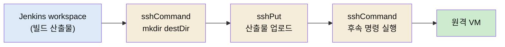

# SSH로 VM 배포 — sshPut·sshCommand·인증 분기·parallel 타깃

---

> 이 문서를 읽고 나면 컨테이너가 아닌 VM에 배포할 때 왜 SSH가 필요한지 **설명하고**, SSH Pipeline Steps의 `sshPut`·`sshCommand`가 remote 맵으로 무엇을 받는지 **이해하며**, 비밀번호 인증과 키 인증을 코드에서 어떻게 **구분**하고, 여러 VM에 동시에 배포할 때 `parallel`을 어떻게 쓰는지 **확인**할 수 있습니다.


## 사전 지식

`withCredentials`로 시크릿을 빼는 방법([`../02_security/01-02.시크릿 관리와 최소 권한 원칙.md`](../02_security/01-02.시크릿%20관리와%20최소%20권한%20원칙.md))과 Declarative Pipeline의 `stage`·`steps` 구조를 알고 있으면 좋습니다. 배포 대상이 K8s가 아니라 일반 VM(가상머신)이라는 점이 이 편의 전제입니다.


## 진입 — 컨테이너 시대에 왜 아직 SSH인가

> Argo CD·Helm으로 K8s에 배포하는 흐름을 배웠지만 현실의 배포 대상이 전부 K8s는 아닙니다. VM에 파일을 올리고 명령을 실행하는 가장 오래된 방법이 여전히 필요합니다.

[`06-13.Argo CD로 CD 설계`](05-04.Argo%20CD로%20CD%20설계%20%E2%80%94%20Jenkins%20역할분담%C2%B7staging%E2%86%92prod.md)에서 본 GitOps는 배포 대상이 Kubernetes일 때의 이야기입니다. 그런데 레거시 애플리케이션, 온프레미스 서버, 망분리 환경의 VM처럼 컨테이너 오케스트레이터가 없는 대상도 많습니다. 이런 곳에 배포하려면 결국 "파일을 서버에 복사하고 거기서 명령을 실행한다"는 가장 원초적인 방법으로 돌아갑니다. 그게 SSH입니다.

Jenkins에서 SSH 배포를 셸 `scp`·`ssh` 명령으로 직접 짤 수도 있지만 그러면 호스트 키 검증·인증·에러 처리를 매번 손으로 다뤄야 합니다. SSH Pipeline Steps 플러그인(ID `ssh-steps`)은 이걸 `sshPut`·`sshCommand` 같은 Pipeline step으로 감싸 줍니다. 이 편은 그 step들로 VM 한 대 또는 여러 대에 배포하는 패턴을 다룹니다.


## 1. remote 맵 — 접속 대상을 한 곳에 모은다

> SSH step은 접속 정보를 `remote`라는 맵 하나로 받습니다. 호스트·사용자·인증 수단이 전부 이 맵에 들어갑니다.

`ssh-steps`의 모든 step은 `remote` 맵을 받습니다. 자주 쓰는 필드는 이렇습니다.

| 필드 | 의미 | 비고 |
|------|------|------|
| `name` | 원격 이름 | 보통 host와 같게 둡니다 (필수) |
| `host` | 호스트명 또는 IP | (필수) |
| `user` | 접속 계정 | (필수) |
| `port` | 포트 | 기본 22 |
| `password` | 비밀번호 인증용 | 비밀번호 방식일 때 |
| `identityFile` | 개인키 파일 경로 | 키 인증일 때 |
| `passphrase` | 개인키 암호 | 키에 암호가 걸렸을 때 |
| `allowAnyHosts` | knownHosts 생략 허용 | `true`면 호스트 키 검증을 건너뜁니다 |

`allowAnyHosts: true`는 편하지만 중간자 공격을 막는 호스트 키 검증을 끄는 설정입니다. 신뢰된 내부망에서나 쓰고, 외부 노출 환경에서는 knownHosts를 등록하는 편이 안전합니다.

핵심은 이 remote 맵을 코드에서 한 번 만들어 두고, 거기에 인증 정보만 나중에 채워 넣는 구조입니다.

```groovy
def baseRemote = { t -> [name: t.host, host: t.host, port: (t.port ?: 22) as int, allowAnyHosts: true] }
```

`user`·`password`·`identityFile`은 일부러 비워 둡니다. 이 값들은 시크릿이라 코드에 직접 쓰지 않고 다음 절에서 `withCredentials`로 주입합니다.


## 2. sshPut과 sshCommand — 올리고, 실행한다

> 배포의 두 동작은 "산출물을 올린다(sshPut)"와 "원격에서 명령을 실행한다(sshCommand)"입니다.

`ssh-steps`가 제공하는 step은 다섯 가지입니다. 배포에 가장 많이 쓰는 둘부터 봅니다.

| step | 동작 |
|------|------|
| `sshPut` | 로컬 파일·디렉토리를 원격 호스트로 올립니다 |
| `sshCommand` | 원격 호스트에서 명령을 실행하고 출력을 받습니다 |
| `sshGet` | 원격에서 파일을 가져옵니다 |
| `sshScript` | 스크립트 파일을 원격에서 실행합니다 |
| `sshRemove` | 원격의 파일·디렉토리를 지웁니다 |

배포 한 대상에 대한 동작을 함수로 묶으면 이렇게 됩니다.

```groovy
def doSsh = { r, t ->
    sshCommand remote: r, command: 'mkdir -p ' + t.destDir          // 대상 디렉토리 준비
    sshPut     remote: r, from: "${WORKSPACE}/${env.LOCAL_FILE}", into: t.destDir   // 산출물 업로드
    t.commands.each { line ->
        sshCommand remote: r, command: 'set -eu; cd ' + t.destDir + '; ' + line     // 배포 후 명령 실행
    }
}
```

흐름이 명확합니다. 디렉토리를 만들고(`sshCommand`), 빌드 산출물을 올리고(`sshPut`), 올린 자리에서 후속 명령(압축 해제·서비스 재시작 등)을 차례로 실행(`sshCommand`)합니다. 산출물 자체는 어디서 오느냐 하면, 보통 앞 단계 빌드 Job이 남긴 결과물을 아티팩트 저장소에서 받아 옵니다 — 그 경로는 [`06-19.MinIO 아티팩트 레지스트리`](06-03.MinIO%20아티팩트%20레지스트리%20%E2%80%94%20mc%20CLI%C2%B7버전%20핀%C2%B7빌드%20산출물%20연계.md)에서 이어 봅니다.




## 3. 인증 분기 — 비밀번호냐 키냐

> 같은 배포라도 대상에 따라 비밀번호 인증과 키 인증이 갈립니다. 어느 쪽이든 시크릿은 `withCredentials`로 감싸 remote 맵에 채웁니다.

§1에서 비워 둔 인증 필드를 여기서 채웁니다. 핵심은 두 가지입니다. 첫째, 인증 정보는 절대 코드에 쓰지 않고 Jenkins 크레덴셜에서 꺼냅니다. 둘째, 인증 방식(비밀번호 vs 키)에 따라 채우는 필드가 다릅니다.

```groovy
def runOne = { t ->
    def r = baseRemote(t)
    if (t.authType == 'PASSWORD') {
        withCredentials([usernamePassword(credentialsId: t.credentialId,
                usernameVariable: 'SSH_U', passwordVariable: 'SSH_P')]) {
            r.user = env.SSH_U
            r.password = env.SSH_P          // 비밀번호 인증
            doSsh(r, t)
        }
    } else if (t.authType == 'PRIVATE_KEY') {
        withCredentials([sshUserPrivateKey(credentialsId: t.credentialId,
                keyFileVariable: 'SSH_KEY', usernameVariable: 'SSH_U', passphraseVariable: 'SSH_PH')]) {
            r.user = env.SSH_U
            r.identityFile = env.SSH_KEY    // 키 인증
            if (env.SSH_PH?.trim()) { r.passphrase = env.SSH_PH }
            doSsh(r, t)
        }
    } else {
        error('authType: ' + t.authType)
    }
}
```

`withCredentials`의 바인딩 타입이 둘로 갈립니다. 비밀번호는 `usernamePassword`로 user·password를, 키는 `sshUserPrivateKey`로 키 파일 경로·user·passphrase를 꺼냅니다. 꺼낸 값을 `withCredentials` 블록 *안에서* remote 맵에 채우고 그 안에서 배포를 끝내는 게 중요합니다. 블록을 벗어나면 바인딩한 환경변수가 사라지기 때문입니다. 인증 방식이 셋 다 아니면 `error()`로 빌드를 중단해, 잘못된 설정이 조용히 통과하지 않게 막습니다.


## 4. parallel — 여러 VM에 동시 배포

> 배포 대상이 여러 대면 한 대씩 순차로 도는 대신 `parallel`로 동시에 처리합니다.

대상이 한 대일 때는 `runOne`을 한 번 부르면 끝입니다. 여러 대면 Declarative Pipeline의 `parallel` step으로 동시에 돌립니다.

```groovy
def deployTargets = [
    [ id: 'dply-0', targetId: 'SVR_0000002', host: '10.255.17.235', port: 22,
      authType: 'PASSWORD', credentialId: 'QPR_0000001_01', destDir: '/opt',
      commands: ['set -eux; ls -al', 'whoami'] ]
]

def b = [:]
deployTargets.each { b[it.id] = { runOne(it) } }
parallel b
```

`parallel`은 `[브랜치이름: 클로저]` 맵을 받아 각 클로저를 동시에 실행합니다. 여기서 브랜치 키(`id`)를 `dply-0`, `dply-1`처럼 고정된 패턴으로 만드는 데에는 이유가 있습니다. 만약 키로 사람이 읽는 식별자(`targetId`)를 직접 쓰면, 같은 식별자가 두 번 나올 때 맵 키가 충돌해 한쪽 배포가 통째로 사라집니다. 그래서 충돌하지 않는 일련번호를 키로 쓰고, 화면 표시용 이름은 별도 필드(`targetId`)에 둡니다. 이름공간 충돌을 일련번호로 피하는 발상은 [`06-17.Folder 플러그인`](06-01.Folder%20플러그인%20%E2%80%94%20namespace%20격리%C2%B7full%20name%20식별%C2%B7폴더%20스코핑.md)의 full name과 같은 문제의식입니다.


## 5. 비유 — 택배 기사와 현관 비밀번호

> SSH 배포는 택배 기사가 집집마다 물건을 놓고 간단한 작업까지 해 주는 일에 가깝습니다.

`sshPut`은 택배 기사가 집 앞에 물건(산출물)을 놓는 일이고, `sshCommand`는 "박스를 열어 냉장고에 넣어 주세요" 같은 추가 부탁을 들어주는 일입니다. 집마다 현관 여는 방법이 다른데, 어떤 집은 비밀번호(`password`)고 어떤 집은 열쇠(`identityFile`)입니다. 기사는 매번 맞는 방법으로 문을 엽니다. 여러 집을 한 번에 돌리는 게 `parallel`입니다.

이 비유는 "기사가 비밀번호를 수첩에 적어 다닌다"는 지점에서 깨집니다. 그렇게 하면 수첩을 잃어버릴 때 모든 집이 뚫립니다. 그래서 SSH 배포에서는 비밀번호·열쇠를 코드(수첩)에 적지 않고, 금고(`withCredentials`)에서 그때그때 꺼내 쓰고 작업이 끝나면 손에서 지웁니다. 이 차이가 안전한 배포와 사고 나는 배포를 가릅니다.


## 6. 점검 — 면접 대비

> 이 편을 다 읽었으면 다음 질문에 답할 수 있어야 합니다.

1. **K8s에 Argo CD로 배포하는 흐름이 있는데도 SSH 배포가 필요한 이유는?**
   배포 대상이 전부 K8s는 아니기 때문입니다. 레거시·온프레미스·망분리 VM처럼 오케스트레이터가 없는 곳에는 "파일을 올리고 명령을 실행한다"는 SSH 방식이 여전히 필요합니다.

2. **`sshPut`과 `sshCommand`의 역할 차이는?**
   `sshPut`은 로컬 산출물을 원격으로 올리고, `sshCommand`는 원격에서 명령을 실행해 출력을 받습니다. 배포는 보통 mkdir(command) → 업로드(put) → 후속 명령(command) 순서로 둘을 엮습니다.

3. **비밀번호 인증과 키 인증은 코드에서 어떻게 갈립니까?**
   `withCredentials`의 바인딩 타입이 다릅니다. 비밀번호는 `usernamePassword`로 user·password를, 키는 `sshUserPrivateKey`로 키 파일·user·passphrase를 꺼냅니다. 꺼낸 값은 반드시 `withCredentials` 블록 안에서 remote 맵에 채우고 그 안에서 배포를 끝냅니다.

4. **`parallel`의 브랜치 키를 사람이 읽는 이름 대신 일련번호로 두는 이유는?**
   같은 식별자가 두 번 나오면 맵 키가 충돌해 한쪽 배포가 사라지기 때문입니다. 충돌하지 않는 일련번호(`dply-0`, `dply-1`)를 키로 쓰고, 표시용 이름은 별도 필드에 둡니다.

5. **`allowAnyHosts: true`의 위험은?**
   호스트 키 검증을 건너뛰어 중간자 공격을 막지 못합니다. 신뢰된 내부망에서나 쓰고, 외부 노출 환경에서는 knownHosts를 등록하는 편이 안전합니다.
