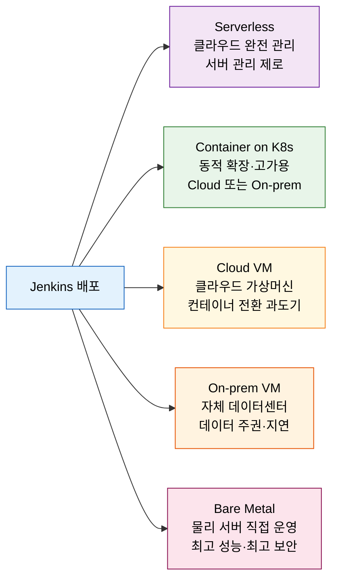
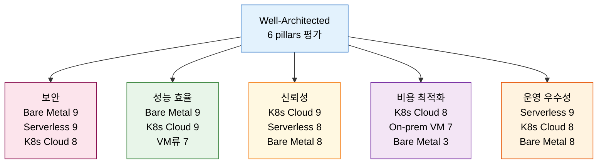

# 06-02. 배포 시나리오와 Well-Architected 평가

---

> 이 문서를 읽고 나면 5가지 Jenkins 배포 형태를 **구분하고**, Azure Well-Architected 6 pillars 관점으로 트레이드오프를 **평가하며**, 팀 상황에 맞는 배포를 **선택**하고, container on K8s가 종합 점수 기준으로 왜 우위인지 **설명**할 수 있습니다.

## 사전 지식

Jenkins Controller·Agent 역할 분리(`../03_agent/README.md`)와 JCasC의 기본 개념을 알고 있으면 이 편의 배포 형태 비교가 훨씬 구체적으로 읽힙니다. 용량 산정 원리는 앞 편(06-01)에서 다루었으므로 함께 참고하면 좋습니다.

## 진입 — 왜 배포 형태 선택이 중요한가

> Jenkins를 어디에 어떤 방식으로 올리느냐에 따라 보안·비용·운영 부담이 결정적으로 갈립니다.

애플리케이션을 배포할 때 "VM에 올릴까, 컨테이너로 올릴까"를 고민하듯, Jenkins 자체도 동일한 선택지 앞에 섭니다. 그리고 그 선택이 Controller 가용성, 에이전트 확장 속도, 월 운영 비용, 보안 책임 범위에 직접 영향을 줍니다. 한 번 굳어진 인프라는 바꾸기 어렵기 때문에, 배포 형태를 결정할 때 팀의 기술 수준·규제 요건·성장 계획을 함께 놓고 평가해야 합니다.

## 1. Jenkins를 배포하는 5가지 형태

> 이미 아는 "앱을 VM에 올릴까 컨테이너에 올릴까"의 **Jenkins판 선택지**이며, cloud/on-prem 축이 한 겹 더 얹힙니다.

> 5가지 형태(serverless·container K8s·VM·bare metal)와 cloud/on-prem 축의 조합이 실질적인 선택지를 구성합니다.

Jenkins 배포 형태는 크게 실행 환경(serverless·container·VM·bare metal)과 호스팅 위치(cloud·on-prem) 두 축으로 구분합니다. 책(Learning Continuous Integration with Jenkins 3e, 이하 '책')은 이 조합에서 다섯 가지 실용적 시나리오를 도출합니다.

**Serverless(클라우드 관리형)** 는 서버를 직접 관리하지 않고 클라우드가 인프라·패치·보안을 전담합니다. 책은 동작 예제를 제공하지 않아 탐색 단계 팀에게 유보적입니다.

**Container on Kubernetes(K8s)** 는 Jenkins Controller를 Pod로 실행하고 에이전트를 동적으로 스케일합니다. 확장성·고가용성·비용 효율이 강점이며, 클라우드(AKS·EKS·GKE)와 온프렘 K8s 모두에서 동작합니다.

**Cloud VM** 은 클라우드의 가상 머신에 Jenkins를 올리는 전통적 방식입니다. 온프렘에서 클라우드로 전환하는 팀이 컨테이너 역량을 쌓는 동안 활용하기 좋습니다.

**On-prem VM** 은 자체 데이터센터 가상 머신에 Jenkins를 운영합니다. 데이터 주권·지연 시간·장기 비용 통제가 필요한 조직에 적합합니다.

**On-prem Bare Metal** 은 물리 서버에 직접 Jenkins를 올립니다. 최고 성능·최고 보안이 가능하지만 하드웨어 투자와 운영 인력 비용이 가장 큽니다.

이 다섯 형태를 집의 유형에 빗댈 수 있습니다. bare metal 구매는 자가 소유(최고 통제, 최고 비용), on-prem VM은 전세(공간은 내 것, 건물은 임차), cloud VM은 호텔 장기 투숙(관리 위임, 유연한 계약), container K8s on cloud는 서비스드 아파트(확장·관리 모두 위임, 비용 효율), serverless는 에어비앤비 자동화(완전 위임)에 해당합니다. 다만 이 비유는 비용·통제 축에서만 맞고, 확장성과 운영 부담은 실제 인프라 특성과 따로 판단해야 합니다.

## 2. 6 pillars로 평가하는 법

> 책이 사용하는 평가 프레임워크는 **Azure Well-Architected**이며, 6개 기둥으로 형태별 상대 점수를 산출합니다.

> 표의 점수는 책(Figure 2.2~2.5)의 휴리스틱 평가이며, 클라우드·하드웨어·네트워크 환경에 따라 달라질 수 있습니다.

책은 Azure Well-Architected Framework의 6 pillars(기둥)를 기준으로 각 배포 형태를 평가합니다. 6 pillars는 **보안(Security)**, **성능 효율(Performance Efficiency)**, **신뢰성(Reliability)**, **비용 최적화(Cost Optimization)**, **운영 우수성(Operational Excellence)**, 그리고 지속 가능성(Sustainability)입니다. 책은 지속 가능성을 논의 범위 밖으로 두고, 나머지 다섯 기둥으로 각 형태를 상대 평가합니다.

아래 표는 책 Figure 2.2~2.5의 요지를 정리한 것입니다. 책 스스로 "일반 등급이며 클라우드·하드웨어·네트워크에 따라 달라진다"고 명시하므로, 절대 수치가 아닌 팀 맥락에서 참고용으로 사용해야 합니다.

| 배포 형태 | 보안 | 성능 효율 | 신뢰성 | 비용 최적화 | 운영 우수성 |
|----------|------|----------|--------|------------|------------|
| Container K8s (cloud) | 8 | 9 | 9 | 8 | 8 |
| Serverless (cloud) | 9 | 7 | 8 | 7 | 9 |
| Cloud VM | 7 | 7 | 7 | 6 | 7 |
| On-prem VM | 6 | 7 | 6 | 7 | 6 |
| Bare Metal (on-prem) | 9 | 9 | 8 | 3 | 8 |

책 점수에서 몇 가지 패턴이 드러납니다. 첫째, **모든 형태에서 cloud가 on-prem보다 대체로 높습니다.** 패치·업그레이드·재해 복구를 클라우드 플랫폼이 대신 처리하기 때문입니다. 둘째, **container K8s on cloud가 성능 효율·신뢰성·비용 최적화·운영 우수성에서 고루 높아 종합 우위**입니다. 셋째, **bare metal은 성능·보안에서 최고이지만 비용 최적화가 3점으로 가장 낮습니다.** 하드웨어 투자·유지보수·인력 비용을 클라우드처럼 탄력적으로 조정할 수 없기 때문입니다.

다만 이 점수는 책이 제시하는 휴리스틱 추정이지 Jenkins 공식 입장이나 Azure 공식 벤치마크가 아닙니다. 실제 선택에서는 팀의 K8s 역량, 규제 환경, 데이터 주권 요건을 함께 고려해야 합니다.

## 3. 시나리오별 use-case 매핑

> 팀의 기술 역량·규제 요건·성장 단계에 따라 어떤 배포 형태가 맞는지 달라집니다.

책 Table 2.3의 요지를 정리하면, 각 배포 형태는 서로 다른 팀 상황에 최적화되어 있습니다.

| 배포 형태 | 적합한 팀 상황 |
|----------|--------------|
| Container K8s (cloud) | 확장성·신뢰성·비용 효율·관리 위임을 모두 원하는 팀 |
| Cloud VM | 온프렘에서 클라우드로 전환 중이며 컨테이너 역량이 아직 부족한 팀 |
| On-prem VM | 데이터 주권·낮은 지연 시간·장기 비용 통제가 필요한 팀 |
| Bare Metal (on-prem) | 보안이 최우선이고 규제 또는 정보기관 수준의 격리가 필요한 조직 |
| Serverless | 탐색 여유가 있고 서버 관리 제로를 원하는 팀 |

"정답"은 점수표에서 가장 높은 형태가 아닙니다. 책 점수에서 container K8s on cloud가 종합 우위이더라도, K8s 운영 역량이 없는 팀이 무리하게 도입하면 운영 우수성 점수가 오히려 떨어집니다. 데이터를 외부 클라우드에 올릴 수 없는 규제 환경이라면 on-prem이 유일한 선택지가 됩니다. 정답은 팀의 현재 기술 수준, 성장 방향, 규제 요건이 함께 정합니다.

비용 관점에서 한 가지를 더 짚으면, 책의 비용 최적화 점수는 **TCO(Total Cost of Ownership)** 관점입니다. cloud VM은 서버 비용은 낮지만 관리형 서비스 이점이 없어 인력 비용이 더해지고, bare metal은 하드웨어 감가상각·냉각·네트워크 비용을 모두 자체 부담합니다. container K8s on cloud는 사용한 만큼만 과금하고 에이전트를 유휴 시 축소할 수 있어 장기 TCO가 낮습니다.

## 4. JCasC가 평가를 끌어올리는 이유

> 배포 형태와 무관하게 설정을 코드로 두면 신뢰성과 운영 우수성 점수가 올라갑니다.

어떤 배포 형태를 선택하더라도 JCasC(Jenkins Configuration as Code)를 함께 적용하면 Well-Architected 점수가 실질적으로 상승합니다. 이유는 재현성입니다. Controller를 새 인스턴스로 교체하거나 재해 복구 환경을 구성할 때, 수동 클릭 없이 YAML 파일 하나로 동일한 상태를 만들어낼 수 있습니다. 이는 신뢰성(빠른 복구)과 운영 우수성(일관된 환경)을 동시에 높입니다.

책은 코드화 수준을 세 층으로 구분합니다. **JCasC**는 Controller 설정(플러그인·자격증명·시스템 설정)을 YAML로, **Pipeline-as-Code**는 빌드 절차를 Jenkinsfile로, **IaC(Infrastructure as Code)** 는 인프라 자체(VM·K8s 클러스터)를 Terraform 또는 Helm으로 코드화합니다. 책의 마무리 질문(질문 5)에서 "신뢰성을 높이는 방법은?" 정답이 D, 즉 "all of the above(JCasC + IaC + Pipeline-as-Code 모두)"인 것은, 세 층이 각각 독립적으로 신뢰성에 기여하기 때문입니다. IaC와 JCasC의 구체적인 구현 방법은 다음 편(06-03)에서 다룹니다.

## 면접 질문

> 답을 떠올린 뒤 §정답 절에서 같은 번호로 대조하세요.

1. 책 평가 기준으로 container K8s on cloud가 종합 최적인 근거 세 가지를 설명하세요. 그 한계는 무엇인가요?
2. 보안·성능 점수가 최고임에도 bare metal을 선택하는 조직이 포기하는 것은 무엇인가요?
3. 클라우드 배포가 on-prem보다 6 pillars에서 대체로 우위인 이유를 두 가지 이상 설명하세요.

### 빈칸 채우기 — 배포 시나리오와 Well-Architected

다음 문장의 빈칸을 채워 보세요.

1. 책에서 성능·보안이 최고이지만 비용 최적화가 최하(3점)인 배포 형태는 `______`입니다.
2. Jenkins 배포 형태를 평가하는 책의 프레임워크는 `______` Well-Architected입니다.
3. 책 점수 기준 종합 최적 배포는 `______` on K8s입니다.

## 정답

> 위 질문을 스스로 설명해 본 뒤에 펼치세요.

### 정답 1 — container K8s on cloud의 우위와 한계

책 점수 기준으로 세 가지 근거가 있습니다. 첫째, 에이전트 Pod를 수요에 따라 동적으로 스케일해 **성능 효율(9점)** 이 높습니다. 둘째, Pod 재스케줄링·롤링 업데이트로 가동 시간을 유지해 **신뢰성(9점)** 이 높습니다. 셋째, 유휴 에이전트를 0으로 줄여 **비용 최적화(8점)** 가 좋습니다. 한계는 K8s 운영 역량이 없는 팀에서는 이 점수가 실제로 나오지 않는다는 점입니다. 또한 이 점수는 책의 휴리스틱 추정이며 Jenkins 공식 보장이 아닙니다.

### 정답 2 — bare metal이 포기하는 것

bare metal on-prem은 보안(9점)과 성능 효율(9점)에서 최고이지만, 비용 최적화(3점)가 가장 낮습니다. 하드웨어 구매·감가상각·냉각·네트워크 비용을 전액 자체 부담하고, 트래픽이 적을 때도 동일한 하드웨어를 유지해야 하므로 탄력적 비용 조정이 불가능합니다. 또한 패치·하드웨어 교체·장애 대응을 모두 자체 인력이 처리해야 합니다.

### 정답 3 — cloud가 on-prem보다 우위인 이유

두 가지 주요 이유가 있습니다. 첫째, 패치·업그레이드·재해 복구 같은 인프라 관리를 클라우드 플랫폼이 대신하므로 **운영 우수성**이 높습니다. 둘째, 클라우드의 매니지드 서비스(로드 밸런서·자동 복구·멀티 AZ)가 **신뢰성** 구성 비용을 낮춥니다. 셋째, 수요에 따라 컴퓨팅 자원을 늘리고 줄일 수 있어 **비용 최적화**에 유리합니다.

### 빈칸 정답 — 배포 시나리오와 Well-Architected

1. `Bare Metal` — 물리 서버 직접 운영으로 성능·보안은 최고이지만 비용 탄력성이 없습니다.
2. `Azure` — 책은 Azure Well-Architected Framework를 명시적으로 사용합니다.
3. `Container` — Container on K8s가 책 기준 5개 기둥 종합 점수에서 가장 고르게 높습니다.

## 관련 문서

> 배포 형태 결정은 앞 편의 용량 산정, 뒤 편의 IaC 구현, 그리고 agent·보안 설계와 맞물립니다.

- [06-00. 점검 — 핵심 질문과 답 (계획·배포)](06-00.점검.핵심%20질문과%20답%20%28계획%C2%B7배포%29.md) § "핵심 질문" — 이 장 전체를 Q&A로 자가 점검
- [06-01. Jenkins 서버 용량 산정과 시스템 요구사항](06-01.Jenkins%20서버%20용량%20산정과%20시스템%20요구사항.md) § "추정 휴리스틱" — 배포 형태 결정 전 필요 자원 추정 방법
- [06-03. IaC로 Jenkins 배포](06-03.IaC로%20Jenkins%20배포%20%E2%80%94%20Terraform%C2%B7JCasC%C2%B7Helm.md) § "코드화 3계층" — 배포 이후 설정 코드화로 신뢰성을 끌어올리는 방법
- [../03_agent/README.md](../03_agent/README.md) § "K8s 배포" — container on K8s에서 Controller·Agent Pod 구성 방법
- [../02_security/README.md](../02_security/README.md) § "JCasC 보안" — 자격증명을 JCasC로 코드화할 때의 보안 고려사항
