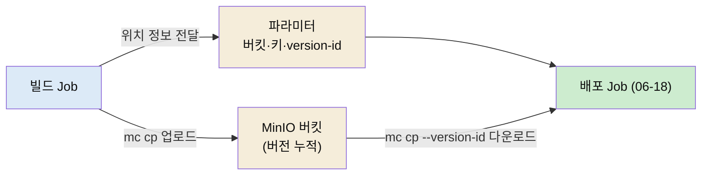

# MinIO 아티팩트 레지스트리 — mc CLI·버전 핀·빌드 산출물 연계

---

> 이 문서를 읽고 나면 컨테이너 이미지가 아닌 일반 산출물을 어디에 보관하는지 **설명하고**, MinIO Client(`mc`)로 객체를 올리고 내리는 명령을 **이해하며**, 버전을 고정해 받는 `--version-id`가 왜 필요한지 **판단**하고, 빌드 Job의 산출물이 배포 Job으로 어떻게 전달되는지 **확인**할 수 있습니다.


## 사전 지식

[`06-06.Artifactory 연동`](02-03.Artifactory%20연동%20%E2%80%94%20아티팩트%20저장소.md)에서 아티팩트 저장소의 개념을, [`06-18.SSH로 VM 배포`](06-02.SSH로%20VM%20배포%20%E2%80%94%20sshPut%C2%B7sshCommand%C2%B7인증%20분기%C2%B7parallel%20타깃.md)에서 VM 배포 흐름을 보고 오면 이 편이 그 사이를 잇는 조각임이 보입니다. S3 객체 스토리지(버킷·오브젝트 키) 개념을 알면 더 쉽습니다.


## 진입 — 이미지는 Harbor, 그럼 나머지 산출물은?

> 컨테이너 이미지는 Harbor 같은 레지스트리에 들어갑니다. 그런데 VM 배포용 tar, 설정 묶음, 빌드 결과 파일처럼 이미지가 아닌 산출물은 어디에 둘까요?

[`06-11.첫 CI Jenkinsfile 구현`](05-02.첫%20CI%20Jenkinsfile%20구현%20%E2%80%94%20완성%20코드%C2%B7Multibranch%C2%B7Blue%20Ocean.md)에서 만든 산출물은 컨테이너 이미지였고, 그건 Harbor로 push했습니다. 하지만 [`06-18`](06-02.SSH로%20VM%20배포%20%E2%80%94%20sshPut%C2%B7sshCommand%C2%B7인증%20분기%C2%B7parallel%20타깃.md)처럼 VM에 배포할 때는 이미지가 아니라 `app.tar.gz` 같은 파일을 올립니다. 이런 비-이미지 산출물을 빌드 단계에서 어딘가 보관했다가 배포 단계에서 꺼내야 합니다.

그 보관소로 자주 쓰는 게 MinIO입니다. MinIO는 S3 API와 호환되는 오브젝트 스토리지라, AWS S3 없이도 사내에 S3처럼 쓰는 버킷 저장소를 둘 수 있습니다. Jenkins에서는 MinIO Client(`mc`)라는 CLI로 이 저장소에 파일을 올리고 내립니다. 이 편은 `mc`로 산출물을 다루고, 그 산출물을 빌드 Job과 배포 Job 사이에 넘기는 패턴을 다룹니다.


## 1. mc alias — 저장소에 이름을 붙인다

> `mc`는 접속할 MinIO 서버를 alias라는 이름으로 등록한 뒤, 그 이름으로 명령을 보냅니다.

`mc`로 무언가 하려면 먼저 어느 서버에 어떤 자격증명으로 접속할지 alias로 등록합니다. 자격증명은 당연히 코드에 쓰지 않고 `withCredentials`로 꺼냅니다.

```groovy
withCredentials([usernamePassword(
        credentialsId: env.MINIO_CRED_ID,
        usernameVariable: 'MINIO_ACCESS',
        passwordVariable: 'MINIO_SECRET')]) {
    sh 'mc alias set myminio "$MINIO_URL" "$MINIO_ACCESS" "$MINIO_SECRET"'
    // 이후 mc 명령은 myminio/ 로 이 서버를 가리킨다
}
```

`mc alias set myminio <URL> <ACCESS> <SECRET>` 한 줄이면, 이후 `myminio/버킷/키` 형식으로 이 서버의 객체를 가리킬 수 있습니다. ACCESS/SECRET은 S3의 액세스 키·시크릿 키에 해당하며 Jenkins 크레덴셜에 username/password 쌍으로 저장해 둔 것을 꺼내 씁니다.


## 2. mc cp — 올리고 내린다

> 객체 복사는 `mc cp`로 합니다. 방향은 인자 순서로 정해집니다.

`mc cp`는 로컬과 MinIO 사이를 양방향으로 복사합니다. 배포 Job에서는 저장소의 산출물을 워크스페이스로 내려받습니다.

```groovy
// myminio 버킷의 객체를 현재 디렉토리로 내려받기
sh "mc cp ${versionOpt} myminio/\$MINIO_BUCKET/\$MINIO_OBJECT_KEY ."
```

`mc cp <원본> <대상>` 순서라, 원본이 `myminio/...`면 내려받기, 대상이 `myminio/...`면 올리기입니다. 빌드 Job은 산출물을 올리고(`mc cp app.tar.gz myminio/버킷/키`), 배포 Job은 그걸 내려받습니다(`mc cp myminio/버킷/키 .`). 위 코드의 `${versionOpt}`는 다음 절에서 다루는 버전 고정 옵션입니다.


## 3. --version-id — 어느 버전을 받을지 고정한다

> 버킷에 버저닝이 켜져 있으면 같은 키에 여러 버전이 쌓입니다. 배포에서는 "방금 그 버전"을 정확히 집어야 합니다.

S3 호환 스토리지는 객체 버저닝을 지원합니다. 같은 오브젝트 키에 파일을 여러 번 올리면 덮어쓰는 게 아니라 버전이 쌓입니다. 이게 배포에서 중요한 이유가 있습니다. 버전을 지정하지 않고 키만으로 받으면 항상 최신 버전이 옵니다. 그런데 빌드와 배포 사이에 다른 빌드가 같은 키에 새 산출물을 올렸다면, 배포가 의도와 다른 산출물을 집을 수 있습니다.

```groovy
def versionOpt = env.MINIO_FILE_VERSION?.trim() ? "--version-id ${env.MINIO_FILE_VERSION}" : ''
```

그래서 빌드가 산출물을 올릴 때 받은 version-id를 배포 Job에 넘기고, 배포는 `--version-id`로 *바로 그 버전*을 핀(pin)해서 받습니다. version-id가 비어 있으면 옵션 없이(최신) 받고, 있으면 정확히 그 버전을 받는 분기입니다. "최신을 받는다"와 "지정한 버전을 받는다"의 차이가 재현 가능한 배포를 만듭니다 — 같은 입력이면 며칠 뒤에 돌려도 같은 산출물이 옵니다.


## 4. 빌드와 배포를 잇는 산출물 메타데이터

> 빌드 Job과 배포 Job은 별개 Job입니다. 둘을 잇는 건 산출물 자체와 그 위치 정보(버킷·키·버전)입니다.

[`06-18`](06-02.SSH로%20VM%20배포%20%E2%80%94%20sshPut%C2%B7sshCommand%C2%B7인증%20분기%C2%B7parallel%20타깃.md)의 배포 Job은 산출물의 위치를 파라미터로 받습니다.

| 파라미터 | 의미 |
|----------|------|
| `TPS_MINIO_BUCKET` | 산출물이 든 버킷 |
| `TPS_MINIO_OBJECT_KEY` | 객체 키(경로) |
| `TPS_MINIO_FILE_VERSION` | 버전 핀(있으면 그 버전, 없으면 최신) |
| `TPS_MINIO_LOCAL_FILE` | 내려받아 저장할 로컬 파일명 |

빌드 Job이 산출물을 MinIO에 올린 뒤 이 네 값을 결정하면 배포 Job은 파라미터로 그 값을 받아 §2·§3의 `mc cp`로 정확한 산출물을 내려받습니다. 컨테이너 이미지 빌드에서 [`06-11`](05-02.첫%20CI%20Jenkinsfile%20구현%20%E2%80%94%20완성%20코드%C2%B7Multibranch%C2%B7Blue%20Ocean.md)이 push digest를 `containerTargetVersion.json`으로 남긴 것과 같은 발상입니다. 이미지는 digest로, 일반 산출물은 버킷·키·version-id로 "어느 산출물인지"를 가리키는 것입니다.




## 5. MinIO와 Artifactory — 무엇이 다른가

> 둘 다 산출물 저장소지만 결이 다릅니다. MinIO는 범용 오브젝트 스토리지, Artifactory는 패키지 타입을 아는 전문 저장소입니다.

[`06-06.Artifactory 연동`](02-03.Artifactory%20연동%20%E2%80%94%20아티팩트%20저장소.md)의 Artifactory와 비교하면 역할 차이가 분명해집니다.

| 축 | MinIO | Artifactory |
|----|-------|-------------|
| 정체 | S3 호환 오브젝트 스토리지 | 패키지 저장소(Maven·npm·Docker 등 타입 인지) |
| 다루는 것 | 임의 파일(tar·zip·바이너리) | 패키지 메타데이터까지 관리 |
| 접근 | `mc` CLI / S3 API | 전용 플러그인·REST·빌드 도구 통합 |
| 버전 | 객체 버저닝(version-id) | 패키지 버전·빌드 정보 |

이미지가 아니고 패키지 타입도 따지지 않는 단순 파일 묶음(VM 배포용 tar 등)이라면 MinIO가 가볍고 충분합니다. Maven 의존성처럼 패키지 메타데이터·승급(promotion)이 필요하면 Artifactory가 맞습니다. 같은 "아티팩트 저장소"라도 산출물 성격에 따라 고릅니다.


## 6. 점검 — 면접 대비

> 이 편을 다 읽었으면 다음 질문에 답할 수 있어야 합니다.

1. **컨테이너 이미지는 Harbor에 두는데, VM 배포용 tar 같은 산출물은 왜 MinIO에 둡니까?**
   이미지가 아닌 일반 파일은 이미지 레지스트리에 넣을 수 없습니다. MinIO는 S3 호환 오브젝트 스토리지라 임의 파일을 버킷에 보관했다가 배포 단계에서 꺼낼 수 있습니다.

2. **`mc`로 객체를 다루기 전에 꼭 하는 한 단계는?**
   `mc alias set`으로 접속할 MinIO 서버를 이름(alias)으로 등록합니다. 자격증명은 `withCredentials`로 꺼내 alias 등록에만 씁니다.

3. **`mc cp`의 복사 방향은 어떻게 정해집니까?**
   인자 순서입니다. 원본이 `myminio/...`면 내려받기, 대상이 `myminio/...`면 올리기입니다.

4. **`--version-id`가 왜 재현 가능한 배포에 중요합니까?**
   버저닝 버킷은 같은 키에 버전이 쌓입니다. 버전을 지정하지 않으면 항상 최신을 받아, 빌드와 배포 사이에 다른 빌드가 끼면 엉뚱한 산출물이 옵니다. `--version-id`로 빌드가 만든 그 버전을 핀하면 같은 입력에 같은 산출물이 보장됩니다.

5. **MinIO와 Artifactory는 언제 어느 것을 씁니까?**
   단순 파일 묶음이면 가벼운 MinIO, 패키지 타입·메타데이터·승급이 필요하면 Artifactory를 씁니다.
