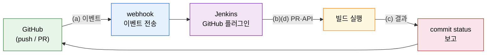
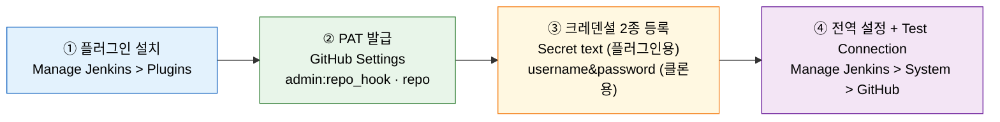

# GitHub 연동 — 플러그인·PAT·웹훅

---

> 이 문서를 읽고 나면 GitHub 플러그인이 여는 4가지 기능을 **설명하고**, PAT 스코프 두 가지가 각각 무엇을 허용하는지 **구분하며**, secret text와 username&password 크레덴셜을 언제 쓰는지 **선택**하고, 설정 후 Test Connection으로 연결을 **검증**할 수 있습니다.

## 사전 지식

Jenkins Credentials 개념과 Manage Jenkins 화면의 구조를 알고 있으면 좋습니다. 크레덴셜 상세 동작은 `../02_security/README.md`에서 다룹니다. GitHub 계정과 저장소가 준비되어 있으면 이 편의 설정 절차를 바로 따라할 수 있습니다.

## 진입 — 왜 Jenkins를 VCS에 연결하는가

> GitHub에 코드를 올리면 빌드가 자동으로 시작되는 배선을 Jenkins 쪽에서 만드는 작업이 바로 이 편의 내용입니다.

많은 개발자가 "GitHub에 push하면 CI가 돈다"는 결과에는 익숙합니다. 그런데 그 연결을 실제로 만드는 것은 Jenkins의 GitHub 플러그인입니다. 플러그인이 없으면 Jenkins는 GitHub에서 무슨 일이 일어났는지 알 방법이 없고, GitHub도 Jenkins에 무엇을 알려야 할지 모릅니다. 이 편에서는 플러그인 설치부터 인증 토큰 생성, 크레덴셜 등록, 전역 설정까지 네 단계를 순서대로 다룹니다.

## 1. GitHub 플러그인이 여는 4가지 기능

> GitHub 플러그인은 webhook 수신·PR 통합·빌드 상태 보고·GitHub API 연동 네 가지를 한꺼번에 활성화합니다.

> 이미 아는 "초인종 배선"의 CI 판입니다. webhook은 초인종(이벤트 알림), 플러그인은 배선과 수신기 역할을 합니다.

GitHub 플러그인을 설치하면 Jenkins에서 다음 네 가지 능력이 열립니다.

| 기능 | 동작 |
|------|------|
| (a) webhook 수신 | push·PR 생성·브랜치 생성 등 이벤트가 발생하면 GitHub가 Jenkins 잡을 트리거합니다 |
| (b) PR 통합 | PR 브랜치를 빌드·검증하고 결과를 PR에 피드백합니다 |
| (c) 빌드 상태 보고 | 빌드·테스트 결과(성공·실패)를 GitHub 커밋 UI에 표시합니다 |
| (d) GitHub API 연동 | PR 코멘트 작성, commit status 설정 등 GitHub API를 Jenkins 파이프라인에서 호출합니다 |

이 비유는 "초인종이 울려도 문(파이프라인)을 열 권한(크레덴셜)이 따로 필요하다"는 지점에서 깨집니다. 플러그인이 webhook 이벤트를 받더라도, 실제로 저장소를 클론하거나 GitHub API를 호출하려면 인증 토큰이 별도로 있어야 합니다. 그 토큰을 어떻게 만들고 어디에 두는지가 2절과 3절의 내용입니다.

## 2. GitHub 플러그인과 Personal Access Token

> GitHub 플러그인을 설치하고, 두 스코프(admin:repo_hook·repo)를 포함한 PAT를 발급하는 것이 연동의 첫 단추입니다.

### 플러그인 설치

Manage Jenkins > Plugins > Available plugins 탭에서 "GitHub"을 검색한 뒤 설치합니다. Jenkins UI 경로는 책(Learning Continuous Integration with Jenkins 3e) 기준이며, GitHub이나 Jenkins 버전에 따라 메뉴 위치가 바뀔 수 있습니다.

플러그인 설치 후 재시작 없이 바로 쓰려면 "Install without restart"를 선택합니다. 플러그인이 올바르게 설치되면 Manage Jenkins > System 화면에 "GitHub" 섹션이 새로 나타납니다.

### Personal Access Token

아이디와 비밀번호 대신 PAT(Personal Access Token)를 쓰는 이유는 크레덴셜을 분리해 관리할 수 있기 때문입니다. PAT는 스코프(허용 권한)를 세밀하게 지정할 수 있고, 만료 시점을 독립적으로 설정하며, 노출됐을 때 주 계정 비밀번호를 바꾸지 않고 해당 토큰만 폐기할 수 있습니다.

PAT는 GitHub Settings > Developer settings > Personal access tokens에서 생성합니다. Jenkins GitHub 연동에는 다음 두 스코프가 필요합니다(출처: docs.github.com/en/authentication/keeping-your-account-and-data-secure/managing-your-personal-access-tokens).

| 스코프 | 허용 범위 |
|--------|----------|
| `admin:repo_hook` | 저장소 webhook 생성·수정·삭제 — Jenkins가 webhook을 자동으로 관리하려면 필수입니다 |
| `repo` | 저장소 전체 read/write — 클론·fetch·브랜치·PR 관리에 필요합니다 |

Expiration은 "No expiration"을 선택하지 않는 것이 권장입니다. 의미 있는 Note(예: "jenkins-integration")를 입력하면 나중에 용도를 식별하기 쉽습니다. 토큰 값은 생성 직후 한 번만 화면에 표시되므로 즉시 복사해 두어야 합니다.

이 비유를 출입증으로 생각하면 기억하기 쉽습니다. PAT는 특정 문(스코프)만 열 수 있는 임시 카드입니다. 카드를 분실하더라도 그 카드만 폐기하면 되고, 주 계정(마스터 열쇠)은 안전하게 유지됩니다.

## 3. 크레덴셜 2종 — secret text vs username&password

> 같은 PAT를 두 가지 크레덴셜 타입으로 나눠 등록하는 이유는, 플러그인 인증과 저장소 클론이 서로 다른 타입을 요구하기 때문입니다.

> 이미 아는 "비밀번호를 코드에 박지 않고 Jenkins Credentials에 둔다"의 GitHub 연동 버전입니다.

같은 PAT 값을 두 개의 크레덴셜로 등록해야 하는 이유가 처음에는 낯설게 느껴집니다. GitHub 플러그인과 파이프라인 잡이 서로 다른 방식으로 인증하기 때문입니다.

| 크레덴셜 타입 | 쓰임 | 비고 |
|--------------|------|------|
| Secret text | GitHub 플러그인이 webhook 관리·API 호출에 사용합니다 | 플러그인 전역 설정의 Credentials 항목에 선택합니다 |
| Username with password | 파이프라인·멀티브랜치 잡이 저장소를 **클론**할 때 사용합니다 | Username은 임의 값, Password 항목에 PAT를 입력합니다 |

GitHub 플러그인은 API 토큰을 "비밀 문자열"로 취급하므로 Secret text 타입을 요구합니다. 반면 Git 클라이언트(파이프라인의 `checkout scm`)는 HTTPS 프로토콜로 저장소에 접근할 때 사용자명과 비밀번호 쌍을 기대합니다. Secret text로는 이 인증 형식을 충족할 수 없어서 username&password 크레덴셜이 별도로 필요합니다.

대안으로 SSH 키를 쓸 수도 있습니다. GitHub에 SSH 공개키를 등록하고, Jenkins에 "SSH Username with private key" 크레덴셜을 만든 뒤 저장소 URL을 `git@github.com:...` 형식으로 지정하면 됩니다. 이 편은 단순성을 위해 PAT + username&password 방식을 기준으로 설명합니다.

크레덴셜 등록 경로는 Manage Jenkins > Credentials > System > Global credentials (unrestricted) > Add Credentials입니다. 등록 시 지정한 ID가 파이프라인 코드와 플러그인 설정에서 이 크레덴셜을 참조하는 식별자가 됩니다.

## 4. 플러그인 설정과 Test Connection

> 플러그인 설치 → PAT 발급 → 크레덴셜 2종 등록 → 전역 설정 + Test Connection, 이 네 단계를 완료하면 webhook 트리거와 빌드 상태 보고가 열립니다.

### 전역 설정

Manage Jenkins > System 화면에서 GitHub 섹션을 찾습니다. 다음 항목을 채웁니다.

| 항목 | 값 |
|------|-----|
| Name | 이 설정을 식별하는 이름(예: GitHub) |
| API URL | public GitHub는 `https://api.github.com`, GitHub Enterprise는 `https://<호스트>/api/v3/` |
| Credentials | 앞서 등록한 Secret text 크레덴셜 선택 |
| Manage hooks | 체크 — Jenkins가 저장소에 webhook을 자동으로 생성·관리합니다 |

Credentials 항목에서 Secret text 타입 크레덴셜을 선택한 뒤 "Test Connection" 버튼을 클릭합니다. "Credentials verified for user <GitHub 계정명>, rate limit: ..." 형태의 메시지가 나오면 연결이 성공한 것입니다. 연결 실패 시 PAT 스코프 누락이나 API URL 오타를 먼저 확인합니다.

설정이 맞으면 Apply와 Save를 눌러 저장합니다. 이 시점부터 Jenkins는 GitHub API에 접근할 수 있고, Manage hooks가 체크된 상태라면 파이프라인 잡에 저장소를 지정하는 순간 해당 저장소에 webhook을 자동으로 등록합니다.

### 이후 열리는 것

전역 설정이 완료되면 세 가지가 활성화됩니다. 첫째, 파이프라인 잡이나 멀티브랜치 파이프라인에서 GitHub 저장소 URL을 지정하면 push·PR 이벤트에 반응하는 webhook 트리거가 자동으로 붙습니다. 둘째, PR 빌드 결과가 GitHub PR 화면의 체크 표시로 나타납니다. 셋째, 파이프라인 코드에서 `githubNotify` 같은 step으로 commit status를 직접 제어할 수 있습니다. webhook 동작의 상세 내용은 `../05_operations/02-06a.Webhook과%20외부%20연동.md`에서 다룹니다.

## 면접 질문

> 답을 떠올린 뒤 §정답 절에서 같은 번호로 대조하세요.

1. PAT 스코프 `admin:repo_hook`과 `repo`가 각각 허용하는 것은 무엇인가요?
2. 같은 PAT 값인데도 secret text와 username&password 두 가지 크레덴셜로 나눠 등록하는 이유는 무엇인가요?
3. GitHub 통합 4단계(플러그인 설치 → PAT 발급 → 크레덴셜 등록 → 전역 설정)에서 마지막 단계의 검증 방법은 무엇인가요?

### 빈칸 채우기 — GitHub 연동

다음 문장의 빈칸을 채워 보세요.

1. Jenkins가 webhook을 자동으로 생성·관리하려면 PAT에 `______` 스코프가 필요합니다.
2. 파이프라인 잡이 저장소를 클론할 때 사용하는 크레덴셜 타입은 `______` with password입니다.
3. public GitHub의 API URL은 `______`입니다.
4. 플러그인 전역 설정에서 연결이 정상인지 확인하는 버튼은 "Test `______`"입니다.

## 정답

> 위 질문을 스스로 설명해 본 뒤에 펼치세요.

### 정답 1 — PAT 스코프 구분

`admin:repo_hook`은 저장소 webhook을 생성·수정·삭제하는 권한입니다. Jenkins가 "Manage hooks" 옵션으로 webhook을 자동 관리하려면 이 스코프가 반드시 있어야 합니다. `repo`는 저장소 전체에 대한 read/write 권한으로, 저장소 클론·fetch·브랜치 접근·PR 관리에 필요합니다. 두 스코프를 함께 부여해야 webhook 자동 등록과 파이프라인 빌드가 모두 동작합니다.

### 정답 2 — 두 가지 크레덴셜이 필요한 이유

GitHub 플러그인은 API 토큰을 비밀 문자열로 취급하므로 Secret text 타입의 크레덴셜을 요구합니다. 반면 파이프라인의 `checkout scm`이 사용하는 Git HTTPS 인증은 사용자명과 비밀번호 쌍을 기대하므로 username&password 타입이 필요합니다. Secret text로는 Git HTTPS 인증 형식을 충족할 수 없어서, 같은 PAT 값이더라도 두 타입으로 나눠 등록해야 합니다.

### 정답 3 — 마지막 단계 검증

Manage Jenkins > System > GitHub 섹션에서 Name·API URL·Credentials(Secret text)·Manage hooks를 입력한 뒤 "Test Connection" 버튼을 클릭합니다. "Credentials verified for user <GitHub 계정명>, rate limit: ..." 메시지가 나오면 Jenkins가 해당 PAT로 GitHub API에 정상 접근할 수 있다는 뜻입니다. 그 뒤 Apply와 Save로 저장합니다.

### 빈칸 정답 — GitHub 연동

1. `admin:repo_hook` — 이 스코프가 있어야 Jenkins가 저장소에 webhook을 자동으로 등록합니다.
2. `username` — username with password 타입의 Password 항목에 PAT를 입력합니다.
3. `https://api.github.com` — GitHub Enterprise는 `https://<호스트>/api/v3/`를 씁니다.
4. `Connection` — "Test Connection" 버튼으로 API 접근 가능 여부를 확인합니다.

## 관련 문서

> 플러그인 설정 이후 webhook이 실제로 어떻게 동작하는지, 크레덴셜을 어떻게 안전하게 관리하는지는 아래 문서에서 이어집니다.

- [06-00.점검.핵심%20질문과%20답%20%28계획%C2%B7배포%29.md](06-00.점검.핵심%20질문과%20답%20%28계획%C2%B7배포%29.md) § "핵심 질문" — 이 장 전체를 Q&A로 자가 점검합니다
- [../02_security/README.md](../02_security/README.md) § "크레덴셜" — Jenkins Credentials 타입과 안전한 관리 원칙을 다룹니다
- [../05_operations/02-06a.Webhook%EA%B3%BC%20%EC%99%B8%EB%B6%80%20%EC%97%B0%EB%8F%99.md](../05_operations/02-06a.Webhook%EA%B3%BC%20%EC%99%B8%EB%B6%80%20%EC%97%B0%EB%8F%99.md) § "webhook 동작" — GitHub webhook이 Jenkins 잡을 트리거하는 상세 흐름을 설명합니다
