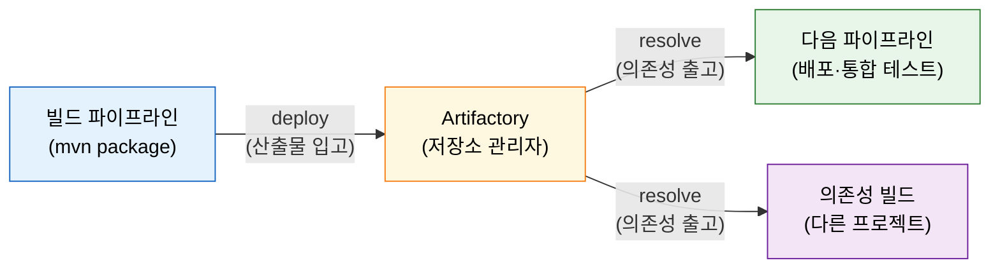
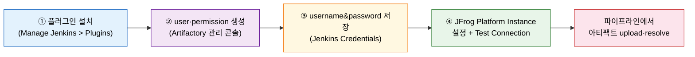

# Artifactory 연동 — 아티팩트 저장소

---

> 이 문서를 읽고 나면 아티팩트 저장소가 CI에 필요한 이유를 **설명하고**, Artifactory를 Helm으로 배포하는 흐름을 **예측**하며, user·permission과 크레덴셜을 **구분**하고, JFrog 플러그인 설정을 **검증**할 수 있습니다.


## 사전 지식

Jenkins 파이프라인의 빌드 산출물(jar, Docker 이미지) 개념을 알고 있으면 좋습니다. Kubernetes Helm 기본 사용법(`06-03.IaC로 Jenkins 배포 — Terraform·JCasC·Helm`)과 Nginx Ingress 구성 방식을 떠올릴 수 있으면 §2의 배포 흐름이 더 빠르게 읽힙니다.


## 진입 — 왜 아티팩트 저장소가 필요한가

> 빌드 산출물을 어디에 두고, 누가 어떤 권한으로 꺼내 쓰는지를 관리하는 층이 없으면 CI 파이프라인의 재현성이 흔들립니다.

Maven Central이나 Docker Hub에서 의존성을 매번 직접 받으면 외부 네트워크 상태와 버전 변동에 CI가 노출됩니다. 빌드 산출물을 파이프라인 간에 공유하려면 어딘가에 보관해야 하는데, 로컬 파일시스템은 에이전트가 달라지면 접근할 수 없습니다. 이 두 문제를 해결하는 것이 아티팩트 저장소 관리자(repository manager)입니다. Artifactory는 JFrog가 제공하는 오픈소스(OSS)·상용(Pro) 저장소 관리자로, 빌드 산출물 입고(deploy)와 의존성 출고(resolve)를 권한에 따라 통제합니다. 같은 역할을 하는 Sonatype Nexus도 널리 쓰이지만, 이 편은 책(Learning Continuous Integration with Jenkins 3e) 기준인 Artifactory를 다룹니다.


## 1. 왜 아티팩트 저장소가 필요한가

> 빌드 산출물 입고·의존성 출고를 권한으로 통제하는 창고 관리인 역할을 합니다.

> 이미 아는 "빌드하면 jar나 이미지가 나온다"의, **그 산출물을 어디에 두고 어떻게 다시 쓰느냐**는 측면입니다.

빌드가 성공하면 jar, war, Docker 이미지 같은 산출물이 생성됩니다. 이 산출물을 다음 파이프라인(배포, 통합 테스트)에서 쓰려면 모든 에이전트가 접근할 수 있는 공유 저장소가 필요합니다. Artifactory는 이 역할을 창고 관리인에 비유할 수 있습니다. 입고(deploy)는 빌드 파이프라인이 산출물을 Artifactory에 올리는 작업이고, 출고(resolve)는 다음 파이프라인이나 의존성 빌드가 Artifactory에서 파일을 내려받는 작업입니다. 창고 관리인은 누가 어떤 물건을 들여오고 내보낼 수 있는지를 권한에 따라 통제합니다.

비유의 한계도 분명합니다. 창고는 보관과 권한만 담당합니다. 산출물의 품질(테스트 통과 여부, 코드 커버리지, 정적 분석)은 앞단 파이프라인과 SonarQube 같은 도구의 책임입니다. Artifactory에 올라간 파일이 안전한 파일인지는 Artifactory가 판단하지 않습니다.



Artifactory가 제공하는 핵심 이점은 세 가지입니다. 첫째, Maven·Gradle 의존성을 Artifactory가 프록시해 캐시하면 외부 네트워크 장애 시에도 빌드가 가능합니다. 둘째, 빌드 산출물을 버전 단위로 보관해 에이전트가 달라져도 동일한 산출물을 재사용할 수 있습니다. 셋째, user·permission 체계로 누가 어떤 저장소에 무엇을 할 수 있는지를 세밀하게 제어합니다.


## 2. Artifactory Helm 배포(OSS) + Ingress

> Helm chart로 K8s에 배포하되 내장 nginx·ingress를 끄고 클러스터 공통 Nginx Ingress Controller를 사용합니다.

예시는 책(Learning Continuous Integration with Jenkins 3e)의 Azure AKS 기준입니다. GCP GKE나 AWS EKS도 동일 Helm chart와 대응 클라우드 프로바이더를 사용합니다. JFrog 공식 Helm chart(`jfrog/artifactory`)는 Pro 버전이 기본이며, OSS는 별도 chart(`jfrog/artifactory-oss`)를 사용하거나 트라이얼 라이선스로 Pro chart를 평가할 수 있습니다.

Artifactory는 `artifactory` 네임스페이스에 배포하며, Jenkins·SonarQube와 같은 클러스터 안의 다른 네임스페이스에 위치합니다. 내장 nginx(`artifactory.nginx.enabled=false`)와 내장 ingress(`artifactory.ingress.enabled=false`)를 끄고, 클러스터에 이미 설치된 Nginx Ingress Controller를 공유합니다.

```bash
# JFrog Helm 레포 추가
helm repo add jfrog https://charts.jfrog.io
helm repo update

# Artifactory 설치 — 내장 nginx·ingress를 끄고 클러스터 공통 Nginx Ingress 사용
# OSS는 jfrog/artifactory-oss, Pro 트라이얼은 jfrog/artifactory
helm upgrade --install artifactory \
  --set artifactory.nginx.enabled=false \
  --set artifactory.ingress.enabled=false \
  -n artifactory \
  --create-namespace \
  jfrog/artifactory
```

Ingress 리소스는 별도로 선언합니다. 포트 8082는 Artifactory 기본 서비스 포트이며, `proxy-body-size 2g` 애너테이션은 큰 아티팩트(Docker 이미지 레이어, fat jar) 업로드를 허용하기 위한 설정입니다. 이 값을 설정하지 않으면 Nginx 기본 제한(1m)에 걸려 413 Request Entity Too Large 에러가 발생합니다.

```yaml
apiVersion: networking.k8s.io/v1
kind: Ingress
metadata:
  name: artifactory-ingress
  namespace: artifactory
  annotations:
    kubernetes.io/ingress.class: nginx
    # 큰 아티팩트 업로드 허용 — 기본 1m 제한을 2g로 올린다
    # 설정 누락 시 Docker 이미지나 fat jar 업로드가 413으로 실패한다
    nginx.ingress.kubernetes.io/proxy-body-size: "2g"
spec:
  rules:
    - host: artifactory.example.com
      http:
        paths:
          - path: /
            pathType: Prefix
            backend:
              service:
                name: artifactory
                port:
                  number: 8082
```

배포 후 `https://artifactory.example.com`으로 접근하면 초기 로그인 화면이 나타납니다. 초기 자격증명은 admin / password이며, 첫 로그인 후 반드시 변경해야 합니다.


## 3. user·permission + username&password 크레덴셜

> Artifactory 내부 user와 permission을 최소 권한으로 구성하고, Jenkins 크레덴셜에 username&password 타입으로 저장합니다.

> 이미 아는 "최소 권한"의 **Artifactory판**입니다. 누가 어떤 저장소에 무엇을 할 수 있는지를 user와 permission 두 단계로 분리합니다.

**내부 user 생성** 경로는 Administration > User Management > Users > New User입니다(책 기준 UI이며 JFrog UI는 변동 가능합니다). username은 `jenkins` 같은 서비스 계정명, password와 email을 입력합니다. Roles와 그룹은 모두 해제해 최소 권한 원칙을 지킵니다. 그룹이나 역할을 통해 의도치 않은 권한이 상속되는 것을 방지하기 위해서입니다.

**permission 생성** 경로는 Administration > Security > Permissions > New Permission입니다. 설정 항목은 다음과 같습니다.

| 항목 | 설정값 | 설명 |
|------|--------|------|
| Resources | Any Local / Remote / Distribution Repository | 대상 저장소 범위 |
| Users | jenkins (앞서 만든 user) | 권한을 부여할 주체 |
| 권한 체크 | Read, Annotate, Deploy/Cache | 최소 3종만 선택 |

Read는 산출물 조회, Deploy/Cache는 산출물 입고에 해당합니다. Annotate는 프로퍼티 태그 설정 권한으로, Maven 메타데이터 갱신에 필요합니다. Delete·Manage 같은 권한은 선택하지 않아 실수로 산출물이 삭제되는 상황을 방지합니다.

창고 출입 권한증 비유로 정리하면, user는 "출입증을 발급받는 사람", permission은 "어떤 창고에서 무엇을 할 수 있는지 명시한 권한 내용"입니다. permission 없는 user는 아무 창고에도 들어갈 수 없고, user 없는 permission은 실제로 누구에게도 적용되지 않습니다.

**Jenkins 크레덴셜 저장** 경로는 Manage Jenkins > Credentials > System > Global credentials > Add Credentials입니다. Kind를 Username with password로 선택하고, Username에 Artifactory user명(`jenkins`), Password에 그 비밀번호를 입력합니다. ID는 `artifactory-credentials` 같이 파이프라인에서 참조할 이름으로 지정합니다.


## 4. JFrog 플러그인 설정 + Test Connection

> 플러그인 설치 → user·permission 생성 → 크레덴셜 저장 → JFrog Platform Instance 설정 네 단계를 순서대로 완료해야 파이프라인에서 아티팩트를 업로드·다운로드할 수 있습니다.

**플러그인 설치**는 Manage Jenkins > Plugins > Available plugins에서 `Artifactory`를 검색해 JFrog Artifactory Plugin을 설치합니다. 재시작 없이 설치할 수도 있지만, 설정 화면이 표시되지 않으면 Jenkins 재시작을 권장합니다.

**JFrog Platform Instance 설정** 경로는 Manage Jenkins > System > JFrog 섹션입니다. `Use the Credentials Plugin` 체크박스를 활성화한 뒤 Add JFrog Platform Instance 버튼을 누릅니다.

| 필드 | 입력값 |
|------|--------|
| Instance ID | `artifactory-server` (파이프라인에서 참조할 ID) |
| JFrog Platform URL | `https://artifactory.example.com` |
| Default Deployer Credentials | §3에서 저장한 username&password 크레덴셜 선택 |

입력 후 **Test Connection** 버튼을 눌러 `Found Artifactory <버전>` 같은 성공 메시지를 확인합니다. 실패하면 URL, 크레덴셜, 네트워크(Ingress 설정, proxy-body-size) 순으로 점검합니다.



네 단계가 완료되면 Declarative Pipeline에서 `rtUpload`·`rtDownload` step을 사용해 빌드 산출물을 Artifactory에 올리거나, Artifactory를 Maven/Gradle의 의존성 저장소로 지정해 프록시 캐시를 활용할 수 있습니다. 파이프라인 안에서는 Instance ID(`artifactory-server`)로 설정을 참조하므로, 서버 URL이 바뀌어도 Instance 설정만 수정하면 모든 파이프라인에 자동 반영됩니다.


## 면접 질문

> 답을 떠올린 뒤 §정답 절에서 같은 번호로 대조하세요.

1. Artifactory Helm 배포 시 `artifactory.nginx.enabled=false`로 내장 nginx를 끄는 이유는 무엇인가요?
2. Artifactory 내부 user를 생성할 때 그룹과 롤을 모두 해제하는 이유는 무엇인가요?
3. Ingress에 `proxy-body-size: 2g` 애너테이션을 설정하지 않으면 어떤 증상이 발생하나요?

### 빈칸 채우기 — Artifactory 연동

다음 문장의 빈칸을 채워 보세요.

1. Artifactory Ingress에서 Artifactory 서비스 포트는 `______`입니다.
2. Artifactory user에게 부여할 최소 권한 3종은 Read, Annotate, `______`입니다.
3. 내장 nginx를 끄는 Helm set 플래그는 `artifactory.nginx.______=false`입니다.
4. Jenkins 크레덴셜 타입은 `username&______`입니다.


## 정답

> 위 질문을 스스로 설명해 본 뒤에 펼치세요.

### 정답 1 — 내장 nginx를 끄는 이유

Helm chart에 포함된 내장 nginx는 단독 배포 시 편리하지만, 클러스터에 이미 Nginx Ingress Controller가 공유 인프라로 설치되어 있으면 불필요한 중복입니다. 내장 nginx를 그대로 두면 포트 충돌, 라우팅 혼선, 자원 낭비가 발생할 수 있습니다. `artifactory.nginx.enabled=false`로 끄고 클러스터 공통 Ingress Controller를 사용하면 Jenkins·SonarQube·Artifactory가 하나의 진입점을 공유하므로 TLS 인증서 관리와 라우팅 규칙을 한 곳에서 통제할 수 있습니다.

### 정답 2 — 그룹·롤 해제 이유

그룹과 롤을 통해 예상치 못한 권한이 상속될 수 있습니다. 서비스 계정(`jenkins`)이 관리자 그룹에 속하면 delete·manage 권한까지 딸려오고, 실수로 저장소를 삭제하거나 설정을 바꾸는 사고로 이어질 수 있습니다. 그룹과 롤을 해제하고 permission을 직접 연결하면 Jenkins 파이프라인이 실제로 필요한 Read·Annotate·Deploy/Cache 세 가지만 갖게 되어 최소 권한 원칙을 지킬 수 있습니다.

### 정답 3 — proxy-body-size 미설정 증상

Nginx 기본 업로드 제한은 1 MiB입니다. Docker 이미지 레이어나 fat jar처럼 수백 MiB에 달하는 아티팩트를 Artifactory에 올리려 하면 Nginx가 요청을 차단하고 `413 Request Entity Too Large` 에러를 반환합니다. 빌드는 성공했는데 deploy 단계에서 413으로 실패하는 패턴으로 나타납니다. `proxy-body-size: 2g` 애너테이션은 이 제한을 2 GiB로 올려 대용량 아티팩트 업로드를 허용합니다.

### 빈칸 정답 — Artifactory 연동

1. `8082` — Artifactory 서비스 기본 포트이며, Ingress backend port에 명시합니다.
2. `Deploy/Cache` — 산출물 입고(deploy)와 원격 저장소 캐시(cache)를 허용하는 권한입니다.
3. `enabled` — `artifactory.nginx.enabled=false`로 내장 nginx를 비활성화합니다.
4. `password` — Kind를 `Username with password`로 선택해 Artifactory 자격증명을 저장합니다.


## 관련 문서

> 같은 06_infra 장의 배포·연동 편과, 권한·시크릿 관리 원칙을 함께 보면 Artifactory 운영 맥락이 단단해집니다.

- [06-00. 점검.핵심 질문과 답 (계획·배포)](06-00.점검.핵심%20질문과%20답%20%28계획%C2%B7%EB%B0%B0%ED%8F%AC%29.md) § "핵심 질문" — 이 장 전체를 Q&A로 자가 점검
- [06-03. IaC로 Jenkins 배포 — Terraform·JCasC·Helm](06-03.IaC%EB%A1%9C%20Jenkins%20%EB%B0%B0%ED%8F%AC%20%E2%80%94%20Terraform%C2%B7JCasC%C2%B7Helm.md) § "K8s Helm 배포" — Helm chart 설치와 Ingress 구성 기반
- [../02_security/README.md](../02_security/README.md) — 최소 권한 원칙·시크릿 관리 전략 개요
- [../02_security/01-02.시크릿 관리와 최소 권한 원칙](../02_security/01-02.%EC%8B%9C%ED%81%AC%EB%A6%BF%20%EA%B4%80%EB%A6%AC%EC%99%80%20%EC%B5%9C%EC%86%8C%20%EA%B6%8C%ED%95%9C%20%EC%9B%90%EC%B9%99.md) § "최소 권한" — Artifactory user 권한 설계의 원칙적 근거
