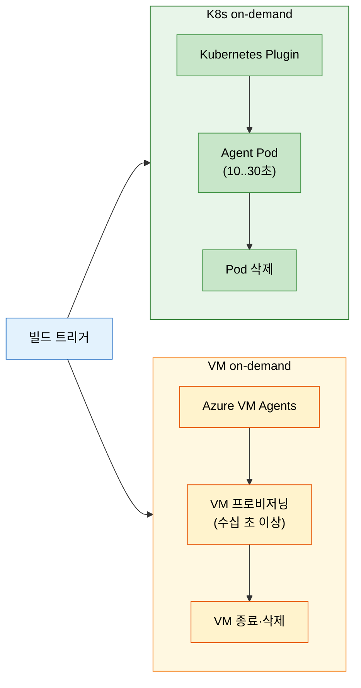
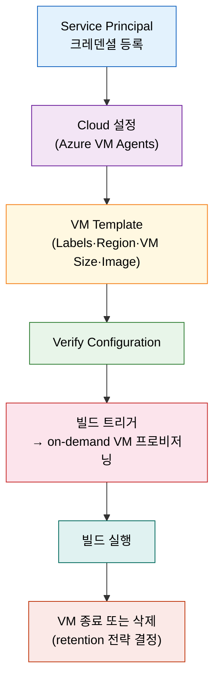

# 클라우드 VM 동적 Agent — Azure VM Agents 플러그인

---

> 이 문서를 읽고 나면 VM 기반 동적 agent가 K8s on-demand와 어떻게 다른지 **구분하고**, Azure service principal 인증 흐름을 **설명하며**, 3가지 retention 전략을 상황에 맞게 **선택**하고, 이미지 캐싱·managed disk 최적화가 막는 비용 증상을 **예측**할 수 있습니다.

## 사전 지식

K8s 동적 agent의 Pod on-demand 흐름(`../03_agent/01-01.실행환경으로서의 Agent.md` §3)을 알고 있으면 이 편의 "VM판"이 빠르게 읽힙니다. Jenkins master-agent 아키텍처와 Label 기반 라우팅 개념도 전제합니다. Azure 기초(구독·리소스 그룹·IAM)를 잠깐 훑어 두면 service principal 절이 더 매끄럽게 연결됩니다.

## 진입 — 클라우드가 빌드마다 VM을 띄우고 버린다

> K8s가 빌드마다 Pod를 띄우고 버리듯, 클라우드 VM 동적 agent는 빌드마다 VM을 띄우고 버립니다. 차이는 기동 속도, 격리 수준, 그리고 레거시 호환성에 있습니다.

Jenkins의 동적 agent 전략은 두 갈래입니다. 하나는 Kubernetes Plugin이 Pod를 프로비저닝하는 방식이고, 다른 하나는 Azure VM Agents 같은 클라우드 플러그인이 가상 머신 자체를 프로비저닝하는 방식입니다. 두 방식 모두 "빌드가 없을 때는 자원을 반납하고, 빌드가 시작될 때 새 실행 환경을 만든다"는 원리를 공유합니다. 그러나 실행 환경의 단위가 Pod냐 VM이냐에 따라 기동 속도, 격리 수준, 호환 워크로드가 크게 갈립니다. 이 편은 VM 방식을 선택해야 하는 이유와 Azure VM Agents 플러그인의 구체적인 설정을 다룹니다.

## 1. 왜 VM 동적 Agent인가 — K8s on-demand와의 갈림길

> 컨테이너화하기 어려운 워크로드, 완전한 OS 격리가 필요한 환경에서 VM 동적 agent가 K8s on-demand의 대안이 됩니다.

K8s on-demand는 컨테이너 이미지를 실행 환경으로 삼습니다. 빌드 도구를 이미지에 패키징하고, Pod가 뜨면 빌드하고, 끝나면 삭제합니다(`../03_agent/01-01.실행환경으로서의 Agent.md` §3). 이 흐름의 VM 버전은 클라우드가 가상 머신 인스턴스를 프로비저닝하고, Jenkins agent 프로세스를 그 위에서 구동하며, 빌드가 끝나면 VM을 삭제하거나 종료합니다.

K8s Pod는 초 단위로 뜨고, VM은 부팅·에이전트 설치 과정 때문에 수십 초에서 몇 분이 걸립니다. 이 차이가 있어도 VM을 선택하는 이유는 K8s가 채울 수 없는 워크로드가 있기 때문입니다.

VM 동적 agent가 강점을 갖는 상황은 두 가지입니다. 첫째, 컨테이너화가 어려운 Windows 빌드입니다. Windows Server를 VM으로 띄우면 .NET Framework, COM 컴포넌트, 레지스트리 의존 앱처럼 컨테이너 안에서 돌리기 복잡한 워크로드를 그대로 실행할 수 있습니다. 둘째, 완전한 OS 격리가 필요한 보안 요구사항입니다. 컨테이너는 커널을 공유하지만, VM은 하이퍼바이저 경계로 격리됩니다. 규정상 빌드 환경 간 커널 공유를 허용하지 않는 경우라면 VM이 유일한 선택지입니다.

반면 K8s on-demand는 경량·빠른 기동·cloud-native 워크로드에서 VM보다 유리합니다. 이미지 캐시가 갖춰지면 10~30초 안에 준비되고, Kubernetes 스케줄러가 자원을 효율적으로 분배합니다.

| 항목 | K8s on-demand (Pod) | VM on-demand |
|------|--------------------|-----------------------------|
| 기동 속도 | 10~30초 (이미지 캐시 전제) | 수십 초~수 분 (VM 부팅 포함) |
| 격리 수준 | 커널 공유 (네임스페이스) | 하이퍼바이저 경계 완전 격리 |
| Windows·레거시 호환 | 제한적 | 완전 지원 |
| 비용 단위 | vCPU 초 단위 | VM 인스턴스 단위 |
| 관리 복잡도 | K8s 클러스터 지식 필요 | VM 이미지·스냅샷 관리 필요 |

VM은 기동이 느린 대신 완전한 사무실을 매번 차리는 것과 같습니다. 컨테이너가 즉석 부스를 조립하는 것이라면, VM은 건물 자체를 세우는 과정입니다. 준비 시간은 길지만 그 안에서 무엇이든 할 수 있습니다. 다만 이 비유는 기동 시간과 호환성 축만 설명합니다. 비용·격리 특성은 워크로드마다 달라지므로 실측이 필요합니다.

AWS EC2 Fleet Plugin, Google Compute Engine Plugin 같은 다른 클라우드 벤더의 대응 플러그인도 동일한 원리로 동작합니다. 이 편은 구체적인 설정을 Azure VM Agents 기준으로 다루지만, 핵심 개념은 벤더 중립적으로 적용됩니다.

## 2. Azure service principal 인증

> Jenkins가 Azure 자원을 프로비저닝하려면 비인간 ID인 service principal을 통해 구독에 인증해야 합니다. 이미 아는 "토큰으로 외부 도구 인증(06-04~06)"의 클라우드 자원 버전입니다.

Jenkins가 Azure에 VM을 생성하려면 Azure 구독에 접근할 권한이 필요합니다. 사람이 Azure 포털에 로그인하는 것처럼, 자동화 도구에는 비인간 ID가 필요합니다. 이것이 **service principal**입니다. service principal은 특정 권한 범위 안에서 Azure 자원에 접근하는 애플리케이션 ID입니다. 사람 계정 대신 앱이 제한된 권한으로 Azure 자원에 접근하는 대리 발급 신분증에 해당합니다.

service principal 생성 절차는 Azure 포털 기준으로 다음과 같습니다(UI 경로는 책 *Learning Continuous Integration with Jenkins* 3e 기준이며, Azure 포털 UI는 변동될 수 있습니다).

1. Azure Active Directory > App registrations > New registration — 애플리케이션을 등록합니다.
2. 등록된 앱의 Overview에서 **Application (client) ID**와 **Directory (tenant) ID**를 복사합니다.
3. Certificates & secrets > New client secret — **Client Secret**을 생성합니다. 생성 직후에만 값이 보이므로 즉시 복사합니다.
4. Azure 구독 > Access control (IAM) > Add role assignment — 이 service principal에 **Contributor** 역할을 할당합니다. Contributor는 VM 생성·삭제를 포함한 자원 관리 권한을 부여합니다.

Jenkins 크레덴셜 등록은 Manage Jenkins > Credentials > Add Credentials에서 Kind를 **Azure Service Principal**로 선택하고 아래 네 필드를 채웁니다.

| 필드 | 값 |
|------|----|
| Subscription ID | Azure 구독의 Subscription ID |
| Client ID | App registration의 Application (client) ID |
| Client Secret | 생성한 client secret 값 |
| Tenant ID | App registration의 Directory (tenant) ID |

Verify Service Principal 버튼으로 인증이 정상인지 확인합니다. 연결에 성공하면 Jenkins가 이 크레덴셜로 해당 구독 안의 자원을 프로비저닝할 수 있게 됩니다.

## 3. Cloud·VM template 설정

> service principal로 Azure 연결을 확인했으면, cloud 설정과 VM template 두 단계로 동적 agent 프로비저닝 규칙을 선언합니다.

플러그인이 설치된 뒤 Manage Jenkins > Nodes and Clouds > Clouds > Add a new cloud > **Azure VM Agents**를 선택합니다(UI 경로는 책 기준, Azure VM Agents 플러그인 버전에 따라 화면이 다를 수 있습니다).

### Cloud 공통 설정

| 항목 | 설명 |
|------|------|
| Cloud Name | 이 cloud 설정의 식별자 |
| Azure Credentials | 앞 절에서 등록한 service principal 크레덴셜 선택 |
| Max Jenkins Agents | 이 cloud가 동시에 프로비저닝할 VM 수 상한 |
| Deployment Timeout | VM 프로비저닝 대기 최대 시간 (분) |
| Resource Group | VM이 생성될 리소스 그룹 (신규 생성 또는 기존 선택) |

Verify Configuration 버튼을 눌러 cloud 연결이 정상인지 확인합니다.

### VM template 설정

VM template은 어떤 VM을 어떻게 만들지를 선언합니다. 한 cloud 설정에 복수의 VM template를 등록할 수 있으며, 각 template의 **Labels** 값이 파이프라인의 `agent { label '...' }`과 매칭됩니다.

| 항목 | 설명 |
|------|------|
| Labels | 이 template으로 생성된 VM agent의 Jenkins label |
| Admin Credentials | VM OS 로그인 자격증명 (username/password 또는 SSH) |
| Agent Workspace | agent 프로세스가 사용할 작업 디렉토리 경로 |
| Region | VM이 생성될 Azure 리전 |
| Availability | 빌드 agent는 **No infrastructure redundancy required** 권장 — 쓰고 버리는 VM에 가용성 영역 분산 비용을 낼 필요가 없습니다 |
| VM Size | VM 인스턴스 크기 (예: Standard\_D2s\_v3) |
| Managed Disk | Azure가 스토리지를 직접 관리. Unmanaged는 별도 Storage Account를 직접 관리해야 합니다 |
| Image | 기본 제공 Windows Server 2019/2022 또는 Advanced 탭에서 커스텀 이미지 지정 |

managed disk는 Azure가 스토리지의 배치·복제·백업을 처리해 주므로, 별도 Storage Account를 운영할 필요가 없습니다. 동적 agent처럼 짧은 수명의 VM에서는 managed disk가 관리 부담을 낮추는 선택입니다.

## 4. Retention 3전략 + 비용 최적화

> VM은 부팅 비용이 있어서 K8s Pod보다 retention 설계가 더 중요합니다. 세 전략이 각각 다른 비용·재사용 균형을 제공합니다.

VM 동적 agent의 핵심 운영 결정은 **빌드가 끝난 VM을 어떻게 처리하느냐**입니다. K8s의 `podRetention`(never/onFailure/always/evicted)이 Pod 수명을 결정하는 것처럼(`../03_agent/01-01.실행환경으로서의 Agent.md` §3), Azure VM Agents는 세 가지 retention 전략을 제공합니다. Pod와 달리 VM은 기동에 수십 초~수 분이 걸리므로 retention 선택이 비용과 대기 시간 모두에 직접 영향을 줍니다.

### Azure VM Idle Retention Strategy (기본)

빌드가 끝나고 agent가 유휴 상태로 지정 시간(retention time)이 지나면 VM을 삭제하거나 종료합니다. 가장 단순한 전략으로, 빌드 부하가 예측 불가능하거나 비용 최적화가 최우선인 환경에 적합합니다. 유휴 시간이 길면 cold start가 줄지만 비용이 늘고, 짧으면 cold start는 늘지만 비용이 줄어드는 트레이드오프가 있습니다.

### Azure VM Pool Retention Strategy (Experimental)

지정한 수만큼 VM을 미리 프로비저닝해 풀을 유지합니다. retention time이 지나면 기존 VM을 삭제하고 새 VM으로 교체합니다. cloud 또는 template 설정이 변경되면 재프로비저닝이 발생하고, retention time이나 pool 크기 변경은 스케일 조정만 일어납니다. 빌드 요청이 빈번하고 cold start를 허용하기 어려운 환경에서 유용하지만, 풀 크기만큼 항상 VM 비용이 발생합니다.

### Azure VM Once Retention Strategy

agent를 한 번만 사용합니다. job이 완료되면 agent를 offline 상태로 전환하고 suspend합니다. 주기적 cleanup이 실행될 때까지 VM은 유지되며, 완전히 유휴 상태가 되기 전에는 실제 삭제가 일어나지 않습니다. 이 전략을 쓸 때는 **single executor**를 권장합니다. executor가 여럿이면 첫 번째 job이 완료되는 시점에 agent가 offline으로 전환되어, 같은 VM에서 실행 중인 나머지 job들이 중단될 수 있기 때문입니다.

| 전략 | 빌드 후 동작 | 권장 용도 |
|------|-------------|----------|
| Idle Retention | 유휴 시간 후 VM 삭제·종료 | 부하 예측 불가, 비용 우선 |
| Pool Retention | 풀 크기 유지, 주기적 교체 | 빌드 빈번, cold start 최소화 |
| Once Retention | 1회 사용 후 offline·suspend | 격리 필요, 오염 방지 |

### 비용 최적화

VM 동적 agent의 비용 최적화는 두 축에서 이루어집니다.

**이미지 캐싱(image caching)**은 프로비저닝 시간을 단축합니다. 빌드에 필요한 도구(JDK, Maven, Node.js 등)가 사전 설치된 base 이미지를 Azure Compute Gallery(구 Shared Image Gallery)에 저장해 두면, VM이 뜰 때마다 도구를 새로 설치하는 시간을 생략할 수 있습니다. provisioning 시간이 줄면 cold start 체감이 개선되고, agent pool이 더 빠르게 빌드를 받을 수 있습니다.

**managed disk**는 VM이 교체되어도 빌드 캐시(Maven .m2, npm cache 등)를 유지할 수 있도록 영속 스토리지를 제공합니다. 동적 agent는 매번 새 VM이 뜨지만, managed disk를 VM에 재attach하면 의존성 다운로드 비용을 줄일 수 있습니다.

**유휴 agent 종료와 scale-down**은 Idle Retention의 timeout을 짧게 유지하거나, Pool Retention의 풀 크기를 오프-피크 시간대에 줄이는 방식으로 유휴 비용을 억제합니다.

이미지 캐싱 없이 모든 도구를 매 VM 부팅 시 설치하면, 5분짜리 빌드에 3분의 설정 시간이 붙어 실질적인 agent 가동률이 낮아집니다. 이 증상이 보이면 이미지 캐싱을 우선 적용해야 합니다.

## 면접 질문

> 답을 떠올린 뒤 §정답 절에서 같은 번호로 대조하세요.

1. master-agent 모델이 본질적으로 보장하지 못하는 것은 무엇이며, 왜인가요?
2. K8s 기반 agent가 고정 VM agent보다 자원 효율과 탄력성이 높은 이유는 무엇인가요?
3. Once Retention에서 single executor를 권장하는 이유는 무엇인가요?

### 빈칸 채우기 — Azure VM 동적 Agent

다음 문장의 빈칸을 채워 보세요.

1. service principal에 VM 생성 권한을 부여하는 Azure IAM role은 \_\_\_\_ 입니다.
2. 유휴 시간이 지나면 VM agent를 삭제하는 retention 전략은 Azure VM \_\_\_\_ Retention Strategy입니다.
3. 사전 설치된 base 이미지를 재사용해 프로비저닝 시간을 단축하는 최적화는 image \_\_\_\_ 입니다.
4. VM 동적 agent가 K8s 대비 강점을 갖는 워크로드는 \_\_\_\_ 기반 레거시 앱입니다.

## 정답

> 위 질문을 스스로 설명해 본 뒤에 펼치세요.

### 정답 1 — master-agent 모델의 한계

master-agent 모델은 **master(Controller) 자체의 고가용성을 보장하지 못합니다.** agent를 아무리 늘려도 Controller가 단일 장애점으로 남기 때문입니다. Controller가 다운되면 빌드 큐·히스토리·설정이 모두 접근 불가 상태가 됩니다. agent를 수평으로 확장하는 것은 빌드 처리량을 늘리는 해법이지, Controller HA의 해법이 아닙니다. Controller HA는 K8s PVC 영속화, 외부 백업, active-passive 이중화 같은 별도 수단이 필요합니다.

### 정답 2 — K8s agent의 자원 효율·탄력성

K8s 기반 agent는 빌드가 없을 때 Pod가 존재하지 않으므로 vCPU·메모리 자원이 0입니다. 빌드 트리거가 오면 Pod를 즉시 생성하고, 끝나면 삭제합니다. Kubernetes 스케줄러가 클러스터 내 빈 노드를 활용해 Pod를 배치하므로, 빌드 부하가 늘면 노드 수를 자동으로 증가(Cluster Autoscaler)시킬 수 있습니다. 고정 VM agent는 빌드가 없어도 VM이 켜져 있어 비용이 발생하고, 추가 부하에 대응하려면 수동으로 VM을 늘려야 합니다.

### 정답 3 — Once Retention single executor 이유

Once Retention은 job이 완료되는 순간 agent를 offline으로 전환합니다. executor가 여러 개이면 하나의 job이 끝나는 시점에 VM agent 전체가 offline이 되므로, 같은 VM에서 동시에 실행 중이던 나머지 job들이 갑자기 중단됩니다. single executor로 제한하면 VM 위에서 항상 job이 하나만 실행되므로, 그 job이 완료되는 시점이 곧 해당 VM에서의 마지막 작업이 됩니다. offline 전환이 실행 중인 다른 job에 영향을 주지 않습니다.

### 빈칸 정답 — Azure VM 동적 Agent

1. **Contributor** — Azure 구독 IAM에서 Contributor role을 할당하면 VM 생성·삭제를 포함한 자원 관리 권한이 부여됩니다.
2. **Idle** — Azure VM Idle Retention Strategy는 유휴 시간이 지난 agent를 삭제하거나 종료합니다.
3. **caching** — image caching은 도구가 사전 설치된 base 이미지를 재사용해 매 프로비저닝마다 설치 시간을 생략합니다.
4. **Windows** — Windows 기반 레거시 앱은 컨테이너화가 어려워 VM 동적 agent가 강점을 갖습니다.

## 관련 문서

> 같은 06_infra 장의 비교·점검 편과, K8s 동적 agent의 상세 설정을 함께 보면 두 방식의 트레이드오프가 더 선명해집니다.

- [06-00. 점검 — 핵심 질문과 답 (계획·배포)](06-00.%EC%A0%90%EA%B2%80.%ED%95%B5%EC%8B%AC%20%EC%A7%88%EB%AC%B8%EA%B3%BC%20%EB%8B%B5%20%28%EA%B3%84%ED%9A%8D%C2%B7%EB%B0%B0%ED%8F%AC%29.md) § "핵심 질문" — 이 장 전체를 Q&A로 자가 점검
- [06-03. IaC로 Jenkins 배포 — Terraform·JCasC·Helm](06-03.IaC%EB%A1%9C%20Jenkins%20%EB%B0%B0%ED%8F%AC%20%E2%80%94%20Terraform%C2%B7JCasC%C2%B7Helm.md) § "K8s vs VM 선택 기준" — K8s Helm과 VM Terraform 배포 선택 기준
- [06-07. 외부 도구 통합 4단계 비교](06-07.%EC%99%B8%EB%B6%80%20%EB%8F%84%EA%B5%AC%20%ED%86%B5%ED%95%A9%204%EB%8B%A8%EA%B3%84%20%EB%B9%84%EA%B5%90.md) § "인증 패턴" — GitHub·SonarQube·Artifactory 연동과 service principal 인증 비교
- [../03_agent/01-01. 실행환경으로서의 Agent](../03_agent/01-01.%EC%8B%A4%ED%96%89%ED%99%98%EA%B2%BD%EC%9C%BC%EB%A1%9C%EC%84%9C%EC%9D%98%20Agent.md) § "정적 Agent vs 동적 Agent", § "podRetention" — K8s 동적 agent와 정적 agent 대비, Pod retention 정책
- [../03_agent/02-01. Kubernetes Jenkins 구축](../03_agent/02-01.Kubernetes%20Jenkins%20%EA%B5%AC%EC%B6%95.md) § "Kubernetes Plugin 설정" — K8s on-demand agent 구축 단계별 절차
