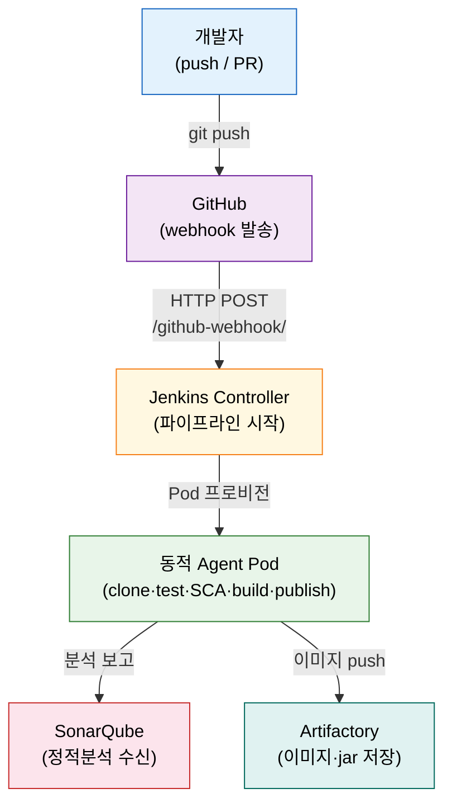

# CI 파이프라인 전체 설계 — 스테이지 순서·Docker 레지스트리·인증

---

> 이 문서를 읽고 나면 CI 파이프라인의 스테이지 순서와 각 단계가 그 자리에 있는 이유를 **설명하고**, webhook→clone→test→SCA→gate→build→publish 흐름을 **설계**하며, Artifactory를 Docker 레지스트리로 쓰는 구성을 **구분**하고, Kaniko가 레지스트리에 인증하는 K8s Secret을 **선택**할 수 있습니다.


## 사전 지식

Jenkins Pipeline의 `stage` 구조와 Declarative 문법 기초를 알고 있으면 좋습니다. 이 편에서 언급하는 개별 도구(SonarQube·Artifactory·Kaniko·GitHub webhook)의 상세 설정은 각 편 링크로 위임하므로, 여기서는 "왜 이 순서인가"를 읽는 것이 목표입니다.


## 진입 — 도구는 알겠는데, 순서가 막막하다

> 개별 step을 알아도 그것을 어떤 순서로 꿰느냐가 CI 설계의 핵심입니다.

SonarQube도 알고, Artifactory도 알고, Kaniko도 압니다. 그런데 막상 전체 파이프라인을 짜려고 하면 막힙니다. "Quality Gate는 Build 앞인가 뒤인가?" "Docker 레지스트리는 Artifactory 그 자체인가 별도 서비스인가?" "Kaniko Pod가 레지스트리에 push하려면 인증을 어디에 두어야 하나?" 이 편은 이 질문들에 순서를 부여합니다. 개별 도구 설정 상세는 기존 편에 위임하고, 이 편은 "큰 그림"에만 집중합니다.


## 1. CI 파이프라인을 설계한다는 것 — 스테이지 순서와 이유

> 이미 아는 개별 step을 *어떤 순서로* 꿰느냐가 설계입니다. 각 단계는 그 자리에 있는 이유가 있습니다.

책(Learning Continuous Integration with Jenkins 3e)은 3-tier 애플리케이션을 위한 CI 파이프라인을 7스테이지로 제시합니다.

| 순서 | 스테이지 | 역할 |
|------|---------|------|
| 1 | Clone | 소스코드 체크아웃 |
| 2 | Unit Test | 단위 테스트 실행 |
| 3 | SCA (정적분석) | SonarQube로 코드 품질·보안 취약점 분석 |
| 4 | Quality Gate | 분석 결과를 기준으로 통과·차단 판정 |
| 5 | Build Docker | tier별 Docker 이미지 빌드 |
| 6 | Publish | 레지스트리(Artifactory)에 이미지 push |
| 7 | Build Info | 빌드 메타데이터 기록 |

각 단계가 그 자리에 있는 이유를 짚어봅니다.

**Clone이 맨 앞인 이유**는 단순합니다. 코드가 없으면 뒤의 모든 단계가 성립하지 않습니다. 소스코드 체크아웃은 파이프라인의 전제 조건입니다.

**Unit Test가 Build 앞에 있는 이유**는 빠른 실패(fast fail) 원칙 때문입니다. 테스트가 깨졌다면 이미지를 빌드하고 패키징하는 자원을 쓸 필요가 없습니다. 테스트 실패를 가장 이른 시점에 잡아 낭비를 막습니다.

**SCA와 Quality Gate가 Build 앞에 있는 이유**가 이 순서의 핵심입니다. 품질 기준을 통과하지 못한 코드가 Docker 이미지로 만들어지는 일을 막기 위해서입니다. 이미지를 먼저 빌드한 뒤 게이트를 두면, 차단되어야 할 코드가 이미 레지스트리에 올라갈 수 있습니다. 검색대(gate)는 탑승구(Build) *앞*에 있어야 의미가 있습니다.

**Quality Gate가 맨 앞에 오면 안 되는 이유** — 책의 오답 분석에서 자주 등장하는 함정입니다. Quality Gate는 SCA 분석 결과를 평가하는 *체크포인트*입니다. 분석이 끝나지 않은 상태에서 게이트를 열 수 없습니다. 반드시 SCA(분석) 이후에 Gate(판정)가 옵니다.

```mermaid
flowchart LR
    CLONE["Clone<br/>(소스코드 체크아웃)"]
    TEST["Unit Test<br/>(테스트 실패 → 즉시 중단)"]
    SCA["SCA<br/>(정적분석)"]
    GATE["Quality Gate<br/>(품질 판정)"]
    BUILD["Build Docker<br/>(tier별 이미지)"]
    PUBLISH["Publish<br/>(레지스트리 push)"]
    INFO["Build Info<br/>(메타데이터)"]

    CLONE --> TEST --> SCA --> GATE --> BUILD --> PUBLISH --> INFO

    style CLONE fill:#e3f2fd,stroke:#1565c0,color:#000
    style TEST fill:#fff8e1,stroke:#f57f17,color:#000
    style SCA fill:#f3e5f5,stroke:#6a1b9a,color:#000
    style GATE fill:#fce4ec,stroke:#c62828,color:#000
    style BUILD fill:#e8f5e9,stroke:#2e7d32,color:#000
    style PUBLISH fill:#e8f5e9,stroke:#1b5e20,color:#000
    style INFO fill:#e0f2f1,stroke:#00695c,color:#000
```



빌드 태그는 Jenkins build number 또는 Git commit hash를 붙입니다. `image:42` 또는 `image:a3f9c2d` 형태로 어느 빌드·커밋이 만든 이미지인지 추적할 수 있습니다. `latest` 태그만 쓰면 이전 이미지를 덮어쓰므로 추적성이 사라집니다.

비유로 정리하면 이 순서는 공항 보안 검색대와 같습니다. 탑승객(코드)이 체크인(clone)하고, 소지품 검사(test)를 거쳐, 정밀 검색(SCA)을 받고, 검색대(Quality Gate)를 통과해야 탑승구(Build·Publish)로 들어갑니다. 검색대를 맨 마지막이나 맨 처음에 두면 아무 의미가 없습니다. 이 비유는 순서와 차단 논리를 설명하지만, 병렬 stage·재시도 설계는 별도로 다루어야 합니다.


## 2. 트리거와 사전 설정 — 무대 세팅

> 파이프라인이 도는 것보다 "무엇이 파이프라인을 시작하는가"와 "무엇을 미리 준비해야 하는가"를 아는 것이 먼저입니다.

**webhook이 트리거**입니다. 개발자가 코드를 push하거나 PR을 열면 GitHub가 Jenkins에 HTTP POST 요청을 보냅니다. Jenkins는 이 요청을 받아 해당 파이프라인을 시작합니다. webhook 설정 상세(payload URL 형식, 이벤트 종류 선택)는 [06-04. GitHub 연동 — 플러그인·PAT·웹훅](06-04.GitHub%20%EC%97%B0%EB%8F%99%20%E2%80%94%20%ED%94%8C%EB%9F%AC%EA%B7%B8%EC%9D%B8%C2%B7PAT%C2%B7%EC%9B%B9%ED%9B%85.md)에서 다룹니다.

파이프라인을 처음 실행하기 전에 준비해야 할 것들을 설계 관점에서 한 줄씩 짚습니다.

| 준비물 | 설계 관점 |
|-------|---------|
| GitHub repo + webhook | push·PR 이벤트가 Jenkins로 전달되는 경로 |
| SonarQube 프로젝트 (project key) | project key는 대소문자를 구분하므로 파이프라인 코드와 정확히 일치시켜야 합니다 |
| Artifactory repo | jar·Docker 이미지를 보관할 저장소 |
| Jenkins 크레덴셜 | SonarQube analysis token, Artifactory 계정을 코드에 박지 않고 ID로 참조 |

소스코드 구성도 미리 고려합니다. 책의 예제는 3-tier Node.js Hello World 앱으로, frontend·backend·db 폴더가 나뉘어 있고 각 tier에 Dockerfile이 있습니다. 의존성은 `package.json`에 명시되고, 테스트는 Mocha/Chai 또는 Jest 같은 프레임워크로 `npm test`로 실행합니다. 파이프라인은 `npm install`로 의존성을 받고 `npm test`로 테스트를 돌립니다. 설계 원칙은 언어에 무관하게 동일하며, 예시가 Node.js인 것은 책 기준입니다.

각 도구의 상세 설정은 다음 편으로 위임합니다. 중복 작성보다 정확한 링크가 낫습니다.




## 3. Artifactory를 Docker 레지스트리로

> [06-06. Artifactory 연동](06-06.Artifactory%20%EC%97%B0%EB%8F%99%20%E2%80%94%20%EC%95%84%ED%8B%B0%ED%8C%A9%ED%8A%B8%20%EC%A0%80%EC%9E%A5%EC%86%8C.md)은 Artifactory를 jar 아티팩트 저장소로 다뤘습니다. 같은 Artifactory가 *Docker 레지스트리*로도 동작합니다.

Artifactory는 한 인스턴스에서 여러 package type을 지원합니다. Maven(jar)·npm·Docker 이미지를 각각 다른 local repo로 나누어 보관할 수 있습니다. CI 파이프라인에서 Docker 이미지를 push·pull하려면 **Docker package type**의 local repo를 생성해야 합니다.

Admin > Repositories > Local > Add Local Repository에서 package type을 **Docker**로 선택합니다(책 기준, UI 경로는 버전에 따라 다를 수 있습니다). **Generic을 선택하면 안 됩니다.** Docker type은 이미지 레이어·매니페스트 구조를 이해하고 push/pull API를 올바르게 처리합니다. Generic은 파일을 그냥 올리는 범용 저장소라 Docker 클라이언트 프로토콜을 지원하지 않습니다(책 Q&A: "Generic을 Docker 레지스트리로 쓸 수 있다" — False).

```groovy
stage('Publish') {
    steps {
        // docker-local: Artifactory에 만든 Docker type local repo 이름
        // build number를 태그로 붙여 어느 빌드가 만든 이미지인지 추적
        sh """
            docker tag myapp:latest \
                artifactory.example.com/docker-local/myapp:${env.BUILD_NUMBER}
            docker push \
                artifactory.example.com/docker-local/myapp:${env.BUILD_NUMBER}
        """
        // latest 태그만 쓰면 이전 이미지를 덮어써 추적성이 사라지므로
        // build number 또는 commit hash 태그를 함께 붙입니다
    }
}
```

tier가 여럿이면 frontend·backend·db 각각을 build number로 태그해 push합니다. 그러면 `frontend:42`·`backend:42`처럼 같은 빌드에서 나온 이미지 세트를 명확히 식별할 수 있습니다. CI/CD 파이프라인이 push·pull하려면 Artifactory 크레덴셜(사용자명·비밀번호)과 repo 이름이 Jenkins 크레덴셜로 등록되어 있어야 합니다. 상세 설정은 [06-06. Artifactory 연동](06-06.Artifactory%20%EC%97%B0%EB%8F%99%20%E2%80%94%20%EC%95%84%ED%8B%B0%ED%8C%A9%ED%8A%B8%20%EC%A0%80%EC%9E%A5%EC%86%8C.md)에서 다룹니다.


## 4. Kaniko가 레지스트리에 인증하는 법 — K8s docker-registry Secret

> 이미 아는 "크레덴셜은 코드에 박지 말고 Secret에"의, **레지스트리 인증**판입니다.

K8s 동적 agent에서 Kaniko는 Docker 데몬 없이 이미지를 빌드합니다(빌드 메커니즘 상세는 [../03_agent/01-03.컨테이너%20이미지%20빌드.md](../03_agent/01-03.%EC%BB%A8%ED%85%8C%EC%9D%B4%EB%84%88%20%EC%9D%B4%EB%AF%B8%EC%A7%80%20%EB%B9%8C%EB%93%9C.md)에서 다룹니다). Kaniko Pod가 빌드한 이미지를 Artifactory에 push하려면 레지스트리 인증이 필요합니다. 이 인증 정보를 K8s **docker-registry Secret**으로 만들어 Kaniko Pod에 마운트합니다.

```bash
kubectl create secret docker-registry artifactory-credentials \
    --docker-server=artifactory.example.com \
    --docker-username=jenkins \
    --docker-password=<비밀번호> \
    --docker-email=jenkins@example.com \
    -n jenkins
# -n jenkins: Secret을 jenkins namespace에 생성
# Kaniko Pod가 jenkins namespace에서 실행되므로 같은 namespace에 두어야 합니다
# artifactory namespace에 만들면 Kaniko Pod가 접근할 수 없습니다
```

**namespace 격리**가 핵심입니다. K8s Secret은 *namespace 범위* 리소스입니다. namespace A에 만든 Secret은 namespace B의 Pod가 접근할 수 없습니다(책 Q&A: "다른 namespace의 Secret에 접근할 수 있다" — False). Kaniko Pod가 `jenkins` namespace에서 도므로 `artifactory-credentials` Secret도 `jenkins` namespace에 두어야 합니다. Artifactory가 `artifactory` namespace에 있다고 해서 Secret도 거기에 두면, Kaniko Pod는 그 Secret을 마운트할 수 없습니다.

비유로 이해하면 창고 출입증은 창고 사무실이 아니라 **작업자 사물함**에 둡니다. 출입증을 쓰는 사람(Kaniko Pod)이 있는 곳에 보관해야 꺼내 쓸 수 있습니다.

파이프라인에서 Kaniko가 이 Secret을 쓰는 방식은 Pod template의 `volumeMounts`에 마운트하는 것입니다.

```groovy
containerTemplate(
    name: 'kaniko'
    , image: 'gcr.io/kaniko-project/executor:latest'
    , command: 'cat'
    , ttyEnabled: true
) {
    // docker-registry Secret을 /kaniko/.docker/config.json 으로 마운트
    // Kaniko가 이 경로를 읽어 레지스트리 인증에 씁니다
    volumeMounts {
        secretVolumeMount(
            secretName: 'artifactory-credentials'
            , mountPath: '/kaniko/.docker'
        )
    }
}
```

Kaniko 빌드 메커니즘(daemon-free, snapshot 방식) 자체는 [../03_agent/01-03.컨테이너 이미지 빌드](../03_agent/01-03.%EC%BB%A8%ED%85%8C%EC%9D%B4%EB%84%88%20%EC%9D%B4%EB%AF%B8%EC%A7%80%20%EB%B9%8C%EB%93%9C.md)에서 다룹니다. 이 편은 "어느 namespace에 어떤 이름으로 Secret을 만드는가"에 집중합니다.


## 면접 질문

> 답을 떠올린 뒤 §정답 절에서 같은 번호로 대조하세요.

1. CI 파이프라인에서 올바른 스테이지 순서는 무엇이며, Quality Gate가 맨 앞에 오면 안 되는 이유는 무엇인가요?
2. Artifactory를 Docker 레지스트리로 쓸 때 local repo의 package type을 Generic이 아닌 Docker로 선택해야 하는 이유는 무엇인가요?
3. Kaniko 인증용 docker-registry Secret을 `artifactory` namespace가 아닌 `jenkins` namespace에 만들어야 하는 이유는 무엇인가요?

### 빈칸 채우기 — CI 파이프라인 전체 설계

다음 문장의 빈칸을 채워 보세요.

1. SCA 다음 단계는 ____ Gate 입니다.
2. Artifactory를 Docker 레지스트리로 쓸 때 package type은 ____ 입니다.
3. SonarQube project key는 대소문자를 ____ 합니다(구분/무시 중).
4. K8s Secret은 ____ 범위 리소스라 그것을 쓰는 Pod와 같은 namespace에 두어야 합니다.


## 정답

> 위 질문을 스스로 설명해 본 뒤에 대조하세요.

### 정답 1 — 스테이지 순서와 Quality Gate 위치

올바른 순서는 Clone → Unit Test → SCA → Quality Gate → Build Docker → Publish → Build Info입니다. Quality Gate는 SCA(정적분석)의 결과를 평가하는 체크포인트입니다. 분석이 끝나지 않은 상태에서 판정할 수 없으므로 SCA 뒤에 와야 합니다. 맨 앞에 두면 평가할 분석 결과 자체가 없어 의미가 없습니다. 또한 Build·Publish 앞에 두어야 품질 미달 코드가 이미지로 만들어지는 것을 막을 수 있습니다.

### 정답 2 — Docker package type을 선택하는 이유

Generic은 파일을 범용으로 올리는 저장소라 Docker 클라이언트 프로토콜(이미지 레이어·매니페스트 push/pull API)을 지원하지 않습니다. Docker package type으로 만든 repo만 `docker push`·`docker pull` 명령을 올바르게 처리합니다. Generic repo에 push를 시도하면 Docker 클라이언트와 프로토콜이 맞지 않아 실패합니다.

### 정답 3 — jenkins namespace에 Secret을 두는 이유

K8s Secret은 namespace 범위 리소스입니다. Secret을 마운트하거나 참조하는 Pod와 같은 namespace에 있어야 접근할 수 있습니다. Kaniko Pod가 `jenkins` namespace에서 실행되므로 `artifactory-credentials` Secret도 `jenkins` namespace에 있어야 합니다. Artifactory가 `artifactory` namespace에 있다고 해서 Secret을 그쪽에 두면, Kaniko Pod는 해당 Secret을 마운트할 수 없습니다.

### 빈칸 정답 — CI 파이프라인 전체 설계

1. **Quality** Gate — SCA 분석 결과를 평가해 통과·차단을 판정하는 단계입니다.
2. **Docker** — Generic은 Docker 클라이언트 프로토콜을 지원하지 않으므로 Docker type을 선택해야 합니다.
3. **구분** — project key는 대소문자를 구분하므로 파이프라인 코드와 정확히 일치시켜야 합니다.
4. **namespace** — K8s Secret은 namespace 범위 리소스라, 그것을 쓰는 Pod와 같은 namespace에 두어야 마운트할 수 있습니다.


## 관련 문서

> 이 편이 다루는 "큰 그림"과 각 도구의 "세부 설정"을 잇는 편들입니다. 순서대로 읽으면 전체 CI 생태계가 연결됩니다.

- [06-00. 점검 — 핵심 질문과 답 (계획·배포)](06-00.%EC%A0%90%EA%B2%80.%ED%95%B5%EC%8B%AC%20%EC%A7%88%EB%AC%B8%EA%B3%BC%20%EB%8B%B5%20%28%EA%B3%84%ED%9A%8D%C2%B7%EB%B0%B0%ED%8F%AC%29.md) § "핵심 질문" — 이 장 전체를 Q&A로 자가 점검
- [06-04. GitHub 연동 — 플러그인·PAT·웹훅](06-04.GitHub%20%EC%97%B0%EB%8F%99%20%E2%80%94%20%ED%94%8C%EB%9F%AC%EA%B7%B8%EC%9D%B8%C2%B7PAT%C2%B7%EC%9B%B9%ED%9B%85.md) § "webhook" — push·PR 이벤트로 파이프라인을 시작하는 설정
- [06-05. SonarQube 연동 — 정적분석 게이트](06-05.SonarQube%20%EC%97%B0%EB%8F%99%20%E2%80%94%20%EC%A0%95%EC%A0%81%EB%B6%84%EC%84%9D%20%EA%B2%8C%EC%9D%B4%ED%8A%B8.md) § "Quality Gate" — SCA 분석과 게이트 차단 설정 상세
- [06-06. Artifactory 연동 — 아티팩트 저장소](06-06.Artifactory%20%EC%97%B0%EB%8F%99%20%E2%80%94%20%EC%95%84%ED%8B%B0%ED%8C%A9%ED%8A%B8%20%EC%A0%80%EC%9E%A5%EC%86%8C.md) § `rtUpload` — jar·이미지 저장소 설정과 크레덴셜 등록
- [../03_agent/01-03. 컨테이너 이미지 빌드](../03_agent/01-03.%EC%BB%A8%ED%85%8C%EC%9D%B4%EB%84%88%20%EC%9D%B4%EB%AF%B8%EC%A7%80%20%EB%B9%8C%EB%93%9C.md) § "Kaniko" — daemon-free 빌드 메커니즘과 Pod template 설정
