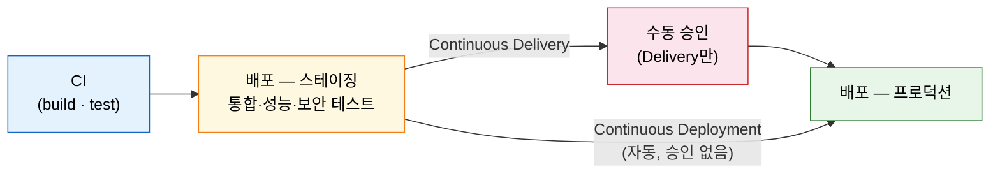
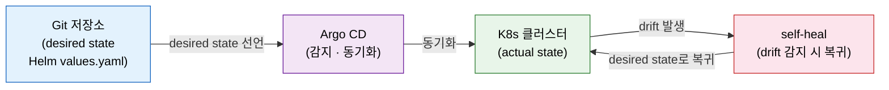

# CD와 GitOps — 개념·브랜치 전략

---

> 이 문서를 읽고 나면 CD가 CI를 어떻게 확장하는지 **설명하고**, Continuous Deployment와 Continuous Delivery를 **구분하며**, 두 CD 브랜치 전략을 상황에 맞게 **선택**하고, GitOps의 self-healing 원리를 **설명**할 수 있습니다.

## 사전 지식

> CI 파이프라인(Clone→Publish)과 Helm·K8s 기초를 알면 이 편의 흐름이 자연스럽게 읽힙니다.

CI 파이프라인의 스테이지 순서(Clone → Test → SCA → Gate → Build → Publish)를 알고 있으면 좋습니다. 06-11이 이미지 push까지 구현한 CI를 다뤘으므로, 이 편은 그 다음 질문 — "push된 이미지를 어떻게 프로덕션까지 보내는가" — 에 집중합니다. Helm과 K8s 기초 개념(`Deployment`·`values.yaml`)을 대략 알고 있으면 §3·§4가 자연스럽게 읽힙니다.

## 진입 — CI가 끝난 자리에서 시작하는 질문

> 이미지를 레지스트리에 push했습니다. 그 다음은 무엇인가요?

06-11이 CI Jenkinsfile을 완성하면서 마지막 stage는 `Publish` — Artifactory로 Docker 이미지를 push하는 것이었습니다. CI는 거기서 멈춥니다. 하지만 이미지가 레지스트리에 있다고 해서 사용자에게 자동으로 전달되지는 않습니다. "빌드하고 검증한 결과물을 실제 환경에 배포하는 것"을 누가, 어떤 기준으로, 어떻게 자동화할지가 CD(Continuous Delivery / Continuous Deployment)의 영역입니다. 이 편은 CD 개념과 브랜치 전략, 그리고 GitOps가 무엇인지를 다룹니다. Argo CD의 실제 설계는 다음 편 06-13으로 연결됩니다.

## 1. CD는 CI의 확장이다 — Deployment vs Delivery

> CI가 "만들고 검증한다"면, CD는 "검증된 결과물을 어디까지, 어떻게 보낸다"입니다.

CI 파이프라인은 코드를 빌드하고 빠른 피드백을 목적으로 가벼운 테스트를 돌립니다. CD 파이프라인은 CI의 모든 단계를 포함하고, 거기에 배포 단계를 더합니다. 이 구조에서 CD는 CI를 대체하는 것이 아니라 CI를 전제로 확장합니다.

책의 Q&A에 자주 등장하는 함정이 있습니다: "CD는 배포만 담당하고 테스트는 CI가 책임진다." 이 말은 틀립니다. CD 파이프라인은 통합 테스트·기능 테스트·성능 테스트·보안 테스트를 포함하는 extensive testing을 수행합니다. CI가 빠른 피드백을 위해 가벼운 단위 테스트 위주로 구성된다면, CD는 프로덕션에 배포하기 전에 더 무겁고 포괄적인 검증을 책임집니다. 테스트 책임을 CI에만 미루는 설계는 CD 본연의 안전장치를 포기하는 것입니다.

**Continuous Delivery**와 **Continuous Deployment** — 이름이 비슷해 혼동하기 쉽습니다. 책이 제시하는 구분 기준은 하나입니다: 프로덕션 배포 직전에 수동 승인 게이트가 있는지 없는지.

| 구분 | 수동 승인 | 설명 |
|------|---------|------|
| Continuous Delivery | 있음 | 스테이징까지 자동, prod 배포는 사람이 승인 후 실행 |
| Continuous Deployment | 없음 | 모든 단계가 자동, 검증 통과 즉시 prod까지 자동 배포 |

출판사 비유로 이해하면 이렇습니다. Delivery는 원고가 편집장(사람)의 최종 승인을 받은 뒤에야 인쇄소로 넘어가는 방식입니다. Deployment는 원고가 모든 자동화된 품질 검사를 통과하는 순간 자동으로 인쇄가 시작되는 방식입니다. 비유는 승인 유무를 설명하지만, 카나리 배포·블루-그린·롤백 같은 배포 안전장치는 별도로 설계해야 합니다.

어느 방식을 택하든 CD 파이프라인은 CI 파이프라인의 완전한 상위 집합입니다. CD를 설계한다는 것은 CI 설계를 버리는 것이 아니라, 그 위에 배포 자동화 레이어를 얹는 일입니다.

## 2. CD 브랜치 전략 두 가지

> 어떤 브랜치가 배포를 트리거할지는 팀의 자원과 규제 환경이 결정합니다.

책은 CD 브랜치 전략을 두 가지로 제시합니다.

**Universal CI + master-only CD**: 모든 브랜치가 CI를 돌리되, `master`(혹은 `main`) 브랜치만이 CD(배포)를 트리거합니다. feature 브랜치에서 터진 버그가 프로덕션 파이프라인에 영향을 주지 않습니다. master는 항상 배포 가능한 상태를 유지해야 하므로, 이 전략은 PR 리뷰와 feature 브랜치의 최신 동기화를 엄격하게 운용해야 한다는 것을 전제합니다.

**Universal CI + Universal CD**: 모든 브랜치가 CI와 CD를 모두 돌립니다. 각 브랜치는 독립적인 pre-production 환경에 배포됩니다. feature 브랜치마다 실환경에서 테스트할 수 있고, feature flag나 A/B 테스트를 브랜치 단위로 운용할 수 있습니다. 반면 브랜치마다 환경을 프로비저닝해야 하므로 자원 비용이 크고, 환경 관리 복잡도와 보안 위험이 올라갑니다. 브랜치 네이밍 규칙을 엄격히 지켜야 환경 충돌을 피할 수 있습니다.

| 전략 | 장점 | 비용 | 적합한 상황 |
|------|------|------|-----------|
| Universal CI + master-only CD | master 안정성·자원 최적화·격리 보장 | 엄격한 PR 리뷰·브랜치 동기화 필요 | 자원이 제한적이거나 규제 환경, 소규모 팀 |
| Universal CI + Universal CD | 실환경 테스트·feature flag·빠른 피드백 | 높은 자원 비용·환경 복잡도·보안 위험 | 충분한 클라우드 자원, 자동화 성숙도가 높은 조직 |

책은 master-only CD를 채택합니다. 정답이 하나로 고정된 것이 아니라, 팀 규모·클라우드 자원·규제 요건이 전략을 결정합니다. feature 브랜치 배포 환경을 자동으로 생성·삭제할 IaC 성숙도가 갖춰지지 않은 팀이 Universal CD를 채택하면, 방치된 환경이 비용을 소진하고 보안 구멍이 됩니다.

## 3. GitOps란 — Git이 단일 진실

> 이미 아는 "코드를 Git에 둔다"의, **인프라와 배포 상태까지 Git에** 두는 원칙입니다.

GitOps는 Git을 애플리케이션과 인프라 모두의 single source of truth로 삼는 운영 모델입니다. 핵심은 세 가지입니다.

1. 인프라와 앱 배포 상태를 선언적(declarative)으로 Git에 기술합니다. Helm `values.yaml`이나 K8s 매니페스트 파일이 그 매개체입니다.
2. 모든 변경은 PR을 통해 Git에 먼저 반영됩니다. 클러스터에 직접 `kubectl apply`로 반영하는 것은 GitOps 원칙에 어긋납니다.
3. 자동화된 프로세스(Argo CD 등)가 Git의 desired state와 실제 클러스터의 actual state를 지속적으로 비교하고 동기화합니다. 둘이 어긋나면 **self-healing** — 클러스터가 Git의 desired state로 스스로 복귀합니다.

GitOps는 **pull 기반**입니다. 클러스터 안의 에이전트가 Git을 당겨와 상태를 맞춥니다. CI가 파이프라인에서 클러스터에 push하는 방식(push 기반)과 반대 방향입니다. pull 기반은 클러스터 외부에서 클러스터 API에 접근할 자격증명이 필요 없어 보안 면에서 유리합니다.

자동 발주 시스템 비유로 이해할 수 있습니다. 장부(Git)에 "재고 100개"가 적혀 있으면 실제 창고(클러스터)가 100개를 유지합니다. 누군가 창고에서 직접 재고를 꺼내 90개로 만들면(kubectl 직접 수정), 시스템이 이를 감지하고 자동으로 10개를 보충해 100개로 되돌립니다. 이것이 self-healing입니다. 비유의 한계: 장부(Git)가 틀리면 창고도 틀리게 맞춰집니다. Git이 진실의 소스이므로, Git에 잘못 커밋된 내용이 곧 배포 실수로 이어집니다. 따라서 Git PR 리뷰의 품질이 배포 안전성과 직결됩니다.

GitOps의 주요 장점을 정리하면 다음과 같습니다.

- **버전 관리**: 모든 배포 변경이 Git 히스토리에 남아 감사·롤백·협업이 가능합니다.
- **자동 동기화**: Argo CD 같은 도구가 desired state와 actual state를 지속적으로 맞춥니다.
- **보안**: Git 커밋 서명과 감사 로그로 "누가 언제 무엇을 배포했는지"가 추적됩니다.
- **self-healing**: 클러스터 상태가 표류(drift)하면 자동으로 원래 상태로 돌아옵니다.

## 4. JCasC GitOps와 앱 배포 GitOps의 차이

> 둘 다 GitOps 원리를 따르지만, *무엇을* 선언적으로 관리하느냐가 다릅니다.

이 저장소는 이미 JCasC GitOps를 다루었습니다([../02_security/02-02.JCasC%20%EC%9A%B4%EC%98%81%EA%B3%BC%20GitOps.md](../02_security/02-02.JCasC%20%EC%9A%B4%EC%98%81%EA%B3%BC%20GitOps.md)). `jenkins.yaml`을 Git에 두고, PR을 머지하면 Jenkins가 설정을 자동으로 reload하는 방식입니다. 대상은 **Jenkins 자신의 설정**입니다.

챕터10의 GitOps는 대상이 다릅니다. **애플리케이션 배포**를 Git으로 관리합니다. Helm `values.yaml`에 이미지 태그를 업데이트하면, Argo CD가 변경을 감지하고 K8s 클러스터에 자동으로 배포합니다. "Jenkins 설정을 선언적으로 관리한다"와 "배포되는 앱의 상태를 선언적으로 관리한다"는 같은 GitOps 원리에서 출발하지만 관리 대상이 전혀 다릅니다.

| 구분 | 관리 대상 | Git의 내용 | 동기화 주체 |
|------|---------|----------|-----------|
| JCasC GitOps | Jenkins 자신의 설정 | `jenkins.yaml` | Jenkins JCasC reload |
| 앱 배포 GitOps | 배포되는 애플리케이션 | Helm `values.yaml`·K8s 매니페스트 | Argo CD |

두 레이어를 별도 저장소로 분리하는 팀도 많습니다. `jenkins-config` 저장소에는 `jenkins.yaml`과 `plugins.txt`를, `app-deploy` 저장소에는 Helm chart와 values를 둡니다. Jenkins가 CI 파이프라인을 돌려 이미지를 push하고, 이미지 태그를 `app-deploy` 저장소의 `values.yaml`에 커밋하면, Argo CD가 그 변경을 감지해 클러스터에 배포하는 흐름이 만들어집니다. Jenkins는 CI를 담당하고, Argo CD는 CD를 담당하는 역할 분리입니다.

Argo CD 설치·앱 등록·sync 정책 설계는 다음 편 06-13에서 다룹니다.

## 면접 질문

> 답을 떠올린 뒤 §정답 절에서 같은 번호로 대조하세요.

1. Continuous Deployment와 Continuous Delivery의 핵심 차이는 무엇인가요?
2. GitOps에서 "단일 진실"과 "self-healing"이 각각 무슨 뜻인가요?
3. "extensive testing은 CD가 아니라 CI의 책임이다"라는 말이 틀린 이유는 무엇인가요?

### 빈칸 채우기 — CD와 GitOps

다음 문장의 빈칸을 채워 보세요.

1. 프로덕션 배포 직전 수동 승인이 있으면 Continuous ____ , 없이 자동이면 Continuous ____ 입니다.
2. GitOps에서 실제 상태가 Git과 어긋났을 때 스스로 복귀하는 성질은 ____ -heal 입니다.
3. GitOps의 단일 진실 소스는 ____ 저장소입니다.
4. GitOps는 클러스터 에이전트가 Git을 당겨오는 ____ 기반 방식으로 동작합니다.

## 정답

> 위 질문을 스스로 설명해 본 뒤에 대조하세요.

### 정답 1 — Delivery vs Deployment

핵심 차이는 수동 승인 게이트의 유무입니다. Continuous Delivery는 스테이징까지 자동으로 배포하지만 프로덕션 배포 직전에 사람의 수동 승인을 요구합니다. Continuous Deployment는 모든 단계가 자동화되어 검증 통과 즉시 프로덕션까지 배포됩니다. 둘 다 CI의 확장이며, CI 파이프라인을 전제로 합니다.

### 정답 2 — 단일 진실과 self-healing

"단일 진실(single source of truth)"은 인프라와 앱의 desired state를 Git 하나에만 선언하고, 그 Git이 유일한 기준이 된다는 뜻입니다. 클러스터에 직접 변경을 가하는 것은 허용되지 않고, 모든 변경은 Git을 거칩니다. "self-healing"은 클러스터의 actual state가 Git의 desired state와 다르게 표류(drift)하면, Argo CD 같은 GitOps 도구가 이를 감지하고 자동으로 desired state로 복귀시키는 성질입니다.

### 정답 3 — extensive testing의 책임

CD 파이프라인은 CI의 단순 연장이 아니라, 통합·기능·성능·보안 테스트를 포함하는 extensive testing을 스스로 수행합니다. CI가 빠른 피드백을 위해 가벼운 단위 테스트 위주로 구성된다면, CD는 프로덕션 배포 전에 더 포괄적인 검증을 책임집니다. "테스트는 CI 책임"이라고 하면 CD 파이프라인의 필수 안전장치를 없애는 것이므로 틀린 주장입니다.

### 빈칸 정답 — CD와 GitOps

1. **Delivery** / **Deployment** — 수동 승인 게이트 유무가 두 개념을 가릅니다.
2. **self** — 클러스터가 Git의 desired state로 스스로 복귀하는 성질입니다.
3. **Git** — 인프라와 앱 상태의 선언적 기술이 Git에 있으며, 이것이 유일한 기준입니다.
4. **pull** — 클러스터 안의 에이전트가 Git을 당겨와 동기화하는 방식입니다.

## 관련 문서

> CD 개념의 전제가 되는 CI 구현 편과, GitOps 운영 사례, 수동 승인 패턴을 함께 보면 흐름이 완성됩니다.

- [06-00. 점검 — 핵심 질문과 답 (계획·배포)](06-00.%EC%A0%90%EA%B2%80.%ED%95%B5%EC%8B%AC%20%EC%A7%88%EB%AC%B8%EA%B3%BC%20%EB%8B%B5%20%28%EA%B3%84%ED%9A%8D%C2%B7%EB%B0%B0%ED%8F%AC%29.md) § "핵심 질문" — 이 장 전체를 Q&A로 자가 점검
- [06-11. 첫 CI Jenkinsfile 구현 — 완성 코드·Multibranch·Blue Ocean](06-11.%EC%B2%AB%20CI%20Jenkinsfile%20%EA%B5%AC%ED%98%84%20%E2%80%94%20%EC%99%84%EC%84%B1%20%EC%BD%94%EB%93%9C%C2%B7Multibranch%C2%B7Blue%20Ocean.md) § "Publish" — CD의 전제가 되는 CI 이미지 push 구현
- [../02_security/02-02.JCasC%20%EC%9A%B4%EC%98%81%EA%B3%BC%20GitOps.md](../02_security/02-02.JCasC%20%EC%9A%B4%EC%98%81%EA%B3%BC%20GitOps.md) § "GitOps 워크플로우" — Jenkins 설정을 대상으로 한 JCasC GitOps(앱 배포 GitOps와 대비)
- [../01_core/02-03.Pipeline%20%ED%8C%A8%ED%84%B4.md](../01_core/02-03.Pipeline%20%ED%8C%A8%ED%84%B4.md) § "`input` step" — Continuous Delivery의 수동 승인 게이트 구현 패턴
