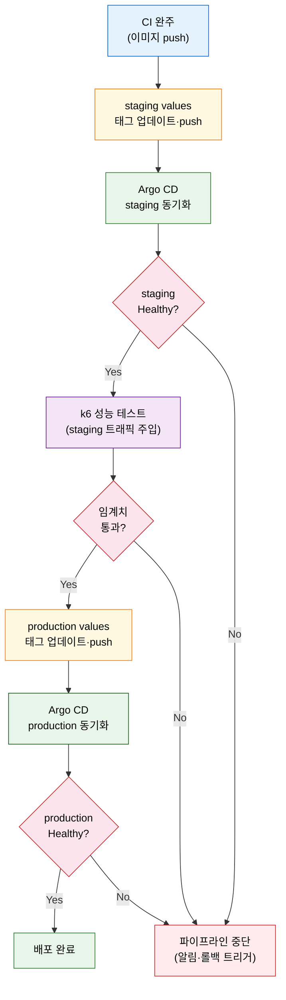

# Argo CD로 CD 설계 — Jenkins 역할분담·staging→prod

---

> 이 문서를 읽고 나면 Jenkins와 Argo CD의 역할분담을 **구분하고**, 앱 배포용 Helm chart의 환경 분리를 **설명하며**, Argo CD Application과 자동 sync를 **설계**하고, staging→k6→production 승급 흐름을 **예측**할 수 있습니다.


## 사전 지식

06-12(CD·GitOps 개념)를 읽었다고 가정합니다. GitOps의 핵심 원칙(Git이 유일한 진실, 선언적 desired state, self-healing)을 알고 있으면 이 편의 설계 선택들이 더 자연스럽게 읽힙니다. Helm chart 기초(Chart.yaml·values.yaml·templates/ 구조)와 K8s namespace 개념은 [../03_agent/02-01.Kubernetes Jenkins 구축](../03_agent/02-01.Kubernetes%20Jenkins%20%EA%B5%AC%EC%B6%95.md)에서 이어집니다.


## 진입 — 이미지를 push했다, 그다음은?

> 06-11에서 Jenkins가 이미지를 Artifactory에 push하고 CI 파이프라인이 끝났습니다. 그 이미지를 누가, 어떻게 클러스터에 올리는지가 이 편의 질문입니다.

CI 파이프라인이 이미지를 레지스트리에 올리는 것으로 끝났다면 배포는 아직 시작되지 않았습니다. 이 이미지를 staging 클러스터에 올리고, 성능 검증을 거쳐, production으로 승급하는 흐름 전체가 CD(Continuous Deployment)입니다. 책(Learning Continuous Integration with Jenkins 3e)은 이 CD 단계를 Jenkins 혼자 맡기지 않고 Argo CD와 역할을 나누는 구조를 제시합니다. 각 도구가 잘하는 일을 맡길 때 전체 파이프라인이 단단해집니다.


## 1. Jenkins와 Argo CD의 역할분담

> Jenkins는 빌드·테스트·이미지·Helm values 업데이트를 맡고, Argo CD는 Git의 Helm chart를 감시해 K8s에 desired state를 동기화합니다.

06-11에서 Jenkins는 CI를 완주해 이미지를 Artifactory에 push했습니다. CD 단계에서 Jenkins의 역할은 거기서 끝나지 않습니다. Jenkins는 별도의 Helm chart 저장소에 있는 `values-staging.yaml` 또는 `values-production.yaml`의 이미지 태그를 새 빌드 번호로 업데이트하고 push합니다. 이 push가 Argo CD를 움직이는 신호입니다.

**Jenkins = CI 엔진**이고 **Argo CD = GitOps 배포 엔진**입니다. 둘이 함께 Git 저장소를 감시하는 것이 아닙니다. Argo CD가 Helm chart 저장소를 감시하고, Jenkins는 그 저장소에 변경을 일으키는 역할입니다. 책 Q&A에서 자주 나오는 오답은 "Jenkins도 Git을 감시해 배포를 트리거한다"입니다. Jenkins는 빌드 결과를 Git에 기록(push)하는 쪽이고, 감시(watch)·배포(sync)는 Argo CD의 일입니다.

Argo CD가 감시하는 파일은 `values.yaml`(또는 환경별 values 파일)입니다. `Chart.yaml`은 chart 이름·버전 메타데이터이고, `Jenkinsfile`은 CI 파이프라인 정의이며, `Dockerfile`은 이미지 빌드 지시서입니다. 이 셋이 바뀐다고 배포 대상 이미지 태그가 달라지지 않습니다. 배포 대상 이미지는 values 파일의 `tag:` 필드에 적힌 값이 결정합니다.

소스코드 저장소와 Helm chart 저장소는 분리합니다. 소스코드 저장소에 Helm chart를 함께 두면 코드 커밋마다 Argo CD가 불필요한 sync를 시도하거나, chart 변경과 코드 변경의 이력이 뒤섞입니다. 별도 저장소로 분리하면 Jenkins가 이미지 태그 한 줄만 바꿔 push하는 흐름이 명확해집니다.

비유를 빌리면 Jenkins는 택배 분류 센터에서 상품을 포장(빌드)하고 배송 전표(values 업데이트)를 붙이는 역할이고, Argo CD는 전표를 보고 주소별(staging/production)로 배송해 도착까지 확인하는 역할입니다. 이 비유는 흐름과 역할 분리를 설명하지만, 롤백·sync 실패 복구는 별도로 다루어야 합니다.

```mermaid
flowchart LR
    MERGE["master 머지"]
    WEBHOOK["GitHub Webhook"]
    JENKINS["Jenkins CI<br/>(빌드·테스트·이미지 push)"]
    VALUES["Helm chart 저장소<br/>values.yaml 태그 업데이트"]
    ARGOCD["Argo CD<br/>(chart 저장소 감시)"]
    K8S["K8s 클러스터<br/>(desired state 동기화)"]

    MERGE -->|"push 이벤트"| WEBHOOK
    WEBHOOK --> JENKINS
    JENKINS -->|"새 이미지 태그로<br/>values push"| VALUES
    VALUES -->|"변경 감지"| ARGOCD
    ARGOCD -->|"sync"| K8S

    style MERGE fill:#e3f2fd,stroke:#1565c0,color:#000
    style WEBHOOK fill:#f3e5f5,stroke:#6a1b9a,color:#000
    style JENKINS fill:#fff8e1,stroke:#f57f17,color:#000
    style VALUES fill:#fce4ec,stroke:#c62828,color:#000
    style ARGOCD fill:#e8f5e9,stroke:#2e7d32,color:#000
    style K8S fill:#e0f2f1,stroke:#00695c,color:#000
```




## 2. 앱 배포용 Helm chart 구조

> 06-03이 Jenkins 자체를 Helm으로 배포한 것과 달리, 이 편의 Helm chart는 우리가 CI로 만든 애플리케이션을 배포합니다.

[06-03. IaC로 Jenkins 배포](06-03.IaC%EB%A1%9C%20Jenkins%20%EB%B0%B0%ED%8F%AC%20%E2%80%94%20Terraform%C2%B7JCasC%C2%B7Helm.md)에서는 Jenkins Controller 자신을 Helm chart로 배포했습니다. 이 편의 chart는 대상이 다릅니다. CI로 만든 3-tier 앱(frontend·backend·db)을 K8s에 배포하는 chart입니다.

**Chart.yaml**은 chart의 신원을 정의합니다. `apiVersion: v2`는 Helm 3 전용 chart임을 선언합니다. `version:` 필드는 CD 파이프라인이 배포할 때마다 자동으로 갱신합니다.

```yaml
# Chart.yaml
# apiVersion v2: Helm 3 전용 chart 선언 (Helm 2와 구분)
apiVersion: v2
name: hello-world
version: 1.0.0
description: 3-tier hello world application
```

**환경별 values 파일**은 같은 chart를 staging과 production에 다르게 적용하는 핵심입니다. 공통 구조는 하나의 chart가 담당하고, 차이는 values 파일이 흡수합니다.

```yaml
# values-staging.yaml
# staging은 replicaCount 1로 자원 절약, 이미지 태그는 CD가 프로그래매틱으로 갱신
backend:
  replicaCount: 1
  repository: artifactory.example.com/docker-local/backend
  tag: "42"        # Jenkins가 빌드 번호로 교체하는 필드
  port: 3000
  service:
    type: ClusterIP

frontend:
  replicaCount: 1
  repository: artifactory.example.com/docker-local/frontend
  tag: "42"
  port: 80
  service:
    type: ClusterIP

db:
  replicaCount: 1
  repository: artifactory.example.com/docker-local/db
  tag: "42"
  port: 27017
  service:
    type: ClusterIP
```

```yaml
# values-production.yaml
# production은 replicaCount를 높여 가용성 확보
backend:
  replicaCount: 3
  repository: artifactory.example.com/docker-local/backend
  tag: "42"
  port: 3000
  service:
    type: ClusterIP

frontend:
  replicaCount: 3
  repository: artifactory.example.com/docker-local/frontend
  tag: "42"
  port: 80
  service:
    type: ClusterIP

db:
  replicaCount: 1
  repository: artifactory.example.com/docker-local/db
  tag: "42"
  port: 27017
  service:
    type: ClusterIP
```

**templates/** 디렉토리는 실제 K8s 리소스 매니페스트를 담습니다. Deployment는 `{{ .Values.backend.replicaCount }}` 같은 플레이스홀더로 values 파일의 값을 받고, Artifactory 사설 이미지를 pull하려면 `imagePullSecrets`가 필요합니다.

```yaml
# templates/deployment-backend.yaml (핵심 필드만)
spec:
  replicas: {{ .Values.backend.replicaCount }}
  template:
    spec:
      # imagePullSecrets: Artifactory 사설 레지스트리 인증
      # K8s가 이미지를 pull할 때 이 Secret의 크레덴셜을 사용합니다
      imagePullSecrets:
        - name: artifactory-credentials
      containers:
        - name: backend
          image: "{{ .Values.backend.repository }}:{{ .Values.backend.tag }}"
          ports:
            - containerPort: {{ .Values.backend.port }}
```

MongoDB(db tier)는 StatefulSet으로 배포합니다. Pod가 재시작되어도 데이터가 유지되어야 하기 때문에 `volumeClaimTemplates`로 PVC를 선언하고 `ReadWriteOnce`로 마운트합니다. Deployment는 stateless, StatefulSet은 persistent storage가 필요한 stateful 워크로드에 씁니다.

| 리소스 | 대상 tier | 특징 |
|--------|-----------|------|
| Deployment | frontend, backend | stateless, replicaCount로 스케일 |
| StatefulSet | db (MongoDB) | PVC 유지, 재시작 후 데이터 보존 |
| Service | 전 tier | ClusterIP로 내부 통신 |
| ConfigMap | db | init-mongo.js 초기화 스크립트 |


## 3. Argo CD Application과 자동 sync

> Argo CD Application은 "어느 Git 경로의 chart를 어느 클러스터 namespace에 어떤 values로 배포하라"는 K8s 리소스입니다.

Argo CD에서 Application은 desired state를 선언하는 K8s CRD입니다. staging과 production 각각에 Application을 하나씩 만들고, 둘 다 같은 chart 저장소를 바라보되 values 파일과 namespace만 다르게 설정합니다.

```bash
# staging Application 생성 (책 기준, CLI 경로는 버전에 따라 변동 가능)
argocd app create hello-world-staging \
    --repo ${HELM_CHART_REPO_URL} \
    --path . \
    --dest-namespace staging \
    --sync-policy automated \
    --values values-staging.yaml \
    --auto-prune \
    -l environment=staging \
    --revision HEAD

# production Application은 namespace·label·values만 다릅니다
argocd app create hello-world-production \
    --repo ${HELM_CHART_REPO_URL} \
    --path . \
    --dest-namespace production \
    --sync-policy automated \
    --values values-production.yaml \
    --auto-prune \
    -l environment=production \
    --revision HEAD
```

`--sync-policy automated`는 Argo CD가 chart 저장소의 변경을 감지할 때마다 K8s 클러스터를 자동으로 desired state에 맞춥니다. 사람이 수동으로 sync를 누르지 않아도 Jenkins가 values를 push하면 배포가 진행됩니다. `--auto-prune`은 Git에서 제거된 K8s 리소스를 클러스터에서도 정리합니다. 이 옵션 없이 chart에서 리소스를 삭제하면 클러스터에 고아 리소스가 남습니다.

**RBAC 설정**으로 계정별 권한을 제한합니다. Argo CD ConfigMap에 policy를 선언해 `org-admin` 그룹이 applications와 repositories에 대해 필요한 권한만 갖도록 합니다.

**Jenkins 연동**은 Argo CD 플러그인 없이 API 방식으로 합니다. Argo CD 토큰을 Jenkins에 secret text 크레덴셜로 등록하고, Jenkinsfile에서 크레덴셜 ID로 참조합니다. 토큰 값을 코드에 직접 쓰는 것은 dev-standards 보안 규칙 위반입니다.

```groovy
// Jenkinsfile — Argo CD sync 상태 체크 (핵심만)
stage('Sync staging') {
    steps {
        withCredentials([string(
            // ARGOCD_TOKEN: Jenkins에 등록한 secret text 크레덴셜 ID
            // 토큰 값을 코드에 직접 넣지 않습니다
            credentialsId: 'ARGOCD_TOKEN'
            , variable: 'TOKEN'
        )]) {
            sh """
                argocd app sync hello-world-staging \
                    --auth-token \$TOKEN \
                    --server \${ARGOCD_SERVER}
                # sync 후 health 상태가 Healthy가 될 때까지 대기
                argocd app wait hello-world-staging \
                    --auth-token \$TOKEN \
                    --server \${ARGOCD_SERVER} \
                    --health
            """
        }
    }
}
```

토큰은 `argocd account generate-token --account ${ACCOUNT_NAME} --expires-in 90d`로 만듭니다. admin 계정은 보안상 토큰 생성이 불가능하므로 전용 CI 계정을 별도로 만들어 씁니다(책 기준).

Helm chart 저장소 연결은 아래와 같이 합니다. PAT(Personal Access Token)는 repo 스코프로 한정해 최소 권한 원칙을 지킵니다.

```bash
# GitHub PAT를 사용해 Helm chart 저장소를 Argo CD에 등록
# --password에 실제 값을 넣지 않고 환경 변수로 주입합니다
argocd repo add ${HELM_CHART_REPO_URL} \
    --username ${GIT_USERNAME} \
    --password ${HELM_CHART_PAT}
```

**insecure registry 주의**: 책 예제는 도메인·SSL 없는 Artifactory를 단순화하기 위해 containerd `hosts.toml`에 `skip_verify = true`·`plain-http = true` 설정을 사용합니다. 이 설정은 책 예제의 단순화이며, 실무에서는 HTTPS와 유효한 인증서를 사용해 이 설정을 생략합니다(dev-standards 보안 우선 원칙).

namespace와 Secret 격리 전략은 [06-10. CI 파이프라인 전체 설계](06-10.CI%20%ED%8C%8C%EC%9D%B4%ED%94%84%EB%9D%BC%EC%9D%B8%20%EC%A0%84%EC%B2%B4%20%EC%84%A4%EA%B3%84%20%E2%80%94%20%EC%8A%A4%ED%85%8C%EC%9D%B4%EC%A7%80%20%EC%88%9C%EC%84%9C%C2%B7Docker%20%EB%A0%88%EC%A7%80%EC%8A%A4%ED%8A%B8%EB%A6%AC%C2%B7%EC%9D%B8%EC%A6%9D.md)에서 확립한 원칙의 연장입니다. staging과 production을 별도 namespace로 나누면 Secret·ConfigMap이 격리되어 staging의 설정이 production에 영향을 주지 않습니다.


## 4. staging → k6 → production 승급 흐름

> master 머지 한 번으로 staging 배포, 성능 검증, production 승급이 자동으로 이어집니다.

master 브랜치에 코드가 머지되면 CD 파이프라인은 다음 여덟 단계를 순서대로 밟습니다.

① **CI 완주**: Jenkins가 빌드·테스트를 통과하고 이미지를 Artifactory에 push합니다(06-11 흐름).
② **staging values 업데이트**: Jenkins가 Helm chart 저장소의 `values-staging.yaml` 이미지 태그를 새 빌드 번호로 바꿔 push합니다.
③ **staging 동기화**: Argo CD가 변경을 감지하고 staging namespace에 새 이미지를 배포합니다.
④ **staging 상태 체크**: Jenkins가 Argo CD API로 sync·health 상태를 폴링합니다. Healthy 상태가 확인되어야 다음 단계로 진입합니다.
⑤ **k6 성능 테스트**: Jenkins가 staging 환경에 k6를 실행합니다. k6는 부하/성능 테스트 도구로, 정해진 시나리오로 트래픽을 주입해 응답시간·에러율 같은 지표를 측정합니다. 책은 k6 단일 성능 테스트로 단순화하며, 실무에서는 UAT·보안 테스트·다층 성능 테스트가 추가됩니다.
⑥ **production values 업데이트**: k6가 임계치를 통과하면 Jenkins가 `values-production.yaml`의 태그를 동일한 빌드 번호로 업데이트해 push합니다.
⑦ **production 동기화**: Argo CD가 production namespace에 같은 이미지를 배포합니다.
⑧ **production 상태 체크**: Jenkins가 production App의 health를 확인하고 파이프라인을 종료합니다.



파이프라인 어느 단계에서든 실패하면 다음 단계로 진입하지 않고 중단됩니다. staging health 체크 실패나 k6 임계치 미달은 production 배포를 막는 게이트 역할을 합니다.

**자동 롤백**은 Git의 이력이 기반입니다. 배포 후 문제가 발견되면 Helm chart 저장소의 values 파일을 이전 커밋 태그로 되돌려 push합니다. Argo CD는 변경을 감지하고 이전 이미지로 self-heal합니다. 롤백 시 다시 kubectl 명령을 직접 실행하지 않아도 되는 이유입니다. GitOps의 self-healing 원칙은 06-12에서 다룹니다.


## 면접 질문

> 답을 떠올린 뒤 §정답 절에서 같은 번호로 대조하세요.

1. Jenkins와 Argo CD는 GitOps CI/CD에서 각각 무엇을 맡으며, 둘 중 누가 Git 저장소를 감시해 배포를 트리거하나요?
2. Argo CD가 배포를 트리거하기 위해 Helm chart 저장소에서 감시하는 파일은 무엇인가요? Chart.yaml이나 Jenkinsfile이 아닌 이유는 무엇인가요?
3. staging 배포 후 production으로 승급하기 전에 무엇을 확인하나요?

### 빈칸 채우기 — Argo CD CD 설계

다음 문장의 빈칸을 채워 보세요.

1. Jenkins는 빌드·테스트를 맡고, Argo CD는 ____ 를 감시해 K8s 클러스터에 배포합니다.
2. Argo CD가 Helm chart 저장소에서 감시하는 파일은 ____ .yaml입니다.
3. Argo CD가 클러스터를 Git 상태로 자동 맞추는 sync-policy 옵션은 ____ 입니다.
4. staging 배포 후 production 승급 전에 성능을 검증하는 도구는 ____ 입니다.


## 정답

> 위 질문을 스스로 설명해 본 뒤에 대조하세요.

### 정답 1 — 역할분담

Jenkins는 빌드·테스트·이미지 push, 그리고 Helm chart 저장소의 values 파일 태그 업데이트를 맡습니다. Argo CD는 Helm chart 저장소를 감시하다가 변경을 감지하면 K8s 클러스터를 desired state에 동기화합니다. Git을 감시하는 것은 Argo CD이고, Jenkins는 감시 대상인 저장소에 변경을 기록하는 역할입니다.

### 정답 2 — 감시 파일

Argo CD는 `values.yaml`(또는 환경별 values 파일)을 감시합니다. `Chart.yaml`은 chart 이름·버전 메타데이터라 배포 대상 이미지를 결정하지 않습니다. `Jenkinsfile`은 CI 파이프라인 정의이고 Argo CD와 무관합니다. 배포할 이미지 태그는 values 파일의 `tag:` 필드에 있으므로, Argo CD는 이 파일의 변경을 감지해 새 이미지를 클러스터에 올립니다.

### 정답 3 — 승급 조건

staging 배포 후 Argo CD가 Healthy 상태를 보고해야 하고, 그 다음 k6 성능 테스트가 임계치를 통과해야 합니다. 둘 중 하나라도 실패하면 production 값 파일을 업데이트하지 않고 파이프라인이 중단됩니다. 책은 k6 단일 테스트로 단순화하며, 실무에서는 UAT·보안·다층 성능 테스트가 추가됩니다.

### 빈칸 정답 — Argo CD CD 설계

1. **Helm chart 저장소** — Argo CD는 chart 저장소를 감시하고 Jenkins는 그 저장소에 변경을 씁니다.
2. **values** — 배포 대상 이미지 태그가 values 파일에 있기 때문에 Argo CD는 이 파일의 변경을 감지합니다.
3. **automated** — `--sync-policy automated`로 설정하면 변경 감지 즉시 자동 sync가 실행됩니다.
4. **k6** — 부하·성능 테스트 도구로 staging에 트래픽을 주입해 응답시간·에러율을 측정합니다.


## 관련 문서

> 이 편의 앞뒤와 설계 기반을 잇는 편들입니다.

- [06-00. 점검 — 핵심 질문과 답 (계획·배포)](06-00.%EC%A0%90%EA%B2%80.%ED%95%B5%EC%8B%AC%20%EC%A7%88%EB%AC%B8%EA%B3%BC%20%EB%8B%B5%20%28%EA%B3%84%ED%9A%8D%C2%B7%EB%B0%B0%ED%8F%AC%29.md) § "핵심 질문" — 이 장 전체를 Q&A로 자가 점검
- [06-12. CD와 GitOps — 개념·브랜치 전략](06-12.CD와%20GitOps%20%E2%80%94%20개념%C2%B7브랜치%20전략.md) § "GitOps 원칙" — 이 편의 전제가 되는 CD·GitOps 개념
- [06-11. 첫 CI Jenkinsfile 구현](06-11.%EC%B2%AB%20CI%20Jenkinsfile%20%EA%B5%AC%ED%98%84%20%E2%80%94%20%EC%99%84%EC%84%B1%20%EC%BD%94%EB%93%9C%C2%B7Multibranch%C2%B7Blue%20Ocean.md) § "Publish 스테이지" — Jenkins가 Artifactory에 이미지를 push하는 CI 구현
- [06-10. CI 파이프라인 전체 설계](06-10.CI%20%ED%8C%8C%EC%9D%B4%ED%94%84%EB%9D%BC%EC%9D%B8%20%EC%A0%84%EC%B2%B4%20%EC%84%A4%EA%B3%84%20%E2%80%94%20%EC%8A%A4%ED%85%8C%EC%9D%B4%EC%A7%80%20%EC%88%9C%EC%84%9C%C2%B7Docker%20%EB%A0%88%EC%A7%80%EC%8A%A4%ED%8A%B8%EB%A6%AC%C2%B7%EC%9D%B8%EC%A6%9D.md) § "namespace·Secret 격리" — K8s namespace 분리와 Secret 관리 기초
- [../03_agent/02-01.Kubernetes Jenkins 구축](../03_agent/02-01.Kubernetes%20Jenkins%20%EA%B5%AC%EC%B6%95.md) § "namespace" — K8s namespace 개념과 Jenkins 구축 기반
