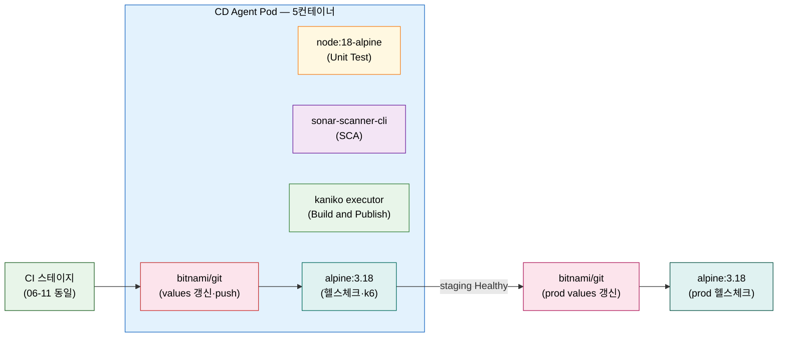
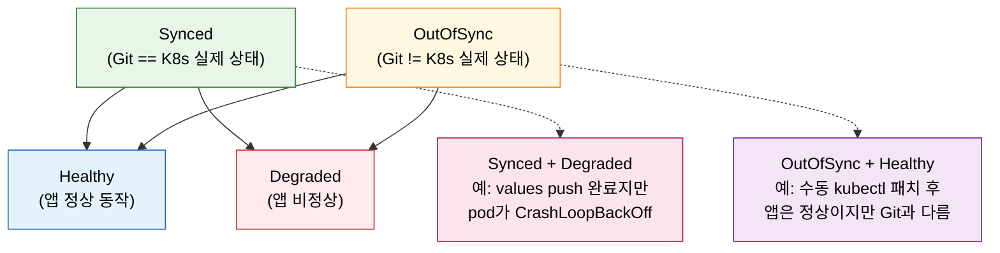

# 첫 CD Jenkinsfile 구현 — values 갱신·Argo CD 헬스체크·k6 게이트

---

> 이 문서를 읽고 나면 06-13의 CD 8단계 설계를 동작하는 Jenkinsfile 스테이지로 **구현하고**, git·alpine 두 컨테이너를 CD 용도로 **전환하며**, Argo CD sync와 health의 차이를 **진단하고**, k6 임계치가 production 승급 게이트로 작동하는 흐름을 **예측**할 수 있습니다.


## 사전 지식

[06-13. Argo CD로 CD 설계](06-13.Argo%20CD%EB%A1%9C%20CD%20%EC%84%A4%EA%B3%84%20%E2%80%94%20Jenkins%20%EC%97%AD%ED%95%A0%EB%B6%84%EB%8B%B4%C2%B7staging%E2%86%92prod.md)의 8단계 흐름(CI 완주→staging values 업데이트→Argo CD 동기화→헬스체크→k6→production values 업데이트→production 동기화→production 헬스체크)과 Helm chart 환경별 values 구조를 먼저 이해하고 있으면 이 편의 코드가 자연스럽게 읽힙니다. 멀티컨테이너 Pod와 container() step 전환 패턴은 [06-11. 첫 CI Jenkinsfile 구현](06-11.%EC%B2%AB%20CI%20Jenkinsfile%20%EA%B5%AC%ED%98%84%20%E2%80%94%20%EC%99%84%EC%84%B1%20%EC%BD%94%EB%93%9C%C2%B7Multibranch%C2%B7Blue%20Ocean.md)에서 이어집니다.


## 진입 — 설계 흐름을 스테이지 코드로 조립하려면

> 06-13이 "무엇을 언제"를 그렸다면, 이 편은 "어떤 컨테이너에서 어떤 명령으로"를 채웁니다.

CI 파이프라인(06-11)이 이미지를 Artifactory에 push하고 종료합니다. CD 파이프라인은 그 다음을 이어받아 values 파일을 갱신하고, 클러스터 배포를 확인하고, 성능을 검증하고, production으로 승급합니다. 06-13이 이 흐름을 8단계로 설계했다면, 이 편은 각 단계를 실제 Jenkinsfile 스테이지로 변환합니다. 어느 컨테이너에서 무슨 명령을 실행하는지, 크레덴셜을 어떻게 주입하는지, 헬스체크는 어떤 API 응답을 보는지가 이 편의 질문입니다. 06-11에서 CI를 컨테이너별로 구현했던 방식과 정확히 대칭입니다.


## 1. CD용 컨테이너 추가와 파이프라인 옵션

> CI Pod의 3컨테이너에 git·alpine 2개를 추가해 CD 작업을 맡기고, disableConcurrentBuilds로 배포 중첩을 막습니다.

06-11에서 선언한 CI Pod는 node·sonar-scanner-cli·kaniko 세 컨테이너로 구성됩니다. CD 파이프라인은 이 세 컨테이너에 **git**과 **alpine** 두 컨테이너를 추가합니다.

`bitnami/git` 컨테이너는 Helm chart 저장소를 clone하고, yq로 values 파일의 이미지 태그를 갱신하고, 결과를 push하는 Git 작업을 전담합니다. `command: [sleep, 99d]`로 살려 두는 이유는 Kaniko의 `sleep 99d`와 같습니다. Git 작업이 여러 스테이지에 걸쳐 실행되므로 컨테이너를 유지해야 각 스테이지에서 exec 방식으로 재진입할 수 있습니다. 99d는 파이프라인이 99일 동안 실행된다는 의미가 아니라, 파이프라인이 살아 있는 동안 컨테이너를 종료하지 않겠다는 선언입니다. 책도 이 점을 명시합니다.

`alpine` 컨테이너는 Argo CD 헬스체크와 k6 성능 테스트를 담당합니다. curl·jq·k6를 런타임에 설치해 쓰는 가벼운 범용 환경입니다. `command: [sh, -c, 'while true; do sleep 86400; done']` 반복 루프가 컨테이너를 유지합니다.

```groovy
// CD Jenkinsfile — agent Pod 선언 (책 예제 기반, 책: "Learning Continuous Integration with Jenkins 3e" Ch.11)
pipeline {
    agent {
        kubernetes {
            label 'cd-agent'
            yaml """
apiVersion: v1
kind: Pod
spec:
  containers:
  - name: node
    image: node:18-alpine
    command: [cat]
    tty: true
  - name: sonar-scanner-cli
    image: sonarsource/sonar-scanner-cli:latest
    command: [cat]
    tty: true
  - name: kaniko
    image: gcr.io/kaniko-project/executor:latest
    command: [/busybox/sh, -c, 'sleep 99d']
    tty: true
    volumeMounts:
    - name: kaniko-secret
      mountPath: /kaniko/.docker
  # git 컨테이너: Helm chart 저장소 clone·yq 갱신·push 전담
  # sleep 99d: 여러 stage에서 동일 컨테이너를 재진입하기 위해 유지
  - name: git
    image: bitnami/git:latest
    command: [sleep, 99d]
    tty: true
  # alpine 컨테이너: Argo CD 헬스체크·k6 성능 테스트 전담
  # curl·jq·k6는 스테이지에서 apk·다운로드로 런타임 설치
  - name: alpine
    image: alpine:3.18
    command: [sh, -c, 'while true; do sleep 86400; done']
    tty: true
  volumes:
  - name: kaniko-secret
    secret:
      secretName: artifactory-credentials
      items:
      - key: .dockerconfigjson
        path: config.json
"""
        }
    }

    // disableConcurrentBuilds: 동시 CD 실행을 차단합니다
    // 배포 중첩, DB 마이그레이션 충돌, 부하테스트 자원경합을 방지합니다
    // CI 파이프라인이 아닌 main/master 브랜치 CD Jenkinsfile에만 선언합니다
    options {
        disableConcurrentBuilds()
    }

    environment {
        // Argo CD 서버 주소: 환경변수로 주입 — 코드에 IP·호스트명을 직접 쓰지 않습니다
        ARGOCD_SERVER      = credentials('argocd-server-url')
        ARGOCD_APP_NAME_STG  = 'hello-world-staging'
        ARGOCD_APP_NAME_PROD = 'hello-world-production'
        // Argo CD API 토큰: Jenkins secret text 크레덴셜에서 주입
        // 토큰 값을 코드에 직접 기재하는 것은 dev-standards 보안 위반입니다
        ARGOCD_TOKEN       = credentials('argocd-jenkins')
        VERSION            = '1.0.0'
        // Helm chart 저장소 URL: 소스코드 저장소와 분리된 별도 저장소
        HELM_CHART_REPO    = credentials('helm-chart-repo-url')
    }

    stages {
        // CI 스테이지(Clone·Unit Test·SCA·Quality Gate·Build·Publish·Build Info)는
        // 06-11 Jenkinsfile과 동일합니다 — 여기서는 CD 스테이지만 추가 기술합니다
    }
}
```

**disableConcurrentBuilds를 사용하는 이유는 여섯 가지**입니다. 첫째, 배포가 겹치면 두 버전이 동시에 클러스터에 올라가 예측 불가한 상태가 됩니다. 둘째, DB 마이그레이션이 동시에 실행되면 충돌이 발생합니다. 셋째, 이전 배포가 완료되기 전에 다음 배포가 시작되면 변경 순서가 뒤바뀝니다. 넷째, k6 부하 테스트가 동시에 두 번 실행되면 결과를 신뢰할 수 없습니다. 다섯째, 동시 배포는 클러스터 리소스에 의도치 않은 부하를 유발합니다. 여섯째, 중첩 실패는 어느 배포가 원인인지 추적하기 어렵게 만듭니다.




## 2. Helm values 갱신 스테이지

> git 컨테이너에서 yq로 values 파일의 이미지 태그 한 줄을 바꾸고 push하는 것이 GitOps에서 "배포를 트리거"하는 실제 코드입니다.

staging 배포는 `values-staging.yaml`의 이미지 태그를 현재 빌드의 `VERSION-BUILD_NUMBER`로 바꾸는 것으로 시작합니다. 이 한 줄의 변경이 Argo CD에게 "새 이미지를 클러스터에 올려라"는 신호가 됩니다. 파일을 수정하고 push하는 모든 작업은 `container('git')` 블록 안에서 실행됩니다.

```groovy
stage('Update Staging Helm Chart Configuration') {
    steps {
        // git 컨테이너: yq 설치·clone·태그 갱신·push를 한 블록에서 처리합니다
        container('git') {
            // GitHub 크레덴셜을 withCredentials로 주입합니다
            // PAT를 코드에 직접 쓰는 것은 보안 위반이므로 Jenkins 크레덴셜 스토어를 씁니다
            withCredentials([usernamePassword(
                credentialsId: 'github-repo-jenkins'
                , usernameVariable: 'GIT_USERNAME'
                , passwordVariable: 'GIT_PASSWORD'
            )]) {
                sh '''
                    # yq 설치: YAML 파일을 명령줄에서 편집하는 도구
                    # curl로 linux_amd64 바이너리를 직접 받아 /usr/bin에 배치합니다
                    curl -sL https://github.com/mikefarah/yq/releases/latest/download/yq_linux_amd64 \
                        -o /usr/bin/yq && chmod +x /usr/bin/yq

                    # Helm chart 저장소를 clone합니다 (소스코드 저장소와 분리된 별도 저장소)
                    # $GIT_USERNAME:$GIT_PASSWORD 형식으로 인증 — PAT 값은 환경변수에서 옴
                    git clone https://$GIT_USERNAME:$GIT_PASSWORD@<Helm chart 저장소 URL>
                    cd hello-world-helm

                    # git 커밋 작성자 정보를 설정합니다 (Jenkins 자동 커밋용)
                    git config user.email "jenkins@ci.internal"
                    git config user.name "Jenkins CD"

                    # yq eval: values-staging.yaml의 이미지 태그 세 곳을 갱신합니다
                    # -i: 파일 인라인 수정
                    yq eval ".backend.tag = \\"${VERSION}-${BUILD_NUMBER}\\"" -i values-staging.yaml
                    yq eval ".frontend.tag = \\"${VERSION}-${BUILD_NUMBER}\\"" -i values-staging.yaml
                    yq eval ".db.tag = \\"${VERSION}-${BUILD_NUMBER}\\"" -i values-staging.yaml

                    # Chart.yaml의 chart 버전도 빌드 번호로 갱신합니다
                    yq eval ".version = \\"${VERSION}-${BUILD_NUMBER}\\"" -i Chart.yaml

                    git add values-staging.yaml Chart.yaml
                    git commit -m "CD: staging 이미지 태그를 ${VERSION}-${BUILD_NUMBER}로 갱신"
                    git push origin main
                '''
            }
        }
    }
}
```

production values 갱신 스테이지는 대상 파일과 커밋 메시지만 다르고 구조가 동일합니다.

```groovy
stage('Update Production Helm Chart Configuration') {
    steps {
        container('git') {
            withCredentials([usernamePassword(
                credentialsId: 'github-repo-jenkins'
                , usernameVariable: 'GIT_USERNAME'
                , passwordVariable: 'GIT_PASSWORD'
            )]) {
                sh '''
                    cd hello-world-helm

                    # values-production.yaml만 다릅니다 — chart clone은 앞 stage에서 이미 완료
                    # production은 replicaCount가 3이지만 이미지 태그는 staging과 동일합니다
                    # 동일한 이미지를 staging에서 검증하고 production에 올리는 것이 포인트입니다
                    yq eval ".backend.tag = \\"${VERSION}-${BUILD_NUMBER}\\"" -i values-production.yaml
                    yq eval ".frontend.tag = \\"${VERSION}-${BUILD_NUMBER}\\"" -i values-production.yaml
                    yq eval ".db.tag = \\"${VERSION}-${BUILD_NUMBER}\\"" -i values-production.yaml

                    git add values-production.yaml
                    git commit -m "CD: production 이미지 태그를 ${VERSION}-${BUILD_NUMBER}로 갱신"
                    git push origin main
                '''
            }
        }
    }
}
```

**왜 Jenkins가 직접 `kubectl apply`나 `argocd app sync`로 배포하지 않는가.** values 파일을 수정·push하고 Argo CD가 감지해 배포하는 방식이 바로 GitOps의 핵심입니다. Jenkins가 클러스터를 직접 조작하면 Git에 기록이 남지 않아 감사·롤백이 어렵고, 클러스터 실제 상태와 Git desired state가 어긋납니다. Git push 하나로 배포 이력, 롤백 기준점, Argo CD self-heal의 기준이 모두 확보됩니다.


## 3. Argo CD 헬스체크 스테이지

> alpine 컨테이너에서 Argo CD API를 curl로 호출해 sync와 health를 각각 파싱하고, 두 상태가 모두 통과돼야 다음 스테이지로 진입합니다.

staging values가 push되면 Argo CD가 자동 sync를 시작합니다. 그러나 sync 완료가 곧 "앱이 정상 동작 중"을 의미하지 않습니다. sync와 health는 독립된 개념입니다(§5에서 상세 설명). Jenkinsfile은 health 상태가 `Healthy`임을 확인한 뒤에만 k6 스테이지로 진입합니다.

```groovy
stage('Verify Staging Deployment Health') {
    steps {
        // alpine 컨테이너: curl·jq를 설치해 Argo CD REST API를 호출합니다
        container('alpine') {
            sh '''
                # curl·jq 설치: Argo CD API 응답(JSON) 파싱에 jq가 필요합니다
                apk add --no-cache jq curl

                # Argo CD REST API로 애플리케이션 상태를 조회합니다
                # -s: silent(진행바 출력 억제)
                # Authorization: Bearer $ARGOCD_TOKEN — Jenkins 크레덴셜에서 주입된 토큰
                # $ARGOCD_SERVER, $ARGOCD_APP_NAME_STG — environment{} 블록에서 정의한 변수
                DEPLOYMENT_INFO=$(curl -s \
                    -H "Authorization: Bearer $ARGOCD_TOKEN" \
                    "$ARGOCD_SERVER/api/v1/applications/$ARGOCD_APP_NAME_STG")

                # jq -r: raw 출력 (따옴표 제거)
                # sync.status: Git desired state와 K8s 실제 state의 일치 여부
                SYNC_STATUS=$(echo "$DEPLOYMENT_INFO" | jq -r '.status.sync.status')
                # health.status: 앱이 실제로 올바르게 동작하는지 여부
                HEALTH_STATUS=$(echo "$DEPLOYMENT_INFO" | jq -r '.status.health.status')

                echo "Sync 상태: $SYNC_STATUS"
                echo "Health 상태: $HEALTH_STATUS"

                # 두 상태 모두 확인합니다
                # Synced이더라도 Healthy가 아니면(pod 크래시 등) 다음 단계로 진입하지 않습니다
                if [ "$SYNC_STATUS" != "Synced" ] || [ "$HEALTH_STATUS" != "Healthy" ]; then
                    echo "staging 배포 상태 미달 — sync: $SYNC_STATUS, health: $HEALTH_STATUS"
                    exit 1
                fi

                echo "staging 배포 확인 완료"
            '''
        }
    }
}
```

production 헬스체크 스테이지는 `$ARGOCD_APP_NAME_STG` 대신 `$ARGOCD_APP_NAME_PROD`를 씁니다. 구조와 로직은 동일합니다.

```groovy
stage('Verify Production Deployment Health') {
    steps {
        container('alpine') {
            sh '''
                apk add --no-cache jq curl

                DEPLOYMENT_INFO=$(curl -s \
                    -H "Authorization: Bearer $ARGOCD_TOKEN" \
                    "$ARGOCD_SERVER/api/v1/applications/$ARGOCD_APP_NAME_PROD")

                SYNC_STATUS=$(echo "$DEPLOYMENT_INFO" | jq -r '.status.sync.status')
                HEALTH_STATUS=$(echo "$DEPLOYMENT_INFO" | jq -r '.status.health.status')

                echo "Production Sync: $SYNC_STATUS | Health: $HEALTH_STATUS"

                if [ "$SYNC_STATUS" != "Synced" ] || [ "$HEALTH_STATUS" != "Healthy" ]; then
                    echo "production 배포 상태 미달 — sync: $SYNC_STATUS, health: $HEALTH_STATUS"
                    exit 1
                fi

                echo "production 배포 확인 완료"
            '''
        }
    }
}
```

헬스체크를 프로그래매틱으로 하는 방법은 크게 두 가지입니다. **CLI** 방식(`argocd app status`)과 **REST API** 방식(`curl /api/v1/applications/...`)입니다. 이 Jenkinsfile은 alpine 컨테이너에 argocd CLI를 별도로 설치하지 않고 curl로 API를 직접 호출하는 방식을 씁니다. kubectl로 pod 상태를 조회하는 것은 pod 단위만 보여 전체 앱 health를 파악하기 어렵고, UI는 수동 확인이라 자동화에 적합하지 않습니다. 책 Q&A Q4는 이 두 방법(CLI·API)을 정답으로 제시합니다.


## 4. k6 성능 게이트 스테이지

> alpine 컨테이너에서 k6를 설치하고, 50 VU·1분·p95<500ms 시나리오로 staging을 부하 테스트해 임계치 미달 시 production 승급을 차단합니다.

k6는 Go로 작성된 오픈소스 성능 테스트 도구입니다. 단순한 부하 생성을 넘어 JavaScript 시나리오로 테스트 흐름을 코드로 선언하고, thresholds로 통과·실패 기준을 미리 정의해 파이프라인 게이트로 쓸 수 있습니다.

```groovy
stage('Run Performance Testing') {
    steps {
        container('alpine') {
            sh '''
                # k6 바이너리를 GitHub 릴리스에서 직접 받습니다
                # v0.46.0: 책 예제 버전 (책 기준)
                curl -sL https://github.com/grafana/k6/releases/download/v0.46.0/k6-v0.46.0-linux-amd64.tar.gz \
                    -o k6.tar.gz
                tar zxf k6.tar.gz
                mv k6-v0.46.0-linux-amd64/k6 /usr/local/bin/k6
                chmod +x /usr/local/bin/k6

                # k6 run: performance-tests/performance-test.js를 실행합니다
                # 스크립트는 소스 저장소(Helm chart 저장소 아님)에 위치합니다
                # 임계치 미달 시 k6가 exit 1을 반환해 파이프라인이 실패합니다
                k6 run performance-tests/performance-test.js
            '''
        }
    }
}
```

k6 성능 테스트 스크립트는 소스코드 저장소의 `performance-tests/` 디렉토리에 위치합니다. Helm chart 저장소가 아닙니다. 스크립트를 소스 저장소에 두면 애플리케이션 코드와 테스트 시나리오가 함께 버전 관리됩니다.

```javascript
// performance-tests/performance-test.js
// k6 성능 테스트 시나리오 — 책 예제 기반 (Ch.11)
import http from 'k6/http';
import { sleep } from 'k6';

export const options = {
    // duration: 총 테스트 실행 시간
    duration: '1m',
    // vus: 동시 가상 사용자 수 (Virtual Users)
    vus: 50,
    thresholds: {
        // p(95)<500: 95번째 백분위 응답시간이 500ms 미만이어야 합니다
        // 이 임계치를 초과하면 k6가 exit 1 반환 → 파이프라인 실패 → production 차단
        'http_req_duration': ['p(95)<500'],
    },
};

export default function () {
    // staging Ingress 엔드포인트: 실제 배포 환경의 URL로 교체합니다
    // 예: http://<staging Ingress IP>/
    http.get('http://<staging Ingress IP>/');
    // sleep: 각 VU가 요청 사이에 3초 대기 — 실제 사용자 행동 모사
    sleep(3);
}
```

**결과 읽는 법.** k6 실행이 끝나면 콘솔과 파이프라인 로그에 요약이 출력됩니다. 예시 해석입니다(책 예제 수치 기준).

| 항목 | 예시 값 | 의미 |
|------|---------|------|
| `iterations` | 1 000 | 총 요청 횟수 |
| `http_reqs` rate | 16.65 req/s | 초당 처리 요청 수 |
| `http_req_failed` | 0 (0%) | 실패 요청 없음 |
| `http_req_duration p(95)` | 3.21ms | 95% 요청이 3.21ms 이내 — 임계치 통과 |
| `checks` | 100% | 정의한 체크 모두 통과 |

p(95) 값이 500ms 미만이면 임계치 통과이고 파이프라인이 다음 스테이지(production values 갱신)로 진입합니다. 초과하면 k6가 exit 1을 반환해 스테이지가 실패하고 production 배포가 차단됩니다.


## 5. staging → production 승급과 sync vs health

> 06-13 §4의 8단계를 스테이지로 매핑하고, sync와 health가 독립된 이유를 진단할 수 있어야 게이트 논리가 이해됩니다.

**8단계 → 스테이지 매핑표.**

| 06-13 §4 단계 | Jenkinsfile 스테이지 | 컨테이너 |
|---------------|---------------------|---------|
| ① CI 완주 | 06-11과 동일한 CI 스테이지들 | node·sonar·kaniko |
| ② staging values 업데이트 | Update Staging Helm Chart Configuration | git |
| ③ staging 동기화 | Argo CD 자동 sync (Jenkinsfile 외부) | — |
| ④ staging 상태 체크 | Verify Staging Deployment Health | alpine |
| ⑤ k6 성능 테스트 | Run Performance Testing | alpine |
| ⑥ production values 업데이트 | Update Production Helm Chart Configuration | git |
| ⑦ production 동기화 | Argo CD 자동 sync (Jenkinsfile 외부) | — |
| ⑧ production 상태 체크 | Verify Production Deployment Health | alpine |

③·⑦ 동기화 단계는 Argo CD의 `--sync-policy automated`가 처리하므로 Jenkinsfile에 별도 스테이지가 없습니다. Jenkins는 sync가 완료되기를 기다리지 않고, 헬스체크 스테이지에서 상태를 폴링해 Healthy를 확인합니다.

**sync와 health는 독립된 개념입니다.** 책 Q&A Q5는 "sync 상태와 health 상태는 항상 같다 — True/False?"라고 묻고, 정답은 **False**입니다. 두 상태는 서로 다른 것을 측정합니다.



- **Synced + Degraded**: values push가 완료돼 Git과 K8s 상태가 일치(Synced)하지만, pod가 CrashLoopBackOff 상태라면 앱은 정상 동작하지 않습니다(Degraded). 이 상태에서 k6를 실행하면 모든 요청이 실패합니다.
- **OutOfSync + Healthy**: 누군가 `kubectl patch`로 컨테이너 환경변수를 수동으로 바꿨다면 Git과 K8s 상태가 달라(OutOfSync) 있지만, 앱 자체는 정상 동작(Healthy)할 수 있습니다.

이 때문에 헬스체크 스테이지는 sync만 확인하거나 health만 확인하지 않고 **둘 다 확인**합니다. sync는 "올바른 이미지가 배포됐는가", health는 "그 이미지가 실제로 동작하는가"를 각각 독립적으로 보장합니다.

**CD 파이프라인 전체 흐름 요약.**

```mermaid
flowchart LR
    CI["CI 완주<br/>(이미지 Artifactory push)"]
    STG_GIT["git 컨테이너<br/>staging values 갱신·push"]
    ARGOCD_STG["Argo CD<br/>staging 자동 sync"]
    STG_CHECK["alpine 컨테이너<br/>staging 헬스체크<br/>Synced + Healthy?"]
    K6["alpine 컨테이너<br/>k6 성능 게이트<br/>p95 less than 500ms?"]
    PROD_GIT["git 컨테이너<br/>production values 갱신·push"]
    ARGOCD_PROD["Argo CD<br/>production 자동 sync"]
    PROD_CHECK["alpine 컨테이너<br/>production 헬스체크<br/>Synced + Healthy?"]
    DONE["배포 완료"]
    FAIL["파이프라인 중단"]

    CI --> STG_GIT --> ARGOCD_STG --> STG_CHECK
    STG_CHECK -->|"Yes"| K6
    STG_CHECK -->|"No"| FAIL
    K6 -->|"통과"| PROD_GIT
    K6 -->|"미달"| FAIL
    PROD_GIT --> ARGOCD_PROD --> PROD_CHECK
    PROD_CHECK -->|"Yes"| DONE
    PROD_CHECK -->|"No"| FAIL

    style CI fill:#e3f2fd,stroke:#1565c0,color:#000
    style STG_GIT fill:#fce4ec,stroke:#c62828,color:#000
    style ARGOCD_STG fill:#e8f5e9,stroke:#2e7d32,color:#000
    style STG_CHECK fill:#fff8e1,stroke:#f57f17,color:#000
    style K6 fill:#f3e5f5,stroke:#6a1b9a,color:#000
    style PROD_GIT fill:#fce4ec,stroke:#ad1457,color:#000
    style ARGOCD_PROD fill:#e8f5e9,stroke:#1b5e20,color:#000
    style PROD_CHECK fill:#fff8e1,stroke:#e65100,color:#000
    style DONE fill:#e8f5e9,stroke:#2e7d32,color:#000
    style FAIL fill:#ffebee,stroke:#c62828,color:#000
```



**CD in action — GitHub에서 확인하는 법.** Jenkinsfile과 `performance-tests/` 폴더를 **소스코드 저장소**에 push하면 CD 파이프라인이 트리거됩니다. GitHub UI의 Commits 탭에서 Jenkins가 자동으로 생성한 "CD: staging 이미지 태그를 … 갱신" 커밋이 Helm chart 저장소에 쌓이는 것을 확인할 수 있습니다. Argo CD UI의 APP DETAILS → SUMMARY → IMAGES 탭에서 현재 배포 중인 이미지 태그를 확인할 수 있습니다(UI 경로는 책 기준, 버전에 따라 달라질 수 있습니다).


## 면접 질문

> 답을 떠올린 뒤 §정답 절에서 같은 번호로 대조하세요.

1. CD Jenkinsfile에서 `disableConcurrentBuilds()`를 사용하는 이유는 무엇이며, CI 파이프라인이 아닌 CD 파이프라인에만 넣어야 하는 이유는 무엇인가요?
2. Argo CD의 sync 상태와 health 상태는 항상 동일한가요? 각각 무엇을 의미하며, 둘이 다를 수 있는 구체적인 상황을 설명하세요.
3. Argo CD 배포 상태를 프로그래매틱으로 확인하는 두 가지 방법은 무엇인가요? kubectl로는 왜 충분하지 않나요?

### 빈칸 채우기 — 첫 CD Jenkinsfile 구현

다음 문장의 빈칸을 채워 보세요.

1. git 컨테이너가 staging values 파일을 갱신한 뒤, Argo CD를 움직이는 실제 트리거는 ____ 입니다.
2. k6의 thresholds에서 `p(95)<500`은 ____ 번째 백분위 응답시간이 500ms 미만이어야 한다는 의미입니다.
3. sync는 됐지만 pod가 CrashLoopBackOff인 상태를 Argo CD health 용어로 ____ 라고 합니다.
4. `disableConcurrentBuilds()`는 CD Jenkinsfile의 ____ 블록 안에 선언합니다.


## 정답

> 위 질문을 스스로 설명해 본 뒤에 대조하세요.

### 정답 1 — disableConcurrentBuilds 사용 이유

`disableConcurrentBuilds()`는 동시에 두 CD 파이프라인이 실행되는 상황을 차단합니다. 배포 중첩이 발생하면 두 버전이 동시에 클러스터에 올라가 예측 불가한 상태가 됩니다. DB 마이그레이션이 겹치면 충돌이 일어나고, k6 부하 테스트가 동시에 두 번 돌면 결과를 신뢰할 수 없습니다. CI 파이프라인에는 넣지 않는 이유는 CI가 여러 브랜치에서 병렬로 실행될 수 있어야 하기 때문입니다. 배포 순서 보장이 필요한 main/master 브랜치 CD에만 적용합니다(책 기준).

### 정답 2 — sync와 health의 차이

sync 상태와 health 상태는 독립적이며 같지 않을 수 있습니다(책 Q&A Q5 = False). sync는 Git에 선언된 desired state와 K8s 클러스터의 실제 상태가 일치하는지를 나타냅니다. health는 배포된 앱이 실제로 올바르게 동작하고 있는지를 나타냅니다. Synced이면서 Degraded인 상황의 예는 values push가 완료돼 Git과 K8s 상태가 일치하지만 pod가 CrashLoopBackOff인 경우입니다. OutOfSync이면서 Healthy인 상황의 예는 수동 `kubectl patch`로 환경변수를 변경해 Git과 달라졌지만 앱은 정상 동작하는 경우입니다.

### 정답 3 — Argo CD 상태 확인 방법

프로그래매틱으로 Argo CD 배포 상태를 확인하는 방법은 **CLI**(`argocd app status <앱 이름>`)와 **REST API**(`curl /api/v1/applications/<앱 이름>`)입니다(책 Q&A Q4). kubectl은 pod 수준 상태만 보여 주므로 전체 앱의 health·sync 상태를 한 번에 파악하기 어렵습니다. Argo CD는 여러 K8s 리소스(Deployment·Service·ConfigMap 등)를 하나의 Application 단위로 묶어 집계된 health를 제공합니다. UI는 사람이 수동으로 확인하는 방식이라 자동화에 적합하지 않습니다.

### 빈칸 정답 — 첫 CD Jenkinsfile 구현

1. **git push** — Jenkins가 values 파일을 수정하고 Helm chart 저장소에 push하는 것이 Argo CD의 감지 트리거입니다. push가 없으면 Argo CD는 변경을 인식하지 않습니다.
2. **95** — `p(95)`는 95번째 백분위(95th percentile)를 의미합니다. 전체 요청의 95%가 이 시간 안에 완료됩니다.
3. **Degraded** — Argo CD는 sync 상태와 관계없이 pod가 정상이 아니면 health 상태를 Degraded로 표시합니다.
4. **options** — `options { disableConcurrentBuilds() }` 형태로 pipeline 블록 바로 안에 선언합니다.


## 관련 문서

> 이 편이 구현한 각 스테이지의 설계 근거와 전후 맥락을 이어 읽으세요.

- [06-13. Argo CD로 CD 설계 — Jenkins 역할분담·staging→prod](06-13.Argo%20CD%EB%A1%9C%20CD%20%EC%84%A4%EA%B3%84%20%E2%80%94%20Jenkins%20%EC%97%AD%ED%95%A0%EB%B6%84%EB%8B%B4%C2%B7staging%E2%86%92prod.md) — 이 편이 코드로 구현하는 CD 설계와 8단계 흐름
- [06-11. 첫 CI Jenkinsfile 구현 — 완성 코드·Multibranch·Blue Ocean](06-11.%EC%B2%AB%20CI%20Jenkinsfile%20%EA%B5%AC%ED%98%84%20%E2%80%94%20%EC%99%84%EC%84%B1%20%EC%BD%94%EB%93%9C%C2%B7Multibranch%C2%B7Blue%20Ocean.md) — 멀티컨테이너 Pod와 container() 전환 패턴
- [06-12. CD와 GitOps — 개념·브랜치 전략](06-12.CD%EC%99%80%20GitOps%20%E2%80%94%20%EA%B0%9C%EB%85%90%C2%B7%EB%B8%8C%EB%9E%9C%EC%B9%98%20%EC%A0%84%EB%9E%B5.md) — GitOps self-heal과 values push 기반 롤백 원리
- [06-00. 점검 — 핵심 질문과 답 (계획·배포)](06-00.%EC%A0%90%EA%B2%80.%ED%95%B5%EC%8B%AC%20%EC%A7%88%EB%AC%B8%EA%B3%BC%20%EB%8B%B5%20%28%EA%B3%84%ED%9A%8D%C2%B7%EB%B0%B0%ED%8F%AC%29.md) — 이 장 전체를 Q&A로 자가 점검
