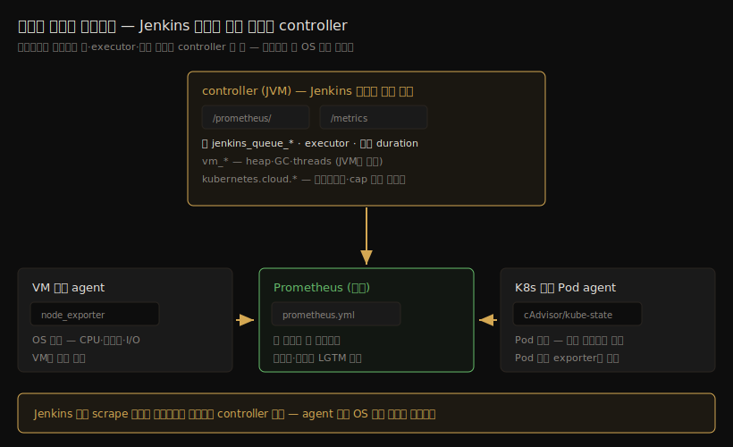

# Jenkins 성능 모니터링 — 지표·수집 토폴로지·부하 실측

---

> 이 문서를 읽고 나면 Jenkins 성능 지표를 큐·executor·빌드·controller 자원 네 그룹으로 *분류* 하고, 대량 동시 트리거와 무거운 스크립트라는 두 부하 시나리오에서 어느 지표가 먼저 움직이는지 *예측* 하며, controller/agent가 VM·K8s·혼합인 토폴로지에서 수집 지점을 *설계* 하고, "Jenkins 모니터링 = controller JVM 모니터링"인 이유를 *설명* 할 수 있습니다. 로컬 Docker Jenkins에 200건 부하를 실측한 기록을 포함합니다.


## 사전 지식

> 본 문서는 "메트릭 수집 → 시계열 저장 → 대시보드"라는 일반 관측성 파이프라인(06_observability의 LGTM 스택)을 Jenkins 라는 한 애플리케이션으로 좁혀 본 것입니다. Prometheus·Grafana 자체의 설치·운영은 다루지 않고 [06_observability](../../../06_observability/README.md)에 위임합니다.


## 진입 — 추정식은 출발점이고, 측정이 보정한다

> [06-01](06-01.Jenkins%20서버%20용량%20산정과%20시스템%20요구사항.md)의 용량 추정식은 "동시 요청 ÷ 250 코어, agent 수 × 3MB" 같은 출발점을 줬습니다. 그 편의 결론이 "실제 모니터링 데이터로 보정하는 것이 정석"이었는데, 이 편이 바로 그 *측정* 을 다룹니다.

executor 10개에서 동시에 1,000건·10,000건을 돌리면 무슨 일이 벌어질까요. 추정식만으로는 "executor가 부족해 큐에 쌓인다"까지만 말할 수 있습니다. 측정이 있어야 "트리거 폭주가 초당 몇 건까지 받아지는지", "큐 적재가 controller heap을 몇 %나 밀어 올리는지", "무거운 스크립트가 agent와 controller 중 어느 쪽을 먼저 누르는지"에 숫자로 답할 수 있습니다. 이 편은 그 숫자를 어디서(지표), 어떻게(수집 경로), 어떤 토폴로지에서(VM/K8s/혼합) 얻는지를 정리하고, 마지막에 로컬 Docker Jenkins로 직접 재 봅니다.


## 1. 측정 도구 지형 — 같은 JVM을 세 방식으로 본다

> Jenkins 성능 측정 도구는 셋 다 controller 안에서 돕니다. 역할이 달라서 셋은 경쟁이 아니라 분업 관계입니다.

| 도구 | 형태 | 역할 | 출처 |
|------|------|------|------|
| Metrics 플러그인 | Dropwizard Metrics 기반 계기판 | 큐·executor·빌드·JVM 지표를 *생산*. `/metrics` 서블릿(API key 또는 권한)으로 JSON 노출 | plugins.jenkins.io/metrics |
| Prometheus metrics 플러그인 | `/prometheus/` 엔드포인트 | Metrics 플러그인 지표를 *재수출* + 자체 지표(빌드·executor 라벨별) 추가. Prometheus가 scrape | plugins.jenkins.io/prometheus |
| Monitoring 플러그인 (JavaMelody) | 인스턴스 내장 대시보드 | 외부 시스템 없이 *그 자리에서 심층 진단* — heap histogram, 스레드, GC 실행 액션까지 | plugins.jenkins.io/monitoring |

선택 기준은 단순합니다. 시계열로 쌓아 추세를 보고 경보를 걸려면 Metrics + Prometheus 조합이 표준이고, "지금 당장 이 인스턴스가 왜 느린가"를 파고들 때는 JavaMelody가 빠릅니다. JavaMelody는 외부 시계열 export 없이 인스턴스 안에서 차트·heap histogram·GC 액션을 제공하는 *현장 진단* 도구라서, 둘은 대체재가 아니라 보완재입니다(출처: plugins.jenkins.io/monitoring).

한 가지 운영 캐비엇 — Prometheus 플러그인의 지표 수집은 비동기 주기 작업이고 기본 120초입니다(`COLLECTING_METRICS_PERIOD_IN_SECONDS`, 출처: plugins.jenkins.io/prometheus). 즉 `/prometheus/` 응답은 최대 2분 전의 값일 수 있어, 수 초짜리 스파이크(예: 트리거 폭주 직후의 순간 큐 길이)는 묻힐 수 있습니다. 실시간 관찰이 필요하면 Metrics 플러그인의 `/metrics` 서블릿을 직접 보는 편이 정확합니다 — §6 실습에서 이 차이를 그대로 활용합니다.


## 2. 지표 카탈로그 — 네 그룹이면 대부분의 질문에 답한다

> 지표 이름은 두 벌입니다. Dropwizard 원명(`jenkins.queue.size.value`)과 Prometheus 변환명(`jenkins_queue_size_value`). 아래 표의 이름은 전부 §6 실측 환경의 `/prometheus/` 실응답에서 확인한 것입니다.

| 그룹 | 핵심 지표 (Prometheus 표기) | 답하는 질문 |
|------|------------------------------|-------------|
| 큐 | `jenkins_queue_size_value`, `_buildable_value`, `_blocked_value`, `_pending_value`, `_stuck_value` | 부하가 쌓이고 있는가, 왜 안 빠지는가 |
| executor | `jenkins_executor_count_value`, `_in_use_value`, `_free_value` + 라벨별 `default_jenkins_executors_busy{label=...}` | 실행 슬롯이 포화인가, 어느 라벨이 병목인가 |
| 빌드 | 빌드 duration·결과 히스토그램, `default_jenkins_executors_queue_length{label=...}` | 빌드가 느려지고 있는가, 어느 라벨 대기가 긴가 |
| controller 자원 | `vm_memory_heap_usage`, `vm_gc_*_count`/`_time`, `vm_count`(스레드), HTTP 응답코드 meter | controller 자체가 버티고 있는가 |

(출처: plugins.jenkins.io/metrics — 큐 5종·executor 3종·vm.*·HTTP meter 정의, 실측 교차 확인)

각 그룹의 *의미론* 은 이미 다른 편이 정본입니다. 큐 지표가 가리키는 상태 전이(Waiting/Buildable/Blocked/Left)는 [04_api/05-04](../04_api/05-04.큐%20내부%20흐름과%20실행%20순서.md)가, "큐 깊이를 외부 제어 신호로 쓸 때 K8s에서 달라지는 의미"는 [04_api/05-03 §2-6](../04_api/05-03.Queue%20적재%20이후%20실행%20흐름과%20데이터%20추적.md)이 다룹니다. 이 편은 그 의미를 *측정 가능한 이름* 으로 연결하는 역할입니다.

큐 그룹에서 하나만 짚으면 — `size`와 `buildable`은 다릅니다. `size`는 큐 전체(quiet period 중인 WaitingItem 포함), `buildable`은 실행 조건을 갖추고 executor만 기다리는 아이템입니다. §6 실측에서 트리거 직후 `size=200, buildable=0`이었다가 quiet period가 끝나며 `buildable`로 옮겨 가는 장면이 그대로 잡힙니다.


## 3. 시나리오별 신호 해석 — 무엇이 먼저 움직이는가

> 부하의 *모양* 에 따라 먼저 움직이는 지표가 다릅니다. 대량 트리거는 controller를, 무거운 스크립트는 agent를 먼저 누릅니다.

### 3-1. 대량 동시 트리거 (1,000~10,000건)

수천 건을 한꺼번에 트리거하면 부하는 빌드가 아니라 *적재* 에서 먼저 발생합니다. 큐 아이템과 Run 객체는 controller JVM heap 안에 살고 큐에는 상한이 없으므로([05-04 §3-5](../04_api/05-04.큐%20내부%20흐름과%20실행%20순서.md) — Queue.java 무상한), 적재가 커질수록 heap이 먼저 압박을 받습니다. executor가 아무리 많아도 트리거 수신(HTTP)·큐 등록·`maintain()` 스케줄링은 전부 controller 몫이라, *agent보다 controller가 먼저 죽는* 구조입니다.

봐야 할 지표 순서는 다음과 같습니다.

1. `jenkins_queue_size_value` 곡선 — 적재 속도와 드레인 속도의 차이가 그대로 보입니다. 드레인 속도는 "executor 수 × (1/평균 빌드 시간)"으로 수렴합니다(§6 실측에서 이론값과 일치 확인).
2. `vm_memory_heap_usage` — 트리거 폭주 순간의 스파이크와, 적재가 유지되는 동안의 기저선 상승을 함께 봅니다.
3. HTTP 응답코드 meter — 폭주 구간에서 4xx/5xx가 섞이기 시작하면 수신 한계입니다.
4. `vm_gc_*_time` 증가율 — GC가 잦아지면 스케줄링(`maintain()`)도 같이 멈춘다는 뜻입니다(§5).

10,000건급에서는 측정과 함께 *적재 자체의 제어* 가 필요합니다. Jenkins는 큐가 차도 거부하지 않으므로, 호출 측 게이트(큐 적재 수 + busy executor 합산)가 1차 방어선입니다 — 설계는 [05-03 §2-6](../04_api/05-03.Queue%20적재%20이후%20실행%20흐름과%20데이터%20추적.md) 참조.

### 3-2. 무거운 스크립트 (한 빌드가 자원을 많이 쓰는 경우)

빌드 스크립트가 무거우면 압박 지점이 agent 쪽 OS 계층으로 내려갑니다. Jenkins 지표만으로는 "빌드가 느리다"(duration 증가)까지만 보이고, *왜* 느린지는 agent 노드의 CPU·메모리·디스크 I/O가 말해 줍니다. 이 계층은 Jenkins 플러그인이 아니라 OS/컨테이너 수집기(§4)의 영역입니다.

| 신호 | 지표 | 해석 |
|------|------|------|
| 빌드가 길어짐 | 빌드 duration 히스토그램 | 같은 Job의 p95가 밀리면 스크립트 또는 agent 자원 문제 |
| executor 점유 장기화 | `jenkins_executor_in_use_value` 고원 | 슬롯 회전이 멈춰 뒤 빌드가 큐에 적체 |
| agent 자원 포화 | node_exporter·cAdvisor의 CPU·메모리·IO | 원인 계층 — Jenkins 지표가 아니라 OS 지표 |
| controller 부담 동반 상승 | heap·HTTP | 무거운 빌드도 로그 스트리밍·상태 추적은 controller를 거침 |

executor 수를 늘려서 해결할 문제인지(코어 수 대비 과커밋 점검), 스크립트를 고칠 문제인지를 이 조합으로 가립니다. executor 수 가이드는 [05-04 §7-6](../04_api/05-04.큐%20내부%20흐름과%20실행%20순서.md)이 정본입니다.


## 4. 토폴로지별 수집 설계 — controller가 단일 소스다

> controller/agent가 VM이든 K8s든 혼합이든, **Jenkins 지표(큐·executor·빌드)는 전부 controller 한 곳에서 나옵니다.** 토폴로지에 따라 달라지는 것은 OS·컨테이너 계층의 수집 방법뿐입니다.

큐와 executor 배정은 controller JVM 안의 일이므로([05-04 §5-0](../04_api/05-04.큐%20내부%20흐름과%20실행%20순서.md)), agent가 어디에 몇 개 있든 `/prometheus/` scrape 대상은 controller 하나입니다. 이 단순함이 혼합 토폴로지에서도 유지된다는 점이 설계의 출발점입니다.



| 계층 | VM (정적 agent) | K8s (동적 Pod agent) | 혼합 |
|------|----------------|---------------------|------|
| Jenkins 지표 | controller `/prometheus/` 하나 | 동일 | 동일 — 변하지 않음 |
| agent OS 지표 | node_exporter를 각 VM에 상주 | Pod가 휘발이라 Pod 단위 exporter 불가 — 노드의 cAdvisor·kube-state-metrics로 컨테이너 계층 수집 | 두 방식 병행 |
| 프로비저닝 지표 | (해당 없음 — 슬롯 고정) | kubernetes plugin이 controller 쪽에서 노출 | K8s 부분만 |

K8s 동적 Pod에서 주의할 점은 *Pod의 휘발성* 입니다. 빌드마다 생겼다 사라지는 Pod에 exporter를 붙여 개별 scrape하는 설계는 성립하지 않으므로, 컨테이너 자원은 노드 계층(cAdvisor)에서 잡고 "어느 빌드의 Pod였는지"는 라벨로 연결합니다. 대신 Kubernetes plugin이 프로비저닝 자체를 지표로 노출합니다 — `kubernetes.cloud.pods.created`/`launched`/`terminated`, `kubernetes.cloud.provision.failed`, 그리고 `kubernetes.cloud.provision.reached.pod.cap`/`reached.global.cap`(출처: jenkinsci/kubernetes-plugin `MetricNames.java`). 마지막 두 개가 특히 유용합니다. [05-03 §2-6](../04_api/05-03.Queue%20적재%20이후%20실행%20흐름과%20데이터%20추적.md)의 "cap 도달 시 초과분이 큐에 쌓인다"는 동작을, 추측이 아니라 *cap 도달 카운터* 로 직접 관측할 수 있기 때문입니다.

수집 이후의 저장·대시보드·경보는 Jenkins 특수성이 없는 일반 관측성 영역이므로 [06_observability](../../../06_observability/README.md)(LGTM 스택)에 위임합니다.


## 5. Jenkins의 JVM을 봐야 하는가 — 예, 그것이 본체다

> "Jenkins 성능을 보려면 JVM까지 봐야 하나"라는 질문의 답은 *예* 입니다. 더 정확히는, controller 성능 모니터링의 본체가 JVM 모니터링입니다.

이유는 구조에 있습니다. 큐 상태 전이(`maintain()`), executor 배정, 동적 agent 프로비저닝(`NodeProvisioner`), HTTP 처리까지 전부 controller JVM 한 프로세스 안에서 돕니다([05-04 §5-0](../04_api/05-04.큐%20내부%20흐름과%20실행%20순서.md), javadoc.jenkins.io `hudson.slaves.NodeProvisioner`). 그래서 **GC pause는 곧 스케줄링 정지** 입니다 — heap이 부족해 Full GC가 잦아지면 빌드를 한 건도 돌리지 않아도 큐가 빠지지 않고 UI가 굳습니다. 큐 아이템이 heap 안에 사는 무상한 구조([05-04 §3-5](../04_api/05-04.큐%20내부%20흐름과%20실행%20순서.md))까지 겹치면, 대량 적재 → heap 압박 → GC 증가 → 스케줄링 지연 → 큐 더 적체라는 되먹임이 생깁니다.

측정할 JVM 지표는 Metrics 플러그인의 `vm.*` 세트로 충분합니다(출처: plugins.jenkins.io/metrics).

| 지표 | 보는 것 | 경고 신호 |
|------|---------|----------|
| `vm_memory_heap_usage` | heap 사용률 (0~1) | 기저선이 부하 후에도 안 내려오면 누수 의심 |
| `vm_gc_*_count` / `_time` | GC 횟수·누적 시간 | time 증가 기울기가 가팔라지면 pause 압박 |
| `vm_count` | 스레드 수 | 비정상 증가는 plugin·remoting 누수 |
| file descriptor·deadlock 게이지 | fd 고갈·교착 | 한 번이라도 잡히면 즉시 조사 |

agent JVM은 보조입니다. agent 프로세스는 배정받은 빌드를 실행하고 로그를 controller로 보내는 역할이라, agent JVM 자체보다 그 *머신의 OS 자원*(§3-2)이 먼저 신호를 줍니다. 한쪽 agent의 remoting 채널이 끊기는 문제는 JVM 지표보다 노드 online/offline 지표로 잡는 편이 빠릅니다.

역할 분담을 분명히 하면 — JVM *튜닝*(heap 크기·G1GC·HeapDump 플래그)은 [06-01 §4](06-01.Jenkins%20서버%20용량%20산정과%20시스템%20요구사항.md)가 다루고, 이 편은 그 튜닝이 효과가 있었는지 확인하는 *측정* 을 다룹니다. 측정 없는 튜닝은 감이고, 튜닝 없는 측정은 구경입니다.


## 6. 실습 — 로컬 Docker Jenkins 200건 부하 실측

> 이 절의 수치는 전부 실제 실행 기록입니다. 환경: Jenkins 2.541.3(`jenkins/jenkins:lts-jdk17`), metrics 4.2.37, prometheus 852.v317db, built-in node executor 2, macOS Docker 28.4.0.

[07_engine 01-01](../07_engine/01-01.로컬%20Docker%20Jenkins%20+%20소스%20디버깅%20환경.md)의 로컬 Docker 방식을 따르되, 실습 자동화를 위해 셋업 마법사를 끈 1회용 전용 컨테이너를 씁니다. 보안이 비활성이므로 외부 노출 금지, 실습 후 삭제가 전제입니다.

### 6-1. 기동과 플러그인 설치

```bash
# 왜 runSetupWizard=false: 계정 셋업 없이 API 실습 — 보안 비활성이므로 로컬 1회용 전용
docker run -d --name jenkins-metrics -p 8090:8080 \
  -e JAVA_OPTS="-Djenkins.install.runSetupWizard=false" \
  jenkins/jenkins:lts-jdk17

# 기동 대기 후 플러그인 설치 → 재시작으로 반영
docker exec jenkins-metrics jenkins-plugin-cli --plugins metrics prometheus
docker restart jenkins-metrics
```

### 6-2. 두 엔드포인트 확인

```bash
# Prometheus 텍스트 포맷 (수집 주기 120초 — 첫 응답까지 지연 가능)
curl -s http://localhost:8090/prometheus/ | grep -E "^jenkins_queue|^default_jenkins_executors"

# 실시간 JSON (Dropwizard 원본 — 즉시 반영, 부하 관찰은 이쪽)
curl -s http://localhost:8090/metrics/currentUser/metrics | jq '.gauges["jenkins.queue.size.value"]'
```

실측 환경의 `/prometheus/` 응답은 169KB·2,093줄이었고, §2 표의 지표 이름이 모두 실재함을 확인했습니다. 같은 값을 실시간으로 보고 싶을 때 `/metrics` 서블릿을 쓰는 이유는 §1의 120초 수집 주기 때문입니다.

### 6-3. 부하 잡과 트리거 스크립트

core 내장 freestyle 잡(플러그인 불필요)에 `sleep 3` 셸 스텝과 `IDX` 파라미터를 둡니다. 파라미터 값을 다르게 줘야 quiet period 병합([05-04 §7-4](../04_api/05-04.큐%20내부%20흐름과%20실행%20순서.md))을 피해 200개의 독립 큐 아이템이 생깁니다. `<concurrentBuild>true</concurrentBuild>`도 필수입니다 — freestyle 기본값은 동시 실행 금지라 executor가 남아도 한 건씩 돕니다.

```bash
# crumb 발급 (POST 보호 — 03-01 패턴과 동일)
CRUMB=$(curl -s -c cookies.txt http://localhost:8090/crumbIssuer/api/json | jq -r '.crumb')

# 200건 트리거 — IDX를 바꿔 큐 병합 회피
for i in $(seq 1 200); do
  curl -s -o /dev/null -X POST -b cookies.txt -H "Jenkins-Crumb: $CRUMB" \
    --data-urlencode "IDX=$i" \
    "http://localhost:8090/job/LOAD-SLEEP/buildWithParameters"
done
```

### 6-4. 실측 결과

| 시점 | `queue.size` | `queue.buildable` | executor in-use/free | heap | GC young (횟수/누적ms) |
|------|--------------|--------------------|----------------------|------|------------------------|
| t0 기준선 | 0 | 0 | 0 / 2 | 28.4% | 31 / 206 |
| 200건 트리거 | **소요 2초** (약 100건/초 수신) | | | | |
| t1 직후 | **200** | **0** | 0 / 2 | **47.7%** | 31 / 206 |
| t2 +30초 | 185 | 185 | **2 / 0** | 41.0% | 32 / 259 |
| t3 +60초 | 165 | 165 | 2 / 0 | 38.3% | 33 / 279 |
| 잔여 일괄 취소 후 | 0 | 0 | 0 / 2 | (회수 대기) | 35 / 335 |

읽는 법이 이 실습의 본론입니다.

- **t1의 `size=200, buildable=0`** — 트리거 직후 200건 전부 quiet period 중인 WaitingItem이라 size에는 잡히고 buildable에는 안 잡힙니다. §2에서 두 지표를 구분한 이유가 이 한 줄에 들어 있습니다.
- **heap 28.4% → 47.7%** — 빌드를 한 건도 시작하기 전인데 heap이 19%p 뛰었습니다. 큐 아이템 200개와 HTTP 200건 처리가 전부 controller heap의 일이라는 §3-1의 구조를 그대로 보여 줍니다. 1,000건·10,000건이면 이 스파이크가 5배·50배 규모로 닥치는 셈이라, 대량 트리거 설계에서 heap 여유와 호출 측 게이트가 먼저인 이유가 됩니다.
- **드레인 속도 20건/30초** — executor 2개 × 빌드당 3초 = 이론값 그대로입니다. 큐 곡선의 기울기가 "executor 수 × (1/빌드 시간)"으로 수렴한다는 §3-1 공식의 실측 확인입니다. 200건을 다 빼려면 약 10분 — executor 10개면 2분. 이 산수가 용량 계획(06-01)과 측정을 잇는 다리입니다.
- **GC young 31→35회, 206→335ms** — 부하 구간에서 GC 누적 시간이 60% 늘었습니다. 이 규모에선 무해하지만, 기울기가 가팔라지는 순간이 §5의 되먹임(GC ↔ 스케줄링 지연)이 시작되는 지점입니다.

### 6-5. 정리

```bash
# 잔여 큐 일괄 취소 — id 목록을 받아 cancelItem 반복 (스펙은 04_api/05-05)
curl -s "http://localhost:8090/queue/api/json?tree=items%5Bid%5D" | jq -r '.items[].id' | \
  while read id; do
    curl -s -o /dev/null -X POST -b cookies.txt -H "Jenkins-Crumb: $CRUMB" \
      "http://localhost:8090/queue/cancelItem?id=$id"
  done

# 실습 컨테이너 폐기 (보안 비활성 인스턴스를 남기지 않는다)
docker rm -f jenkins-metrics
```


## 7. 정리

> 결론 한 줄 — *Jenkins 성능 모니터링의 본체는 controller JVM이고, 지표는 네 그룹이면 충분하며, 토폴로지가 바뀌어도 수집 지점은 controller 하나다.*

세 질문에 대한 답을 모으면 다음과 같습니다. 첫째, 대량 트리거는 큐·heap·HTTP(controller 쪽)가, 무거운 스크립트는 duration·agent OS 자원이 먼저 움직입니다. 둘째, VM/K8s/혼합 어디서든 Jenkins 지표는 controller 단일 소스이고 달라지는 건 OS 계층 수집 방법뿐이며, K8s에서는 프로비저닝·cap 도달까지 plugin 지표로 잡힙니다. 셋째, JVM은 "봐야 하는가"가 아니라 본체입니다 — GC pause가 곧 스케줄링 정지이기 때문입니다.


## 면접 질문

> 답을 떠올린 뒤 §정답 절에서 같은 번호로 대조하세요.

1. 빌드를 한 건도 시작하기 전인데 대량 트리거 직후 controller heap이 크게 뛰는 이유는 무엇입니까? *(심화: 큐 지표 중 `size`와 `buildable`이 이 구간에서 다르게 움직이는 이유는?)*
2. controller/agent가 VM과 K8s 혼합일 때, Jenkins 지표 수집 지점은 몇 곳입니까? 토폴로지별로 달라지는 수집은 무엇입니까?
3. "Jenkins 성능을 보려면 JVM을 봐야 하는가"에 구조적 근거를 들어 답해 보세요. *(심화: GC pause가 빌드 처리량에 영향을 주는 경로는?)*

### 빈칸 채우기 — 지표와 수집

다음 빈칸을 채워 보세요. 정답은 문서 끝 "빈칸 정답" 절에 있습니다.

1. Prometheus 플러그인의 지표 수집 주기 기본값은 `______`초라서, 수 초짜리 스파이크 관찰에는 Metrics 플러그인의 `______` 서블릿이 적합합니다.
2. 큐 지표에서 quiet period 중인 아이템은 `jenkins_queue_______value`에는 잡히지만 `jenkins_queue_______value`에는 잡히지 않습니다.
3. K8s 동적 Pod 환경에서 cap 도달을 직접 관측하는 kubernetes plugin 지표는 `kubernetes.cloud.provision.reached.______`입니다.
4. 큐 드레인 속도는 대략 "`______` 수 × (1 ÷ 평균 빌드 시간)"으로 수렴합니다.


## 정답

> 위 질문을 스스로 설명해 본 뒤에 펼치세요.

### 정답 1 — 트리거 직후 heap 스파이크

큐 아이템과 그 처리(HTTP 수신·큐 등록)가 전부 controller JVM heap 안의 일이기 때문입니다. 실측에서 200건 트리거(2초) 직후 heap이 28.4%→47.7%로 뛰었는데, 이 시점 executor는 아직 0건 사용 중이었습니다. 빌드가 아니라 *적재* 가 먼저 controller를 누릅니다.

### 정답 1 심화 — size vs buildable

트리거 직후 아이템은 quiet period 중인 WaitingItem이라 큐 전체 수(`size`)에는 잡히지만 실행 가능 수(`buildable`)에는 잡히지 않습니다. 실측에서 t1에 `size=200, buildable=0`, quiet period가 끝난 t2에 둘 다 185로 합류했습니다. 상태 전이의 정본은 05-04 §3입니다.

### 정답 2 — 혼합 토폴로지의 수집 지점

Jenkins 지표(큐·executor·빌드)는 토폴로지와 무관하게 **controller 한 곳**(`/prometheus/`)입니다. 달라지는 것은 OS 계층 — VM agent는 node_exporter 상주, K8s 동적 Pod는 휘발이라 노드의 cAdvisor·kube-state-metrics로 컨테이너 계층을 수집하고, 프로비저닝·cap 도달은 kubernetes plugin 지표(`kubernetes.cloud.*`)로 controller 쪽에서 잡습니다.

### 정답 3 — JVM이 본체인 이유

큐 상태 전이(`maintain()`)·executor 배정·동적 프로비저닝(`NodeProvisioner`)·HTTP 처리가 전부 controller JVM 한 프로세스 안에서 돌기 때문입니다. JVM이 멈추면 빌드를 안 돌려도 전체가 멈춥니다.

### 정답 3 심화 — GC pause → 처리량 경로

GC pause 동안 `maintain()` 루프와 HTTP 처리가 함께 정지하므로, 큐에서 executor로 넘기는 속도 자체가 떨어집니다. heap 압박 → GC 증가 → 스케줄링 지연 → 큐 적체 → (큐 아이템도 heap에 살므로) heap 추가 압박이라는 되먹임이 생길 수 있어, `vm_gc_*_time`의 기울기를 경고 신호로 봅니다.

### 빈칸 정답 — 지표와 수집

1. `120` / `/metrics` — `COLLECTING_METRICS_PERIOD_IN_SECONDS` 기본 120초(출처: plugins.jenkins.io/prometheus).
2. `size` / `buildable` — quiet period 중 WaitingItem은 size에만 잡힙니다.
3. `pod.cap` (전역은 `global.cap`) — 출처: jenkinsci/kubernetes-plugin MetricNames.java.
4. `executor` — 실측: executor 2 × 3초 빌드 = 20건/30초 드레인.


## 관련 문서

> 이 편은 "측정"을 다룹니다. 측정값을 해석하는 의미론과 측정 대상의 설정은 아래 편들이 정본입니다.

- [06-01. Jenkins 서버 용량 산정과 시스템 요구사항](06-01.Jenkins%20서버%20용량%20산정과%20시스템%20요구사항.md) § "JVM 튜닝" — 측정 전 단계인 용량 추정식과 heap·GC 튜닝 플래그
- [04_api/05-03. Queue 적재 이후 실행 흐름과 데이터 추적](../04_api/05-03.Queue%20적재%20이후%20실행%20흐름과%20데이터%20추적.md) § "2-6 큐 깊이 게이트" — 측정값을 외부 제어 신호로 쓸 때의 VM/K8s 차이
- [04_api/05-04. 큐 내부 흐름과 실행 순서](../04_api/05-04.큐%20내부%20흐름과%20실행%20순서.md) § "3-5 큐 상한 없음 / 7-6 executor 성능" — 큐·executor 지표의 의미론 정본
- [07_engine/01-01. 로컬 Docker Jenkins + 소스 디버깅 환경](../07_engine/01-01.로컬%20Docker%20Jenkins%20+%20소스%20디버깅%20환경.md) — 실습 컨테이너 방식의 원형
- [06_observability](../../../06_observability/README.md) — 수집 이후의 저장·대시보드·경보 (LGTM 스택 정본)
