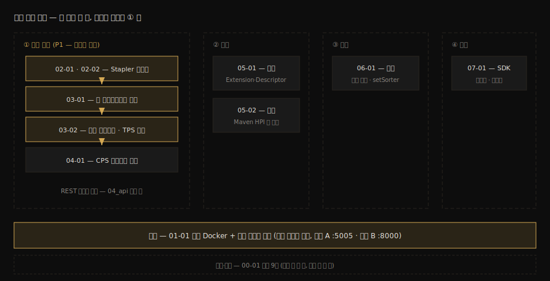

# 엔진 묶음 점검 — 핵심 질문과 답

---

> 이 문서는 엔진 묶음(`07_engine`) 전체를 가로지르는 핵심 질문 9개의 자가 점검 자리입니다. 묶음 진입 전에 한 번 풀어 현재 위치를 재고, 완주 후 다시 풀어 변화를 확인합니다.

## 점검 사용법

> 답을 보지 않고 먼저 소리 내어 답해 봅니다. 막히는 질문이 곧 읽어야 할 편입니다.

각 질문 아래에 막혔을 때 돌아갈 편을 적어 두었습니다. 진입 전 점검에서 절반 이상 막히는 것이 정상입니다 — 이 묶음이 그 빈칸을 채우는 과정입니다. 완주 후 점검에서도 막히는 질문은 그 편의 §정답만 다시 읽지 말고 본문 §부터 다시 봅니다.

묶음의 전체 지도를 머리에 깔고 시작합니다:

## Q1: Jenkins에는 Spring의 핸들러 테이블 같은 라우팅 등록이 없습니다. `POST /job/foo/build`는 어떻게 자바 메서드에 도달합니까? 그 수신 메서드를 `Jenkins.java`에서 찾으면 왜 없습니까?

→ 막히면 [02-01](02-01.Stapler%20URL%20라우팅%20스펙.md) · [02-02](02-02.Stapler%20라우팅%20디버깅%20실습.md)

## Q2: 큐의 보관함은 상태 전이도의 4칸보다 하나 많습니다. 다섯 번째 보관함의 이름과 실질 역할은 무엇입니까?

→ 막히면 [03-01](03-01.Queue.Task%20라이프사이클%20소스편.md) §2

## Q3: 외부 시스템이 `/queue/api/json`을 아무리 자주 폴링해도 Jenkins 큐 전이가 느려지지 않는 이유를 큐의 동시성 구조로 설명할 수 있습니까?

→ 막히면 [03-01](03-01.Queue.Task%20라이프사이클%20소스편.md) §4

## Q4: buildable 아이템이 실행기를 만나는 두 단계는 무엇이며, 기본 배정 전략이 라운드로빈이 아니라 일관 해시인 이유는 무엇입니까?

→ 막히면 [03-02](03-02.Executor%20배정%20알고리즘과%20TPS%20대조.md) §1·§2

## Q5: "배정 결정은 직렬화한다"는 불변식을 Jenkins는 무엇으로 공짜로 얻고, 다중 인스턴스 디스패처(분산 호출자)는 무엇으로 값을 치르고 삽니까? 큐 적재 한도는 누구 책임입니까?

→ 막히면 [03-02](03-02.Executor%20배정%20알고리즘과%20TPS%20대조.md) §3·§4

## Q6: freestyle 빌드는 재기동에 죽는데 Pipeline은 살아남습니다. 실행 상태의 거처가 어떻게 다르며, `program.dat`와 pickle은 각각 무슨 역할입니까?

→ 막히면 [04-01](04-01.FlowExecution%20영속화와%20재개.md)

## Q7: 확장 계약의 3단계(정의·등록·발견)를 코드 수준으로 말할 수 있습니까? Describable과 Descriptor는 왜 둘로 나뉘며 각각 몇 개 만들어집니까?

→ 막히면 [05-01](05-01.Extension%20Point와%20Describable%20스펙.md) · [05-02](05-02.첫%20플러그인%20제작%20%28Maven%20HPI%29.md)

## Q8: Script Console에서 모델을 바꿀 때 지켜야 할 엔진 규칙 두 가지는 무엇이며, "Jenkins 큐는 FIFO"라는 명제는 어떤 확장점 때문에 조건부입니까?

→ 막히면 [06-01](06-01.Script%20Console%20심화%20제어.md)

## Q9: 프록시 뒤의 Jenkins에서 빌드 트리거 응답의 `Location`이 내부 주소로 나옵니다. 어떤 헤더 계약이 깨진 것이며, 해법의 두 갈래는 무엇입니까?

→ 막히면 [07-01](07-01.외부%20SDK와%20통합%20아키텍처.md) §2

## 정답

> 자답을 마친 뒤에만 읽습니다. 각 정답은 요지이며, 상세는 해당 편이 정본입니다.

### 정답 1 — 그래프 순회와 런타임 클래스

Jenkins에는 라우팅 테이블이 없고, Stapler가 URL 토큰을 들고 루트 객체에서 리플렉션으로 객체 그래프를 한 칸씩 걸어 내려갑니다. `job`·`foo`는 인자 있는 getter 규칙으로 `getJob("foo")`에, `build`는 웹 메서드 규칙으로 `doBuild()`에 닿습니다. 수신자 `getJob`이 `Jenkins.java`에 없는 이유는 리플렉션이 선언 타입이 아니라 *런타임 클래스*를 보기 때문입니다 — 싱글턴의 실제 클래스는 `Jenkins`를 상속한 `Hudson`이고, 그 호환용 getter가 실제 수신자입니다.

### 정답 2 — pendings

`waitingList`·`blockedProjects`·`buildables`에 더해 다섯 번째가 `pendings`입니다 — 실행기 배정은 결정됐지만 실행이 아직 시작되지 않은 찰나의 아이템을 담습니다. 실질 역할의 대표가 동시 빌드 비활성 Job의 중복 방어로, 검사가 `buildables`와 `pendings`를 둘 다 봐야 "배정됐지만 시작 전"인 빌드를 놓치지 않습니다. REST 조회 시야에서는 buildable과 묶여 보여 상태도에서 잘 빠집니다.

### 정답 3 — 변이는 한 락, 조회는 스냅숏

큐의 모든 변이는 단일 `ReentrantLock` 아래에서 직렬로 일어나고, 조회는 변이가 끝날 때마다 갈아 끼워지는 volatile `Snapshot` 복사본을 락 없이 읽습니다. 폴링은 락을 잡지 않으므로 전이 성능에 영향을 주지 못하고, 대가는 수 밀리초 낡은 상태를 볼 수 있다는 것뿐입니다 — 찢어진 중간 상태는 절대 보이지 않습니다.

### 정답 4 — 선별과 결정, 그리고 워크스페이스

1단계는 자격 검사입니다 — `node.canTake`(label·가용성), `QueueTaskDispatcher`(플러그인 거부권), `isAcceptingTasks`(운영 상태)의 세 겹을 통과한 실행기만 후보가 됩니다. 2단계가 선호 결정으로, 기본 `LoadBalancer.CONSISTENT_HASH`가 작업 이름을 키로 해시 링에서 자리를 고릅니다. 일관 해시인 이유는 같은 작업을 같은 노드로 보내 워크스페이스의 체크아웃·캐시를 재사용하기 위해서이고, 노드 증감 시 재배치가 링 일부에 국한된다는 성질이 동적 에이전트 환경과 맞기 때문입니다.

### 정답 5 — 메모리 락과 DB 락, 그리고 호출자의 backpressure

Jenkins는 단일 JVM이라 큐의 `ReentrantLock` 하나로 "결정자는 한 시점에 하나"를 사실상 비용 없이 얻습니다. 다중 인스턴스 디스패처는 인프로세스 락이 인스턴스 경계를 못 넘으므로, 공유 저장소 수준의 직렬화 — DB `SELECT … FOR UPDATE` 비관 락 — 로 같은 불변식을 재현합니다. 큐 적재 한도는 Jenkins가 제공하지 않는 기능이므로(큐는 거절 없이 쌓임) 호출자 책임이며, 큐·executor 상태를 보고 트리거를 보류하는 적재량 게이트를 호출자가 만들어야 합니다.

### 정답 6 — 콜 스택에서 힙으로, 그리고 보관증

freestyle의 실행 상태는 스레드 콜 스택에 살아 JVM과 함께 죽습니다. Pipeline은 스크립트를 CPS 변환해 "다음에 할 일"을 힙의 continuation 객체 그래프로 들게 했고, 힙 객체는 직렬화가 되므로 실행 도중 상태가 빌드 디렉토리의 `program.dat`로 내려갑니다. executor 점유처럼 직렬화 불가능한 라이브 자원은 pickle이라는 직렬화 안전 대체물로 치환됐다가 재기동 후 rehydrate로 실물을 재획득하며, 전부 성공해야 `StepExecution.onResume`과 함께 재개됩니다.

### 정답 7 — 3단 계약과 이중성

정의 — 인터페이스가 `ExtensionPoint`를 상속해 꽂을 자리를 선언합니다. 등록 — 구현체에 `@Extension`을 붙이면 빌드 시점 인덱스에 기록됩니다. 발견 — 소비자가 `ExtensionList.lookup()`으로 설치된 구현 전부를 모읍니다. 사용자가 설정하는 확장은 설정값(사용처마다 다름)과 메타데이터(클래스당 하나)의 요구가 갈라지므로, 전자를 Describable 인스턴스 N개가, 후자를 `@Extension`으로 등록되는 Descriptor 싱글턴 1개가 나눠 듭니다.

### 정답 8 — save()와 withLock, 그리고 QueueSorter

규칙 하나 — 트랜잭션이 없으므로 모델 변경은 메모리에 즉시 반영되지만 `save()`를 불러야 XML로 영속화되고, 빠뜨리면 재기동과 함께 사라집니다. 규칙 둘 — 조회·판단·변경을 잇는 복합 조작은 그 틈에 `maintain()`이 끼어들 수 있으므로 `Queue.withLock`으로 묶어야 정합하며, 락 안에서는 느린 작업을 하지 않습니다. FIFO가 조건부인 이유는 `QueueSorter` 확장점 때문입니다 — `maintain()`이 배정 직전에 설치된 sorter로 buildable을 정렬하므로, FIFO는 "sorter가 없을 때의 기본값"일 뿐이고 `Queue.setSorter`로 즉석 교체까지 가능합니다.

### 정답 9 — X-Forwarded 계약

Jenkins는 리다이렉트 URL을 자기가 아는 자기 주소로 짓는데, 프록시 뒤에서는 그 인식이 외부 접근 주소와 어긋난 것입니다. 해법은 프록시가 응답의 `Location`을 재작성하거나, 요청에 `X-Forwarded-Host`·`X-Forwarded-Port`(프로토콜이 바뀌면 `X-Forwarded-Proto`까지)를 실어 Jenkins가 그 값으로 URL을 재구성하게 하는 두 갈래입니다. 전제로 System 설정의 Jenkins URL이 접근 URL과 일치해야 하며, 어긋나면 관리 화면에 reverse proxy 경고가 뜹니다.

## 관련 문서

> 이 점검은 묶음의 입구이자 출구입니다. 전체 지도와 환경 편으로 시작하고, 완주 후 README의 면접 체크리스트로 마무리합니다.

- [README. 엔진 심화 MOC](README.md) — 학습 순서·우선순위·면접 체크리스트
- [01-01. 로컬 Docker Jenkins + 소스 디버깅 환경](01-01.로컬%20Docker%20Jenkins%20%2B%20소스%20디버깅%20환경.md) — 모든 실습의 전제 환경
- [03-02. Executor 배정 알고리즘과 TPS 대조](03-02.Executor%20배정%20알고리즘과%20TPS%20대조.md) — 이 묶음의 이력서 핵심 편
