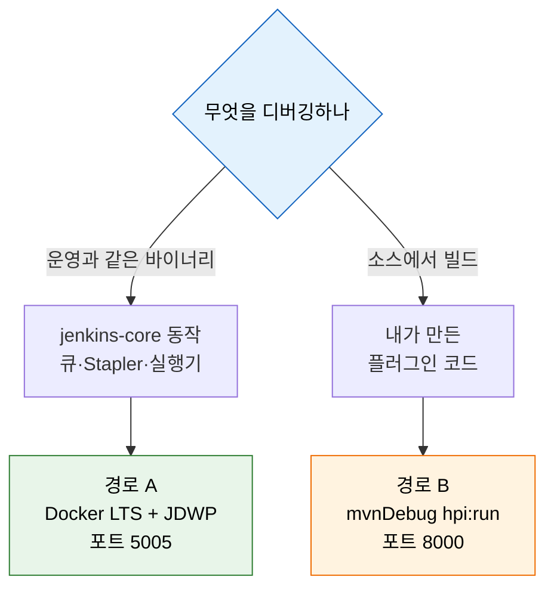
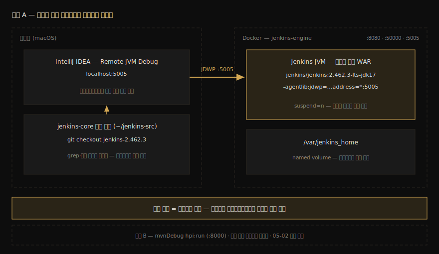

# 로컬 Docker Jenkins + 소스 디버깅 환경

---

> 이 문서를 읽고 나면 로컬 Docker로 버전을 고정한 Jenkins 컨테이너를 띄우고, 그 JVM에 IDE 디버거를 attach해 `jenkins-core`의 실제 메서드에 브레이크포인트를 걸며, `JENKINS_HOME` 디렉토리에서 어떤 상태가 어디에 저장되는지 짚을 수 있습니다. 이 환경이 이후 `02`~`07` 묶음의 모든 소스 관찰 실습의 전제입니다.

## 진입 — 왜 운영계가 아니라 로컬 Docker인가

> [`04_api/01-01`](../04_api/01-01.API%20실습%20환경%20설정.md)은 이미 떠 있는 원격 Jenkins(회사 k8s·BOK)에 curl로 인증하는 환경을 다뤘습니다. 이 묶음은 그 반대입니다. 엔진 *내부*를 멈춰 보려면 디버거를 붙일 수 있고, 깨뜨려도 되는 내 Jenkins가 필요합니다.

호출자 관점의 실습은 남의 서버를 빌려도 됩니다. 빌드를 던지고 로그를 읽는 일은 서버를 망가뜨리지 않으니까요. 그러나 엔진을 들여다보려면 두 가지가 달라집니다. 첫째, JVM에 디버거를 attach하려면 그 JVM의 실행 옵션을 내가 정해야 하는데, 운영계 옵션은 내 마음대로 못 바꿉니다. 둘째, `maintain()` 루프에 브레이크포인트를 걸어 큐를 멈춰 세우는 일은 운영계에서 하면 다른 사람의 빌드가 전부 멈추는 사고입니다.

그래서 이 묶음의 환경은 *내 노트북 안에서 완결*됩니다. 버전을 한 줄로 고정하고, 디버그 포트를 열고, 망가지면 컨테이너만 다시 만들면 됩니다. `04_api/01-01`의 `JENKINS_TARGET='k8s'`가 "어느 원격 서버를 칠까"였다면, 여기서는 "내 컨테이너를 어떤 디버그 옵션으로 띄울까"가 질문입니다.

### 이 문서의 좌표

이 문서는 엔진 묶음의 *바닥*입니다. 이후 `02-02`의 Stapler 라우팅 추적, `03-01`의 큐 상태 전이 관찰, `05-02`의 플러그인 빌드가 모두 여기서 만든 컨테이너와 디버그 연결에 의존합니다. 환경이 한 번 서면 그 위의 실습은 브레이크포인트만 바꿔 가며 진행합니다.

## 사전 지식

> Docker의 `run`·`volume`·`publish` 기본 사용법과, IDE에서 원격 JVM에 attach해 본 경험이 있다면, 이 문서는 그 둘을 "Jenkins라는 한 자바 웹 애플리케이션을 멈춰 가며 읽는 환경"으로 묶은 것입니다.

JDWP(Java Debug Wire Protocol)를 처음 본다면 `1`번 절에서 다루므로 그대로 따라오면 됩니다.

## 1. 디버깅 가능한 Jenkins를 띄우는 두 경로

> 엔진 디버깅에는 두 갈래가 있습니다. 운영과 같은 바이너리에 디버거만 붙이는 길과, 소스를 직접 빌드해 띄우는 길입니다. 목적이 다르므로 둘 다 알아 둡니다.

엔진을 멈춰 보는 방법은 *무엇을 디버깅하려는가*에 따라 갈립니다. 큐·Stapler·실행기 같은 `jenkins-core`의 동작을 보려는지, 아니면 내가 만든 플러그인 코드를 보려는지에 따라 경로가 달라집니다.

| 경로 | 무엇을 디버깅 | 기동 방식 | 디버그 포트 | 이 묶음에서 |
|------|-------------|----------|-----------|-----------|
| A. Docker + JDWP attach | `jenkins-core` 실제 동작 | 공식 LTS 이미지 + `JAVA_OPTS` | `5005` | `02`~`04`, `06` 주력 |
| B. `mvnDebug hpi:run` | 내가 만든 플러그인 | 소스에서 Maven 빌드·기동 | `8000` | `05-02` 플러그인 제작 |

경로 A는 *운영과 같은 바이너리*를 그대로 띄우고 디버거만 붙입니다. LTS 릴리스 WAR가 실제로 어떻게 도는지를 보므로, 큐 동작이나 Stapler 라우팅처럼 "운영 Jenkins가 정말 이렇게 하나"를 확인할 때 정확합니다. 이 묶음의 내부 동작 편(`02`~`04`)은 모두 경로 A를 씁니다.

경로 B는 소스 트리에서 `mvnDebug`로 띄웁니다. 플러그인을 만들면서 내 코드에 브레이크포인트를 걸 때 쓰며, Jenkins 공식 개발 가이드가 권장하는 방식입니다(출처: jenkins.io/doc/developer/development-environment). 기본 디버그 포트가 `8000`이고 `mvnDebug`가 자동으로 그 포트를 엽니다. 경로 B는 `05-02`에서 본격적으로 다루므로, 이 문서는 경로 A를 중심으로 진행합니다.



## 2. 컨테이너 기동 — 버전 고정과 포트 매핑

> 디버깅에서 버전 고정은 선택이 아니라 필수입니다. IDE에 붙일 소스와 컨테이너 안 바이너리의 버전이 어긋나면 브레이크포인트가 엉뚱한 줄에 멈춥니다.

이미지 태그를 `latest`로 두면 안 됩니다. 소스 코드는 특정 버전을 받아 IDE에 열어 두는데, 컨테이너가 그새 다른 버전으로 바뀌면 같은 메서드라도 줄 번호가 달라집니다. 브레이크포인트는 줄 번호에 걸리므로, 버전이 어긋나면 실행이 의도한 곳이 아닌 곳에서 멈추거나 아예 안 멈춥니다. 그래서 태그를 버전으로 못 박는데, 한 가지 함정이 있습니다. `lts-jdk17`도 최신 LTS 릴리스를 따라 움직이는 떠다니는 태그라 완전한 고정이 아닙니다. 실습 시작은 `lts-jdk17`로 받되, 기동 후 컨테이너의 실제 버전을 확인해(§5) 소스를 그 버전 태그로 맞춥니다. 실습이 길어져 컨테이너를 다시 만들 일이 생기면, 그때는 `jenkins/jenkins:2.462.3-lts-jdk17` 같은 정확 버전 태그로 바꿔 핀합니다.

다음은 경로 A의 기동 명령입니다. 일반 실행에 디버그 옵션 한 줄을 더한 형태입니다:

```bash
# 디버그 전용 컨테이너 — 이름·볼륨을 운영 실습과 분리해 섞이지 않게 한다
docker run --name jenkins-engine --detach \
  --publish 8080:8080 \
  --publish 50000:50000 \
  --publish 5005:5005 \
  --volume jenkins-engine-home:/var/jenkins_home \
  --env JAVA_OPTS="-agentlib:jdwp=transport=dt_socket,server=y,suspend=n,address=*:5005" \
  jenkins/jenkins:lts-jdk17
```

각 옵션이 왜 그 값인지가 중요합니다:

- `--publish 8080:8080`은 웹 UI, `50000:50000`은 인바운드 에이전트 포트입니다. 둘은 Jenkins 표준 포트입니다(출처: jenkins.io/doc/book/installing/docker).
- `--publish 5005:5005`는 디버그 포트를 호스트로 꺼냅니다. 이 줄이 없으면 컨테이너 안에서만 디버그 포트가 열려 IDE가 닿지 못합니다.
- `--volume jenkins-engine-home:/var/jenkins_home`은 상태를 named volume에 보존합니다. 컨테이너를 지우고 다시 만들어도 Job·플러그인·설정이 남습니다.
- `JAVA_OPTS`는 Jenkins JVM의 시작 옵션을 주입하는 통로입니다. 공식 문서가 `--env JAVA_OPTS=...` 형태를 보장합니다(출처: jenkins.io/doc/tutorials).

`JAVA_OPTS` 안의 JDWP 옵션은 JVM 표준이라 Jenkins 전용이 아닙니다. 네 토큰의 뜻은 다음과 같습니다:

- `transport=dt_socket`: 소켓으로 디버거와 통신합니다.
- `server=y`: JVM이 디버거의 연결을 *기다리는* 쪽(서버)이 됩니다.
- `suspend=n`: 디버거가 붙을 때까지 *멈추지 않고* 바로 기동합니다. `y`로 두면 Jenkins가 디버거 연결 전까지 시작을 멈추므로, 평소엔 `n`이 편합니다.
- `address=*:5005`: 모든 네트워크 인터페이스의 `5005`에서 디버거를 받습니다. 컨테이너 밖 IDE가 붙으려면 `localhost`가 아니라 `*`이어야 합니다. 이 한 글자가 "왜 IDE가 안 붙지"의 흔한 원인입니다.

## 3. 초기 비밀번호 확인과 첫 로그인

> 처음 기동한 Jenkins는 자동 생성된 관리자 비밀번호를 `JENKINS_HOME` 안에 한 번만 적어 둡니다. 그 파일을 읽어 첫 로그인을 통과합니다.

Jenkins는 최초 기동 시 `secrets/initialAdminPassword`에 일회용 관리자 비밀번호를 만듭니다(출처: jenkins.io/doc/book/managing/system-configuration). 컨테이너 로그나 파일에서 직접 읽습니다:

```bash
# 컨테이너 안의 초기 비밀번호 파일을 직접 읽는다
# 기동 직후엔 아직 안 만들어졌을 수 있어, 안 보이면 몇 초 뒤 다시 본다
docker exec jenkins-engine cat /var/jenkins_home/secrets/initialAdminPassword
```

이 값을 `http://localhost:8080`의 첫 화면에 넣으면 잠금이 풀립니다. 이후 추천 플러그인 설치와 관리자 계정 생성을 마치면 실습 준비가 끝납니다.

## 4. JENKINS_HOME — 엔진의 상태가 사는 곳

> 엔진을 이해하려면 그 상태가 어디 저장되는지부터 봐야 합니다. `JENKINS_HOME`은 Job·빌드·플러그인·크레덴셜 암호화 키가 모두 모인 단일 디렉토리입니다.

Jenkins는 거의 모든 상태를 데이터베이스가 아니라 `JENKINS_HOME` 디렉토리의 파일로 저장합니다. config는 XML, 빌드 기록은 하위 디렉토리, 크레덴셜 복호화 키는 `secrets/`에 둡니다. 이 구조를 알면 "설정을 백업하려면 무엇을 복사하나", "플러그인은 어디 풀리나" 같은 질문에 바로 답할 수 있습니다.

공식 문서가 정리한 주요 구조는 다음과 같습니다(출처: jenkins.io/doc/book/managing/system-configuration):

| 경로 | 무엇이 사는가 | 디버깅에서 |
|------|-------------|-----------|
| `config.xml` | 루트 전역 설정 | 보안·도구 설정의 단일 원본 |
| `jobs/[JOBNAME]/config.xml` | Job별 설정 | `02`에서 Job 객체로 역직렬화되는 원본 |
| `jobs/[JOBNAME]/builds/[ID]/` | 빌드별 기록·로그 | `03`에서 실행 결과가 떨어지는 자리 |
| `plugins/[PLUGIN].jpi` | 설치된 플러그인 | `05`에서 만든 hpi가 풀리는 위치 |
| `secrets/` | 크레덴셜 복호화 키 | `06`에서 Script Console로 건드릴 민감 영역 |

실제로 컨테이너 안에서 구조를 확인합니다:

```bash
# 최상위만 한 단계 본다 — 전체를 풀면 빌드 기록까지 쏟아져 터미널이 오염된다
docker exec jenkins-engine ls -1 /var/jenkins_home
```

`config.xml`·`jobs`·`plugins`·`secrets`가 보이면 정상입니다. 이 디렉토리가 named volume에 묶여 있으므로, 컨테이너를 지워도 이 상태는 보존됩니다.

## 5. 소스 준비 — 코드 분석은 어디서 하는가

> 읽고 검색하는 작업장은 로컬에 클론한 jenkinsci/jenkins 저장소이고, 멈춰 보는 작업장은 그 클론을 연 IDE입니다. 컨테이너 안에는 소스가 없습니다 — 바이너리(WAR)만 돕니다.

"`Queue.java`를 연다", "`maintain()`에 브레이크포인트를 건다"는 말의 작업장이 어디인지 짚고 갑니다. 컨테이너는 실행만 담당하고, 코드 분석은 전부 호스트에서 일어납니다. 소스 읽기와 검색(grep)은 GitHub에서 클론한 저장소가 대상이고, 브레이크포인트는 IDE가 그 클론을 프로젝트로 연 상태에서 소스 줄에 겁니다. IDE는 클래스 이름과 줄 번호를 들고 컨테이너 JVM(5005)과 JDWP로 대화하므로, 소스가 컨테이너 안에 있을 필요가 없습니다.

### 버전 확인과 클론

소스 태그는 컨테이너의 실제 버전과 같아야 합니다(§2). 공식 이미지는 자기 버전을 환경변수로 들고 있어 바로 읽을 수 있습니다:

```bash
# 컨테이너의 실제 Jenkins 버전 — 소스 태그를 정하는 기준값
docker exec jenkins-engine printenv JENKINS_VERSION
# 대안: curl -sI http://localhost:8080/login | grep -i x-jenkins
```

```bash
# 출력이 2.462.3 이었다면 — 소스 태그 형식은 jenkins-<버전>
# --depth 1 로 그 시점 스냅숏만 받아 클론을 가볍게 한다 (히스토리 불필요)
git clone --depth 1 --branch jenkins-2.462.3 \
  https://github.com/jenkinsci/jenkins.git ~/jenkins-src
```

이후 이 묶음의 모든 "소스에서 찾기"는 `~/jenkins-src`가 작업장입니다. 예를 들어 `03-01`에서 다룰 좌표를 미리 확인하고 싶으면 이렇게 칩니다:

```bash
# core 모듈이 jenkins-core — 큐·실행기·Run 이 전부 이 아래에 있다
grep -n "public void maintain" \
  ~/jenkins-src/core/src/main/java/hudson/model/Queue.java
```

### IntelliJ 연결 — 세 단계

1. Open으로 `~/jenkins-src`를 엽니다. Maven 프로젝트로 인식되면 임포트가 끝날 때까지 기다립니다. `core` 모듈이 곧 jenkins-core 소스입니다.
2. Run → Edit Configurations → `+` → Remote JVM Debug 구성을 만들고 host `localhost`, port `5005`를 넣습니다. Debug를 누르면 콘솔에 연결 메시지가 뜹니다.
3. Navigate → Class로 `Queue`를 열어 원하는 줄을 클릭하면 브레이크포인트가 걸립니다. 프로젝트의 소스 줄과 컨테이너 바이너리가 같은 버전이므로 그대로 바인딩됩니다.

Stapler 클래스(`Stapler#service` 등)는 한 가지가 다릅니다. Stapler는 이 저장소의 소스가 아니라 별도 라이브러리 의존성이라, Navigate → Class로 열면 IDE가 디컴파일 화면과 함께 Download Sources 버튼을 보여 줍니다. 한 번 내려받아 두면 라이브러리 소스에도 같은 방식으로 브레이크포인트가 걸립니다.

여기까지의 구성 요소를 한 장으로 모으면 다음과 같습니다:



## 6. 실습 기록 — 디버거 attach와 첫 브레이크포인트

> 환경 검증의 마지막은 IDE를 실제로 붙여 보는 것입니다. 운영과 같은 LTS 바이너리의 `jenkins-core` 메서드에서 실행이 멈추면 환경이 완성된 것입니다.

### 환경

- 호스트: macOS, Docker Desktop
- 이미지: `jenkins/jenkins:lts-jdk17` (버전 고정)
- IDE: IntelliJ IDEA — Remote JVM Debug 설정 (host `localhost`, port `5005`)
- 소스: §5에서 클론한 `~/jenkins-src`를 IntelliJ로 연 상태 (컨테이너 버전과 같은 태그)

### 실습 1: 컨테이너 기동과 디버그 포트 확인

`2`번 절의 명령으로 컨테이너를 띄운 뒤, 디버그 포트가 실제로 열렸는지 확인합니다:

```bash
# 5005 가 LISTEN 상태이고 컨테이너가 떠 있는지 같이 본다
docker ps --filter name=jenkins-engine --format '{{.Names}} {{.Ports}}'
```

**결과:**

```
jenkins-engine 0.0.0.0:5005->5005/tcp, 0.0.0.0:8080->8080/tcp, 0.0.0.0:50000->50000/tcp
```

**분석:**

- `5005->5005`가 보이면 디버그 포트가 호스트로 노출된 것입니다. 이 줄이 없으면 `--publish 5005:5005`를 빠뜨린 것입니다.
- `suspend=n`이라 Jenkins는 디버거 없이도 이미 기동을 마쳤습니다. 웹 UI가 `8080`에서 응답하는지로 교차 확인합니다.

### 실습 2: IDE attach와 브레이크포인트 히트

IntelliJ에서 Remote JVM Debug 구성을 `localhost:5005`로 만들고 Debug를 누릅니다. 콘솔에 연결 성공 메시지가 뜨면, `jenkins-core`의 진입 메서드에 브레이크포인트를 건 뒤 웹 UI에서 아무 페이지나 엽니다.

Stapler가 모든 웹 요청을 받는 진입점은 `Stapler.service()`입니다. 여기에 브레이크포인트를 걸고 브라우저로 `http://localhost:8080/`을 새로고침합니다:

```
브레이크포인트 위치: org.kohsuke.stapler.Stapler#service
트리거: 브라우저에서 http://localhost:8080/ 요청
```

**결과:**

- 브라우저가 응답을 기다리며 멈추고, IDE가 `Stapler.service()`의 브레이크포인트에서 실행을 정지합니다.
- 호출 스택(Call Stack)에 서블릿 필터 체인부터 Stapler 진입까지가 쌓여 보입니다.

**분석:**

- 실행이 멈췄다는 것은 *IDE 소스와 컨테이너 바이너리의 버전이 맞다*는 증거입니다. 버전이 어긋났다면 브레이크포인트가 회색(미해결)으로 남거나 엉뚱한 줄에서 멈춥니다.
- 이 호출 스택이 곧 `02-01`의 주제입니다. 모든 URL 요청이 `Stapler.service()`로 들어와 객체 그래프를 타고 내려간다는 사실을 여기서 눈으로 확인했습니다.
- 디버깅이 끝나면 브레이크포인트를 풀어 둡니다. 켜 둔 채로 두면 다음 실습에서 페이지를 열 때마다 멈춰 헷갈립니다.

## 7. 정리와 다음 단계

> 환경이 한 번 서면 이후 실습은 컨테이너를 재사용하고 브레이크포인트만 바꿉니다. 깨졌을 때의 복구도 단순합니다.

컨테이너가 꼬이면 상태는 named volume에 있으므로 컨테이너만 다시 만들면 됩니다:

```bash
# 컨테이너만 제거 — 볼륨(jenkins-engine-home)은 남아 상태가 보존된다
docker rm -f jenkins-engine
# 2번 절의 docker run 을 다시 실행하면 같은 상태로 복구된다
```

상태까지 완전히 초기화하려면 볼륨도 지웁니다(`docker volume rm jenkins-engine-home`). 파괴적 실습(`06-01`)을 하기 전에 이 초기화 방법을 알아 두면 마음 놓고 깨뜨려 볼 수 있습니다.

다음은 `02-01`입니다. 실습 2에서 멈춰 본 `Stapler.service()`가 URL을 어떻게 자바 메서드로 바꾸는지, 그 리플렉션 기반 라우팅을 스펙으로 파고듭니다.

## 면접에서 받을 만한 질문

> 환경 구성의 결정들은 면접에서 "왜 그렇게 했는가"로 이어집니다. 아래 4개에 먼저 스스로 답해 보고, 자답이 끝나면 다음 절로 내려갑니다.

1. JDWP 옵션의 `suspend=y`와 `suspend=n`은 무엇이 다르며, 평소 실습에 `n`을 쓰는 이유는 무엇입니까?
2. 디버그 포트를 `address=localhost:5005`가 아니라 `address=*:5005`로 여는 이유는 무엇입니까? 컨테이너 환경에서 이 차이가 왜 중요합니까?
3. 디버깅 실습에서 이미지 태그를 `latest`가 아니라 `lts-jdk17`처럼 고정해야 하는 이유는 무엇입니까?
4. `jenkins-core` 동작을 볼 때 경로 A(Docker + JDWP)를, 내 플러그인을 볼 때 경로 B(`mvnDebug`)를 쓰는 이유를 각각의 디버깅 대상으로 설명해 보십시오.

## 정답 (자답 후 펼치기)

> 위 §면접에서 받을 만한 질문의 4개에 *먼저 자답한 뒤* 아래를 읽으십시오. 자답 없이 먼저 읽으면 학습 효과가 0입니다.

### 정답 1 — suspend y와 n의 차이

`suspend=y`는 JVM이 디버거가 붙을 때까지 *기동을 멈추고 기다립니다*. 애플리케이션의 가장 이른 초기화 코드부터 디버깅하려면 `y`가 필요합니다. `suspend=n`은 디버거 연결과 무관하게 *바로 기동*하고, 디버거는 나중에 아무 때나 붙습니다. 평소 실습은 Jenkins가 일단 떠 있고 웹 UI를 쓰다가 필요할 때 attach하는 흐름이므로 `n`이 편합니다. Jenkins 부팅 자체(플러그인 로딩 등)를 디버깅할 일이 생기면 그때만 `y`로 바꿉니다.

### 정답 2 — address가 localhost가 아니라 별표인 이유

`address=localhost:5005`는 디버그 포트를 컨테이너 내부의 루프백 인터페이스에만 엽니다. 그러면 같은 컨테이너 안에서만 디버거가 닿고, 컨테이너 밖 호스트의 IDE는 `--publish`로 포트를 꺼내도 실제 연결이 거부됩니다. `address=*:5005`는 모든 인터페이스에 열어 호스트의 IDE가 매핑된 포트로 붙을 수 있게 합니다. 컨테이너는 IDE와 다른 네트워크 네임스페이스에 있으므로, "디버거가 안 붙는다"는 증상의 흔한 원인이 바로 이 `localhost` 바인딩입니다.

### 정답 3 — 이미지 태그를 고정하는 이유

브레이크포인트는 소스의 *줄 번호*에 걸립니다. IDE에 연 소스와 컨테이너 안에서 도는 바이너리의 버전이 다르면, 같은 메서드라도 줄 번호가 어긋나 실행이 의도한 곳이 아닌 곳에서 멈추거나 브레이크포인트가 미해결로 남습니다. `latest`는 시점에 따라 다른 버전을 받으므로, 어제 건 브레이크포인트가 오늘 안 맞을 수 있습니다. `lts-jdk17` 같은 고정 태그로 소스와 바이너리를 한 버전에 묶어야 디버깅이 신뢰할 수 있게 됩니다.

### 정답 4 — 경로 A와 B를 나눠 쓰는 이유

경로 A(Docker + JDWP)는 운영과 같은 LTS 릴리스 WAR를 그대로 띄우고 디버거만 붙입니다. 큐·Stapler·실행기처럼 *Jenkins 본체가 어떻게 도는가*를 볼 때, 운영과 동일한 바이너리를 관찰하므로 "운영도 정말 이렇게 도나"에 정확히 답합니다. 경로 B(`mvnDebug hpi:run`)는 소스 트리에서 Maven으로 빌드해 띄우므로, 내가 작성 중인 *플러그인 코드*에 브레이크포인트를 걸 때 적합하고 Jenkins 공식 개발 가이드가 권장하는 방식입니다. 디버깅 대상이 본체면 A, 내 확장 코드면 B로 가릅니다.

## 관련 문서

> 이 문서는 엔진 묶음의 환경 바닥입니다. 호출자 관점의 환경과 대비해 보고, 여기서 만든 디버그 연결을 처음 쓰는 Stapler 편으로 넘어가면 흐름이 이어집니다.

- [README. 엔진 심화 MOC](README.md) — 이 환경 위에 올라가는 `02`~`07` 전체 지도
- [04_api 01-01. API 실습 환경 설정](../04_api/01-01.API%20실습%20환경%20설정.md) — 원격 서버에 curl 인증하는 호출자 관점 환경. 이 문서와 정반대 입장
- [04_api 05-04. 큐 내부 흐름과 실행 순서](../04_api/05-04.큐%20내부%20흐름과%20실행%20순서.md) — `03-01`에서 이 디버그 환경으로 직접 멈춰 볼 큐 동작의 조회 관점 정본
