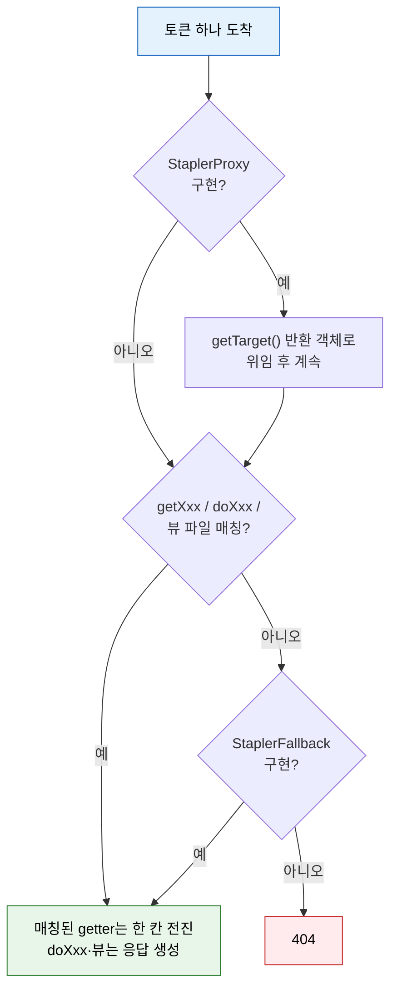
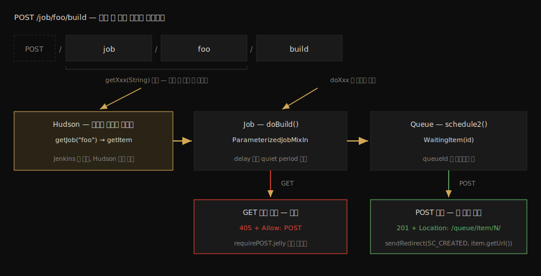
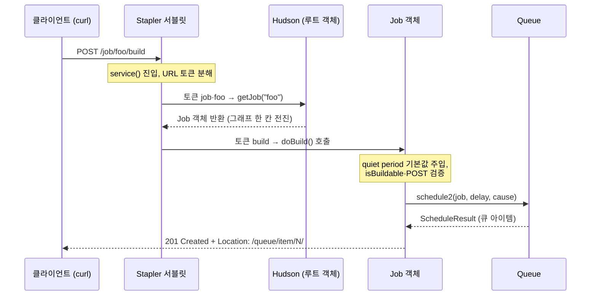

# Stapler URL 라우팅 스펙

---

> 이 문서를 읽고 나면 Stapler가 URL 토큰 하나를 어떤 우선순위로 메서드·뷰에 매핑하는지 나열하고, `POST /job/{name}/build` 요청이 `Hudson.getJob()` → `ParameterizedJobMixIn.doBuild()` → `Queue.schedule2()`에 도달하는 경로를 소스로 짚으며, GET으로 치면 왜 405가 돌아오는지 코드 분기로 설명할 수 있습니다.

## 진입 — Jenkins에는 라우팅 테이블이 없다

> Spring MVC는 `@RequestMapping`을 모아 핸들러 테이블을 만들고 URL을 그 표에서 찾습니다. Jenkins에는 그 표가 없습니다. 살아 있는 객체 그래프 그 자체가 라우팅 테이블입니다.

[`04_api`](../04_api/README.md)에서 우리는 `/job/TF-TEST/job/outbox-echo-test/build` 같은 URL을 수십 번 호출했습니다. 그때 폴더가 중첩될 때마다 `/job/`이 반복해서 붙는 규칙을 외웠는데, 왜 그런 모양인지는 묻지 않았습니다. 답은 서버 쪽 라우팅 방식에 있습니다. Jenkins는 URL을 표에서 찾는 게 아니라, 루트 객체에서 시작해 토큰 하나마다 getter를 타고 *객체 그래프를 한 칸씩 걸어 내려갑니다*. `/job/A/job/B`의 반복은 "폴더 객체에서 또 `getJob()`을 호출한다"가 URL에 그대로 비친 모양입니다.

이 방식을 구현한 웹 프레임워크가 Stapler입니다. 이름 그대로 객체를 URL에 *스테이플러로 찍듯* 박아 넣습니다. 이 문서는 그 박는 규칙(토큰 해석 규칙)을 스펙으로 정리하고, 우리가 가장 많이 호출한 빌드 트리거 한 건을 소스 끝까지 추적합니다.

### 이 문서의 좌표

`02` 묶음의 스펙편입니다. 여기서 규칙을 읽고, 짝 문서 [`02-02`](02-02.Stapler%20라우팅%20디버깅%20실습.md)에서 같은 경로를 디버거로 멈춰 눈으로 확인합니다.

## 사전 지식

> Spring MVC의 HandlerMapping이 URL을 컨트롤러 메서드에 연결하는 과정을 안다면, Stapler는 그 연결을 "어노테이션 테이블 조회" 대신 "리플렉션으로 객체 그래프 순회"로 푸는 방식입니다.

[`01-01`](01-01.로컬%20Docker%20Jenkins%20%2B%20소스%20디버깅%20환경.md)의 디버그 컨테이너가 떠 있으면 본문의 소스 위치를 바로 브레이크포인트로 확인할 수 있습니다. 없어도 읽기에는 지장이 없습니다.

## 1. Stapler란 무엇인가

> Stapler는 Jenkins가 쓰는 웹 프레임워크로, Jenkins 싱글턴을 컨텍스트 루트 `/`에 묶고 나머지 모든 객체를 "루트에서 getter로 도달 가능한가"로 URL에 묶습니다.

공식 아키텍처 문서는 이렇게 요약합니다. Jenkins 클래스들은 Stapler로 URL에 바인딩되며, 싱글턴 `Jenkins` 인스턴스가 컨텍스트 루트에 바인딩되고, 나머지 객체는 이 루트 객체로부터의 *도달 가능성*에 따라 바인딩됩니다. Stapler는 리플렉션을 써서 임의의 URL을 어떻게 처리할지 재귀적으로 결정합니다(출처: jenkins.io/doc/developer/architecture/web).

"도달 가능성"이 핵심 단어입니다. 어떤 객체가 URL을 갖고 싶다고 등록하는 절차가 따로 없습니다. 루트에서 getter 사슬로 닿을 수만 있으면 그 사슬이 곧 URL입니다. 플러그인이 새 화면과 API를 만들 때 라우팅 설정 파일을 한 줄도 안 쓰는 이유, 그리고 거꾸로 *의도치 않은 public 멤버가 URL로 노출되는 사고*가 가능한 이유가 둘 다 이 한 단어에서 나옵니다.

모든 HTTP 요청의 단일 관문은 `org.kohsuke.stapler.Stapler`라는 서블릿입니다. `service()`가 요청을 받고, `invoke()`가 URL을 토큰으로 쪼개 루트 객체부터 재귀 평가를 시작합니다. [`01-01`](01-01.로컬%20Docker%20Jenkins%20%2B%20소스%20디버깅%20환경.md) 실습 2에서 `Stapler#service`에 브레이크포인트를 걸어 이미 한 번 멈춰 봤습니다.

## 2. 토큰 해석 규칙과 우선순위

> URL 토큰 하나를 두고 Stapler는 getter, 액션 메서드, 뷰 파일 순으로 후보를 찾습니다. 그 전후로 StaplerProxy(최우선)와 StaplerFallback(최후순위)이 끼어들 수 있습니다.

공식 라우팅 문서가 드는 예로, URL `/foo/bar`는 다음 중 어느 방식으로든 처리될 수 있습니다(출처: jenkins.io/doc/developer/architecture/web):

1. 현재 객체에 `getFoo(String)`이 있으면 `bar`를 인자로 넘깁니다. 반환된 객체의 `doIndex(…)`가 응답을 그립니다.
2. `getFoo()`가 있으면 그 반환 객체에서 다음 토큰 `bar`를 다시 해석합니다. `getBar`나 `doBar`를 찾는 식입니다.
3. `getFoo()`의 반환 객체에 `bar.jelly` 같은 뷰 파일이 있으면 그 뷰를 렌더링합니다.
4. `doFoo()`가 있으면 액션 메서드로 호출합니다. `do` 접두사가 붙은 메서드를 웹 메서드라 부릅니다.

여기에 객체가 구현할 수 있는 보조 인터페이스 세 개가 우선순위의 양 끝을 잡습니다(출처: jenkins.io/doc/developer/handling-requests/routing):

| 인터페이스 | 우선순위 | 역할 | 대표 사용처 |
|-----------|---------|------|-----------|
| `StaplerProxy` | 모든 방식 중 최우선 | `getTarget()`이 돌려준 객체에 나머지 URL 처리를 위임 | `getTarget()`에서 권한 검사 후 `this` 반환 — 권한 없으면 그 객체의 어떤 getter·뷰에도 접근 불가 |
| `StaplerOverridable` | 관례 탐색 앞 | 지정한 오버라이드 객체가 먼저 처리 기회를 받고, 없으면 호스트 객체가 처리 | 선택적 URL 가로채기 |
| `StaplerFallback` | 모든 방식 중 최후순위 | 다른 후보가 다 실패하면 위임 대상이 처리 | 마지막 안전망 |

토큰 하나의 해석 흐름을 그림으로 정리하면 다음과 같습니다:



`StaplerProxy`의 권한 검사 관용구는 외워 둘 가치가 있습니다. `getTarget()` 안에서 `checkPermission()`을 던지고 `this`를 반환하면, 권한 없는 사용자는 그 객체 아래의 *모든* URL에서 차단됩니다(출처: jenkins.io/doc/developer/handling-requests/routing). URL마다 검사 코드를 박는 대신 그래프의 길목 하나를 막는 방식입니다.

### 파생 이론 — 리플렉션 라우팅의 거래

이 설계가 명시적 라우팅 테이블과 맞바꾼 것을 정리해 둘 필요가 있습니다. 얻은 것은 확장성입니다. 플러그인은 객체를 그래프에 노출하기만 하면 URL·API·화면을 한 번에 얻습니다. 잃은 것은 *기본 폐쇄*입니다. 테이블 방식은 등록한 URL만 열리지만, 도달 가능성 방식은 public getter가 곧 잠재적 URL이라 기본이 열림입니다. 그래서 Jenkins는 라우팅 가능한 메서드 시그니처를 제한하는 보안 규칙을 역사적으로 계속 조여 왔고, `StaplerProxy` 권한 관용구 같은 길목 차단이 표준 수비가 됐습니다. `02_security` 묶음에서 본 웹 계층 방어가 왜 그 모양인지가 이 거래로 설명됩니다.

## 3. 실전 추적 — POST /job/foo/build의 전체 여정

> 04_api에서 수십 번 호출한 빌드 트리거가 서버 안에서 밟는 경로를 소스 좌표로 따라갑니다. 끝에서 `201 Created`와 `Location` 헤더가 태어나는 줄을 만납니다.

여정 전체를 한 장으로 먼저 잡아 둡니다. 아래 절들은 이 그림을 왼쪽 위에서 오른쪽 아래로 따라갑니다:



### 3-1. 토큰 job/foo — 수신자는 Jenkins가 아니라 Hudson

첫 토큰 `job`과 다음 토큰 `foo`는 §2의 규칙 1(인자 있는 getter)로 풀립니다. 그런데 수신자가 의외입니다. master 기준 `jenkins/core` 소스에서 `getJob`은 `Jenkins.java`에 없고 `Hudson.java`에 있습니다:

```java
// Hudson.java — 싱글턴의 런타임 클래스는 Jenkins가 아니라 이를 상속한 Hudson 이다
public class Hudson extends Jenkins {
    // Stapler 의 getXxx(String) 관례가 이 메서드를 찾는다
    // /job/foo → getJob("foo") → 내부적으로는 이름 기반 getItem 위임
    public TopLevelItem getJob(String name) {
        return getItem(name);
    }
```

런타임에 떠 있는 싱글턴 인스턴스가 `Hudson` 타입이고, Stapler는 *런타임 클래스* 기준으로 리플렉션하므로 `Hudson`에 남은 이 호환용 getter가 `/job/` 세그먼트의 실제 수신자입니다. 폴더 안의 Job이라면 반환된 폴더 객체에도 같은 모양의 getter가 있어 `/job/A/job/B`처럼 같은 규칙이 반복됩니다. `04_api`에서 외웠던 경로 변환 규칙의 정체가 이것입니다.

### 3-2. 토큰 build — doBuild 액션 메서드

마지막 토큰 `build`는 §2의 규칙 4(웹 메서드)로 풀립니다. Job 객체에서 `doBuild`를 찾는데, 그 표준 구현은 `ParameterizedJobMixIn`에 있습니다:

```java
// ParameterizedJobMixIn.java — Job 구현체들이 공유하는 빌드 트리거 표준 구현
public final void doBuild(StaplerRequest2 req, StaplerResponse2 rsp,
        @QueryParameter TimeDuration delay) throws IOException, ServletException {
    // delay 파라미터가 없으면 그 Job 의 quiet period 가 기본값 — 04_api 에서 본
    // "트리거 직후 바로 안 도는" 대기 시간이 여기서 주입된다
    if (delay == null) {
        delay = new TimeDuration(TimeUnit.MILLISECONDS.convert(
                asJob().getQuietPeriod(), TimeUnit.SECONDS));
    }
    // 비활성화된 Job 은 큐에 넣지 않고 409 로 끊는다
    if (!asJob().isBuildable()) {
        throw HttpResponses.errorWithoutStack(SC_CONFLICT,
                asJob().getFullName() + " is not buildable");
    }
```

이어지는 본문이 GET과 POST를 가릅니다. 파라미터가 정의된 Job에 GET으로 오면 파라미터 *입력 폼*을 보여 주고, 그 외에는 `BuildAuthorizationToken.checkPermission`으로 넘어갑니다. 거기서 POST가 아니면 이렇게 끝납니다:

```java
// BuildAuthorizationToken.java — POST 강제의 실제 코드
// 권한 검사를 통과해도 메서드가 POST 가 아니면 여기서 멈춘다
rsp.setStatus(HttpServletResponse.SC_METHOD_NOT_ALLOWED);  // 405
rsp.addHeader("Allow", "POST");                            // 어떤 메서드면 되는지 명시
throw HttpResponses.forwardToView(project, "requirePOST.jelly");
```

`04_api/03-01`에서 "빌드 트리거는 POST"라고 외웠던 규칙의 구현부가 이 세 줄입니다. 405 상태와 `Allow: POST` 헤더, 그리고 안내 페이지가 한 번에 만들어집니다.

### 3-3. 종착지 — 큐 적재와 201의 출생지

POST 검증을 통과하면 `doBuild`의 마지막 블록이 큐에 적재하고 응답을 만듭니다:

```java
// doBuild 마지막 — 큐 적재 후 응답을 만드는 지점
Queue.Item item = Jenkins.get().getQueue()
        .schedule2(asJob(), delay.getTimeInSeconds(), getBuildCause(asJob(), req))
        .getItem();
if (item != null) {
    // 201 Created + 큐 아이템 URL 리다이렉트 —
    // 04_api 에서 본 "Location: …/queue/item/N/" 헤더가 태어나는 줄
    rsp.sendRedirect(SC_CREATED, req.getContextPath() + '/' + item.getUrl());
}
```

`04_api/05-01`에서 빌드 트리거 응답을 받을 때마다 본 `201 Created`와 `Location` 헤더의 출처가 바로 이 `sendRedirect` 한 줄입니다. 호출자 관점에서 외웠던 사실(응답 본문은 비고 Location에 큐 URL이 온다)이 엔진 관점에서는 "schedule2가 돌려준 아이템의 URL을 그대로 붙인 리다이렉트"라는 한 문장으로 정리됩니다.

전체 여정을 시퀀스로 모으면 다음과 같습니다:



`schedule2` 안쪽에서 일어나는 일 — 큐 아이템의 상태 전이와 실행기 배정 — 은 [`03-01`](03-01.Queue.Task%20라이프사이클%20소스편.md)의 주제입니다.

## 4. 다음 단계

> 규칙을 읽었으니 이제 같은 경로를 실행 중인 JVM에서 멈춰 봅니다.

짝 문서 [`02-02`](02-02.Stapler%20라우팅%20디버깅%20실습.md)에서 `Stapler#service`·`Stapler#invoke`·`ParameterizedJobMixIn#doBuild` 세 곳에 브레이크포인트를 걸고, 이 문서의 §3 여정이 호출 스택에 그대로 쌓이는 것을 확인합니다. 특히 루트 객체의 런타임 타입이 정말 `Hudson`인지 변수창에서 직접 봅니다.

## 면접에서 받을 만한 질문

> 라우팅 스펙은 "Jenkins는 요청을 어떻게 받나"라는 면접 단골 주제의 바닥입니다. 아래 4개에 먼저 스스로 답해 보고, 자답이 끝나면 다음 절로 내려갑니다.

1. Spring MVC의 라우팅과 Stapler의 라우팅은 무엇이 다릅니까? 각 방식이 얻는 것과 잃는 것을 하나씩 들어 보십시오.
2. URL `/job/foo/build`에서 토큰 `job`·`foo`·`build`는 각각 어떤 규칙으로 풀리며, 실제 수신 메서드는 어느 클래스에 있습니까?
3. `StaplerProxy.getTarget()`으로 권한 검사를 구현하면 URL별 검사 코드보다 무엇이 좋습니까?
4. 빌드 트리거를 GET으로 호출하면 어떤 상태 코드와 헤더가 돌아오며, 그 응답은 소스 어디서 만들어집니까?

## 정답 (자답 후 펼치기)

> 위 §면접에서 받을 만한 질문의 4개에 *먼저 자답한 뒤* 아래를 읽으십시오. 자답 없이 먼저 읽으면 학습 효과가 0입니다.

### 정답 1 — 테이블 방식과 그래프 순회 방식

Spring MVC는 `@RequestMapping`을 모아 명시적 핸들러 테이블을 만들고 URL을 표에서 찾습니다. Stapler는 테이블 없이 루트 객체에서 리플렉션으로 객체 그래프를 토큰 단위로 순회합니다. 테이블 방식은 등록된 URL만 열리는 기본 폐쇄라 안전하지만, 새 URL마다 등록이 필요합니다. 그래프 방식은 객체를 노출하기만 하면 플러그인이 URL·API·화면을 한 번에 얻는 확장성이 강점이지만, public getter가 곧 잠재적 URL이라 의도치 않은 노출 위험을 안고, 그래서 Jenkins는 라우팅 가능 시그니처를 제한하는 보안 규칙을 계속 강화해 왔습니다.

### 정답 2 — 세 토큰의 해석

`job`과 `foo`는 인자 있는 getter 규칙으로 묶여 풀립니다. 싱글턴의 런타임 클래스인 `Hudson`(`Jenkins`를 상속)에 남아 있는 `getJob(String)`이 수신자이고, 내부에서 `getItem(name)`으로 위임합니다. `build`는 웹 메서드 규칙으로 풀려 Job의 `doBuild`에 도달하는데, 그 표준 구현은 `ParameterizedJobMixIn`에 있습니다. 폴더 중첩 시 `/job/`이 반복되는 이유는 반환된 폴더 객체에서 같은 getter 규칙이 다시 적용되기 때문입니다.

### 정답 3 — 길목 차단의 이점

`getTarget()` 안에서 권한을 검사하고 `this`를 반환하면, 권한 없는 사용자는 그 객체 *아래의 모든* getter와 뷰에 접근할 수 없습니다. URL마다 검사 코드를 두면 새 URL을 추가할 때 검사를 빠뜨리는 사고가 가능하지만, StaplerProxy는 그래프의 진입 길목 하나를 막으므로 이후 추가되는 하위 URL도 자동으로 보호됩니다. 검사 누락이 *구조적으로* 불가능해지는 방식입니다.

### 정답 4 — GET 거부의 좌표

파라미터가 정의되지 않은 Job 기준으로, 권한 검사를 통과해도 메서드가 POST가 아니면 `BuildAuthorizationToken.checkPermission`이 상태 405(`SC_METHOD_NOT_ALLOWED`)를 설정하고 `Allow: POST` 헤더를 붙인 뒤 `requirePOST.jelly` 안내 뷰로 forward합니다. 파라미터가 정의된 Job이라면 그 전 단계의 `doBuild` 본문이 GET을 파라미터 입력 폼 표시로 처리합니다. 즉 GET 거부는 어노테이션이 아니라 본문 분기 두 곳에서 일어납니다.

## 관련 문서

> 이 문서는 호출자 관점(04_api)에서 외운 규칙들의 서버 쪽 구현을 보여 줍니다. 짝 실습편에서 디버거로 확인하고, 종착지인 큐 내부로 이어집니다.

- [02-02. Stapler 라우팅 디버깅 실습](02-02.Stapler%20라우팅%20디버깅%20실습.md) — 이 문서의 §3 여정을 브레이크포인트로 직접 멈춰 보는 짝 문서
- [03-01. Queue.Task 라이프사이클 소스편](03-01.Queue.Task%20라이프사이클%20소스편.md) — `schedule2` 안쪽, 큐 아이템의 상태 전이
- [04_api 02-02. REST API 구조와 연동](../04_api/02-02.REST%20API%20구조와%20연동.md) — 같은 URL 체계를 호출자 관점에서 정리한 문서
- [04_api 05-01. 빌드 실행·큐 API 스펙](../04_api/05-01.빌드%20실행·큐%20API%20스펙.md) § "빌드 트리거" — 여기서 추적한 201·Location 응답을 받는 쪽의 스펙
