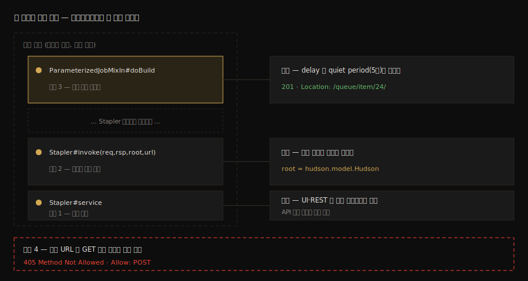

# Stapler 라우팅 디버깅 실습

---

> 이 문서를 읽고 나면 [`02-01`](02-01.Stapler%20URL%20라우팅%20스펙.md)에서 글로 읽은 URL → 메서드 여정을 실행 중인 JVM에서 브레이크포인트로 멈춰 재현하고, 루트 객체의 런타임 타입이 `Hudson`임을 변수창으로 확인하며, `201 Created`와 `405` 응답이 만들어지는 분기를 각각 트리거할 수 있습니다.

## 진입 — 읽은 것과 본 것은 다르다

> 스펙 문서는 "이 메서드가 받는다"고 말합니다. 디버거는 그 메서드가 *정말* 받는지, 스택 위에 누가 쌓여 있는지, 변수에 뭐가 들었는지를 보여 줍니다. 읽어서 아는 것과 멈춰서 본 것의 기억 강도는 다릅니다.

`02-01`의 §3 추적은 소스를 *읽어서* 만든 경로입니다. 이 문서는 같은 경로에 브레이크포인트 세 개를 박고, curl 한 발마다 실행이 어디서 멈추는지 *관찰해서* 같은 결론에 도달합니다. 두 방법이 같은 답을 내면 그 답은 외운 것이 아니라 검증한 것이 됩니다. 면접에서 "직접 확인해 봤습니다"라고 말할 수 있는 차이가 여기서 생깁니다.

### 이 문서의 좌표

`02` 묶음의 실습편입니다. [`01-01`](01-01.로컬%20Docker%20Jenkins%20%2B%20소스%20디버깅%20환경.md)의 디버그 컨테이너와 IDE attach가 전제이고, 산출은 `02-01` §3 여정의 관찰 증거입니다.

## 사전 지식

> `01-01`의 경로 A(컨테이너 + JDWP attach)가 연결된 상태에서 시작합니다. 인증은 API 토큰을 쓰며, 발급 절차는 [`04_api/01-01`](../04_api/01-01.API%20실습%20환경%20설정.md) § "API Token 발급"과 같습니다.

로컬 환경이므로 변수 묶음은 셋이면 충분합니다:

```bash
# 04_api 의 원격 서버 변수 묶음 대신 로컬 컨테이너 한 대 기준으로 줄인다
export JENKINS_URL='http://localhost:8080'
export JENKINS_USER='admin'          # 01-01 에서 만든 관리자 계정
export API_TOKEN='<발급받은 토큰>'    # UI: 사용자명 → Configure → API Token
```

## 1. 실습 준비 — 추적용 Job 하나

> 라우팅을 추적하려면 URL의 끝에 실제 Job이 있어야 합니다. 아무 일도 안 하는 한 줄짜리 파이프라인이면 충분합니다.

UI에서 `engine-trace`라는 이름의 Pipeline Job을 만들고 스크립트에 다음을 넣습니다:

```groovy
// 라우팅 관찰이 목적이라 빌드 자체는 의미가 없어도 된다
// echo 한 줄이면 큐 적재 → 실행 → 완료 전이를 다 만들어 준다
pipeline {
    agent any
    stages {
        stage('noop') {
            steps { echo 'engine trace target' }
        }
    }
}
```

생성 직후 한 번 수동 빌드해 정상 완료를 확인해 둡니다. 이후 실습의 curl은 전부 이 Job을 겨냥합니다.

이 문서가 걸 브레이크포인트 세 곳과 각 자리의 관찰값을 지도로 먼저 봅니다:



## 2. 실습 1 — service(): 모든 요청의 단일 관문

> 첫 브레이크포인트는 가장 넓은 그물입니다. 어떤 URL이든 여기서 멈추면 "단일 관문" 주장이 증명됩니다.

`org.kohsuke.stapler.Stapler#service`에 브레이크포인트를 걸고, 성격이 다른 요청 두 개를 보냅니다:

```bash
# 일반 화면 요청 — 브라우저 대신 curl 로도 동일하게 관찰된다
curl -s -u "${JENKINS_USER}:${API_TOKEN}" "${JENKINS_URL}/" -o /dev/null

# REST API 요청 — 04_api 에서 수없이 친 그 엔드포인트
curl -s -u "${JENKINS_USER}:${API_TOKEN}" "${JENKINS_URL}/api/json?tree=mode" -o /dev/null
```

**결과:**

```
요청 1 (/)         → Stapler.service() 브레이크포인트 정지
요청 2 (/api/json) → Stapler.service() 브레이크포인트 정지
```

**분석:**

- 화면 요청과 REST 요청이 *같은 메서드*에서 멈춥니다. Jenkins에 "API 전용 서버"가 따로 있는 게 아니라, UI와 API가 같은 객체 그래프의 다른 끝일 뿐이라는 사실의 직접 증거입니다.
- `/api/json`이 별도 컨트롤러가 아니라 그래프 순회의 한 토큰(`api`)이라는 점은 `04_api/02-02`에서 "어떤 객체 URL에도 `/api/json`을 붙일 수 있다"고 외운 규칙의 엔진 쪽 설명입니다.
- 관찰이 끝나면 이 브레이크포인트는 꺼 둡니다. 모든 요청이 걸리는 그물이라 켜 둔 채로는 다음 실습이 번거롭습니다.

## 3. 실습 2 — invoke(): 루트 객체는 정말 Hudson인가

> 02-01 §3-1의 의외였던 주장 — `/job/foo`의 수신자는 `Jenkins.getJob`이 아니라 `Hudson.getJob` — 을 변수창으로 검증합니다.

`Stapler#invoke` 중 시그니처가 `invoke(HttpServletRequest, HttpServletResponse, Object root, String url)`인 오버로드에 브레이크포인트를 걸고, Job 조회 요청을 보냅니다:

```bash
# 토큰 분해를 관찰하기 좋은 적당히 깊은 URL
curl -s -u "${JENKINS_USER}:${API_TOKEN}" \
  "${JENKINS_URL}/job/engine-trace/api/json?tree=name" -o /dev/null
```

**결과:**

```
invoke() 정지. 변수창:
  root = jenkins.model.Jenkins@…  ← 선언 타입은 Object
  root 의 실제 클래스 (Class 확인): hudson.model.Hudson
  url  = "/job/engine-trace/api/json"
```

**분석:**

- 변수창에서 `root`를 펼치면 런타임 클래스가 `hudson.model.Hudson`으로 찍힙니다. `Jenkins.java`에서 `getJob`을 찾으면 없는 이유, 그리고 Stapler가 `Hudson.getJob(String)`을 찾아내는 이유가 이 한 칸으로 증명됩니다. 리플렉션은 선언 타입이 아니라 런타임 클래스를 봅니다.
- `url` 변수에 컨텍스트 경로를 뗀 나머지가 통째로 들어 있고, 이후 토큰 단위로 잘리며 그래프를 내려갑니다. step over를 몇 번 반복하면 `engine-trace` 토큰이 소비되는 시점을 볼 수 있습니다.

## 4. 실습 3 — doBuild 히트와 201의 출생

> 이제 빌드 트리거를 쏘고, 02-01 §3-2·§3-3에서 읽은 코드 줄들 위에 실행을 세웁니다.

`jenkins.model.ParameterizedJobMixIn#doBuild`에 브레이크포인트를 걸고 POST를 보냅니다:

```bash
# -i 로 응답 헤더까지 받는다 — Location 이 이 실습의 관찰 대상이므로
curl -i -X POST -u "${JENKINS_USER}:${API_TOKEN}" \
  "${JENKINS_URL}/job/engine-trace/build"
```

**결과:**

```
doBuild() 정지. 관찰:
  delay = null → step over 후 quiet period 기본값(5초)으로 채워짐
  호출 스택: doBuild ← (Stapler 디스패치 프레임들) ← Stapler.service

재개(Resume) 후 curl 응답:
  HTTP/1.1 201 Created
  Location: http://localhost:8080/queue/item/24/
```

**분석:**

- 호출 스택의 맨 아래가 `Stapler.service`, 맨 위가 `doBuild`입니다. 실습 1·2·3의 브레이크포인트가 *한 요청의 같은 스택* 위에 순서대로 놓인다는 것 — 이것이 `02-01` §3 여정의 관찰 증거 전부입니다.
- `delay`가 null로 들어와 quiet period 기본값으로 채워지는 줄을 step over로 직접 봅니다. `04_api`에서 "트리거 직후 5초쯤 큐에 머문다"고 경험한 대기의 출처입니다.
- 재개하면 curl에 `201 Created`와 `Location: …/queue/item/24/`가 도착합니다. 방금 지나온 `sendRedirect(SC_CREATED, … + item.getUrl())` 줄의 출력물을 손에 받은 셈입니다. queueId `24`가 이후 [`03-01`](03-01.Queue.Task%20라이프사이클%20소스편.md)의 주인공이 됩니다.

## 5. 실습 4 — GET으로 치면: 405 분기 확인

> 같은 URL에 메서드만 바꿔 보냅니다. 02-01 §3-2에서 읽은 거부 코드 세 줄이 실제 응답으로 돌아오는지 확인합니다.

```bash
# POST 자리에서 -X 만 뺀다 — 메서드 분기만 다르게 태우는 대조 실험
curl -i -u "${JENKINS_USER}:${API_TOKEN}" \
  "${JENKINS_URL}/job/engine-trace/build" | head -5
```

**결과:**

```
HTTP/1.1 405 Method Not Allowed
Allow: POST
…(requirePOST 안내 페이지 HTML)
```

**분석:**

- 상태 `405`와 `Allow: POST` 헤더가 `BuildAuthorizationToken.checkPermission`의 거부 블록과 한 글자씩 대응합니다. `rsp.setStatus(SC_METHOD_NOT_ALLOWED)` → 405, `rsp.addHeader("Allow", "POST")` → Allow 헤더, `forwardToView(…, "requirePOST.jelly")` → 안내 HTML.
- 이 Job에 파라미터가 정의돼 있었다면 GET은 405가 아니라 파라미터 입력 폼으로 갔을 것입니다. 같은 GET이 Job 설정에 따라 다른 분기를 타는 것까지 확인하고 싶으면 `engine-trace`에 파라미터를 하나 추가해 재시도해 봅니다.

## 6. 정리와 다음 단계

> 세 개의 브레이크포인트가 URL 여정의 시작·중간·끝을 찍었습니다. 다음은 doBuild가 호출한 schedule2의 안쪽입니다.

이번 실습으로 굳힌 사실은 다음 세 가지입니다:

1. UI든 REST든 모든 요청은 `Stapler.service()` 한 관문을 지납니다. API 전용 경로는 따로 없습니다.
2. 그래프 순회의 루트는 런타임 클래스 `Hudson`이며, 선언 타입만 보고 소스를 찾으면 수신 메서드를 놓칩니다.
3. `201`·`Location`·`405`·`Allow` 같은 호출자 쪽 관찰값 하나하나에 대응하는 소스 줄이 있고, 그 줄 위에 실행을 세울 수 있습니다.

다음 [`03-01`](03-01.Queue.Task%20라이프사이클%20소스편.md)은 실습 3에서 받은 `queue/item/24`가 큐 안에서 겪는 일 — 상태 전이, 단일 락, 그리고 buildNumber가 확정되는 코드 지점 — 으로 들어갑니다.

## 면접에서 받을 만한 질문

> 실습으로 확인한 사실은 면접에서 "직접 봤다"고 말할 수 있는 재산입니다. 아래 3개에 먼저 스스로 답해 보고, 자답이 끝나면 다음 절로 내려갑니다.

1. Jenkins에서 UI 요청과 REST API 요청은 서버 안에서 경로가 어떻게 다릅니까? 이를 어떻게 검증할 수 있습니까?
2. 디버거 변수창에서 루트 객체의 런타임 클래스를 확인하는 일이 왜 중요했습니까? 선언 타입만 믿으면 어떤 실수가 생깁니까?
3. 빌드 트리거의 `201 Created` 응답에서 `Location` 헤더 값은 코드상 무엇으로 만들어집니까?

## 정답 (자답 후 펼치기)

> 위 §면접에서 받을 만한 질문의 3개에 *먼저 자답한 뒤* 아래를 읽으십시오. 자답 없이 먼저 읽으면 학습 효과가 0입니다.

### 정답 1 — 경로는 같다

다르지 않습니다. 둘 다 `Stapler.service()` 한 관문으로 들어와 같은 객체 그래프를 순회하며, `/api/json`은 별도 컨트롤러가 아니라 그래프의 한 토큰일 뿐입니다. 검증은 `Stapler#service`에 브레이크포인트를 걸고 화면 URL과 `/api/json` URL을 각각 호출해, 둘 다 같은 메서드에서 멈추는 것을 보면 됩니다. 한 그물에 두 종류의 요청이 다 걸리는 것이 "단일 관문"의 직접 증거입니다.

### 정답 2 — 리플렉션은 런타임 클래스를 본다

Stapler는 리플렉션으로 라우팅하므로 수신 메서드를 찾는 기준이 선언 타입이 아니라 런타임 클래스입니다. 싱글턴은 `Jenkins`로 선언되지만 실제 인스턴스는 이를 상속한 `Hudson`이고, `/job/{name}`의 수신자인 `getJob(String)`은 `Hudson.java`에만 있습니다. 선언 타입 `Jenkins.java`에서만 메서드를 찾으면 "이런 라우팅은 불가능하다"는 잘못된 결론에 도달합니다. 변수창의 런타임 클래스 확인이 이 함정을 끊는 가장 빠른 방법입니다.

### 정답 3 — 큐 아이템 URL의 리다이렉트

`doBuild`의 마지막 블록이 `Queue.schedule2(…)`가 돌려준 큐 아이템의 `getUrl()`을 컨텍스트 경로에 이어 붙여 `sendRedirect(SC_CREATED, …)`로 보냅니다. 즉 `Location` 값은 "방금 큐에 적재된 아이템의 상대 URL"이고, 호출자는 이 URL을 폴링해 queueId가 buildNumber로 전환되는 순간을 추적합니다. 그 전환의 코드 지점은 03-01에서 다룹니다.

## 관련 문서

> 이 실습은 02-01 스펙의 관찰 증거를 만들었습니다. 받은 queueId를 들고 큐 내부로 들어가면 묶음의 다음 장이 시작됩니다.

- [02-01. Stapler URL 라우팅 스펙](02-01.Stapler%20URL%20라우팅%20스펙.md) — 이 실습이 검증한 규칙과 소스 추적의 원본
- [03-01. Queue.Task 라이프사이클 소스편](03-01.Queue.Task%20라이프사이클%20소스편.md) — 실습 3에서 받은 `queue/item/N`의 다음 여정
- [01-01. 로컬 Docker Jenkins + 소스 디버깅 환경](01-01.로컬%20Docker%20Jenkins%20%2B%20소스%20디버깅%20환경.md) — 이 실습의 전제가 되는 attach 환경
- [04_api 01-01. API 실습 환경 설정](../04_api/01-01.API%20실습%20환경%20설정.md) § "API Token 발급" — 실습 인증에 쓴 토큰의 발급 절차
