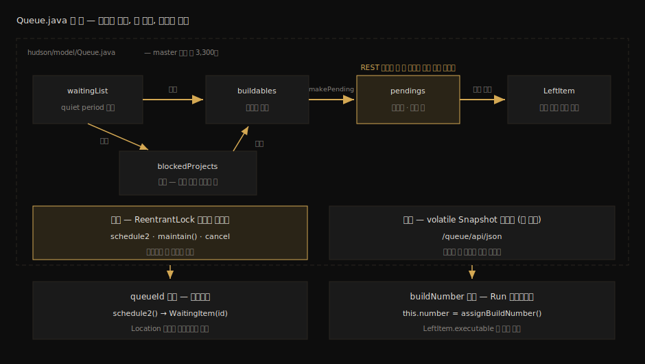
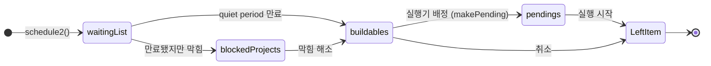

# Queue.Task 라이프사이클 소스편

---

> 이 문서를 읽고 나면 `Queue.java` 한 파일 안에서 큐 아이템 상태 클래스들과 `schedule2()`·`maintain()`의 위치를 짚고, 단일 `ReentrantLock`과 volatile `Snapshot`이 변이와 조회를 가르는 구조를 설명하며, buildNumber가 확정되는 코드 줄에 브레이크포인트를 걸 수 있습니다.

> **분담 안내** — 큐 상태 전이의 *개념*(상태 의미·Quiet Period·FIFO 논증·시나리오별 흐름)은 [`04_api/05-04`](../04_api/05-04.큐%20내부%20흐름과%20실행%20순서.md)가 정본입니다. 이 문서는 그 개념이 *코드 어디에 어떻게* 구현돼 있는지 — 소스 좌표, 락 구조, 그리고 05-04에 등장하지 않는 다섯 번째 리스트 `pendings` — 만 다룹니다. 개념이 흐릿하면 05-04를 먼저 읽고 돌아옵니다.

## 진입 — 상태 전이도를 코드 위에 겹쳐 놓기

> 05-04를 읽었다면 WaitingItem → BuildableItem → LeftItem 전이도가 머리에 있습니다. 이 문서는 그 그림의 각 칸과 화살표에 클래스 이름과 메서드 이름을 적어 넣습니다.

[`02-02`](02-02.Stapler%20라우팅%20디버깅%20실습.md) 실습 3에서 우리는 `201 Created`와 함께 `queue/item/24`라는 URL을 받았습니다. 그 24번 아이템은 지금부터 한 파일 안에서 일생을 보냅니다. master 기준 약 3,300줄의 `hudson/model/Queue.java` — 대기 목록, 상태 클래스, 전이 엔진, 락이 전부 이 한 파일에 있습니다.

한 파일에 모여 있다는 사실 자체가 설계 신호입니다. 큐의 모든 변이가 한 클래스의 한 락 아래에서 일어나도록 응집해 둔 것이고, 그 덕분에 "누가 큐를 바꾸는가"라는 질문의 답을 찾을 때 뒤질 곳이 한 군데입니다. 이 절약은 디버깅에서 체감됩니다.

### 이 문서의 좌표

`03` 묶음의 앞 편입니다. 여기서 아이템이 *어떤 상태를 거치는지*의 코드 좌표를 잡고, 뒤 편 [`03-02`](03-02.Executor%20배정%20알고리즘과%20TPS%20대조.md)에서 buildable 아이템이 *어느 실행기로 가는지*의 배정 알고리즘으로 들어갑니다.

## 사전 지식

> 05-04의 상태 전이 개념과, 자바의 `ReentrantLock`·volatile 필드가 무엇인지 안다면, 이 문서는 그 둘을 "한 파일 안의 동시성 설계 읽기"로 묶은 것입니다.

소스 줄 번호는 master 기준 참고치입니다. 버전마다 이동하므로 찾을 때는 줄 번호가 아니라 클래스·메서드 이름으로 검색합니다.

## 1. 소스 지도 — Queue.java 한 파일

> 상태 클래스 4개, 내부 리스트 4개, 진입 메서드 1개, 전이 엔진 1개. 이 열 가지 좌표만 잡으면 파일 전체가 읽힙니다.

| 좌표 | 종류 | 역할 |
|------|------|------|
| `WaitingItem` (extends `Item`) | 상태 클래스 | quiet period 대기 중. `Comparable` 구현 — 만기 시각순 정렬 |
| `BlockedItem` (extends `NotWaitingItem`) | 상태 클래스 | 대기는 끝났지만 막힘 (동시 빌드 비활성 등) |
| `BuildableItem` (extends `NotWaitingItem`) | 상태 클래스 | 실행 가능 — 유휴 실행기를 기다림 |
| `LeftItem` (extends `Item`) | 상태 클래스 | 큐를 떠남 — 취소 또는 실행 시작 (의미는 05-04 §3-2) |
| `waitingList` / `blockedProjects` / `buildables` / `pendings` | 내부 리스트 | 상태별 보관함. `pendings`는 §2에서 별도로 다룸 |
| `schedule2(Task, int, List<Action>)` | 진입 메서드 | 새 아이템 적재 — doBuild의 종착지 (02-01 §3-3) |
| `maintain()` | 전이 엔진 | 상태 간 이동을 일으키는 유일한 루프 (개념은 05-04 §5) |
| `MaintainTask` (extends `SafeTimerTask`) | 주기 트리거 | 생성자에서 `new MaintainTask(this).periodic()` — 이벤트 외에 주기적으로도 maintain을 깨움 |

상태 클래스의 상속 구조가 전이도를 그대로 반영합니다. `WaitingItem`만 시간 개념(만기 정렬)을 갖고, 대기가 끝난 둘(`BlockedItem`·`BuildableItem`)은 `NotWaitingItem`이라는 공통 부모로 묶이며, `LeftItem`은 다시 별도입니다. 클래스 계층만 읽어도 "대기 → 비대기 → 떠남"의 3막 구조가 보입니다.

표의 좌표를 한 장에 겹치면 이 문서 전체의 지도가 됩니다:



## 2. 다섯 번째 리스트 — pendings

> 상태 전이도에는 칸이 4개지만 보관함은 5개입니다. pendings는 "실행기에 넘겼지만 아직 시작 전"이라는 짧은 찰나를 담습니다.

`buildables`에서 실행기 배정이 결정된 아이템은 곧바로 `LeftItem`이 되지 않습니다. 배정 결정과 실제 실행 시작 사이에는 실행기가 작업을 집어 드는 짧은 간격이 있고, 그동안 아이템은 `pendings` 리스트에 머뭅니다. 보관함 다섯 개를 전이 순서로 늘어놓으면 다음과 같습니다:



`pendings`가 상태도에서 자주 빠지는 이유는 REST 큐 API의 시야 때문입니다. 조회 관점에서 pending 아이템은 buildable과 함께 "아직 큐에 있는 것"으로 묶여 보이고, 머무는 시간도 짧아 폴링에 거의 안 잡힙니다. 그러나 소스에는 분명히 존재하고 실질적인 일도 합니다. 동시 빌드가 비활성인 Job의 중복 검사는 `buildables`와 `pendings`를 *둘 다* 확인합니다:

```java
// Queue.java — 동시 빌드 비활성 Job 의 중복 방어
// buildables 만 보면 "배정은 됐지만 시작 전" 인 빌드를 놓쳐
// 같은 Job 이 두 실행기에 동시에 올라가는 구멍이 생긴다
if (!i.task.isConcurrentBuild()
        && (buildables.containsKey(i.task) || pendings.containsKey(i.task))) {
```

`pendings`를 모르면 이 줄이 왜 두 리스트를 보는지 설명할 수 없습니다. 소스 레벨 학습이 개념 학습 위에 얹어 주는 전형적인 한 칸입니다.

## 3. 진입 — schedule2와 queueId의 탄생

> doBuild의 마지막 줄이 호출한 schedule2는 WaitingItem을 만들어 적재하거나, 같은 작업이 이미 대기 중이면 기존 아이템을 돌려줍니다.

`schedule2(Task p, int quietPeriod, List<Action> actions)`가 큐의 유일한 정문입니다. 여기서 만들어지는 `WaitingItem`의 ID가 곧 호출자가 `Location` 헤더로 받는 queueId입니다. `02-02` 실습 3의 24번이 태어난 곳입니다.

반환 타입이 `boolean`이 아니라 `ScheduleResult`인 이유가 학습 포인트입니다. 같은 Task가 이미 대기 중이고 새 요청과 구분할 이유가 없으면, 큐는 새 아이템을 만들지 않고 기존 아이템을 돌려줍니다(아이템 병합 — 개념은 05-04 §정답 4). 호출자는 `ScheduleResult`로 "새로 만들어졌는지, 기존 것에 합류했는지"를 구분할 수 있고, 실제로 `doBuild` 소스의 TODO 주석은 병합된 경우 201 대신 다른 상태 코드를 고민하고 있습니다. 외부에서 같은 Job을 연타하면 queueId가 같게 돌아오는 현상의 소스 쪽 근거입니다.

## 4. 단일 락과 Snapshot — 변이는 직렬, 조회는 무락

> 큐의 모든 변이는 ReentrantLock 하나 아래에서 일어나고, 조회는 volatile Snapshot 복사본을 락 없이 읽습니다. 이 비대칭이 이 문서의 핵심 인사이트입니다.

`Queue.java`에는 락이 하나뿐입니다:

```java
// Queue.java — 큐 전체를 지키는 유일한 락
private final transient ReentrantLock lock = new ReentrantLock();

// 외부 코드가 큐 상태와 정합된 작업을 해야 할 때 쓰는 정적 헬퍼
public static void withLock(Runnable runnable) { … }
```

`schedule2`도 `maintain()`도 취소도 전부 이 락 안에서 돕니다. 즉 *큐를 바꾸는 주체는 한 시점에 정확히 하나*입니다. 상태 전이 중간의 어중간한 큐를 다른 스레드가 볼 수 없고, 같은 실행기에 두 작업이 배정되는 경쟁도 원천적으로 없습니다. 이 직렬화 불변식의 값어치는 [`03-02`](03-02.Executor%20배정%20알고리즘과%20TPS%20대조.md)에서 분산 환경과 대조할 때 제대로 드러납니다.

그런데 변이가 직렬이라면 조회는 어떨까요? `04_api/09-03`에서 다뤘듯 외부 시스템은 `/queue/api/json`을 폴링합니다. 조회마다 락을 잡으면 폴링이 잦을수록 큐 전이가 느려지는 끔찍한 결합이 생깁니다. Queue는 이를 스냅숏으로 끊습니다:

```java
// Queue.java — 조회용 불변 복사본
// 변이가 끝날 때마다 네 리스트의 복사본을 통째로 갈아 끼운다
private transient volatile Snapshot snapshot = new Snapshot(waitingList, blockedProjects, buildables, pendings);
```

조회 메서드들은 락 대신 이 volatile 필드를 읽습니다. 읽는 쪽은 약간 낡은(수 밀리초 전의) 큐를 볼 수 있지만 절대 *찢어진* 큐는 보지 않고, 쓰는 쪽은 조회 부하와 무관하게 락 경쟁 없이 전이를 진행합니다. 외부 폴러가 아무리 두들겨도 Jenkins 큐가 느려지지 않는 이유, 그리고 폴링으로 본 상태가 아주 가끔 한 박자 늦는 이유가 둘 다 이 한 필드로 설명됩니다.

## 5. 전이 엔진 — maintain()의 네 단계

> maintain()은 상태 이동을 일으키는 유일한 메서드입니다. 네 단계가 한 락 안에서 순서대로 돕니다.

`maintain()`이 한 번 돌 때 일어나는 일을 소스 순서대로 정리하면 다음과 같습니다:

1. 유휴 실행기 조사 — 모든 노드의 빈 실행기를 모아 `Map<Executor, JobOffer> parked`를 만듭니다. JobOffer는 "이 실행기가 일을 받을 수 있다"는 제안서입니다.
2. 대기 만기 처리 — `waitingList`에서 quiet period가 끝난 아이템을 꺼내 `makeBuildable`로 넘기거나, 막혀 있으면 `blockedProjects`로 보냅니다.
3. 막힘 재평가 — `blockedProjects`의 각 아이템을 다시 검사해 막힘이 풀렸으면 buildable로 승격합니다.
4. 배정 — `buildables`의 각 아이템에 대해 받아 줄 수 있는 JobOffer 후보를 추리고, `loadBalancer.map(p.task, ws)`로 실행기를 결정해 `pendings`로 넘깁니다.

호출 시점은 두 갈래입니다. 실행기가 비거나 아이템이 추가되는 *이벤트*가 있을 때, 그리고 생성자에서 등록한 `MaintainTask`가 *주기적으로* 깨울 때입니다. 이벤트를 놓쳐도 주기 호출이 받쳐 주는 안전망 구조라, 큐가 영원히 잠드는 일은 없습니다.

4단계의 "후보를 추리고 결정한다" 안쪽 — `canTake` 검사와 `LoadBalancer.CONSISTENT_HASH`의 배정 논리 — 는 [`03-02`](03-02.Executor%20배정%20알고리즘과%20TPS%20대조.md)의 주제이므로 여기서는 멈춥니다.

## 6. buildNumber 확정의 코드 좌표

> queueId는 schedule2에서, buildNumber는 Run 생성자에서 태어납니다. 두 식별자의 탄생 지점이 다르다는 사실이 04_api에서 외운 모든 폴링 패턴의 근거입니다.

05-04 §3-3·§4가 개념으로 정리한 "두 식별자" 이야기의 코드 좌표는 `Run.java`에 있습니다:

```java
// Run.java — 빌드 객체가 만들어지는 순간 번호가 확정된다
protected Run(@NonNull JobT job) throws IOException {
    …
    this.number = project.assignBuildNumber();   // buildNumber 의 탄생
}

// queueId 는 별도 필드 — 빌드가 자기를 낳은 큐 아이템을 기억한다
private long queueId = Run.QUEUE_ID_UNKNOWN;
public void setQueueId(long queueId) { … }
```

실행이 시작되어 Run 객체가 생성되는 순간 `assignBuildNumber()`가 번호를 확정하고, 그 Run에 queueId가 함께 기록됩니다. 큐 아이템이 `LeftItem`이 되며 executable을 가리키는 시점부터 REST의 `queue/item/{id}/api/json` 응답에 `executable.number`가 채워집니다. TPS가 Location 헤더의 queueId를 폴링해 buildNumber로 갈아타는 패턴(`04_api/05-02`)이 코드 어느 줄에 기대고 있는지가 이것으로 닫힙니다.

## 7. 실습 기록 — maintain()을 멈춰 큐 적체 관찰

> 실행기를 1개로 줄여 인위적 적체를 만들고, maintain() 안에서 parked와 buildables를 변수창으로 들여다봅니다.

### 환경

- [`01-01`](01-01.로컬%20Docker%20Jenkins%20%2B%20소스%20디버깅%20환경.md)의 디버그 컨테이너 + IDE attach
- 사전 조작: Manage Jenkins → Nodes → Built-In Node → 실행기 수를 2에서 1로 변경
- 대상 Job: `02-02`의 `engine-trace`에 `sleep 60`을 추가한 사본 `engine-sleep`

### 실습 1: 적체 만들기와 maintain() 정지

`hudson.model.Queue#maintain`에 브레이크포인트를 걸고, `engine-sleep`을 두 번 연속 트리거합니다:

```bash
# 첫 발은 실행기를 차지하고, 둘째 발은 buildable 에 갇힌다
curl -s -X POST -u "${JENKINS_USER}:${API_TOKEN}" "${JENKINS_URL}/job/engine-sleep/build"
sleep 6   # quiet period(기본 5초)를 넘겨 두 아이템이 섞이지 않게 한다
curl -s -X POST -u "${JENKINS_USER}:${API_TOKEN}" "${JENKINS_URL}/job/engine-sleep/build"
```

**결과:**

```
maintain() 정지 (둘째 트리거 이후). 변수창:
  parked      = {}                  ← 유일한 실행기가 sleep 빌드에 점유됨
  buildables  = [engine-sleep #2 후보]
  pendings    = []
UI 큐 표시: "Waiting for next available executor"
```

**분석:**

- `parked`가 빈 맵입니다. 5절 1단계에서 "유휴 실행기만 JobOffer가 된다"고 읽은 내용 그대로, 점유된 실행기는 제안서를 내지 않습니다. 후보가 없으니 4단계 배정은 시도조차 안 되고 아이템은 `buildables`에 남습니다.
- 브레이크포인트가 걸린 동안 UI의 큐 화면도 갱신을 멈춥니다. maintain()이 락 안에서 돈다는 §4의 구조를 몸으로 확인하는 부수 효과입니다. 이 관찰이 운영 서버에서 금지인 이유(01-01 진입부)이기도 합니다.
- 첫 빌드가 끝나(60초) 실행기가 비면, 그 이벤트가 maintain()을 다시 깨워 이번에는 `parked`에 제안서가 하나 생기고 둘째 아이템이 `pendings`를 거쳐 실행으로 넘어갑니다. 브레이크포인트를 풀고 재개하면 전이가 완주합니다.

### 실습 2: queueId → buildNumber 전환 관찰

실습 1의 둘째 트리거가 돌려준 `Location`의 큐 아이템을 폴링하며 전환 순간을 잡습니다:

```bash
# 실행 시작 전엔 executable 이 없고, 시작 후엔 number 가 채워진다
curl -s -u "${JENKINS_USER}:${API_TOKEN}" \
  "${JENKINS_URL}/queue/item/26/api/json?tree=executable[number]" 
```

**결과:**

```
(첫 빌드 진행 중)  {"_class":"hudson.model.Queue$BuildableItem","executable":null}
(첫 빌드 종료 후)  {"_class":"hudson.model.Queue$LeftItem","executable":{"number":7}}
```

**분석:**

- 응답의 `_class`가 그대로 §1 표의 상태 클래스 이름입니다. REST 폴링이 보여 주던 문자열이 실은 자바 클래스 FQCN이었다는 것 — 조회 API와 소스가 같은 사물의 두 얼굴임을 이보다 직접적으로 보여 주는 증거는 없습니다.
- `executable.number`가 7로 채워진 순간이 §6의 `assignBuildNumber()` 줄이 실행된 순간입니다. 폴링 패턴(04_api)과 코드 좌표(이 문서)가 한 점에서 만납니다.

## 면접에서 받을 만한 질문

> 큐 내부는 동시성 설계 면접의 노다지입니다. 아래 4개에 먼저 스스로 답해 보고, 자답이 끝나면 다음 절로 내려갑니다.

1. Jenkins 큐의 내부 보관함은 몇 개이며, 상태 전이도에 잘 안 그려지는 `pendings`는 어떤 실질적 역할을 합니까?
2. 큐의 변이와 조회는 동시성 관점에서 어떻게 다르게 처리됩니까? 이 설계가 외부 폴링 시스템에 주는 이점은 무엇입니까?
3. `schedule2`가 boolean이 아니라 `ScheduleResult`를 반환하는 이유는 무엇입니까?
4. queueId와 buildNumber는 각각 코드 어느 지점에서 태어납니까? 외부 시스템이 이 차이를 알아야 하는 이유는?

## 정답 (자답 후 펼치기)

> 위 §면접에서 받을 만한 질문의 4개에 *먼저 자답한 뒤* 아래를 읽으십시오. 자답 없이 먼저 읽으면 학습 효과가 0입니다.

### 정답 1 — 보관함 다섯, pendings의 일

보관함은 `waitingList`·`blockedProjects`·`buildables`·`pendings` 네 리스트와 떠난 아이템 기록(`LeftItem`)까지 다섯 갈래입니다. `pendings`는 실행기 배정이 결정됐지만 실행이 아직 시작되지 않은 찰나의 아이템을 담습니다. 실질 역할의 대표 예가 동시 빌드 비활성 Job의 중복 방어로, 검사 코드는 `buildables`와 `pendings`를 둘 다 확인합니다. `buildables`만 보면 "배정됐지만 시작 전"인 빌드를 놓쳐 같은 Job이 두 실행기에 동시에 올라가는 구멍이 생기기 때문입니다.

### 정답 2 — 변이는 한 락, 조회는 스냅숏

모든 변이(`schedule2`·`maintain`·취소)는 단일 `ReentrantLock` 아래에서 직렬로 일어나고, 조회는 변이가 끝날 때마다 갈아 끼워지는 volatile `Snapshot` 복사본을 락 없이 읽습니다. 조회가 락을 잡지 않으므로 외부 시스템이 `/queue/api/json`을 아무리 자주 폴링해도 큐 전이 성능에 영향을 주지 않습니다. 대가는 조회가 수 밀리초 낡은 상태를 볼 수 있다는 것뿐이고, 찢어진 중간 상태는 절대 보이지 않습니다.

### 정답 3 — 병합을 표현해야 해서

같은 Task가 이미 큐에 대기 중이고 새 요청과 구분할 이유가 없으면 큐는 새 아이템을 만들지 않고 기존 아이템에 합류시킵니다. boolean으로는 "적재 성공"과 "기존 아이템에 병합"을 구분할 수 없어, 호출자가 받은 queueId가 새것인지 기존 것인지 알 길이 없습니다. `ScheduleResult`는 생성 여부와 해당 아이템을 함께 돌려줘 이 구분을 가능하게 합니다. 같은 Job을 연타했을 때 같은 queueId가 돌아오는 외부 관찰의 소스 쪽 근거입니다.

### 정답 4 — 정문과 생성자

queueId는 `schedule2`가 `WaitingItem`을 만들 때, buildNumber는 실행이 시작되어 `Run` 생성자가 `assignBuildNumber()`를 호출할 때 태어납니다. 두 시점 사이에 quiet period·막힘·실행기 대기가 끼므로 간격은 수 초에서 무한대까지 벌어질 수 있습니다. 외부 시스템이 트리거 직후 얻을 수 있는 식별자는 queueId뿐이고, buildNumber는 `queue/item/{id}` 폴링으로 `executable.number`가 채워질 때까지 기다려야 얻습니다. 이 차이를 모르면 "트리거했는데 빌드 번호를 모른다"는 상태를 버그로 오해하게 됩니다.

## 관련 문서

> 이 문서는 05-04 정본의 개념 위에 소스 좌표를 얹었습니다. 배정 알고리즘 안쪽과 그 분산 환경 대조는 짝 문서가 잇습니다.

- [04_api 05-04. 큐 내부 흐름과 실행 순서](../04_api/05-04.큐%20내부%20흐름과%20실행%20순서.md) — 상태 의미·Quiet Period·FIFO·시나리오의 정본. 이 문서가 위임한 모든 개념의 출처
- [03-02. Executor 배정 알고리즘과 TPS 대조](03-02.Executor%20배정%20알고리즘과%20TPS%20대조.md) — §5의 4단계 안쪽, canTake와 CONSISTENT_HASH 그리고 분산 직렬화 대조
- [02-01. Stapler URL 라우팅 스펙](02-01.Stapler%20URL%20라우팅%20스펙.md) § "종착지" — schedule2로 들어오는 정문 바깥의 여정
- [04_api 05-02. 빌드 실행·큐 모델과 TPS 패턴](../04_api/05-02.빌드%20실행·큐%20모델과%20TPS%20패턴%20%282.222%2B%29.md) — queueId → buildNumber 전환을 호출자 쪽에서 다루는 운영 패턴
