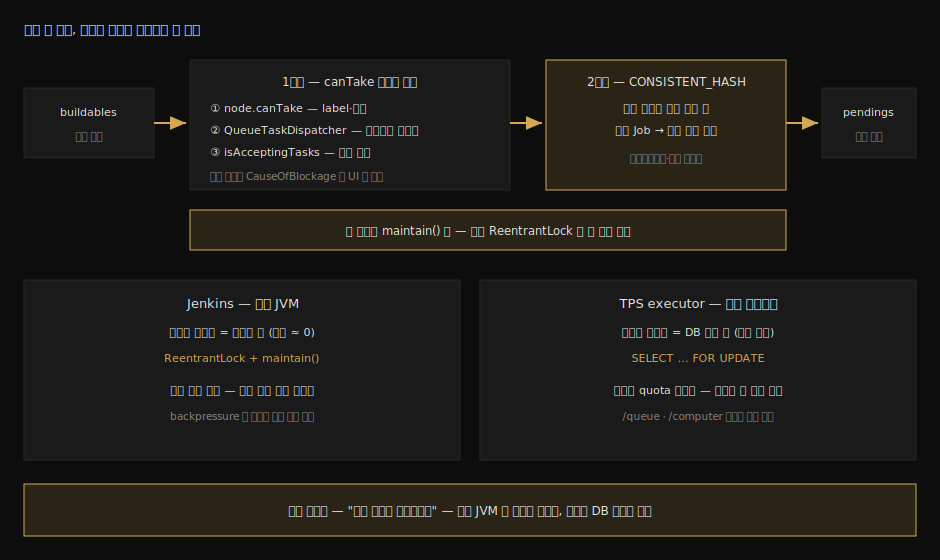
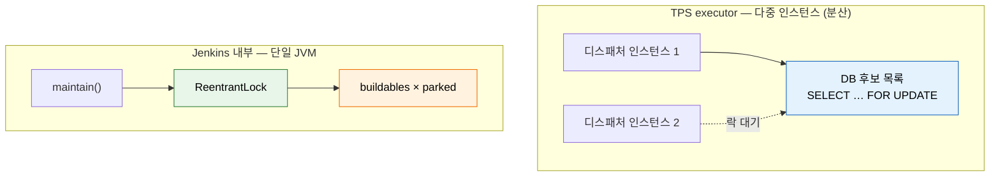

# Executor 배정 알고리즘과 TPS 대조

---

> 이 문서를 읽고 나면 buildable 아이템이 실행기를 만나는 두 단계 — 후보 선별(`canTake`)과 배정 결정(`LoadBalancer.CONSISTENT_HASH`) — 를 소스로 설명하고, Jenkins가 단일 락으로 공짜로 얻는 "배정 결정자는 하나" 불변식을 분산 환경에서 DB 비관 락으로 재현하는 설계 대조를 면접 수준으로 말할 수 있습니다.

## 진입 — 마지막 한 줄의 안쪽, 그리고 이 문서가 노리는 것

> [`03-01`](03-01.Queue.Task%20라이프사이클%20소스편.md) §5의 4단계는 "후보를 추리고 `loadBalancer.map`으로 결정한다" 한 줄로 끝났습니다. 이 문서는 그 한 줄을 엽니다. 그리고 연 김에, 같은 문제를 분산 환경에서 풀었던 실무 설계와 나란히 놓습니다.

배정은 큐의 클라이맥스입니다. 대기·막힘·승격은 결국 이 결정 — "이 작업을 어느 실행기에 줄 것인가" — 을 위한 준비입니다. Jenkins는 이 결정을 두 단계로 나눕니다. 먼저 *받을 수 있는가*(자격 검사)로 후보를 추리고, 그다음 *누구에게 줄 것인가*(선호 결정)를 일관 해시로 풉니다.

이 문서에 대조 절(§4)이 붙어 있는 이유는 학습 동기와 직결됩니다. 외부 시스템이 Jenkins에 빌드를 던지는 디스패처를 설계해 보면, Jenkins 큐가 내부에서 풀어 둔 문제 — 배정 결정의 직렬화 — 를 호출자 쪽에서 다시 풀어야 한다는 사실을 만나게 됩니다. 같은 불변식이 단일 JVM과 분산 환경에서 어떻게 다른 도구로 구현되는지가 이 묶음 전체에서 가장 면접 가치가 높은 이야기입니다.

### 이 문서의 좌표

`03` 묶음의 뒤 편이자 이 묶음의 이력서 핵심입니다. 후보 조회를 호출자 관점에서 다룬 [`04_api/05-06`](../04_api/05-06.큐·실행기%20조회%20API%20스펙.md)과 달리, 여기는 그 조회 값들이 엔진 안에서 *결정*으로 바뀌는 자리를 봅니다.

## 사전 지식

> 03-01의 maintain() 4단계와, 해시 기반 분산(샤딩·파티셔닝)의 기본 발상을 안다면, 이 문서는 그 둘을 "작업 배치 문제"라는 한 무대에 올린 것입니다.

`FOR UPDATE` 비관 락이 처음이라면 "트랜잭션이 끝날 때까지 같은 행을 읽으려는 다른 트랜잭션을 세워 두는 SELECT"라는 정의만 들고 와도 §4를 따라올 수 있습니다.

## 1. 1단계 후보 선별 — canTake의 거부권 사슬

> 유휴 실행기라고 다 후보가 되지 않습니다. 노드의 자격 검사와 플러그인의 거부권을 모두 통과해야 제안서(JobOffer)가 유효해집니다.

`maintain()`이 만든 `parked` 맵의 각 `JobOffer`는 buildable 아이템마다 `canTake` 검사를 받습니다. 소스의 검사 사슬은 세 겹입니다:

```java
// Queue.java — JobOffer.canTake 의 검사 사슬 (요지)
public boolean canTake(BuildableItem item) {
    // ① 노드 자격 — label 매칭, 가용성 등 Node 차원의 판단
    CauseOfBlockage reason = node.canTake(item);
    …
    // ② 확장점 거부권 — 플러그인이 배정에 개입하는 공식 통로
    for (QueueTaskDispatcher d : QueueTaskDispatcher.all()) {
        reason = d.canTake(node, item);
        …
    }
    // ③ 실행기 소유 노드가 지금 작업을 받는 상태인지 (RetentionStrategy 까지 반영)
    if (!executor.getOwner().isAcceptingTasks()) { … }
```

설계 의도가 사슬의 모양에 들어 있습니다. ①은 "이 노드가 이 작업을 돌릴 *수 있는가*"라는 정적 자격이고, ②는 외부 플러그인이 어떤 이유로든 "지금은 안 된다"를 말할 수 있는 확장점이며, ③은 노드의 운영 상태라는 동적 조건입니다. 거부가 나오면 `CauseOfBlockage`로 사유가 남아 UI의 "Waiting for next available executor" 같은 문구가 됩니다. `03-01` 실습에서 본 그 문구의 출처입니다.

`QueueTaskDispatcher`는 기억해 둘 만한 확장점입니다. 배정 정책을 바꾸고 싶을 때 큐 코드를 건드리는 게 아니라 거부권 플러그인을 꽂는 것이 Jenkins의 방식이고, `05` 묶음(Extension Point)에서 만들 플러그인이 끼어드는 자리 중 하나가 여기입니다.

## 2. 2단계 배정 결정 — CONSISTENT_HASH

> 후보가 둘 이상이면 누구에게 줄 것인가. 기본 구현은 무작위도 라운드로빈도 아닌 일관 해시이고, 그 선택에는 워크스페이스라는 이유가 있습니다.

배정 결정의 인터페이스는 `LoadBalancer`입니다:

```java
// LoadBalancer.java — 배정 전략의 추상
public abstract class LoadBalancer implements ExtensionPoint {
    // worksheet 는 "작업 조각 × 실행기 조각" 의 가능 조합 표
    public abstract Mapping map(@NonNull Task task, MappingWorksheet worksheet);

    // 기본 구현 — 작업 이름을 키로 한 일관 해시
    public static final LoadBalancer CONSISTENT_HASH = new LoadBalancer() {
        @Override
        public Mapping map(@NonNull Task task, MappingWorksheet ws) {
            // 작업 조각마다 실행기 후보들을 해시 링에 올린다
            ConsistentHash<ExecutorChunk> hash = new ConsistentHash<>(ExecutorChunk::getName);
            …
        }
    };
    public static final LoadBalancer DEFAULT = CONSISTENT_HASH;
```

`MappingWorksheet`는 배정 문제를 표로 만든 것입니다. 행은 작업이 요구하는 조각(works), 열은 받아 줄 수 있는 실행기 묶음(executors)이고, `map`은 이 표에서 유효한 짝짓기(`Mapping`)를 찾습니다. `CONSISTENT_HASH` 구현은 후보 실행기들을 해시 링에 올리고 작업을 키로 해시해 떨어지는 자리의 실행기를 고르며, `assignGreedily`가 조각 단위로 이 선택을 채워 나갑니다.

왜 일관 해시일까요? 같은 작업은 같은 키로 해시되므로 *같은 노드에 떨어지는 경향*이 생깁니다. 빌드는 노드의 워크스페이스에 체크아웃과 산출물 캐시를 남기는데, 같은 Job이 매번 다른 노드로 가면 그 캐시가 전부 버려집니다. 같은 노드 선호는 곧 증분 체크아웃과 캐시 재사용이고, 빌드 시간으로 직결됩니다.

### 파생 이론 — 일관 해시, 그리고 이 비유의 한계

이 발상은 분산 캐시나 DB 샤딩에서 본 일관 해시와 같습니다. 키가 같으면 같은 자리로 가고, 노드가 늘거나 줄어도 재배치가 링의 일부에 국한됩니다. 노드 증감이 일상인 동적 에이전트 환경(`03_agent` 묶음)에서 단순 모듈로 해시(`hash % N`)를 썼다면 노드 하나가 빠질 때마다 거의 모든 Job의 선호 노드가 뒤바뀌었을 것입니다.

단, 이 비유는 *배치 선호*까지만 유효합니다. 분산 캐시에서 해시 링은 데이터의 *위치 정확성*을 책임지므로 어긋나면 조회 실패라는 정합성 문제가 됩니다. Jenkins에서는 선호 노드가 점유 중이면 다른 후보로 가면 그만이라, 어긋남의 대가는 정확성이 아니라 캐시 재사용률 하락이라는 효율 손실뿐입니다. 같은 자료구조가 한쪽에선 정합성 장치, 다른 쪽에선 최적화 장치로 쓰이는 차이를 짚어 두면 면접에서 이해 깊이가 드러납니다.

## 3. 불변식 — 배정 결정자는 한 시점에 하나

> 후보 선별과 배정 결정이 전부 단일 락 안의 maintain()에서 일어나므로, "같은 실행기에 두 작업"이라는 경쟁은 코드 구조상 불가능합니다. 이 공짜 불변식이 §4 대조의 출발점입니다.

§1과 §2의 모든 코드는 [`03-01`](03-01.Queue.Task%20라이프사이클%20소스편.md) §4의 `ReentrantLock` 안에서 돕니다. 정리하면 Jenkins의 배정에는 다음 불변식이 성립합니다:

1. 배정 결정을 내리는 주체는 한 시점에 정확히 하나입니다. maintain()은 락 없이는 진입할 수 없습니다.
2. 결정의 입력(유휴 실행기 목록, buildable 목록)은 결정 순간에 정합합니다. 결정 도중 다른 스레드가 목록을 바꿀 수 없습니다.
3. 따라서 두 작업이 같은 빈 실행기를 *동시에* 잡는 일은 검사할 필요조차 없이 배제됩니다.

이 불변식의 비용이 사실상 0이라는 점이 중요합니다. 큐가 단일 JVM의 단일 객체이므로 메모리 락 하나로 끝납니다. 문제는 이 구조를 *호출하는 외부 시스템*이 디스패처를 여러 인스턴스로 띄우는 순간 시작됩니다.

두 단계와 불변식, 그리고 §4의 대조까지 한 장으로 모으면 다음과 같습니다:



## 4. TPS 대조 — 같은 불변식을 DB 락으로 사는 법

> 외부 디스패처가 다중 인스턴스가 되면 Jenkins가 메모리 락으로 공짜로 얻던 불변식이 사라집니다. TPS executor 설계는 그 불변식을 DB 비관 락과 적재량 게이트로 다시 사들인 사례입니다.

TPS executor는 Jenkins에 빌드를 던지는 외부 디스패처입니다. 인스턴스가 여러 개 떠서 같은 DB의 디스패치 후보 목록을 바라보는 구조이므로, 아무 장치가 없다면 두 인스턴스가 같은 후보를 읽고 같은 빌드를 두 번 던지는 경쟁이 가능합니다. Jenkins 안에서라면 단일 락이 막아 줬을 바로 그 경쟁입니다.

두 시스템이 같은 문제를 어떻게 푸는지 나란히 놓으면 다음과 같습니다:



| 관심사 | Jenkins 내부 | TPS executor (분산 호출자) |
|--------|-------------|--------------------------|
| 결정 직렬화 수단 | 단일 JVM의 `ReentrantLock` | DB `SELECT … FOR UPDATE` 비관 락 |
| 직렬화 비용 | 사실상 0 (메모리 락) | 트랜잭션·락 대기 비용 지불 |
| 후보 정보의 정합성 | 락 안에서 읽으므로 결정 순간 정합 | 락 잡은 트랜잭션 안에서 읽어 정합 확보 |
| 적재 한도 (backpressure) | 없음 — 큐는 거절 없이 무한 적재 | 적재량 quota 게이트 — 한도 초과면 던지지 않음 |
| 적재 판단 입력 | 내부 상태 직접 참조 | `/queue/api/json`·`/computer/api/json` 폴링 (04_api 05-06) |
| 실행 식별자 연결 | queueId·buildNumber 모두 내부 소유 | Location의 queueId 폴링으로 buildNumber 획득 (03-01 §6) |

표의 넷째 줄이 따로 설명할 가치가 있습니다. Jenkins 큐는 적재를 거절하지 않습니다. `schedule2`에 한도 검사가 없으므로 천 개를 던지면 천 개가 쌓입니다. 즉 backpressure는 엔진이 제공하지 않는 기능이고, 호출자가 만들어야 하는 책임입니다. TPS의 적재량 quota는 이 빈자리를 메운 설계입니다 — 큐와 실행기 상태를 조회해 "지금 더 던지면 적체"라고 판단되면 트리거 자체를 보류합니다. 엔진이 안 주는 것을 알아야 호출자가 무엇을 만들어야 하는지 보인다는 점에서, 이 묶음(엔진 내부)과 `04_api`(호출 패턴)가 만나는 지점입니다.

**결론 한 줄 — 같은 불변식("배정 결정은 직렬화한다")을 단일 JVM은 메모리 락으로 공짜로 얻고, 분산 디스패처는 DB 비관 락으로 값을 치르고 산다.**

면접에서 이 대조를 꺼낼 때의 핵심은 순서입니다. "FOR UPDATE를 썼다"가 먼저가 아니라, "Jenkins 큐 내부가 단일 락 직렬화로 푸는 문제를 분산 환경에서 다시 만났고, 같은 불변식을 DB 락으로 재현했다"가 먼저입니다. 도구가 아니라 불변식에서 출발하면, 소스를 읽고 설계로 연결했다는 깊이가 한 문장에 담깁니다.

## 5. 실습 기록 — map()을 멈춰 배정 결정 관찰

> CONSISTENT_HASH의 map에 브레이크포인트를 걸어 워크시트의 내용을 들여다봅니다. 단일 노드 환경의 한계도 정직하게 적습니다.

### 환경

- [`01-01`](01-01.로컬%20Docker%20Jenkins%20%2B%20소스%20디버깅%20환경.md)의 디버그 컨테이너 + IDE attach
- 실행기 수 1 (03-01 실습 설정 유지), 대상 Job: `engine-trace`

### 실습 1: 배정 결정 순간 정지

`LoadBalancer`의 `CONSISTENT_HASH` 익명 클래스 `map` 메서드에 브레이크포인트를 걸고 빌드를 트리거합니다:

```bash
curl -s -X POST -u "${JENKINS_USER}:${API_TOKEN}" "${JENKINS_URL}/job/engine-trace/build"
# quiet period 5초 뒤 maintain() 의 4단계가 map() 을 호출한다
```

**결과:**

```
map() 정지 (트리거 약 5초 후). 변수창:
  task          = engine-trace
  ws.works      = [WorkChunk 1개]            ← 이 작업이 요구하는 조각
  ws.executors  = [ExecutorChunk 1개 (built-in)] ← canTake 를 통과한 후보 묶음
스택: map ← maintain ← (락 보유 스레드)
```

**분석:**

- `ws.executors`에 들어온 것은 *모든* 실행기가 아니라 §1의 canTake 사슬을 통과한 후보뿐입니다. 선별과 결정이 두 단계라는 본문 구조가 변수창에서 그대로 보입니다.
- 호출 스택에 `maintain`이 있습니다. 배정 결정이 락 보유 스레드 안에서 일어난다는 §3의 불변식을 스택 한 줄이 증언합니다.
- 정직한 한계: 후보가 하나뿐인 단일 노드에서는 해시 링의 "선호" 논리가 변별력을 갖지 못합니다. 같은 Job이 같은 노드로 가는 경향을 관찰하려면 에이전트가 둘 이상이어야 하므로, 그 확장 실습은 [`03_agent`](../03_agent/README.md) 묶음의 다중 에이전트 환경을 만든 뒤로 미룹니다.

## 면접에서 받을 만한 질문

> 이 문서의 대조는 분산 시스템 면접 질문으로 곧장 이어집니다. 아래 4개에 먼저 스스로 답해 보고, 자답이 끝나면 다음 절로 내려갑니다.

1. 유휴 실행기가 후보에서 탈락하는 경로 세 가지를 canTake 사슬로 설명해 보십시오. 플러그인이 배정에 개입하는 공식 통로는 무엇입니까?
2. Jenkins의 기본 배정 전략이 라운드로빈이 아니라 일관 해시인 이유는 무엇이며, 분산 캐시의 일관 해시와는 무엇이 다릅니까?
3. "Jenkins에서는 두 작업이 같은 실행기를 동시에 잡는 경쟁이 불가능하다"를 코드 구조로 논증해 보십시오.
4. Jenkins에 빌드를 던지는 디스패처를 다중 인스턴스로 설계한다면 어떤 문제가 새로 생기고, 무엇으로 풀겠습니까? 큐 적재 한도는 누구의 책임입니까?

## 정답 (자답 후 펼치기)

> 위 §면접에서 받을 만한 질문의 4개에 *먼저 자답한 뒤* 아래를 읽으십시오. 자답 없이 먼저 읽으면 학습 효과가 0입니다.

### 정답 1 — 세 겹의 거부

첫째, `node.canTake(item)`이 label 매칭과 노드 가용성 같은 정적 자격을 검사합니다. 둘째, 모든 `QueueTaskDispatcher` 구현이 `canTake(node, item)`으로 거부권을 행사할 수 있으며, 이것이 플러그인이 배정 정책에 개입하는 공식 확장점입니다. 셋째, 실행기 소유 노드의 `isAcceptingTasks()`가 RetentionStrategy까지 반영한 운영 상태를 확인합니다. 어느 겹에서든 거부되면 `CauseOfBlockage`로 사유가 남아 큐 UI 문구가 됩니다.

### 정답 2 — 워크스페이스 재사용, 그리고 정합성과 효율의 차이

같은 작업을 같은 키로 해시하면 같은 노드에 떨어지는 경향이 생기고, 노드의 워크스페이스에 남은 체크아웃과 캐시를 재사용해 빌드 시간이 줄기 때문입니다. 노드 증감 시 재배치가 링 일부에 국한된다는 일관 해시의 장점도 동적 에이전트 환경과 맞습니다. 분산 캐시와 다른 점은 어긋남의 대가입니다. 캐시에서 해시 링은 데이터 위치의 정합성을 책임지므로 어긋나면 조회 실패지만, Jenkins에서는 선호 노드가 점유 중이면 다른 후보로 가면 되므로 대가가 캐시 재사용률 하락이라는 효율 손실에 그칩니다.

### 정답 3 — 락 안의 결정

배정 결정은 maintain()의 4단계에서만 일어나고, maintain()은 큐의 단일 `ReentrantLock`을 잡아야 진입할 수 있습니다. 결정의 입력인 유휴 실행기 목록(parked)과 buildable 목록도 같은 락 안에서 읽으므로 결정 순간에 정합합니다. 따라서 "두 결정자가 같은 빈 실행기를 본다"는 전제 자체가 성립하지 않아, 동시 점유 경쟁은 검사 코드 없이 구조적으로 배제됩니다. 실습에서 map()의 호출 스택에 maintain이 보이는 것이 이 논증의 관찰 증거입니다.

### 정답 4 — 불변식의 재구현과 호출자의 책임

다중 인스턴스가 같은 후보 목록을 읽으면 같은 빌드를 중복 디스패치하는 경쟁이 생깁니다. 단일 JVM 락은 인스턴스 경계를 넘지 못하므로, 공유 저장소 수준의 직렬화 — 예컨대 DB `SELECT … FOR UPDATE` 비관 락으로 후보를 읽는 트랜잭션 자체를 직렬화 — 로 "배정 결정자는 하나" 불변식을 재현해야 합니다. 큐 적재 한도는 Jenkins가 제공하지 않는 기능이므로 호출자 책임입니다. Jenkins 큐는 거절 없이 쌓이기만 하므로, 호출자가 큐·실행기 상태를 조회해 적재량 한도를 넘으면 트리거를 보류하는 backpressure 게이트를 직접 만들어야 합니다.

## 관련 문서

> 이 문서는 엔진의 배정 논리와 분산 호출자의 설계를 잇는 다리입니다. 양쪽 끝의 정본으로 돌아가면 각 주제의 상세가 이어집니다.

- [03-01. Queue.Task 라이프사이클 소스편](03-01.Queue.Task%20라이프사이클%20소스편.md) — 이 배정이 일어나는 maintain() 4단계와 단일 락·Snapshot 구조
- [04_api 05-06. 큐·실행기 조회 API 스펙](../04_api/05-06.큐·실행기%20조회%20API%20스펙.md) — 적재량 게이트의 입력이 되는 큐·실행기 조회의 호출자 스펙
- [04_api 05-02. 빌드 실행·큐 모델과 TPS 패턴](../04_api/05-02.빌드%20실행·큐%20모델과%20TPS%20패턴%20%282.222%2B%29.md) — queueId → buildNumber 전환을 포함한 호출자 쪽 운영 패턴
- [04_api 05-04. 큐 내부 흐름과 실행 순서](../04_api/05-04.큐%20내부%20흐름과%20실행%20순서.md) § "5-0. 배정 결정은 controller에서 일어납니다" — 이 문서가 소스로 파고든 명제의 개념 정본
