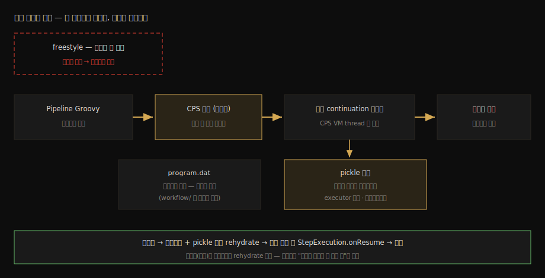

# FlowExecution 영속화와 재개

---

> 이 문서를 읽고 나면 freestyle 빌드는 재기동에 죽는데 Pipeline은 살아남는 이유를 CPS 변환으로 설명하고, 빌드 디렉토리의 `program.dat`와 `workflow/`가 각각 무엇의 직렬화인지 짚으며, pickle이 왜 필요하고 rehydrate가 실패하면 어떻게 되는지 말할 수 있습니다.

> **분담 안내** — durability 설정 세 단계의 트레이드오프와 controller 재기동 시 빌드 복구 *운영*은 [`05_operations/01-01`](../05_operations/01-01.Pipeline%20내구성과%20재기동.md)이 정본입니다(§3 Durability 설정, §4 재기동 복구). 이 문서는 그 생존이 애초에 *어떻게 가능한가* — CPS 변환·직렬화·pickle이라는 메커니즘 — 만 다룹니다.

## 진입 — 콜 스택은 저장할 수 없다

> 일반 프로그램의 "실행 중 상태"는 스레드의 콜 스택입니다. 콜 스택은 JVM 밖으로 꺼낼 수 없으므로, 보통의 빌드는 JVM이 내려가는 순간 함께 죽습니다. Pipeline은 이 물리 법칙을 어떻게 피했을까요.

freestyle 빌드는 컨트롤러와 에이전트에서 도는 살아 있는 스레드들입니다. 재기동하면 스레드가 사라지고, 빌드는 어디까지 했는지조차 모른 채 실패로 끝납니다. Pipeline의 내구성 약속(`05_operations/01-01`)은 정반대를 요구합니다 — 실행 *도중*의 상태를 디스크에 적고, JVM이 다시 떠오르면 그 지점부터 잇는 것.

이 비유로 잡아 둘 수 있습니다. 게임의 세이브 포인트와 같은 발상입니다 — 살아 있는 실행을 그대로 얼리는 게 아니라 "재구성에 충분한 상태"를 적어 두고 다시 빚어냅니다. 단, 이 비유는 저장 시점까지만 유효합니다. 게임은 플레이어가 세이브 지점을 고르지만, CPS로 변환된 Pipeline은 사실상 모든 스텝 경계가 저장 가능 지점이라는 점이 다릅니다.

### 이 문서의 좌표

`04` 묶음의 단독 편입니다. `03` 묶음이 빌드가 *시작되기까지*(큐·배정)를 다뤘다면, 여기는 시작된 Pipeline 빌드가 *죽지 않는 법*을 다룹니다. 확장(`05`)으로 넘어가기 전, 내부 동작 축의 마지막 조각입니다.

## 사전 지식

> 자바 직렬화(객체 그래프를 바이트로)와 05_operations/01-01의 durability 개념을 안다면, 이 문서는 그 둘 사이의 빈칸 — "무엇을 직렬화하길래 실행이 살아남는가" — 을 채우는 것입니다.

## 1. 문제의 정의 — 실행 상태는 어디에 사는가

> 보통의 실행 상태는 스레드 콜 스택에 살고, 콜 스택은 직렬화 대상이 아닙니다. 살아남으려면 실행 상태가 다른 곳에 살아야 합니다.

자바에서 "지금 어디까지 실행했고 다음에 뭘 하는지"는 스레드의 콜 스택이 들고 있습니다. 지역 변수, 호출 깊이, 복귀 주소가 전부 스택 프레임에 있는데, JVM은 이걸 객체처럼 꺼내 저장하는 수단을 주지 않습니다. 그래서 "실행 중인 프로그램을 저장한다"는 요구는 일반 코드로는 성립하지 않습니다.

성립시키는 방법은 실행 상태의 거처를 옮기는 것입니다. 콜 스택이 아니라 *힙의 보통 객체*가 "다음에 할 일"을 들고 있게 만들면, 그 객체 그래프는 여느 객체처럼 직렬화할 수 있습니다. Pipeline이 택한 길이 정확히 이것이고, 그 변환의 이름이 CPS입니다.

## 2. CPS 변환 — 다음에 할 일을 객체로 만들기

> Pipeline의 Groovy는 컴파일 시점에 continuation-passing style로 변환됩니다. 모든 단계가 "다음 할 일(continuation)"을 명시적 객체로 주고받으므로, 실행 상태가 콜 스택이 아니라 힙에 삽니다.

workflow-cps 플러그인은 Groovy CPS 라이브러리로 Pipeline 스크립트를 컴파일하면서 continuation-passing style 변환을 적용합니다(출처: github.com/jenkinsci/workflow-cps-plugin README). 변환된 코드에서 메서드 호출은 곧장 실행되지 않습니다. "이 호출에 이 인자를 쓰려 한다"는 정보가 엔진에 잡히고, 엔진이 그 정보로 다음 continuation에 제어를 넘깁니다. 평범한 순차 실행처럼 보이는 스크립트가 실제로는 "현재 상태 객체 → 다음 상태 객체"의 연쇄로 돕니다.

이 연쇄의 실행자는 CPS VM thread라는 별도 스레드 풀입니다(출처: 같은 README). 모든 Pipeline 프로그램 로직이 이 풀에서 continuation을 하나씩 해석하며 진행됩니다. 여기서 운영에서 체감하는 두 가지 결과가 나옵니다:

1. 실행 상태가 힙 객체이므로 *언제든 직렬화 가능*합니다. 내구성의 토대가 이것입니다.
2. CPS 해석은 일반 실행보다 느리고 CPS VM thread를 점유합니다. Pipeline 스크립트 안에서 무거운 연산을 돌리지 말고 스텝(에이전트의 `sh` 등)으로 내리라는 운영 격언, 그리고 변환을 면제받는 `@NonCPS` 메서드가 존재하는 이유가 여기 있습니다.

### 파생 이론 — CPS라는 컴파일 기법

continuation-passing style은 Jenkins 발명품이 아니라 컴파일러 이론의 고전 기법입니다. 함수가 값을 반환하는 대신 "그 값으로 다음에 할 일"을 인자로 받아 호출해 주는 형태로 프로그램 전체를 재작성하면, 제어 흐름이 데이터(객체)가 됩니다. 제어 흐름이 데이터가 되는 순간 저장·중단·재개·이동이 전부 가능해집니다. 자바스크립트의 async/await가 컴파일러 수준에서 콜백 체인으로 변환되는 것과 같은 계열의 발상이라, 한쪽을 이해하면 다른 쪽이 따라옵니다.

## 3. 디스크 좌표 — program.dat와 workflow/

> 변환된 실행 상태는 빌드 디렉토리에 두 갈래로 적힙니다. 프로그램 상태는 program.dat, 스텝 실행 기록 그래프는 workflow/ 입니다.

빌드 디렉토리(`builds/{number}/`)의 전체 구조는 [`04_api/05-04`](../04_api/05-04.큐%20내부%20흐름과%20실행%20순서.md) § "3-4. 빌드 디렉토리 구조"가 정본입니다. 이 문서는 그중 Pipeline 영속화에 직결되는 두 좌표만 짚습니다:

| 좌표 | 담는 것 | 소스 근거 |
|------|--------|----------|
| `program.dat` | CPS 프로그램 상태 — 힙의 continuation 객체 그래프 직렬화본 | `CpsFlowExecution`이 빌드 루트 디렉토리에 `program.dat`로 기록 |
| `workflow/` | FlowNode 그래프 — 어떤 스텝이 실행됐고 어떤 관계인지의 기록 | 05-04 §3-4 (wfapi가 읽는 stage 트리의 원천) |
| `build.xml` | 빌드 메타데이터 — 결과·시작 시각·파라미터 | 05-04 §3-4 |

`program.dat`의 위치는 소스에서 직접 확인됩니다. `CpsFlowExecution`이 프로그램 상태 파일을 `owner.getRootDir()` 아래 `program.dat`라는 이름으로 만듭니다. 즉 §2에서 힙으로 옮겨 놓은 실행 상태가 통째로 이 한 파일에 눕는 것입니다.

`workflow/`와의 분업도 분명합니다. `program.dat`는 "다음에 뭘 할지"(미래)이고, `workflow/`의 FlowNode 그래프는 "뭘 했는지"(과거)입니다. `04_api/07-03`에서 다룬 wfapi의 stage 트리가 읽는 원천이 바로 이 과거 기록 쪽입니다. 호출자 관점에서 보던 API 응답과 엔진의 디스크 파일이 여기서도 짝을 이룹니다.

## 4. pickle — 직렬화할 수 없는 것들의 보관증

> 실행 상태 안에는 executor 자리나 워크스페이스처럼 "살아 있는 자원"의 참조가 섞여 있습니다. 이런 객체는 그대로 직렬화할 수 없어, Pipeline은 Pickle API로 직렬화 안전 대체물로 바꿔 둡니다.

`program.dat`에 눕힐 객체 그래프를 따라가다 보면 직렬화가 원천적으로 불가능한 것들을 만납니다. 점유 중인 executor, 빌려 쓰는 워크스페이스, 열린 네트워크 채널 같은 살아 있는 자원의 참조입니다. 이들은 JVM이 내려가면 어차피 사라질 실체라, 바이트로 적어 봐야 의미가 없습니다.

Pipeline은 이 자리를 Pickle API로 풉니다(출처: workflow-cps README). 직렬화 시점에 라이브 객체를 직렬화 안전한 대체물(pickle)로 치환해 적고, 재기동 후 `WorkflowRun`이 디스크에서 로드되면 프로그램 상태를 역직렬화하면서 pickle들을 병렬로 "rehydrate"합니다 — 보관증을 들고 가서 실물을 다시 받아 오는 것입니다. 모든 pickle이 성공적으로 실물로 돌아와 프로그램 상태에 끼워지면 실행이 재개되고, 타이머류 복원을 위해 `StepExecution.onResume`이 불립니다(출처: 같은 README).

수하물 보관증 비유가 여기 정확히 맞습니다. 실물(라이브 자원)은 맡기고 증표만 직렬화해 두었다가, 돌아와서 증표로 실물을 재획득합니다. 단 이 비유의 한계도 함께 적어 둡니다 — 보관소 자체가 사라졌으면(예: 그 에이전트 노드가 더는 없음) rehydrate가 실패하고, 빌드는 그 자리에서 재개되지 못합니다. 내구성은 "무조건 살아남음"이 아니라 "자원을 되찾을 수 있는 한 살아남음"입니다.

여기까지의 메커니즘 전체를 한 장으로 모으면 다음과 같습니다:



## 5. 실습 기록 — 재기동을 건너뛰는 빌드 관찰

> sleep 중인 Pipeline 빌드를 두고 컨테이너를 재시작해, program.dat의 존재와 빌드 재개를 직접 확인합니다.

### 환경

- [`01-01`](01-01.로컬%20Docker%20Jenkins%20%2B%20소스%20디버깅%20환경.md)의 `jenkins-engine` 컨테이너
- 대상 Job: `03-01` 실습의 `engine-sleep`(`sleep 60` 포함 Pipeline)
- 주의: `docker restart`는 SIGTERM을 보내는 정상 종료라 상태가 정리되어 내려갑니다. 강제 kill(비정상 종료) 시나리오별 생존율은 durability 설정에 좌우되며, 그 매트릭스는 [`05_operations/01-01`](../05_operations/01-01.Pipeline%20내구성과%20재기동.md) §3·§4와 01-02 가용성 테스트가 정본입니다.

### 실습 1: 실행 중 상태 파일 확인과 재기동

```bash
# 빌드를 걸어 두고 (sleep 60 진행 중에) 빌드 디렉토리를 들여다본다
curl -s -X POST -u "${JENKINS_USER}:${API_TOKEN}" "${JENKINS_URL}/job/engine-sleep/build"
sleep 10
docker exec jenkins-engine ls /var/jenkins_home/jobs/engine-sleep/builds/3/

# 빌드가 도는 채로 정상 재기동 — 살아 있는 스레드는 죽지만 상태는 남는다
docker restart jenkins-engine
```

**결과:**

```
(재기동 전 빌드 디렉토리)
build.xml  log  program.dat  workflow/  …

(재기동 후 빌드 콘솔 로그 말미)
Resuming build at … after Jenkins restart
…
Finished: SUCCESS
```

**분석:**

- 실행 *중*인데 `program.dat`가 이미 디렉토리에 있습니다. §3에서 읽은 대로, CPS 프로그램 상태가 실행 도중에도 디스크로 내려간다는 직접 증거입니다.
- 재기동 후 빌드가 실패가 아니라 "Resuming"으로 이어집니다. 역직렬화 → pickle rehydrate → `onResume`의 §4 경로가 완주한 결과입니다. freestyle Job으로 같은 실험을 하면 빌드가 끊기는 것과 대비됩니다.
- 빌드 번호(`builds/3`)는 환경마다 다르므로 자기 번호로 바꿔 확인합니다.

## 면접에서 받을 만한 질문

> Pipeline 내구성의 메커니즘은 "상태 저장과 복구"라는 분산 시스템 단골 주제로 이어집니다. 아래 4개에 먼저 스스로 답해 보고, 자답이 끝나면 다음 절로 내려갑니다.

1. freestyle 빌드는 controller 재기동에 왜 살아남지 못하며, Pipeline은 무엇이 달라서 살아남습니까?
2. CPS 변환이 실행 상태의 거처를 어디서 어디로 옮깁니까? 그 대가로 무엇이 느려지고, `@NonCPS`는 왜 존재합니까?
3. 빌드 디렉토리의 `program.dat`와 `workflow/`는 각각 무엇의 기록입니까? wfapi 응답은 어느 쪽을 읽습니까?
4. pickle은 어떤 문제를 풀기 위한 장치이며, rehydrate가 실패하는 대표 상황은 무엇입니까?

## 정답 (자답 후 펼치기)

> 위 §면접에서 받을 만한 질문의 4개에 *먼저 자답한 뒤* 아래를 읽으십시오. 자답 없이 먼저 읽으면 학습 효과가 0입니다.

### 정답 1 — 실행 상태의 거처 차이

freestyle 빌드의 실행 상태는 컨트롤러·에이전트의 살아 있는 스레드 콜 스택에 있고, 콜 스택은 JVM 밖으로 직렬화할 수 없으므로 JVM 종료와 함께 소멸합니다. Pipeline은 스크립트를 CPS로 변환해 "다음에 할 일"을 힙의 continuation 객체 그래프로 들고 다니게 만들었고, 힙 객체는 직렬화할 수 있으므로 실행 도중 상태를 `program.dat`로 적어 두었다가 재기동 후 역직렬화해 그 지점부터 잇습니다.

### 정답 2 — 콜 스택에서 힙으로, 그리고 대가

CPS 변환은 실행 상태를 스레드 콜 스택에서 힙의 객체 그래프로 옮깁니다. 대가는 실행 방식입니다. 모든 로직이 CPS VM thread에서 continuation을 하나씩 해석하며 돌므로 일반 Groovy 실행보다 느리고, Pipeline 스크립트 안의 무거운 연산은 이 공용 자원을 점유합니다. `@NonCPS`는 변환을 면제받는 탈출구로, 직렬화 가능성을 포기하는 대신 일반 속도로 도는 메서드를 만들 때 씁니다 — 그 안에서는 중단·재개가 불가능하므로 스텝 호출을 섞으면 안 됩니다.

### 정답 3 — 미래의 기록과 과거의 기록

`program.dat`는 CPS 프로그램 상태, 즉 "다음에 뭘 할지"라는 미래의 직렬화본입니다(`CpsFlowExecution`이 빌드 루트에 기록). `workflow/`는 FlowNode 그래프, 즉 "어떤 스텝이 실행됐고 어떤 관계였는지"라는 과거의 기록입니다. wfapi의 stage 트리 응답이 읽는 원천은 과거 쪽인 `workflow/`입니다. 재개에 필요한 것은 미래 쪽인 `program.dat`이고, 둘이 합쳐져야 "어디까지 했고 다음이 무엇인지"가 완성됩니다.

### 정답 4 — 살아 있는 자원의 보관증

실행 상태 그래프 안에는 executor 점유나 워크스페이스 임대처럼 그대로 직렬화할 수 없는 라이브 자원 참조가 섞여 있습니다. Pickle API는 직렬화 시점에 이들을 직렬화 안전 대체물로 치환하고, 재기동 후 병렬로 rehydrate해 실물을 재획득합니다. 전부 성공해야 실행이 재개되고 `StepExecution.onResume`이 불립니다. 대표 실패 상황은 보관소 자체의 소멸입니다 — 빌드가 쓰던 에이전트 노드가 재기동 후 더는 존재하지 않으면 그 pickle은 실물을 되찾지 못하고 빌드는 재개에 실패합니다.

## 관련 문서

> 이 문서는 내구성 운영 정본의 아래층(메커니즘)을 채웠습니다. 운영 매트릭스와 빌드 디렉토리 정본, 그리고 다음 축인 확장으로 이어집니다.

- [05_operations 01-01. Pipeline 내구성과 재기동](../05_operations/01-01.Pipeline%20내구성과%20재기동.md) § "3. Durability 설정과 트레이드오프" — 이 메커니즘 위의 운영 선택지 정본
- [04_api 05-04. 큐 내부 흐름과 실행 순서](../04_api/05-04.큐%20내부%20흐름과%20실행%20순서.md) § "3-4. 빌드 디렉토리 구조" — program.dat·workflow/가 놓이는 자리의 정본
- [03-01. Queue.Task 라이프사이클 소스편](03-01.Queue.Task%20라이프사이클%20소스편.md) — 이 빌드가 시작되기까지의 큐 여정
- [05-01. Extension Point와 Describable 스펙](05-01.Extension%20Point와%20Describable%20스펙.md) — 내부 동작 축을 마치고 넘어가는 확장 축의 입구
